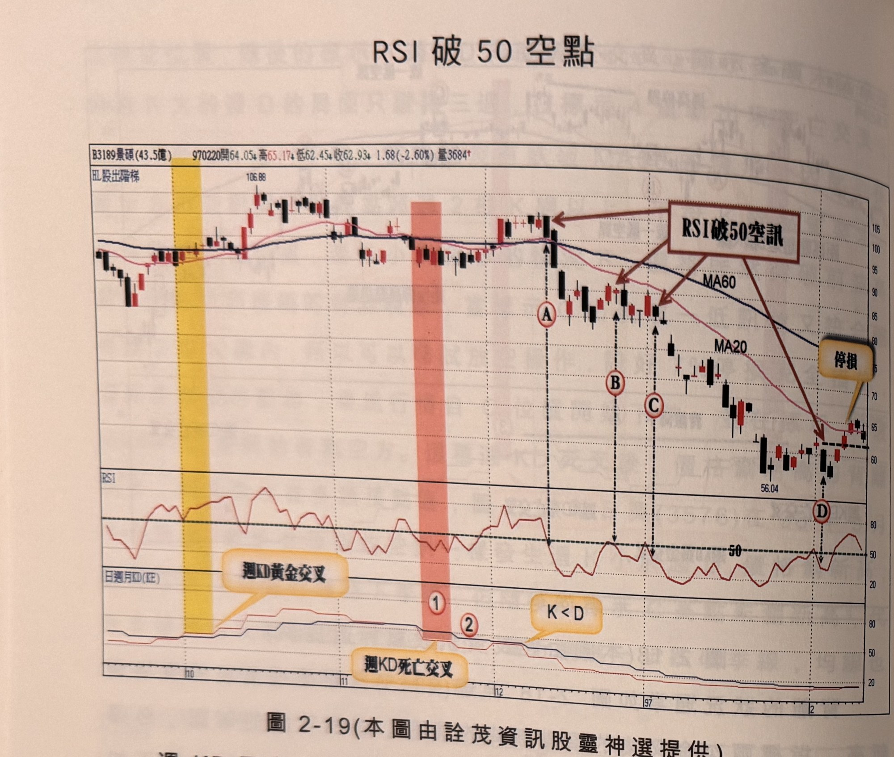
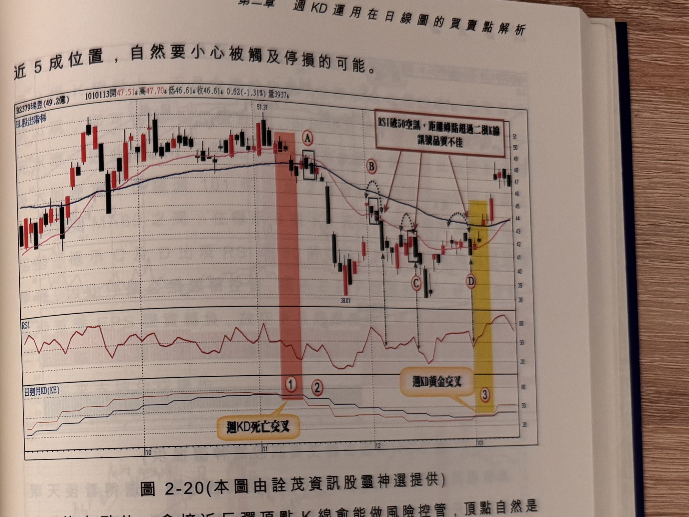

## p.96

RSI 破 50 空點

**圖 2-19**（本圖由詮茂資訊股靈神選提供）

> 圖說：景碩(B3189景碩(43.5億))日線圖，時間戳 970220，開 64.05、高 65.17、低 62.45、收
> 62.93，1.68(-2.60%)，量 3684，含 K 線／均線主圖（標示「以股出蹄樣」）與日週月 KD(KE)、
> RSI 副圖。主圖上以紅色文字框「RSI 破 50 空訊」搭配多個箭頭指向標示 A、B、C、D 四個高點
> 附近的轉折 K 線，末端以文字框「停損」搭配箭頭指出停損觸及位置；副圖以文字框「週 KD 黃金
> 交叉」（黃色網底區間）與「週 KD 死亡交叉」（紅色網底區間，標示①②）以及「K<D」說明對應的
> 交叉時序。低點附近標示 106.88，末端 56.04。

[承上頁] 週 KD 死亡交叉，行情出現跌落到季線的情形，開始
考慮放空操作，如果行情並沒有出現跌破季線或者沒有出現週 KD 背離現象，極可能只是多頭市場
中途的修正行為，不宜看到黑影即開槍；如圖 2-19 景碩(3189)在 96 年除權後，一直呈現貼息狀態，
9 月底出現週 KD 黃金交叉，展開反彈走勢，最後來到除權日參考價的下緣即重新壓回，在 11 月
中旬週 KD 死亡交叉，如標示 1 位置，行情跌破季線，開始觀察反彈後的放空時機，用 RSI 破 50
來作為切入點參考，如標示 A~D 都是 RSI 在跌勢反彈過程，從 50 上下再度跌破 50 的空點參考
位置，其中標示 A 在季線上方放空，要特別注意停損 7% 的設置並嚴格控制突發翻多出現，B 及 C
價位差距不大，屬同階空點，只取 B 放空即可，標示 D 位置已經是價格自高點回落

## p.97

放空點位，愈接近反彈頂點 K 線愈能做到微幅停損；反彈過程任何一根創高的 K 線皆有可能，但當
K 線不再有更高出現時，就表示頂點已出現的可能，當頂點出現後，後 2 根 K 線不管出現破一低或者
RSI 破 50 情形，都提供放空的機會，哪一種訊號先產生，就應該據以進場放空，以圖 2-20 瑞昱
(2379)為例，100 年 11 月第二週出現週 KD 死亡交叉(標示 1)，並從標示 2 開始尋找空訊，第一個
空訊出現在標示 A 位置，是個破一低的空訊，RSI 卻沒有在短暫的反彈走勢中，越過 50 再折回，
只能根據破一低進場放空動作，標示 B、C 及 D 都是 RSI 破 50 的空訊，但都距離反彈頂點位置
超過 2 根 K 線，因此破一低的空點反而比較快速產生，通常反彈速度快且空間大，採取破一低來
找空訊較為合適。

**圖 2-20**（本圖由詮茂資訊股靈神選提供）

> 圖說：瑞昱(B2379瑞昱(49.2億))日線圖，時間戳 1010113，開 47.51、高 47.70、低 46.61、收
> 46.61，0.62(-1.31%)，量 3937，含 K 線／均線主圖（標示「以股出階梯」）與日週月 KD(KE)、
> RSI 副圖。主圖上以紅色文字框「RSI 破 50 空訊，距離峰點超過二根 K 線 訊號品質不佳」搭配
> 多個箭頭指向標示 A、B、C、D 四個轉折 K 線；副圖以文字框「週 KD 黃金交叉」（黃色網底，
> 標示③）與「週 KD 死亡交叉」（紅色網底，標示①②）說明對應的交叉時序；正文前一句「近 5 成
> 位置，自然要小心被觸及停損的可能。」為上頁段落續文。低點附近標示 38.01，高點 51.31。
