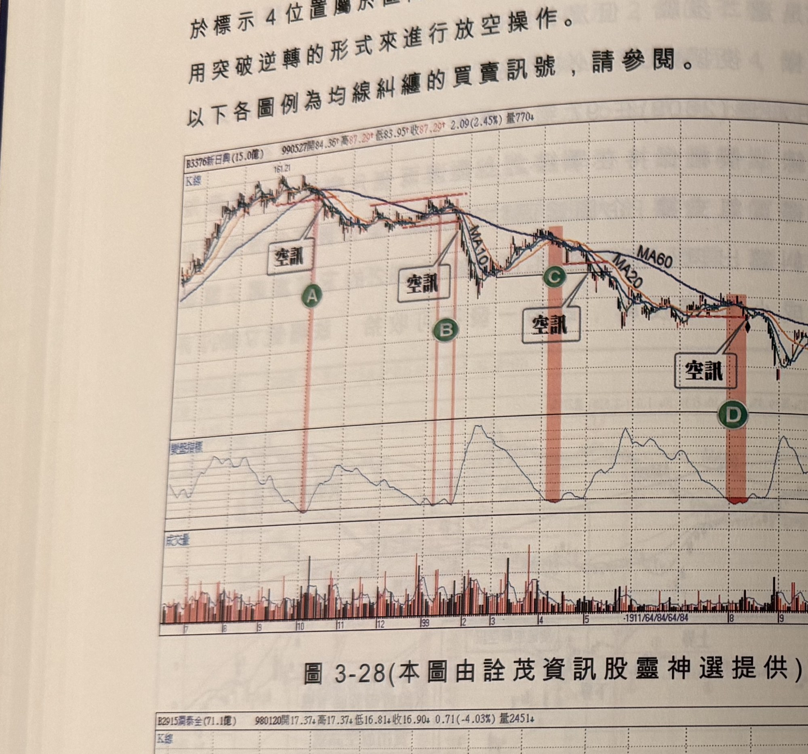
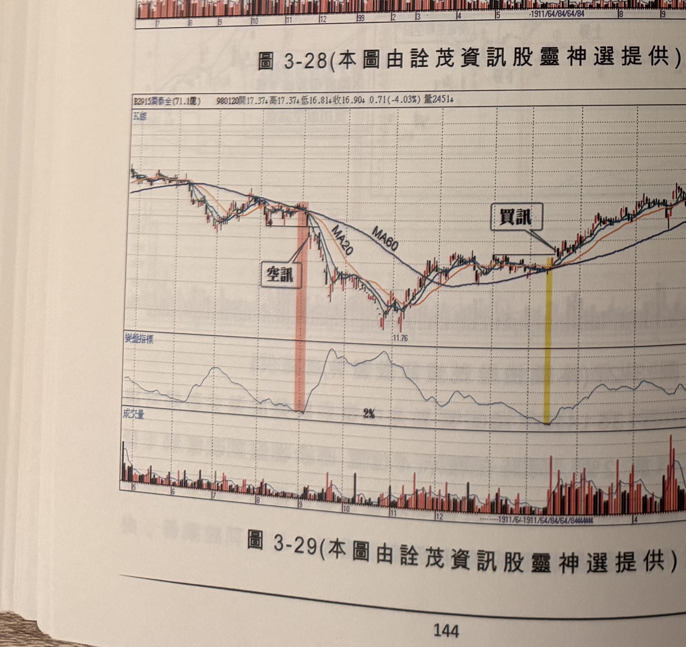
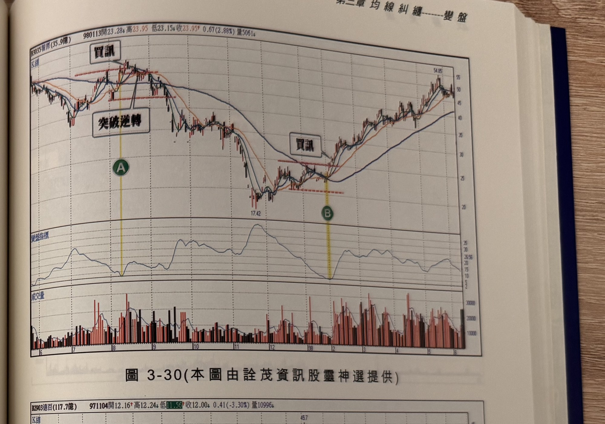
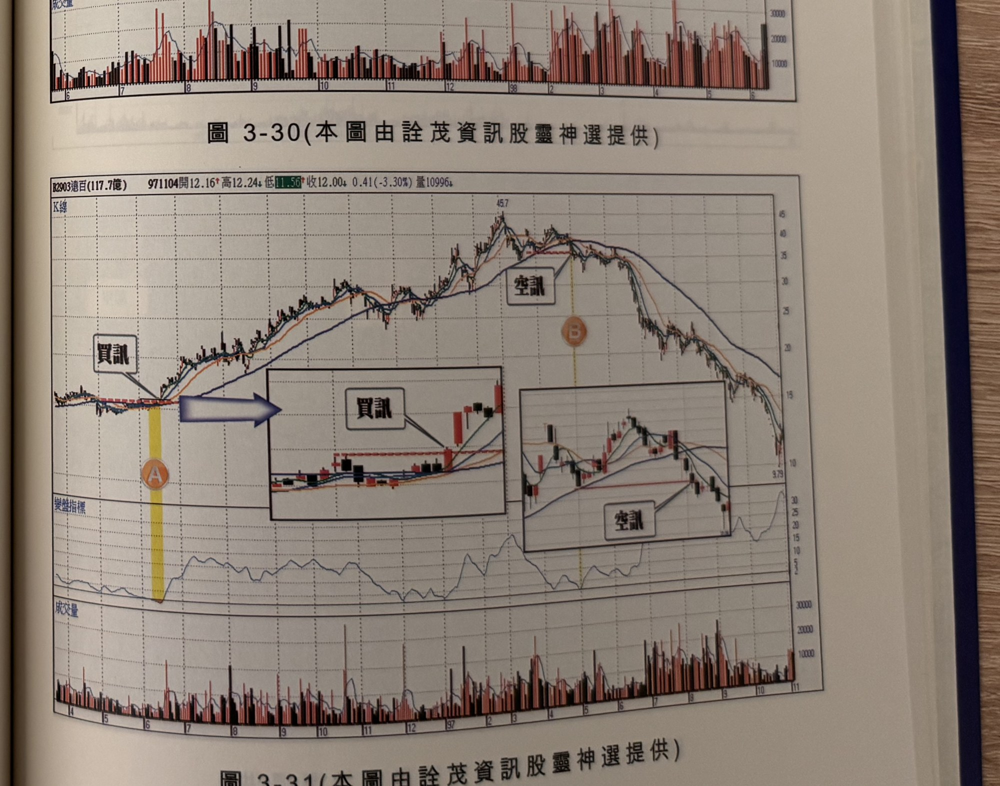

## p.144

於標示 4 位置屬於區間突破 K 線，因此在標示 5 位置，我們可以運用突破逆轉的形式來進行放空
操作。以下各圖例為均線糾纏的買賣訊號，請參閱。

**圖 3-28**（本圖由詮茂資訊股靈神選提供）

> 圖說：新日興(B3376新日興(15.0億))日線圖，時間戳 990527，開 84.36、高 87.29、低 83.95、收
> 87.29，2.09(2.45%)，量 770，含 K 線／均線（MA10、MA20、MA60）主圖與變盤指標、成交量
> 副圖。主圖以文字框「空訊」（四處）分別搭配箭頭指向標示 A、B、C、D 四個高點附近的轉折
> K 線，其中 A、B、C 三處以紅色網底標示對應區間；高點 161.21 起，行情沿 MA10／MA20／MA60
> 均線糾纏區逐波下跌。

**圖 3-29**（本圖由詮茂資訊股靈神選提供）

> 圖說：滿泰全(B2915滿泰全(71.1億))日線圖，時間戳 980120，開 17.37、高 17.37、低 16.81、收
> 16.90，0.71(-4.03%)，量 2451，含 K 線／均線（MA20、MA60）主圖與變盤指標、成交量副圖。
> 主圖以文字框「空訊」搭配箭頭指向左側高點下殺段（紅色網底區間）；右側另以文字框「買訊」
> 搭配箭頭指向底部盤整後突破均線糾纏區的買進 K 線（黃色網底區間）；低點標示 11.76。頁底
> 標示頁碼 144。

## p.145

第三章　均線糾纏-----雙盤

**圖 3-30**（本圖由詮茂資訊股靈神選提供）

> 圖說：智原(B3035智原(35.9億))日線圖，時間戳 980113，開 23.28、高 23.95、低 23.15、收
> 23.95，0.67(2.88%)，量 5061，含 K 線／均線主圖與變盤指標、成交量副圖。主圖以文字框「買訊」
> 搭配箭頭指向左側高點區的買進 K 線，並以文字框「突破逆轉」搭配箭頭指向同一區域內的逆轉
> K 線（對應標示 A，黃色縱線）；右側另以文字框「買訊」搭配箭頭指向底部區突破均線糾纏後的
> 買進 K 線（對應標示 B，黃色縱線）；低點標示 17.42，高點標示 54.95。

**圖 3-31**（本圖由詮茂資訊股靈神選提供）

> 圖說：遠百(B2903遠百(117.7億))日線圖，時間戳 971104，開 12.16、高 12.24、低 11.56、收
> 12.00，0.41(-3.30%)，量 10996，含 K 線／均線主圖與變盤指標、成交量副圖。主圖左側以文字框
> 「買訊」搭配箭頭指向底部起漲 K 線（對應標示 A，黃色縱線），並以放大框顯示該處 K 線細節
> （框內文字「買訊」）；右側高點區以文字框「空訊」搭配箭頭指向對應標示 B 的轉折 K 線，並以
> 放大框顯示該處 K 線細節（框內文字「空訊」）；高點標示 45.7，末端低點標示 9.79。
