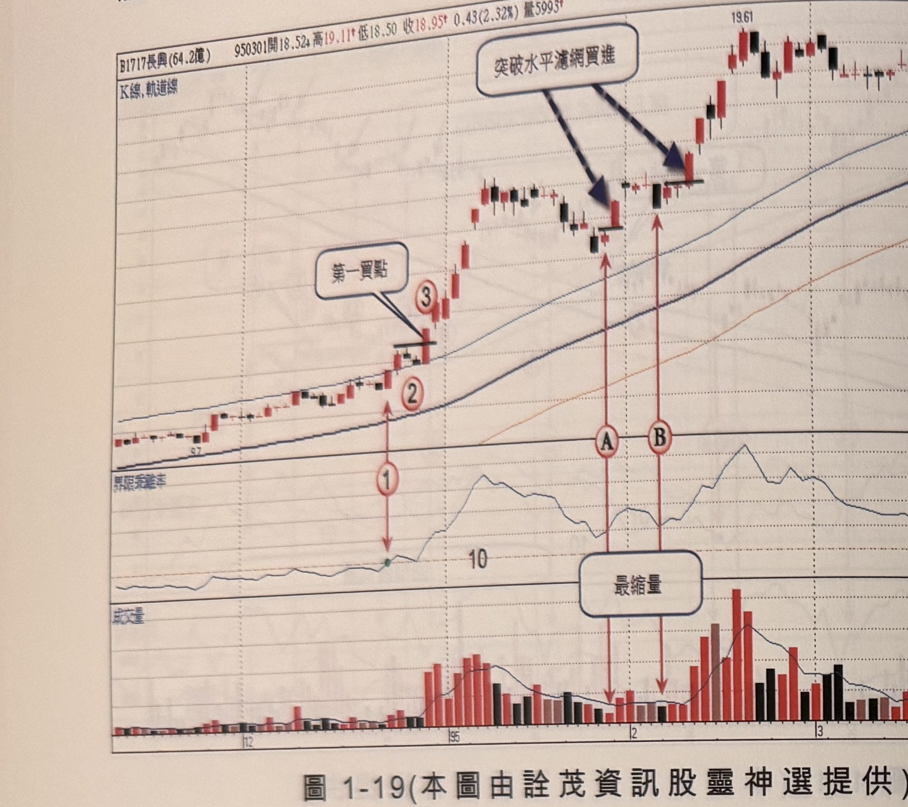
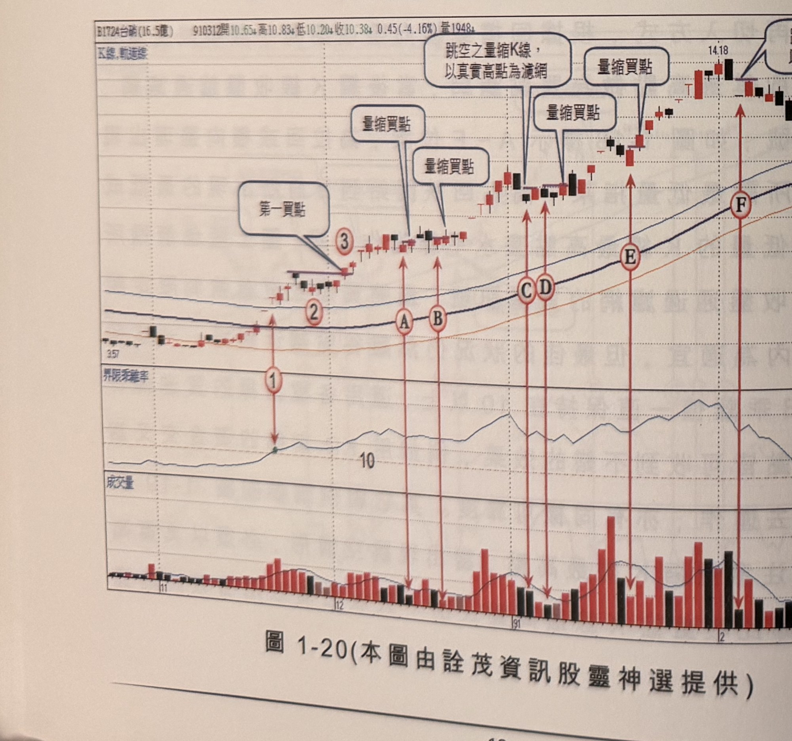

## p.18

**圖 1-19**（本圖由詮茂資訊股靈神選提供）

> 圖說：長興(B1717長興(64.2億))日線圖，時間戳 950301，開 18.52、高 19.11、低 18.50、收
> 18.95，0.43(2.32%)，量 5993，含 K 線／軌道線主圖、（60 日）乖離率副圖與成交量副圖。乖離率
> 副圖上以文字框「第一買點」搭配箭頭標示標號 1、2、3 三個轉折點；主圖上以文字框「突破水平
> 濾網買進」搭配箭頭標示 A、B 兩個買進點，底部成交量副圖以文字框「最縮量」搭配箭頭指向 A、B
> 位置對應的量縮 K 線。

**圖 1-20**（本圖由詮茂資訊股靈神選提供）

> 圖說：台碱(B1724台碱(16.5億))日線圖，時間戳 910312，開 10.65、高 10.83、低 10.20、收
> 10.38，0.45(-4.16%)，量 1948，含 K 線／軌道線主圖與乖離率、成交量副圖。主圖上以文字框
> 「第一買點」搭配箭頭指向標號 3 位置；另以文字框「量縮買點」（三處）分別指向 A、B 與 C 附近
> 的量縮 K 線，其中一處並註記「跳空之量縮K線，以真實高點為濾網」；右側另標示 F、G 兩個轉折
> 點，其中 G 點以文字框「K線品質不佳 不宜小星線」說明該處訊號品質不佳、不適合作為切入點。

## p.19

### 旱地拔蔥走勢的切入法

前面所講的行情在突破 60 日乖離值 10，大都採取溫和式推升，第一段的推升見高，幅度都保持在
乖離率 30 以下，拉回整理到再突破新高，讓人還能慢慢看戲，不會讓感覺急迫思考要不要跳進；但
有些個股在突破乖離值 10 後，呈現直線暴漲，迅速地把乖離值推升到 30，甚至更高的 50 以上，顯然
主力的個性屬於暴走性子，也有可能該股發生重大利多，等到它呈現拉回，股價都已經漲超過 50%，
拉回整理後，即使再突破新高，這個買點也是充滿驚恐，雖然可以用停損 7% 來保護，但一般人總希望
完成三大步驟前，就能上車享受急速快感。

這種類型的個股，常常是有特定主力做暴走式演出，也常常呈現一波到底或兩段式狂拉後，就爆量
急殺結束行情，時間短漲幅驚人，應付這種危險刺激的個股，風險控制要特別嚴格，對於停損砍單的
執行力不夠或臨到手軟者，皆應慎重考量。

當價格突破 60 日乖離值 10，開始出現連續二根漲停板，代表價格極可能呈現暴走，連續漲停推升的
機率大，不須等待完成三大步驟，即可進行買進；當出現第一根漲停收盤，隔天價格繼續攻抵漲停時，
即要準備跳入，雖然未收盤前，要斷定真的漲停作收具有不確定性，一旦漲停又有買不到的困擾；
因此，當下追進漲停時，須預防漲停位置過多的調節量或漲停鎖死被打開，建立半根停板的風險控制
是必要的準備動作，如果收盤非以漲停作收，則最後一盤，當下將股票沖銷平倉出場，如果盤中自
漲停板下殺半根停板，亦要做停損沖銷動作。
