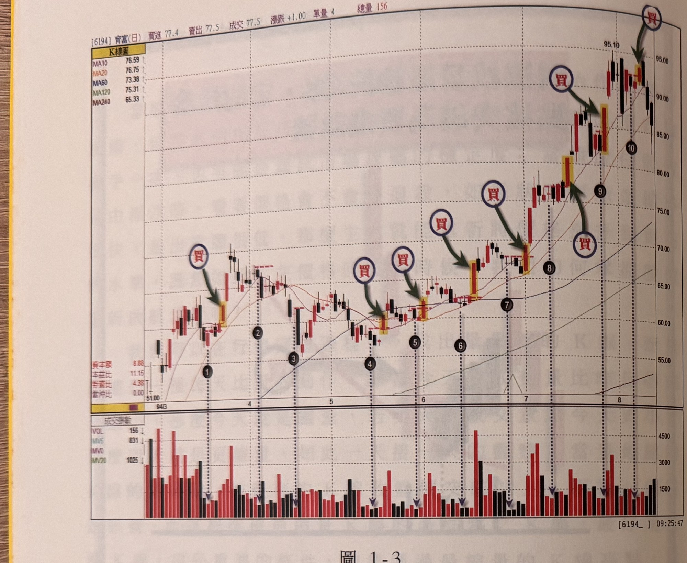
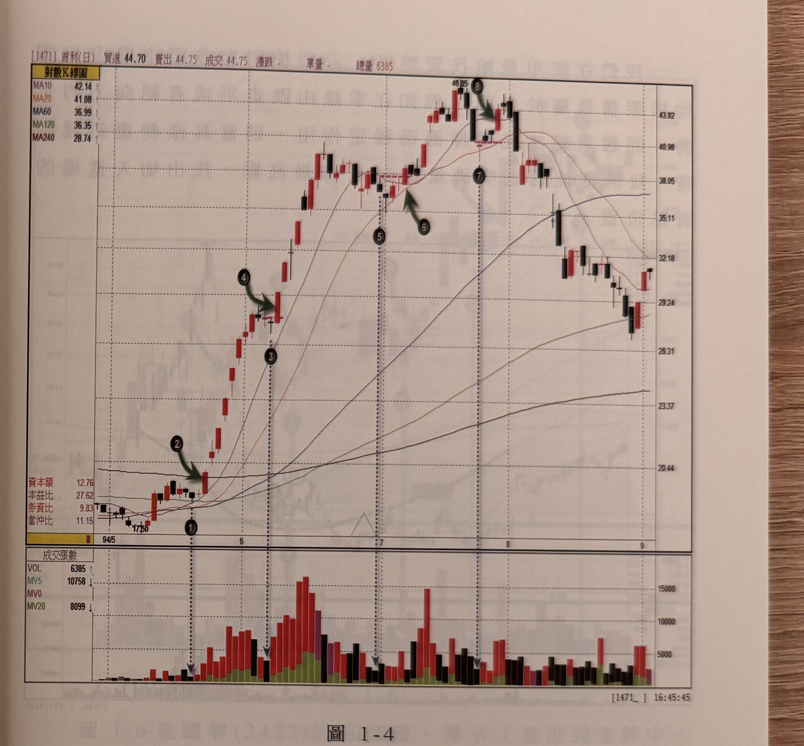
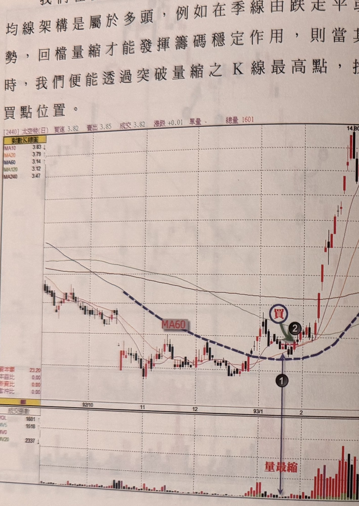
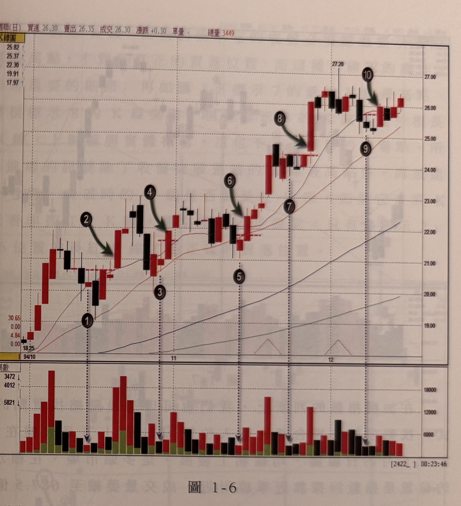
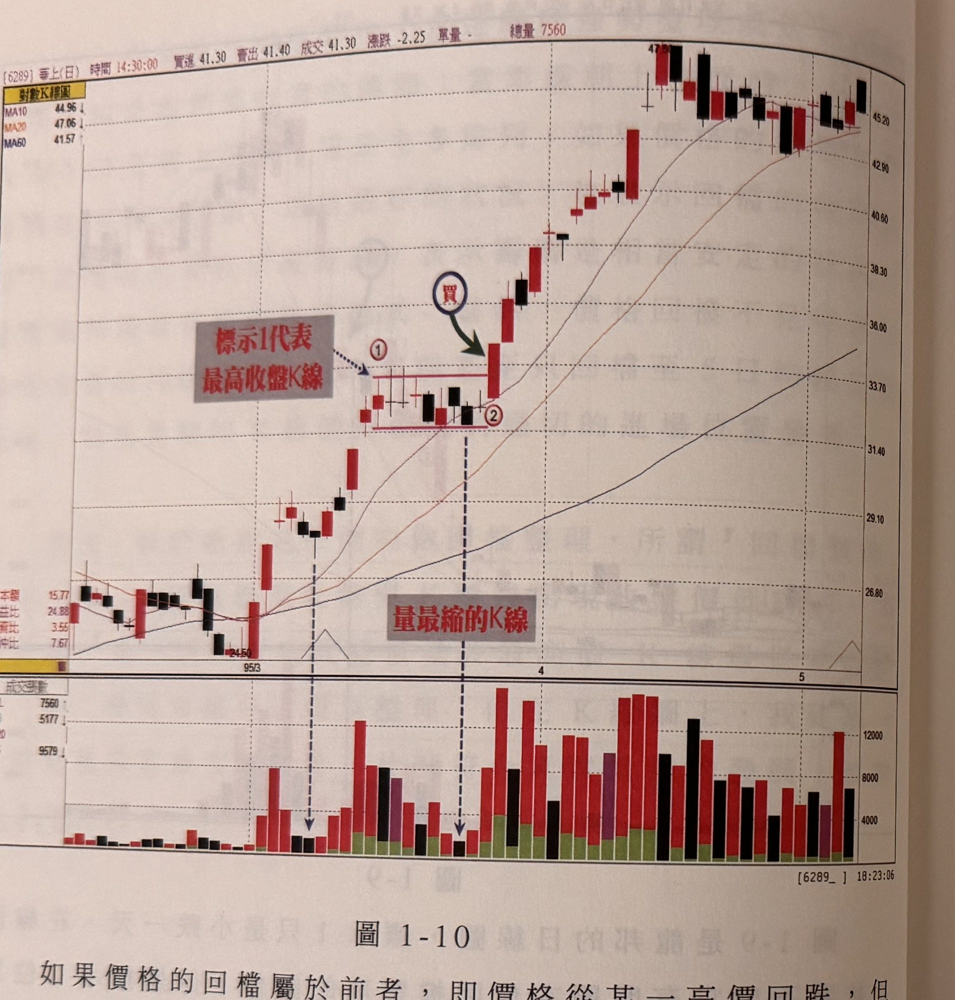
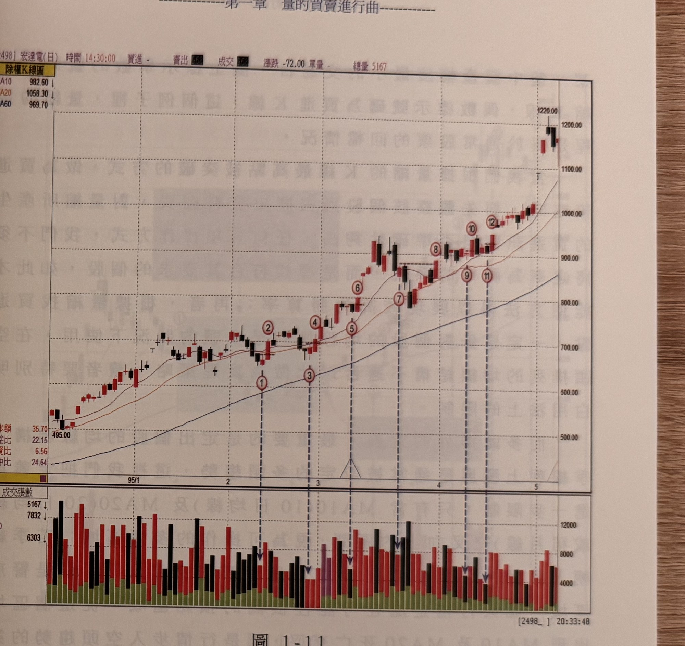
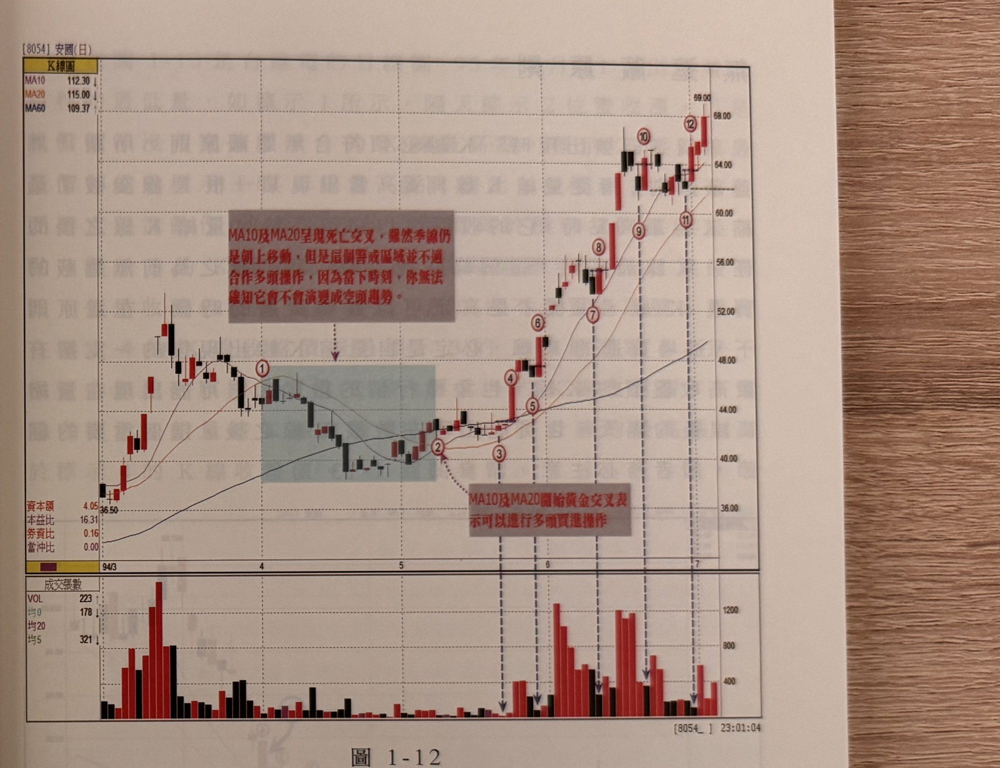
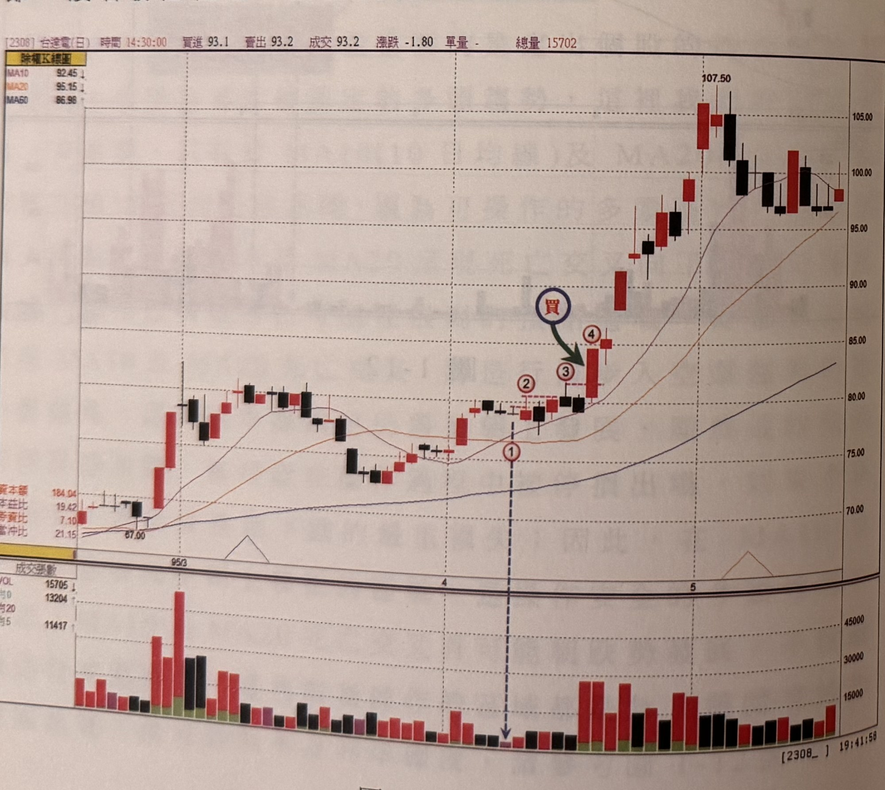
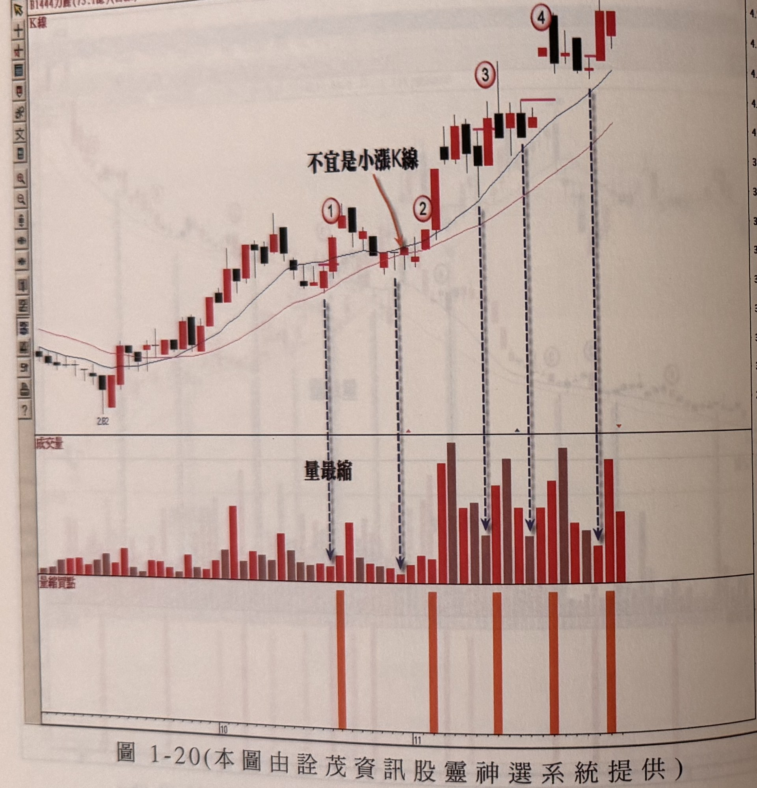
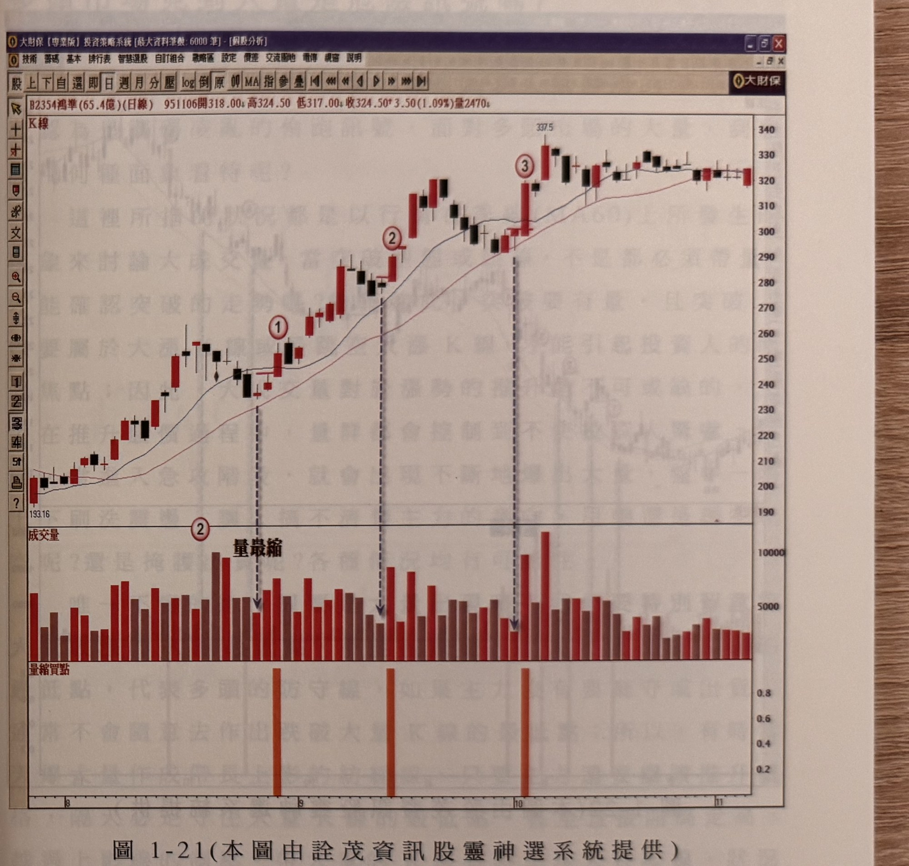

# 量縮找買點（量縮K線最高點突破）

> 一句話摘要：多頭回檔過程中找出「量最縮」的K線，其最高點被後續K線（最好是大漲K線）收盤突破，且該收盤價無任何一根後續K線的最高點遮蔽時，即為買進訊號。

## 1. 核心概念

股價上漲時量能通常隨之放大（籌碼熱絡換手），回檔整理時量能同步縮小則視為籌碼安定，這是價量的良性互動（p.1，圖1-1）。作者不討論量價孰先孰後的學理爭議，只用量來找可靠的買賣訊號（p.1）。

回檔過程中，逐日比對成交量：今日量比昨日小即為「縮量」，若明日更小則更縮，如此逐日觀察，找出過程中量能最小的一天（p.2）。量最縮不代表價格不會再跌，只是行情走到「悶極思變」的關鍵時刻；只有當量縮K線的最高點被後續K線收盤突破，才能確認底部產生——「不要伸手去接正在墜落的刀子」（p.3）。

## 2. 適用前提

- 均線架構須為多頭：季線（MA60）由跌轉平或朝上發展（p.6）。
- 進一步限制操作區間：只在 MA10（10日均線）與 MA20（20日均線／月線）呈黃金交叉向上的區間視為可操作的多頭區域；若季線仍朝上但 MA10、MA20 死亡交叉向下，屬警戒區域，不宜做多，因為這可能是行情步入空頭的第一個徵兆（p.14-15，圖1-12）。
- 個股與加權指數皆適用（p.8-9 為加權指數範例）。
- 使用前宜先觀察該個股歷史資料，確認此訊號對該股的準確度是否夠高，不應將其視為神準系統（p.14）。
- 宜挑選均線排列上升角度較大（熱門股／主流股）的個股操作，準確度較佳（p.20-21）。

## 3. 訊號定義

多方（本方法僅多方，無空方鏡像）：

1. **C1** 多頭均線架構下（見第2節前提），股價自高點進入回檔整理。（p.6, 14）
2. **C2** 回檔整理的定義：某最高收盤價K線之後，出現收盤價低於「該最高價K線」的最低點（p.10）。（另有一種較寬鬆定義：收盤低於前一根K線收盤；作者建議採前者，見第12節待確認事項）
3. **C3** 在整理過程中逐日比對成交量，找出「量最縮K線」：即當日成交量比前一日小，且是目前為止最小的一天；量最縮K線不限定其為紅K或黑K（p.2, 7，圖1-6）。
4. **C4** 買進訊號：之後某根K線的收盤價突破（高於）量最縮K線的最高點（p.2）。
5. **C5「無遮蔽原則」**：該突破K線的收盤價，必須高於自量最縮K線之後所有K線的最高點——也就是它必須是量縮K線出現後收盤價最高的一根K線（p.16-17，圖1-13）。這根K線可能出現在量縮K線隔天，也可能延後數根K線才出現。
6. **C6** 突破K線宜為大漲K線（上影線不能太長）；若只是小漲K線、十字線或長上影線，訊號強度存疑，須待後一根K線的收盤再度站上該K線最高點才算真正確認（p.2, 8-9，圖1-7、1-8）。
7. **C7** 若回檔屬於「橫向整理」型態（收盤價未低於最高收盤K線最低點，僅在高低區間內盤整數日），買進K線須同時突破量縮K線最高點與橫向整理區間的最高點（p.12，圖1-10）。
8. **C8** 量最縮K線出現到其最高點被突破，最好在4天內完成，時間拖太久勝率將降低（p.22）。

## 4. 進場

- 於符合 C3–C7 的突破K線收盤價附近進場（p.2, 16）。
- 若突破K線非長紅K線（十字線、小紅K、長上影線），不視為進場訊號，須等後續K線收盤真正站上該K線最高點才確認進場（p.8-9）。
- 最佳進場時機：均線 MA10/MA20 黃金交叉後的「第一次回檔」量縮買點，通常是整段多頭波段中最佳的切入位置；愈接近頭部的量縮買點被停損機率愈高（p.18-21，圖1-14、1-15、1-16、1-17）。
- 時效性：量最縮K線出現後應在4天內出現突破，超過則訊號可靠度降低（原文僅稱「勝率降低」，未規定超過即不可進場）（p.22）。

## 5. 停損

- 停損設於「突破K線」的最低點下方（p.5，圖1-4：標示2、4、6、8）。
- 若突破K線為跳空，停損改設在前一日收盤價（p.5）。
- 若突破K線並非長紅K線（屬較冒險的買點），停損仍設在該買進K線最低點下方一檔（p.11，圖1-9）。
- 原文未規定固定停損點數或百分比，也未規定停損後是否反手放空。

## 6. 出場 / 停利

- 書中未明確說明本方法本身固定的停利機制。
- 作者建議：黃金交叉後第一次回檔的買點若未被停損，應耐心持有至頭部區；對潛在頭部可用「RSI背離向下」加以篩選（本章未展開其規則，見他處說明）（p.18）。
- 亦可搭配本書「大量K線真實低點跌破」的出場方法使用（見 cz-01-02-大量K線防守與反轉）（p.18）。
- 原文未規定固定停利點數或比例。

## 7. 過濾：不做的情況

- 均線非多頭排列（季線下彎，或 MA10/MA20 死亡交叉）時不宜使用本法找買點（p.14，圖1-12標示1）。
- 突破K線是十字線、小紅K線、或帶長上影線的紅K線，不算有效買進訊號，須待後續K線再確認（p.8-9，圖1-7、1-8）。
- 突破K線之後若有任一根K線的最高點高於它（未達無遮蔽），不算買進訊號（p.16-17，圖1-13）。
- 個股當沖比例長期偏高、量能始終無法真正萎縮者（如宏達電），量縮訊號不易產生，須改從「相對量縮」的K線判斷（p.13-14，圖1-11）。
- 量最縮K線出現後超過4天才被突破，訊號可靠度下降（p.22）。

## 8. 範例解析


- **圖1-1**（中興電）：上攻帶量、回檔量縮的價量良性互動示意，對應核心概念（p.1）。


- **圖1-2**（示意圖）：量最縮K線最高點被突破為買進訊號的概念圖（p.3）。


- **圖1-3**（育富）：標示1、4~10共8個量縮K線被突破形成買點；標示2、3量縮後仍續跌，說明量縮非底部保證（p.4）。


- **圖1-4**（首利）：標示1、3、5、7為量縮K線，標示2、4、6、8為對應買進K線＋停損參考低點（p.5）。


- **圖1-5**（太空梭）：季線由下彎轉走平後，量縮K線最高點突破形成買點，股價其後急漲（p.6）。


- **圖1-6**（國聯）：標示1、3、5量縮K線皆為紅K，說明量最縮K線不限方向；標示2、4、6、8為對應買點（p.7）。


- **圖1-7、圖1-8**（加權指數）：標示1（縮量687.5億）被標示2突破為買點；標示5、6突破但非長紅K線（十字線／長上影線），非有效買點，須待下一根確認（p.8-9）。


- **圖1-9**（龍邦）：標示2符合「收盤低於最高價K線最低點」的整理定義，隔日量最縮，其後突破形成買點；突破K線非長紅，屬冒險買點，停損設最低點下方一檔（p.10-11）。


- **圖1-10**（華上/亭上）：橫向整理型態，買進K線需同時突破量縮K線最高點與整理區間最高點（p.12）。


- **圖1-11**（宏達電）：當沖比例常態逾25%，價跌量不真縮，須觀察相對量縮K線（p.13-14）。


- **圖1-12**（安國）：標示1處MA10/MA20死亡交叉但季線仍朝上，屬警戒區不宜做多；標示2重新黃金交叉後才可操作（p.14-15）。


- **圖1-13**（台達電）：標示1量縮，標示2、3雖創高但收盤未突破前高（未達無遮蔽），標示4收盤同時越過1、2、3之最高點，才是符合無遮蔽原則的買進K線（p.16-17）。


- **圖1-14**（可成）：標示1為整波段最佳買點；標示2會觸及停損；標示3~5為後續回檔買點（p.18）。


- **圖1-15**（百容）：黃金交叉後第一次回檔量縮買點示範，並提及可將訊號指標化（p.19）。


- **圖1-16**（廣宇）：黃金交叉後第一次拉回買點示範（p.20）。


- **圖1-17**（允強資）：93年初鋼鐵類股主流族群，標示1為黃金交叉後首次回檔買點（含停損位置），標示2為最佳切入時機（p.21）。


- **圖1-18**（華宇）、**圖1-19**（億光）：多組量縮買點連續示例，供讀者印證4天內突破的時效原則（p.22-23）。


- **圖1-20**（力麗）：說明突破K線若僅為小漲K線則不宜視為理想買點（p.24）。


- **圖1-21**（鴻準）：p.25 只有此圖與圖說，無正文說明（p.25）。


- **圖1-22**（亞崴）：多組量縮買點示例（p.26）。

## 9. 作者提醒與常見錯誤

- 量縮不代表低點已確立，只有等突破才能確認（p.3）。
- 「逢低買進、逢高賣出」過於籠統，操作應以「收盤突破量縮K線最高點」明確界定進場時機（p.4）。
- 使用前須針對個股先驗證歷史準確度，不是萬用系統（p.14）。
- 當沖比例長期偏高、價跌量不真縮的個股（如宏達電）不適用一般量縮判斷（p.13-14）。
- 突破時間不宜拖過4天，時間越長勝率越低（p.22）。
- 突破K線的品質很重要：大漲K線優先，上影線不能太長（p.2, 22）。

## 10. 規則速查（Checklist）

- [ ] 季線（MA60）走平或朝上
- [ ] MA10 與 MA20 呈黃金交叉（非死亡交叉警戒區）
- [ ] 找到本波段回檔中的量最縮K線
- [ ] 找出後續收盤突破量最縮K線最高點的K線
- [ ] 該突破K線收盤價無任何後續K線最高點遮蔽（無遮蔽原則）
- [ ] 突破K線宜為大漲K線，上影線不宜過長
- [ ] 若為橫向整理型態，同時突破整理區間最高點
- [ ] 量最縮K線出現後4天內完成突破
- [ ] 停損設於突破K線最低點下方（跳空則設前一日收盤價）

## 11. 機器可讀規則

```yaml
signal: 量縮K線最高點突破（量縮找買點）
side: long
timeframe: daily
market_context:
  - id: M1
    desc: 季線(MA60)走平或朝上發展（多頭市場）
    source: p.6
  - id: M2
    desc: MA10 與 MA20 呈黃金交叉（向上排列）；死亡交叉區間為警戒區不宜使用
    source: p.14-15
conditions:
  - id: C1
    desc: 股價自高點進入回檔整理（收盤價低於前段最高收盤K線的最低點）
    source: p.10
  - id: C2
    desc: 逐日比對量能，找出量最縮K線（當日量 < 前一日量，且為目前最小）
    source: p.2
  - id: C3
    desc: 之後某根K線收盤價突破量最縮K線最高點
    source: p.2
  - id: C4
    desc: 無遮蔽原則，該K線收盤價須高於量最縮K線之後所有K線的最高點
    source: p.16-17
  - id: C5
    desc: 突破K線宜為大漲K線（上影線不宜過長）；若否須待下一根收盤再突破確認
    source: p.8-9
  - id: C6
    desc: 若回檔屬橫向整理型態，突破K線須同時越過整理區間最高點
    source: p.12
  - id: C7
    desc: 量最縮K線出現後4天內完成突破為佳
    source: p.22
entry:
  price: 突破K線收盤價（符合C3~C6）
  timing: 訊號K線收盤當下或隔日
  source: "p.2, p.16"
stop_loss:
  ref: 突破K線最低點下方；跳空則設前一日收盤價；突破K線非長紅時仍設於該K線最低點下方一檔
  points: 原文未規定固定點數
  source: "p.5, p.11"
exit: 書中未明確說明本方法固定停利規則；建議搭配大量K線真實低點跌破（cz-01-02）或RSI背離判斷頭部（本章未展開）
filters:
  - desc: 均線非多頭排列（季線下彎或MA10/MA20死亡交叉）不使用本法
    source: p.14
  - desc: 突破K線為十字線／小紅K／長上影線不算有效訊號
    source: p.8-9
  - desc: 個股當沖比例長期偏高、價跌量不縮者，量縮訊號不易產生（需找相對量縮）
    source: p.13-14
```

## 12. 待確認事項

- 「回檔整理」的定義原文列出兩種可能：①收盤價低於前一K線收盤，②收盤價低於最高價K線的最低點（p.10）。作者建議採用後者，但未明說是否排除前者的適用性，屬規則定義上的模糊處；本文條件 C1 採後者。

## 13. 原文出處

- `extracted/pages/IMG_8715.md`（p.1）
- `extracted/pages/IMG_8716.md`（p.2-3）
- `extracted/pages/IMG_8717.md`（p.4-5）
- `extracted/pages/IMG_8718.md`（p.6-7）
- `extracted/pages/IMG_8719.md`（p.8-9）
- `extracted/pages/IMG_8720.md`（p.10-11）
- `extracted/pages/IMG_8721.md`（p.12-13）
- `extracted/pages/IMG_8722.md`（p.14-15）
- `extracted/pages/IMG_8723.md`（p.16-17）
- `extracted/pages/IMG_8724.md`（p.18-19）
- `extracted/pages/IMG_8725.md`（p.20-21）
- `extracted/pages/IMG_8726.md`（p.22-23）
- `extracted/pages/IMG_8727.md`（p.24-25）
- `extracted/pages/IMG_8728.md`（p.26，前半）
