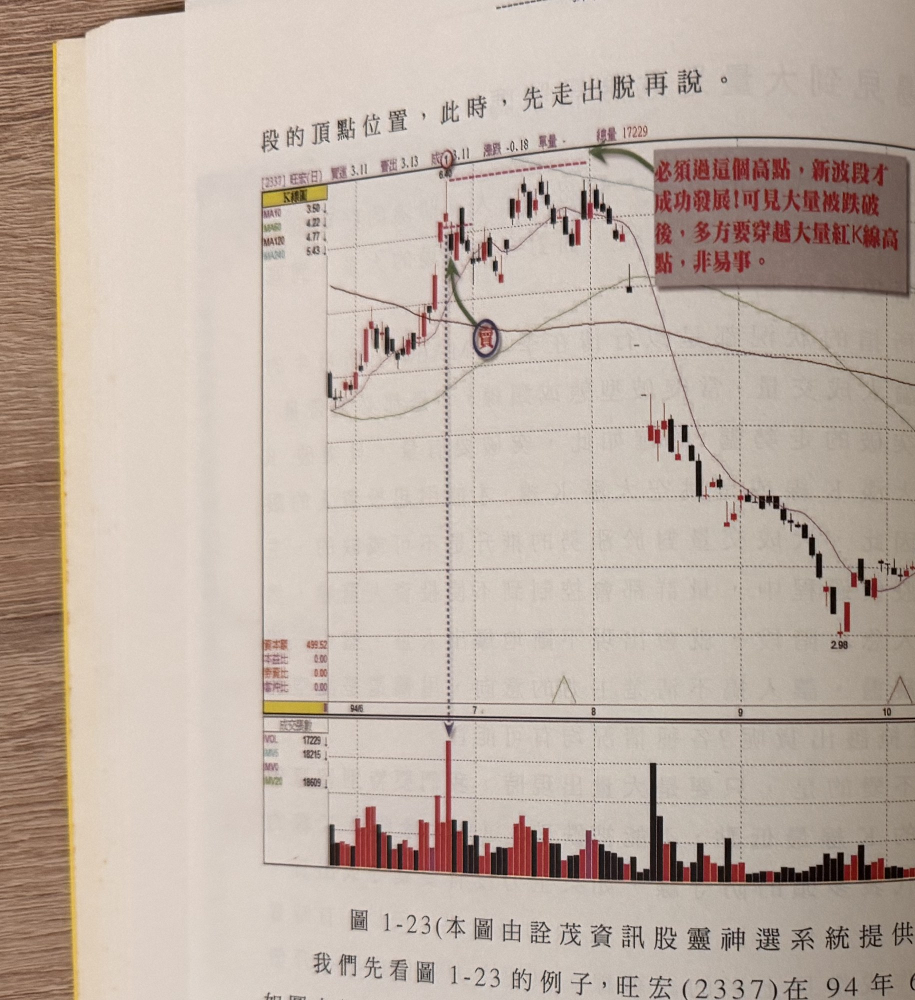
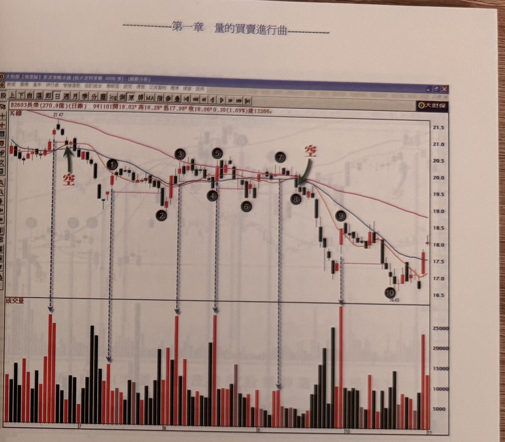

# 大量K線真實低點跌破（多頭出場 / 空頭反彈放空）

> 一句話摘要：大量K線的「真實低點」（K線最低價與前一日收盤價孰低）代表當時多頭防守位置；此低點在多頭市場被跌破是出場訊號，在空頭市場反彈段被跌破則是放空訊號。

## 1. 核心概念

大成交量的意義具爭議：可能是人氣鼎沸的好現象，也可能是籌碼凌亂、主力調節出貨的偷跑訊號（p.27）。作者提出的判斷關鍵是：只要大量K線的「真實低點」未被跌破，代表主力尚無棄守或出貨跡象；一旦這個低點被之後的行情收盤跌破，代表主力調節出貨開始進行，或準備壓回整理（p.27-29）。

此邏輯在多頭市場（季線之上）用於「出場／減碼」判斷（p.27-32）；在空頭市場（季線之下）的反彈末端則反過來用於「放空進場」判斷（p.33起）——兩者是同一核心概念在多空情境下的不同應用，因此合併為一份文件，分別列出多方與空方規則。

## 2. 適用前提

**多方（出場）**
- 行情處於季線（MA60）之上（p.27, 29）。
- 大量K線可以是本波段以來最大量，也可以是歷史罕見的「天量」；後者的防守意義更為強烈（p.29）。

**空方（放空）**
- 季線（MA60）向下發展的空頭趨勢（p.33）。
- 針對「反彈格局」中出現的大量K線，且反彈時間須超過4天期間；一般下跌途中偶見的大量K線不在討論範圍（p.33）。
- 大量K線宜出現在自低點反彈的第3天之後才列入觀察；若第1、2天就出現大量，不作為觀察對象（p.36-37，圖1-30標示9）。

## 3. 訊號定義

**多方（出場訊號）**

1. **D1** 行情處於季線之上，出現「大量K線」——比先前出現的量更大，或爆出歷史罕見的天量（p.27, 29）。
2. **D2** 大量K線的「真實低點」＝取該K線最低價與前一日收盤價兩者孰低（p.29-30）。
3. **D3** 之後任一根K線收盤價跌破該真實低點 → 出場訊號（p.28-30）。實務操作建議「見價就算跌破」（p.30）。
4. **D4** 若大量K線之後量能迅速萎縮到之前波段起攻時的縮量水準，即使真實低點被跌破，也只是拉回整理，不代表籌碼失控或趨勢反轉（p.31-32）。
5. **D5** 若後續反彈無法以收盤價突破前次大量K線的最高點，波段行情可能不再創新高（p.29）。

**空方（放空進場訊號）**

1. **E1** 行情處於季線之下的空頭趨勢，反彈時間超過4天（p.33）。
2. **E2** 反彈過程中出現「大量K線」，須為反彈第3天之後出現者才列入觀察對象（p.36-37）。
3. **E3** 大量K線的真實低點被之後的K線收盤跌破 → 放空訊號（p.33-38）。
4. **E4** 特例：若該大量K線本身帶有跳空缺口，而之後某根K線同時跌破「該大量K線最低點」與「前2根K線最低點」，即使尚未跌破大量K線真實低點，亦可視為放空訊號成立，不必等真實低點被跌破（p.38，圖1-28南亞科範例）。
5. **E5** 大量的認定是相對區間而言：若大量K線之後價漲量縮，隨後再度出現量增，則以新的量增K線重新起算為觀察對象的大量K線（p.42，圖1-31凌陽範例）。
6. **E6** 訊號時效：大量K線出現後，最好在4天內看到真實低點被跌破；超過4天，訊號可靠度下降，甚至可能反彈創更高點（p.37, 40-41，圖1-30）。
7. **E7** 最佳空點位置：季線由上彎轉向下發展的初期（相當於MA20死叉MA60向下的初期）第一次反彈的大量K線低點跌破，風險最小、勝率最高；跌幅已超過頭部下跌5成以上的末跌段不宜追空，除非有重大基本面利空（如轉盈為虧、大幅調降財測）（p.40）。

## 4. 進場

- **多方**：本方法為出場方法，不含新的多方進場規則，進場沿用其他買進方法（如 cz-01-01 量縮找買點）。
- **空方**：於反彈大量K線之真實低點被收盤跌破當日（或滿足E4特例）放空進場；原文以「隔日／當日跌破」為觀察依據，未規定固定進場價位公式（p.33-38）。

## 5. 停損

**空方**
- 若放空當根K線（跌破當根）本身為長黑K線，停損設在該長黑K線最高點上方一檔（p.33-34, 37）。
- 若放空K線非長黑K線，停損設在最近峰頂（前波高點）上方一檔（p.33-34）。

**多方（出場）**：此為出場訊號本身（了結多單），非停損規則；書中未另訂出場後再進場的停損。

## 6. 出場 / 停利

**多方**
- 訊號成立（真實低點被跌破）本身即為出場（了結多單）動作。
- 若後續量能快速萎縮至先前起漲的低量水準附近，原文提及「可以選擇接回」，但未給明確價位或數值門檻（p.32）。
- 若採均線跌破方式作為出場依據，大量K線最低點跌破只是提醒訊號之一；書中依股性建議不同出場機制：天天漲停的強勢股以「每根K線收盤」做停利位置；一般個股用均線跌破觀察出場；上升角度陡的強勢股可用「收盤跌破前4天區間內最低點」做出場點（p.32，三者並列，未說明如何選擇）。
- 爆天量的K線最低點若被跌破，是非常強烈的出場訊號（p.32）。

**空方**：書中未明確說明本訊號的固定停利／出場方法（原文未規定）。

## 7. 過濾：不做的情況

- 一般下跌途中偶見的大量K線，不在空方觀察範圍內，僅反彈格局中的大量才列入觀察（p.33）。
- 反彈大量K線出現在反彈第1、2天者不列入觀察，須第3天之後（p.36-37，圖1-30標示9）。
- 訊號出現距大量K線超過4天以上者，風險提高、可靠度降低（p.36-37, 40-41）。
- 跌幅已超過頭部下跌5成以上的末跌段，除非有重大基本面利空，否則不宜追空（p.40）。
- 放空訊號出現前，若均線已呈現黃金交叉一段時間，放空風險提高（容易在MA10、MA20獲得支撐而橫盤或再創反彈高點）（p.34-35, 39）。

## 8. 範例解析

**多方（出場）**


- **圖1-23**（旺宏）：94年6月底爆超大量流星線，隔日收盤跌破其最低價，形成出場訊號；出脫後股價於高檔盤整月餘後崩跌至2.98元（p.28-29）。


- **圖1-24**（微星）：大量K線最低點在13天整理過程未被跌破，其後再出更大量長紅K線延續漲勢；圖上黑色號碼球所示的大量K線最低點可作進場風險位置或最大停損停利點（p.30-31）。


- **圖1-25**（光寶科）：大量K線隔天開高走低跌破真實低點，形成出場訊號，行情轉為區間整理，成交量迅速萎縮（p.31）。

**空方（放空）**


- **圖1-26**（華通）：空頭市場反彈初期出現帶上影線紡綞線大量K線，隔日跌破其最低點即為放空時機；停損依是否為長黑線分別設定（p.34）。


- **圖1-27**（光磊）：說明選擇反彈大量K線放空前，應觀察MA10/MA20是否剛交叉；已交叉一段時間者放空風險提高（p.35-36）。


- **圖1-28**（陽明）：示範應取反彈第3天之後的大量K線（標示2）而非過早出現的大量（標示1）作為觀察對象；標示7的大量K線於4天內被跌破，為較理想訊號（p.36-37）。


- **圖1-28（南亞科，原書重複編號，本文檔名以 p38-1 區分）**：大量K線本身帶跳空缺口時，可於同時跌破「大量K線最低點」與「前2根K線最低點」的位置即放空，不必等真實低點被跌破（E4特例）（p.38）。


- **圖1-29**（新巨）：大量K線隔日即被黑K線跌破最低點，應立即出脫了結，後續走勢展開無情空頭（p.39）。


- **圖1-30**（長榮）：對照多組反彈大量K線的跌破時效——標示1花12天才跌破（訊號不佳，隨後反彈創更高點）；標示3花8天；標示5超過4天；只有標示7在4天內跌破（標示8）為較可靠訊號；標示9因反彈僅第2天出現大量，不列入觀察（p.40-41）。


- **圖1-31**（凌陽）：反彈最大量不一定在最高峰；標示2大量後價漲量縮，標示3重新量增，可重新起算為觀察對象的大量K線（E5規則示範）（p.42）。


- **圖1-32**（矽統）、**圖1-33**（技嘉）：供讀者自行參考演練的放空範例，頁面無額外說明文字（p.43）。

## 9. 作者提醒與常見錯誤

- 大量K線最低點被跌破後若量能迅速萎縮，說明籌碼並未失控，只是拉回整理，多頭格局不致破壞（p.32）。
- 天量K線的最低點若被跌破，是非常強烈的出場訊號，必須格外重視（p.32）。
- 空頭放空的最佳時機在起跌區（季線剛轉空頭初期），而非跌幅已深的末跌段（p.40）。
- 均線已呈黃金交叉一段時間後才出現的反彈大量K線，放空需格外小心，停損被觸及機率較高（p.34-35, 39）。

## 10. 規則速查（Checklist）

- [ ] 多方：季線之上，出現大量K線（本波段最大量或歷史天量）
- [ ] 計算大量K線真實低點 = min(最低價, 前一日收盤價)
- [ ] 多方：收盤跌破真實低點 → 出場
- [ ] 空方：季線之下的空頭趨勢，反彈超過4天
- [ ] 空方：反彈第3天之後出現的大量K線才列入觀察
- [ ] 空方：大量K線真實低點被收盤跌破（或滿足跳空特例E4）→ 放空
- [ ] 空方停損：長黑K線設其最高點上方一檔；非長黑K線設最近峰頂上方一檔
- [ ] 訊號時效：大量K線出現後4天內完成跌破為佳
- [ ] 空方：跌幅已超過頭部下跌5成的末跌段不宜追空

## 11. 機器可讀規則

```yaml
signal: 大量K線真實低點跌破
side: both
timeframe: daily
conditions_long_exit:
  - id: D1
    desc: 行情在季線之上，出現大量K線（本波段最大量或歷史天量）
    source: p.27, p.29
  - id: D2
    desc: 真實低點 = min(當根最低價, 前一日收盤價)
    source: p.29-30
  - id: D3
    desc: 之後K線收盤價跌破真實低點
    source: p.28-30
conditions_short_entry:
  - id: E1
    desc: 季線向下的空頭趨勢，反彈超過4天
    source: p.33
  - id: E2
    desc: 反彈第3天之後出現的大量K線
    source: p.36-37
  - id: E3
    desc: 大量K線真實低點被收盤跌破
    source: p.33-38
  - id: E4
    desc: 特例，大量K線帶跳空缺口時，同時跌破其最低點與前2根K線最低點即可視為訊號成立
    source: p.38
  - id: E5
    desc: 若大量K線後價漲量縮再量增，以新量增K線重新起算為觀察對象
    source: p.42
entry:
  long: 無新增規則，沿用其他買進方法（見 cz-01-01）
  short: 大量K線真實低點被收盤跌破當日（或滿足E4特例）
  source: "p.33-38"
stop_loss:
  short_long_black: 長黑K線最高點上方一檔
  short_other: 最近峰頂上方一檔
  source: "p.33-34, p.37"
exit:
  long: 訊號本身即為出場；量急縮至先前起漲低量水準可考慮接回（原文未給數值門檻）；亦可依股性選用逐K收盤停利／均線跌破／前4天低點跌破三種方式之一
  short: 書中未明確說明
  source: "p.31-32"
filters:
  - desc: 一般下跌途中的大量K線不列入空方觀察
    source: p.33
  - desc: 反彈第1、2天出現的大量K線不列入觀察
    source: p.36-37
  - desc: 訊號距大量K線超過4天，可靠度下降
    source: p.36-37, p.40-41
  - desc: 跌幅已超過頭部下跌5成的末跌段不宜追空
    source: p.40
```

## 12. 待確認事項

- 空方特例 E4（大量K線帶跳空缺口時，允許以「同時跌破前2根K線最低點」提前判定放空，不必等真實低點被跌破）原文僅以南亞科一例（p.38）示範，未明確說明此特例是否僅適用於「大量K線本身帶缺口」的狀況，抑或可推廣至一般非跳空大量K線；本文僅在大量K線帶缺口的情境下採用此特例（依原文情境限定，未推廣）。

## 13. 原文出處

- `extracted/pages/IMG_8728.md`（p.27，後半）
- `extracted/pages/IMG_8729.md`（p.28-29）
- `extracted/pages/IMG_8730.md`（p.30-31）
- `extracted/pages/IMG_8731.md`（p.32-33）
- `extracted/pages/IMG_8733.md`（p.34-35）
- `extracted/pages/IMG_8734.md`（p.36-37）
- `extracted/pages/IMG_8735.md`（p.38-39）
- `extracted/pages/IMG_8736.md`（p.40-41）
- `extracted/pages/IMG_8737.md`（p.42-43）
- `extracted/pages/IMG_8739.md`（p.44，前半）
