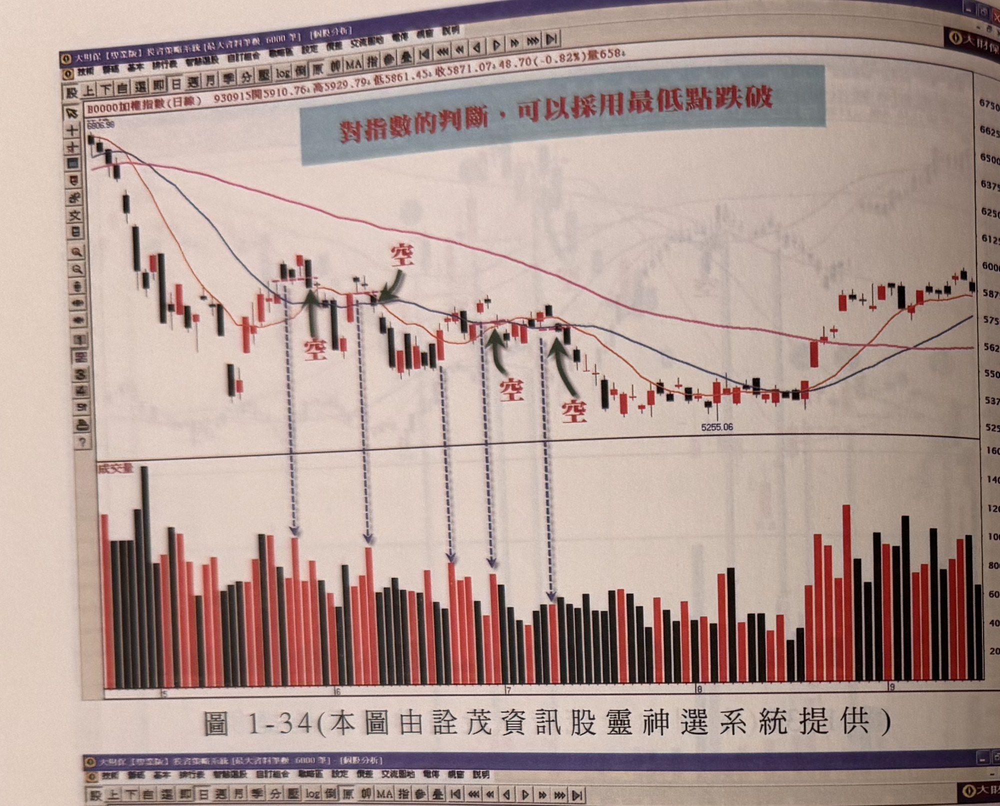
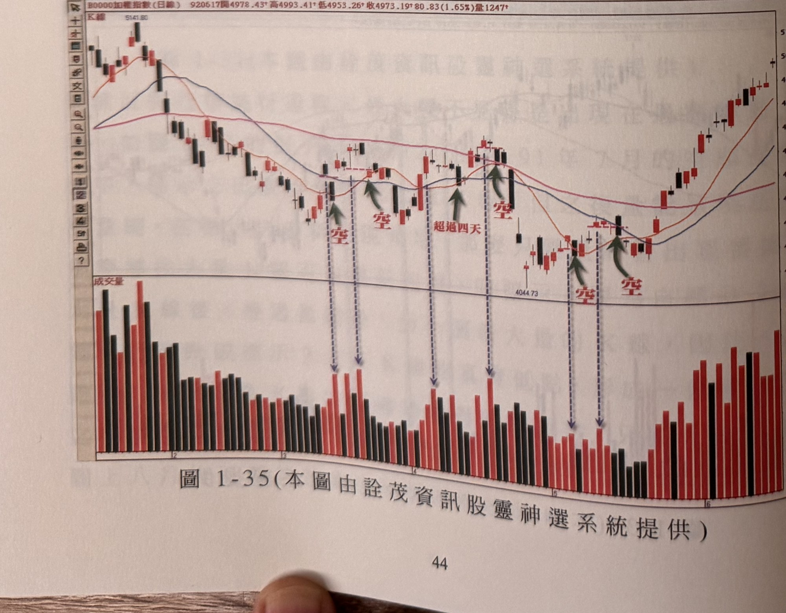
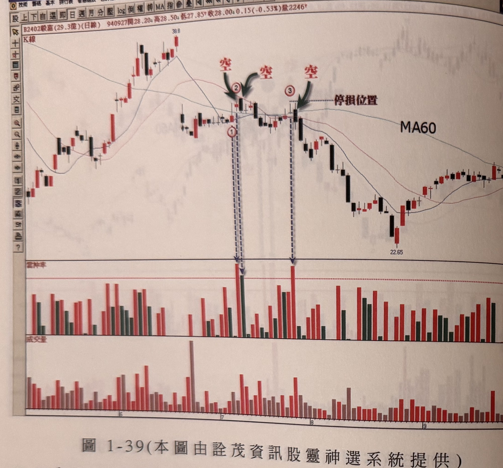
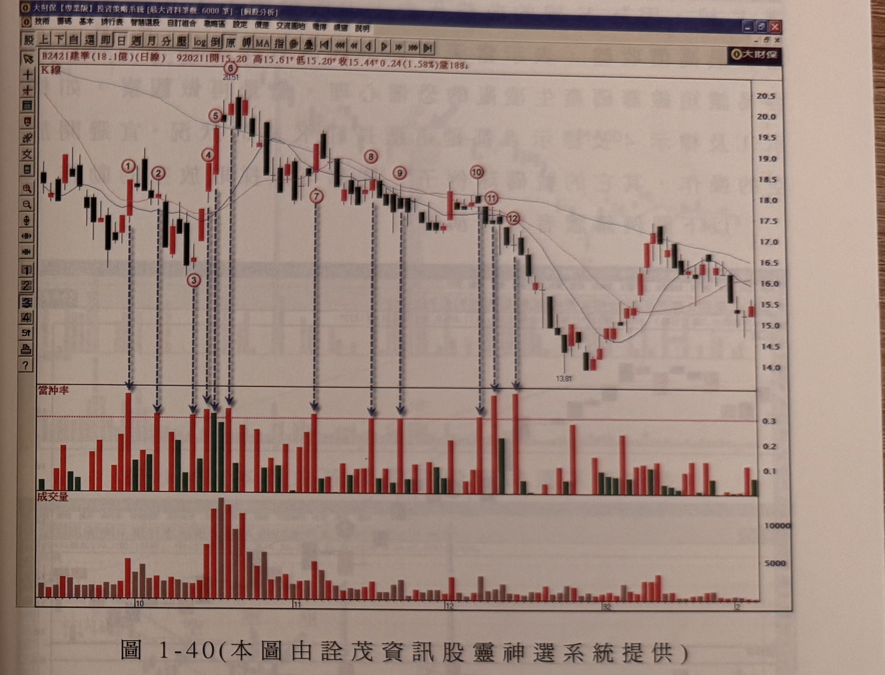
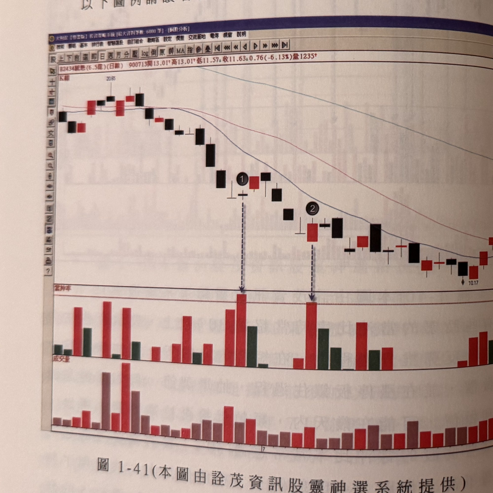
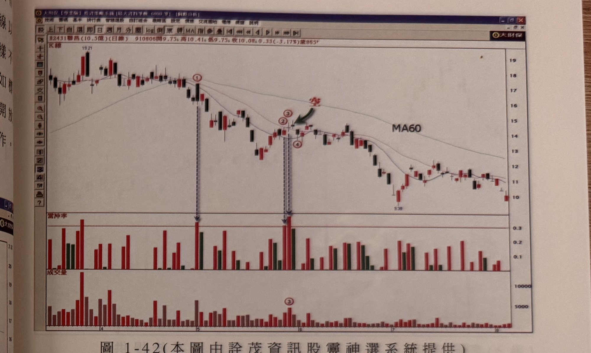
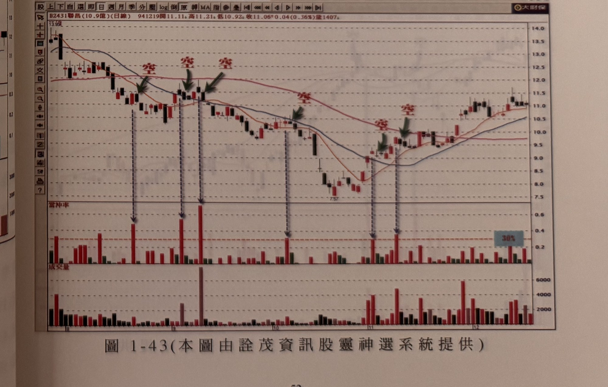

# 從當沖比率看放空操作

> 一句話摘要：空頭市場中，當日當沖比率達三成以上且該K線非長紅K線時，表示主力當日無意留倉、籌碼易生凌亂，隔日可掛平盤（開盤）價放空。

## 1. 核心概念

當沖（融資融券當日差價）常被視為短線帽客的行為，但實際主導當日成交量的往往是背後主力作手。主力盤中以左手買進右手掛出的方式製造大量假象，吸引「見量即追」的買盤進場，藉此借力使力推升價格；但若主力向上做價的企圖強烈，當天必定從市場淨接收籌碼（買超）。

在空頭市場（季線彎頭向下）的反彈過程中，主力心態通常只是短打，並無意增加庫存，因此買超數量會被刻意極小化：早盤融資買進的籌碼，會在盤中高點用融券軋平沖銷，使當日淨成交量大減、當沖比率大增。由於主力無意增加庫存，可推知行情不會繼續推升，隔天或隨後常出現短線客停損殺盤，價格因而下跌（p.45）。

## 2. 適用前提

- 僅適用於空頭市場（季線 MA60 向下彎頭發展）；多頭市場中即使當沖比率也超過30%，不建議逆勢放空（原文：失敗率會升高）（p.46）。
- 台灣現制多數個股不可平盤下融券放空，故本方法以「隔日開盤價」放空為原則（p.46）。

## 3. 訊號定義

1. **F1** 當日「當沖張數 ÷ 當日總成交量 ≥ 30%」，即當沖比例過高（p.46）。
2. **F2** 當日成交張數同時明顯放大（爆量）（p.47）。
3. **F3** 該當沖比率≥30%的K線，最好不是長紅K線；宜為帶上影線的紡綞線或黑K線。因為K線收盤代表主力當日的企圖，若以當日最高價收盤（長紅），表示當天買進者都沒有套牢，籌碼不易產生凌亂恐懼心理，較不適合放空（p.50-52，圖1-40）。

## 4. 進場

- 符合 F1–F3 條件後，隔日開盤前掛平盤（即隔日開盤）價進行融券放空；作者建議以開盤價作為操作依據，也可觀察盤中價格變化擇機放空（p.46, 48）。

## 5. 停損

書中列出三種方式（未規定固定優先順序）：

1. 放空價位的 7% 為最大停損（p.46）。
2. 以當沖比率≥30%當根K線最高點上方一檔為停損（p.46-47）。
3. 取最近的反彈最高點（波峰）上方一檔為停損（p.46）。

建議：資金允許時，取「波峰停損」與「7%停損」兩者價位較大者，可進一步降低被停損的機率（p.48，圖1-37義隆範例）。

## 6. 出場 / 停利

書中未明確說明本方法固定的停利規則。書中僅提醒：空頭市場下跌速度通常較慢，須有耐性等待緩步下壓；實際急跌行情可能要等相當長時間才出現（例：精業範例約需17個交易日才出現急速下殺）（p.49）。

## 7. 過濾：不做的情況

- 多頭市場中不宜用本方法逆勢放空，即使當沖比率超過30%（p.46）。
- 當沖比率≥30%的K線若為長紅K線（尤其以最高價收盤），不宜放空，須再觀察（p.50-52，圖1-40標示1、4、5）。
- 個股當沖比率經常性超過30%（頻繁發生）時，須留意其勝率是否足夠，避免被短打主力軋到停損（p.50-51，圖1-40標示3~5）。

## 8. 範例解析



- **圖1-34、圖1-35**（加權指數）：以大量K線最低點跌破方式判斷指數放空訊號，屬 cz-01-02 方法在指數上的應用示範（p.44）。


- **圖1-36**（飛宏）：季線彎頭向下的空頭走勢中，標示1、2、3位置均出現當沖率超過30%且爆大量，隔日掛開盤價放空，停損設於標示點最高點上方一檔（p.47）。


- **圖1-37**（義隆）：標示1隔日開盤放空，若停損設在標示1最高點上方一檔，會在標示2位置被觸及停損；若停損設在放空點上方7%，則不會被觸及，說明應取兩者較大者（p.48）。


- **圖1-38**（精業）：標示1當沖比率逾30%提供放空機會，但實際快速下跌需等約17個交易日才出現，說明空頭操作需要耐性（p.49）。


- **圖1-39**（毅嘉）：除權後3次當沖比率超過30%的情況；標示1後隔日放空（標示2）；若採7%停損則不必在標示2隔日再放空；標示3隔日放空後價格迅速下跌（p.50）。


- **圖1-40**（建準）：兩個月內近12次當沖率超過30%，其中標示3~5位置隔日放空可能被短打主力軋到停損，需規範放空K線不宜為長紅K線（標示1、4、5應避開，其餘可放空）（p.50-52）。




- **圖1-41**（統盟）、**圖1-42**（聯昌）、**圖1-43**（勝昌）：供讀者自行參考演練的放空範例，頁面無額外說明文字（p.52-53）。


- **圖1-44**（倚天）：供讀者參考「量最縮K線最高點被突破」與「當沖比率」交叉驗證放空操作的範例（正文未展開具體規則，僅圖說提及）（p.54）。


- **圖1-45**（偉詮電）：當沖比率放空訊號的另一應用範例（p.54）。

## 9. 作者提醒與常見錯誤

- 空頭市場放空無法像做多一樣跟隨主力（很少主力專做空），須有耐性觀看價格緩步下壓，不會立即崩跌（p.49）。
- 個股常態當沖比率過高者，勝率需個別評估，勿照單全收（p.50-51）。
- 可與「大量K線最低點跌破」放空訊號（cz-01-02）互相配合，組成較完整的操作策略（p.48）。
- 可與「量縮找買點」（cz-01-01）的訊號K線突破概念交叉驗證放空機會（p.54，正文未展開細節）。

## 10. 規則速查（Checklist）

- [ ] 確認季線（MA60）向下，屬空頭市場
- [ ] 當日當沖比率 ≥ 30%
- [ ] 當日成交量明顯放大
- [ ] 該K線非長紅K線（宜為紡綞線或黑K線）
- [ ] 隔日開盤價放空
- [ ] 停損取「7%」與「波峰／訊號K線高點上方一檔」兩者較大者
- [ ] 僅限空頭市場操作，多頭市場不逆勢放空
- [ ] 個股常態當沖比率過高時，另評估個股勝率

## 11. 機器可讀規則

```yaml
signal: 當沖比率放空
side: short
timeframe: daily
conditions:
  - id: F1
    desc: 當日當沖張數 / 當日總成交量 >= 30%
    source: p.46
  - id: F2
    desc: 當日成交量明顯放大
    source: p.47
  - id: F3
    desc: 該K線非長紅K線，宜為帶上影線的紡綞線或黑K線
    source: p.50-52
market_context:
  - id: M1
    desc: 季線(MA60)向下發展的空頭市場
    source: p.46-47
entry:
  price: 隔日開盤價（掛平盤價放空）
  source: "p.46, p.48"
stop_loss:
  options:
    - 放空價位上方7%
    - 訊號K線最高點上方一檔
    - 最近反彈最高點（波峰）上方一檔
  recommended: 取「7%」與「波峰或訊號K線高點上方一檔」兩者較大者
  source: "p.46-48"
exit: 書中未明確說明；下跌速度通常較慢，須耐心等待
filters:
  - desc: 多頭市場不宜逆勢放空
    source: p.46
  - desc: 當沖比率>=30%的K線為長紅K線（尤其最高價收盤）不宜放空
    source: p.50-52
  - desc: 個股當沖比率經常性超過30%時，須另評估勝率
    source: p.50-51
```

## 12. 待確認事項

- 三種停損方式（7%、訊號K線最高點上方一檔、最近反彈高點上方一檔）之間的優先順序或選用邏輯，原文僅以圖1-37一例建議「取其大者」，未明確此為固定通用規則或僅該例的個別建議；本文列出三種方式並註明範例建議，未強行合併為單一規則。

## 13. 原文出處

- `extracted/pages/IMG_8739.md`（p.44後半-45）
- `extracted/pages/IMG_8740.md`（p.46-47）
- `extracted/pages/IMG_8741.md`（p.48-49）
- `extracted/pages/IMG_8742.md`（p.50-51）
- `extracted/pages/IMG_8743.md`（p.52-53）
- `extracted/pages/IMG_8745.md`（p.54）
