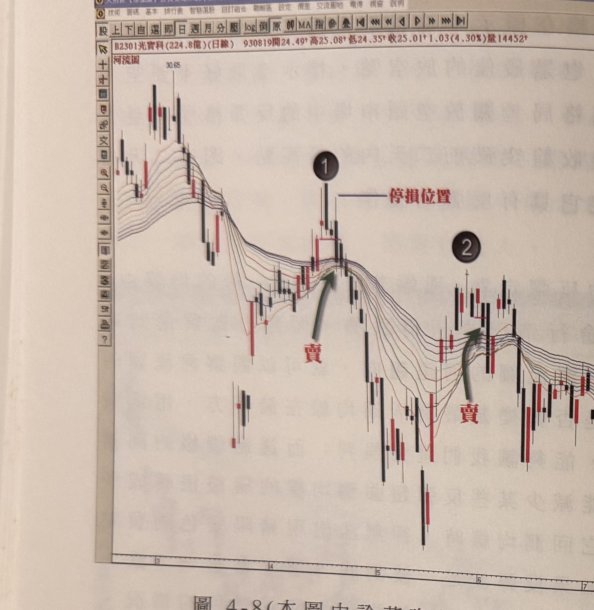
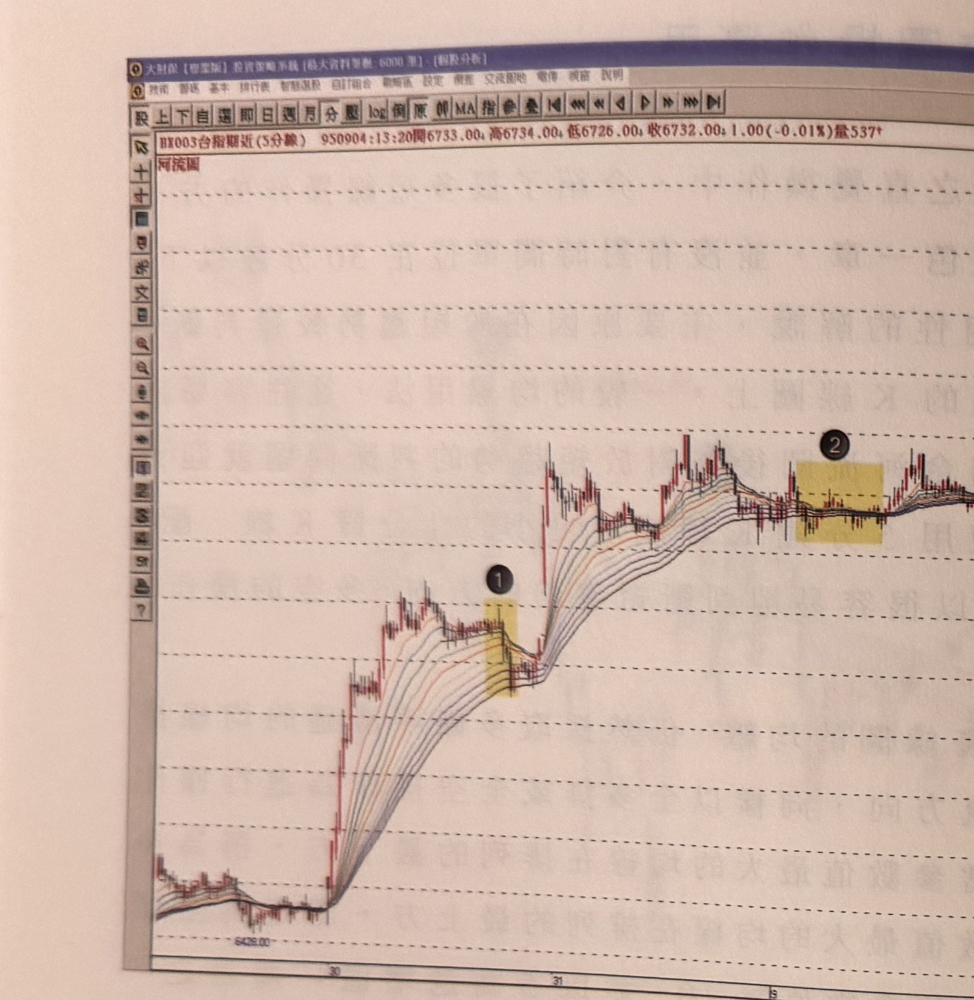
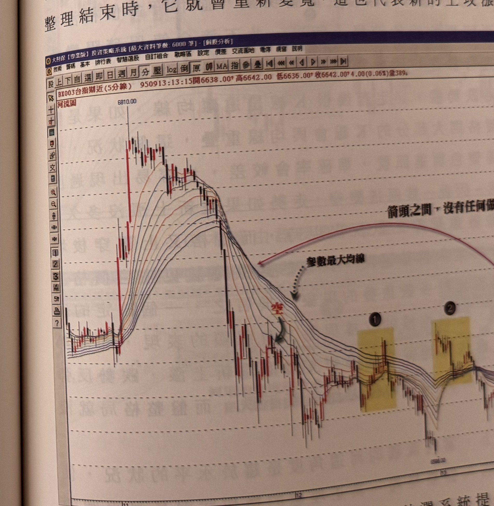
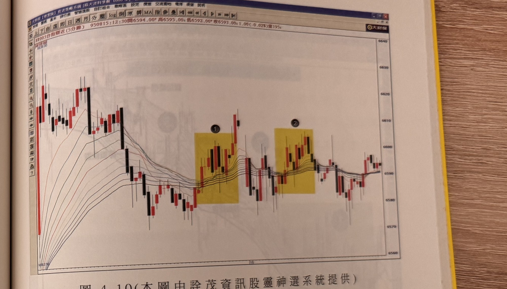
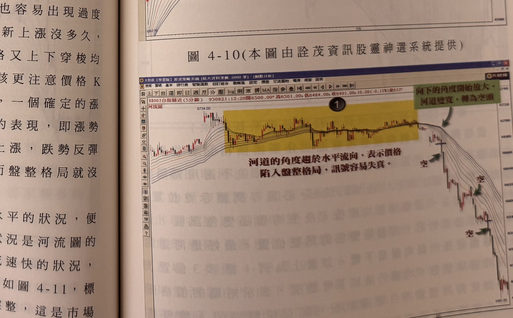
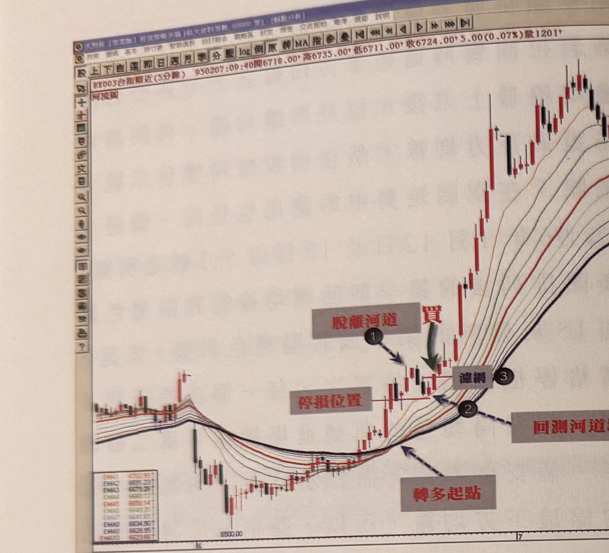
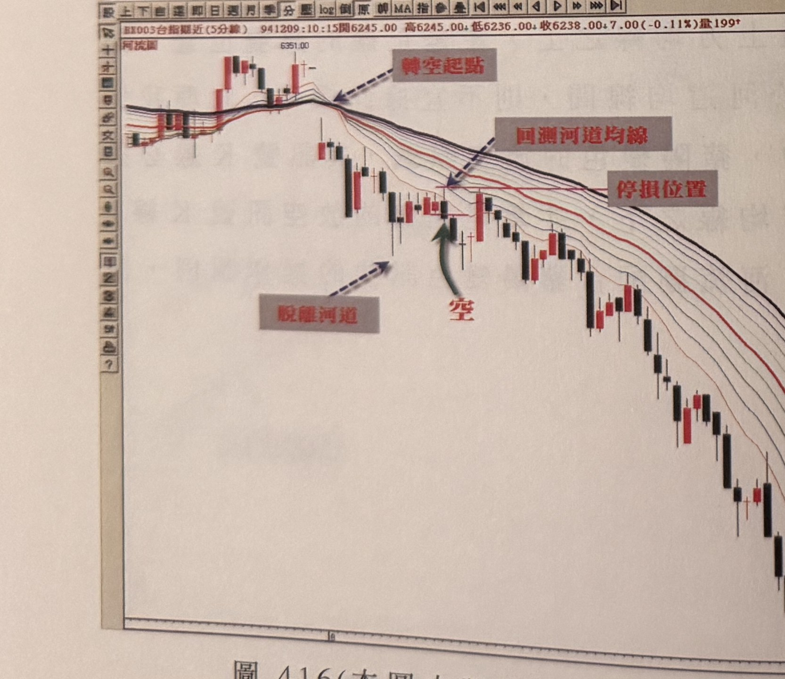
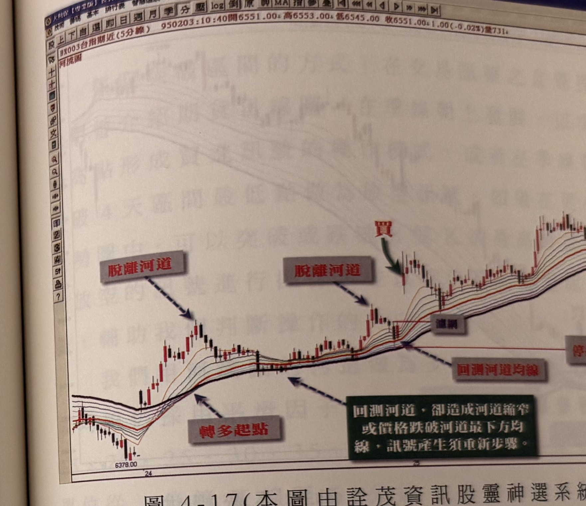
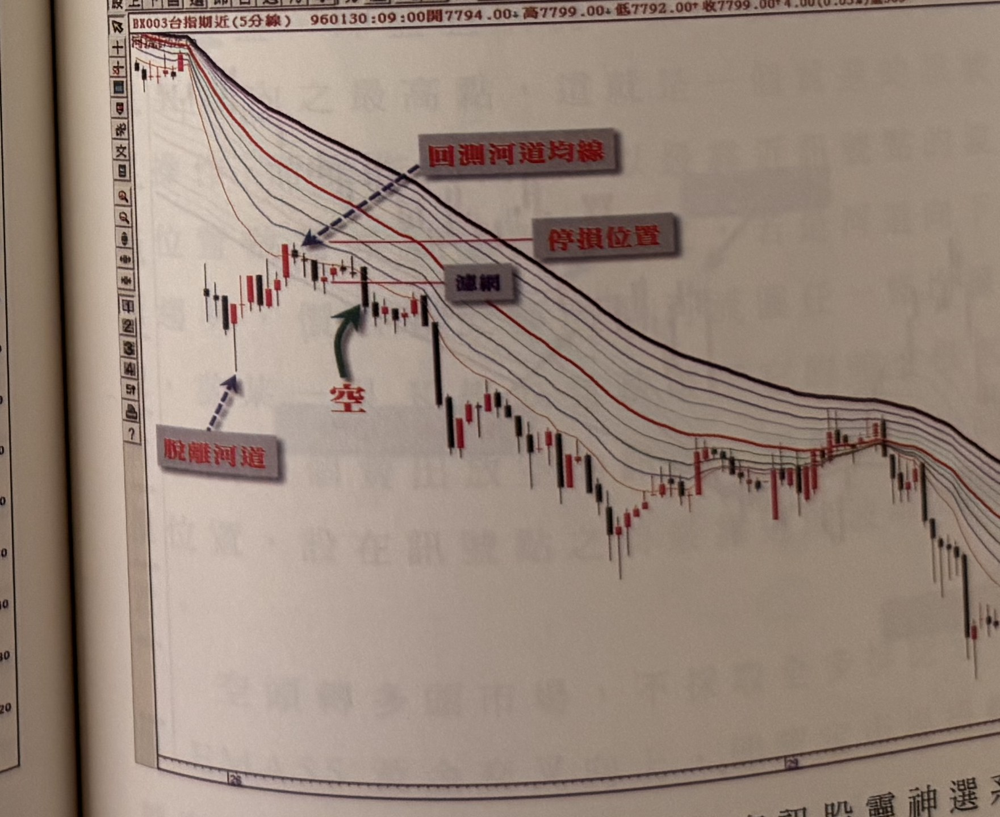

# 河流圖配合豬陽變色操作

> 一句話摘要：先用河流圖的均線排列方向判斷多空趨勢，再等價格回檔（多方）或反彈（空方）觸及河流圖任一均線後，K 線收盤突破（跌破）最靠近的一根反色 K 線高（低）點，即為進場訊號。

## 1. 核心概念

「豬陽變色」訊號原本以季線、10 日均線與 20 日均線交叉來界定多空市場（書中另章介紹），但短均線交叉常有反向假訊號、多空模糊地帶的問題；本章改用河流圖的全多排／全空排來界定趨勢方向，可有效解決這個模糊地帶（p.135）。

操作邏輯很單純：趨勢方向確立後，只要價格回測河流圖的任一均線，就是最佳的進場觀察點，因為河流圖本身已經是趨勢的「支撐（多頭）／壓力（空頭）」帶，回測後出現豬陽變色，代表趨勢延續、可以順勢跟進（p.135–136, 140）。作者強調應優先掌握「趨勢轉向後的第一個訊號」，其可靠度遠高於後續訊號（p.136, 151）。

## 2. 適用前提

- 須先以河流圖判斷目前是多頭排列或空頭排列（見 cz-04-00）（p.129, 135）。
- 河流圖河道呈現「明顯發散、角度夠大」時，訊號效率較佳；河道角度趨於水平（盤整）時，訊號容易失真，應提高警覺（p.146）。
- 若河道各均線大部分與價格 K 線重疊（無法分辨「先脫離、再回測」的過程），不適用本法（p.146, 148）。

## 3. 訊號定義

### 多方（買進）

1. C1：河流圖呈現全多排（最短天期均線在最上方，依序至最長天期均線在最下方）（p.129）。
2. C2：價格自河道之外的某一高點回檔，觸及河流圖任一條均線（p.135, 148）。
3. C3：觸及均線後的某根 K 線收盤，向上突破**最靠近的一根黑 K 線**最高點，即完成豬陽變色買進訊號（p.135）。
4. C4：訊號 K 線的收盤價須位於河道最上方均線（最短天期均線）之上；若訊號 K 線收在河道均線之間，不算正確訊號位置（p.151）。
5. C5：訊號發生時，河道各均線最好都朝上、沒有任一條下彎；若最短均線正在下彎，代表河道可能重新收斂進入整理，不宜視為理想訊號（p.148）。
6. C6：若先前價格曾拉回跌破河道最下方均線，則本次買點必須先重新拉高、突破河道最上方均線一段距離，回測均線且**不再跌破河道最下方均線**，才能認定為有效豬陽變色買進訊號（p.150–151）。

### 空方（賣出／放空）

1. C1：河流圖呈現全空排（最長天期均線在最上方，最短天期均線在最下方）（p.129, 140）。
2. C2：價格自河道之外的某一低點反彈，觸及河流圖任一條均線（p.135）。
3. C3：反彈須至少收盤突破前二天內的最高點（「過二天高」），才可認定為有效的反彈格局；否則不視為反彈、不考慮放空訊號（p.140–141）。
4. C4：觸及均線後的某根 K 線收盤，向下跌破**最靠近的一根紅 K 線**最低點，即完成豬陽變色賣出（放空）訊號（p.135）。
5. C5：訊號 K 線的收盤價須位於河道最下方均線（最短天期均線）之下（p.151，依多方 C4 鏡像原則）。
6. C6：訊號發生時，河道各均線最好都朝下、沒有任一條上彎（p.148，依多方 C5 鏡像原則）。
7. C7：若先前反彈曾突破河道最上方均線，則本次放空點須先重新下跌、跌破河道最下方均線一段距離，反彈回測均線且**不再突破河道最上方均線**，才能認定為有效放空訊號（p.150–151，依多方 C6 鏡像原則）。

## 4. 進場

- 訊號 K 線收盤價當下即可進場（順勢做多／放空）（p.135）。
- 若不願意留倉，可改在**隔天開盤後出現的當日第一個豬陽變色訊號**進場，但作者仍強烈建議優先掌握整個趨勢展開的第一個訊號，因為隔天開盤的訊號不一定緊接開盤即出現、安全性較差（p.149–150）。
- 每一次全多排（或全空排）完成後，**第一次回測均線的豬陽變色訊號**是波段最佳切入點，可信度最高；第二個以後的訊號可靠性遞減（p.136, 151）。

## 5. 停損

原文未明確給出本法的停損位置計算方式。多張範例圖（圖 4-12、4-13、4-15～4-18 等）皆以水平虛線標示「停損位置」，但正文沒有文字說明其精確設定規則（例如距離波谷/波峰多少點），僅方法二（cz-04-02）的正文明確寫出「最靠近訊號點的波谷（峰）外 1–3 點」的停損算法。是否可比照方法二的停損算法適用於本法，原文未言明（見第 12 節待確認事項）。

書中未提及停損後是否反手操作。

## 6. 出場／停利

原文未明確說明本法的停利／出場規則。章節總覽（cz-04-00）已列出：本章稍後（p.156–157）介紹的移動停損停利機制（cz-04-03）是針對「河流圖結合突破區間高低點操作」（cz-04-02）明確提出的，本節（豬陽變色法）的文字段落中並未提及要套用同一套移動停損停利機制；是否可比照套用屬推論，未在原文中明確銜接。

## 7. 過濾：不做的情況

1. 大部分 K 線與均線重疊（盤整格局）時，無法分辨「先脫離、再回測」的過程，不適用豬陽變色訊號，準確率會較差、容易過度交易（p.146, 148 圖 4-12 標示 1）。
2. 空頭市場中，反彈幅度未達「收盤突破前二天內最高點」（過二天高）者，不視為有效反彈格局，不宜放空；圖 4-7 標示 2 即屬此類、不建議放空（p.140–141）。
3. 訊號發生時若河道均線出現任一條下彎（多方）／上彎（空方），代表河道可能重新收斂，不宜視為理想訊號，須等均線重新朝原趨勢方向發散後再找訊號（p.148 圖 4-12 標示 3）。
4. 河道角度趨於水平時，價格陷入盤整，訊號容易失真（p.146 圖 4-11 標示 1）。
5. 多頭排列後，若價格曾拉回跌破河道最下方均線，在未重新突破河道最上方均線並完成不破底的回測前，任何豬陽變色不算有效買點（p.150–151 圖 4-14 標示 2～5，皆因曾跌破河道均線而被排除）。
6. 訊號 K 線若收在河道均線之間（未收在河道最上方或最下方均線之外），不算正確的訊號位置（p.151）。
7. 空頭排列的個股，不論基本面如何，作者建議不要在均線呈空排時承接（此為投資態度提醒，非硬性規則）（p.139）。

## 8. 範例解析

- **圖 4-1（茂矽 2342，日線，p.130）**：示範空頭排列（最長天期在上）逐漸收斂糾結，最短均線先仰升，最後最長天期均線移至河道最下方時，多頭排列正式完成（標示①），此後河流向上流動，屬多頭市場（背景概念圖，非交易訊號）。

  

- **圖 4-2（精業 2343，日線，p.131）**：標示①河流圖完成空頭排列，正式進入空頭市場；標示②河道縮小為反彈修正格局（背景概念圖）。

  

- **圖 4-3a/b（台指期近 5 分線，p.133）**：a 圖為河流圖，標示①②為河道收斂整理區，箭頭指向多頭排列完成處；b 圖為同一時段的一般均線對照圖，均線多次交叉纏繞，不如河流圖清晰（示範河流圖優於一般均線之處）。

  
  

- **圖 4-4a/b（台指期近 1 分線，p.134）**：a 圖河流圖標示空頭排列與①②兩處反彈整理區；b 圖同時段一般均線對照，同樣示範河流圖較清晰。

  
  

- **圖 4-5（友尚 2403，日線，p.137）**：標示①空頭市場（河流圖全空排）；標示②河流圖轉為全多排；其後兩個「買」點示範第一次與第二次回檔碰觸均線的豬陽變色買進點，為波段最佳切入點。

  

- **圖 4-6（晶電 2448，日線，p.138）**：標示①均線僅收斂糾結、最長天期均線未移至最上方，不應視為轉空；標示②③再度發散向上，標示③出現「買」訊號（第一次回測，最佳買點）；標示④再次出現「買」訊號，但可靠性不如標示③。

  

- **圖 4-7（仁寶 2324，日線，p.140）**：均線全空排，標示①為第一個放空訊號、最佳放空點；標示②為反彈整理區，不屬有效反彈格局（未過二天高），不建議放空；標示③再次出現放空訊號。

  

- **圖 4-8（光寶科 2301，日線，p.142）**：河流圖由多排轉為空排，最長天期均線移至最上方，標示①為第一次放空訊號（附「停損位置」標示）；標示②為第二次反彈後放空訊號，因最長天期均線未回到最下方，仍判定空頭結構未變。

  

- **圖 4-8b（台指期近 5 分線，p.144；圖號與圖 4-8 重複，依原書照錄）**：均線呈多頭排列，標示①②為河道收斂整理區（河道變窄不等於反轉），其後河道重新變寬、續攻。

  

- **圖 4-9（台指期近 5 分線，p.145）**：參數最大均線移至排列最上方，判定進入空頭；箭頭範圍內即使價格一度穿越參數最大均線（標示①②），仍未使該均線移至最下方，空頭結構不變。

  

- **圖 4-10（台指期近 5 分線，p.147）**：標示①②區域大部分 K 線與均線重疊，不符合「先脫離、再回測」前提，不適用豬陽變色。

  

- **圖 4-11（台指期近 5 分線，p.147）**：標示①河道角度趨於水平，價格陷入盤整、訊號易失真；其後河道向下發散轉為空頭，出現連續放空訊號。

  

- **圖 4-12（台指期近 5 分線，p.148）**：標示①區域價格與均線貼近、不適用；標示②才是有效回測後的「買」訊號（附停損位置）；標示③均線仍下彎，屬警戒區。

  

- **圖 4-13（台指期近 5 分線，p.149）**：河道由窄變寬視為新一波跌勢起點，標示①②為連續放空訊號（附停損位置），標示③為反彈整理區。

  

- **圖 4-14（台指期近 5 分線，p.150）**：標示①為多頭排列後第一個回測均線的「買」訊號（走多起點）；標示②③④⑤因訊號 K 線最短均線仍向上、屬強勢反彈，不符合弱勢反彈的判斷條件，皆不宜作為訊號。

  

- **圖 4-15～4-20（台指期近 5 分線，p.152–154）**：以「轉多（空）起點」「脫離河道」「回測河道均線」「濾網」「買／空」等標示，示範完整訊號步驟；其中「濾網」一詞未見本節正文明確定義（見第 12 節待確認事項），故僅列於此處存查，未寫入訊號定義的判斷條件。

  
  
  
  
  
  

## 9. 作者提醒與常見錯誤

- 均線只是收斂糾結，不代表趨勢反轉；唯有最長天期均線移到排列的另一端，才確認多空轉換完成（p.132, 136, 138）。
- 河流圖上不會出現一般均線常見的「反向交叉」假訊號，河道變窄不等於反轉，這是河流圖優於一般均線的地方（p.136）。
- 不要因為河流圖呈空排就對個股基本面存有僥倖心理而承接，應等趨勢轉多後再跟進（p.139）。
- 每一次多頭（空頭）排列完成後最重視第一個訊號，第二個以後的訊號都不如第一個安全準確（p.136, 151）。
- 操作應追求簡單有效，不必同時緊盯 RSI、KD 等多項指標，方法越簡單思維越清楚（p.140）。

## 10. 規則速查（Checklist）

**多方買進**
- [ ] 河流圖呈全多排
- [ ] 價格自河道外高點回檔，觸及河流圖任一均線
- [ ] K 線收盤突破最靠近的一根黑 K 線最高點
- [ ] 訊號 K 線收盤在河道最上方均線之上
- [ ] 訊號發生時各均線皆朝上、無下彎
- [ ] 若先前曾跌破河道最下方均線，已重新突破最上方均線並完成不破底回測

**空方放空**
- [ ] 河流圖呈全空排
- [ ] 反彈已收盤突破前二天內最高點（過二天高）
- [ ] 價格自河道外低點反彈，觸及河流圖任一均線
- [ ] K 線收盤跌破最靠近的一根紅 K 線最低點
- [ ] 訊號 K 線收盤在河道最下方均線之下
- [ ] 訊號發生時各均線皆朝下、無上彎
- [ ] 若先前曾突破河道最上方均線，已重新跌破最下方均線並完成不破頂回測

## 11. 機器可讀規則
```yaml
signal: 河流圖配合豬陽變色
side: both
timeframe: [daily, 5m, 1m]

long:
  conditions:
    - id: L-C1
      desc: 河流圖呈全多排（最短天期均線在最上方，依序至最長天期均線在最下方）
      source: p.129
    - id: L-C2
      desc: 價格自河道外高點回檔，觸及河流圖任一均線
      source: p.135, p.148
    - id: L-C3
      desc: 觸及均線後某根K線收盤突破最靠近的一根黑K線最高點
      source: p.135
    - id: L-C4
      desc: 訊號K線收盤須在河道最上方均線之上
      source: p.151
    - id: L-C5
      desc: 訊號發生時各均線皆朝上、無下彎
      source: p.148
    - id: L-C6
      desc: 若先前曾跌破河道最下方均線，須先重新突破河道最上方均線、完成不破底回測後才算數
      source: p.150-151
  entry: 訊號K線收盤價進場；不留倉者可改於隔日開盤後第一個訊號進場
  stop_loss: 書中未規定（原文未提供本法明確的停損計算方式，圖例僅標示"停損位置"）
  exit: 書中未明確說明
  filters:
    - desc: 大部分K線與均線重疊（盤整）時不適用
      source: p.146, p.148
    - desc: 河道角度趨於水平時訊號易失真
      source: p.146

short:
  conditions:
    - id: S-C1
      desc: 河流圖呈全空排（最長天期均線在最上方，最短天期均線在最下方）
      source: p.129, p.140
    - id: S-C2
      desc: 反彈須收盤突破前二天內最高點（過二天高），否則不算有效反彈
      source: p.140-141
    - id: S-C3
      desc: 價格自河道外低點反彈，觸及河流圖任一均線
      source: p.135
    - id: S-C4
      desc: 觸及均線後某根K線收盤跌破最靠近的一根紅K線最低點
      source: p.135
    - id: S-C5
      desc: 訊號K線收盤須在河道最下方均線之下
      source: p.151（推論，依多方鏡像）
    - id: S-C6
      desc: 訊號發生時各均線皆朝下、無上彎
      source: p.148（推論，依多方鏡像）
    - id: S-C7
      desc: 若先前曾突破河道最上方均線，須先重新跌破河道最下方均線、完成不破頂回測後才算數
      source: p.150-151（推論，依多方鏡像）
  entry: 訊號K線收盤價進場（放空）；不留倉者可改於隔日開盤後第一個訊號進場
  stop_loss: 書中未規定
  exit: 書中未明確說明
  filters:
    - desc: 空頭排列個股不建議承接做多，不論基本面
      source: p.139
```

## 12. 待確認事項

1. 本法的停損規則：原文只在圖例中畫出「停損位置」水平線，正文沒有文字說明其計算方式（例如是否比照方法二的「最近波谷/波峰外 1–3 點」），屬於影響下單規則的關鍵缺項（p.148–150 等圖例；p.155 方法二才有文字說明）。
2. 本法的停利／出場規則：正文全篇未提及，僅能確認「不應在第二個以後的訊號重複進場」的可靠度提醒，未給出明確出場條件（p.136, 151）。
3. 圖 4-15～4-20（p.152–154）標示的「濾網」一詞，於本節（豬陽變色法）正文中未見定義；其「脫離河道／回測河道均線」用語與方法二（p.161–168）的步驟描述相符，但這些圖出現在方法二正式標題（p.155）之前，頁面順序與文字說明順序不一致，無法確定原書編排是否刻意將其歸類為方法一或方法二的範例，故僅列於方法一範例解析存查、未納入訊號定義（推論／存疑）。
4. 空方訊號定義中 S-C5、S-C6、S-C7 為依據多方規則鏡像推論而得，原文空頭段落文字（p.140–141）未逐條覆述，標註「推論」以資區別。

## 13. 原文出處

- extracted/pages/IMG_8782.md（p.128–129）
- extracted/pages/IMG_8783.md（p.130–131）
- extracted/pages/IMG_8784.md（p.132–133）
- extracted/pages/IMG_8785.md（p.134–135）
- extracted/pages/IMG_8786.md（p.136–137）
- extracted/pages/IMG_8787.md（p.138–139）
- extracted/pages/IMG_8788.md（p.140–141）
- extracted/pages/IMG_8789.md（p.142–143）
- extracted/pages/IMG_8790.md（p.144–145）
- extracted/pages/IMG_8791.md（p.146–147）
- extracted/pages/IMG_8792.md（p.148–149）
- extracted/pages/IMG_8793.md（p.150–151）
- extracted/pages/IMG_8794.md（p.152–153，圖 4-15～4-18 範例存查）
- extracted/pages/IMG_8795.md（p.154，圖 1-19／4-20 範例存查）
