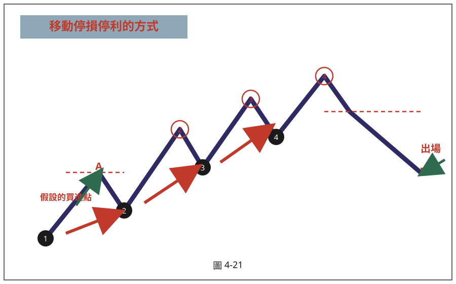
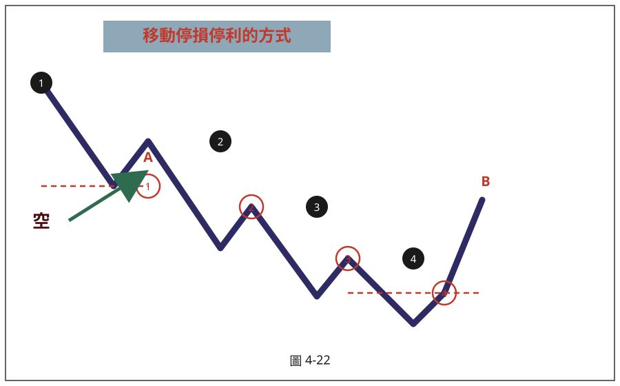

# 移動停損停利出場法（共用出場模組）

> 一句話摘要：進場後每當價格收盤創新高（多）／新低（空），就把停損移動到最近一個波谷（峰），一路跟隨趨勢推進，直到停損被觸及即出場；本法為「河流圖結合突破區間高低點操作」（cz-04-02）明確採用的出場機制，書中以圖 4-21、4-22 示意圖說明原理。

## 1. 核心概念

順勢操作最怕「賺小賠大」或提早獲利了結錯失波段利潤，移動停損停利法讓停損隨行情推進而不斷收緊獲利保護空間，同時不干預趨勢延續中的正常拉回／反彈，直到趨勢真正反轉（停損被觸及）才出場，藉此讓一筆順勢單能盡量抱到波段結束（p.156–157）。

## 2. 適用前提

- 已依順勢方法進場（書中明確用於 cz-04-02「河流圖結合突破區間高低點操作」之後的持倉出場）（p.156）。
- 適用於明確的多頭或空頭波段走勢，行情呈鋸齒狀（創新高／新低後拉回／反彈）推進的格局（圖 4-21、4-22 示意）。

## 3. 規則定義

### 多方（作多）

1. 進場後，第一次停損設在**最靠近訊號點的波谷低點下方 1–3 點**（此為 cz-04-02 進場時即設定的初始停損，見圖 4-21 假設進場點 A、初始停損設於黑色 1 號球位置）（p.155–156）。
2. 當價格 K 線收盤突破前一個波峰高點（紅色球）時，將停損位置由前一個波谷（黑色球）移動至**最近一個波谷低點**（下一個黑色球位置）（p.156）。
3. 重複步驟 2：每次收盤創新高，停損就移動到最新的波谷低點；波谷持續墊高，停損水位隨之提高（p.156）。
4. 直到某次價格收盤**跌破當前停損所在的波谷低點**，立即出場（圖 4-21 標示 B 點：跌破黑色 4 號球低點出場）（p.156）。

### 空方（放空）

1. 進場後，第一次停損設在**最靠近訊號點的波峰高點上方 1–3 點**（圖 4-22 假設放空點 A，初始停損設於黑色 1 號球頂點上方）（p.157）。
2. 當價格 K 線收盤跌破前一個波谷低點（紅色球）時，將停損位置由前一個波峰（黑色球）移動至**最近一個波峰高點**上方（下一個黑色球位置）（p.157）。
3. 重複步驟 2：每次收盤創新低，停損就移動到最新的波峰高點；波峰持續下降，停損水位隨之下移（p.157）。
4. 直到價格反彈觸及當前停損所在的波峰高點上方，立即出場（圖 4-22 標示 B 點：反彈觸及黑色 4 號球頂點上方出場）（p.157）。

### 「前無遮蔽」原則（判斷是否創新高／新低的關鍵）

- 認定一根 K 線「收盤突破前波高點」時，除了收盤價要比前波高點更高之外，**該 K 線前面不能有其他 K 線的上影線擋著**，否則不算有效創新高，不移動停損（多方鏡像：跌破前波低點時，收盤價須比最靠近的下影線更低，否則不算有效創新低）（p.159, 167）。

## 4. 進場

（本模組僅為出場機制，進場規則見所屬方法：[cz-04-02-河流圖突破區間高低點.md](./cz-04-02-河流圖突破區間高低點.md)）

## 5. 停損

- 初始停損：最靠近訊號點的波谷（多）／波峰（空）外 1–3 點（p.155）。
- 移動後的停損：以最近一次確認的波谷低點（多）／波峰高點（空）為準；每次收盤創新高（低）即上移（下移）一次（p.156–157）。原文對「移動後的停損是否仍加減 1–3 點緩衝」未逐次重複說明（見第 12 節待確認事項）。

## 6. 出場／停利

- 停損位置被價格觸及（跌破波谷／反彈觸及波峰上方）時，立即出場，此即本法的停利實現方式──用不斷上移（下移）的停損來鎖住波段利潤，而非設定固定目標價（p.156–157）。
- 書中另提供替代方案：**固定點數出場**（例如 1 分鐘 K 線圖獲利 20–30 點即出場，停損控制在 10–20 點），可視個人風險偏好在移動停損法與固定點數出場之間選擇（p.161）。
- 停損出場的同一根 K 線若同時出現反向的過 8 高／破 8 低訊號，可反手進場、重新啟動另一個方向的移動停損流程（p.162，見 cz-04-02 第 3 節）。

## 7. 過濾：不做的情況

- 判斷「創新高／新低」時，若收盤價的突破被前面 K 線的上（下）影線遮蔽，不算有效創高（低），不得移動停損（p.159, 167）。

## 8. 範例解析

- **圖 4-21（示意圖，SVG，p.156）**：多頭／作多移動停損停利機制示意。價格自進場點 A 起，每次收盤突破前一波峰（紅色 1、2、3 號球），就把停損由前一波谷（黑色 1、2、3 號球）移動到最新的波谷（黑色 2、3、4 號球）；標示 B 點跌破黑色 4 號球低點，立即出場。

  

- **圖 4-22（示意圖，SVG，p.157）**：空頭／放空移動停損停利機制示意，規則與圖 4-21 鏡像：放空點 A 起，每次收盤跌破前一波谷（紅色 1、2、3 號球），就把停損由前一波峰（黑色 1、2、3 號球）移動到最新的波峰（黑色 2、3、4 號球）；標示 B 點反彈觸及黑色 4 號球頂點上方，立即出場。

  

- **圖 4-23（台指期近 5 分線，95/11/30，p.158）**：真實走勢示範完整的移動停損停利流程，從黑球①到黑球⑧逐步上移停損，最終於黑球⑧低點被跌破出場（詳見 cz-04-02 範例解析）。

  

- **圖 4-27（台指期近 1 分線，95/12/5，p.164）**：以圖 4-26 同一組放空交易示範移動停損：7671 放空後，隨波谷創新低（7635、7626），停損逐步下移至黑球③、④上方，直到停損被觸及出場。

  

- **圖 4-29（台指期近 3 分線，96/1/2，p.167）**：示範「前無遮蔽」原則的實際判讀──紅球③附近數根 K 線收盤雖高於紅球②，但因前面 K 線上影線遮蔽，不算有效創新高，不觸發停損上移。

  

## 9. 作者提醒與常見錯誤

- 移動停損停利的核心是「只跟隨趨勢創新高（低）才移動」，行情整理期間（未創新高低）停損位置不應更動，不要因為盤整就急於調整停損（cz-04-02 圖 4-23 範例：停利點一直設在黑色 3 號球，直到創出紅色 4 號球高點才再次移動）。
- 判斷突破／跌破前波高低點時，一定要用**收盤價**認定，並確認「前無遮蔽」，不能只看上（下）影線曾經觸及前波高低點就誤判創新高（低）（p.159, 167）。

## 10. 規則速查（Checklist）

**多方**
- [ ] 初始停損＝最近波谷低點下方 1–3 點
- [ ] 每次收盤突破前一波峰高點（且前無遮蔽），將停損移動至最新波谷低點
- [ ] 停損被跌破時立即出場
- [ ] （替代方案）可改採固定點數出場

**空方**
- [ ] 初始停損＝最近波峰高點上方 1–3 點
- [ ] 每次收盤跌破前一波谷低點（且前無遮蔽），將停損移動至最新波峰高點
- [ ] 停損被觸及（反彈超過）時立即出場
- [ ] （替代方案）可改採固定點數出場

## 11. 機器可讀規則
```yaml
signal: 移動停損停利出場法
side: both
timeframe: [1m, 3m, 5m, 15m, 30m, 60m]

long:
  initial_stop: { points: "1-3", ref: "最靠近訊號點的波谷低點下方", source: "p.155-156" }
  trail_rule:
    - id: T-C1
      desc: 收盤突破前一波峰高點（且該K線前無遮蔽），將停損移動至最新一個波谷低點
      source: p.156, p.159
  exit: 停損（最新波谷低點）被收盤跌破時立即出場
  alt_exit:
    method: 固定點數出場（如20-30點）
    source: p.161

short:
  initial_stop: { points: "1-3", ref: "訊號點之前最靠近的波峰高點上方", source: "p.155, p.157" }
  trail_rule:
    - id: T-C1
      desc: 收盤跌破前一波谷低點（且該K線前無遮蔽），將停損移動至最新一個波峰高點
      source: p.157, p.167
  exit: 停損（最新波峰高點）被反彈觸及時立即出場
  alt_exit:
    method: 固定點數出場（如20-30點）
    source: p.161

filters:
  - desc: 創新高/新低須為收盤價，且前面K線的上/下影線不能遮蔽，否則不算數、不移動停損
    source: p.159, p.167
```

## 12. 待確認事項

1. 移動後每次新設定的停損位置，原文只描述「移動至黑色 X 號球位置」，未逐次重申「加減 1–3 點」的緩衝字眼（僅第一次進場時的初始停損明確寫出 1–3 點），無法完全確認後續每次移動是否也比照加減 1–3 點，或是直接以波谷（峰）價位為準（p.156–157）。
2. 原文只在「河流圖結合突破區間高低點操作」（cz-04-02）一節明確使用本出場法；「河流圖配合豬陽變色操作」（cz-04-01）是否也適用同一套移動停損停利機制，原文未明確銜接說明，本文件未替該法強行套用（見 cz-04-01 第 12 節）。

## 13. 原文出處

- extracted/pages/IMG_8796.md（p.156–157，規則說明＋圖 4-21、4-22）
- extracted/pages/IMG_8797.md（p.158–159，圖 4-23 實例）
- extracted/pages/IMG_8800.md（p.164–165，圖 4-27 實例）
- extracted/pages/IMG_8801.md（p.166–167，圖 4-29「前無遮蔽」實例）
