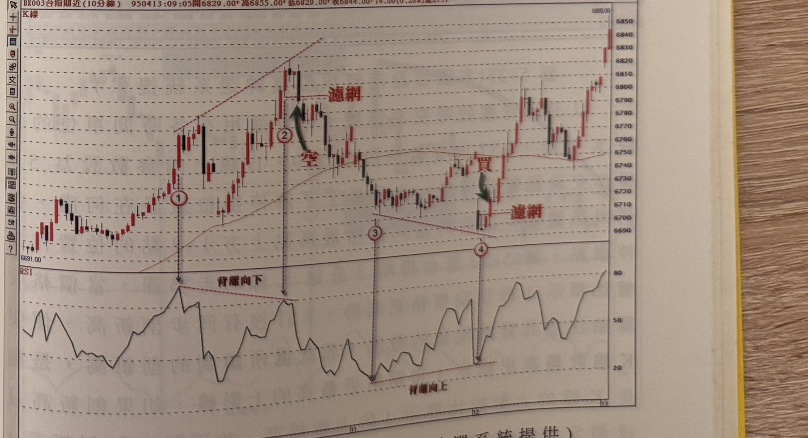

# RSI 背離運用在期指短線

> 一句話摘要：價格創新高（低）而 RSI 未同步創新高（低）即為背離，須滿足「創新高/低以收盤價為準」「回檔/反彈根數≥4根」「波段間距>10根K線」等條件後，配合濾網（前波RSI極值K線的低/高點）進場，停損為訊號發生前區間極值上下1–3點。

## 1. 核心概念

價格處於漲勢時，慣性是一波比一波高，理論上同向的指標也應同步創新高；若價格創新高而 RSI 未同步創新高，稱為「**背離向下**」，暗示價格可能轉向下跌（p.202）。反之，價格處於跌勢時慣性一波比一波低，若價格創新低而 RSI 未同步創新低（呈現「收腳」動作），稱為「**背離向上**」，暗示價格可能反彈（p.202）。

背離屬於**逆勢操作**的訊號：在漲勢中順勢做多之餘，於潛在反轉高點透過背離搶先放空；在跌勢中於潛在底部透過背離搶先買進。因此必須嚴格限定特定模式，只有完全符合條件才進行逆勢操作，並嚴控停損（p.206–207）。背離所產生的回檔或反彈，只要沒有進一步破壞原趨勢的連續性（例如反彈未突破前一波反彈高點），就不能認定行情已經反轉（p.202）。

## 2. 適用前提

- 可運用於各時間單位的分鐘K線圖（書中範例含 3 分、5 分、10 分、30 分線），RSI 參數設為 9；若在日線圖上使用則 RSI 參數設為 5（p.204）。
- 屬逆勢操作，須嚴密限制模式並嚴格執行停損（p.206–207）。

## 3. 訊號定義

### 背離向下（放空）

1. C1：價格創新高，即後一個波峰的收盤價，高於前一波峰附近**最高的上影線**；若僅上影線較高、收盤價未真正創高，不算創新高（p.204，圖 5-24 示範反例）。
2. C2：對應的 RSI 值，後一波峰**低於**前一波峰，呈現「背離向下」（p.202–203）。
3. C3：兩個價格波峰之間，須存在有效回檔──其間需有一根 K 線收盤跌破前一向上波 RSI 最高值 K 線的最低點，且回檔的 K 線數目須在 **4 根以上**（不要求連續 4 根黑K）（p.206）。
4. C4：兩個波峰之間的時間距離（K 線根數）須**超過 10 根**（p.206）。
5. C5：濾網 = 後一波峰（訊號K線）的 K 線最低點。後續某根 K 線收盤跌破此濾網，形成放空訊號（p.203）。

### 背離向上（買進）

1. C1：價格創新低，即後一個波谷的收盤價，低於前一波谷附近**最低的下影線**；若僅下影線較低、收盤價未真正創低，不算創新低（p.205，圖 5-25 示範反例）。
2. C2：對應的 RSI 值，後一波谷**高於**前一波谷，呈現「背離向上」（p.202–203）。
3. C3：兩個價格波谷之間，須存在有效反彈──其間需有一根 K 線收盤突破前一向下波 RSI 最低值 K 線的最高點，且反彈的 K 線數目須在 **4 根以上**（不要求連續 4 根紅K）（p.206）。
4. C4：兩個波谷之間的時間距離須**超過 10 根**K線（p.206）。
5. C5：濾網 = 後一波谷（訊號K線）的 K 線最高點。後續某根 K 線收盤突破此濾網，形成買進訊號（p.203）。

## 4. 進場

- 放空：K 線收盤跌破濾網（C5，該波峰K線最低點）時形成放空訊號（p.203）。
- 買進：K 線收盤突破濾網（C5，該波谷K線最高點）時形成買進訊號（p.203）。
- 訊號成立當根是否即為進場點，原文未逐字說明（依全書慣例，收盤突破/跌破濾網即視為訊號成立，可推論為訊號K線收盤價附近進場）（推論）。

## 5. 停損

- 原文明確敘述：「我們以訊號發生之前的區間價格最高點上方 1～3 點的位置作為停損點」（p.204），此句對應放空範例（圖 5-23）。
- 買進方向的停損點數，原文未逐字重述；範例圖（圖 5-27、5-28、5-30、5-32）皆在買點下方標示「停損位置」水平線，顯示方向為訊號發生前區間價格最低點下方，但精確點數（是否同為 1–3 點）書中未逐字說明（推論，見第12節待確認）。

## 6. 出場／停利

書中未明確說明本方法的出場／停利規則，僅提供進場條件與停損位置（書中未規定）。

## 7. 過濾：不做的情況

1. 若「創新高」只是上影線超越前波高點、收盤價未創新高，不符合背離向下的成立要件，不可操作（p.204–205，圖 5-24）。
2. 若「創新低」只是下影線超越前波低點、收盤價未創新低，不符合背離向上的成立要件，不可操作（p.205，圖 5-25）。
3. 兩波峰間的回檔（或兩波谷間的反彈）若未能使 K 線收盤突破/跌破前一波 RSI 極值 K 線對應價位，不視為有效回檔／反彈波，不構成背離操作條件（p.207，圖 5-26 標示 1、2 反例）。
4. 兩個波峰（或波谷）之間的 K 線根數若不足 4 根，不能認定為回檔／反彈修正（p.206）。
5. 兩個波峰（或波谷）之間的時間距離若不超過 10 根 K 線，不可用背離方式操作（p.206, 207 圖 5-26 標示 1、2 反例）。

## 8. 範例解析

- **圖 5-22（台指期近10分線，p.203）**：標示①②為背離向下（價格創新高但RSI未創新高），跌破濾網後放空；標示③④為背離向上（價格創新低但RSI未創新低），突破濾網後買進；買進後價格回升至先前高點附近。

  
- **圖 5-23（台指期近3分線，p.204）**：標示①②背離向下，收盤創高後放空，並示範「創新高須以收盤價高於前波最高上影線為準」與「停損設於頂點上方1–3點」的規則。

  
- **圖 5-24（台指期近3分線，p.204–205）**：標示①②之間僅上影線創新高、收盤未創新高，圖說明確標註「不符合要件，不可操作」。

  
- **圖 5-25（台指期近5分線，p.205）**：標示①②之間僅下影線創新低、收盤未創新低，圖說明確標註「不符合要件，不可操作」。

  
- **圖 5-26（台指期近3分線，p.207）**：標示①②、②③之間反彈皆未突破前波RSI最低值K線最高點（不視為反彈波），且波谷間距不足10根，不可操作；標示③符合各項條件，形成有效買進訊號。

  
- **圖 5-27（台指期近5分線，p.208）**：標示①②為背離向上，②點出現買進訊號並標示停損位置，買進後價格持續上漲。

  
- **圖 5-28（台指期近5分線，p.208）**：同為背離向上買點示範，買進後價格續漲。

  
- **圖 5-29（台指期近5分線，p.208–209）**：標示①②為背離向下，②點價格創高後出現放空訊號，隨後價格反轉下跌。

  
- **圖 5-30（台指期近30分線，p.209）**：標示①為濾網買點，買進後價格大幅上漲，後續高點②與①構成RSI背離向上的兩點。

  
- **圖 5-31（台指期近3分線，p.210）**：標示①②為背離向下，②點上方標示停損位置，出現放空訊號後價格反轉下跌。

  
- **圖 5-32（台指期近3分線，p.210）**：標示①②為背離向上，②點下方標示停損位置，買進後價格反彈至標示③④（構成新的背離向下），隨後價格回落。

  

## 9. 作者提醒與常見錯誤

- 背離不是「一看到就代表底部/頭部出現」，若不嚴格限制特定條件，錯誤訊號會讓人被停損出場、進而失去操作信心（p.207）。
- 判斷創新高/創新低必須以**收盤價**是否超越前波「附近最高的上影線／最低的下影線」為準，只有影線超越不算數，這是操作上非常重要的原則（p.204–205）。
- 兩個波峰或波谷間，即使只夾一根 K 線也可能造成 RSI 大幅轉折而產生假背離，因此需以「回檔/反彈 K 線數≥4根」及「波段間距>10根K線」二項規則過濾（p.206）。

## 10. 規則速查（Checklist）

**背離向下（放空）**
- [ ] 後一波峰收盤價高於前一波峰附近最高上影線（真正創新高）
- [ ] 對應RSI值後一波峰低於前一波峰（背離向下）
- [ ] 兩波峰間有K線收盤跌破前一向上波RSI最高值K線的最低點，且回檔K線數≥4根
- [ ] 兩波峰間時間距離>10根K線
- [ ] 濾網＝該波峰K線最低點，後續K線收盤跌破即進場放空
- [ ] 停損設於訊號發生前區間價格最高點上方1–3點

**背離向上（買進）**
- [ ] 後一波谷收盤價低於前一波谷附近最低下影線（真正創新低）
- [ ] 對應RSI值後一波谷高於前一波谷（背離向上）
- [ ] 兩波谷間有K線收盤突破前一向下波RSI最低值K線的最高點，且反彈K線數≥4根
- [ ] 兩波谷間時間距離>10根K線
- [ ] 濾網＝該波谷K線最高點，後續K線收盤突破即進場買進
- [ ] 停損設於訊號發生前區間價格最低點下方（點數比照放空方向，原文未逐字重述，見待確認）

## 11. 機器可讀規則
```yaml
signal: RSI背離_期指短線
side: both
timeframe: "3m/5m/10m/30m（RSI(9)）；日線用RSI(5)"

short:
  conditions:
    - id: S-C1
      desc: 後一波峰收盤價高於前一波峰附近最高上影線（真實創新高）
      source: p.204
    - id: S-C2
      desc: 對應RSI值後一波峰低於前一波峰（背離向下）
      source: p.202-203
    - id: S-C3
      desc: 兩波峰間存在K線收盤跌破前一向上波RSI最高值K線最低點的回檔，且回檔K線數≥4（非連續同色）
      source: p.206
    - id: S-C4
      desc: 兩波峰間時間距離>10根K線
      source: p.206
  entry: 濾網=該波峰K線最低點；後續K線收盤跌破濾網時放空
  entry_source: p.203
  stop_loss: { points: "1-3", ref: "訊號發生前區間價格最高點上方", source: p.204 }
  exit: 書中未明確說明
  filters:
    - desc: 僅上影線創新高、收盤未創新高者不可操作
      source: p.204-205
    - desc: 回檔未突破前波RSI最高值K線最低點，或波峰間距不足10根K線者不可操作
      source: p.206-207

long:
  conditions:
    - id: L-C1
      desc: 後一波谷收盤價低於前一波谷附近最低下影線（真實創新低）
      source: p.205
    - id: L-C2
      desc: 對應RSI值後一波谷高於前一波谷（背離向上）
      source: p.202-203
    - id: L-C3
      desc: 兩波谷間存在K線收盤突破前一向下波RSI最低值K線最高點的反彈，且反彈K線數≥4（非連續同色）
      source: p.206
    - id: L-C4
      desc: 兩波谷間時間距離>10根K線
      source: p.206
  entry: 濾網=該波谷K線最高點；後續K線收盤突破濾網時買進
  entry_source: p.203
  stop_loss: { points: "1-3（推論，比照放空方向；原文未逐字重述）", ref: "訊號發生前區間價格最低點下方", source: "p.204（原文僅明示放空方向）" }
  exit: 書中未明確說明
  filters:
    - desc: 僅下影線創新低、收盤未創新低者不可操作
      source: p.205
    - desc: 反彈未突破前波RSI最低值K線最高點，或波谷間距不足10根K線者不可操作
      source: p.206-207
```

## 12. 待確認事項

1. 停損點數規則原文（p.204）僅以放空範例明確寫出「訊號發生之前的區間價格最高點上方1～3點」，買進方向的停損點數是否同為 1–3 點，書中未逐字重述，僅由範例圖（圖5-27、5-28、5-30、5-32）以「停損位置」水平線圖示佐證方向一致、未標示精確點數，屬推論。
2. 訊號成立後的實際進場時點（訊號K線收盤價當下，或次一根K線開盤）原文未逐字說明，依全書慣例推論為收盤價附近進場。

## 13. 原文出處

- extracted/pages/IMG_8821.md（p.202–203）
- extracted/pages/IMG_8822.md（p.204–205）
- extracted/pages/IMG_8823.md（p.206–207）
- extracted/pages/IMG_8824.md（p.208–209）
- extracted/pages/IMG_8825.md（p.210；p.211 為後記，非規則內容，未使用）
