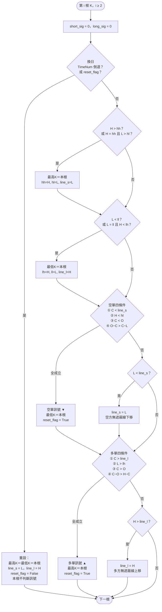
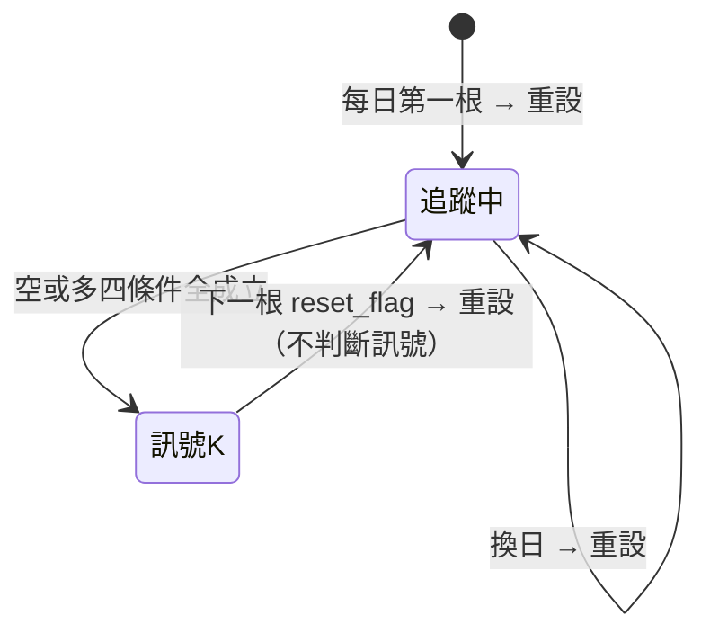
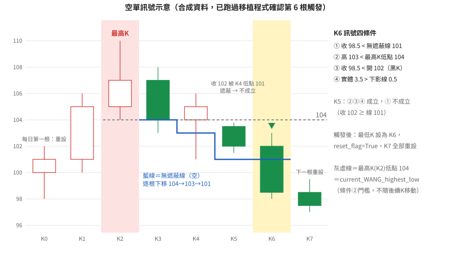
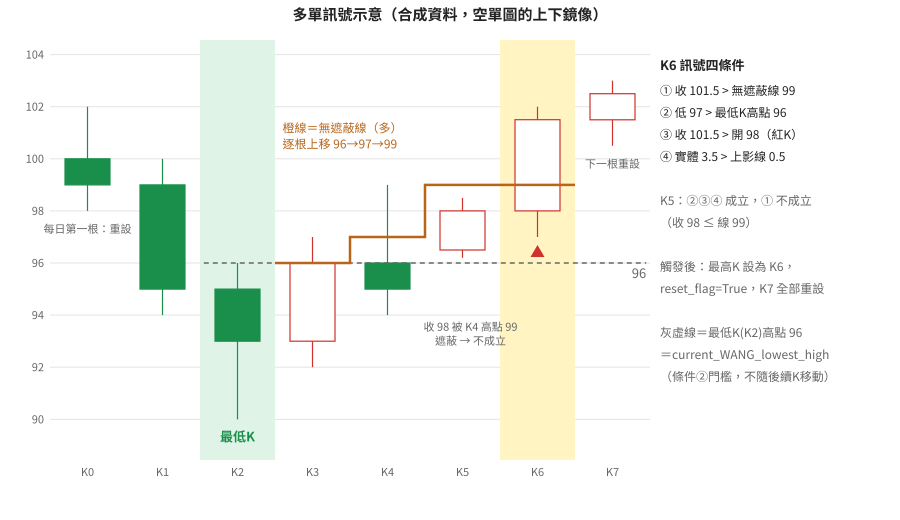
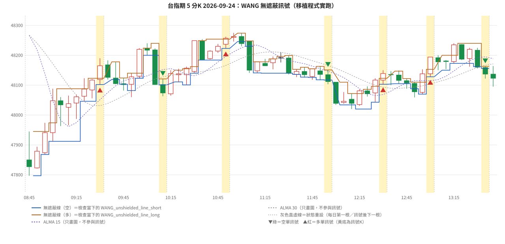
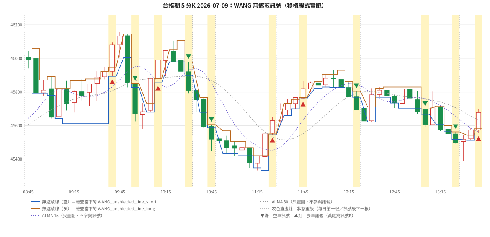

# q1 無遮蔽法則（AFL 程式解說）

> **來源說明**
> - 解說對象：使用者提供的 AmiBroker AFL 程式 [`wang_unshielded.afl`](./wang_unshielded.afl)。據說這是王慶津《期貨奇績1》的「無遮蔽法則」。
> - **本專案沒有《期貨奇績1》的書頁擷取**，這份程式跟《期貨奇績1》原文的對應關係**無法核實**。以下解說**以程式碼為準**，不推測書中規則。
> - 其他書（《期貨奇績2》《期貨奇績3》《操作進行曲》《股技期招》）有提到「無遮蔽」，原文整理在 §6，並和程式逐項比對。
> - Python 逐行移植：[`wang_unshielded.py`](./wang_unshielded.py)。示意圖和真實資料圖都由它產生（SVG，放在 `img/`）。
>   它不屬於 `src/wangtrader/methods/`，也不接回測框架。

---

## 1. 程式概要

AFL 分成三段 `_SECTION`：

| 段落 | 內容 | 會不會影響訊號 |
|---|---|---|
| `Price` | 畫收盤價與標題列 | 不會 |
| `ALMA` | 自寫 ALMA 函式，畫兩條均線 | **不會**（只畫圖，WANG 段沒有用到） |
| `WANG` | 用逐根 K 線的 `for` 迴圈跑狀態機，產生空單（綠▼）與多單（紅▲）**進場訊號** | 會 |

### 1.1 ALMA 雙均線

- 價格欄位：`price = ((H + L) + 2*(O + C)) / 6`，也就是 O、C 各佔 1/3，H、L 各佔 1/6。
- 短線 `ALMA(price, 15, 6, 0.85)`，長線 `ALMA(price, 30, 6, 0.85)`。參數依序為視窗長度、sigma、offset。
- 函式內：`m = floor(offset*(N-1))`（高斯中心，偏向最新 K）、`s = N/sigma`，權重 `w[i] = exp(-(i-m)²/s²)`，
  正規化後對最近的 K 線做加權平均。

| 視窗 N | m | s | 程式實際的權重 | 備註 |
|---|---|---|---|---|
| 15 | floor(11.9)=11 | 2.5 | `exp(-(i-11)²/6.25)`，i=1..14 | 權重大於 1% 的約 8 根，重心落後約 3.1 根 |
| 30 | floor(24.65)=24 | 5 | `exp(-(i-24)²/25)`，i=1..29 | 權重大於 1% 的約 13 根，重心落後約 5.4 根 |

ALMA 的實作疑點見 §5。**兩條 ALMA 都沒有進入訊號判斷**，程式裡也沒有「價格在均線上方才做多」之類的過濾。

### 1.2 WANG 訊號（重點）

一句話說明：**每天開盤（或上一個訊號之後）追蹤「最高 K」與「最低 K」。空單訊號要等一根黑 K 的收盤跌破最高 K 之後所有 K 線的最低點（無遮蔽），而且這根 K 整根都在最高 K 的低點之下；多單反過來。**

---

## 2. WANG 狀態機逐條解說

### 2.1 變數一覽

| AFL 變數 | 意義 | 初值 | 在哪裡更新 |
|---|---|---|---|
| `CurrentTime` | `TimeNum()`，每根 K 的時間（HHMMSS） | — | — |
| `current_WANG_highest_high` | 「最高 K」的最高價 | 0 | 重設、創新高、同高但低點較高、多單訊號 |
| `current_WANG_highest_low` | 「最高 K」的最低價，也就是空單**條件②的門檻** | 0 | 同上 |
| `WANG_unshielded_line_short` | **空方無遮蔽線**：從最高 K 的低點開始，之後遇到更低的低點就下移 | 0 | 同上，以及每根沒觸發空單、低點又更低的 K |
| `current_WANG_highest_index` | 最高 K 的 bar index | 0 | 同上（**重設時不更新**；全程式沒有讀取，沒有作用） |
| `current_WANG_lowest_low` | 「最低 K」的最低價 | 0 | 重設、創新低、同低但高點較低、空單訊號 |
| `current_WANG_lowest_high` | 「最低 K」的最高價，也就是多單**條件②的門檻** | 0 | 同上 |
| `WANG_unshielded_line_long` | **多方無遮蔽線**：從最低 K 的高點開始，之後遇到更高的高點就上移 | 0 | 同上，以及每根沒觸發多單、高點又更高的 K |
| `current_WANG_lowest_index` | 最低 K 的 bar index | 0 | 同上（沒有作用） |
| `reset_flag` | 本根出訊號後設為 True，**下一根** K 全部重設 | False | 訊號觸發、重設 |
| `normal_WANG_entry_point_short[i]` | 第 i 根是否出空單訊號（1／0） | — | 每根先設 0 |
| `normal_WANG_entry_point_long[i]` | 第 i 根是否出多單訊號（1／0） | — | 每根先設 0 |
| `during_WANG_short/long_transaction` | 原本應該是「持倉中」旗標 | False | **所有賦值都被註解掉，沒有作用** |
| `debug1[i]`, `debug2[i]` | 除錯用 | — | 每根設 0，沒有畫出，**沒有作用** |

說明：`hh/hl/line_s` 在下文分別代表 `current_WANG_highest_high / _low / WANG_unshielded_line_short`，
`ll/lh/line_l` 代表 `current_WANG_lowest_low / _high / WANG_unshielded_line_long`。

### 2.2 迴圈外框

```
for(i = 2; i < BarCount; i++)
```

從第 3 根 K（i=2）開始，逐根執行。每根先把兩個訊號陣列設成 0，然後分成「重設」和「正常更新」兩種情況，兩者只會走其中一個。

### 2.3 重設（每日第一根，或訊號後的下一根）

```
if( i == 0 OR CurrentTime[i-1] > CurrentTime[i] OR reset_flag == True )
```

重設條件有三個，符合任一個就重設：

1. `i == 0`：迴圈從 2 開始，所以**永遠不成立**（死碼）。
2. `CurrentTime[i-1] > CurrentTime[i]`：時間倒退，代表換日。在日盤資料上，這根就是**當天第一根 K**。
3. `reset_flag == True`：**上一根剛出過訊號**。

重設時，**兩邊都以這一根 K 重新起算**：

- 最高 K ＝本根：`hh = H`、`hl = L`、空方無遮蔽線 `line_s = L`。
- 最低 K ＝本根：`lh = H`、`ll = L`、多方無遮蔽線 `line_l = H`。
- 清掉 `reset_flag`。

重設那根**不做任何訊號判斷**（判斷都寫在 `else` 裡）。所以**當天第一根 K 和訊號後的下一根 K，一定不會出訊號**。

### 2.4 正常更新：依序做四件事

#### (1) 更新最高 K

```
if( H > hh )                          → 最高 K 換成本根
else if( H == hh AND L > hl )         → 最高 K 換成本根（並列處理）
```

- **創新高**：本根高點嚴格大於目前最高 K 的高點，最高 K 就換成本根。`hl` 和 `line_s` 都設成本根低點，
  也就是**無遮蔽線回到新最高 K 的低點重新起算**。
- **高點相同、低點較高**：高點打平，但本根低點比目前最高 K 的低點高，也換成本根。
  效果是在同樣高點的 K 線裡，挑**低點最高的那根**當最高 K，讓門檻 `hl` 和無遮蔽線起點盡量高。
  另外要注意：這時 `line_s` 也會**往上重設**成本根低點，之前在兩根同高 K 之間已經下移的無遮蔽線就被丟掉了。
- 高點相同、低點相同或較低：不變（保留較早的那根）。

#### (2) 更新最低 K（鏡像）

```
if( L < ll )                          → 最低 K 換成本根
else if( L == ll AND H < lh )         → 最低 K 換成本根（並列處理）
```

創新低，或低點打平但高點較低，最低 K 就換成本根，`lh` 和 `line_l` 設成本根高點。

#### (3) 空單訊號判斷

四個條件**全部成立**才出空單訊號：

| # | AFL | 白話 |
|---|---|---|
| ① | `Close < WANG_unshielded_line_short` | **收盤無遮蔽**：收盤低於「最高 K 的低點，以及最高 K 之後每一根 K 的低點」中最低的那個。任何一根 K 的下影線比收盤低，就算遮蔽 |
| ② | `High < current_WANG_highest_low` | **整根 K 都在最高 K 的低點之下**：本根最高價（含上影線）低於最高 K 的最低價 |
| ③ | `Close < Open` | **黑 K**（收低於開） |
| ④ | `Open - Close > Close - Low` | **實體大於下影線**：收盤接近當根低點，不是長下影線的 K |

成立時：

- `normal_WANG_entry_point_short[i] = 1`。
- **最低 K 改成本根**（`lh = H`、`ll = L`、`line_l = H`）。
- `reset_flag = True`，下一根全部重設。

不成立、而且本根低點比 `line_s` 更低時：**無遮蔽線下移**到本根低點（`line_s = L`）。

#### (4) 多單訊號判斷（鏡像）

| # | AFL | 白話 |
|---|---|---|
| ① | `Close > WANG_unshielded_line_long` | **收盤無遮蔽**：收盤高於「最低 K 的高點，以及最低 K 之後每一根 K 的高點」中最高的那個 |
| ② | `Low > current_WANG_lowest_high` | **整根 K 都在最低 K 的高點之上** |
| ③ | `Open < Close` | **紅 K** |
| ④ | `Close - Open > High - Close` | **實體大於上影線** |

成立時標記多單訊號，**最高 K 改成本根**，並設 `reset_flag`。不成立、而且本根高點比 `line_l` 更高時：無遮蔽線上移到本根高點。

### 2.5 無遮蔽線的精確意義

在第 i 根做判斷時（假設第 i 根不是新的最高 K）：

```
line_s(i) = min( 最高K的低點, 最高K之後到第 i-1 根為止每一根的低點 )
```

第 i 根自己的低點**要到判斷完才納入**（`else if` 放在訊號判斷之後），所以條件①比的是「**先前**所有 K 的低點」，
這和書中「前無遮蔽」的說法方向一致（見 §6）。如果第 i 根本身就是新的最高 K，`line_s = L[i]`，
收盤不可能低於自己的低點，條件①必然不成立。

多方的 `line_l` 是鏡像：最低 K 的高點，以及之後到第 i-1 根為止每一根高點的最大值。

### 2.6 訊號觸發後的處理

| 時點 | 空單訊號觸發 | 多單訊號觸發 |
|---|---|---|
| 當根 | 最低 K 改成訊號 K（`lh/ll/line_l` 設成訊號 K 的 H/L/H） | 最高 K 改成訊號 K（`hh/hl/line_s` 設成訊號 K 的 H/L/L） |
| 當根的另一側判斷 | 多單條件②變成 `L > H`，**必不成立** | 多單在空單之後才判斷，所以沒有影響空單 |
| 下一根 | `reset_flag` 為真，**兩側都以下一根 K 重新起算**，而且這根不判斷訊號 | 同左 |

所以「當根把另一側改成訊號 K」的**唯一實際效果**，是擋住同一根的反向訊號（其實條件③的紅黑 K 已經互斥，見 §5）。
到了下一根，兩側都會被重設覆蓋。

換句話說，這個狀態機的「最高 K／最低 K」**不是轉折點**，而是**從今天開盤或上一個訊號的下一根起算的極值 K**。
訊號之後不管方向，全部重新計算；程式也沒有「持倉中不再出同向訊號」的限制，所以在趨勢中可能連續出現同向訊號。

### 2.7 流程圖



以狀態來看：



---

## 3. K 線示意圖

兩張圖用合成資料畫成，而且**真的跑過移植程式**（`wang_unshielded.py` 裡的 `assert`），確認訊號就出在第 6 根（K6），K5 不出訊號。

### 3.1 空單訊號



| K | O / H / L / C | 發生了什麼 |
|---|---|---|
| K0 | 100 / 102 / 98 / 101 | 當日第一根，重設 |
| K1 | 101 / 106 / 100 / 105 | 創新高，最高 K = K1 |
| **K2** | 105 / **110** / **104** / 107 | 創新高，**最高 K = K2**，`hl = 104`，無遮蔽線 = 104 |
| K3 | 107 / 108 / 103 / 104 | 高 108 ≥ 104，條件②不成立；低點 103 < 104，**線下移到 103** |
| K4 | 104 / 106 / 101 / 105 | 紅 K；低點 101，**線下移到 101** |
| K5 | 103.5 / 103.8 / 101.5 / 102 | ②③④成立，但收 102 ≥ 線 101，**被 K4 的下影線遮蔽**，條件①不成立 |
| **K6** | 102 / 103 / 98 / 98.5 | ①98.5<101 ②103<104 ③黑K ④實體 3.5 > 下影 0.5 → **空單訊號** |
| K7 | 98.5 / 99.5 / 97 / 97.5 | `reset_flag`，重設，不判斷 |

### 3.2 多單訊號（空單圖的上下鏡像）



最低 K 是 K2（低 90、高 96），多方無遮蔽線依序上移 96 → 97（K3 高點）→ 99（K4 高點）。
K5 收 98 被 K4 的上影線 99 遮蔽，不成立。K6 收 101.5 > 99、低 97 > 96、紅 K、實體 3.5 > 上影 0.5，出**多單訊號**。

---

## 4. 移植程式與真實資料

### 4.1 移植說明

[`wang_unshielded.py`](./wang_unshielded.py) 的 `alma_afl()`、`wang_afl()` 逐行對照 AFL，每一行都附上 AFL 原文註解。
**AFL 的疑點照原樣保留**（i 從 2 開始、ALMA 跳過 w[0]、分母 s²、變數初值 0），沒有修正。
另外加了畫圖用的追蹤欄位（判斷當下的 `line_s/hl/line_l/lh`、重設位置），這些欄位不影響邏輯。

- `TimeNum()` → `hour*10000 + minute*100 + second`。
- 資料：`data/tx_day_5min.parquet`，台指期日盤 5 分 K（08:45～13:40，多數交易日 60 根，28 天為 57 根）。

```bash
uv run python "methods/期貨奇績1/wang_unshielded.py"
```

輸出：`img/` 下的 4 張 SVG、訊號清單 [`wang_unshielded_signals.csv`](./wang_unshielded_signals.csv)，以及終端機統計。

### 4.2 全期間訊號統計

資料期間 2024-05-09 08:45 ～ 2026-09-24 13:40，共 34,416 根 5 分 K、575 個交易日。

| 項目 | 數值 |
|---|---|
| 空單訊號 | 1,476 次 |
| 多單訊號 | 1,574 次 |
| 合計 | 3,050 次，平均每日 5.30 次 |
| 有訊號的交易日 | 571／575 天 |
| 單日最多 | 11 次 |
| 同一根同時多空 | 0 次（理論上不可能，見 §5） |
| 最後一根（13:40）出的訊號 | 46 次（來不及在日盤內操作） |

每日訊號次數分布：

| 次數 | 0 | 1 | 2 | 3 | 4 | 5 | 6 | 7 | 8 | 9 | 10 | 11 |
|---|---|---|---|---|---|---|---|---|---|---|---|---|
| 天數 | 4 | 4 | 23 | 51 | 104 | 122 | 123 | 91 | 36 | 13 | 3 | 1 |

訊號時段（小時）：08 點 42 次、09 點 700 次、10 點 617 次、11 點 594 次、12 點 621 次、13 點 476 次。
08 點偏少，因為 08:45 那根一定是重設根，08 點只剩 08:50、08:55 兩根可以出訊號。

**參考用描述統計（不是回測）**：程式沒有出場規則，這裡只看「訊號 K 收盤價到當日收盤」的順向點數。
多單平均 −7.2 點（中位數 +0.5，為正 50.0%），空單平均 +17.9 點（中位數 +1，為正 50.1%）。
勝率約五成、中位數接近 0，只憑這個進場訊號抱到收盤，看不出穩定優勢；空單平均為正主要來自少數大跌日。要評估這個方法，必須先確定出場規則（見 §5.6）。

### 4.3 真實資料圖

兩天都由移植程式實跑。藍線、橙線是**判斷當下**的空方／多方無遮蔽線，灰色直虛線是狀態重設的位置，黃底是訊號 K。

**2026-09-24**（當日有多有空，資料中最近的一天，7 次）：多 09:30、空 10:10、多 10:50、空 11:55、多 12:30、多 13:00、空 13:35。



**2026-07-09**（訊號最多的一天，11 次）：多 09:40、空 09:55、多 10:10、空 10:30、空 10:45、多 11:25、多 11:45、空 12:20、空 13:05、空 13:25、多 13:40（最後一根）。



從圖上可以看到：

- 每次訊號後的下一根，兩條線都從那一根重新起算，所以常常很快就出現下一個訊號。震盪日一天會出 8～10 次。
- 最高 K／最低 K 是「重設以來的極值」，不是轉折點。一段期間沒有創新高、也沒有更低的低點時，無遮蔽線就維持水平（例如 09-24 的 12:05～12:25 空方線停在同一價位）；一旦出現更低的低點，線就跟著下移，下一根收盤必須再低過它。

---

## 5. 程式疑點與瑕疵

| # | 疑點 | 說明 | 影響 |
|---|---|---|---|
| 5.1 | **主迴圈從 i=2 開始** | 第 0、1 根完全不處理。`i == 0` 的重設條件因此成為死碼。資料第一天從第 3 根才開始追蹤，而且**不會重設**（i=2 時沒有時間倒退，除非剛好換日） | 見 5.7：第一天的多方狀態是錯的。其他日子因為有換日重設，不受影響。為什麼從 2 開始，程式裡沒有說明（可能是從別的需要 `[i-2]` 的程式複製來的） |
| 5.2 | **ALMA 權重迴圈從 i=1 開始** | 三個迴圈都用 `for(i = 1; i < windowSize; i++)`，跳過 `w[0]`（`w = 0` 讓 w[0] 保持 0），實際只用了 windowSize−1 根（15→14 根、30→29 根） | 高斯中心在 m=11／24，w[0] 本來就接近 0（標準公式下約 1e-9），**數值影響很小**。但它是 off-by-one，代表作者對索引範圍不確定 |
| 5.3 | **ALMA 分母少了 2** | 程式寫 `exp(-(i-m)²/(s*s))`，註解「2 should be there?」。標準 ALMA 是 `exp(-(i-m)²/(2·s²))` | 高斯寬度變成標準的 1/√2，權重更集中在 m 附近。再加上 `m` 用 `floor`（標準公式不取整），最新一根的權重從 13.2% 降到 5.5%（N=15）。畫出的均線形狀和一般軟體的 ALMA 不同 |
| 5.4 | **ALMA 起始與用途** | `j < windowSize` 才輸出 Null，實際只需要 windowSize−1 根就能算，多空了一根。ALMA 跨日連續計算。**最重要的是：ALMA 完全沒有進入 WANG 訊號判斷** | 如果原書的無遮蔽法則要搭配均線方向，這份程式沒有做到（專案內無書中原文，無法判斷） |
| 5.5 | **沒有作用的變數** | `debug1/debug2` 每根設 0，沒有畫出；`during_WANG_short/long_transaction` 所有賦值都被註解掉；`current_WANG_highest/lowest_index` 只寫不讀，而且重設時不更新 | 不影響結果。看得出作者原本想做「持倉中」狀態（例如持倉中不出同向訊號、反向訊號平倉），但沒有完成 |
| 5.6 | **只有進場，沒有出場** | 程式只畫▲▼，沒有停損、停利、反向平倉、收盤平倉，也沒有 `Buy/Sell/Short/Cover` 陣列，不能直接用 AmiBroker 回測 | 無法評估績效。13:40 最後一根也可能出訊號（46 次）。**要回測必須另外定義出場**，而出場規則在專案內沒有《期貨奇績1》原文可以依據 |
| 5.7 | **無遮蔽線初值為 0** | 全部狀態初值都是 0。資料第一天 i=2 不重設時：最高側因為 `H > 0` 會正常更新；**最低側**因為 `L < 0` 永遠不成立，`ll = lh = line_l = 0` 保持不變。這時多單條件①`C > 0`、②`L > 0` 永遠成立，只要出現紅 K 且實體大於上影線就出多單 | 實測：資料第一天（2024-05-09）09:10 出了一個假的多單訊號。如果讓 i=2 正常重設，這個訊號就會消失，其餘訊號相同。之後因為訊號後的重設，狀態就恢復正常。**只影響資料的第一段**，但在 AmiBroker 上圖表的起點會隨捲動或 QuickAFL 改變，起點附近可能出現假訊號 |
| 5.8 | **同一根可能同時多空嗎？** | 不可能。空單要 `C < O`、多單要 `C > O`，條件③互斥；十字線（C = O）兩邊都不成立。另外空單觸發後會把最低 K 設成本根，多單條件②變成 `L > H`，也必不成立 | 實測 0 次。但**十字 K 永遠不會出訊號** |
| 5.9 | **換日偵測依賴時間倒退** | 用 `TimeNum[i-1] > TimeNum[i]` 判斷換日。日盤資料沒問題。如果用夜盤（15:00～05:00），會在**午夜**重設，而不是在盤別開始時重設。日線以上的週期 `TimeNum` 固定，**永遠不會換日重設**，只剩訊號後重設 | 程式隱含假設使用日內 K 線，而且一天只有一個交易時段 |
| 5.10 | **並列時無遮蔽線會往上重設** | 「高點相同、低點較高」時，`line_s` 被設成新最高 K 的低點。如果兩根同高 K 之間有更低的低點，那個低點就被忘掉了 | 對後一根同高 K 來說，這樣符合「自最高 K 之後」的定義；但對整段走勢來說，這個低點原本會遮蔽收盤。書中對同高 K 怎麼處理，專案內沒有原文 |
| 5.11 | **重設根和訊號後一根不判斷** | 重設走 `if` 分支，訊號判斷只寫在 `else` | 當日第一根、訊號後下一根永遠不會出訊號，連續兩根都符合條件時，第二根會被略過 |
| 5.12 | **訊號陣列前兩根沒有賦值** | `normal_WANG_entry_point_*[0..1]` 從未被迴圈寫入 | 內容取決於 AmiBroker 對未初始化陣列元素的處理；`PlotShapes` 只比較 `== 1`，實務上不會誤畫 |
| 5.13 | **極值不是轉折點** | 最高 K／最低 K 是「重設以來的極值」，沒有層級 2 轉折、均線、時間窗（例如《期貨奇績3》破三低要求 4 根內）等限制 | 訊號頻繁（每日約 5.3 次）。是否符合《期貨奇績1》原意，專案內無書中原文，無法判斷 |

---

## 6. 與書中描述對照

### 6.1 專案內書中原文搜尋結果

- 在 `extracted/`、`methods/` 用 grep 搜尋「遮蔽」「無遮蔽」「不遮蔽」「unshield」：
  **專案內沒有《期貨奇績1》的原文**，也沒有「無遮蔽法則」這個名稱（「不遮蔽」「unshield」除了本 AFL 之外都沒有結果）。
- 「無遮蔽」出現在其他書的 29 個擷取頁（`grep -l 無遮蔽 extracted/pages/*.md`），分布在《期貨奇績2》《期貨奇績3》《操作進行曲》《股技期招》《股勝先選》。
- 下面的引文取自 `extracted/pages/*.md` 的逐字擷取。本次工作環境中沒有書頁照片（`reference/book-jpg/` 不存在），**引文沒有再用照片核實**。

### 6.2 書中「無遮蔽」的定義（摘錄）

| 出處 | 原文（摘錄） |
|---|---|
| 《期貨奇績3》p.106–107，圖 5-5（`extracted/pages/IMG_8378.md`） | 「空訊必須是自最高K線後，向下無遮蔽黑K線，注意到C的隔根D的低點比E的收盤低，換言之，E的K線收盤高於D的低點，形成遮蔽現象，非自C最高K線出現後，最低的無遮蔽K線，因此非符合條件的放空訊號。」 |
| 《期貨奇績2》p.17，圖 1-16（`extracted/pages/IMG_8464.md`） | 「標示 A 的 K 線高點突破標示 1 峰點，但收盤卻站不上，則後續行情必須收盤突破標示 A 的高點，而非原來標示 1 峰點，才能符合訊號無遮蔽要求，即訊號 K 線收盤為行情突破站上均線後最高 K 線，即標示 3 買進訊號 K 線收盤，高於標示 1 至標示 3 前一根之間任何一根 K 線最高點。」 |
| 《期貨奇績2》p.15（`extracted/pages/IMG_8463.md`） | 「那會形成放空位置並非價格跌破均線後的最低無遮蔽K線……標示3位置出現的放空訊號，它的K線是行情跌破均線（MA30）後，最低的K線，且收盤也符合最低且無遮蔽要求。」 |
| 《期貨奇績2》p.70–71，圖 2-4（`extracted/pages/IMG_8487.md`） | 「SAR所產生的買賣訊號，同樣要求符合無遮蔽原則……標示C的K線收盤跌破了A，但是收盤價卻被標示B的下影線擋住，無法呈現無遮蔽，不能成為放空訊號」 |
| 《操作進行曲》p.16，「無遮蔽原則」（`extracted/pages/IMG_8723.md`） | 「所謂『無遮蔽原則』指從量縮 K 線開始，當出現某一根 K 線突破了量縮 K 線最高點時，它的收盤價也必須高於自量縮 K 線之後的任一 K 線最高點，這個條件成立時，我們稱之為前無遮蔽的買進 K 線」 |
| 《操作進行曲》p.166–167（`extracted/pages/IMG_8801.md`） | 「過高點或者過低點的認定，就是注意前無遮蔽的原則，即任一 K 線收盤超過了前波高點時，它的前面不能有其它 K 線的上影線擋著其收盤創新高的動作；換言之，收盤比前波高點更高外，還要比最靠近的 K 線上影線更高，才算是創新高點」 |
| 《股技期招》p.77，圖 1-84（`extracted/pages/IMG_8618.md`） | 「呈現無遮蔽(即自訊號 K 線出現至 P 點之間沒有任何一根 K 線最高點為 P 點之 K 線收盤價高)，才是理想的買進訊號。」 |
| 專案術語表（`methods/術語表.md`「無遮蔽（收盤）」） | 「訊號K收盤須是該波段以來最高（低）收盤，不被同波段任何K線高低點遮蔽；影線觸及不算」。使用這個概念的方法：q2-01、q2-04、q2-05、gq-01-11、cz-01-01、cz-02-01、cz-04-02、cz-04-03 |

相關方法文件：[`q2-01` §3.3.3](../期貨奇績2/q2-01-一分鐘穿越均線買賣策略.md)、
[`cz-04-03`「前無遮蔽」原則](../操作進行曲/cz-04-03-移動停損停利出場法.md)、
[`gq-01-11` C5](../股技期招/gq-01-11-轉折點趨勢線突破訊號.md)、
[`gq-01-12` 模式三](../股技期招/gq-01-12-出場停損模式.md)。

歸納：書中的「無遮蔽」指的是**從某個起算 K 開始，訊號 K 的收盤要超過其間每一根 K 的最高點（做多），或低於每一根 K 的最低點（做空）**。
影線也算遮蔽，只有影線穿過而收盤沒過不算數。

### 6.3 程式與書中定義的異同

| 項目 | 書中（其他書） | AFL 程式 | 判斷 |
|---|---|---|---|
| 以收盤判斷，影線算遮蔽 | 收盤要超過（跌破）其間所有 K 的高（低）點，影線也算 | 條件①：`C < line_s`，`line_s` 是最高 K 起每根的**最低價**（含下影線） | **一致** |
| 比較範圍含起算 K、不含訊號 K 本身 | 《期貨奇績2》p.17：「高於標示 1 至標示 3 **前一根**之間任何一根 K 線最高點」 | `line_s` 從最高 K 的低點開始，訊號 K 自己的低點在判斷後才納入 | **一致** |
| 空訊以「最高 K」為參考、要黑 K | 《期貨奇績3》p.106：「自最高K線後，向下無遮蔽黑K線」 | 最高 K＝重設以來最高價的 K；條件③黑 K | **一致**（書中這段是破三低的脈絡） |
| 起算點 | 依方法不同：均線突破後（奇績2 p.15、17）、峰谷點或濾網、量縮 K（操作進行曲）、訊號 K（股技期招）、盤中最高 K（奇績3） | **當日開盤或上一個訊號的下一根**，之後的最高／最低 K | **不一致**：程式沒有轉折點、均線、量縮等結構，起算點是機械式的日內極值 |
| 「最高 K」的定義 | 奇績3 p.106 為盤中最高 K（峰點） | 重設以來 High 最大的 K；同高時取低點較高者 | 大致一致；同高並列的處理書中未見 |
| 條件②：整根 K 在最高 K 低點之下 | 所摘錄的無遮蔽定義**沒有**這一條 | `H < current_WANG_highest_low` | **程式獨有**（是否出自《期貨奇績1》，無法核實） |
| 條件④：實體大於下（上）影線 | 所摘錄的無遮蔽定義**沒有**這一條 | `O−C > C−L`（空）、`C−O > H−C`（多） | **程式獨有**（同上） |
| 無遮蔽只是訊號的一部分 | 書中都是搭配其他步驟（三步驟、濾網、SAR、KD、時間窗 4 根內或 15 根內、停損距離 20 點等） | 無遮蔽加上②③④就直接成為訊號，沒有其他過濾，ALMA 也沒用上 | **不一致**：程式是獨立的進場訊號 |
| 術語表「最高（低）收盤」 | 術語表寫「該波段以來最高（低）收盤」 | 程式要求收盤低於**所有低點**，比「最低收盤」更嚴 | 程式和原文（p.17「高於……任何一根 K 線最高點」）一致；術語表的簡寫比原文寬鬆 |
| 出場 | 各書另有停損停利規則（例如 gq-01-12 模式三用「創新高且無遮蔽」移動停損） | 沒有出場 | 程式不完整 |

**結論**：程式裡的 `WANG_unshielded_line_*` 忠實表達了其他書「收盤不被先前任何 K 線影線遮蔽」的核心定義，起算的比較範圍也和書中一致。
但是起算點（日內極值、訊號後重設）、條件②④、以及缺少的濾網與出場規則，都沒辦法在專案現有的原文中找到依據。
這些是否就是《期貨奇績1》的「無遮蔽法則」，要等有《期貨奇績1》書頁擷取後才能判斷。

---

## 7. 相關檔案

| 檔案 | 說明 |
|---|---|
| [`wang_unshielded.afl`](./wang_unshielded.afl) | 使用者提供的原始 AFL |
| [`wang_unshielded.py`](./wang_unshielded.py) | Python 逐行移植，產生圖和統計 |
| [`wang_unshielded_signals.csv`](./wang_unshielded_signals.csv) | 全期間 3,050 個訊號清單（含判斷當下的無遮蔽線與門檻） |
| `img/q1-unshielded-short-demo.svg`、`img/q1-unshielded-long-demo.svg` | 空單、多單示意圖（合成資料） |
| `img/q1-unshielded-real-2026-09-24.svg`、`img/q1-unshielded-real-2026-07-09.svg` | 真實資料圖 |
