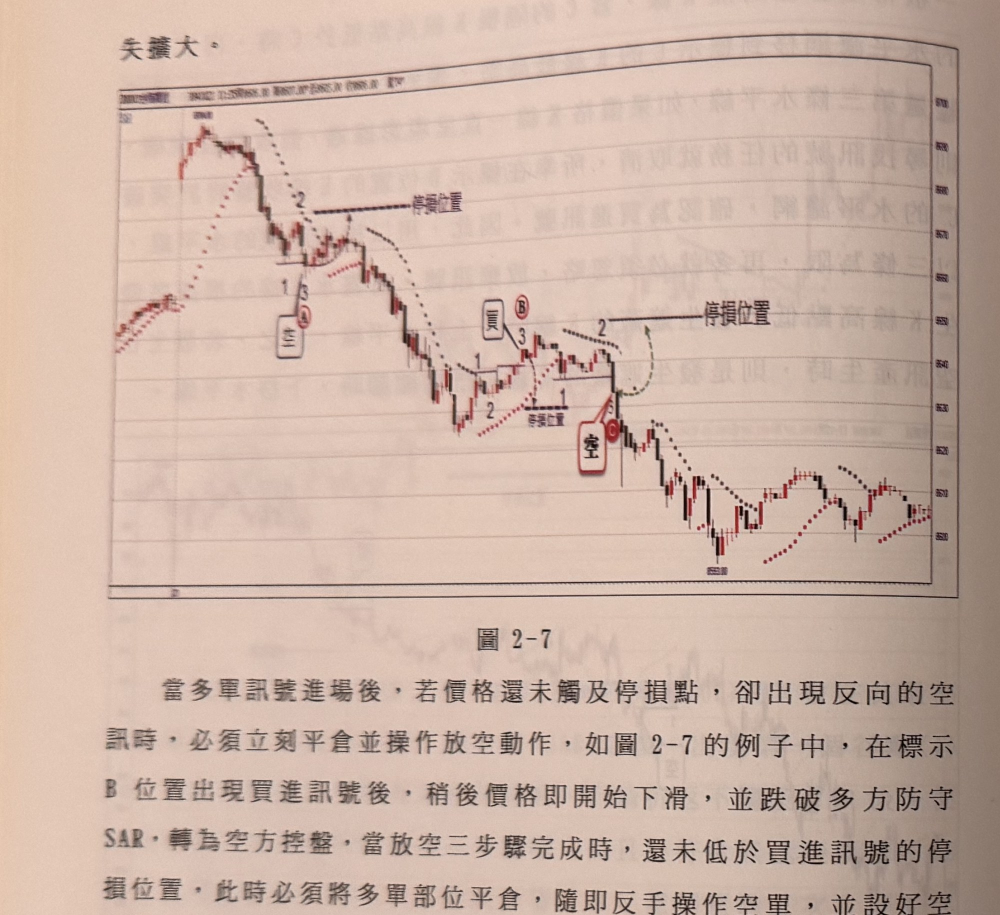
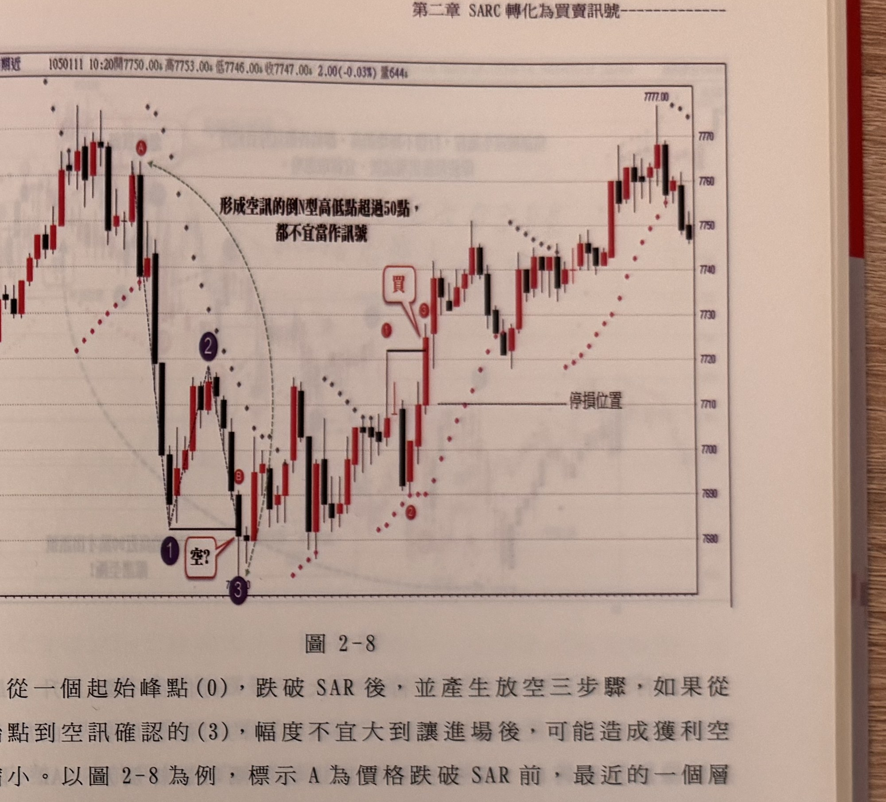

# SARC 轉化為買賣訊號

> 一句話摘要：以 SAR 轉折取代均線，做為判斷多空控盤方的依據，再以類似「1-2-3」的N型/倒N型結構產生買賣訊號（訊號完整定義所在頁面缺失，僅能由現存兩頁的舉例反推部分規則）。

## 1. 核心概念

**本章絕大部分頁面缺失**（僅取得 p.74-75，本章實際範圍約 p.74～p.93），包括核心方法定義的段落。從現存內容可以確認：

- 本章方法以「SAR」（Stop And Reverse，拋物線轉向指標）的轉折做為多空控盤依據，取代第一章中「均線」的角色（p.74）。
- 行情會先出現一個「起始峰點(0)」或「起始谷點(0)」，價格跌破/突破 SAR 後，依循類似第一章、第三章的「1-2-3」三步驟，形成放空或買進訊號（p.75：「從一個起始峰點(0)，跌破SAR後，並產生放空三步驟」）。

（推論）由於書中第三章 PVT 通道亦採用相同的「0-1-2-3」N型/倒N型三步驟語彙，且明確提及「停損設置如穿越均線策略介紹一樣」，可合理推測 SARC 訊號的三步驟定義與停損機制，應與第一章的均線三步驟訊號（見 q2-01）高度相似，只是「均線」換成「SAR 轉折」；但由於本章訊號定義頁面缺失，此點**無法由原文逐條驗證**，僅供參考，不可視為確定規則。

## 2. 適用前提

- 一分鐘K線圖，台指期近月商品（p.74-75報價列所示）。
- 需搭配 SAR 指標繪製於K線圖上（p.74-75圖例）。
- 其餘適用前提（如是否僅限盤中特定時段等）因頁面缺失，書中未見明確說明。

## 3. 訊號定義

**本節核心內容缺失**（訊號的完整定義、SAR參數設定、以及「1-2-3」步驟的判斷條件，應在缺失的 p.76-93 或更早的章節開頭頁面中）。現存頁面僅提供以下可確認的片段規則：

1. **C1（可確認片段）** 價格跌破/突破 SAR 後，形成一個「起始峰點(0)」或「起始谷點(0)」，隨後續行 1-2-3 三步驟（p.75）。
2. **C2（可確認片段，過濾規則）** 「起始點(0)」到訊號確認收盤「(3)」之間的距離，**不宜超過50點**；書中舉例距離達82點時，訊號出現在當波段最低點附近，形同陷阱，應忽略（p.75，圖2-8）。

## 4. 進場

書中舉例可見進場動作發生在三步驟(3)確認的當根K線（p.74-75），但完整的進場價格規則（是否等收盤、是否有補進場機制等）因頁面缺失，**書中未見明確說明**。

## 5. 停損

現存頁面提及設好停損位置的動作，但**未列出具體停損公式**（p.74：「隨即反手操作空單，並設好空單的停損位置」）。（推論）依第三章 p.100「停損設置如穿越均線策略介紹一樣，請參考之」的先例，SARC 章節的停損公式很可能與第一章相同（見 q2-01 第5節：收盤−(10+個位數)），但本章原文未直接證實此點，故僅列為推論，不列入機器可讀規則的 stop_loss 區塊。

## 6. 出場 / 停利

書中未見明確說明（本節內容應在缺失頁面中）。

## 7. 過濾：不做的情況

1. **起始點到訊號確認距離 >50點 → 忽略**：從跌破/突破SAR前最近的層級2峰（谷）點，到放空（買進）三步驟確認收盤的距離，若超過50點，建議忽略，因為此時跌勢（漲勢）可能已經「表演完畢」，容易在極端點附近才出訊號形成陷阱（p.75）。書中亦提及部分風險承受度高的操作者選擇不設此濾網，但强調風險確實增加。

## 8. 範例解析



- **圖2-7**（p.74）：一分鐘K線圖搭配均線與SAR點列。示範「持有多單未觸及停損時，出現反向放空三步驟訊號，須立即平倉多單並反手做空」的規則（與第一章、第三章的反手規則一致）。標示B為買進訊號位置，其後價格反轉跌破SAR、完成放空三步驟，此時即便多單尚未觸及停損，仍須平倉反手。


- **圖2-8**（p.75）：一分鐘K線圖搭配SAR點列。示範第7節的50點濾網：標示A為跌破SAR前最近的層級2峰點，到放空三步驟確認收盤(3)的距離達82點（超過50點上限），訊號出現位置恰好逼近波段最低點，屬於「陷阱」訊號，應忽略。

## 9. 作者提醒與常見錯誤

- 當多單尚未觸及停損卻已出現反向放空訊號時，須立即平倉反手，不可留在原有部位的情緒中觀望（p.74）。
- 起始點到訊號確認的幅度過大（如超過50點）時，即使技術上符合三步驟定義，仍可能是行情已經走到極端、隨時反轉的「陷阱」訊號；作者建議忽略此類訊號，但也承認部分高風險承受度的操作者選擇照做，需自行衡量（p.75）。

## 10. 規則速查（Checklist）

- [ ] 價格跌破/突破 SAR，形成起始峰（谷）點(0)
- [ ] 依 1-2-3 步驟完成N型（買）或倒N型（空）結構（詳細條件缺頁，無法列出完整條列）
- [ ] 起始點(0)到訊號確認收盤(3)的距離 ≤50點（否則忽略）
- [ ] 持倉未停損時出現反向訊號 → 立即平倉反手

## 11. 機器可讀規則

```yaml
signal: SARC轉化買賣訊號
side: both
timeframe: 1m
instrument: TX_near_month
conditions:
  - id: C1
    desc: 價格跌破/突破SAR後，形成起始峰點或起始谷點(0)，並展開1-2-3三步驟結構（步驟1、2的具體判斷條件缺頁，未能確認）
    source: p.75
entry: 書中未見明確說明（僅可由範例圖反推，三步驟(3)確認當根進場，未證實細節）
stop_loss: 書中未見明確說明（推論：可能與均線策略停損公式相同，見q2-01，但無法由本章原文驗證）
exit:
  reversal_rule: "持倉未觸及停損時出現反向三步驟訊號，立即平倉反手，並設定新停損"
  source: p.74
filters:
  - desc: 起始峰（谷）點(0)到訊號確認收盤(3)的距離 >50點 → 忽略
    source: p.75
```

## 12. 待確認事項

- **嚴重缺頁**：本章原始範圍約p.74-93（共約20頁），僅取得p.74-75兩頁照片，且p.74開頭即為「承接前頁末句」的斷句，代表本章開頭核心定義（SAR轉折如何界定1-2-3步驟、進場規則、停損公式、停利機制等）完全不在現有材料中，無法還原，僅能標記「書中未明確說明」或以（推論）註記。
- 「SARC」一詞的完整原文定義（是否為 SAR + Cross 之類縮寫）未見於現存頁面，僅由章名沿用。
- 本章與第一章、第三章的關係（例如訊號K線幅度濾網、時間濾網等是否比照辦理）無法確認，未列入本文件。
- 建議：若日後取得 p.76-93 的照片，應優先補齊本文件第3、4、5、6節。

## 13. 原文出處

- `extracted/pages/IMG_8489.md`（p.74-75）
