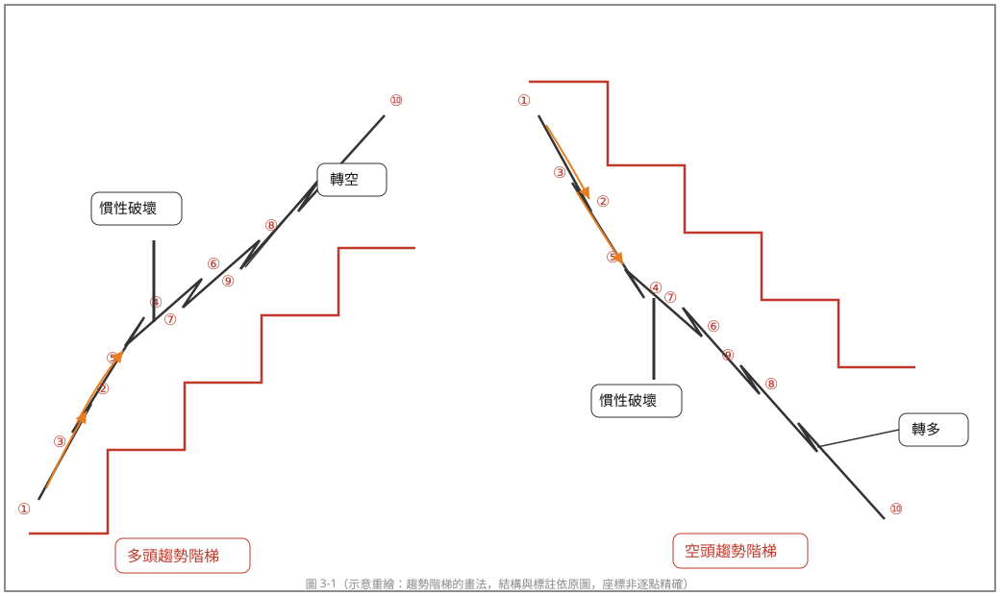
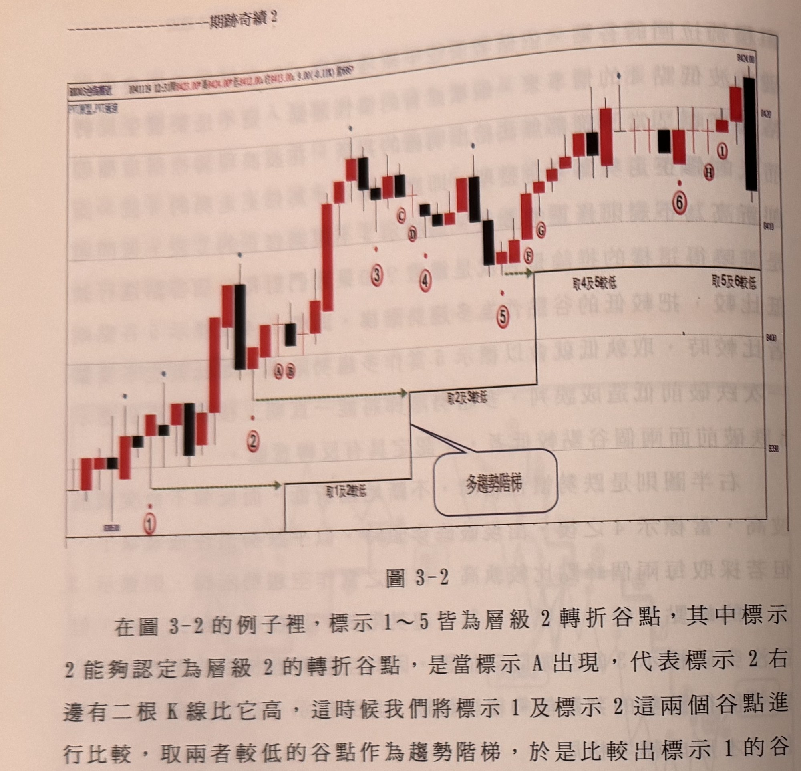
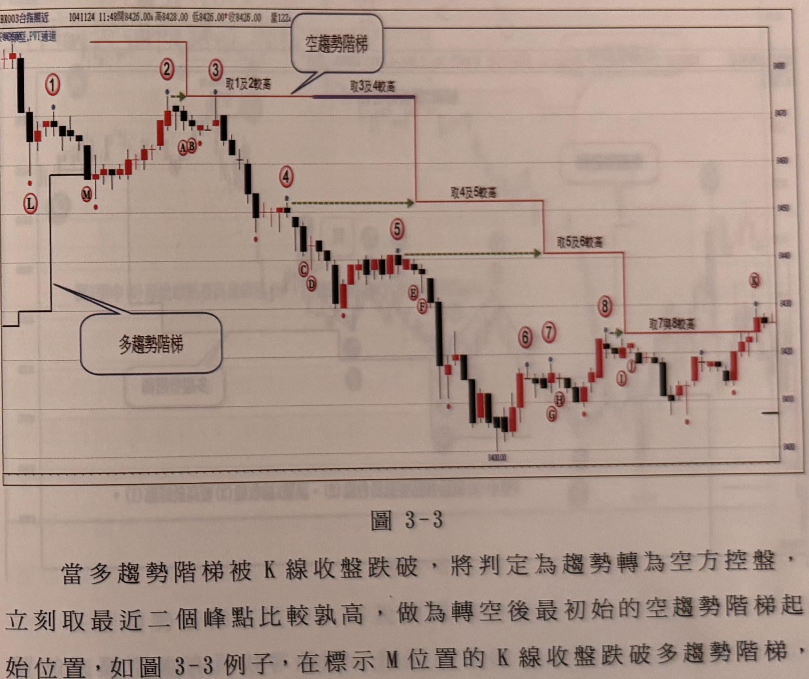
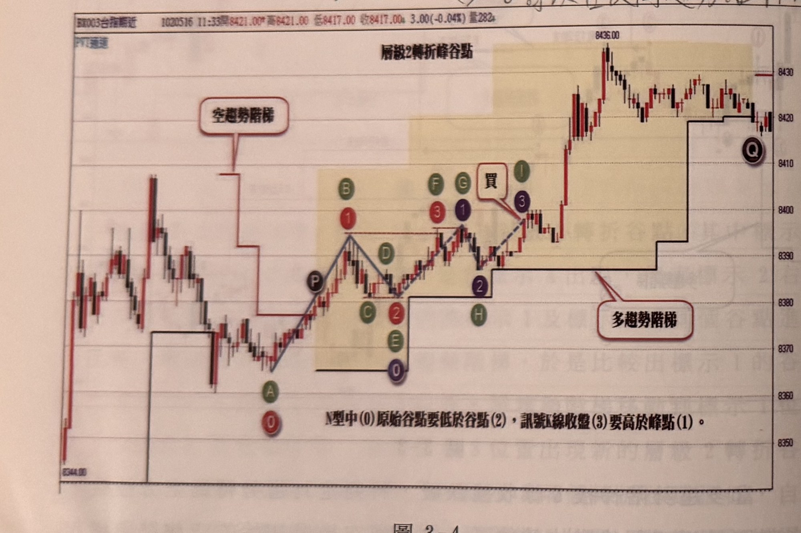
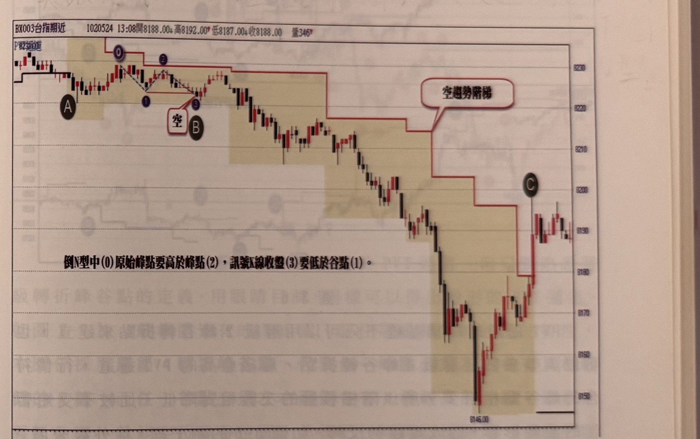
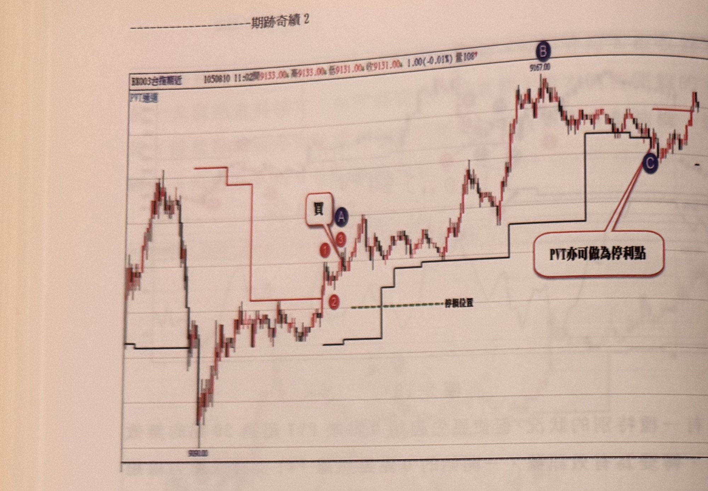
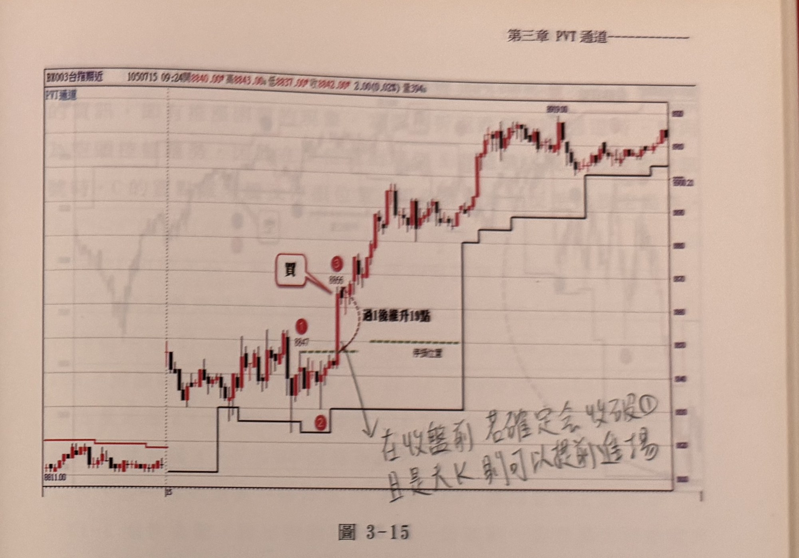
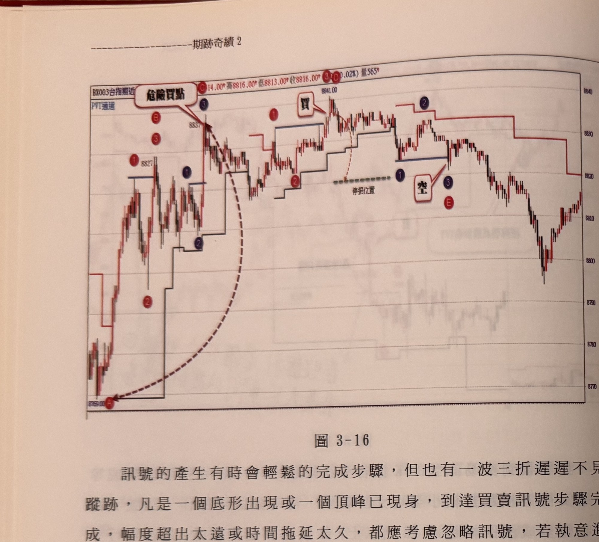

# PVT 通道 N型／倒N型突破訊號

> 一句話摘要：以「兩兩取樣、取孰低（多趨勢）或孰高（空趨勢）」的層級峰谷轉折點畫出階梯狀的「PVT通道」做為多空控盤依據，再以N型（買）或倒N型（空）三步驟結構產生買賣訊號。

## 1. 核心概念

理想的多頭走勢應是「峰一波比一波高、谷一波比一波高」，空頭走勢則相反；但實際行情常有「破前低（高）後又創新高（低）」的假破壞（波浪理論稱之為平台整理）。作者的解法是：**每兩個相鄰的谷點（峰點）互相比較，取較低（多趨勢）或較高（空趨勢）者，作為「趨勢階梯」**，藉此不受單次破前低/前高干擾，讓多空控盤的判斷得以延續（p.94-95）。

K線收盤突破多趨勢階梯，不代表買進訊號，只代表趨勢**由空轉多控盤**；K線收盤跌破多趨勢階梯，也不代表放空訊號，只代表趨勢**轉為空方控盤**。真正的買賣訊號，仍須等待價格在新的控盤趨勢中出現「N型」（買）或「倒N型」（空）結構才成立（p.94）。

## 2. 適用前提

- 一分鐘K線圖，台指期近月商品。
- 需先以「層級峰谷轉折點」（可用層級2或層級4，見第3.5節）畫出多趨勢階梯／空趨勢階梯（PVT通道）。
- 若看盤軟體無內建PVT通道功能，可用層級4轉折點的定義，以肉眼在一般K線圖上手動標示、目測畫出隱形的PVT通道支撐壓力線（p.101，圖3-7）。

## 3. 訊號定義

### 3.1 趨勢階梯（PVT通道）的建構規則（p.95-98，圖3-1、圖3-2、圖3-3）

- **多趨勢階梯**：取相鄰兩個層級轉折**谷點**中較低者，作為階梯支撐線；當更新的谷點出現時，與前一個已採用的谷點比較，取較低者更新階梯（不是每次都跟最新一個谷點比較，而是跟「上一個被採用的谷點」比較）。
- **空趨勢階梯**：取相鄰兩個層級轉折**峰點**中較高者，作為階梯壓力線；更新邏輯與多趨勢階梯對稱。
- **微小差距忽略**：兩個轉折谷點（峰點）之間的差距在**2點以內**，應忽略此次比較，不必移動階梯（p.96）。
- **控盤轉換**：當K線收盤跌破多趨勢階梯，判定轉為空方控盤，此時**立刻**取「最近的兩個層級峰點」比較孰高，作為轉空後最初始的空趨勢階梯（p.97）；反之，K線收盤突破空趨勢階梯時，判定轉為多方控盤，並立刻建立最初始的多趨勢階梯（p.97-98，多空對稱）。
- 注意：轉換當下的K線（如p.97舉例的標示M）本身**不是**買賣訊號，只是控盤易主的標記（p.97）。

### 3.2 N型買進結構（多趨勢階梯區域內，p.98-99，圖3-4）

1. **C1** 行情進入多趨勢階梯控盤區域後，尋找由「0-1-2-3」四點構成的N型結構：原始谷點(0)、峰點(1)、回檔谷點(2)、確認峰點(3)。
2. **C2** 谷點(2) 必須**低於**原始谷點(0)（不能同低，也不能(2)反而更低於(0)則不合規則的方向，需保持(0)<(2)才算未破壞結構——原文：「N型中(0)原始谷點要低於谷點(2)」，即(0)必須是四點中最低）。
3. **C3** 峰點(3)的**收盤**必須**高於**峰點(1)。
4. **C4** (0)(1)(2)(3) 四點皆須為**層級2轉折點**（或所選定層級，如層級4）。
5. 訊號成立：確認峰(3)K線收盤突破峰(1)時，即為買進訊號。

### 3.3 倒N型放空結構（空趨勢階梯區域內，p.99-100，圖3-5）

1. **C1'** 行情進入空趨勢階梯控盤區域後，尋找「0-1-2-3」倒N型結構：原始峰點(0)、谷點(1)、反彈峰點(2)、確認谷點(3)。
2. **C2'** 峰點(2) 必須**低於**原始峰點(0)（即(0)須高於(2)，"倒N型中(0)原始峰點要高於峰點(2)"）。
3. **C3'** 谷點(3)的**收盤**必須**低於**谷點(1)。
4. **C4'** (0)(1)(2)(3) 四點皆須為層級2（或所選定層級）轉折點。
5. 訊號成立：確認谷(3)K線收盤跌破谷(1)時，即為放空訊號。

### 3.4「訊號只能發生在突破/跌破階梯之後」規則（p.104-105，圖3-10）

- 三步驟(1)(2)(3)必須**都發生在**價格突破/跌破趨勢階梯**之後**；只有起始點(0)可以發生在突破/跌破階梯**之前**。
- 換言之，價格突破/跌破階梯的**當下那根K線**，本身不可能是訊號，即使外觀恰好形成N型/倒N型也不算數（p.104）。
- 若多個轉折點同高（同低），須從其中挑選合乎「(0)須高於(2)／低於(2)」條件的組合作為有效的0點，不能隨意取最早出現者（p.104-105，圖3-10標示F、D、E同高的例子）。

### 3.5 通道層級可調（p.100-101，圖3-6、圖3-7）

- PVT通道除了用層級2峰谷轉折點建構，亦可改用**層級4**（每個峰點左右各需4根較低K線，谷點左右各需4根較高K線）。
- 層級愈高，階梯移動次數愈少、愈不受短暫波動干擾，但這不代表層級2通道效果較差，「各有千秋」（p.100-101）。
- 一般看盤軟體無PVT指標時，可用層級4轉折點定義以肉眼目測畫出隱形的PVT通道（p.101）。

## 4. 進場

- N型買進訊號(3)K線收盤突破峰(1)時，以該收盤價進場作多。
- 倒N型放空訊號(3)K線收盤跌破谷(1)時，以該收盤價進場作空。
- **提早進場技巧（大幅度訊號K線）**（p.109，圖3-15）：若確認K線可能形成漲跌幅超過15點的大K線（依第一章規則本應忽略），但價格已穿越峰(1)/谷(1)達8～10點以上，且該分鐘K線僅剩約20秒即將收盤（約90%機率屆時收盤仍會站穩峰位/跌破谷位之上/下），可考慮**提早進場**（不等正式收盤），藉此避免受漲跌幅過大而被迫忽略訊號；但停損位置改設在該大K線的**端點**（多單設低點、空單設高點），而非依收盤設定。書中提醒：**「提早不見得就賺到」**，一般情況仍建議等K線收盤確認再進場。

## 5. 停損

- **與第一章均線策略停損公式相同**（p.100原文：「停損設置如穿越均線策略介紹一樣，請參考之」）：
  `停損位置 = 訊號K線收盤 − (10 + 收盤個位數)`（買進）；放空方向依多空對稱鏡像處理（見 q2-01 第5節）。
- **可改用PVT通道本身做為停損參考**（p.108，圖3-14）：若依上式計算出的停損位置與當時PVT通道階梯位置相近，且兩者都落在**20點以內**的風控範圍，則：
  - 多單：取「公式停損」與「PVT階梯」兩者中**較低**者為停損。
  - 空單：取兩者中**較高**者為停損。
  - 仍以**盤中價格觸及**即停損（p.108）。

## 6. 出場 / 停利

### 6.1 固定折返點數停利

- 書中範例提及折返**15點**或**20點**做為停利參考（p.108「折返15点停利位置」、p.110-111等多處範例），機制與第一章的固定點數移動停利概念一致（見 q2-01 第6.2節），但本章未重新完整列出「創新高才移動停利線」的細節文字，故此處僅記錄折返點數本身。
- 停利觸發前提：**部位須處於獲利狀態**；若尚未獲利，K線收盤跌破/突破PVT通道階梯**不影響**持倉（p.108）。

### 6.2 PVT通道本身作為停利輔助線（p.108，圖3-14）

- 當價格尚未觸及既定的折返停利點，但K線**收盤**已跌破（多單）或突破（空單）PVT通道階梯時，**可以**執行停利平倉；此規則僅適用於**已獲利**的部位。

## 7. 過濾：不做的情況

1. **N型/倒N型幅度過大忽略**：原始點(0)到訊號確認收盤(3)的距離，最好在**30點以內**（p.104，因對應圖3-9已缺頁，此規則的精確門檻與2點以上部分無法逐條驗證，暫依現存文字轉錄）。
2. **起始點距階梯過遠忽略**：起始峰（谷）點(0)距離趨勢階梯的距離，最好在**20點以內**才開始計數N型/倒N型結構（p.105）。
3. **收盤前1小時忽略**：訊號若發生在距市場收盤不到**1小時**，須忽略（p.105；注意此門檻與第一章「收盤前30分鐘」不同，為PVT通道章節獨立設定的數值）。
4. **突破/跌破後拖延過久或偏離過遠忽略**：價格突破/跌破PVT通道階梯後，若已經**偏離突破/跌破位置超過30點**仍未形成訊號，或**拖延超過60分鐘（60根K線）**才出現訊號，兩者皆屬「瑕疵狀況」，宜忽略（p.110）。書中舉例：某次訊號雖技術上成立，但距底部已達56～90點，即便忽略首次訊號、繼續尋找後續訊號，也因偏離過大、動能已顯衰竭而不建議進場（p.110-111）。
5. **反向訊號出現時須平倉反手**（p.111，圖3-16）：即使原持倉尚未觸及停損，只要出現符合條件的反向N型/倒N型放空（買進）訊號，仍須平倉並反手操作，此為過濾「持續硬凹原部位」的規則，與第一章、第二章一致。

## 8. 範例解析



- **圖3-1**（p.94）：示意圖，說明多頭／空頭趨勢階梯的畫法：「兩兩谷點（峰點）取孰低（高）」的比較邏輯，以及「慣性破壞」後趨勢階梯如何延續判斷、直到真正突破/跌破前兩個轉折點才轉向。



- **圖3-2**（p.96-97）：多頭走勢實例，逐步示範「取1及2較低」「取2及3較低」「取4及5較低」的階梯移動過程，並示範「兩谷點差距在2點以內忽略」規則（標示3、4谷點僅差1點）。



- **圖3-3**（p.97-98）：空頭走勢實例（圖3-2鏡像），示範K線收盤跌破多趨勢階梯後（標示M），立刻取最近兩峰點建立初始空趨勢階梯，並逐步示範階梯下移過程，直到標示K收盤突破階梯，轉為多方控盤。



- **圖3-4**（p.98-99）：示範N型買進結構判斷（規則3.2），標示紅球N型不符合（峰3收盤未高於峰1），綠球N型不符合（谷點C與E同低），藍球0-1-2-3符合全部條件，於峰3(I)進場做多。



- **圖3-5**（p.99-100）：示範倒N型放空結構判斷（規則3.3），標示A為K線收盤跌破多趨勢階梯轉為空方控盤起點，隨後於標示B完成倒N型（3）跌破谷(1)，反彈峰(2)未超過起始峰(0)，符合條件形成放空訊號。


- **圖3-6**（p.100-101）：上下對照層級4與層級2的PVT通道差異，示範層級愈高、多空易位次數愈少（層級4在標示B、C位置未發生易位，層級2則發生兩次）。


- **圖3-7**（p.101）：一般看盤軟體的普通K線圖，以人工標示層級4轉折點（A～Z）示範如何用肉眼目測畫出隱形PVT通道，並示範開盤沿用前一日尾盤趨勢階梯、逐步以新谷點（E、G、H…）更新支撐線的過程。


- **圖3-10**（p.104）：示範規則3.4「訊號只能發生在突破/跌破階梯之後」：標示A為價格跌破多趨勢階梯當下，雖外觀似倒N型但不能作為訊號；須以其後同高的F/D/E中挑選符合(0)高於(2)條件者為起始峰點，最終在C位置確認放空訊號。


- **圖3-11**（p.105）：示範規則7.2「起始點距階梯20點內」：紅色與藍色兩組N型結構的起始谷點(0)距離多趨勢階梯分別約21點與20點以內，突破峰(1)時形成有效買進訊號（B、D位置）。



- **圖3-14**（p.108）：示範規則5「PVT可作為停損參考」與規則6.2「PVT可作為停利參考」：標示A為N型買訊，停損可改採PVT通道階梯（與公式停損相近且在20點內）；標示B峰位拉回時，K線收盤先跌破PVT階梯（尚未觸及原定折返15點停利），即執行停利。



- **圖3-15**（p.109）：示範規則4「提早進場技巧」：標示(3)突破峰(1)達19點，屬於漲跌幅超過15點的大K線訊號，因價格早已明顯站上峰位且該分鐘接近收盤，可考慮提早進場，停損設在大K線端點而非依收盤計算。



- **圖3-16**（p.110-111）：示範規則7.4「偏離過遠/拖延過久忽略」與規則7.5「反向訊號平倉反手」：標示B距谷底A已56點（超過30點上限）為瑕疵訊號應忽略；標示C為漲跌幅超15點的大K線訊號且距底更遠，亦應忽略；標示D完成第三次N型結構後，隨後價格轉而跌破PVT通道形成倒N型放空訊號，此時C的多單即便未觸及停損，仍須平倉並反手做空。

## 9. 作者提醒與常見錯誤

- 訊號的產生有時很快完成，有時一波三折遲遲不現身；凡是底部/頂部已現身、但完成訊號步驟的幅度過大或時間拖延過久，都應考慮忽略，執意硬做往往失敗而歸（p.110）。
- 用「兩兩取樣、取孰低/孰高」的階梯設計，正是為了避免單次破前低（高）就誤判趨勢反轉，同時也不希望完全忽視真正的反轉訊號，是一種折衷設計（p.97）。

## 10. 規則速查（Checklist）

**趨勢階梯**
- [ ] 相鄰兩谷點（峰點）比較，取較低（高）者為多（空）趨勢階梯
- [ ] 兩轉折點差距 ≤2點 → 忽略此次比較
- [ ] 收盤突破/跌破階梯 → 判定控盤易主，立即建立新方向最初始階梯（但此K線本身非訊號）

**N型（多方）**
- [ ] (0)谷點 < (2)谷點
- [ ] (3)收盤 > (1)峰點
- [ ] (0)(1)(2)(3) 皆為層級轉折點
- [ ] (1)(2)(3) 皆發生在突破階梯之後（(0)可在之前）
- [ ] (0)距階梯 ≤20點
- [ ] (0)到(3)距離 ≤30點
- [ ] 訊號非發生於收盤前1小時內

**倒N型（空方，鏡像）**
- [ ] (0)峰點 > (2)峰點
- [ ] (3)收盤 < (1)谷點
- [ ] 其餘條件同上（鏡像）

**停損/出場**
- [ ] 停損 = 收盤∓(10+個位數)，或改採PVT階梯（兩者相近且在20點內時取較優者）
- [ ] 已獲利部位可用折返15/20點或PVT階梯跌破/突破做停利
- [ ] 出現反向訊號 → 平倉反手

## 11. 機器可讀規則

```yaml
signal: PVT通道N型/倒N型突破訊號
side: both
timeframe: 1m
instrument: TX_near_month
trend_ladder:
  bull: "相鄰兩層級轉折谷點取較低者；差距≤2點忽略比較"
  bear: "相鄰兩層級轉折峰點取較高者；差距≤2點忽略比較"
  regime_switch: "K線收盤突破/跌破階梯 => 控盤易主，立即以最近兩峰(谷)點建立新方向初始階梯（該K線本身非訊號）"
  source: p.95-98
conditions_long:
  - id: C1
    desc: 谷點(0) < 谷點(2)
    source: p.98-99
  - id: C2
    desc: 峰(3)收盤 > 峰(1)
    source: p.98-99
  - id: C3
    desc: (0)(1)(2)(3)皆為層級2（或所選層級）轉折點；(1)(2)(3)須發生在突破多趨勢階梯之後
    source: p.104-105
conditions_short:
  - id: C1'
    desc: 峰點(0) > 峰點(2)
    source: p.99-100
  - id: C2'
    desc: 谷(3)收盤 < 谷(1)
    source: p.99-100
  - id: C3'
    desc: (0)(1)(2)(3)皆為層級轉折點；(1)(2)(3)須發生在跌破空趨勢階梯之後
    source: p.104-105
entry:
  long: (3)K線收盤突破峰(1)進場；符合提早進場條件時可於分鐘結束前約20秒提早進場
  short: (3)K線收盤跌破谷(1)進場；提早進場條件同上
  source: p.98-100, p.109
stop_loss:
  formula: "同均線策略：收盤∓(10+收盤個位數)"
  alt: "若PVT階梯與公式停損相近且均在20點內，多單取兩者較低、空單取兩者較高"
  trigger: 盤中價格觸及
  source: p.100, p.108
exit:
  take_profit_points: [15, 20]
  pvt_channel_exit: "已獲利部位，K線收盤先跌破/突破PVT階梯即可停利（未觸及原定折返點數也可執行）"
  reversal_rule: "出現反向N型/倒N型訊號，立即平倉反手"
  source: p.108, p.111
filters:
  - desc: (0)到(3)距離 >30點 → 忽略
    source: p.104（對應圖3-9缺頁，門檻文字保留但範例圖無法核對）
  - desc: (0)距趨勢階梯 >20點 → 不列入計數
    source: p.105
  - desc: 訊號發生於距收盤不到1小時 → 忽略
    source: p.105
  - desc: 突破/跌破階梯後偏離超過30點仍未成訊號，或拖延超過60分鐘 → 視為瑕疵訊號，忽略
    source: p.110
```

## 12. 待確認事項

- p.105末句「隔天開盤第一根K線低點沒有跌破原」在此處中斷，p.106–107缺頁，「隔日延續尾盤訊號」規則不完整，尚待補拍確認，詳見 [`../問題彙整.md`](../問題彙整.md) 第一節第3項。

## 13. 原文出處

- `extracted/pages/IMG_8498.md`（p.94-95）
- `extracted/pages/IMG_8499.md`（p.96-97）
- `extracted/pages/IMG_8500.md`（p.98-99）
- `extracted/pages/IMG_8501.md`（p.100-101）
- `extracted/pages/IMG_8503.md`（p.104-105）
- `extracted/pages/IMG_8505.md`（p.108-109）
- `extracted/pages/IMG_8506.md`（p.110-111）
