# PVT 通道結合 RSI 穿越 50

> 一句話摘要：價格突破/跌破PVT通道階梯達一定幅度、折返亦達一定幅度後，搭配RSI穿越50作為動能確認，於K線收盤「過一高／破一低」時產生買賣訊號。

## 1. 核心概念

PVT通道除了可搭配「N型/倒N型」結構產生訊號（見 q2-03-01），也可以改用「幅度測試＋RSI動能確認」的方式產生訊號，同樣屬於順勢策略（p.112）。其邏輯是：價格須先有足夠幅度突破/跌破PVT通道階梯（代表趨勢啟動），再有足夠幅度的折返（代表健康的拉回而非單邊噴出），且折返過程RSI須真正穿越50中線（代表動能由多轉空或由空轉多的臨界確認），最後價格重新過前高/破前低才確認訊號（p.112）。

## 2. 適用前提

- 一分鐘K線圖，台指期近月商品，副圖需搭配自訂界限的RSI指標。
- 需先依 q2-03-01 的規則建立PVT通道（趨勢階梯）。

## 3. 訊號定義

原文列出四項條件（p.112）：

### 3.1 買進訊號（多方）

1. **C1** 價格向上突破PVT通道階梯（控盤易主時被突破的那條階梯價位）後的**最高點**（非收盤）需超過該階梯**10點**以上，並形成層級2峰谷轉折點（p.113 圖3-18：「跌到 B 低點，距離當初跌破 PVT 通道位置超過 10 點」）。
2. **C2** 由該峰谷點向下折返的幅度（以價格極值量測，p.113「從 B 開始反彈到高點 C」），需至少超過**10點**。
3. **C3** 折返過程中，RSI必須曾經**跌破50**以下。
4. **C4** 訊號確認：RSI重新**站上50**，且K線**收盤**須出現「過一高」——收盤高於前一根K線高點，且為自折返低點反漲以來的最高無遮蔽K線（p.113「K線收盤跌破前一根K線低點」、p.118「E 點為從 C 反漲的最高無遮蔽 K 線」；不是收盤突破錨點峰位）——即為買進訊號。

### 3.2 放空訊號（空方，鏡像）

1. **C1'** 價格向下跌破PVT通道（空趨勢階梯）的**最低點**需超過**10點**以上，並形成層級2峰谷轉折點。
2. **C2'** 由該點向上反彈的幅度，需至少超過**10點**。
3. **C3'** 反彈過程中，RSI必須曾經**突破50**以上。
4. **C4'** 訊號確認：RSI重新**跌破50**，且K線**收盤**須出現「破一低」（收盤低於前一根K線低點，且為自反彈高點回跌以來的最低無遮蔽K線）——即為放空訊號。

### 3.3 條件出現順序規則（p.113）

- RSI穿越50 與「過一高/破一低」兩個確認條件，可以**先後**出現，也可以**同時**出現，皆視為訊號成立。
- 但若「過一高/破一低」**先於**RSI穿越50出現，則**不可立即進場**，必須等RSI也穿越50後才可進場（p.113：「若是RSI破50先，而破一低在後亦可，但破一低在前，則不能立刻進場，必須再等到RSI破50方可進場」）。

## 4. 進場

- 買進：C4確認當根K線收盤進場作多。
- 放空：C4'確認當根K線收盤進場作空。
- 若「過一高/破一低」先於RSI穿越50，須延後至RSI也穿越50的當根才進場（見3.3）。

## 5. 停損

書中本節未重新列出獨立公式。（推論）依 q2-03-01 第5節「PVT通道N型訊號」的停損規則（買進：`收盤−(10+個位數)`；放空：`收盤+(20−個位數)`，與第一章、第二章確認之公式相同），本方法圖例（圖3-18、3-19、3-20、3-21、3-23、3-24、3-25等）皆標示有「停損位置」水平線，顯示同樣採用停損機制，但本節原文（含新補拍的 p.114-115）仍未重新書寫公式細節，故仍列為推論，未寫入機器可讀規則的 stop_loss 區塊，建議比照 q2-03-01。

## 6. 出場 / 停利

### 6.1 固定折返點數停利

- 書中範例採**折返15點**或**折返20點**做為停利依據（p.118：「如果停利採取折返15點，則在G點平停利出場，如果採取折返20點，則可以一路持有到圖末」）。折返點數的選擇會直接影響停利時機與最終獲利。

### 6.2 PVT通道本身可作為停利參考（p.122，圖3-29）

- 在停利過程中，可以直接以PVT階梯本身取代固定點數的停利機制：當K線收盤跌破（多單）/突破（空單）PVT階梯時，即出場。

### 6.3 保本／求不賠出場（p.118-119，圖3-23）

- 部位已有獲利、且已朝停利點方向前進一段（書中舉例跌超過訊號點15點）之後，若行情逆勢折返回到原進場價位，應**立刻撤出倉位**，求不賠，不可等到觸及原始停損位置才出場（原文：「求不賠是最重要的要求，別傻傻等上漲到觸及停損位置」）。

### 6.4 持倉時間限制出場（p.119）

- 進場後持倉超過約**1小時**（原文情境為約60-80分鐘）仍不見明顯輸贏，宜考慮平手離場，不必勉強耗著等待。

## 7. 過濾：不做的情況

1. **突破/折返幅度不足10點 → 不成立訊號**：無論是突破/跌破PVT通道的幅度，或折返/反彈的幅度，只要任一項**未達10點**，即不符合第一或第二條件，訊號不成立（p.113-116、p.118、p.120、p.121）。此為本方法最常見的過濾情況，書中多張範例圖（圖3-19、3-20、3-21、3-22、3-24、3-25、3-28）皆標示「突破不夠10點」「跌破PVT不足10點」等文字，反覆強調此濾網。**判斷順序**：第一條件（突破/跌破幅度）不滿足時，即使後續反彈/折返幅度達標，也不需要再檢查其他條件，直接視為不成立（p.115，圖3-20標示N）。
2. **突破後已偏離過遠（過時訊號）→ 忽略**：從最初突破/跌破PVT通道位置，到符合RSI+幅度條件確認訊號為止，若價格已經偏離達到極端（書中舉例接近90點），即使技術上符合全部條件，仍應視為「過時訊號」而忽略，因為原有波段動能可能已經表演完畢（p.116-117）。
3. **RSI未穿越50但幅度已符合 → 不成立**：即使突破幅度與折返幅度皆達10點以上，只要RSI未曾真正穿越50，訊號仍不成立，須繼續等待（p.116-117圖3-21範例：多次幅度符合但RSI未破50或未上50，皆不視為訊號）。
4. **「過一高/破一低」先於RSI穿越50 → 暫不可進場**：需延後至RSI也穿越50才進場（見3.3）。

## 8. 範例解析

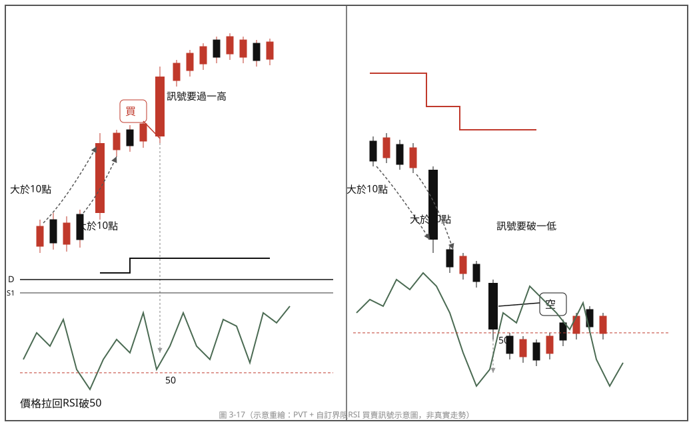

- **圖3-17**（p.112）：示意圖（左：買進情境；右：放空情境），完整圖示四項條件：突破/跌破PVT達10點以上、折返達10點以上、RSI跌破/突破50、訊號K線收盤過一高/破一低。

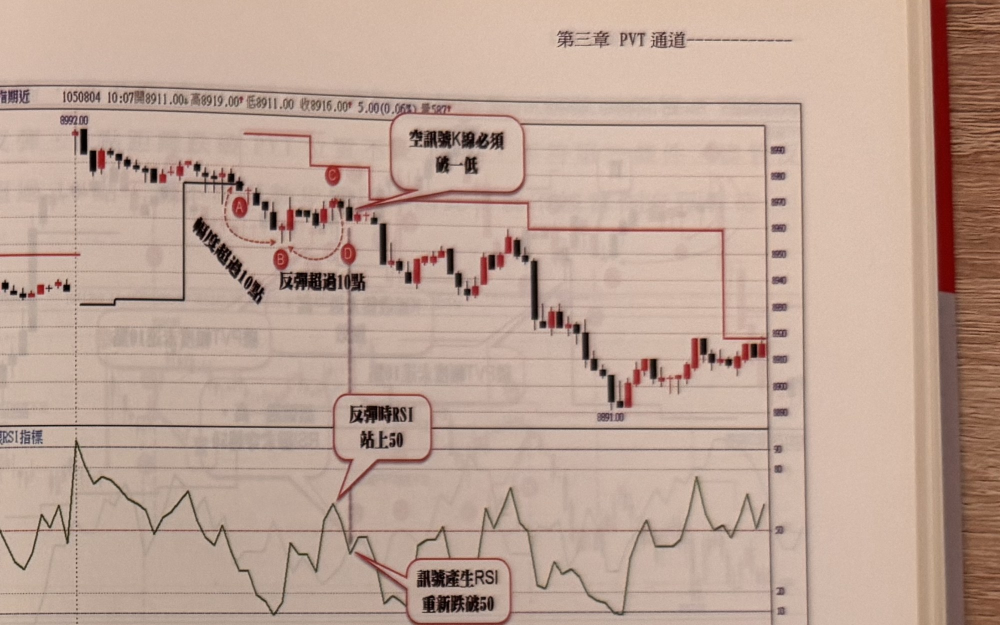

- **圖3-18**（p.113）：放空訊號標準範例：標示A跌破PVT通道階梯轉空，跌到B（距A超過10點），反彈到C（距B超過10點，RSI同步站上50），RSI重新跌破50與K線收盤跌破前低（破一低）同時發生，符合全部條件形成放空訊號。

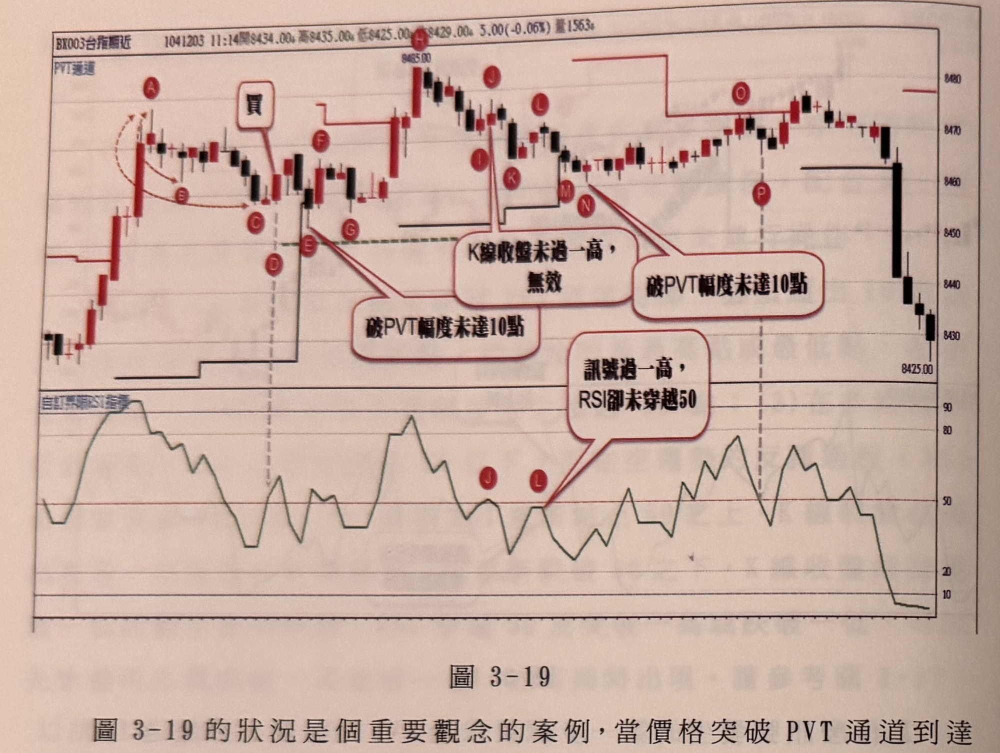

- **圖3-19**（p.114）：買進訊號成立與多組反例對照：標示A～D突破PVT達10點、拉回B達10點但RSI未破50，須繼續等待；C位置RSI終於破50，D位置RSI重新突破50且收盤過一高，形成買進訊號並設好停損，其後E點跌破PVT但未觸及停損或反向訊號，可繼續持倉；另一組H～L訊號因J點K線收盤未過一高、L點RSI未突破50，皆不成立，示範規則7.1、7.3。

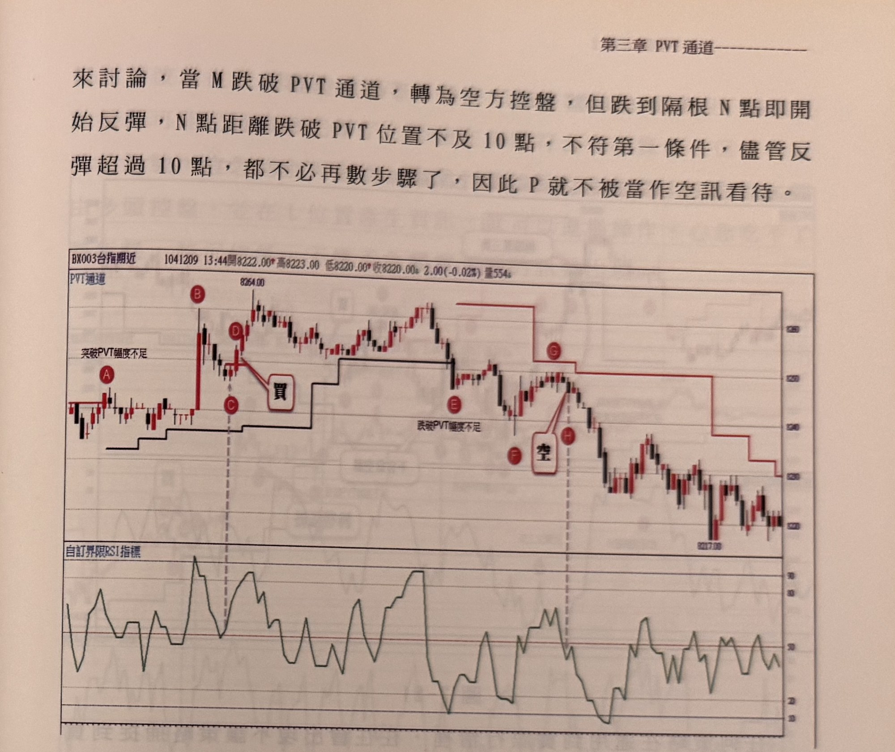

- **圖3-20**（p.114-115）：示範規則7.1「幅度不足10點不必再檢查其他條件」：標示M跌破PVT轉空方控盤，但隔根N反彈，N距跌破位置不到10點，即使反彈超過10點、RSI條件皆符合，仍因第一條件不足而不算空訊；另一組A（幅度不足）、B（幅度達標）、C（拉回達標）、D（RSI與過一高同時成立，買進訊號）、E（跌破PVT但幅度不足）、F（幅度達標，觸發D買單停損）之案例，完整示範各條件須逐一滿足的判斷順序。

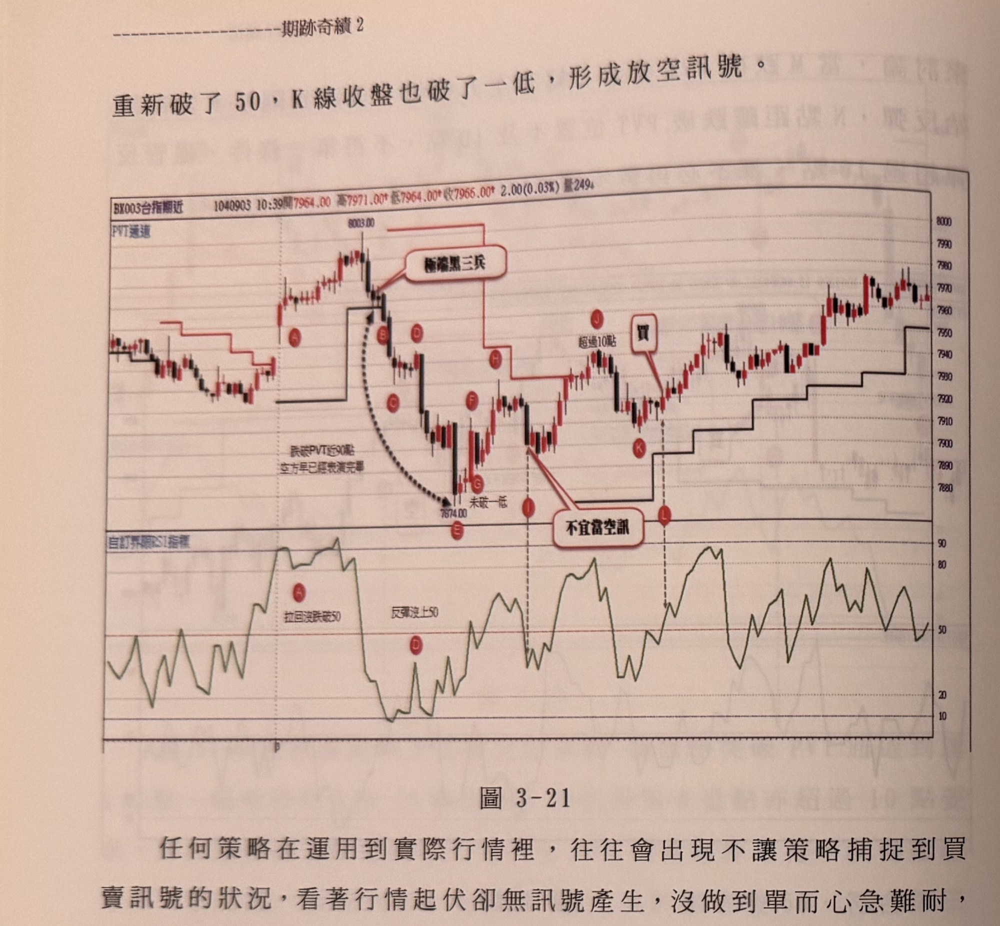

- **圖3-21**（p.116-117）：反例集合，示範規則7.3「RSI未穿越50不成立」：標示B-D段幅度雖>10點但RSI未上50，不成立；G點RSI雖有上50再下50但K線收盤未破一低，仍不成立；I點看似符合但因整體已跌近90點（偏離B點跌破位置過遠），依規則7.2判定為過時訊號應忽略。

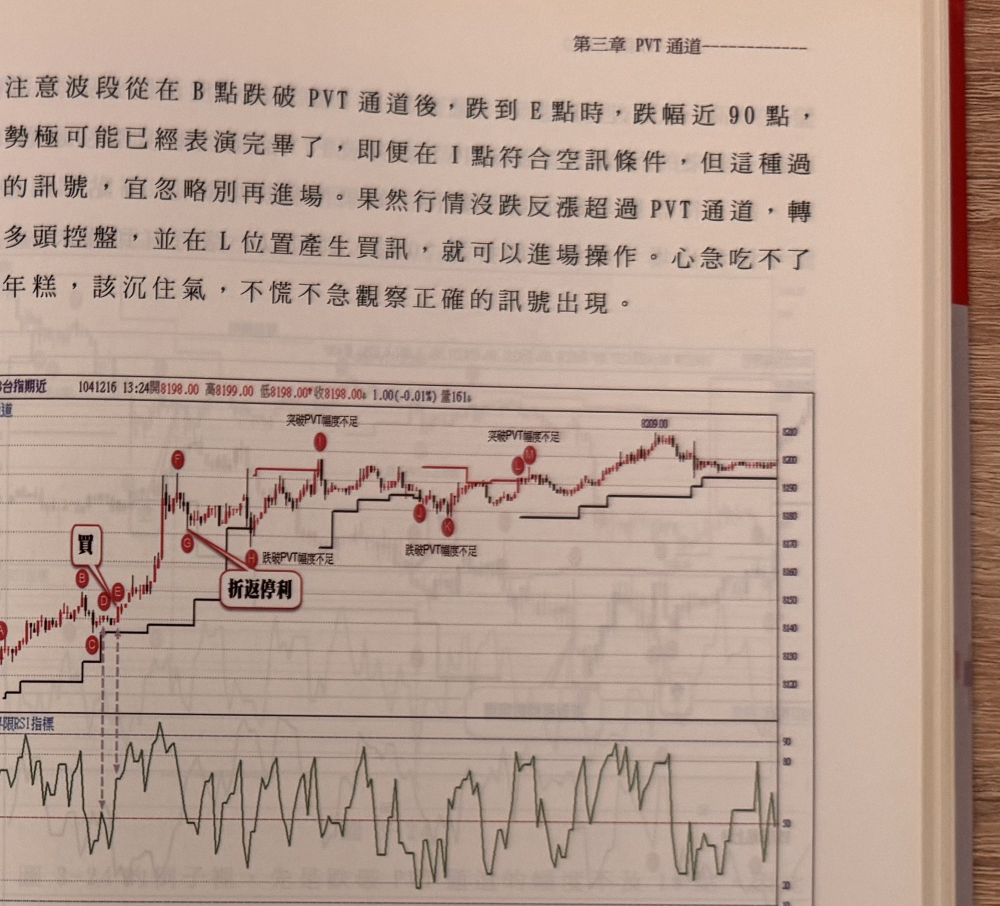

- **圖3-22**（p.117）：示範規則7.1，圖中多處標示「突破PVT幅度不足」「跌破PVT幅度不足」，說明因幅度未達10點，行情雖持續走高但期間並未產生新的有效訊號，直到符合條件的訊號才成立；並示範以折返15點或20點停利的差異（G點停利15點出場，或持有至圖末以20點折返計算）。

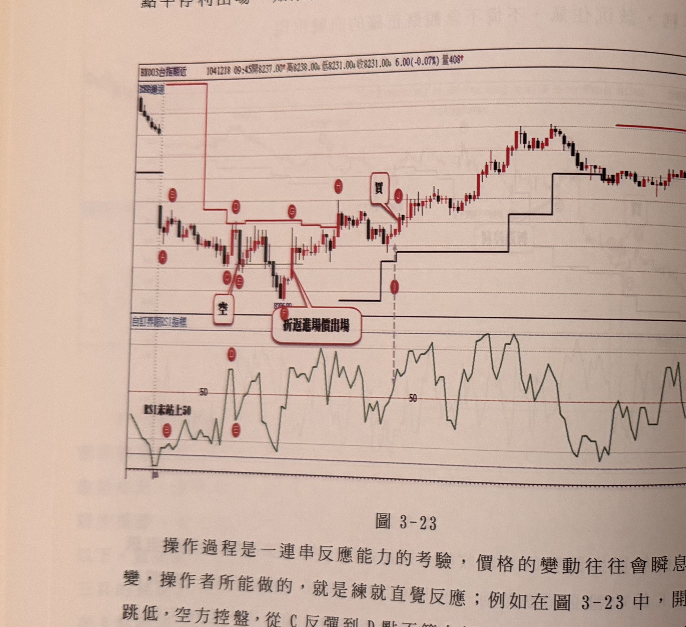

- **圖3-23**（p.118-119）：示範放空訊號成立（C反彈到D皆符合幅度與RSI條件，E位置破一低確認放空），以及規則6.3「保本出場」：跌破15點後行情逆勢回升到進場點E位置時應立即撤出求不賠；隨後在I、J位置示範RSI先穿越50但延遲一根才過一高確認買進訊號（對應規則3.3）。

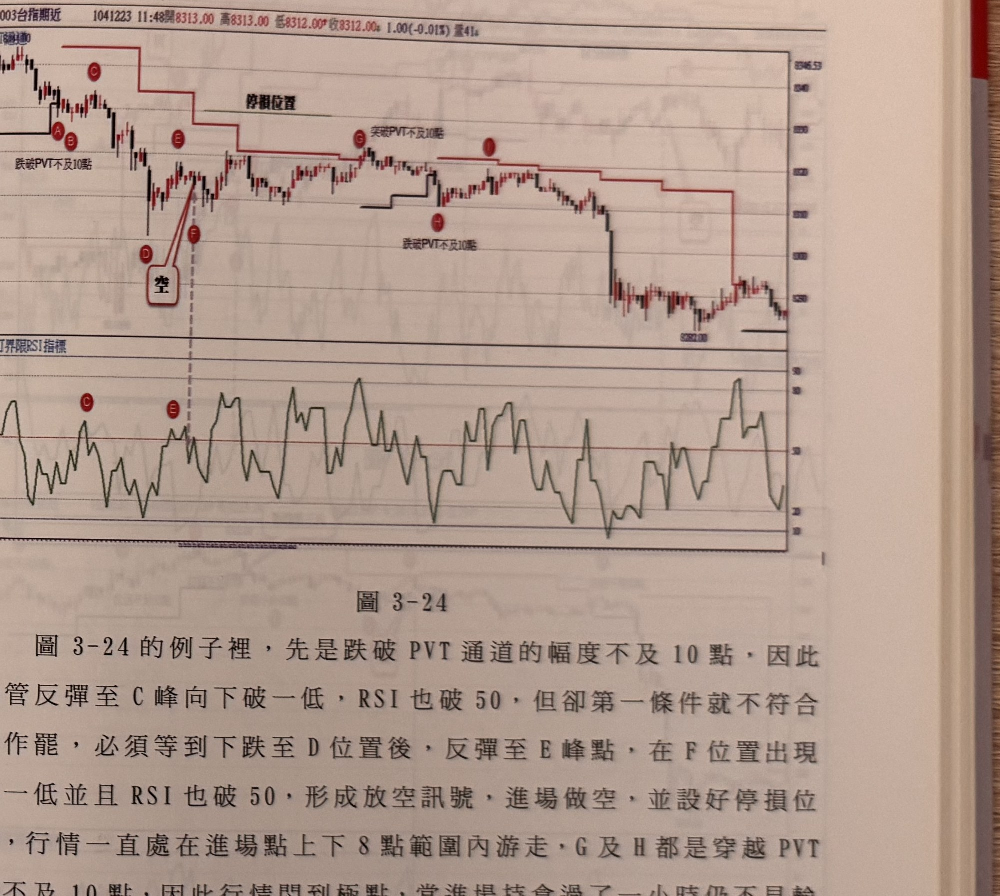

- **圖3-24**（p.119）：示範規則7.1（C點跌破PVT不及10點不成立）與規則6.4（持倉超過1小時無明顯輸贏，行情在進場點上下8點內游走80分鐘後才開始盤跌，作者建議提早離場勝過硬撐）。

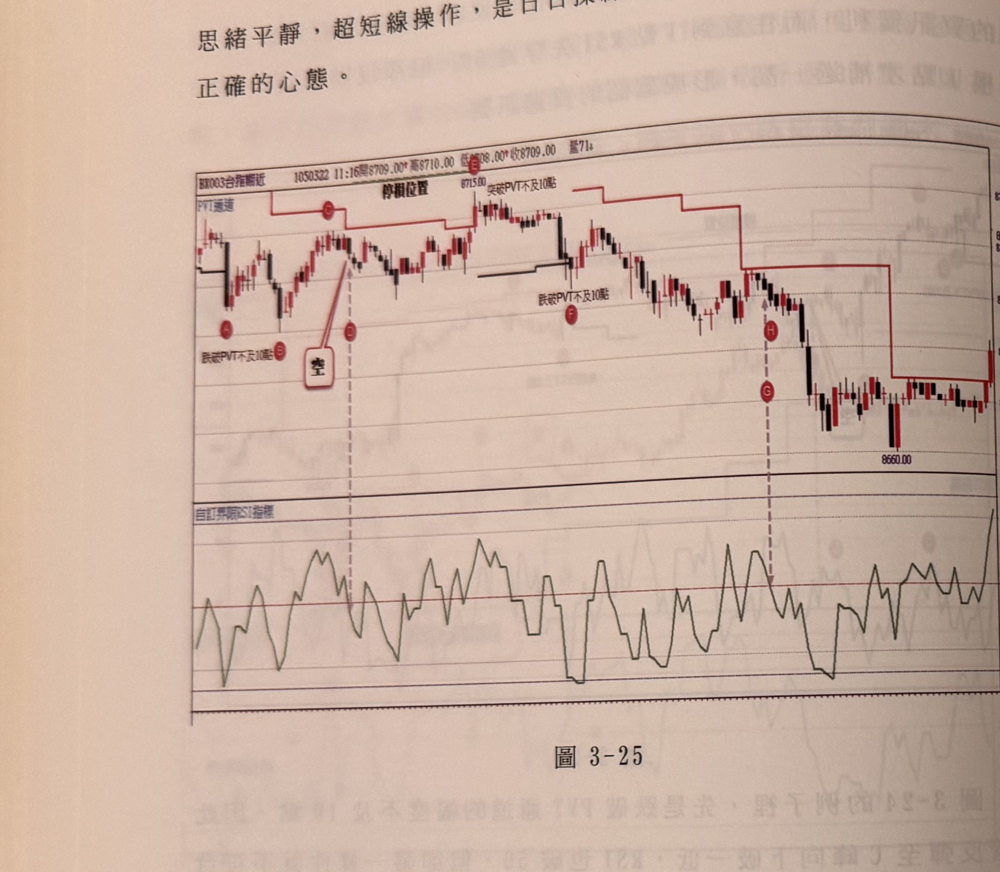

- **圖3-25**（p.120）：延續圖3-24情境的類似案例，標示D的空訊悶盤不到1小時後才開始下跌，說明此類「盤整後才發動」的行情並非少數案例。

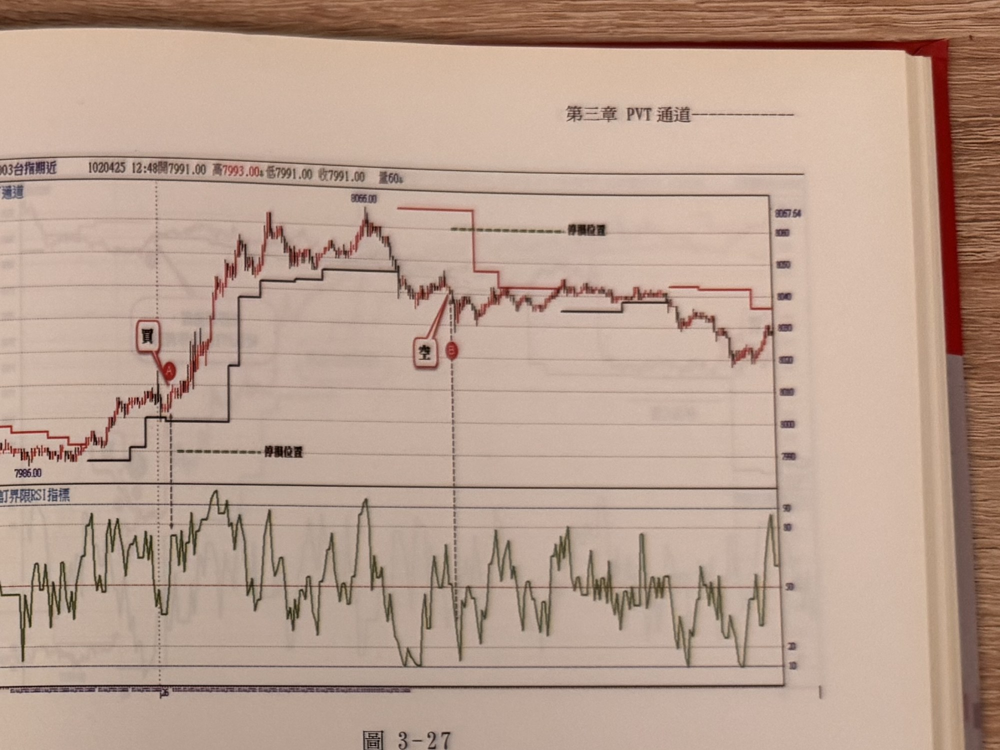
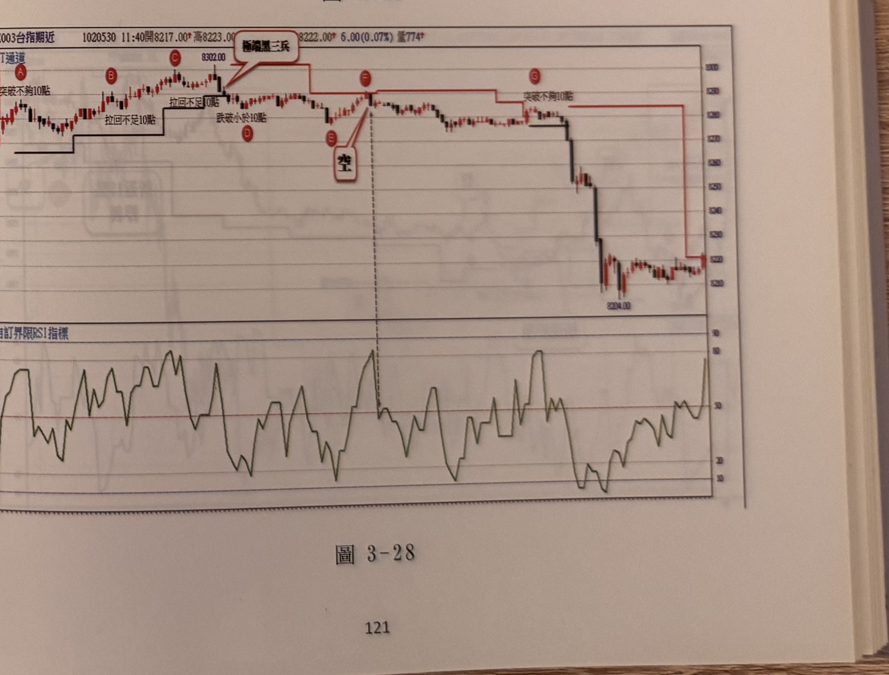

- **圖3-27、圖3-28**（p.120-121）：書中僅附圖供讀者自行練習（原文：「以下附圖請讀者自己參閱練習」），無逐句文字說明。依圖說內容，圖3-27示範一組買進後拉回設停損的一般案例；圖3-28以多處「突破不夠10點」「拉回不足10點」等標註提示訊號未成立的位置，並出現「極端黑三兵」的忽略情境（此極端K線型態詳見第五章「逆向訊號」，非本方法討論範圍）。


- **圖3-29**（p.122）：示範規則6.2「PVT通道本身作為停利參考」：買進後價格持續走高，於高點標示B處提示可直接以PVT階梯本身取代固定點數停利機制。


- **圖3-30、圖3-31**（p.122-123）：示範規則6.1「折返15點停利」：兩例皆在波段高點以「折返15點停利」標註出場位置；圖3-30另示範觸及停損後、隨即在後續反彈重新進場（F點）的操作流程。


- **圖3-32**（p.123）：示範一組放空後續接買進訊號的案例，PVT階梯隨行情逐階跟隨，圖中無新增文字規則，屬讀者自行練習圖例。

## 9. 作者提醒與常見錯誤

- 任何策略實際套用到行情時，常會出現「看著行情起伏卻等不到訊號」的窘境，操作者愈是心急，愈容易出差錯；應沉住氣，等待條件真正齊備才進場，不必因為錯過某段行情而勉強套用不完整的訊號（p.116-117）。
- 求不賠比等待更大獲利更重要：一旦獲利後行情又折返回進場點，應果斷離場，而不是賭它會再度轉為有利方向（p.118-119）。
- 超短線操作是「日日操練」，不必在意單次交易的輸贏，持倉過久卻無明顯方向時，離開市場讓思緒平靜，才是正確心態（p.119-120）。

## 10. 規則速查（Checklist）

**買進（多方，空方鏡像）**
- [ ] 價格突破PVT多趨勢階梯之最高點，幅度 >10點，且形成層級2峰谷轉折點
- [ ] 由該點折返（下跌）幅度 >10點
- [ ] 折返過程RSI曾跌破50
- [ ] RSI重新站上50 **且** K線收盤過一高（兩者可先後或同時，但過一高不可早於RSI破50後又站上50之前單獨成立）
- [ ] 突破位置未偏離過遠（未達「過時訊號」程度，書中無精確點數但範例顯示>80~90點應忽略，見待確認事項）
- [ ] 持倉未超過約1小時仍無明顯輸贏（超過則考慮平手出場）

**出場**
- [ ] 折返15點或20點停利（擇一）
- [ ] 已獲利時，K線收盤先跌破/突破PVT階梯 → 可停利出場
- [ ] 獲利後行情折返回進場點 → 立即保本出場，不等原始停損

## 11. 機器可讀規則

```yaml
signal: PVT通道結合RSI穿越50
side: both
timeframe: 1m
instrument: TX_near_month
conditions_long:
  - id: C1
    desc: 價格向上突破PVT多趨勢階梯之最高點超過10點，並形成層級2峰谷轉折點
    source: p.112
  - id: C2
    desc: 由該峰谷點折返（下跌）幅度超過10點
    source: p.112
  - id: C3
    desc: 折返過程中RSI曾跌破50
    source: p.112
  - id: C4
    desc: RSI重新站上50，且K線收盤過一高（突破前一轉折高點）；若過一高先於RSI破50重新站上50，須延後至RSI條件滿足才進場
    source: p.112-113
conditions_short:
  - id: C1'
    desc: 價格向下跌破PVT空趨勢階梯之最低點超過10點，並形成層級2峰谷轉折點
    source: p.112（鏡像）
  - id: C2'
    desc: 由該點反彈幅度超過10點
    source: p.112（鏡像）
  - id: C3'
    desc: 反彈過程中RSI曾突破50
    source: p.112（鏡像）
  - id: C4'
    desc: RSI重新跌破50，且K線收盤破一低；若破一低先於RSI條件滿足，須延後進場
    source: p.112-113
entry:
  long: C4確認當根K線收盤進場
  short: C4'確認當根K線收盤進場
  source: p.112-113
stop_loss: 書中本節未重新說明（推論：比照q2-03-01，見該文件第5節）
exit:
  take_profit_points: [15, 20]
  pvt_channel_exit: "已獲利部位，K線收盤先跌破/突破PVT階梯即可停利"
  breakeven_rule: "獲利後行情折返回進場價位，立即保本出場，不等原始停損"
  time_stop: "持倉逾約1小時無明顯輸贏，考慮平手離場"
  source: p.118-122
filters:
  - desc: 突破/跌破PVT幅度 或 折返/反彈幅度 任一未達10點 → 訊號不成立；第一條件不滿足時不需再檢查其他條件
    source: p.113-116, p.118-121（多圖反覆出現）
  - desc: 訊號確認前價格已偏離最初突破位置過遠（書中舉例近90點）→ 視為過時訊號，忽略
    source: p.116-117
  - desc: 幅度條件符合但RSI未曾真正穿越50 → 不成立
    source: p.114, p.116-117
```

## 12. 待確認事項

原缺頁 p.114-115 已由新補拍頁面（IMG_8508）補齊，內容為規則3.1-3.2、第7節過濾規則的正常範例演練（圖3-19、圖3-20），與既有文件規則一致，無矛盾之處。停損公式（第5節）本節原文仍未重新書寫，維持「推論比照 q2-03-01」的處理方式。缺頁 p.124-125（本章末段）尚待重新補拍，可能包含本方法的收尾範例或提醒段落，暫不影響第3-7節核心規則的完整性，見 frontmatter `missing_pages`。

## 13. 原文出處

- `extracted/pages/IMG_8507.md`（p.112-113）
- `extracted/pages/IMG_8508.md`（p.114-115）
- `extracted/pages/IMG_8509.md`（p.116-117）
- `extracted/pages/IMG_8510.md`（p.118-119）
- `extracted/pages/IMG_8511.md`（p.120-121）
- `extracted/pages/IMG_8512.md`（p.122-123）
