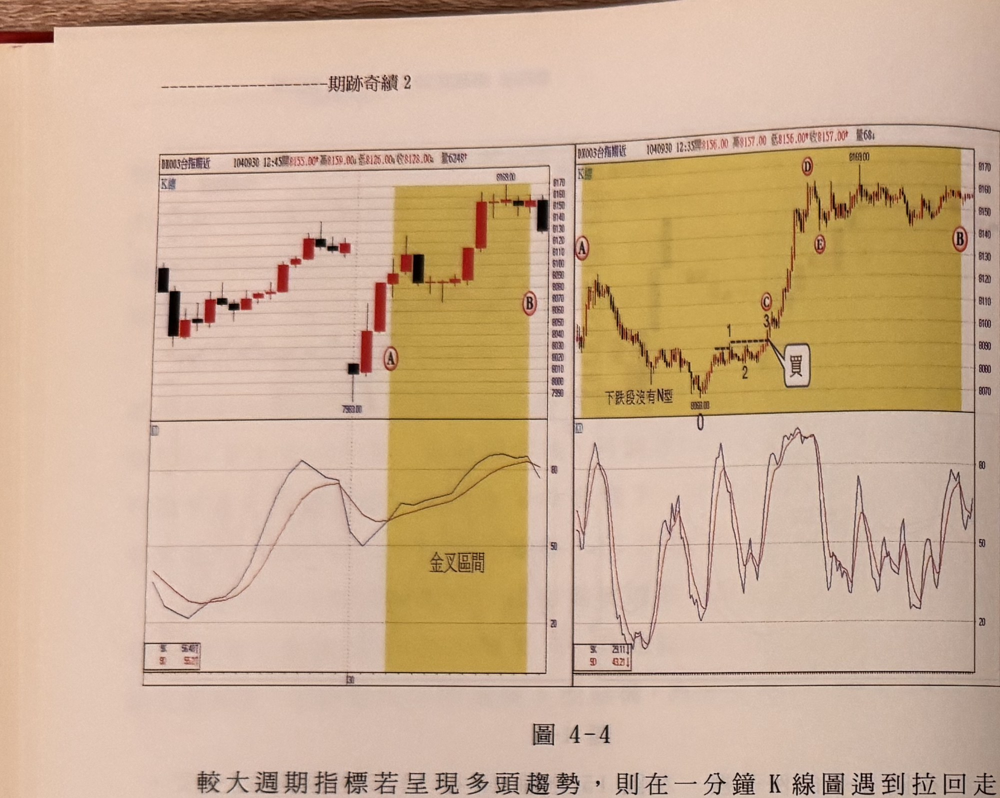
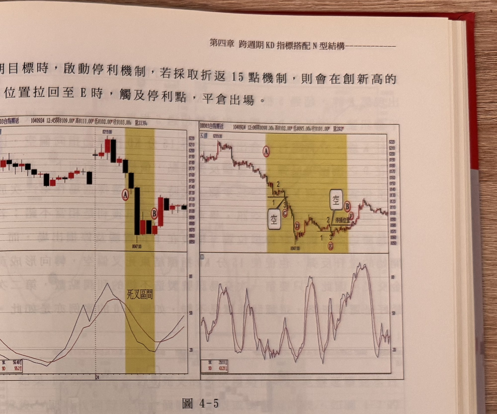
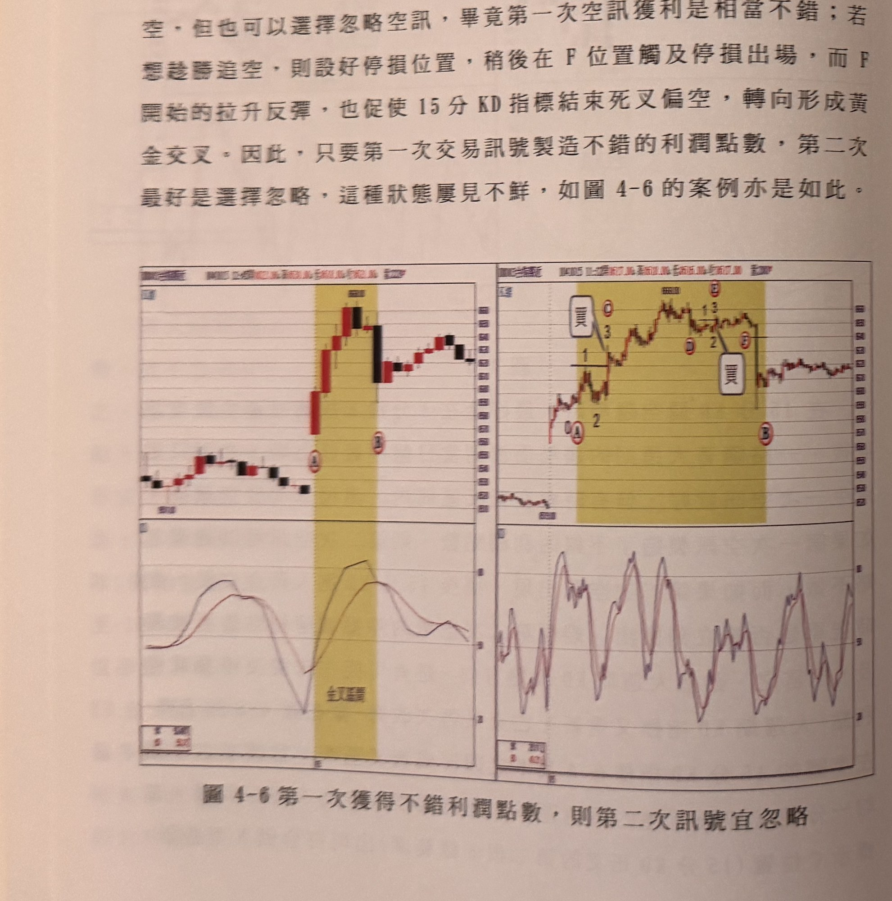
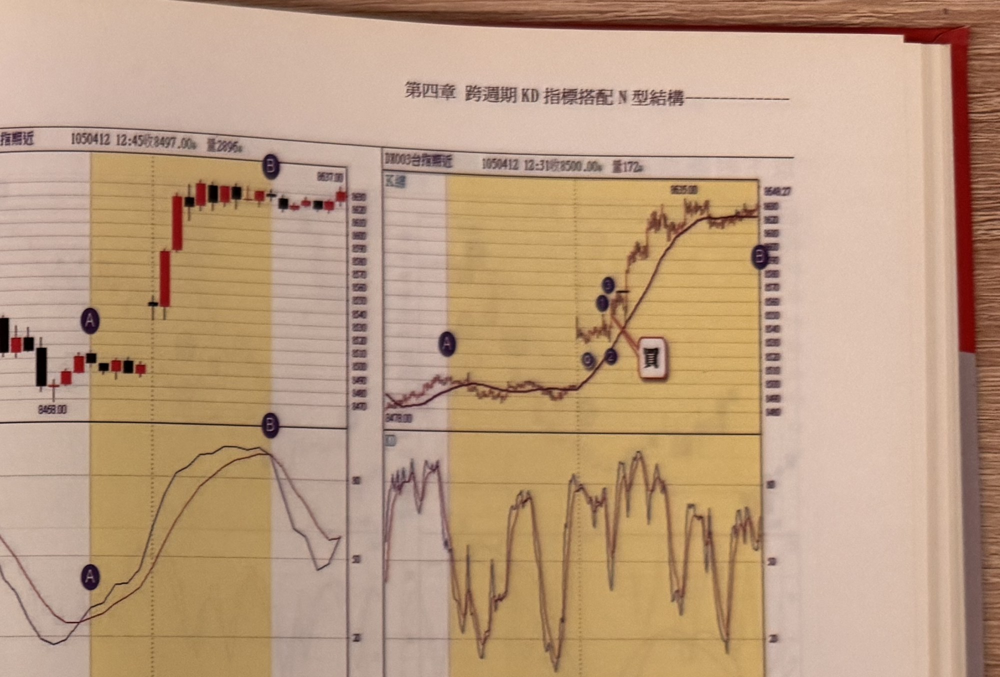
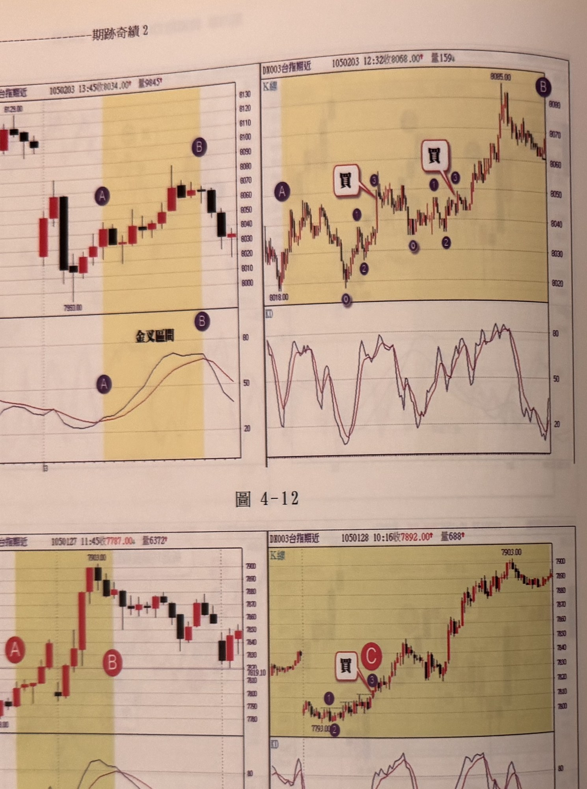
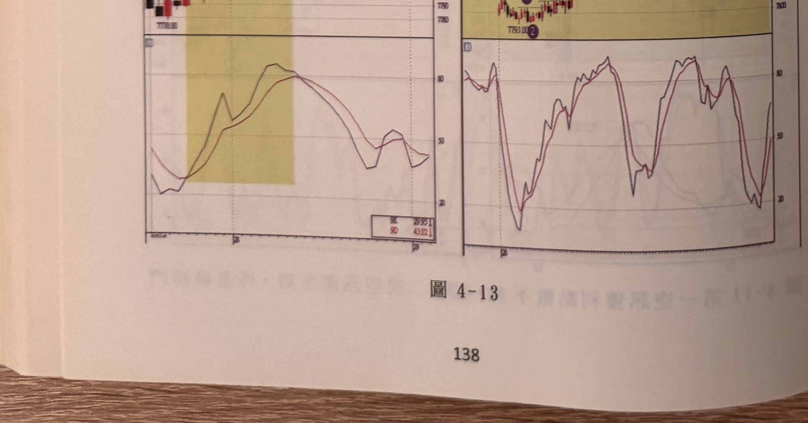
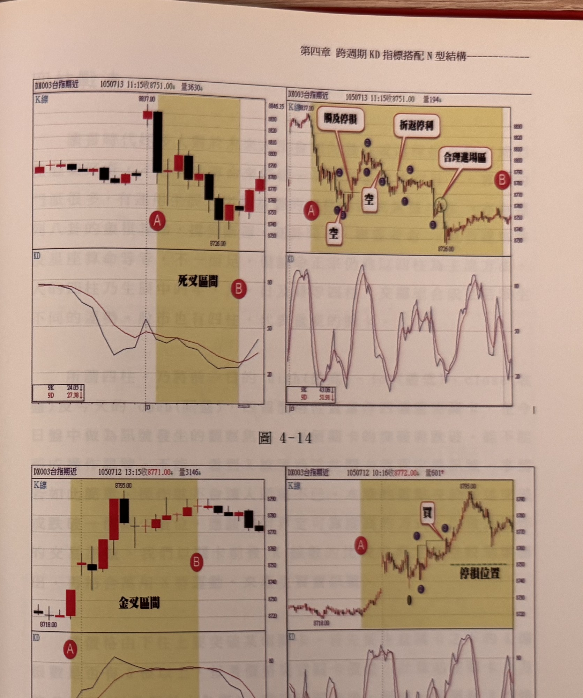
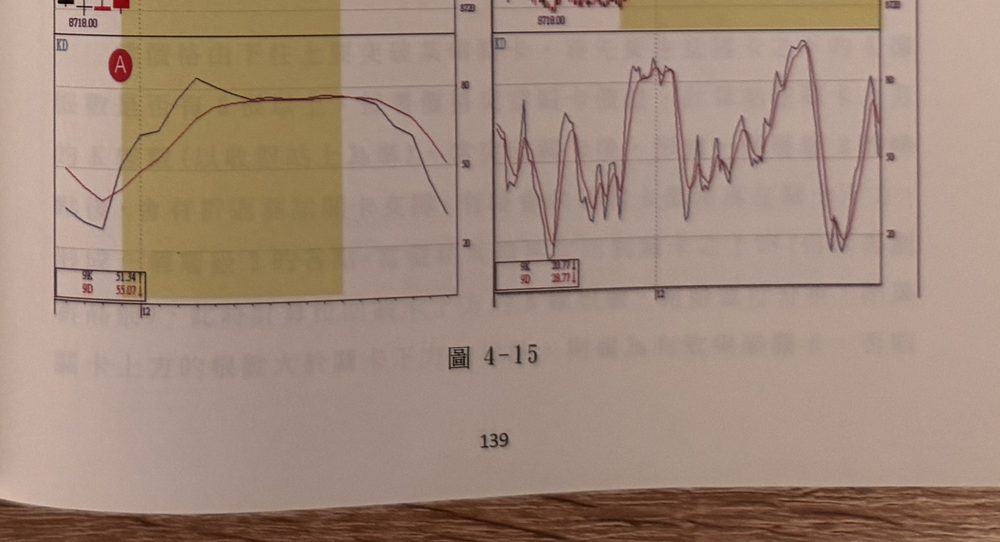

# 跨週期KD指標搭配N型結構

> 一句話摘要：用 15 分鐘 KD 的黃金交叉／死亡交叉判斷大方向，在金叉區間找 1 分鐘 N 型買點、死叉區間找倒 N 型空點。

## 1. 核心概念

順勢操作的關鍵在於判斷趨勢方向，作者採用**較大週期的 KD 指標**當作趨勢濾網：15 分鐘 KD 黃金交叉後、尚未死亡交叉前的區間稱為「金叉區間」，適合偏多操作；15 分鐘 KD 死亡交叉後、尚未黃金交叉前的區間稱為「死叉區間」，適合偏空操作（p.127）。

若單純跨週期沿用同一指標（例如以 1 分鐘 KD 交叉當進場訊號），會遇到「1 分鐘 KD 要在多低/多高才算有效交叉」這種沒有定論的問題：急漲時 K 值可能來不及跌到 20 以下再黃金交叉，急跌時 K 值也可能來不及彈到 80 以上再死亡交叉，容易錯失進場機會。因此作者改用**1 分鐘 K 線的 N 型行進**（N 型／倒 N 型三步驟）取代「界定 KD 在哪個位置交叉」的困擾，也比較容易辨認（p.127）。

## 2. 適用前提

- 大週期採用 **15 分鐘 K 線，KD 參數為 9**（p.127）。
- 小週期（進場執行）採用 **1 分鐘 K 線**，N 型／倒 N 型的峰谷位置一律以**層級 2 轉折點**界定（p.127）。
- 訊號 K 線必須符合**無遮蔽原則**（收盤價乾脆突破/跌破轉折點，非僅影線觸及）（p.127）。

## 3. 訊號定義

### 多方（金叉區間找 N 型買點）

1. C1　15 分鐘 KD 出現黃金交叉，自**確認黃金交叉的隔根**開始，在 1 分鐘 K 線圖裡尋找 N 型三步驟（0 起漲低點 →(1) 峰點 →(2) 拉回谷點，且(2)不可低於 0 →(3) 收盤突破(1)）（p.127, p.129）。
2. C2　只有在(3)K 線收盤突破(1)峰點時，才成立買進訊號（p.128）。
3. C3　例外：若黃金交叉當根（第一根）剛好對應 1 分鐘 N 型完成的步驟(3)，且該時間點正好是 15 分鐘 K 線收盤確認時刻（15/30/45/60 分），則允許在金叉當根即尋找並使用訊號（p.129）。
4. C4　若 15 分 KD 金叉／死叉的多空趨勢是從前一天尾盤延續到當日開盤，則直接**從當日開盤後第一根**開始尋找順勢 N 型/倒 N 型訊號，不必等當日才出現的交叉根（p.135，圖 4-7）。

### 空方（死叉區間找倒 N 型空點）

1. C1'　15 分鐘 KD 出現死亡交叉，自確認死亡交叉的隔根開始，在 1 分鐘 K 線圖裡尋找倒 N 型三步驟（0 起跌高點 →(1) 谷點 →(2) 反彈峰點，且(2)不可高於 0 →(3) 收盤跌破(1)）（p.127, p.129）。
2. C2'　只有在(3)K 線收盤跌破(1)谷點時，才成立放空訊號（同 C2 邏輯鏡射）。
3. C3'　例外同 C3：死叉當根若剛好對應倒 N 型完成的步驟(3)，且該時刻為 15 分鐘收盤確認時刻，則允許使用（p.129）。
4. C4'　同 C4 鏡射：趨勢延續自前一日尾盤時，從當日開盤後第一根即開始尋找倒 N 型訊號。
5. C5　只要指標仍處於 K<D（死叉區間，鏡射：K>D 金叉區間）狀態，每次倒 N 型（N 型）訊號獲利了結後，即可**持續**尋找下一組倒 N 型（N 型）繼續放空（買進），直到 15 分鐘 KD 出現隔根黃金交叉（死亡交叉）為止才停止尋找（p.130，圖 4-3：死叉區間內連續出現 C、E 兩組倒 N 型訊號，分別在 D、F 觸及停利平倉，之後才因隔根黃金交叉而停止）。

## 4. 進場

- N 型／倒 N 型三步驟的步驟(3)出現、K 線收盤突破(1)（多）或跌破(1)（空）時，立即進場（p.128）。
- **拉回不代表可以任意進場**：即使 15 分 KD 仍維持金叉（或死叉）格局未反轉，只要當下走勢正在拉回／反彈，就不能在此拉回段任意做多（或做空），必須等價格**重新出現新的 N 型（或倒 N 型）三步驟**才能進場，因為指標偏落後，拉回持續發展下去也可能導致大週期 KD 最終反轉（p.132，圖 4-4）。
- **補進場**：訊號 K 線收盤漲跌點數若超過 15 點，先採取忽略，等待拉回或反彈，使停損縮小至 10 點以下時再進場（p.127；詳見「7. 過濾」）。

## 5. 停損

- 書中未給出本方法統一的固定停損點數公式，停損位置依 N 型／倒 N 型結構的起始 0 點或相關拉回/反彈的層級 2 轉折點設定（例如圖 4-5 中「停損位置」標示於倒 N 型第二組結構的谷點附近，p.132）。
- 停損後續行情若在同一死叉（或金叉）區間內再度出現第二次同向訊號，可視第一次交易獲利狀況決定是否進場（見第 7 節過濾規則）。

## 6. 出場 / 停利

- **折返停利機制**：以圖 4-4 為例，若採取「折返 15 點」機制，價格創新高（或新低）後反向拉回 15 點，即觸及停利出場（p.133）。
- **五黑過首紅／五紅過首黑（特殊平倉訊號）**：放空後若連續出現超過 5 根下跌黑 K 線，當出現第一根上漲的紅 K 線時，立刻平倉出場（不論此時大週期 KD 是否仍偏空）；多方鏡像為「五紅過首黑」：多單持有中連續出現超過 5 根上漲紅 K 線後，出現第一根下跌黑 K 線時立刻平倉出場（p.134，多空對稱）。

## 7. 過濾：不做的情況

1. F1　黃金交叉（或死亡交叉）**第一根尚未確認**時，不在 1 分鐘圖上尋找 N 型／倒 N 型訊號；須等隔根確認後才開始尋找（例外見 C3/C3'）（p.129）。
2. F2　金叉（死叉）區間內走勢拉回（反彈）時，即使沒有造成 KD 死叉（金叉），也**絕對禁止**在拉回／反彈段任意進場，必須等新 N 型／倒 N 型三步驟出現（p.132）。
3. F3　訊號 K 線收盤漲跌點數超過 15 點：採取忽略原則，或等待拉回／反彈使停損縮小至 10 點以下，才「補進場」操作（p.127）。
4. F4　同一死叉（金叉）區間內若已出現第一次訊號且獲利不錯，第二次同向訊號**宜選擇忽略**，不強求連續操作（p.134，圖 4-5、圖 4-6 皆示範此狀況「屢見不鮮」）；但這並非強制規定，只要仍處於同一死叉/金叉區間（K<D 或 K>D 未反轉），也可以選擇依 C5 規則持續尋找新訊號進出場，直到區間結束為止（p.130）。
5. F5　N 型／倒 N 型結構中，拉回谷點(2)不可低於起始 0 點（倒 N 型反彈峰點(2)不可高於起始 0 點），違反時該次計數作廢，須重新尋找（此規則於下一份文件〈四柱戰法〉p.151 圖 4-25 完整說明，但同屬 N 型結構通用規則，故本方法沿用）。

## 8. 範例解析

- **圖 4-1（p.128）**：15 分鐘圖 A→B 為金叉區間（K>D 維持），對應 1 分鐘圖同區間 165 根 K 線；在區間內找到 N 型三步驟 1→2→3（起漲 0 點在左段低點），步驟(3)突破(1)時即為買點（標示 C）。示範「大週期定方向、小週期抓進場點」的基本用法。

  

- **圖 4-2（p.129）**：15 分鐘圖 A 為死亡交叉起算根，A→B 死叉區間；1 分鐘圖在區間內連續出現兩組倒 N 型結構（0-1-2-3），各自在標示「空」處進場放空。示範死叉區間可能不只一次空訊。

  

- **圖 4-4（p.132）**：15 分鐘金叉格局中，10:15–10:45 三根 K 線拉回但未造成死叉，K 值卻下彎；對應 1 分鐘圖在該下跌段刻意不進場（文字「下跌段沒有 N 型」），須等價格止穩、重新出現向上 N 型三步驟（標示 C）才進多單，示範「拉回不可貿然進場」規則（F2）。並示範折返 15 點停利機制（創高後拉回至 E 觸及停利）。

  

- **圖 4-5（p.132–133）**：15 分死叉區間 A→B，1 分鐘圖在標示 C（死叉第二根範圍）出現倒 N 型空訊進場放空，示範「死叉區間內第一時間即可進場、可一路衝浪到當日最低」的理想狀況，並引出「是否出現第二次空訊」的討論。

  

- **圖 4-6（p.134，標題：第一次復得不錯利潤點數，則第二次訊號宜忽略）**：金叉區間內出現兩組 N 型買點（C、F），示範第一次訊號獲利不錯時，第二次訊號可選擇忽略（F4）。

  

- **圖 4-7（p.135）**：15 分 KD 金叉自前一天尾盤延續至本日開盤，1 分鐘圖從**開盤後第一根**即開始尋找 N 型買點，示範規則 C4（趨勢延續時從開盤第一根開始找訊號）。

  

- **圖 4-3（p.130–131）**：15 分鐘圖死叉區間 A→B（K<D），對應 1 分鐘圖在標示 A（與死叉確認時間點 09:30 撞期，屬 C3 例外情形）即完成倒 N 型步驟(3)形成第一時間放空點；折返 15 點於 D 觸及停利平倉；行情再度下跌，於 E 完成第二組倒 N 型步驟(3)再次放空，於 F 觸及停利。示範規則 C5：只要 K<D 未反轉，可連續尋找倒 N 型重複進出場，直到隔根黃金交叉（B）才停止。原文並說明：若看盤軟體無法同時並列兩種週期 K 線圖，可先看 15 分鐘 KD 是否交叉，確認後再切換到 1 分鐘圖尋找 N 型/倒 N 型結構，效果相同（p.130）。

  

- **圖 4-8～4-15（p.136–139）**：作者列為「請讀者自行參閱練習」的補充範例圖，正文無獨立說明文字。依圖說判讀，圖 4-8～4-10、4-12～4-15 皆示範金叉區間 1 分鐘圖出現 N 型三步驟（⓪①②③）於「買」框處進場，其後續漲；圖 4-11 示範死叉區間連續兩次倒 N 型放空訊號（呼應 C5：「第一空訊獲利點數不多，當第二次空訊產生時，再進場拼鬥」）；圖 4-14、4-15 同屬死叉/金叉區間 N 型判讀練習，並附「合理進場區」「觸及停損」「折返停利」等標註，內容與既有規則（C1–C5、F1–F5）一致，未見新增規則。

  
  
  
  
  
  
  
  


## 9. 作者提醒與常見錯誤

- 指標多為落後性質，15 分 KD 尚未死亡交叉不代表拉回段可以安心進場；K 值可能已經下彎，若貿然在拉回段做多，一旦拉回持續發展，最終反而導致大週期 KD 死叉，屬於「絕對禁止」的操作行為（p.132）。
- 死叉（金叉）區間內第二次同向訊號，若第一次已有不錯獲利，選擇忽略是常見且合理的做法，這種情況「屢見不鮮」（p.134）。
- 連續超過 5 根同向（黑 K）K 線後，第一根反向（紅 K）K 線出現即應平倉，不需要等大週期指標同步翻轉（p.134）。
- 若看盤軟體不支援兩種週期 K 線圖並列顯示，可先確認 15 分鐘 KD 是否交叉，交叉確認後再切換到 1 分鐘 K 線圖尋找 N 型/倒 N 型結構，操作效果相同（p.130）。

## 10. 規則速查（Checklist）

- [ ] 15 分鐘 KD 已確認黃金交叉（或死亡交叉），且非交叉第一根（例外見補充條件）
- [ ] 在對應的 1 分鐘 K 線金叉區間（或死叉區間）內尋找 N 型（或倒 N 型）三步驟
- [ ] N 型 0 點為區間最低點、拉回(2)未低於 0（倒 N 型鏡射）
- [ ] 訊號 K 線收盤「無遮蔽」突破(1)峰點（或跌破(1)谷點）
- [ ] 目前走勢非拉回／反彈段（若是，忽略進場，等新 N 型出現）
- [ ] 訊號 K 線收盤漲跌點數 ≤ 15 點，否則忽略或等拉回補進場
- [ ] 若為區間內第二次同向訊號，評估第一次獲利狀況決定是否忽略
- [ ] 停損位置已設定（以結構起始點或層級 2 拉回點為準）
- [ ] 出場：折返 15 點停利，或連續 5 根同向 K 線後首根反向 K 線平倉

## 11. 機器可讀規則

```yaml
signal: 跨週期KD搭配N型結構
side: both
timeframe: { trend: 15m, entry: 1m }
indicator: { name: KD, period: 9, timeframe: 15m }
conditions:
  - id: C1
    desc: 15分鐘KD黃金交叉確認後之隔根起，於1分鐘圖尋找N型三步驟（0低點→(1)峰點→(2)谷點不低於0→(3)收盤突破(1)）
    source: p.127, p.129
    side: long
  - id: C1p
    desc: 15分鐘KD死亡交叉確認後之隔根起，於1分鐘圖尋找倒N型三步驟（鏡射邏輯）
    source: p.127, p.129
    side: short
  - id: C3_exception
    desc: 交叉當根若對應1分鐘結構步驟(3)且時間點為15/30/45/60分收盤確認時刻，可於交叉當根取用訊號
    source: p.129
  - id: C4_carryover
    desc: 若金叉/死叉趨勢延續自前一日尾盤，當日自開盤後第一根即開始尋找N型/倒N型訊號
    source: p.135
  - id: C5_repeat
    desc: 只要指標仍處於死叉(K<D)或金叉(K>D)狀態，每次訊號停利平倉後可持續尋找下一組倒N型/N型再進場，直到隔根黃金/死亡交叉為止
    source: p.130
entry:
  rule: 步驟(3)K線收盤「無遮蔽」突破(1)峰點（多）或跌破(1)谷點（空）
  source: p.128
stop_loss:
  rule: 以N型/倒N型結構起始0點或相關層級2拉回/反彈點為停損參考，書中未給出統一固定點數
  source: p.132（圖4-5示意）
exit:
  - rule: 折返15點停利（創高/創低後反向折返15點出場）
    source: p.133
  - rule: 五黑過首紅（空）／五紅過首黑（多），連續5根以上同向K線後出現首根反向K線立即平倉（多空對稱）
    source: p.134
filters:
  - id: F1
    desc: 交叉第一根（未確認）不尋找訊號
    source: p.129
  - id: F2
    desc: 金叉/死叉區間內拉回/反彈段禁止任意進場，須等新N型/倒N型出現
    source: p.132
  - id: F3
    desc: 訊號K線收盤漲跌點數>15點，忽略或等拉回使停損縮小至10點以下再補進場
    source: p.127
  - id: F4
    desc: 同區間內第二次同向訊號，若第一次已有不錯獲利，宜忽略
    source: p.134
  - id: F5
    desc: N型拉回(2)不可低於起始0點（倒N型反彈(2)不可高於起始0點），違反須重新計數
    source: p.151（圖4-25，規則通用於N型結構）
```

## 12. 待確認事項

無。本方法所屬頁碼範圍已無缺頁。

## 13. 原文出處

- `extracted/pages/IMG_8513.md`（p.126–127）
- `extracted/pages/IMG_8514.md`（p.128–129）
- `extracted/pages/IMG_8515.md`（p.130–131）
- `extracted/pages/IMG_8516.md`（p.132–133）
- `extracted/pages/IMG_8517.md`（p.134–135）
- `extracted/pages/IMG_8518.md`（p.136–137）
- `extracted/pages/IMG_8519.md`（p.138–139）
