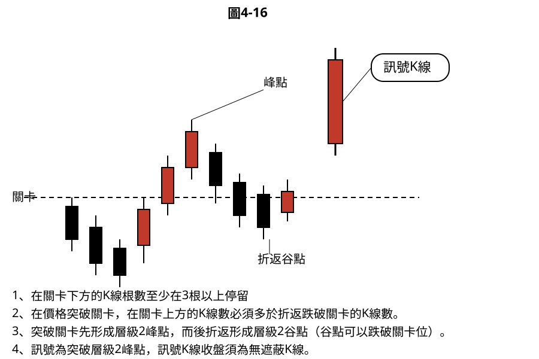
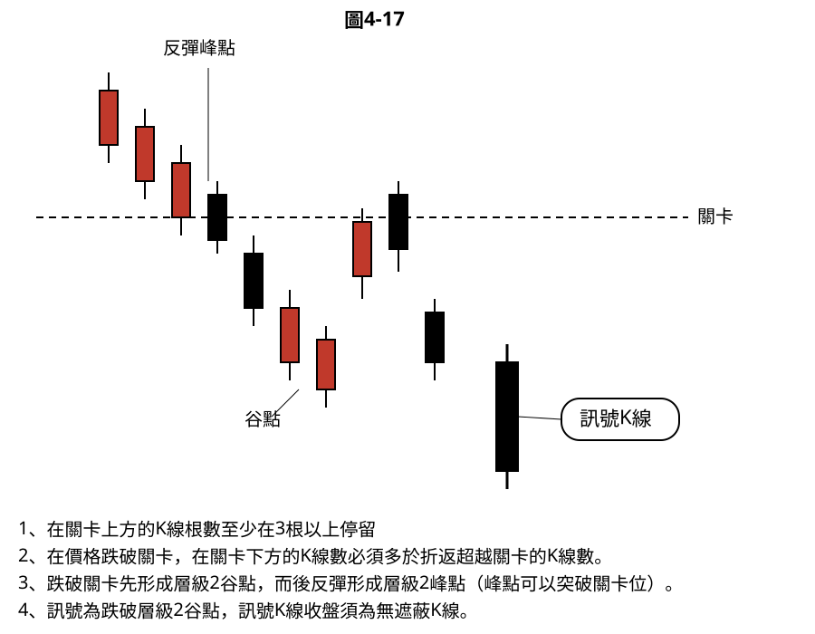
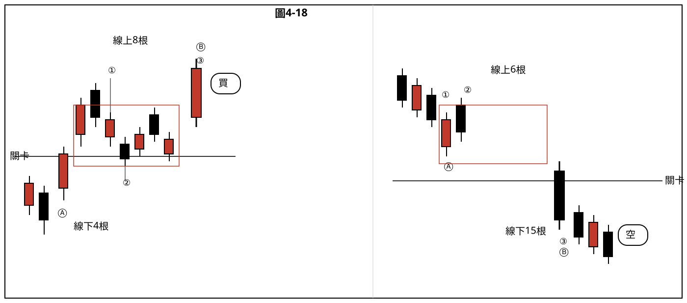
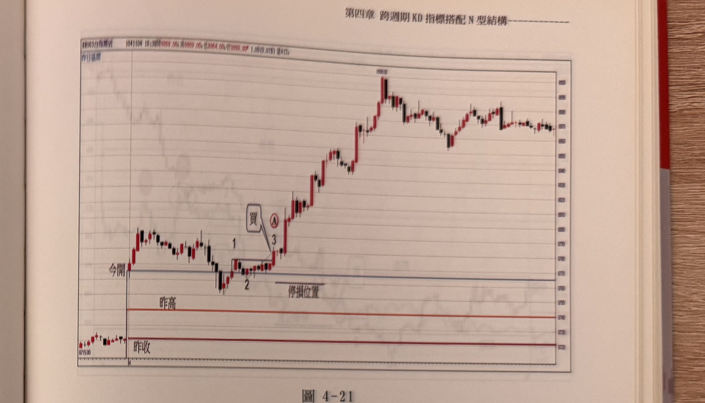
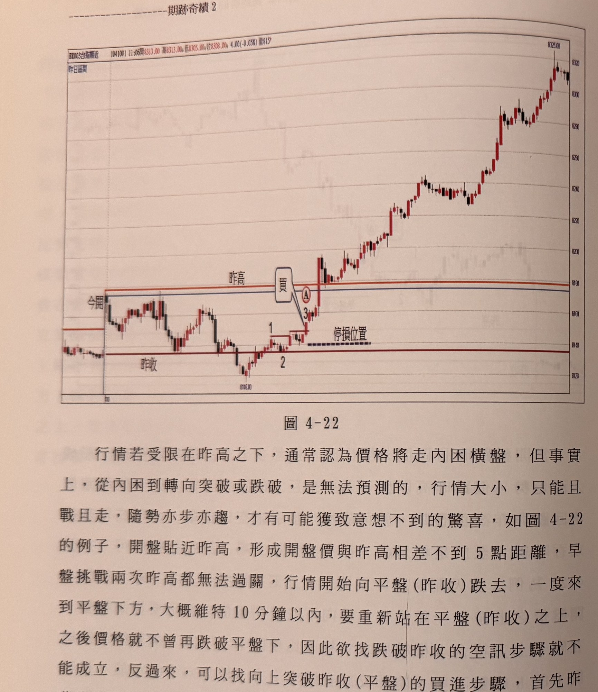
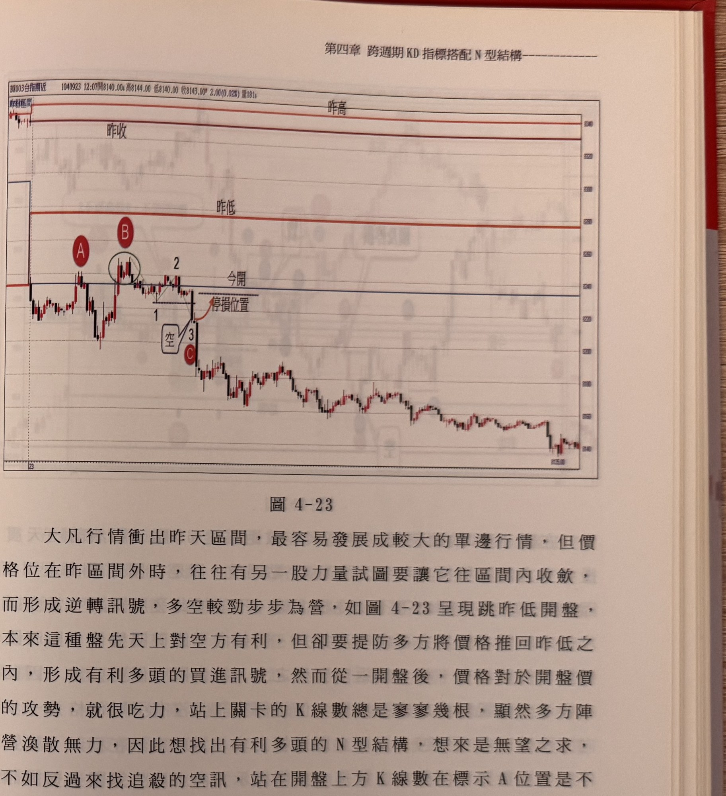
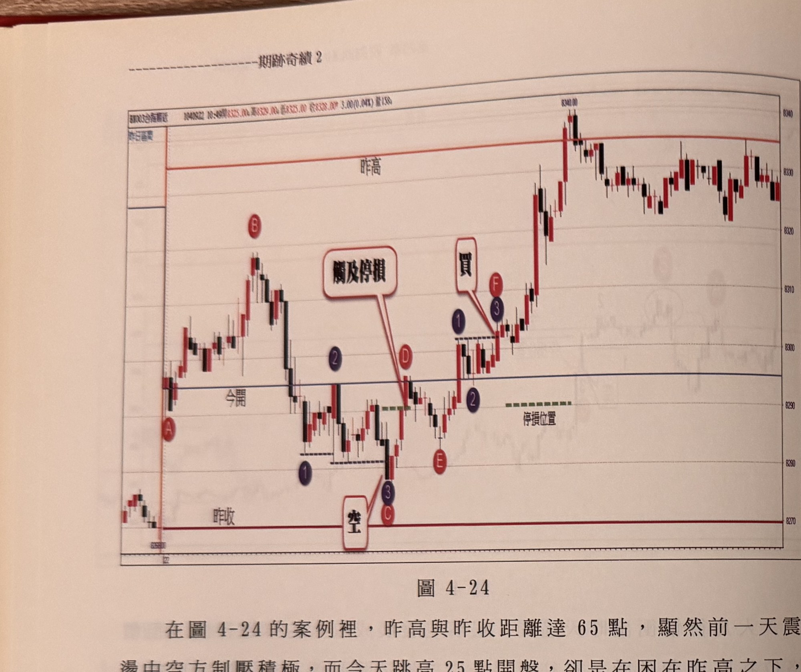
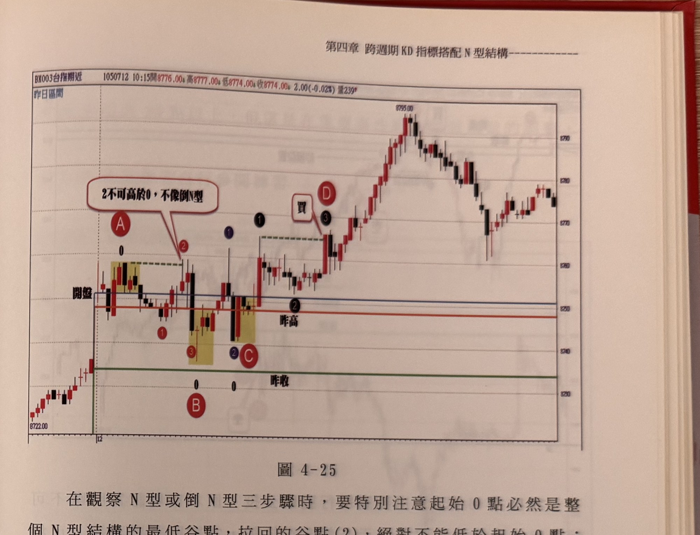
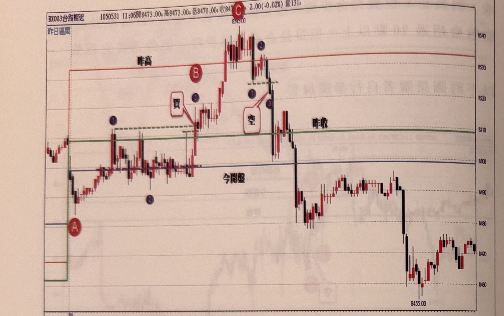
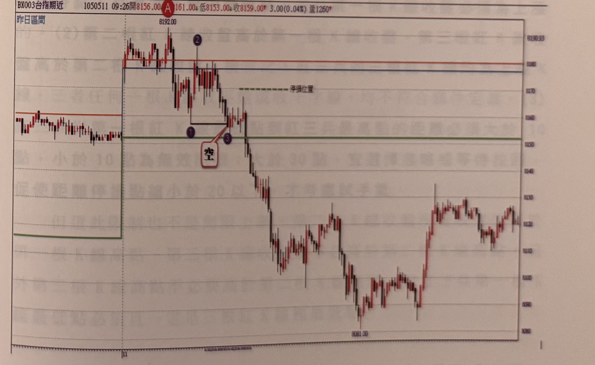

# 四柱戰法

> 一句話摘要：以「昨高、昨低、昨收、今開」四個價格關卡為觀察焦點，比較關卡上下 K 線根數判斷多空優劣，再結合 N 型三步驟產生突破/跌破進場訊號。

## 1. 核心概念

作者借用命理「四柱」（生辰年、月、日、時）的概念，將股期市中**前一日的最高（high）、最低（low）、收盤（close）**與**當日的開盤（open）**，視為當日盤中最重要的四個價格關卡（p.141）。

單純看到 K 線通過某個關卡，並不能直接認定為交易訊號；本方法的核心在於：**比較關卡前後 K 線的根數多寡，來判定多空較勁誰勝出**，再結合「萬用 N 型運動」（N 型／倒 N 型三步驟）產生實際的買賣訊號（p.141）。

## 2. 適用前提

- 商品：台指期，觀察單位為**分時走勢圖 / 1 分鐘 K 線**。
- 需先畫出四條參考水平線：昨高、昨低、昨收、今開，四者中哪一條正被價格測試，就以該條線作為當下的「關卡」（p.141, 圖 4-24／4-25 示範同一天先後以不同關卡操作）。
- N 型／倒 N 型三步驟的起始 0 點、峰谷點，同樣以層級 2 轉折點界定（p.143 圖 4-18 說明；p.151 圖 4-25）。

## 3. 訊號定義

### 多方（向上突破關卡）

1. C1　價格由下往上突破關卡之前，關卡**下方須有 3 根以上**K 線收盤（p.141, p.143）。
2. C2　突破關卡後，價格上漲形成一個**層級 2 峰點(1)**（若有多個層級 2 峰點，取最高者為(1)）（p.142, p.143）。
3. C3　突破後價格會折返測試支撐，形成一個**層級 2 谷點(2)**；谷點(2)**可以跌破關卡價**（p.142）。
4. C4　比較關卡上方的 K 線收盤根數與拉回至關卡下方的 K 線收盤根數：**上方根數 > 下方根數**，視為**有效突破**；否則視為突破無效（p.141, p.143）。
5. C5　當價格 K 線收盤**進一步突破前面(1)的峰點**，即為突破關卡的買進訊號（完成 N 型三步驟 0→1→2→3，訊號 K 線須無遮蔽收盤突破）（p.142, p.143）。

### 空方（向下跌破關卡）

1. C1'　價格由上往下跌破關卡之前，關卡**上方須有 3 根以上**K 線收盤（p.142, p.143）。
2. C2'　跌破關卡後，價格下跌形成一個**層級 2 谷點(1)**（若有多個層級 2 谷點，取最低者為(1)）（p.142, p.143）。
3. C3'　跌破後價格會反彈測試壓力，形成一個**層級 2 峰點(2)**；峰點(2)**可以突破關卡價**（p.142）。
4. C4'　比較關卡下方 K 線收盤根數與反彈至關卡上方的 K 線收盤根數：**下方根數 > 上方根數**，視為**有效跌破**；否則視為跌破無效（p.142, p.143）。
5. C5'　當價格 K 線收盤**進一步跌破前面(1)的谷點**，即為跌破關卡的放空訊號（完成倒 N 型三步驟，訊號 K 線須無遮蔽收盤跌破）（p.142, p.143）。

### N 型結構通用規則（適用多空）

- C6　N 型結構的起始 0 點必為整個結構的最低谷點，拉回谷點(2)絕不可低於 0 點；倒 N 型結構起始 0 點必為最高峰點，反彈峰點(2)絕不可高於 0 點。違反時該次計數作廢，須重新尋找（p.151，圖 4-25）。

## 4. 進場

- 訊號 K 線收盤突破(1)峰點（多）或跌破(1)谷點（空）時進場（p.142–143）。
- 若某一關卡的突破/跌破不符合「3 根以上」或「根數優勢」條件（無效突破/跌破），應**放棄該方向**，轉而在同一時段觀察其他關卡是否出現有效訊號（例如圖 4-21、圖 4-23、圖 4-24 皆示範同一天內視情況切換不同關卡尋找訊號）。
- 若影線已突破但收盤未突破（未達無遮蔽），可延後等待之後出現真正無遮蔽的訊號 K 線，或改以其他鄰近關卡（如開盤價）重新起算 N 型步驟（p.151，圖 4-25：標示 D 位置的無遮蔽買點，或改以 C 為新的 0 點、以開盤價為關卡重新計數）。

## 5. 停損

- 停損位置設於構成訊號前的**拉回層級 2 谷點**（多方）或**反彈層級 2 峰點**（空方），書中圖例多以「停損位置」虛線直接標示於該拉回/反彈點（p.147 圖 4-21、p.148 圖 4-22、p.150 圖 4-24）。
- 停損後若行情重新出現符合條件的訊號（例如原空單停損後，再次跌破同一關卡且根數優勢成立），可以選擇重新進場（p.150，圖 4-24：C 位置放空停損於 D，隨後 E→F 形成新買訊，之後再次挑戰昨高又觸及停利）。
- 書中未給出本方法統一的停損點數上限（未見類似「20 點」「10 點」的通用數字），僅以結構性的拉回/反彈點為準（p.147, p.148, p.150 皆同此邏輯）。

## 6. 出場 / 停利

- **折返停利機制**：以圖 4-22（p.148）為例，進場後拉回不曾超過 15 點，因此停利線未被觸發，可安心持倉至最高點；圖 4-24（p.150）則示範創新高後拉回超過 15 點觸及停利出場。可推論本方法沿用第四章前段（跨週期 KD＋N 型）相同的「折返 15 點」停利邏輯（推論，書中在本節未重新完整定義，但兩處案例點數描述一致）。

## 7. 過濾：不做的情況

1. F1　關卡的「弱勢一側」根數不足 3 根，不得從該處起算突破/跌破訊號（例如圖 4-23／p.149：關卡上方 K 線數在標示 A 位置不足 3 根，因此不能從 A 開始找多方訊號，須改由關卡下方根數足夠處另尋放空訊號）。
2. F2　突破（跌破）後，關卡另一側的根數若未少於原側根數（即未取得「根數優勢」），視為突破/跌破無效，不產生訊號（p.141, p.143）。
3. F3　N 型結構中拉回谷點(2)低於起始 0 點（或倒 N 型反彈峰點(2)高於起始 0 點）時，該次結構作廢，不得以此產生訊號，須重新尋找（p.151，圖 4-25）。
4. F4　訊號僅在 K 線**收盤**突破/跌破(1)時才成立，僅影線觸及而收盤未突破/跌破者，不算訊號（p.151，圖 4-25：黑色標示(1)影線突破但收盤未突破，不能視為完成買訊，需等後續真正無遮蔽收盤突破）。

## 8. 範例解析

- **圖 4-16／圖 4-17（手繪示意圖，p.142）**：分別以示意圖說明向上突破關卡（買進三步驟）與向下跌破關卡（放空三步驟）的四條規則：①關卡另一側需先有 ≥3 根 K 線停留；②突破/跌破後優勢側根數需多於劣勢側；③先形成層級 2 峰（谷）點，再折返形成層級 2 谷（峰）點（谷點可跌破關卡、峰點可突破關卡）；④訊號為收盤無遮蔽突破/跌破層級 2 轉折點。此二圖為規則骨架的示意版本。

  
  

- **圖 4-18（p.143）**：左組示範買進：關卡下方 4 根、上方 8 根（優勢在上），標示 Ⓐ 突破、①為峰點、②為拉回谷點，Ⓑ／③帶量突破①形成買訊。右組示範放空：關卡上方 6 根、下方 15 根（優勢在下），標示 Ⓐ 跌破、①為谷點、②為反彈峰點，Ⓑ／③跌破①形成空訊。具體示範規則 C1–C5 的根數計算方式。

  

- **圖 4-21（p.147）**：當日跳昨高開盤，開盤後價格先在開盤價上方游走後跌破開盤價，但跌破根數不多、隨即站回關卡上方；改以「開盤價下方也有 3 根」的條件觀察向上突破，最終在標示 A 完成 N 型買進三步驟進場多單，示範同一天內因根數優勢轉換方向找訊號的過程。

  

- **圖 4-22（p.148）**：開盤貼近昨高（相差不到 5 點），兩度挑戰昨高不過，改向下測試昨收（平盤），短暫跌破後迅速站回，跌破昨收的空訊條件不成立，轉而尋找向上突破昨收的買訊，在標示 A 完成 N 型買進三步驟進場，拉回未超過 15 點，停利未觸發，持倉至最高。

  

- **圖 4-23（p.149）**：跳昨低開盤，本應利空方，但需慎防多方拉價格回昨低之內；因開盤上方根數在 A 位置不足 3 根，放棄從 A 找多方訊號，改由 B 區（根數 ≥3）尋找，並在標示 C 完成倒 N 型放空三步驟，進場放空，行情一路下跌。

  

- **圖 4-24（p.150）**：昨高與昨收相差 65 點，跳高 25 點開盤但受阻於昨高之下；先在標示 C 完成放空三步驟（開盤價關卡），但空單於標示 D 觸及停損（行情未破昨收即逆轉），隨後由標示 E→F 完成向上突破開盤價的買進三步驟，多單進場後挑戰昨高但未站穩，拉回超過 15 點觸及停利出場。完整示範同一天內「空單停損→反手找買訊→停利」的操作流程。

  

- **圖 4-25（p.151）**：跳昨高開盤，橫盤後下跌，從標示 A 起找倒 N 型三步驟，但反彈峰點(2)高於起始 0 點，違反 N 型結構通用規則（C6），須放棄重新尋找；改由標示 B 觀察向上突破昨高的 N 型買進步驟，符合前兩項要求，但出現「藍色(1)影線突破、收盤未突破」的未完成情形（F4），最終在標示 D 出現真正無遮蔽買點，另可改以 C 為新起始 0 點、以開盤價為關卡重新計數。示範 N 型結構完整性規則（C6）及無遮蔽收盤規則（F4）的實戰判讀。

  

- **圖 4-29～圖 4-32（p.154–155）**：僅附一分鐘走勢圖與紫／藍色標記（買、空文字框牽引至突破/跌破 K 線），無獨立段落正文說明，屬「請讀者自行參閱練習」性質的範例圖（依前後頁行文風格推論；p.154 原文註記「正文續於下頁」但下頁（p.155）同樣僅有圖表無正文）。

  
  


## 9. 作者提醒與常見錯誤

- 「看到 K 線通過關卡就認定是訊號」是常見的錯誤想法；本方法強調的是關卡前後根數的優劣比較，而非單純價格觸及/穿越關卡（p.141）。
- N 型結構的起始 0 點/倒 N 型起始 0 點必須是整個結構中最極端的點；一旦拉回或反彈的(2)點違反此原則（蓋過 0 點），必須放棄重新計數，不能將錯就錯（p.151）。
- 訊號認定必須是「K 線收盤」通過關鍵點，僅影線觸及並不算數（p.151）。

## 10. 規則速查（Checklist）

- [ ] 已選定當下受測試的關卡（昨高／昨低／昨收／今開之一）
- [ ] 突破前（或跌破前）該關卡另一側已有 ≥3 根 K 線收盤
- [ ] 突破/跌破後已形成層級 2 峰點(1)（或谷點(1)，取最高/最低者）
- [ ] 已形成拉回層級 2 谷點(2)（或反彈峰點(2)），且未違反「(2)不可越過起始0點」規則
- [ ] 優勢側 K 線收盤根數 > 劣勢側根數（有效突破/跌破成立）
- [ ] 訊號 K 線收盤「無遮蔽」突破(1)（或跌破(1)）
- [ ] 停損已設於拉回谷點（或反彈峰點）
- [ ] 若該關卡條件不成立，已改尋其他關卡是否有訊號
- [ ] 出場：折返 15 點停利（推論延用前節同一機制）

## 11. 機器可讀規則

```yaml
signal: 四柱戰法
side: both
timeframe: 1m
reference_levels: [昨高, 昨低, 昨收, 今開]
conditions:
  - id: C1
    desc: 向上突破前，關卡下方須有3根以上K線收盤
    source: p.141, p.143
    side: long
  - id: C2
    desc: 突破後形成層級2峰點(1)，多個峰點取最高者
    source: p.142, p.143
    side: long
  - id: C3
    desc: 折返形成層級2谷點(2)，谷點可跌破關卡
    source: p.142
    side: long
  - id: C4
    desc: 關卡上方K線收盤根數 > 拉回至下方之根數，視為有效突破
    source: p.141, p.143
    side: long
  - id: C5
    desc: K線收盤進一步突破(1)峰點，形成買進訊號
    source: p.142, p.143
    side: long
  - id: C1p
    desc: 向下跌破前，關卡上方須有3根以上K線收盤（鏡射）
    source: p.142, p.143
    side: short
  - id: C2p
    desc: 跌破後形成層級2谷點(1)，多個谷點取最低者
    source: p.142, p.143
    side: short
  - id: C3p
    desc: 反彈形成層級2峰點(2)，峰點可突破關卡
    source: p.142
    side: short
  - id: C4p
    desc: 關卡下方K線收盤根數 > 反彈至上方之根數，視為有效跌破
    source: p.142, p.143
    side: short
  - id: C5p
    desc: K線收盤進一步跌破(1)谷點，形成放空訊號
    source: p.142, p.143
    side: short
  - id: C6
    desc: N型起始0點須為結構最低點、拉回(2)不可低於0（倒N型鏡射：0為最高點、反彈(2)不可高於0），違反則須重新尋找
    source: p.151
entry:
  rule: 訊號K線「無遮蔽」收盤突破(1)（多）或跌破(1)（空）時進場
  source: p.142, p.143, p.151
stop_loss:
  rule: 設於構成訊號前的拉回層級2谷點（多）或反彈層級2峰點（空），書中未給出統一點數上限
  source: p.147, p.148, p.150
exit:
  rule: 折返15點停利（推論延用前節相同機制，本節未重新定義但案例點數一致）
  source: p.148, p.150
filters:
  - id: F1
    desc: 關卡另一側根數不足3根，不得從該處起算訊號
    source: p.149
  - id: F2
    desc: 突破/跌破後未取得根數優勢，視為無效，不產生訊號
    source: p.141, p.143
  - id: F3
    desc: N型拉回(2)低於起始0點（或倒N型反彈(2)高於起始0點），該結構作廢須重新尋找
    source: p.151
  - id: F4
    desc: 僅影線突破/跌破、收盤未突破/跌破者不算訊號，須等真正無遮蔽收盤
    source: p.151
```

## 12. 待確認事項

無。缺頁僅影響範例圖，見 frontmatter `missing_pages`。

## 13. 原文出處

- `extracted/pages/IMG_8520.md`（p.140–141）
- `extracted/pages/IMG_8521.md`（p.142–143）
- `extracted/pages/IMG_8523.md`（p.146–147）
- `extracted/pages/IMG_8524.md`（p.148–149）
- `extracted/pages/IMG_8525.md`（p.150–151）
- `extracted/pages/IMG_8527.md`（p.154–155）
