# 極端位置紅三兵與黑三兵

> 一句話摘要：盤中最低點出現連續三根上漲紅K（紅三兵）視為買訊、盤中最高點出現連續三根下跌黑K（黑三兵）視為空訊，但須以嚴格的幅度與位置條件過濾，並遵守「一次未中則不再信任」的鐵律。

## 1. 核心概念

「三兵」出自酒田戰法，代表連續同色 K 線所反映的買氣或賣壓集結、前仆後繼的力量，運用在 1 分鐘 K 線圖的**盤中極端高低點**位置時頗具可靠性。但作者強調不可囫圇吞棗直接套用，做為逆向訊號使用時，必須搭配嚴格的條件與濾網，才能認定為高低點反轉位置（p.157）。

## 2. 適用前提

- 商品：台指期，觀察單位為 1 分鐘 K 線。
- 訊號只在**當下盤中最高點／最低點**位置才有效；盤中極端位置會隨後續新高/新低 K 線出現而被取代（p.164, p.174 概念延伸至最大量訊號，紅黑三兵亦同此邏輯）。

## 3. 訊號定義

### 多方：紅三兵買訊

1. C1　紅三兵**第一根紅 K 線的最低點，必須是層級 2 轉折谷點，且必須是當下盤中最低點**；第一根 K 線收盤必須為上漲（p.157）。
2. C2　**第二根紅 K 線收盤高於第一根收盤，第三根紅 K 線收盤高於第二根收盤**（三根均為上漲 K 線）；任何一根若收平盤或收十字線，均不符合定義（p.157）。
3. C3　三根紅 K 線之中，**第一根的最低點必須是三根裡最低點**（第二、三根 K 線收盤不必高於前一根高點，第三根高點也不必高於第二根高點，限制較寬鬆）（p.157）。
4. C4　幅度濾網：**從第一根紅 K 線最低點到紅三兵最高點的距離，必須大於 10 點**；小於 10 點視為無效訊號；**大於 30 點時，宜忽略或等待拉回**，使停損縮小至 20 點以下才考慮進場（p.157）。

### 空方：黑三兵空訊（與多方鏡射）

1. C1'　黑三兵**第一根黑 K 線的最高點，必須是層級 2 轉折峰點，且必須是當下盤中最高點**；第一根 K 線收盤必須為下跌（p.158）。
2. C2'　**第二根黑 K 線收盤低於第一根收盤，第三根黑 K 線收盤低於第二根收盤**（三根均為下跌 K 線）；任何一根收平盤或十字線均不符合定義（p.158）。
3. C3'　第一根黑 K 線的最高點必須是三根裡最高點（其餘限制寬鬆，同 C3 鏡射）。
4. C4'　幅度濾網：**第一根黑 K 線最高點到黑三兵中最低點的距離，必須大於 10 點**；小於 10 點無效；**大於 30 點，宜忽略或等待反彈**，使停損縮小至 20 點以下才考慮進場（p.158）。

## 4. 進場

- 訊號成立（三根紅K／黑K收盤全部符合上升/下降、幅度在 10～30 點合理區間）時，於第三根 K 線收盤附近進場（p.157–159，圖 5-1、圖 5-2）。
- 若幅度超過 30 點，可選擇：(a) 直接忽略；或 (b) 等待價格拉回/反彈，使**距離停損點數縮小到 20 點以內**再進場，稱為「補進場」判斷（p.157, p.158, p.163）。
- 若紅三兵（黑三兵）K 線收盤距離盤中最低（最高）點已超過 20 點的停損控制範圍，也可以選擇不當下進場，等拉回到自己願意承受的停損範圍（例如 10 點）再進場，但要承擔行情不回頭的風險（p.163，圖 5-5）。

## 5. 停損

- 多方：停損設於**紅三兵第一根 K 線最低點**（即盤中最低點），控制在 20 點以內為原則（p.157, p.163）。
- 空方：停損設於**黑三兵第一根 K 線最高點**（即盤中最高點），同樣控制在 20 點以內（p.158）。
- 圖 5-20（p.171）示範另一種出場管理：進場後**每上漲（或下跌）約 20 點，移動停利點一次**（階梯式移動停損/停利），直到趨勢反轉觸價出場。

## 6. 出場 / 停利

- 圖 5-19（p.171）文字明確提及：**「當部位獲利超過 15 點後折返進場點，宜出場當作沒事」**——即獲利曾超過 15 點、之後價格又折返回到進場價位附近時，應主動出場了結，視為沒有交易過（p.171）。
- 圖 5-20（p.171，標題「多空出場機制」）示範階梯式移動停利：以紅三兵買訊進場後，**預設初始獲利 20 點後啟動「折返 20 點」停利**，隨價格墊高逐階段上移停利點（每階段約 20 點間距），最終在高點附近觸及移動停利平倉（p.171）。
- 書中未針對紅黑三兵訊號給出單一、放諸四海皆準的停利數字，實際案例混用「15 點折返出場」與「20 點階梯式移動停利」兩種描述，讀者需依情境自行對照（書中未進一步統一說明兩者何時分別適用）。

## 7. 過濾：不做的情況

1. F1　三根 K 線之中任何一根收平盤或收十字線，不符合紅三兵/黑三兵定義（p.157, p.158）。
2. F2　第一根 K 線最低點（紅三兵）/最高點（黑三兵）不是「當下盤中最低/最高點」時，不能視為極端位置訊號——即便隨後三根同色 K 線走勢符合條件，也不能當作買/空訊使用（p.164，圖 5-6：B、D 兩處三根連續紅 K 線走勢皆符合上升條件，但因起始最低點皆非當下盤中最低，因此都不能使用）。
3. F3　幅度小於 10 點：無效訊號，不做（p.157, p.158；p.162 圖 5-4/5-5 示範黑三兵、紅三兵幅度不足 10 點，「不符合剛度的條件，只能在當下忽略」）。
4. F4　幅度大於 30 點：宜忽略或等拉回/反彈使停損縮小至 20 點以下才考慮進場（p.157, p.158）。
5. F5　**訊號被停損後，同方向再次出現的同型態訊號不宜再使用**：若符合條件的紅三兵買訊被停損（行情繼續破底創新低），之後再出現的紅三兵不宜當買訊，因為底部訊號的可靠性已被行情推翻，此時盤勢可能發展成較強跌勢；黑三兵鏡射同理（p.163）。

## 8. 範例解析

- **圖 5-1（p.158）**：開盤後上攻至最高點後急跌，A 為盤中最低層級 2 轉折谷點，自 A 起連續三根紅 K（均上漲），B 為第三根高點，A 到 B 幅度符合 10～30 點門檻，成立紅三兵買訊，之後行情持續走高整理。示範 C1–C4 的完整判讀。

  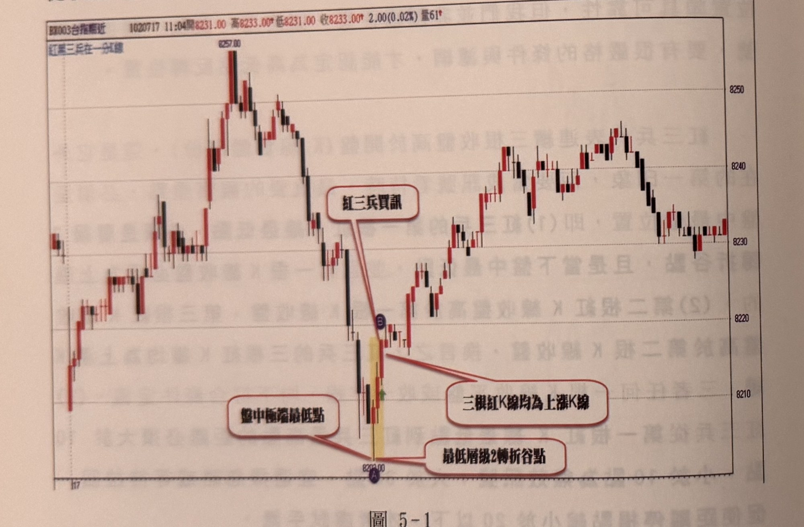

- **圖 5-2（p.159）**：先有一組紅三兵（C）不作為本例重點，後方以綠色網底標示的長紅 K 急拉至最高點 A，之後連續三根黑 K 下跌至 B，右側文字框列出三項判讀重點（最高層級2峰點、盤中最高點、三根黑K必為下跌），成立黑三兵空訊。

  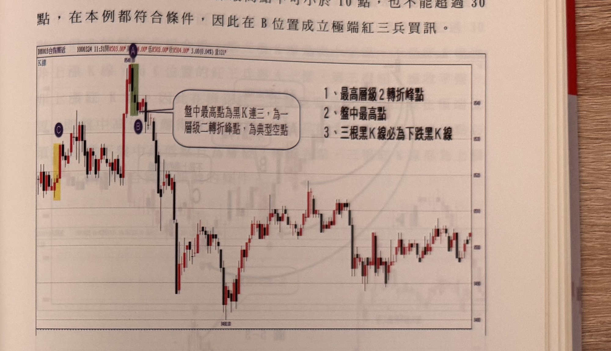

- **圖 5-4／5-5（p.162–163，圖 5-4 部分文字承接自缺頁 p.161）**：A 位置黑三兵三根均下跌但幅度不足 10 點，依 F3 忽略；C 位置紅三兵幅度超過 10 點成立買訊，於 D 進多單、以 C 低點為停損（控制在 20 點內）；尾盤 E 位置再現黑三兵但幅度仍小於 10 點且第二根收平盤，依 F1、F3 忽略。圖 5-5 另示範跳空開低時，可改以「昨收起算」判斷是否構成極端位置（早盤高到 A 幅度不足 30 點，但以昨收起算超過 40 點，故仍認可 A 為極端位置）。

  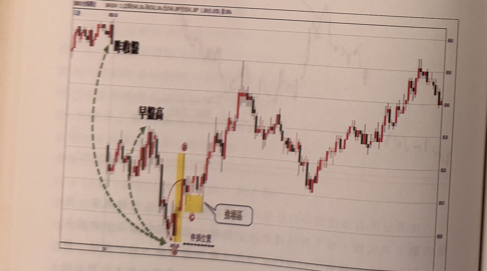

- **圖 5-6（p.164）**：兩組連續三紅 K（B、D）走勢皆符合上升條件，但因起漲點皆非當下盤中最低點，依 F2 皆不能作為買訊使用，示範「必須是當下盤中最低/最高」的鐵律不可妥協。

  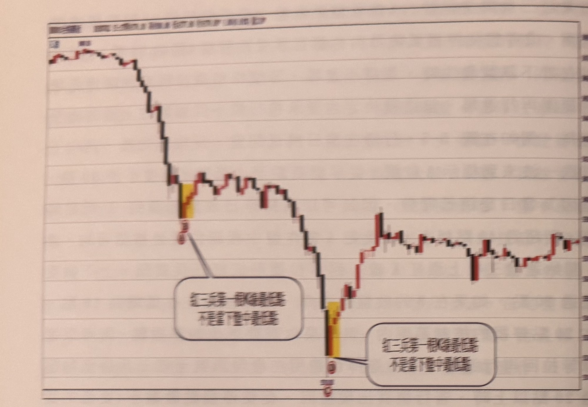

- **圖 5-7、5-8（p.165）**：兩則練習範例（「以下附圖請讀者自行參閱練習」），分別示範黑三兵於盤中最高關卡放空、紅三兵於整理區後低點買進。

  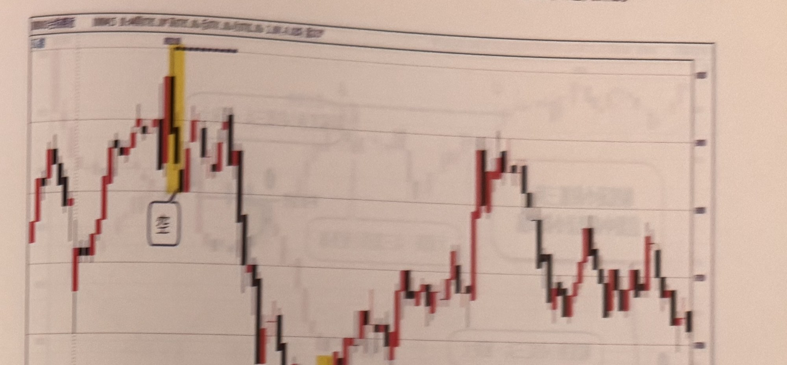
  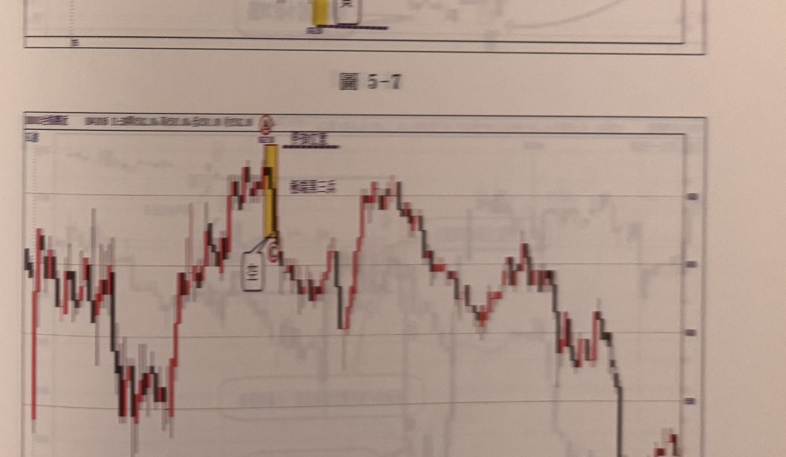

- **圖 5-9（p.166）**：示範 F4（幅度過大風險）——A 到 C 幅度小於 30 點的紅三兵，以及後段幅度過小的黑三兵（D–E），文字框直接標註「幅度過小的紅/黑三兵，風險大」。

  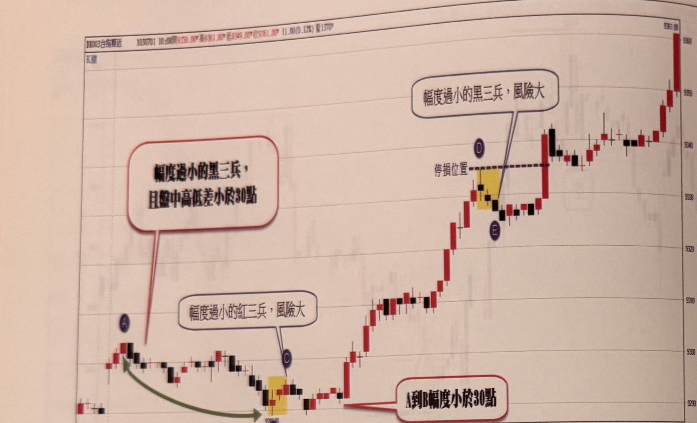

- **圖 5-10、5-11、5-12（p.166–167）**：續作練習範例；圖 5-12 特別標註「失敗的極端位置紅三兵」及「高低距離小，視為極端位置有較大的風險」，呼應 F4 概念。

  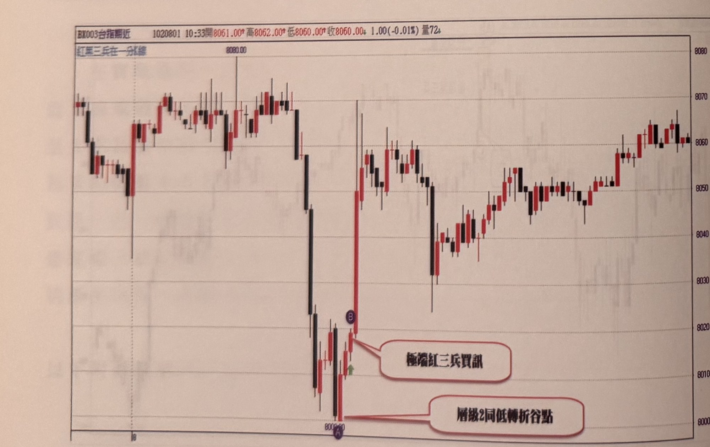
  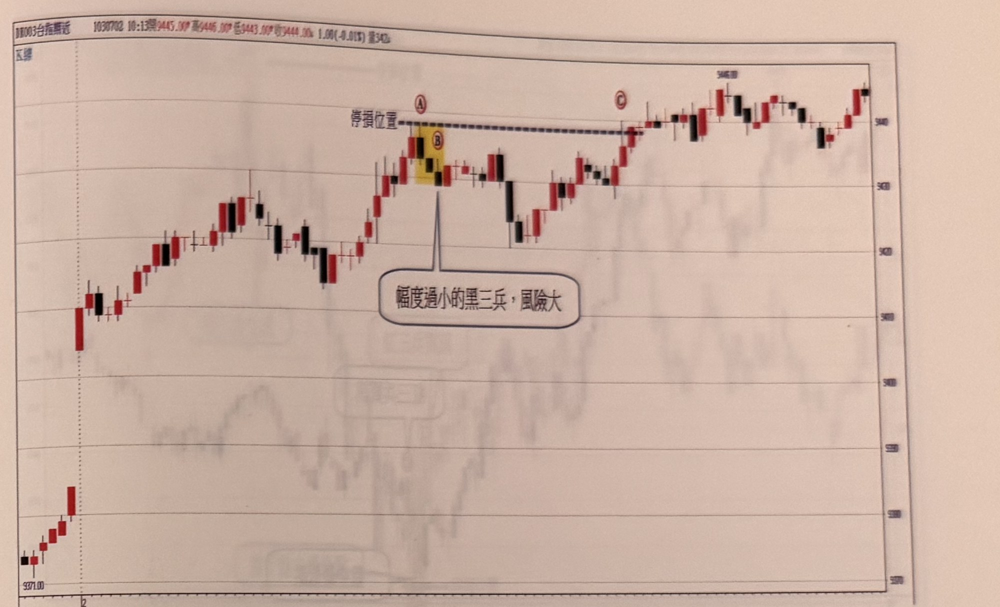
  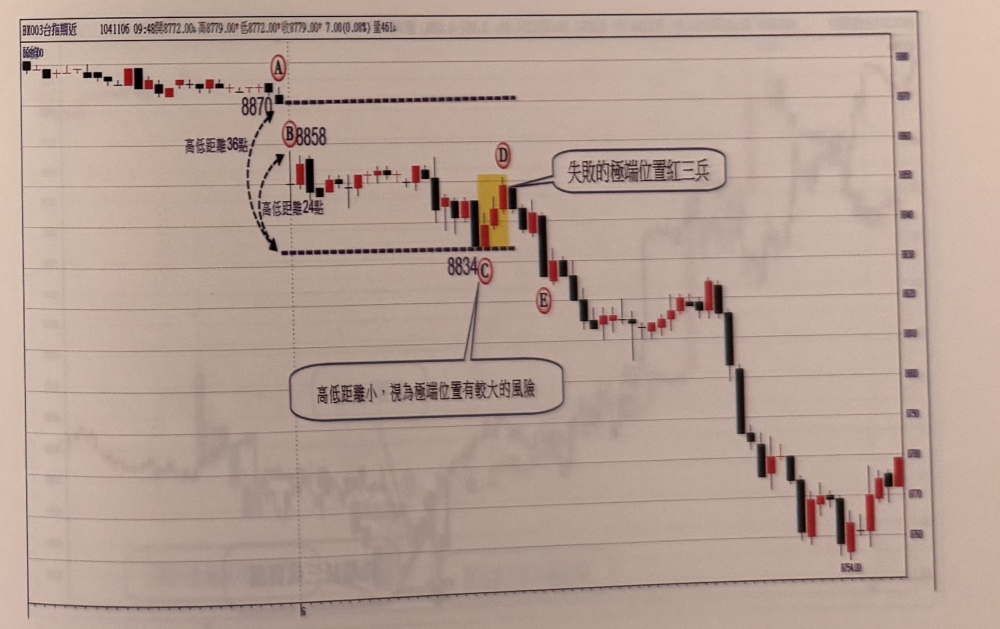

- **圖 5-13～5-18（p.168–171）**：一系列練習範例圖（多數僅圖說標註「紅三兵買訊」「黑三兵空訊」「當下盤中最高/最低點」等關鍵字，正文對應說明因照片模糊或跨頁裁切未能完整辨識，見「12. 待確認事項」）。

  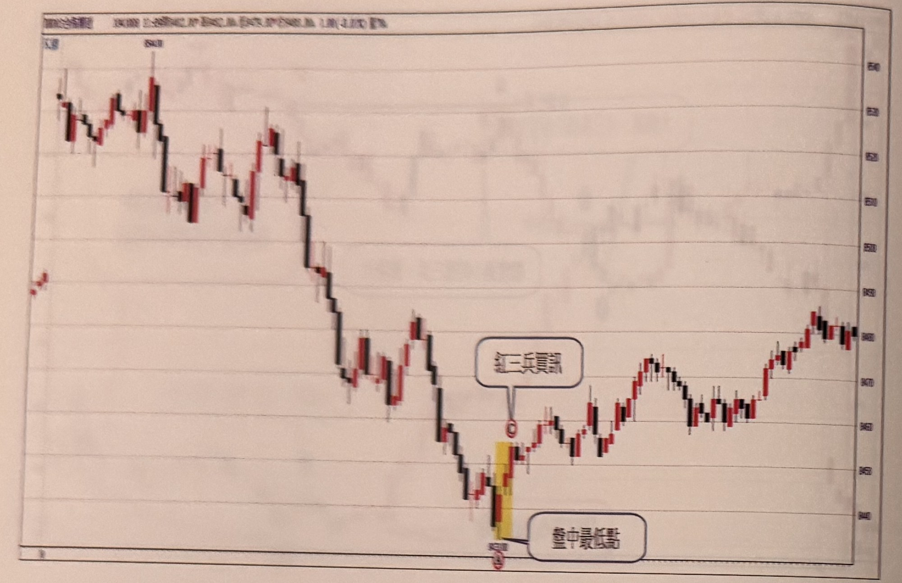
  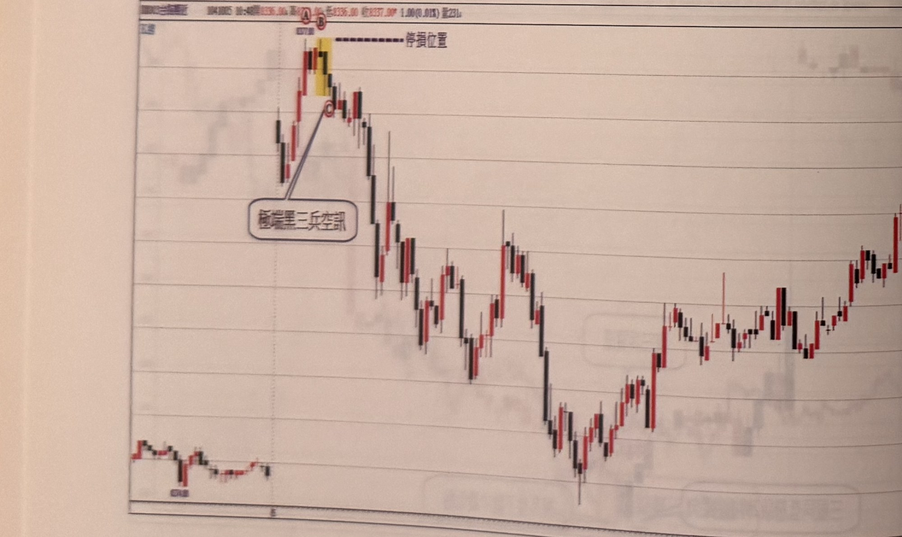

- **圖 5-19（p.171）**：黑三兵空訊於 D 位置成立後停損於 C（平倉點），隨後另一組黑三兵於高點 F 成立，行情反轉重挫；文字明確提到「當部位獲利超過15點後折返進場點，宜出場當作沒事」。

  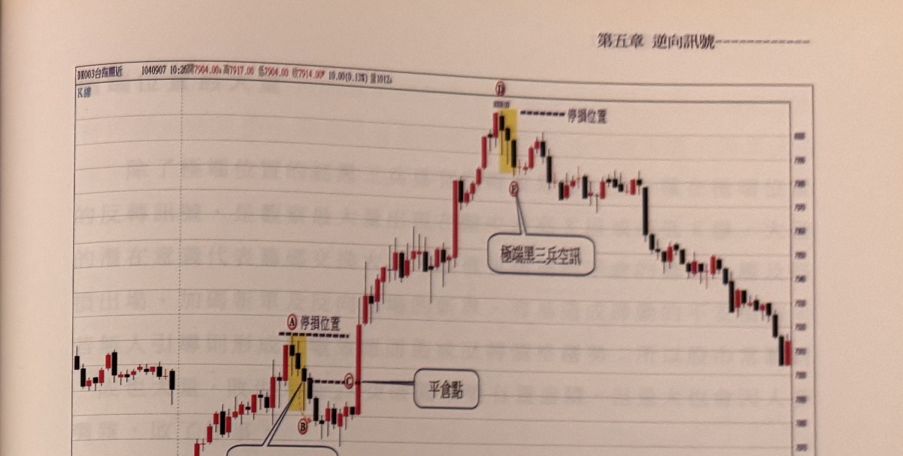

- **圖 5-20（p.171，標題「多空出場機制」）**：紅三兵買進訊號後，說明文字「預設初始獲利20點後啟動折返20點停利」，示範階梯式移動停利（A 至 I/J 各轉折點約 20 點間距移動停利），最終在接近高點處平倉。

  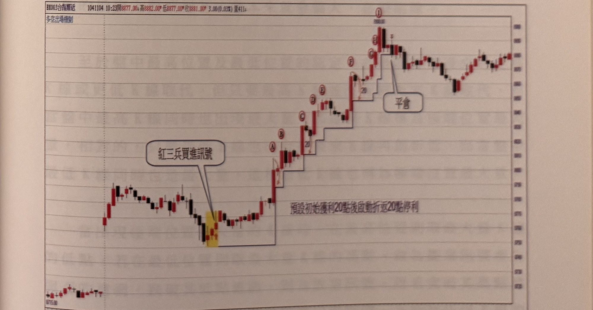


## 9. 作者提醒與常見錯誤

- 辨認紅黑三兵最重要的一點，是**確認它是盤中最低/最高 K 線，絕對不能妥協**；即使三根同色 K 線走勢完全符合「連續上漲/下跌收盤」的外觀條件，只要起始點不是當下盤中極端點，就不能視為有效訊號（p.164）。
- 三根 K 線的影線可以任意排列或糾纏（甚至三根低點/高點相同），只要滿足「第一根為層級 2 極端轉折點」「三根均為同向收盤」「幅度大於 10 點」，其餘細節不影響訊號成立（p.162）。
- 訊號一旦被停損，代表該方向的極端反轉假說已被市場推翻，之後同方向再出現的三兵不宜再視為訊號使用，盤勢可能會朝原趨勢方向加速發展（p.163）。

## 10. 規則速查（Checklist）

- [ ] 第一根 K 線最低點（紅三兵）／最高點（黑三兵）為層級 2 轉折點，且為當下盤中最低／最高
- [ ] 第一根 K 線收盤為上漲（紅三兵）／下跌（黑三兵）
- [ ] 三根 K 線收盤依序遞增（紅三兵）／遞減（黑三兵），無平盤或十字線
- [ ] 第一根最低點／最高點確為三根中最極端者
- [ ] 幅度（第一根極端點到第三根末端）介於 10～30 點；若 >30 點已評估是否忽略或等拉回
- [ ] 若此方向前一個訊號已被停損，本次不再使用（F5）
- [ ] 停損設於第一根 K 線最低點／最高點，控制於 20 點以內
- [ ] 出場：獲利曾超過 15 點又折返進場點時出場，或採 20 點階梯式移動停利

## 11. 機器可讀規則

```yaml
signal: 極端位置紅三兵與黑三兵
side: both
timeframe: 1m
conditions:
  - id: C1
    desc: 紅三兵第一根紅K最低點須為層級2轉折谷點，且為當下盤中最低點；第一根收盤上漲
    source: p.157
    side: long
  - id: C2
    desc: 第二根收盤高於第一根，第三根收盤高於第二根，三根均為上漲K線，不得平盤或十字線
    source: p.157
    side: long
  - id: C3
    desc: 第一根紅K最低點須為三根紅K中最低點
    source: p.157
    side: long
  - id: C4
    desc: 第一根最低點到三兵最高點距離>10點且<=30點；<10點無效，>30點宜忽略或等拉回使停損<=20點
    source: p.157
    side: long
  - id: C1p
    desc: 黑三兵第一根黑K最高點須為層級2轉折峰點，且為當下盤中最高點；第一根收盤下跌
    source: p.158
    side: short
  - id: C2p
    desc: 第二根收盤低於第一根，第三根收盤低於第二根，三根均為下跌K線，不得平盤或十字線
    source: p.158
    side: short
  - id: C3p
    desc: 第一根黑K最高點須為三根黑K中最高點
    source: p.158
    side: short
  - id: C4p
    desc: 第一根最高點到三兵最低點距離>10點且<=30點；<10點無效，>30點宜忽略或等反彈使停損<=20點
    source: p.158
    side: short
entry:
  rule: 第三根K線收盤附近進場；若幅度>30點，等拉回/反彈使停損縮小至20點以內才進場
  source: p.157, p.158, p.163
stop_loss:
  rule: 多方停損於紅三兵第一根K線最低點；空方停損於黑三兵第一根K線最高點；控制在20點以內
  source: p.157, p.158, p.163
exit:
  - rule: 獲利曾超過15點、價格折返回到進場點附近時出場
    source: p.171
  - rule: 階梯式移動停利，初始獲利20點後啟動，其後每約20點移動一次停利
    source: p.171
filters:
  - id: F1
    desc: 任一根收平盤或十字線，不符合定義
    source: p.157, p.158
  - id: F2
    desc: 起始最低/最高點非當下盤中最低/最高，不得視為訊號
    source: p.164
  - id: F3
    desc: 幅度<10點，無效訊號
    source: p.157, p.158
  - id: F4
    desc: 幅度>30點，宜忽略或等拉回/反彈使停損<=20點
    source: p.157, p.158
  - id: F5
    desc: 同方向前一訊號已被停損，之後再出現的同型態訊號不宜使用
    source: p.163
```

## 12. 待確認事項

無。缺頁僅影響範例圖，見 frontmatter `missing_pages`。

## 13. 原文出處

- `extracted/pages/IMG_8528.md`（p.156–157）
- `extracted/pages/IMG_8529.md`（p.158–159）
- `extracted/pages/IMG_8531.md`（p.162–163）
- `extracted/pages/IMG_8532.md`（p.164–165）
- `extracted/pages/IMG_8533.md`（p.166–167）
- `extracted/pages/IMG_8534.md`（p.168–169）
- `extracted/pages/IMG_8535.md`（p.170–171）
- `extracted/pages/IMG_8536.md`（p.172，內容不可辨識，僅存頁碼）
