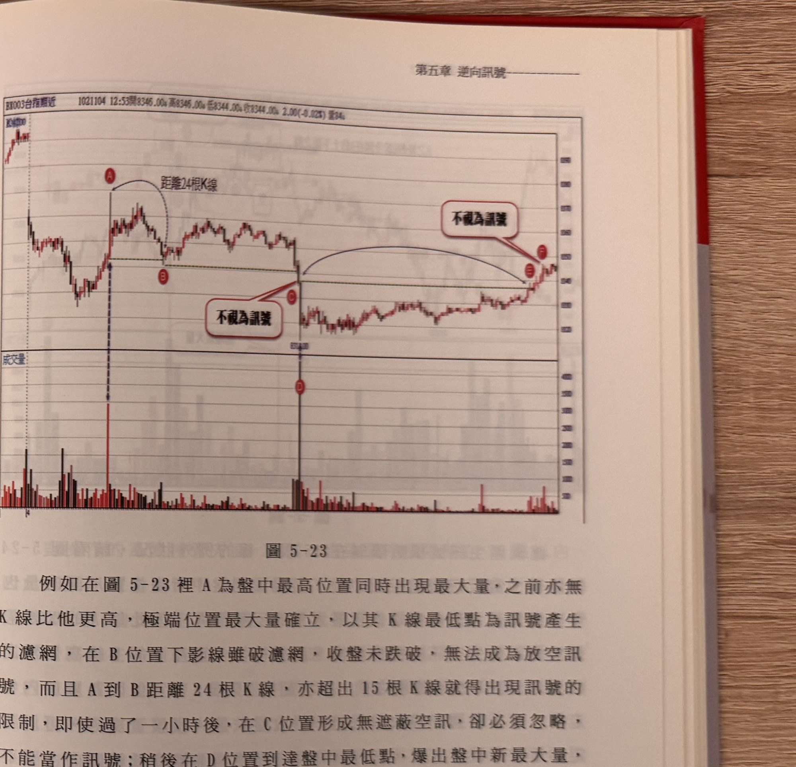
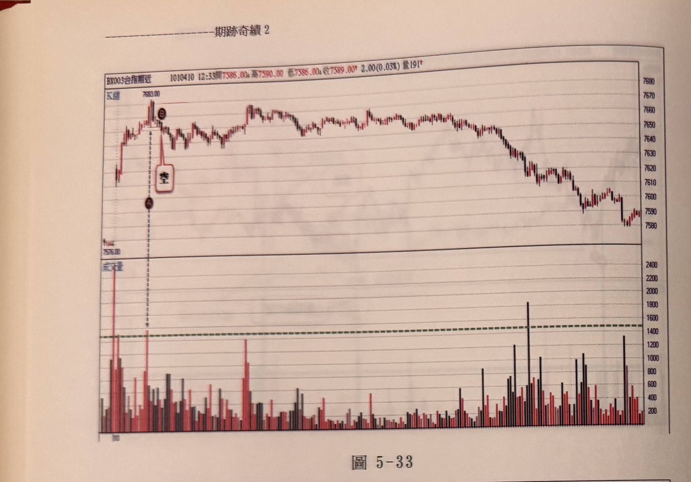
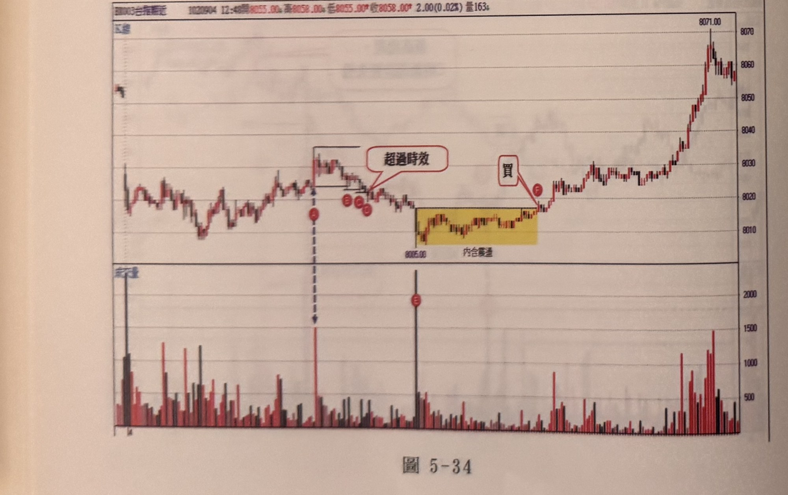
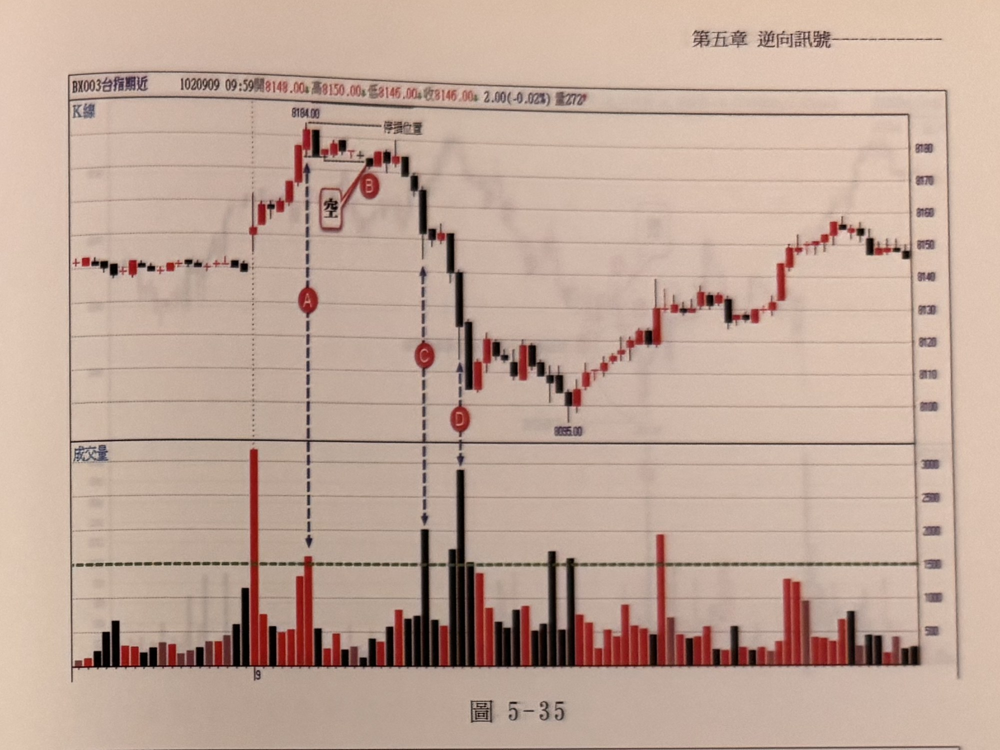
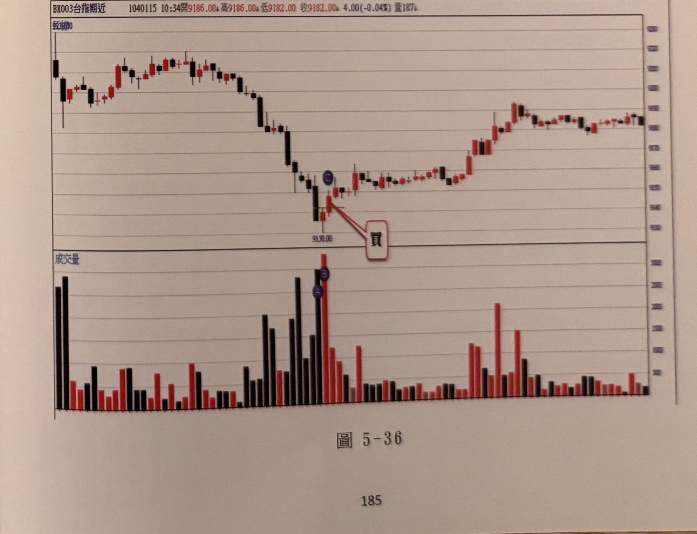
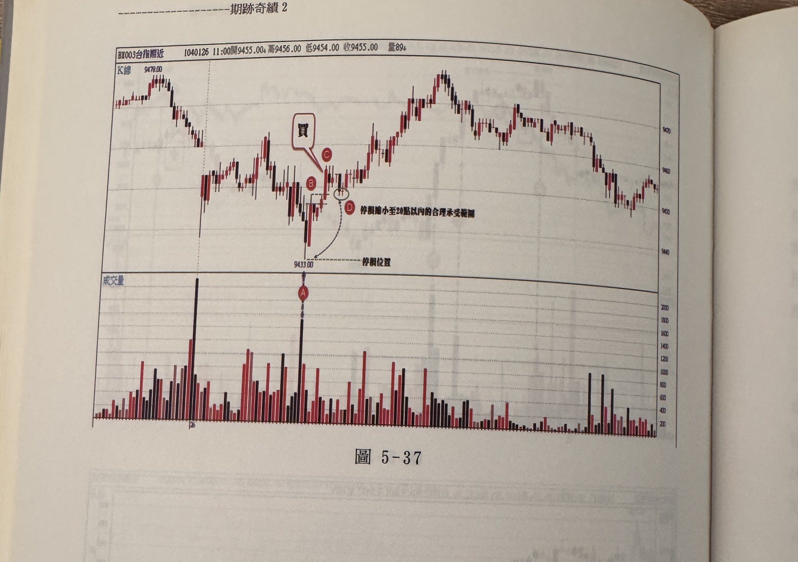

# 極端位置最大量

> 一句話摘要：盤中最高（或最低）K 線若同時是盤中最大量，以該K線的低點（或高點）當作反轉濾網，收盤跌破（或突破）濾網即為放空（或買進）訊號。

## 1. 核心概念

除了紅黑三兵，另一種在極端位置的反轉訊號是觀察**最大成交量是否出現在盤中最高或最低的 K 線**。大量的潛在意義代表籌碼交換大增——包含獲利平倉籌碼、觸及停損出場、加碼新單及反向進場的新單，容易造成躁動不安的情緒，若無人接手引導，就容易形成反噬效應而導致價格趨勢反轉，即所謂「成也大量，敗也大量」（p.173）。

## 2. 適用前提

- 商品：台指期，觀察單位為 1 分鐘 K 線，須搭配成交量副圖。
- **最低成交量門檻：1500 口**（1 分鐘走勢），低於此水準即使出現在盤中最高/最低位置，也不能列入候選訊號（p.174）。
- **開盤第一根 K 線的成交量一律不列入「最大量」評選**，因為該量已集結前一天所有事件變數的預期行為，量本來就會偏大，須剔除（p.173, p.175 圖 5-21）。
- **極端位置的最小幅度要求：反轉幅度須超過 30 點以上**，才符合「極端位置」的合理定義，避免只是 30 點以內的小幅震盪就被誤判為極端反轉點，導致獲利空間被過度壓縮（p.174）。

## 3. 訊號定義

1. C1　某根 K 線的**高點為當下盤中最高點**，且**成交量為當下盤中最大量**（並已剔除開盤第一根），該根即為「極端高點最大量」K 線（p.173）。
2. C1'　某根 K 線的**低點為當下盤中最低點**，且**成交量為當下盤中最大量**（已剔除開盤第一根），該根即為「極端低點最大量」K 線（p.173）。
3. C2　極端高點最大量 K 線的**低點**，做為放空訊號的觀察濾網；極端低點最大量 K 線的**高點**，做為買進訊號的觀察濾網（p.173）。
4. C3　極端位置與最大量的資格會**持續被後續更新的 K 線取代**：只要後續出現新高（或新低）K 線，舊的極端位置立即失效，須重新尋找符合條件（新極端位置 + 新最大量）的 K 線（p.173, p.175）；同理只要後量大於前量，最大量的認定也隨之更換候選（p.173）。
5. C4　幅度門檻：極端位置最大量 K 線與其對應反轉起點（或相對高低點）的距離須**超過 30 點**才成立，不足 30 點須忽略（p.174, p.175）。
6. C5　訊號 K 線收盤**無遮蔽**跌破濾網（放空）或突破濾網（買進）時，訊號成立（p.176 及各圖例）。
7. C6　濾網時效限制：自濾網 K 線建立起算，**若連續 15 根 K 線內都沒有 K 線收盤無遮蔽突破/跌破濾網**，則濾網失效（過期不再視為有效訊號來源）（p.176）。
8. C7　濾網時效的例外：若濾網建立後，之後行情**始終盤整在極端最大量 K 線的高低範圍之內**（沒有任何一根 K 線的上下影線超出該範圍），則不受 15 根 K 線的限制，可以持續等待（p.176, p.178–179 圖 5-24）。但一旦要突破，仍**必須一舉收盤突破**，不能只是影線觸及；一旦影線突破而收盤未突破，即刻喪失「不受根數限制」的特權，時效立即消失（p.178–179）。

## 4. 進場

- 訊號 K 線（C5 條件成立時）收盤附近進場，方向與濾網被突破的方向一致（跌破濾網→放空；突破濾網→買進）（p.176 及圖 5-23、5-24、5-25 等）。
- 若訊號 K 線收盤與停損位置（極端最大量 K 線的高點或低點）距離**超過 20 點**，應先忽略訊號，等待價格反彈/拉回使距離縮小到 20 點以內再進場（p.175, p.179–180，圖 5-25、圖 5-26）。若行情此後不再回頭反彈/拉回，則直接放棄該訊號（p.179）。

## 5. 停損

- 空單：停損設於極端高點最大量 K 線的**高點**（即濾網 K 線本身的高點）；多單：停損設於極端低點最大量 K 線的**低點**（p.173, p.179）。
- 停損（風控）點數上限：與紅黑三兵方法一致，**控制在 20 點以內**；超過 20 點須忽略訊號或等待折返縮小距離後再進場（p.175, p.179）。

## 6. 出場 / 停利

- 書中在本小節未針對「極端位置最大量」訊號另外定義專屬停利機制；未見本節出現具體停利點數或折返停利規則的原文描述（書中未明確說明）。
- 推論：本章第一個方法（紅黑三兵）採用的「獲利超過 15 點後折返進場點即出場」與「20 點階梯式移動停利」出場邏輯，皆屬於同一章「逆向訊號」的操作範疇，可能同樣適用於本方法，但書中並未在本節文字中重複陳述，故不直接併入本方法規則，僅在此註記供讀者參考（推論，未經原文明確佐證）。

## 7. 過濾：不做的情況

1. F1　成交量低於 1500 口，即使出現在盤中最高/最低位置，不列入候選（p.174）。
2. F2　開盤第一根 K 線的成交量，永遠不參與「最大量」評選（p.173, p.175）。
3. F3　極端位置與最大量 K 線之間的幅度（高低距離）須超過 30 點，未達門檻須忽略（p.174, p.175：圖 5-22「距離太小」即忽略該次極端位置）。
4. F4　新的更高（或更低）K 線出現時，原本的極端位置立即失效，若該新 K 線的成交量未同時創最大量，則當下**沒有任何候選**極端位置最大量 K 線，須等待符合「新極端位置 + 新最大量」同時成立的 K 線再重新觀察（p.173, p.176：G 點失效後，「當日必須有比 H 更低且量比 G 點更大的 K 線出現，才能使用本法找訊號」，示範訊號可能整日不出現）。
5. F5　濾網建立後超過 15 根 K 線仍未出現無遮蔽突破/跌破，且行情已脫離濾網 K 線高低範圍（非內包走勢），則該濾網失效，不再視為有效訊號來源（p.176, p.177 圖 5-23：C 位置雖形成無遮蔽空訊，但因距離 A 已達 24 根 K 線且超過 15 根限制，須忽略；E/F 位置雖收盤突破但已逾一小時，同樣不能視為訊號）。
6. F6　僅影線突破/跌破濾網而收盤未突破/跌破，不算訊號，且若此時已超出「內包走勢」保護（即已有 K 線影線超出濾網範圍），則不受「不受 15 根限制」的特權，時效立即消失（p.176, p.179）。
7. F7　訊號 K 線收盤距停損位置超過 20 點：先忽略，等待折返縮小距離後再考慮進場，若行情不折返則直接放棄（p.175, p.179–180）。

## 8. 範例解析

- **圖 5-21（p.174–175）**：峰頂 K 線量為全圖最高量柱，開盤第一根高量柱不計入。A 位置創盤中最低點且量為最大量，但幅度（開盤高點到 A）不足 30 點，依 F3 忽略；B 位置突破新高、量亦最大，且 A 到 B 幅度超過 40 點，符合極端高點最大量，以 B 低點為空訊濾網；隔根 C 再創新高且量更大，依 C3 立即取代 B，改以 C 低點為新濾網；D 位置黑 K 收盤跌破濾網，放空訊號成立。完整示範 C1–C3、C5、F3、F4 的逐步判讀流程。

  

- **圖 5-22（p.175）**：連續三波上攻回落，第一、二波因「距離太小」被忽略（F3），第三波下跌段量創全圖最大量，成立極端最大量訊號。

  

- **圖 5-23（p.176–177）**：A 為極端高點最大量，B 下影線破濾網但收盤未破（F6，不成立），C 位置雖無遮蔽跌破但因距 A 已達 24 根、超過 15 根限制須忽略（F5）；D 為新的極端低點最大量，其後行情長時間盤整在 D 的高低範圍內（內包走勢，享有 C7 例外，不受 15 根限制），但 E/F 位置最終突破時已超過一小時，即使收盤突破也不能視為訊號（F5 例外情境下仍需一舉收盤突破，一有影線先行突破即失去特權）。完整示範 C6、C7、F5、F6 之間的互動。

  

- **圖 5-24（p.178）**：A 創盤中新高且爆最大量，成立空訊濾網；此後行情長時間在 A 的高低區間內游走（內包走勢），雖已超過 15 根 K 線，但因屬內包走勢不受限制（C7），最終 B 位置一舉收盤跌破濾網，成立放空訊號，未壞規矩。示範 C7 例外的正面案例。

  

- **圖 5-25（p.178–179）**：剔除開盤量 A 後，B 為盤中最高點最大量，隔根 C 無遮蔽收盤跌破濾網成立空訊，但訊號 K 線收盤距停損位置近 40 點、遠超 20 點控制範圍，依 F7 須先忽略；等待隔根 D 出現反彈，距離縮小至 20 點以內才重新進場放空。完整示範 F7 的操作流程。

  

- **圖 5-26（p.180–181）**：示範「眼花誤植」風險——I 高點下跌至 A（盤中最低點、剔除開盤量後最大量）容易誤以為立刻有買訊，卻忽略了 B 點續創新低的事實；C 位置量比 A 更大但非當日最高點，不能視為極端最大量；D 位置創新高但量不如 C，也不能視為極端最大量；直到 F 位置同時創新高且量比 C 更大，才符合條件，以 F 低點為空訊濾網，G 位置出現無遮蔽空訊，但距停損逾 20 點須先忽略，等待反彈至 H 區間縮小停損距離後才進場。示範辨認過程中常見的認知陷阱與 F7 濾網流程的完整結合。

  

- **圖 5-27、5-28（p.181）**：「以下附圖請讀者自行參閱練習」性質的練習範例，分別示範放空（峰頂最大量濾網跌破）與買進（盤中最低點最大量、E/F 位置無遮蔽買訊）情境。

  
  

- **圖 5-29～5-32（p.182–183）**：延續練習範例圖（因照片模糊，部分文字/字母無法辨識），圖 5-30、5-31 皆標註「轉折最大量」於成交量最高柱處，示範概念在不同盤勢下的重複應用；圖 5-32 另有「新高再現，C 浪起漲位置失守」的文字框，描述再創新高後原先濾網失守的情境（詳見待確認事項）。

  
  

- **圖 5-33～5-36（p.184–185）**：第五章末段練習範例圖，皆附成交量子圖。圖 5-33 示範開盤跳空走高後於峰點 B 出現放空訊號；圖 5-34 示範「內含震盪」區間整理後於量能放大處出現買進訊號，另有「超過時效」標註（呼應 F5 濾網時效規則）；圖 5-35 示範開盤跳空走高於峰點出現放空訊號後急殺，成交量圖同步出現對應長黑柱；圖 5-36 示範低檔量能爆量（全圖最大量）後出現買進訊號。四圖規則與既有 C1–C7、F1–F7 一致，未見新增規則，皆屬「請讀者自行參閱練習」性質。

  
  
  
  

- **圖 5-37（p.186，2026-09-26 由 IMG_8965 重拍清晰版取代原手震模糊版 IMG_8955）**：台指期近月 1 分鐘 K 線圖，時間戳 1040126 11:00。主圖左側標示前波高點 9478.00，行情下殺至低點 9433.00 附近止跌；文字框「買」搭配箭頭指向標示 C 處的買進訊號 K 線，其上方另標示 B 點；低點下方虛線圈選標示 D 處，文字框說明「停損縮小至 20 點以內的合理承受範圍」；圖下方另以虛線標示停損位置，對應低點 9433.00。訊號出現後行情強力反彈走高，一路盤堅上攻，其後小幅拉回整理並出現一次較小反彈，末段呈區間震盪。成交量副圖以文字框「A」搭配箭頭指向買進訊號當根 K 線對應的一根特別長的黑色成交量柱。
  - 對照規則：前波高點 9478 到低點 9433 幅度達 45 點，超過 30 點門檻，符合 C4；低點 9433 為盤中最低點且對應最大量（C1'）；以其高點為買訊濾網（C2）；標示 D「停損縮小至 20 點以內」對應 F7 過濾規則（訊號距停損超過 20 點須先忽略，等待折返縮小距離）；停損設於極端低點最大量 K 線之低點 9433（C2、第 5 節停損規則）。內容與既有 C1'、C2、C4、C5、F7 規則完全一致，**無新增規則或例外**，為正式的完整範例解析。p.187 確認為章末空白頁。

  

## 9. 作者提醒與常見錯誤

- 由於 1 分鐘 K 線隨每分鐘不斷產生，辨認盤中最高/最低位置容易「眼花誤植」——例如看到局部低點且量偏大就急著認定買訊，卻忽略後續還有更低點出現的事實，這種「自我催眠」的行為並不罕見（p.176，圖 5-26）。
- 極端位置最大量的訊號**不見得每天都會出現**：若當日始終沒有「比目前最低點更低、且量比目前最大量更大」的 K 線同時成立，則當下沒有任何候選 K 線，必須耐心等待，而非勉強套用不完全符合條件的 K 線（p.176）。
- 濾網一旦要突破，必須「一舉收盤突破」，不可以只有影線碰到，否則立刻失去時效（包括「內包走勢」帶來的根數限制豁免）（p.176, p.179）。

## 10. 規則速查（Checklist）

- [ ] 該 K 線的高點（或低點）是否為當下盤中最高（或最低）
- [ ] 該 K 線成交量是否為當下盤中最大量（已剔除開盤第一根）
- [ ] 成交量是否 ≥ 1500 口
- [ ] 與相對高低點的幅度是否 > 30 點
- [ ] 後續是否已出現更高/更低 K 線導致濾網失效（若有，重新尋找）
- [ ] 濾網建立後是否在 15 根 K 線內出現無遮蔽突破/跌破（或屬於內包走勢例外）
- [ ] 訊號 K 線收盤是否「無遮蔽」突破/跌破濾網（非僅影線）
- [ ] 訊號距停損位置是否 ≤ 20 點（若否，等拉回/反彈縮小距離）
- [ ] 停損已設於濾網 K 線本身的高點（空）／低點（多）

## 11. 機器可讀規則

```yaml
signal: 極端位置最大量
side: both
timeframe: 1m
min_volume: 1500
exclude: 開盤第一根K線之成交量不列入最大量評選
conditions:
  - id: C1
    desc: 某K線高點為當下盤中最高點，且成交量為當下盤中最大量（已剔除開盤第一根）
    source: p.173
    side: short
  - id: C1p
    desc: 某K線低點為當下盤中最低點，且成交量為當下盤中最大量（已剔除開盤第一根）
    source: p.173
    side: long
  - id: C2
    desc: 以極端高點最大量K線之低點（空）/極端低點最大量K線之高點（多）為訊號濾網
    source: p.173
  - id: C3
    desc: 後續出現新高/新低K線，原極端位置立即失效，須重新尋找同時滿足新極端位置與新最大量的K線
    source: p.173, p.176
  - id: C4
    desc: 極端位置最大量K線與相對高低點之幅度須超過30點，否則忽略
    source: p.174, p.175
  - id: C5
    desc: 訊號K線收盤須無遮蔽突破/跌破濾網
    source: p.176
  - id: C6
    desc: 濾網建立後15根K線內未出現無遮蔽突破/跌破，濾網失效
    source: p.176
  - id: C7
    desc: 例外：濾網建立後行情持續盤在濾網K線高低範圍內（內包走勢），不受15根K線限制；但突破仍須一舉收盤突破
    source: p.176, p.178
entry:
  rule: 訊號K線收盤無遮蔽突破/跌破濾網時進場；若距停損>20點，先忽略並等待折返縮小距離
  source: p.176, p.179
stop_loss:
  rule: 空單停損於濾網K線（極端高點最大量K線）高點；多單停損於濾網K線（極端低點最大量K線）低點；控制在20點以內
  source: p.173, p.175, p.179
exit: 書中本節未明確說明專屬停利機制（可能沿用同章紅黑三兵之15點折返出場/20點階梯移動停利，但無原文直接佐證，屬推論）
filters:
  - id: F1
    desc: 成交量<1500口不列入候選
    source: p.174
  - id: F2
    desc: 開盤第一根K線成交量不列入最大量評選
    source: p.173, p.175
  - id: F3
    desc: 幅度<=30點忽略
    source: p.174, p.175
  - id: F4
    desc: 新高/新低出現但未同時創最大量，當下無候選訊號K線
    source: p.173, p.176
  - id: F5
    desc: 濾網逾15根K線未突破且已非內包走勢，濾網失效
    source: p.176, p.177
  - id: F6
    desc: 僅影線突破/跌破、收盤未突破/跌破，不算訊號；已超出內包走勢範圍者立即喪失根數限制豁免
    source: p.176, p.179
  - id: F7
    desc: 訊號距停損位置>20點，先忽略，等待折返縮小距離後再進場，否則放棄
    source: p.175, p.179
```

## 12. 待確認事項

原 p.186（圖5-37）補拍照片 IMG_8955 手震模糊，細部文字原本無法確認；2026-09-26 已由 IMG_8965 重拍清晰版取代，內容完整可辨，確認與既有 C1'、C2、C4、C5、F7 規則一致，未發現新增規則或例外，已改列為正式範例解析（見第8節）。p.187 確認為章末空白頁。frontmatter `missing_pages` 已清空。原待確認事項（照片模糊存疑）已解決，移除。

## 13. 原文出處

- `extracted/pages/IMG_8536.md`（p.173；p.172 為空白頁）
- `extracted/pages/IMG_8537.md`（p.174–175）
- `extracted/pages/IMG_8538.md`（p.176–177）
- `extracted/pages/IMG_8539.md`（p.178–179）
- `extracted/pages/IMG_8540.md`（p.180–181）
- `extracted/pages/IMG_8541.md`（p.182–183）
- `extracted/pages/IMG_8542.md`（p.184–185）
- `extracted/pages/IMG_8965.md`（p.186，2026-09-26 重拍清晰版，取代原模糊版 IMG_8955；p.187 為空白頁）
