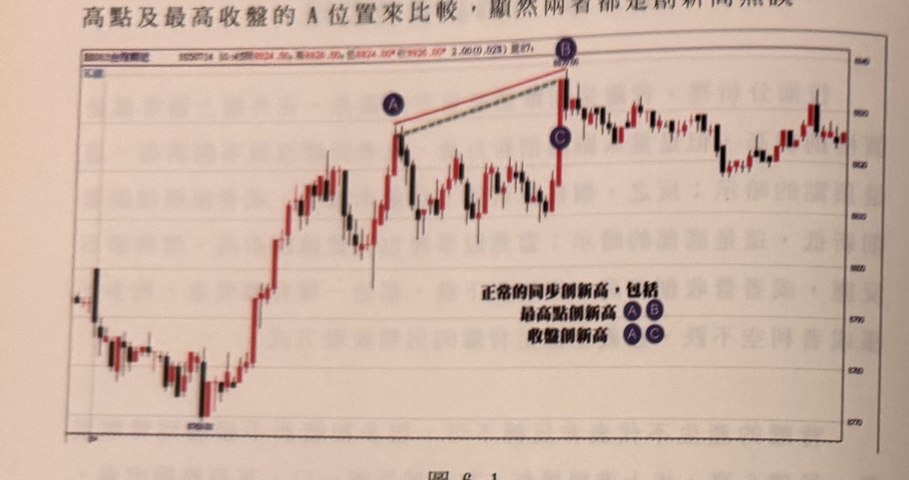
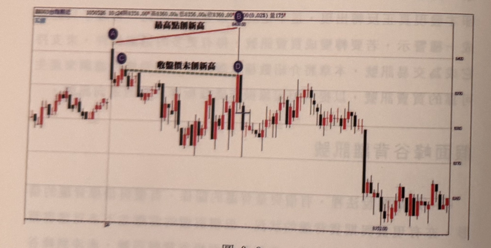
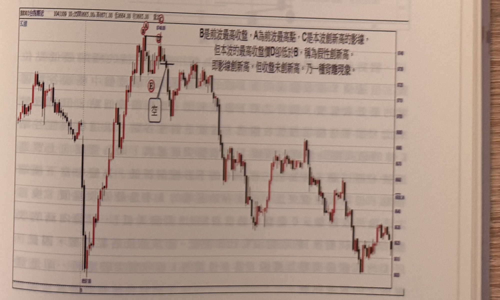
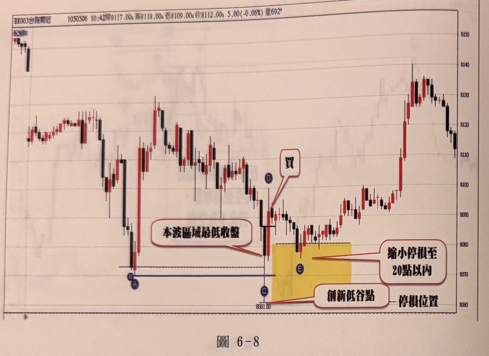
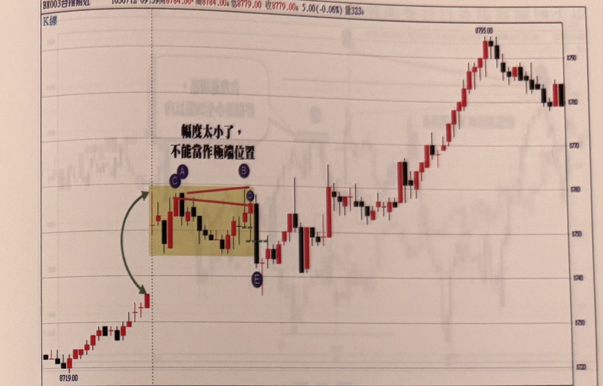
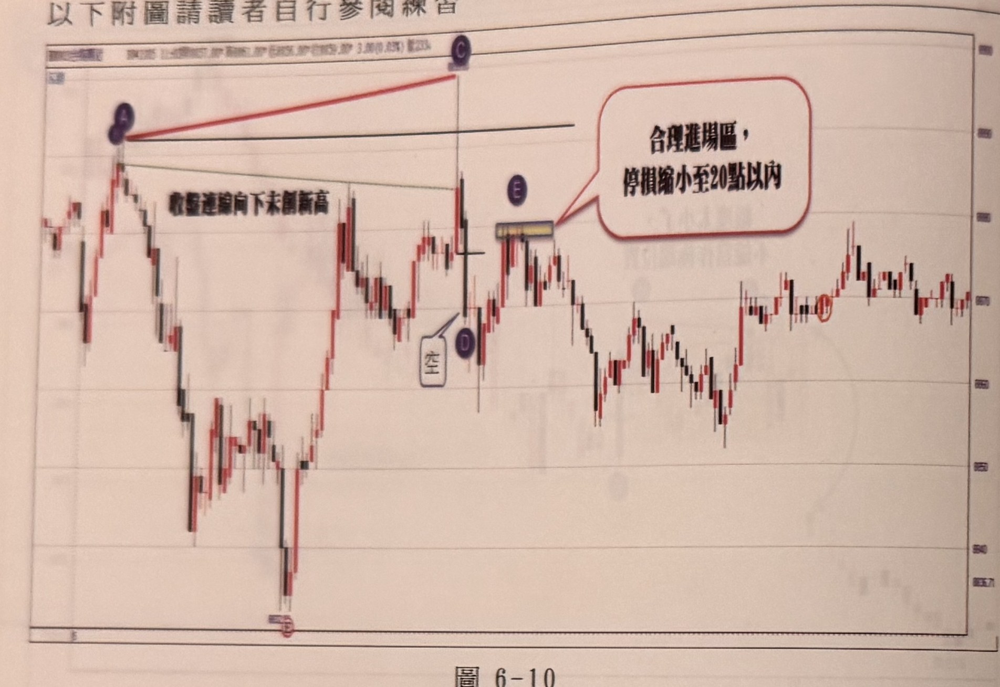
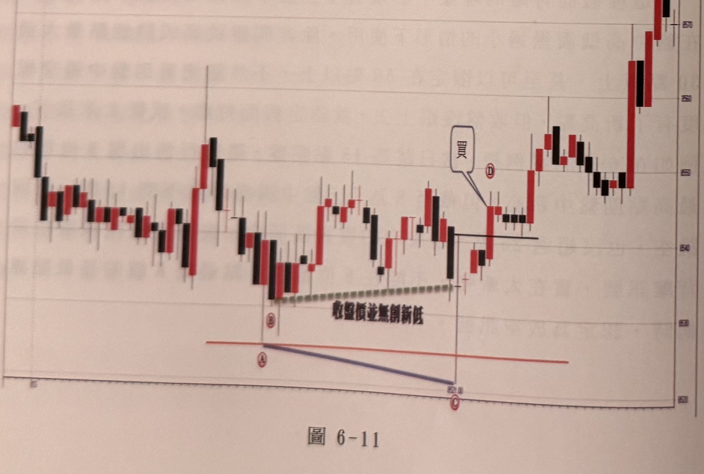
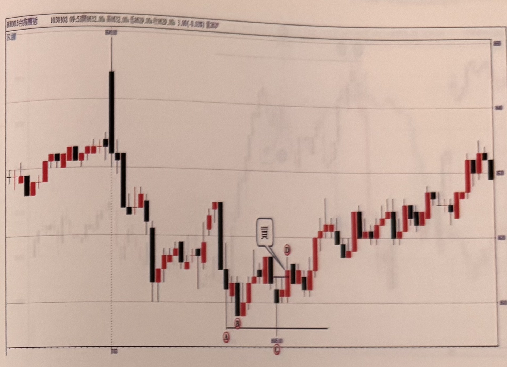
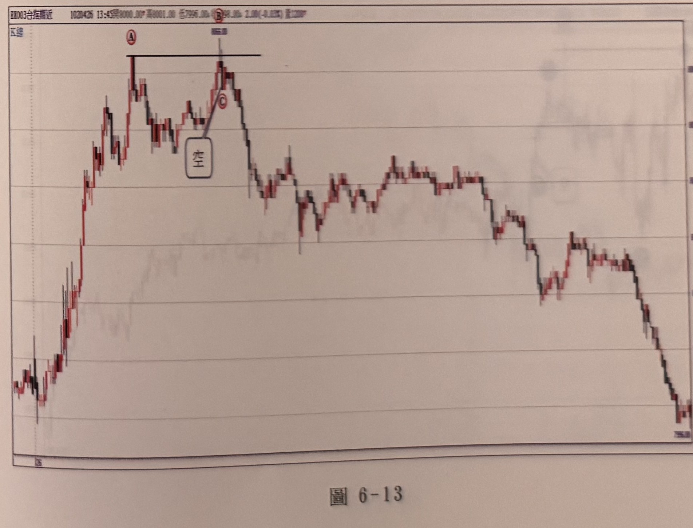

# 假性創新高 / 假性創新低背離（假面峰谷背離）

> 一句話摘要：只用 K 線本身（不搭配任何指標）比較「價格的最高／最低點」與「收盤價」是否同步創新高／新低，若影線創新高（低）但收盤價沒有跟上，即為假性峰（谷）點，以其極端點為濾網，收盤跌破（突破）濾網即為背離放空（買進）訊號。

## 1. 核心概念

正常的多頭／空頭延續，價格的最高點（或最低點）與收盤價應該同步創新高（新低）；如果一波推升（下跌）的**影線**創了新高（新低），但**收盤價**卻沒有比前波最高（最低）收盤更高（更低），代表這一波的極端點只是「假面」——表面上創新高（低），實際買（賣）盤力道不足，屬於價格與收盤價不同步運動的背離現象（p.190–191）。以此假性峰（谷）點的 K 線最低（最高）點畫水平濾網，等待後續 K 線**收盤**跌破（突破）濾網，才確認反轉、形成放空（買進）訊號（p.191）。

這個方法完全不依賴 KD、RSI 等指標，純粹用「影線 vs. 收盤」的同步性來判斷背離，是本章三種背離方法中最基礎、最直觀的一種。

## 2. 適用前提

- 僅適用於盤中**極端位置**（波段高點或波段低點），不可在盤整區內隨意套用（p.196）。
- 盤中高低震幅（含跳空）必須夠大：一般盤中高低震幅需**超過 40 點**（含跳空至盤中高低點）才夠格認定為極端峰谷位置；若震幅過窄，不宜認定假性峰谷背離（p.194、p.197）。
- 若當日**開盤跳空**點數夠大（例如跳空 70 點），即使拉回到創新高（低）的幅度不到 20 點，也可以認可該峰（谷）點的極端性（p.194，推論：跳空點數愈大，對窄幅波段極端點的認可門檻愈寬鬆）。
- 若開盤跳空點數過小（例如跳高／跳低僅 15 點），且盤中震盪幅度（含跳空）不到 25 點，則震盪區間太窄，不能認定為極端位置背離（p.197，圖 6-9）。

## 3. 訊號定義

### 3.1 放空訊號（假性創新高背離向下）

1. C1：行情先走出波段峰點 A（前波最高點），對應前波最高收盤為 B（p.191，圖 6-2／6-3）。
2. C2：後續 K 線影線（最高點）C 突破 A，創下當下行情新高（p.191）。
3. C3：但本波（自 A 之後的拉回低點起算，至 C 為止）的**最高收盤價** D 卻比前波最高收盤 B 低，即收盤未同步創新高，代表 C 是假性創新高峰點（p.191；圖 6-3 圖說：「C 是本波創新高的影線，但本波的最高收盤價 D 卻低於 B」，D 為 C 之前一根、非其後一根）。本波若已有收盤 ≥ B，C 屬正常同步創新高。
4. C4：以 C（假性峰點）的**最低點**畫水平濾網。
5. C5：若濾網形成後、C 之後又有 K 線高點創出比 C 更高的位置，則 C 不再是極端峰點，不能作為訊號濾網使用，須重新尋找峰點（p.191）。
6. C6：當後續 K 線**收盤跌破** C 的最低點（濾網）時，即為背離放空訊號（p.191）。

### 3.2 買進訊號（假性創新低背離向上，鏡像規則）

1. C1'：行情先走出波段谷點（前波最低點），對應前波最低收盤。
2. C2'：後續 K 線影線（最低點）創下當下行情新低。
3. C3'：但本波的**最低收盤價**卻比前波最低收盤高，即收盤未同步創新低，代表該谷點是假性創新低谷點（p.196，圖 6-8；p.199，圖 6-11）。
4. C4'：以該假性谷點的**最高點**畫水平濾網。
5. C5'：若濾網形成後又有 K 線低點創出比它更低的位置，則不再是極端谷點，須重新尋找。
6. C6'：當後續 K 線**收盤突破**該谷點的最高點（濾網）時，即為背離買進訊號（p.196、199）。

### 3.3 例外：打平不算假突破

在假性峰（谷）點的濾網尚未被跌破（突破）前，若行情又推出更高（更低）的收盤，且該收盤與原本前波區域最高（最低）收盤打平（一樣高／低），則**不能**視為假性突破（跌破），必須放棄該次背離訊號的尋找（p.195，圖 6-7：C 創新高但收盤比 A 低，判定為假突破；濾網未破前又連拉二根紅 K，新收盤與 A 的收盤打平，遂放棄空訊）。

## 4. 進場

- 收盤跌破（突破）假性峰（谷）點濾網時，即為放空（買進）訊號，原則上訊號 K 線收盤後即可進場（p.191）。
- **補進場條件**：若訊號產生時，進場價格離假性峰（谷）點已經**超過 20 點**，代表停損距離過大，不必急於進場；應等待行情折返，使價格與峰（谷）點的距離**縮小至 20 點以內**時，再考慮進場（p.196，圖 6-8：停損原本超過 30 點，等拉回至黃色區域、距離縮小到 20 點以內才進場）。

## 5. 停損

- 停損位置：設在假性峰（谷）點本身（放空以假性峰點的最高點／最高影線為停損；買進以假性谷點的最低點／最低影線為停損）（p.194–196）。
- 若訊號K線收盤距離停損位置（假性峰/谷點）已超過 **20 點**，不必急於進場；應等待行情折返，使距離縮小到 **20 點（或 10 點）以內**再進場，藉此把停損風險控制在合理範圍（p.194–196，p.198 圖 6-10：「合理進場區，停損縮小至20點以內」）。
- 書中未明確說明停損觸發後是否反手（本方法段落未提及反手規則）。

## 6. 出場 / 停利

書中未明確說明本方法的出場、停利或移動停損規則。

## 7. 過濾：不做的情況

1. 盤中高低震幅（含跳空：自昨收起算至盤中高低點）未超過 40 點時，過窄的假性峰谷不足以認定為極端位置背離，不做（p.194「包括跳空至盤中高低點」、p.197「連同跳空」，圖 6-9）。
2. 假性峰（谷）點的濾網尚未被突破（跌破）前，若後續收盤與前波區域最高（最低）收盤打平，放棄本次訊號（p.195，圖 6-7）。
3. 濾網形成後，若價格又創出比假性峰（谷）點更高（更低）的極端點，代表原峰（谷）點失效，須重新尋找新的極端點作為濾網，不可沿用舊濾網（p.191）。
4. 圖 6-9 案例中，當日跳高僅 15 點、盤中含跳空震幅不到 25 點，過窄不能認定為極端位置背離，即使後續跌破濾網也不視為放空訊號（p.197）。

## 8. 範例解析



- **圖 6-1**（p.190）：正常同步創新高範例（非背離）。A→B 為最高點同步創新高，A→C 為收盤同步創新高，用以對照「正常」與後面「假性」創新高的差異。


- **圖 6-2**（p.191）：A 大漲後 B 創最高點新高，但 D 所在 K 線收盤未比前波（C 附近）收盤高，示範「收盤價未創新高」的假性創新高現象；隨後價格反轉下跌。


- **圖 6-3**（p.191）：完整示範放空訊號：B 為前波最高收盤，A 為前波最高點，C 的影線創新高，但本波最高收盤 D 卻低於 B，判定為假性創新高（影線創新高、收盤未創新高）；跌破 E 點濾網後於方框標示「空」進場，其後價格反轉下跌。


- **圖 6-6**（p.194）：跳空 70 點後 A 為高點，B 為層級 2 谷點，D 影線突破 A 創新高但幅度不到 20 點、C 收盤仍低於 A 收盤，判定 D 為假性峰點；D 之後收盤跌破 D 低點於 E 處形成放空訊號，示範跳空幅度足夠時仍可認可窄幅突破的極端性。


- **圖 6-7**（p.195）：A 為早盤最高點，C 突破 A 但收盤較低（假性突破），惟濾網未破前連拉兩根紅 K 使收盤與 A 打平，依規則放棄本次放空訊號的判定，示範「打平不算假突破」的例外。


- **圖 6-8**（p.196）：C 創新低但留下 16 點下影線、收盤未低於前波最低收盤 B，形成谷點背離；D 收盤突破 C 高點濾網形成買訊，惟停損將超過 30 點，故等待價格拉回黃色區域、距離縮小至 20 點以內（E 點）再進場，示範「補進場」規則。


- **圖 6-9**（p.197）：當日跳高 15 點，B 創盤中新高但盤中含跳空震幅不到 25 點，判定幅度過窄不能視為極端位置，E 位置跌破 B 低點濾網也不應視為放空訊號，示範「幅度過小不做」過濾規則。


- **圖 6-10**（p.198）：A、C 兩次高點中 C 創新高但收盤連線未創新高，判定假性創新高；D 處跌破濾網於白框標示「空」，E 附近的黃色高亮區為「合理進場區，停損縮小至20點以內」示範補進場。


- **圖 6-11**（p.199）：C 創價格新低但收盤未創新低，形成谷點背離；D 處收盤突破濾網形成買進訊號，其後強力上漲。


- **圖 6-12**（p.199）：底部型態 A、B 後以水平濾網為停損參考，D 處收盤突破濾網形成買進訊號。


- **圖 6-13**（p.199）：B 創新高但隨後跌破 A 濾網，C 處形成放空訊號，其後走勢轉為階梯狀下跌。


- **圖 6-18**（p.202）：A 為前波區域最低收盤，C 為本波區域最低點／最低收盤，其後收盤突破濾網於買訊處進場，行情隨後強力上漲。


- **圖 6-19**（p.202）：A、B、C 構成下降楔形／三角形，B 之後收盤突破濾網於 E 處形成買進訊號，並附成交量子圖顯示訊號附近量能明顯放大。

## 9. 作者提醒與常見錯誤

- 判斷假性突破（跌破）時，若在濾網尚未被突破（跌破）前，行情又走出更高（更低）的收盤且與前波打平，不可硬套「假突破」判斷，須放棄該訊號（p.195）。
- 只在盤中真正的極端位置（且震幅夠大，一般 40 點以上；跳空夠大時可放寬）才適用本方法，避免在窄幅盤整區內濫用假性背離的說法（p.196–197）。
- 進場停損距離過大時（超過 20 點，甚至 30 點）不宜貿然進場，應耐心等待價格折返、縮小停損距離（p.194、196）。

## 10. 規則速查（Checklist）

- [ ] 行情在盤中極端位置（震幅含跳空 ≥ 40 點，或跳空本身夠大）出現影線創新高（低）
- [ ] 本波最高（低）收盤未同步創新高（低）
- [ ] 以此假性峰（谷）點之最低（最高）點畫水平濾網
- [ ] 濾網形成後未再被價格創出更極端的新高（低）取代
- [ ] 後續 K 線收盤跌破（突破）濾網 → 訊號成立
- [ ] 濾網未破前若收盤與前波收盤打平 → 放棄訊號
- [ ] 進場時停損距離 ≤ 20 點；若否，等待拉回縮小後再進場
- [ ] 停損設於假性峰（谷）點極端值

## 11. 機器可讀規則

```yaml
signal: 假性創新高創新低背離
side: both
timeframe: 1m
conditions:
  - id: C1
    desc: 影線創當下行情新高（新低）
    source: p.191
  - id: C2
    desc: 本波最高（最低）收盤未同步創新高（新低），比前波區域最高（最低）收盤低（高）
    source: p.191
  - id: C3
    desc: 該峰（谷）點之後未再被價格創出更極端的高（低）點取代
    source: p.191
  - id: C4
    desc: 後續K線收盤跌破（突破）假性峰（谷）點的最低（最高）點濾網
    source: p.191
filters:
  - desc: 盤中高低震幅（含跳空）需超過40點，否則不算極端位置背離
    source: p.194, p.197
  - desc: 濾網未破前若後續收盤與前波最高（最低）收盤打平，放棄訊號
    source: p.195
  - desc: 跳空點數愈大，對窄幅突破的極端性認可門檻愈寬鬆（例：跳空70點時，幅度不到20點仍可認可）
    source: p.194
entry:
  trigger: 收盤跌破（突破）假性峰谷點濾網
  delay_rule: 若進場時停損距離超過20點，等待價格折返、距離縮小至20點以內再進場
  source: p.196
stop_loss:
  ref: 假性峰（谷）點之最高（最低）點
  target_points: "<=20（超過則等拉回縮小至20點或10點以內再進場）"
  source: p.194-196
exit: 書中未明確說明
```

## 12. 待確認事項

無。缺頁僅影響範例圖，見 frontmatter `missing_pages`。

## 13. 原文出處

- `extracted/pages/IMG_8544.md`（p.190–191）
- `extracted/pages/IMG_8546.md`（p.194–195）
- `extracted/pages/IMG_8547.md`（p.196–197）
- `extracted/pages/IMG_8548.md`（p.198–199）
- `extracted/pages/IMG_8550.md`（p.202，圖 6-18、6-19 部分）
