# 一分鐘 KD 背離訊號

> 一句話摘要：價格創新高（低）但 KD 指標未同步創高（低），且兩端點分別滿足 D 值超買／超賣的嚴格門檻、中間僅夾一次反向交叉，當 KD 再次交叉時即為放空（買進）訊號。

## 1. 核心概念

KD 背離常被視為重要反轉徵兆，但名聲響亮也容易讓人「看到黑影就開槍」，誤判機率頗高。凡是 0～100 震盪型指標（RSI、KD、威廉指標）在**鈍化**階段（指標長時間停留在極端區），背離會變得像常態而非難得一見，此時代表反轉的證據力轉弱（p.203）。指標背離向下＝價格創新高但指標未跟隨創新高；指標背離向上＝價格創新低但指標未跟隨創新低，兩者呈現價格與指標不同步運動（p.203）。只要把模糊的背離現象轉化為明確、可逐條檢驗的條件，就能成為穩定的交易策略。

## 2. 適用前提

- 使用「自訂界限 KD 指標」於 1 分鐘 K 線圖上。
- 背離的兩個端點必須是價格創新高（低）的對應點；K 線兩端點之間必須至少夾一個層級 2 轉折峰（谷）點（p.203、推論延伸自 RSI 背離段落 p.220 的一般性規則，KD 亦應遵循相同的層級 2 峰谷結構）。
- 若背離的兩端點跨越兩個交易日：當日開盤跳空點數**小於 10 點**時，視為無縫接軌前一日走勢，可延用前一日尾盤 D 值進入超買／超賣區的紀錄；若跳空**超過 10 點**，則前一天尾盤的超買／超賣狀態不得延用至當天，須在當天重新起算端點（p.213）。

## 3. 訊號定義

### 3.1 背離向下（放空訊號）

1. C1：價格在前波峰位時，對應 KD 的 **D 值必須高於 80**，且形成 **KD 死亡交叉**（p.203）。
2. C2：價格拉回時，**K 值須跌破 50**，但**不能低於 20**，並形成 **KD 黃金交叉**（p.203）。
3. C3：當價格再度突破前波峰位、創新高時，對應的 **D 值不再超過 80**，同時 **K 值也低於前波峰位當時的 K 值**（p.203）。
4. C4：此時出現**死亡交叉**，即為放空訊號（p.203）。
5. C5（外觀特徵，等同 C1–C4 的整體描述）：兩個死亡交叉中間只能夾**一個**黃金交叉；不能在兩個死亡交叉之間出現超過 2 個以上的交叉（即不可為一金叉＋一死叉或更多次交替），否則訊號無效（p.205）。

### 3.2 背離向上（買進訊號，鏡像規則）

1. C1'：價格在前波谷位時，對應 KD 的 **D 值必須低於 20**，且形成 **KD 黃金交叉**（p.203）。
2. C2'：價格反彈時，**K 值須突破 50**，但**不能高於 80**，並形成 **KD 死亡交叉**（p.203）。
3. C3'：當價格跌破前波谷位、創新低時，對應的 **D 值不能低於 20**，同時 **K 值也須高於前波谷位當時的 K 值**（p.203）。
4. C4'：此時出現**黃金交叉**，即為買進訊號（p.203）。
5. C5'：兩個黃金交叉中間只能夾**一個**死亡交叉，不能出現超過一個以上的交叉，否則不符條件、須剔除忽略（p.207，圖 6-23 反例）。

### 3.3 端點門檻的常見誤判排除（p.208 逐條辨誤範例）

- 若前後兩個疑似端點之間 K 值從未超過 50（或未跌破 50），不符合 C2/C2' 條件，訊號不成立。
- 若某一疑似端點的 D 值本身未達 20 以下（或 80 以上）的嚴格門檻，即使價格創新低（高），也不構成有效背離端點。
- 兩端點之間只能有**唯一**一次反向交叉；若把相隔更遠、中間夾了多次交叉的兩點湊成「背離」，即使方向正確也視為無效（不符合「只能唯一交叉」的條件）。

## 4. 進場

- 訊號成立時機：背離向下＝再次出現**死亡交叉**時進場放空；背離向上＝再次出現**黃金交叉**時進場買進（p.203）。
- **K 線品質確認**：合理的進場位置應選在金叉（死叉）當根或其後**上漲（下跌）K 線**，若交叉發生的當根 K 線本身不是上漲（下跌）K 線，不宜以此根進場，應等隨後出現的紅 K（黑 K）（p.207，圖 6-23：D 處金叉但為黑 K，不進場，等 E 處紅 K 才進場）。
- 若 K 線漲跌點數過小（例如只漲跌 1 點），代表反轉誠意不足，可搭配 **MA8** 或 **SAR** 進一步過濾：等 K 線站上／跌破 MA8，或收盤穿越 SAR，再行進場（p.212）。
- 若背離兩端點跨日，且跳空超過 10 點，隔日須重新起算端點，不得沿用前一日尾盤的超買超賣紀錄進場（p.213）。

## 5. 停損

- 停損設置：以背離端點的低點 B（第二個端點，即本次創新低／新高的谷位／峰位，圖 6-25 中「先打到標示 B 低點…再度跌破標示 B 谷點」）為停損，或採「第一章均線訊號」介紹的停損設置法（E），兩者擇一皆可；亦可取兩者中**較低者**（多單）／**較高者**（空單），風控更嚴謹（p.209，圖 6-25：原文「依背離低點(B)為停損，或第一章均線訊號停損(E)，或取兩者較低者亦可」）。
- 若停損點過小、空方（多方）表態不夠積極，可等較大幅度的 K 線，或等收盤跌破（突破）SAR 時才進場，停損仍以「背離端點(B)」或「均線訊號停損法(E)」（或兩者較嚴謹者）設置（p.213）。

## 6. 出場 / 停利

- 書中未明確說明固定停利規則，但提供**反手停損**規則：若進場後行情僅小幅反彈（不到 20 點）即再度跌破背離端點形成**倒 N 型**（三段式下跌 123 結構完成），原多單必須停損，並在倒 N 型完成（第 3 步）位置**反手放空**，同時重設新停損位置（p.209，圖 6-25）。鏡像地，空單遇到正 N 型完成時亦應停損反手做多（p.209，多空對稱）。

## 7. 過濾：不做的情況

1. 端點之間出現超過一次反向交叉（即金叉死叉交替兩次以上），不符合條件，訊號無效（p.205、207–208）。
2. 端點的 D 值未達嚴格門檻（背離向下兩端點的 D 值須分別 >80 與 <80；背離向上兩端點的 D 值須分別 <20 與 >20），未達標即使價格創新高（低）也不構成訊號（p.203、206、208）。
3. 交叉發生的 K 線本身不是順勢方向的 K 線（金叉卻是黑 K、死叉卻是紅 K）時，不宜以該根進場，應等待方向正確的 K 線（p.207）。
4. 背離兩端點跨日、且跳空超過 10 點時，不可延用前一日尾盤的超買超賣紀錄（p.213）。
5. 並非每次背離都會反轉：若趨勢力量強勁，背離可能只是短暫逆向整理，之後仍延續原趨勢；不能看到背離就武斷認定絕對反轉（p.209）。

## 8. 範例解析

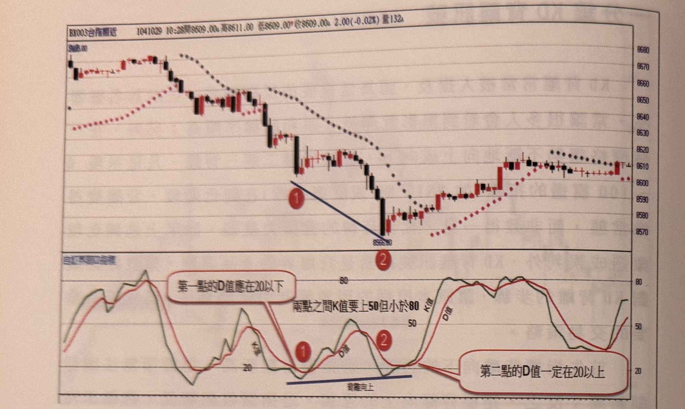

- **圖 6-20**（p.204）：①處 D 值 20 以下黃金交叉，K 值反彈上 50 但未達 80（死叉），②處價格創新低但 D 值仍在 20 以上，符合背離向上四條件，於②黃金交叉時形成買進訊號，其後強力上漲。
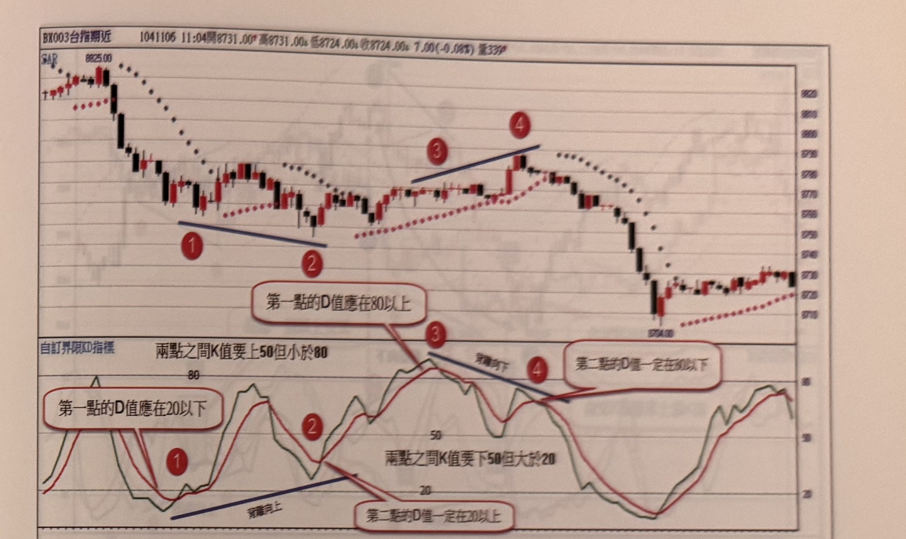

- **圖 6-21**（p.205）：①處 D 值 80 以上死亡交叉，K 值拉回 50～20 之間出現黃金交叉，④處價格創新高但 D 值未達 80，符合背離向下，於④死亡交叉時形成放空訊號。
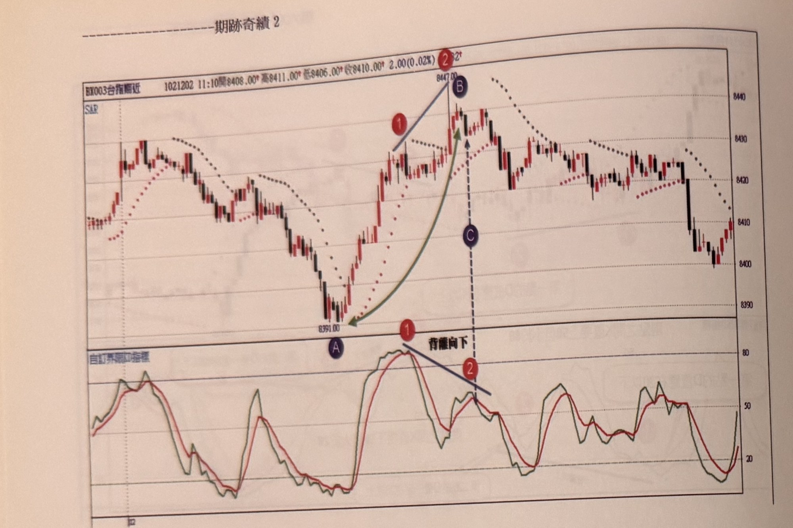

- **圖 6-22**（p.206）：標示 1、2 之間價格創新高但 KD 背離向下（D 值分別高於／低於 80），且由 A 到 B 推升逾 50 點，說明背離前推升點數夠大時，後續折返幅度（>10 點）較容易預期。
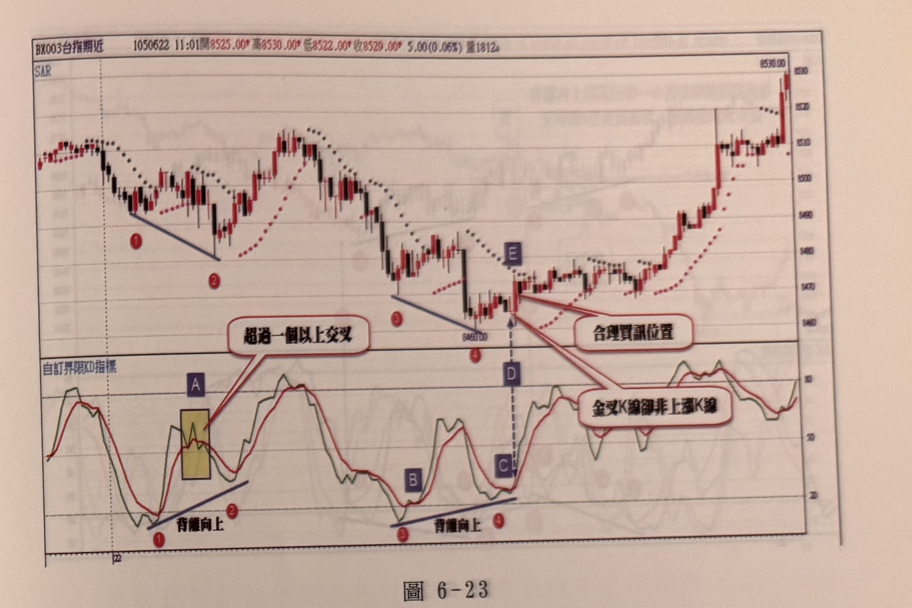

- **圖 6-23**（p.207）：標示 1、2 為背離向上金叉，但中間 A 區出現 5 次交叉，不符合「唯一死叉」條件，予以剔除；標示 3、4 之間僅夾一次死叉，符合條件；D 處金叉但為黑 K，建議改在隨後上漲的 E 點紅 K 進場，示範「K 線品質確認」規則。
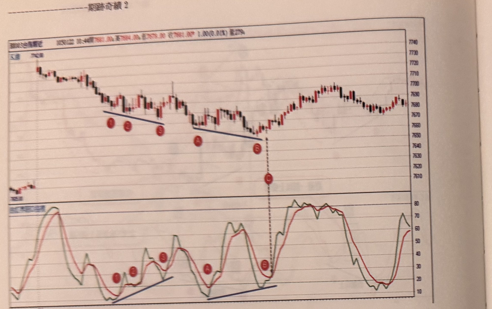

- **圖 6-24**（p.208）：逐一排除標示 1-2、2-3、1-3 等疑似背離組合（分別因 K 值未過 50、D 值未達 20 以下等原因不符條件），只有 A、B 到 C 這組同時滿足所有條件，於 C 處金叉形成買進訊號，示範完整的端點篩選流程。
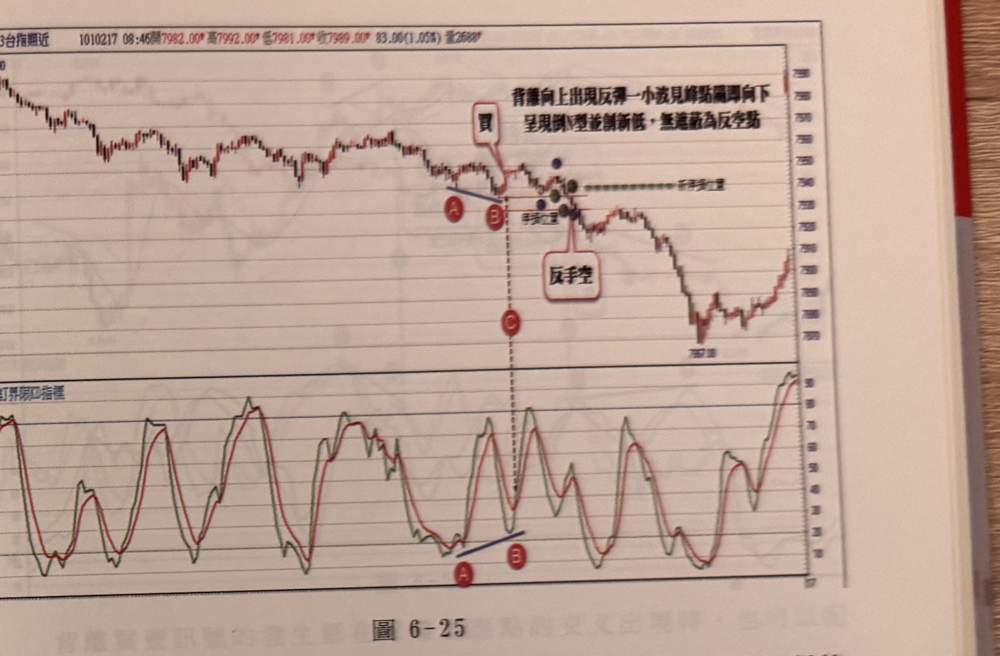

- **圖 6-25**（p.209）：A、B 符合 KD 背離向上買訊條件，C 處金叉買進，但反彈不到 20 點後再破 B 低點、形成倒 N 型，於完成點 F(3) 停損反手放空，示範背離訊號失敗後的停損與反手規則。
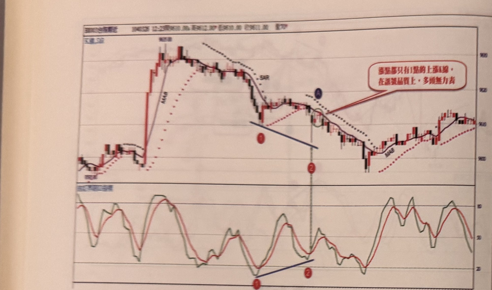

- **圖 6-29**（p.212）：①、②出現 KD 背離向上，但反叉當根為下跌 K 線、且隨後上漲 K 線多為僅漲 1 點的「敷衍裝漲」，說明應搭配 MA8 或 SAR 進一步過濾訊號品質。
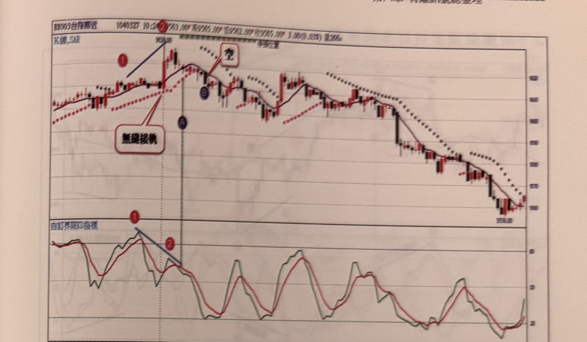

- **圖 6-30**（p.213）：①、②之間屬前一日尾盤至隔日開盤的無縫接軌（跳空 <10 點），呈現 KD 背離向下，A 處死亡交叉且同時跌破 MA8，雙重確認放空訊號，惟跌點過小，可等更大 K 線或跌破 SAR 再進場。


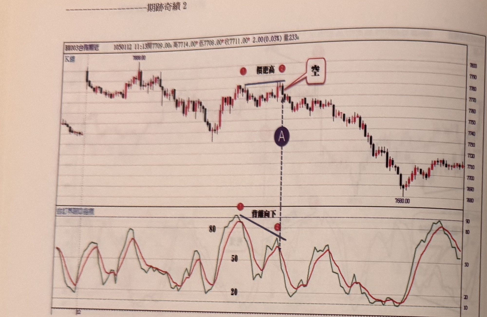
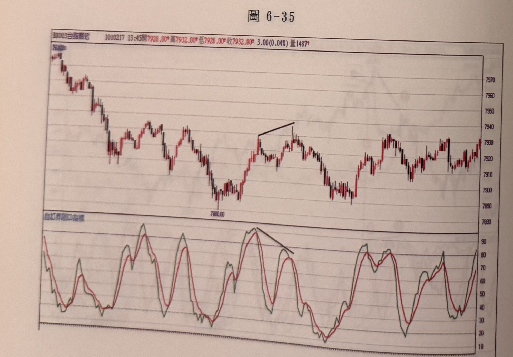
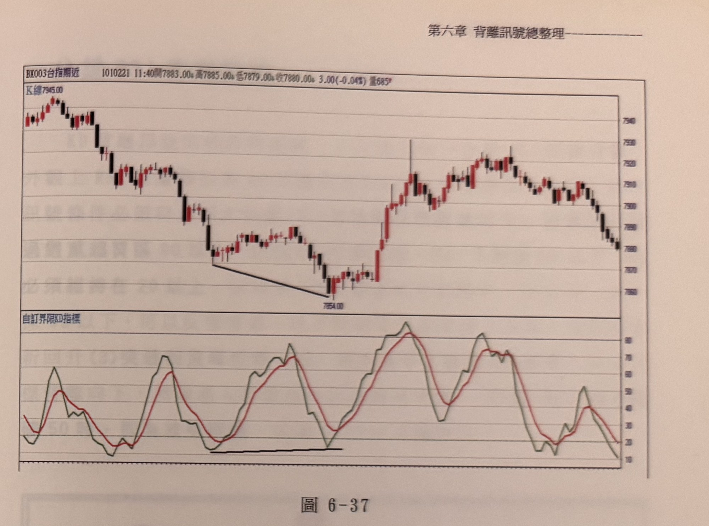
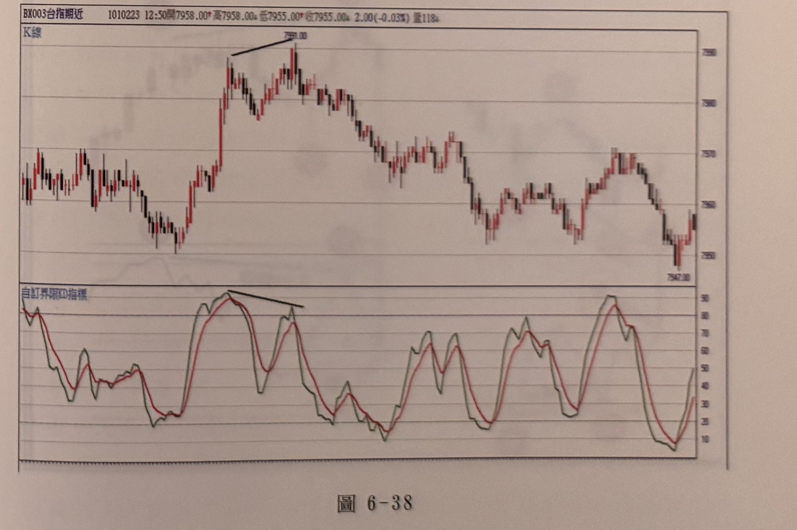

- **圖 6-31～6-38**（p.214–217）：作者列為讀者自行練習的附圖，分別示範背離向上／向下訊號、KD 值需過 50 的門檻、假性更高峰位（「假更高」）等情境，供讀者自行套用上述條件驗證。

## 9. 作者提醒與常見錯誤

- KD 背離名聲響亮，容易讓交易者「看到黑影就開槍」，誤判率高；務必嚴格套用四項條件逐一檢驗，不可憑印象判斷（p.203）。
- 指標鈍化階段（長時間停留於超買超賣區）會讓背離變得像常態，此時背離的反轉證據力較弱，須留意（p.203）。
- 背離向上／向下的交叉次數規則是硬性條件：多一次交叉、少一次交叉都不成立，不可自行放寬（p.205、207）。
- 金叉（死叉）發生的當根 K 線若方向不符（例如金叉卻是黑 K），應以隨後方向正確的 K 線作為實際進場點，而非交叉當根（p.207）。
- 並非每次背離都保證反轉，趨勢力量強勁時仍可能只是短暫整理（p.209）。

## 10. 規則速查（Checklist）

放空（背離向下）：
- [ ] 前波峰位 D 值 > 80，且該處為死亡交叉
- [ ] 拉回時 K 值跌破 50 但不低於 20，形成黃金交叉
- [ ] 價格創新高但 D 值不再過 80，且 K 值低於前波峰位的 K 值
- [ ] 中間只夾一次黃金交叉（無其他交叉）
- [ ] 再次死亡交叉時進場，且該根為下跌 K 線（否則等後續下跌 K 線）

買進（背離向上）：
- [ ] 前波谷位 D 值 < 20，且該處為黃金交叉
- [ ] 反彈時 K 值突破 50 但不高於 80，形成死亡交叉
- [ ] 價格創新低但 D 值不低於 20，且 K 值高於前波谷位的 K 值
- [ ] 中間只夾一次死亡交叉（無其他交叉）
- [ ] 再次黃金交叉時進場，且該根為上漲 K 線（否則等後續上漲 K 線）

- [ ] 停損取背離端點低點 B、均線訊號停損 E，或兩者較低（多單）／較高（空單）者
- [ ] 若行情反向跌破（突破）背離端點形成倒 N 型（正 N 型），停損並反手

## 11. 機器可讀規則

```yaml
signal: KD背離
side: both
timeframe: 1m
indicator: 自訂界限KD指標
conditions:
  - id: C1
    desc: 前波峰位D值>80（背離向下）或前波谷位D值<20（背離向上），且該處為死亡交叉／黃金交叉
    source: p.203
  - id: C2
    desc: 價格拉回（反彈）時K值跌破（突破）50但不低於20（不高於80），形成反向交叉（唯一一次）
    source: p.203
  - id: C3
    desc: 價格創新高（新低）但D值不再過80（不低於20），且K值低於（高於）前波峰谷位的K值
    source: p.203
  - id: C4
    desc: 兩端點之間只能存在唯一一次反向交叉，多於一次即視為無效
    source: p.205, p.207
entry:
  trigger: 第二次同方向交叉（死叉放空／金叉買進）發生時
  k_line_filter: 交叉當根K線方向須與訊號方向一致（否則等後續方向正確K線）
  source: p.203, p.207
  weak_signal_filter: K線漲跌點數過小時，搭配MA8或SAR站上/跌破確認
  weak_signal_filter_source: p.212
gap_rule:
  desc: 背離兩端點跨日時，跳空<10點可視為無縫接軌延用前日超買超賣紀錄；跳空>=10點須重新起算
  source: p.213
stop_loss:
  method: "背離端點低點B、或第一章均線訊號停損E，擇一；亦可取兩者較低者（多單）／較高者（空單）"
  source: p.209
reversal_rule:
  desc: 若行情跌破（突破）背離端點形成倒N型（正N型）123步驟完成，原單停損並反手
  source: p.209
exit: 書中未明確說明固定停利規則
filters:
  - desc: 端點之間出現超過一次反向交叉，訊號無效
    source: p.205, p.207-208
  - desc: 端點D值未達嚴格門檻（>80 / <20），即使價格創高低也不構成訊號
    source: p.203, p.206, p.208
  - desc: 跨日跳空>=10點不得延用前日超買超賣紀錄
    source: p.213
```

## 12. 待確認事項

無。缺頁僅影響範例圖，見 frontmatter `missing_pages`。

## 13. 原文出處

- `extracted/pages/IMG_8550.md`（p.203）
- `extracted/pages/IMG_8551.md`（p.204–205）
- `extracted/pages/IMG_8552.md`（p.206–207）
- `extracted/pages/IMG_8553.md`（p.208–209）
- `extracted/pages/IMG_8555.md`（p.212–213）
- `extracted/pages/IMG_8556.md`（p.214–215）
- `extracted/pages/IMG_8557.md`（p.216–217）
