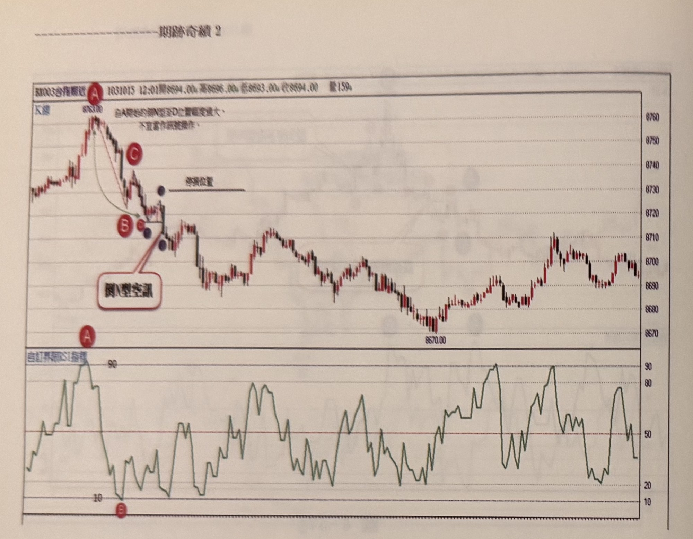
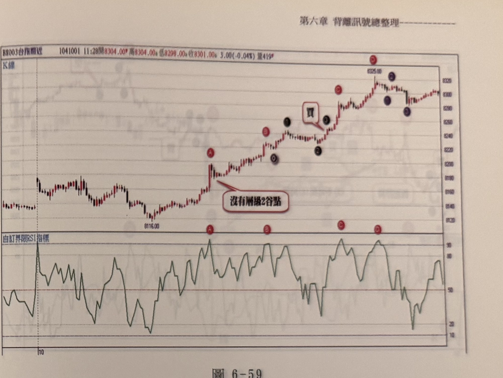
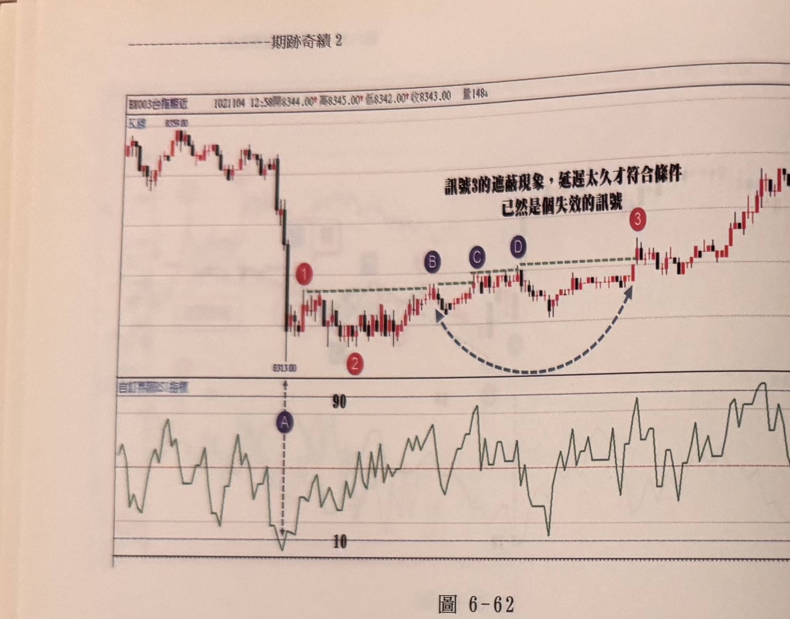
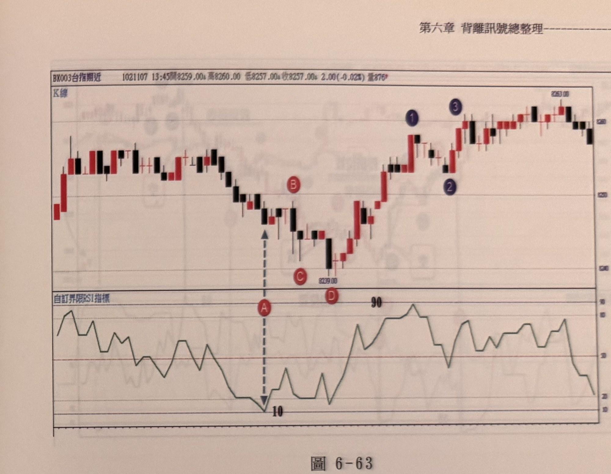

# RSI 鈍化 N 型 / 倒 N 型訊號

> 一句話摘要：當 RSI(5) 進入嚴重超買（90 以上）或超賣（10 以下）而長時間停留（鈍化），此時不必等待第二個背離端點，而是改用價格的層級 2 正 N 型（三段式上漲）或倒 N 型（三段式下跌）123 步驟作為進出場依據。

## 1. 核心概念

當價格趨勢強勁、不斷創高或創低時，RSI 等 0～100 震盪型指標會反覆停留在極端區（超買 90 以上或超賣 10 以下），這種現象稱為**鈍化**；鈍化階段背離變得像常態而非難得一見，代表傳統背離訊號的反轉證據力轉弱（延伸自 p.203 的鈍化定義）。因此，在 RSI 觸及 90（或 10）之後，與其苦等第二個背離端點，作者改用行情本身的**正 N 型／倒 N 型**（層級 2 峰谷轉折構成的三段式價格結構）來確認反轉或續勢，只要 K 線收盤突破（跌破）N 型的關鍵峰（谷）點，即完成訊號（p.234–237）。

本方法與「RSI 背離訊號」（q2-06-03）同樣以 RSI 極端區為觸發條件，但**不要求**第二端點也落在極端區、也不要求兩端點之間夾層級 2 點做背離比較，而是直接用價格的 N 型／倒 N 型 123 步驟確認進出場，兩者是書中明確區分的**不同訊號類型**（p.245：「RSI 的 N 型或倒 N 型訊號，與 RSI 背離訊號…」即為原文對兩者並列的直接證據）。

## 2. 適用前提

- 使用「自訂界限 RSI 指標」，書中範例採 **RSI(5)**，於 1 分鐘 K 線圖上。
- 觸發前提：RSI(5) 必須先觸及**嚴重超買 90 以上**或**嚴重超賣 10 以下**（p.234、236）。
- 觸及極端區之後，價格必須先從極端點拉回（反彈）形成一個**層級 2 轉折點**，才能開始計算 N 型（倒 N 型）的 123 步驟；若拉回未能形成層級 2 轉折點，不可隨意將後續推升／下跌視為三波 N 型（p.237，圖 6-59）。
- 所有 N 型或倒 N 型的峰谷轉折點，皆須為**層級 2**的峰谷轉折點（p.235）。

## 3. 訊號定義

### 3.1 鈍化放空訊號（倒 N 型，RSI 觸及 90 以上）

1. C1：RSI(5) 觸及**嚴重超買 90 以上**時的價格峰位為觀察起點（p.234）。
2. C2：價格自峰位拉回，形成層級 2 谷點（倒 N 型的第 1 步／標號 1）。
3. C3：價格反彈但未能過前峰高點，再度拉回並跌破第 1 步谷點，構成倒 N 型的第 2、3 步（三段式下跌）。
4. C4：K 線**收盤跌破**倒 N 型谷點（1）時，於完成點（3）形成**放空訊號**（p.234，圖 6-56）。
5. 過濾條件（見第 7 節）：RSI 觸及 90 後，若在拉回形成谷點**之前**，RSI 峰位發生過向上位移，僅限**一次**，且須在**5 根 K 線內**完成位移，否則不得視為有效峰位（p.241）。

### 3.2 鈍化買進訊號（正 N 型，RSI 觸及 10 以下）

1. C1'：RSI(5) 觸及**嚴重超賣 10 以下**時的價格谷位為觀察起點（p.234）。
2. C2'：價格自谷位反彈，形成層級 2 峰點（正 N 型的第 1 步／標號 1）。
3. C3'：價格拉回但不破前一谷點的更低位置（拉回谷點須高於原谷底），再度上攻，構成正 N 型的第 2、3 步（三段式上漲）。
4. C4'：K 線**收盤突破**正 N 型峰點（1）時，於完成點（3）形成**買進訊號**（p.234，圖 6-56）。
5. 若 RSI 觸及 10 以下後**隨即**先出現反彈峰點，則自該峰點之後**只能**往下數倒 N 型的放空步驟，**不能**再往上數正 N 型買進步驟（p.241，圖 6-63：須先形成谷點才能數正 N 型，若先出現峰點，則只能沿峰點向下找倒 N 型）。

### 3.3 續勢與反轉的判斷順序（RSI 觸及極端區後）

- 若自極端峰（谷）點直接走出倒 N 型（正 N 型）且完成 123 步驟，即為放空（買進）訊號。
- 若拉回未破前一層級 2 點、且重新推升的峰點與原極端點同高或更高（更低），則放棄倒 N 型（正 N 型）放空（買進）的可能性，改觀察正 N 型（倒 N 型）續勢／反向訊號（p.235，圖 6-57：「從拉回的 C 向上走 N 型」／「從 B 向下走倒 N 型」示範同一波段中先後出現兩種可能路徑的判斷邏輯）。

## 4. 進場

- 放空：K 線收盤跌破倒 N 型谷點（第 1 步標號）時進場（p.234）。
- 買進：K 線收盤突破正 N 型峰點（第 1 步標號）時進場（p.234）。
- **延遲失效**：若 N 型（倒 N 型）123 步驟因濾網一再上移（下移）而延遲過久才完成（例如拖延超過 1 小時），即使最終條件符合，也必須**忽略**該訊號，不進場（p.240，圖 6-62）。
- **訊號衝突處理**：若 RSI 觸及極端區後，可能同時醞釀「倒 N 型（正 N 型）空（買）訊」「鈍化續勢正 N 型（倒 N 型）買（空）訊」或「RSI 背離訊號」三種走勢之一，**只取第一個實際出現的訊號**進場；之後即使出現反向訊號，也一律忽略，不因後見的反向訊號而轉向（p.245–246，圖 6-67／6-68）。
  - 例外：若原有部位尚未觸及停損，但又出現**同樣屬於 N 型/倒 N 型（而非背離）**的反向訊號，且該反向訊號是 RSI 再度觸及對側極端區（例如原空單持有中，RSI 又觸及 10 以下並走出正 N 型買訊），則不論原部位是否已觸及停損，**立即平倉並反手**建立新方向部位（p.242–243，圖 6-64／6-65；此例外與上一條「只取第一訊號」的差異在於：上一條是指「N 型/倒N型訊號」與「RSI背離訊號」之間互斥擇一，本條則是指RSI二度觸及極端區、再度走出同類型N型訊號時的換手規則，兩者判斷情境不同，已依原文脈絡分列說明）。

## 5. 停損

- 停損位置（p.234，圖 6-56 說明）：「可以取最高點 A 為停損位置，或照均線買賣策略的停損設置，亦可比較兩者取較高者，但仍宜控制停損點數在 20 點以內」——即倒 N 型空單以觸發峰位 A（結構起點）為停損，或採第一章均線訊號的個位數停損公式，或取兩者較遠者；點數控制在 20 點以內。多方鏡像。
- 圖 6-64、6-65 另以灰色虛線標示「停損位置」於 N 型（倒 N 型）結構的關鍵轉折點。
- 開盤跳空情境下的停損／不進場判斷：
  - 若跳空幅度**小於 30 點**，或屬開盤 15 分鐘內 RSI 即觸及 10／90 的情況，可一概忽略、不視為有效鈍化訊號起點（p.243）。
  - 若跳空幅度**大於 30 點以上**，才值得依此觸發買賣訊號（p.243，圖 6-65：跳空約 50 點後續漲逾 65 點，RSI 持續 90 以上游移，方視為有效起點）。
  - 若開盤跳空點數在 **10 點以內**（無縫接軌），RSI 觸及 90 超買區後走出倒 N 型空訊，通常**忽略**；但若走出向上 N 型鈍化買訊，因跳高開盤偏多，可**採行**操作多單（p.244，圖 6-66）。鏡像地，向下跳空小於 10 點、RSI 觸及 10 以下時，向上 N 型買訊忽略，向下倒 N 型鈍化空訊可採行（p.244）。

## 6. 出場 / 停利

書中未明確說明固定停利規則；本節提供的是「反手換手」規則（見第 4 節訊號衝突處理），即遇到 RSI 再度觸及對側極端區並走出同類型 N 型訊號時，不論原部位停損與否，立即平倉反手（p.242–243）。

## 7. 過濾：不做的情況

0. 自超買區（超賣區）發動的訊號，其 RSI 在觀察期間不能已經穿過對側的嚴重超賣區（超買區）；若已穿過，須改由對側極端點重新觀察買訊或自反彈峰（回檔谷）起算的倒 N 型（正 N 型）（p.236，圖 6-58）。
1. 拉回未形成層級 2 轉折谷（峰）點前，不得將後續推升（下跌）視為三波 N 型（倒 N 型）（p.237，圖 6-59：C 峰值再度觸及 90 但若未先產生倒 N 型空訊、其拉回又未產生層級 2 谷點，則只能繼續觀察，不可強行認列 N 型買點）。
2. N 型（倒 N 型）123 步驟若因濾網反覆上移（下移）而延遲過久（例如超過 1 小時、經多次峰谷位移）才完成，即使最終符合條件，也應忽略不操作（p.240，圖 6-62）。
3. RSI 觸及極端區後，若峰（谷）位已先發生位移，僅允許**一次**位移，且須在 **5 根 K 線內**完成；超過此限制的位移不得採認為有效峰（谷）點（p.241）。
4. 若 RSI 觸及超賣 10 以下後，行情**先**出現反彈峰點，之後只能沿峰點向下找倒 N 型空訊，不可再回頭數向上正 N 型買訊（反之於超買情境亦然）（p.241，圖 6-63）。
5. 開盤跳空幅度不足 30 點、或開盤 15 分鐘內 RSI 即觸及 10／90，一概忽略、不作為鈍化訊號的有效起點（p.243）。
6. 同一波段中，若「RSI 的 N 型／倒 N 型訊號」已先於「RSI 背離訊號」出現（或反之），僅取第一個出現者，忽略稍後出現的反向訊號（p.245–246）。
7. 臨近當天收盤才浮現的倒 N 型（正 N 型）訊號，宜採取忽略（p.237，圖 6-59：D 位置雖有倒 N 型空訊，但臨近收盤，忽略）。

## 8. 範例解析


- **圖 6-56**（p.234）：A 為 RSI 進入 90 以上的最高點，價格走出倒 N 型，跌破谷點於（3）形成放空訊號；隨後行情下探至 B，RSI 進入 10 以下，價格走出正 N 型三段式上漲，突破峰點形成買進訊號；並示範「原層級 2 谷點位移」的例外（D 非層級 2 轉折谷點，訊號位置由 C 移至 E）。


- **圖 6-57**（p.235）：行情緩升至 A，RSI 進入 90 以上，拉回至 C 形成谷點後重新拉升，若新峰點與 A 同高，放棄倒 N 型放空的可能性，改朝正 N 型買訊發展，拉回谷點需高於 C，突破峰點於標號 3 形成鈍化買訊；隨後價格漲至 B，RSI 再度達 90 以上，出現逆襲線反轉組合可平倉出場，並自 B 走出倒 N 型，跌破谷點形成放空訊號。


- **圖 6-58**（p.236）：A 為 RSI 穿越 90 的峰位，看似自 D 位置形成倒 N 型空訊，但需留意 B 位置 RSI 已跌破嚴重超賣 10，且 A 到 D 距離已超過 40 點，故 D 不宜作為放空訊號；應改自 B 反彈至 C 峰位後，觀察「拉回不破 B 的正 N 型買點」或「破 B 的倒 N 型空訊」，本例最終走出自 C 峰位向下的三段式倒 N 型空訊。


- **圖 6-59**（p.237）：A 位置創新高、RSI 達 90，但拉回未產生層級 2 谷點，不能認列 N 型；至 B 位置 RSI 再次穿越 90，拉回形成谷點（0），向上三波在標號 3 位置形成鈍化買點；C 位置雖再現 RSI 90 以上，若非走出倒 N 型空訊，鈍化買點忽略；D 位置雖有倒 N 型空訊，但臨近收盤，採取忽略。


- **圖 6-62**（p.240）：A 處 RSI 跌破 10 以下，立刻出現反彈峰位（1）、拉回谷點（2），理論上突破峰（1）即符合 N 型 123 買訊，但濾網因 B、C、D 三次上移而延遲逾 1 小時才出現無遮蔽的（3）買訊，依規則忽略此訊號。


- **圖 6-63**（p.241）：A 處 RSI 觸及 10 以下，先出現反彈峰位 B，之後只能沿 B 向下找倒 N 型，不可再回頭數向上正 N 型買訊；示範「先峰後谷」情境下的方向限制。


- **圖 6-64**（p.242）：A 處 RSI 觸及 10 以下、走倒 N 型空訊進場放空；不久 D 處 RSI 再度觸及 10 以下、並以 C 為谷點走出正 N 型買訊，此時即使空單未觸及停損，也須立即平倉並轉為做多。


- **圖 6-65**（p.243）：開盤跳空約 50 點，續漲逾 65 點，RSI 持續 90 以上，A 峰位走出倒 N 型空訊進場；其後 RSI 觸及 10 以下，自 B 谷點走出正 N 型買訊 123 皆符合，不論空單是否觸及停損，立即平倉轉多單。


- **圖 6-66**（p.244）：開盤跳高小於 10 點，RSI 卻進入 90 以上，此時出現的倒 N 型空訊因跳空太小而忽略；但因跳高開盤偏多，若出現向上 N 型鈍化買訊，則可採行操作多單。


- **圖 6-67、6-68**（p.245–246）：A 位置 RSI 觸及 90 以上，可能發展倒 N 型空訊、鈍化買訊或背離走勢三者之一，任一先出現即進場，之後出現的反向訊號一律忽略；本例中 A 拉回至谷點後向上突破 A 峰點形成 N 型鈍化買點先成立，稍後 A、B 峰點在 RSI 上構成背離向下、於 D 位置 RSI 跌破 50 又產生放空訊號，但因與先前買訊衝突，依規則忽略此空訊。


- **圖 6-69、6-70**（p.246–247）：讀者練習圖，分別示範 RSI 觸及 10 以下後價格走出正 N 型買訊的完整案例。


- **圖 6-71**（p.248）：RSI 觸及嚴重超賣區後反彈，價格於標號 1、2、3 完成 N 型買點。


- **圖 6-72**（p.248）：A 處 RSI 超過 90 後，價格連續兩次向下跌破構成倒 N 型，分別於標號 1、2、3 兩組結構中形成兩次放空訊號。


- **圖 6-73**（p.249）：E 起漲點經標號 1、2、3 完成正 N 型買訊，其後 A、B 兩峰位在 RSI 上呈現背離向下，C 為低點，D 為 RSI 跌破 50 處，示範同一走勢中先後出現正 N 型買訊與 RSI 背離向下訊號的銜接。

## 9. 作者提醒與常見錯誤

- 拉回沒有形成層級 2 谷（峰）點前，不可強行把後續推升（下跌）當作三波 N 型，這是最容易誤判之處（p.237、239）。
- 訊號若因濾網反覆上移（下移）而拖延過久才成立，代表時效性已喪失，務必忽略，不論該訊號在技術定義上是否「最終符合條件」（p.240）。
- RSI 觸及超買（賣）後，若先出現反向的層級 2 轉折點（峰或谷），方向已被鎖定，不可回頭尋找另一方向的 N 型（p.241）。
- 開盤跳空幅度是否足夠（30 點門檻），以及跳空方向與訊號方向是否一致（跳高偏多、跳低偏空），都應納入是否採行訊號的判斷（p.243–244）。
- 當「N 型/倒N型訊號」與「RSI 背離訊號」在同一波段內先後出現時，只認第一個出現的訊號，避免因訊號反覆而頻繁進出（p.245–246）。
- 唯一允許「無視原部位停損、立即反手」的情況，是 RSI 再度觸及對側極端區、且走出同類型 N 型（倒 N 型）訊號時（p.242–243），與前一條「只取第一訊號忽略反向」的規則須加以區分。

## 10. 規則速查（Checklist）

放空（倒 N 型鈍化訊號）：
- [ ] RSI(5) 觸及嚴重超買 90 以上
- [ ] 價格自峰位拉回，形成層級 2 谷點（且未受位移限制超標）
- [ ] 價格再度下跌，跌破該谷點（倒 N 型 123 步驟完成）
- [ ] 訊號未因濾網延遲過久（未超過約 1 小時／多次位移）
- [ ] 未臨近當日收盤
- [ ] 開盤跳空情境符合對應規則（跳空 <10 點：忽略；≥30 點：可採行）

買進（正 N 型鈍化訊號，鏡像）：
- [ ] RSI(5) 觸及嚴重超賣 10 以下
- [ ] 價格自谷位反彈，形成層級 2 峰點（且未受位移限制超標）
- [ ] 未先出現反彈峰點鎖定倒 N 型方向
- [ ] 價格再度上漲，突破該峰點（正 N 型 123 步驟完成）
- [ ] 訊號未因濾網延遲過久
- [ ] 開盤跳空情境符合對應規則

- [ ] 若原部位尚未停損，RSI 再度觸及對側極端區並走出同類型 N 型訊號 → 立即平倉反手
- [ ] 若「N 型/倒N型訊號」與「RSI 背離訊號」同時醞釀 → 僅認第一個出現者，忽略之後的反向訊號

## 11. 機器可讀規則

```yaml
signal: RSI鈍化N型倒N型
side: both
timeframe: 1m
indicator: RSI(5)（自訂界限RSI指標）
conditions:
  - id: C1
    desc: RSI(5)觸及嚴重超買90以上（超賣10以下）
    source: p.234, p.236
  - id: C2
    desc: 價格自極端點拉回（反彈），形成層級2轉折谷（峰）點
    source: p.234, p.237
  - id: C3
    desc: 若拉回前已先出現反向層級2轉折點，方向鎖定，不可回頭找另一方向N型
    source: p.241
  - id: C4
    desc: 峰（谷）位移限制：僅允許一次，且須於5根K線內完成
    source: p.241
  - id: C5
    desc: K線收盤跌破（突破）N型/倒N型第1步峰（谷）點，完成123步驟
    source: p.234
entry:
  trigger_short: 收盤跌破倒N型谷點（完成點3）
  trigger_long: 收盤突破正N型峰點（完成點3）
  source: p.234
gap_rule:
  - desc: 跳空<30點或開盤15分鐘內RSI即觸及10/90，忽略不作為有效起點
    source: p.243
  - desc: 跳空>=30點，可視為有效起點並據此判斷買賣訊號
    source: p.243
  - desc: 跳空<10點（無縫接軌）時，與跳空方向一致的N型鈍化訊號可採行，逆跳空方向的N型倒N型訊號則忽略
    source: p.244
stop_loss:
  ref: 觸發峰谷位 A（結構起點）、或第一章均線訊號個位數停損公式、或取兩者較遠者；控制在 20 點以內
  source: p.234（另見 p.242-243 圖例之停損水平線）
reversal_rule:
  desc: 若原部位尚未觸及停損，RSI再度觸及對側極端區並走出同類型N型/倒N型訊號，立即平倉反手，不受原停損限制
  source: p.242-243
conflict_rule:
  desc: N型/倒N型訊號與RSI背離訊號同一波段內先後出現時，只取第一個實際出現者，之後的反向訊號一律忽略
  source: p.245-246
exit: 書中未明確說明固定停利規則（另見reversal_rule的換手規則）
filters:
  - desc: 觀察期間 RSI 已穿過對側嚴重超買/超賣區，訊號不成立
    source: p.236
  - desc: 拉回未形成層級2轉折點前，不得認列N型/倒N型
    source: p.237, p.239
  - desc: 訊號因濾網反覆位移延遲過久（如逾1小時）才完成，忽略
    source: p.240
  - desc: 峰谷位移超過一次或超過5根K線完成，不得採認
    source: p.241
  - desc: 臨近當日收盤才成立的訊號，忽略
    source: p.237
```

## 12. 待確認事項

無。缺頁僅影響範例圖，見 frontmatter `missing_pages`。

## 13. 原文出處

- `extracted/pages/IMG_8566.md`（p.234–235）
- `extracted/pages/IMG_8567.md`（p.236–237）
- `extracted/pages/IMG_8569.md`（p.240–241）
- `extracted/pages/IMG_8570.md`（p.242–243）
- `extracted/pages/IMG_8571.md`（p.244–245）
- `extracted/pages/IMG_8572.md`（p.246–247）
- `extracted/pages/IMG_8573.md`（p.248–249）
