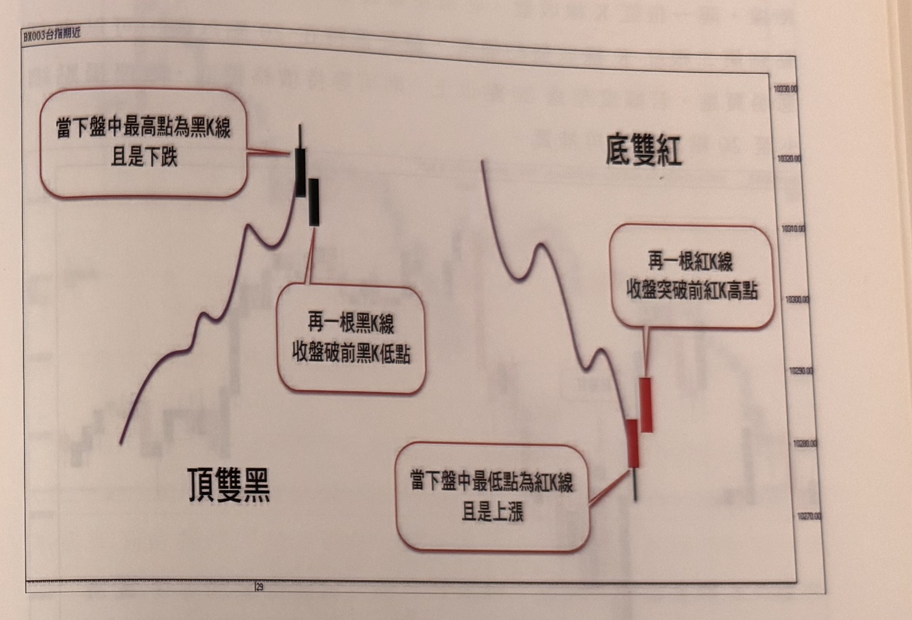
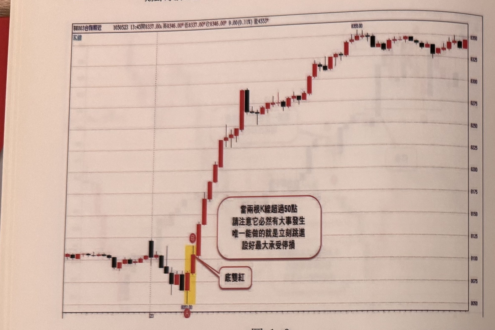
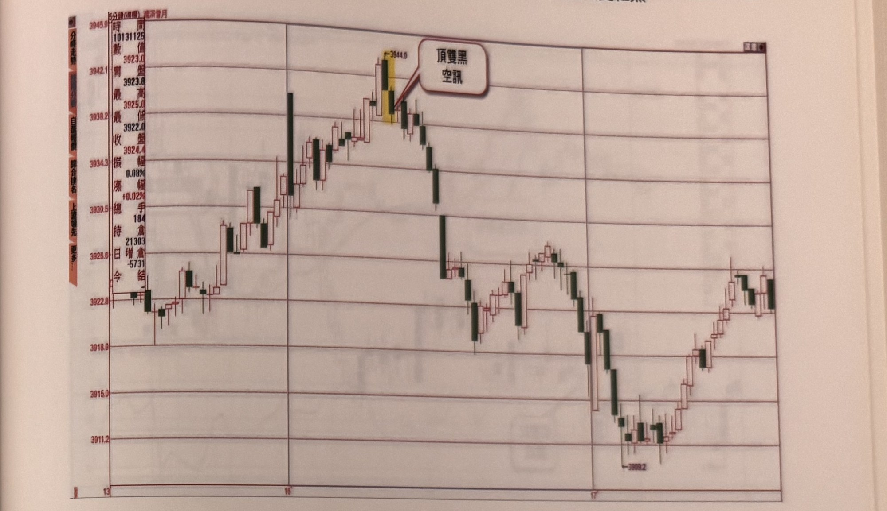

# 頂雙黑（放空）／ 底雙紅（買進）

> 一句話摘要：當下盤中最高（低）點是一根獨一無二的下跌黑K（上漲紅K），緊接著下一根黑K（紅K）收盤跌破（突破）前一根K線的低（高）點，即構成「頂雙黑」放空訊號／「底雙紅」買進訊號，停損原則上設20點，並可用折返點數、SAR、均線或階梯法四者擇一做移動停利。

## 1. 核心概念

日線結構中有兩組經典的頂底反轉K線組合：頂部的「雙鴉躍空」（兩根跳空小黑星）、「覆蓋線」／「吞噬線」，以及底部的「插入線」。這些組合都有一個共通外觀——頂部反轉以黑K線為最高K線，底部反轉以紅K線為最低K線；但它們也都有一個共同前提：**黑K線必須跳空開盤**，而分時K線圖（如5分鐘、1分鐘K線）幾乎不會出現真正的跳空缺口，因此傳統的日線反轉K線組合很難在分時圖上出現（p.14）。

作者觀察到，把「跳空」的前提拿掉，改用「當下盤中最高／最低點」的極端位置概念取代，就能在分時圖上找到功能相近的頂底反轉訊號，稱為「頂雙黑」與「底雙紅」（p.14–15）。日線頂部反轉組合另有「雙鴉躍空」（中長紅K後連兩根黑K自頂端下壓）與「覆蓋線」（黑K收盤跌破前一根紅K實體中線），如圖1-1示意（p.13）。

## 2. 適用前提

- 訊號必須發生在**盤中極端位置**：頂雙黑的第一根黑K必須是「當下盤中最高點」，底雙紅的第一根紅K必須是「當下盤中最低點」（p.15，圖1-2）。
- 適用商品：主要示範為台指期分時圖，但書中也示範可延伸到小道瓊、小DAX、日經225（大阪迷你）、滬深300指期、A50指數期貨等海外期貨商品，只要依商品跳動點值調整停損點數即可（p.26–27、32、58）。
- 極端位置認定（早盤／盤中）：盤中高低震幅需 **≥30點**；若震幅不足30點，則改看極端高低點距離**前一日收盤（平盤）**是否 **≥40點**，兩者符合其一即可認定為極端位置（p.36–37，圖1-22、1-23）。
- 若訊號發生時間已超過**中午12點半**，後續表現的空間與時間可能縮小，此時可以考慮忽略訊號（p.37，圖1-24，推論性質的操作建議）。
- 在5分鐘K線等較長週期上，頂雙黑／底雙紅組合的漲跌點數合計宜**超過10點以上**，點數過小表態性不足，可靠度較差（p.40，圖1-31）。

## 3. 訊號定義

### 3.1 頂雙黑（空方）

1. C1：當下盤中最高點，為一根**下跌的黑K線**（p.15）。
2. C2：緊接著出現第二根**黑K線**，其收盤價跌破前一根黑K線的最低點（p.15，圖1-2）。
3. C3：C1 的最高點必須是當下盤中**獨一無二**的最高點——若後續（或前面）另有一根K線與其同高，形成「共頂」，則不構成頂雙黑訊號（p.17，圖1-4，鏡像原則；原文以底部「共底紅K線」為例說明）。
4. 兩根黑K線構成「頂雙黑」訊號，訊號成立後行情通常反轉下跌（p.15）。

### 3.2 底雙紅（多方，鏡像規則）

1. C1'：當下盤中最低點，為一根**上漲的紅K線**（p.15）。
2. C2'：緊接著出現第二根**紅K線**，其收盤價突破前一根紅K線的最高點（p.15，圖1-2）。
3. C3'：C1' 的最低點必須是當下盤中**獨一無二**的最低點——若另有一根K線與其同低，形成「共底紅K線」，則低點非獨一無二，**不構成底雙紅訊號**（p.17，圖1-4：C、D 兩點同低，D 的K線低點非當下盤中獨一無二的低點，屬「共底紅K線」而非「底雙紅」，不能視為買進訊號；「線形中發生同高雙頂或同低雙底的機率很高，必須加以剔除」）。
4. 兩根紅K線構成「底雙紅」訊號，訊號成立後行情通常反轉上漲（p.15）。

## 4. 進場

- **立刻進場**：訊號K線（第二根黑K／紅K）收盤時，若進場點與第一根極端K線（黑K高點／紅K低點）的距離在**20點以內**，可立刻進場（p.15、18）。
- **補進場（拉回等待）**：若進場距離超過20點但不算離譜（例如20～30點附近），可等待行情拉回，使停損縮小至20點以內時再補進場；也可以選擇直接進場，但停損固定20點（p.18–20）。
  - 補進場等待時效**最好在10根K線內**完成，若超過10根K線價格才拉回到合理進場區，視為訊號**時效已過期**，不再補進場（p.20，圖1-7）。
- **幅度過大但仍屬合理範圍**（如30點以上）：可等拉回至合理停損區間補進場（p.19，圖1-6左例）。
- **幅度過大且不合理者，不進場也不補進場**：若訊號K收盤與極端點距離過大，導致訊號K收盤反而變成當下行情的新最高／最低點（也就是短短兩根K線就讓行情從極端高點衝到新的極端低點，或反之），此種變化不合理，須**剔除該訊號、不予補進場**（p.18，圖1-5；p.19，圖1-6右例：DE幅度58點且E變成當下盤中最低點，忽略不操作）。
- **特殊放大行情**：當整體行情當天大幅波動（如重大事件、政策消息），每根K線高低幅度本身就經常超過20點，此時不必固守20點的幅度限制，可直接在訊號K收盤時進場，停損仍設20點（p.22，圖1-9：2016年政黨二次輪替首日，AB幅度超過50點，仍直接進場）。
- **海外期貨**：訊號判斷方式相同，僅停損點數依商品跳動值調整（見第5節）（p.23、26–27）。

## 5. 停損

- **停損設在極端點，風險上限 20 點**：頂雙黑以第一根黑K線的最高點為停損、底雙紅以第一根紅K線的最低點為停損（p.21「向下跌破 A 低點，造成停損」；p.23「停損設在 3944 點（盤中最高點）…穿越 1 個跳動單位，即要停損」；圖1-6 停損線畫在 A 低點）。「20 點」是進場價到極端點的最大距離：距離 ≤20 點才立刻進場，超過則等拉回讓「停損縮小至 20 點以內」再補進場（p.18、p.39 圖1-28）。若距離超過 20 點而選擇直接進場，停損改設在進場價外 20 點（p.18「立刻進場，但停損維持 20 點」；p.22）。
  - 註：舊版文件寫「以極端點為基準，其上方／下方 20 點」，與原文不符（會使風險達 40 點），已更正。
- **最大承受範圍上限（可依商品調整）**：若K線收盤距離「以極端點為基準的20點停損位置」已超過個人／商品可承受的最大範圍，可改以固定的最大可承受點數（或金額）作為停損位置，而非放大等比例停損（p.23，滬深300指期例：假設最大承受6大點=300×6=1800人民幣，則以6大點為停損）。
- **海外期貨停損點數換算（書中示範）**：
  - 小DAX（法蘭克福指數期貨）：20～25點（約3500～5000台幣）（p.26）。
  - 小道瓊：20～30點（每點5美元，約150台幣，折合約3000～4500台幣）（p.27）。
  - A50指數期貨：可自訂100點停損（p.32，圖1-18）。
  - 日經225（大阪迷你）：可用約100點停損（第2章圖2-9亦有類似示範，可交叉參照）。
  - 滬深300指期：最大承受約6大點，可換算固定金額為上限（p.23）；另有實例進場位置離雙紅低點不到6大點、以最低點為停損（p.24，圖1-11）。
  - 香港小型國企指數期貨（小H）：1點＝10港幣（約合39元台幣），停損可達約39點（例：雙紅低點與進場收盤相差39點，仍直接進場，未套用20點上限）（p.25，圖1-12）。
- **同向訊號被停損後的處理**：若某方向的極端訊號已經進場並遭停損，代表該方向的趨勢力量可能較強，**之後若再出現同一方向的同型態訊號，應忽略不操作**（p.21，圖1-8：AB底雙紅被停損後，CD再出現底雙紅時忽略，行情果然持續破底）。
- 書中未明確說明停損觸發後是否反手（本章未提及反手規則；反手規則見第二章 V字轉折）。

## 6. 出場 / 停利

書中提出四種移動停利／停利機制，由操作者自選其中一種使用（書中未規定選用時機，各方式擇一即可，非強制併用；p.28：「並沒有任何一種停利機制是無敵的，都有個別的優缺點，端視使用者了解，選取適合自身操作個性的停利機制」）。四種皆以「預設初始獲利點數（15點或20點）到達後，再啟用移動停利」為共通前提（p.28）：折返點數停利方式、SAR系統、均線突破跌破（此三種為p.28條列的基本款），以及另外可選的階梯出場方式（p.35：「停利機制也可以採取階梯出場方式」）。

### 6.1 折返點數停利方式

1. 進場後先設好20點停損位置（p.28）。
2. 預設一個獲利目標點數（書中示範以20點為例，亦可用15點）（p.28）。
3. 當K線觸及此預設獲利目標時，若該K線同時符合**「自進場後最高（低）K線的最高（低）點」與「自進場後最高（低）K線的收盤」雙條件**（多單：創新高的紅K線且收盤也最高；空單：創新低的黑K線且收盤也最低），則從其極端點**扣（多單）／加（空單）20點**，設為新的停利位置（p.28、29，圖1-15；p.30，圖1-16）。
4. 之後每根K線再次符合上述雙條件時，即以該根K線的極端點重新扣／加20點，移動停利位置；只符合其中一項條件（例如收盤創新低但K線最低點不是最低，被之前某根K線的低點擋住）則**不移動**停利位置（p.30，圖1-16：G位置收盤比C低但最低點不是最低，故不移動）。
5. 若K線未創新高（低），停利位置維持不動，直到價格觸及停利位置即平倉出場，或已到市場收盤前最後一根K線，強制平倉出場（p.28）。

### 6.2 SAR移動停利

1. 進場後先預設一個獲利目標點數（書中示範以20點、100點為例，可自訂）（p.31，圖1-17；p.32，圖1-18）。
2. 當行情跌破（多單反之，突破）預設獲利目標後，開始啟用SAR指標做移動停利觀察。書中說明：一開始就用SAR易因行情橫向整理、影線上下穿越SAR而難以判斷，故待行情確立方向、到達獲利目標後才啟用SAR較可靠（p.31）。
3. 若後續K線僅**影線**觸及／穿越SAR、但**收盤未穿越**，不平倉；改以該根K線的SAR點位畫一條**水平延伸線**，取代原SAR位置作為停利參考，直到出現新的**同向**SAR時，才重新接回SAR追蹤線（p.31、32）。
4. 當K線**收盤**觸及或突破SAR（或其水平延伸線）時，正式平倉出場（p.31、32）。

### 6.3 均線移動停利（以MA10為主）

1. 進場後，當價格到達預設獲利點數目標（書中示範20點）時，從**隔根K線**開始啟用均線（預設MA10）作為停利觀察線（p.33，圖1-19）。
2. 出場方式二選一：（a）K線**收盤**跌破（多單）／突破（空單）MA10時停利平倉；（b）K線**影線**跌破／突破MA10達**5點**時即刻出場（p.33）。
3. **行情加速時的調整**：若個股／商品出現急拉急殺、行進角度變陡，繼續使用MA10可能距離現價過遠，此時可改用較短天期均線（MA5或MA4）作為停利參考；甚至當單根K線**漲跌幅超過30點以上**、且隔根K線不再創新高或創新低時，可以直接改為**立即停利**（p.33–34，圖1-20：出現51點的巨大長黑K線後，可即刻於當根平倉、或隔根不創新低即撤、或改用MA4取代MA10）。

### 6.4 階梯出場（Trailing Stop）

1. 進場後先設20點停損。
2. 當行情往有利方向推進，到達預設獲利目標（書中示範15～30點）後，啟動階梯停利機制（p.35，圖1-21）。
3. 之後每當出現一根**創新高（多單）／創新低（空單）**的K線（以進場後為基準，非盤中最高或最低），就比較「該根K線」與「其前一根K線」兩者的**最低點（多單）／最高點（空單）**，取**較有利（較高／較低）者**作為新的移動停利位置。
4. 不斷重複第3步，讓停利位置隨創新高（低）的K線持續墊高（降低），直到某根K線**收盤**觸及（跌破／突破）該停利位置時，正式平倉，完成階梯停利（p.35）。

> 註：階梯出場（6.4）與折返點數停利（6.1）外觀相似但計算方式不同——6.1 是「以達標K線的極端點固定扣／加20點」，6.4 是「比較當前創新高（低）K線與前一根K線的極端點，取較有利者」，兩者分屬書中不同段落（p.28–30 與 p.35），應視為兩種獨立方法，不可混用。本章未提供固定點數停利或明確的停利目標判斷條件；四種方式皆為「先設初始獲利目標，達標後再切換為移動停利」的機制，若行情未能達到初始目標，書中未明確說明是否有其他停利方式（僅有第5節的20點停損）。

## 7. 過濾：不做的情況

1. 若訊號K的距離（極端點到訊號觸發K收盤）過大，且導致訊號K收盤變成當下行情**新的**最高／最低點，屬於不合理變化，**剔除該訊號、不進場也不補進場**（p.18，圖1-5；p.19，圖1-6右例）。
2. 幅度超過20點但未達不合理程度時，可等拉回補進場，但**拉回等待最多10根K線**，超過10根K線未拉回到合理停損區即視為**時效過期**，不再視為操作訊號（p.20，圖1-7）。
3. 若某方向的極端訊號已進場並遭到停損，**之後同方向再出現同型態訊號，宜忽略不操作**（p.21，圖1-8）。
4. 開盤跳空情境下，極端位置的認定門檻：跳空開盤時，最高／最低K線距昨日收盤需**超過40點**才算極端位置；若跳空幅度小（如小於10點），仍可沿用昨收盤位置判斷，但當日**盤中震幅需達30點以上**才稱為極端位置（p.36，圖1-22、1-23）。
5. 訊號發生位置若**離開盤時間已超過中午12點半**，表現空間與時間可能縮小，此時可以考慮忽略訊號（p.37，圖1-24）。
6. 在5分鐘等較長週期K線中，頂雙黑／底雙紅**合計漲跌點數需超過10點以上**，點數過小表態性不足，可靠度較差，不宜貿然操作（p.40，圖1-31）。
7. **對立訊號不可侵入前一訊號K線收盤**（第二章 p.56，以「底雙紅之後的頂雙黑」為例）：持有底雙紅多單時出現頂雙黑，若頂雙黑訊號K的收盤低於（或等於）底雙紅訊號K的收盤，視為侵入，忽略該空訊；未侵入者為有效訊號，應平倉反手（圖2-7：D 收盤低於 B 收盤 → 忽略 D；F 收盤未與 B 重疊 → 成立）。空方鏡像。
8. **極端點須為當下盤中獨一無二的最高／最低點**：若第一根K線的極端點與另一根K線同高（共頂）或同低（共底），不構成頂雙黑／底雙紅訊號（p.17，圖1-4：C、D 同低，屬「共底紅K線」，D 的低點非獨一無二，不能視為底雙紅買進訊號；「同高雙頂或同低雙底的機率很高，必須加以剔除」）。

## 8. 範例解析

- **圖1-1**（p.13）：手繪示意圖，說明日線頂部反轉K線組合「雙鴉躍空」（紅K後連兩根黑K自頂端下壓）與「覆蓋線」（黑K收盤跌破前一根紅K實體中線），作為引出頂雙黑／底雙紅概念的鋪陳。

  

- **圖1-2**（p.15）：定義示意圖。左半「頂雙黑」：當下盤中最高點為下跌黑K，緊接第二根黑K收盤破前黑K低點，構成空訊；右半「底雙紅」：當下盤中最低點為上漲紅K，緊接第二根紅K收盤突破前紅K高點，構成買訊。

  

- **圖1-3**（p.16）：A為盤中最低K線（黑K），隔一根紅K線B收盤突破A高點，幅度超過20點，操作上可等價格稍作拉回再補進場買進，也容許直接買進但停損仍控制在20點。

  

- **圖1-4**（p.17）：A為盤中最高點（黑K），距昨日收盤跳空達40點符合極端位置門檻，隔根B收盤跌破A低點，AB幅度小於20點可立刻進場放空；隨後C、D兩點同低，D的K線低點非當下盤中獨一無二的低點，屬「共底紅K線」而非「底雙紅」，不能視為買進訊號。

  

- **圖1-5**（p.18）：C為當下最高點（紅K），D為頂雙黑第二根黑K，但CD幅度超過20點，且D變成當下行情最低點，判定不合理，**忽略該頂雙黑訊號**；隨後A、B構成底雙紅，幅度23點，可於隔根小拉回或立刻進場，停損維持20點。

  

- **圖1-6**（p.19）：左例AB底雙紅幅度超過30點，須等拉回至C的虛線區間、停損縮小至20點以內再補進場；右例DE頂雙黑幅度達58點，且E變成當下盤中最低點，判定不合理予以忽略，隨後FG出現底雙紅買訊，行情迅速上攻。

  

- **圖1-7**（p.20）：AB底雙紅幅度達30點，須等拉回至C的虛線區間、停損縮小至20點以內才能補進場，但因拖延超過10根K線已**失效**不能補買；隨後DE再次形成底雙紅買訊，可正常操作。

  

- **圖1-8**（p.21）：AB底雙紅買訊進場後遭跌破A低點停損；隨後CD再度出現底雙紅時，依規則**忽略不操作**，行情果然一路破底下殺。

  

- **圖1-9**（p.22）：2016年政黨二次輪替首日，以平高開出後遭賣壓殺至盤下，AB形成底雙紅，幅度超過50點，屬特殊放大行情，不必固守20點限制，可直接在B進場，停損20點，隨後行情急速上攻。

  

- **圖1-10**（p.23，同花順軟件，滬深300指期5分鐘K線）：3944點到達盤中最高後連續雙黑且破前低，符合頂雙黑空訊，停損設在3944點（穿越1跳動單位即市價停損），若超過最大承受範圍（假設6大點=1800人民幣），改以6大點為停損。

  

- **圖1-11**（p.24，同花順軟件，滬深300指數5分鐘K線）：開盤半小時後底部出現底雙紅買訊，進場位置離雙紅組合最低點不到6大點，即以最低點為停損，至收盤利潤達10大點，更多時候有機會到達20大點以上。

  

- **圖1-12**（p.25，永豐期貨GLEADER，香港小型國企指數期貨5分鐘K線＋RSI）：2018年1月4日9點半後底部出現底雙紅買訊，進場K線收盤12157，雙紅低點12118，停損約39點；下午2點漲至12278，距進場點121點，隨後高點再出現頂雙黑空訊。

  

- **圖1-13**（p.26，永豐期貨GLEADER，小DAX 5分鐘K線）：當地時間9點附近出現頂雙黑空訊，停損約13點（雙黑高點），至11點行情下挫逾70點，示範海期單趟大幅獲利。

  

- **圖1-14**（p.27，永豐期貨GLEADER，小道瓊5分鐘K線）：凌晨2點多出現頂雙黑空訊因非實際操作時段而不列入考量；9點後底雙紅買訊為實際進場依據，至晚上10點獲利已逾70點。

  

- **圖1-15**（p.29，台指期分時，折返點數停利）：跳低開盤後A位置出現底雙紅買訊，設20點原始停損；B觸及預設獲利20點目標，且為進場後最高K線最高點及最高收盤，故從B最高點扣20點移動停利；C之前4根不符雙條件不移動，C符合後再移動；D至K持續符合雙條件，停利位置依序墊高，直到收盤市場結束都未觸及，於最後一根K線平倉。

  

- **圖1-16**（p.30，台指期分時，折返點數停利，空方鏡像）：A位置出現頂雙黑空訊，設20點原始停損；B觸及預設獲利20點目標且符合最低點及最低收盤雙條件，從B最低點向上加20點移動停利；C亦符合雙條件再度移動；G收盤比C低但最低點不是最低（被F擋住）故不移動；直到D、E再符合雙條件才移動；行情至收盤未觸及停利，於收盤前最後一根K線平倉。

  

- **圖1-17**（p.31，台指期分時＋SAR）：開盤不久AB形成底雙紅買訊，設20點停損；行情漲至預設獲利20點的C位置，啟用SAR移動停利；D位置下影線穿破SAR但收盤未破，將SAR水平延伸觀察；隔根E影線跌破但收盤仍未破；直到F位置收盤跌破SAR，正式平倉出場。

  

- **圖1-18**（p.32，A50指數期貨5分鐘K線＋SAR）：AB形成頂雙黑空訊，設100點停損並預設100點初始獲利目標；C位置跌破目標後啟用SAR移動停利；D位置僅影線穿SAR、收盤未過，以D的SAR點畫水平延伸支撐，直到F位置新同向SAR產生才重新接回；G位置K線收盤突破SAR，正式平倉。

  

- **圖1-19**（p.33，台指期日K線＋MA10）：AB底雙紅買訊，C位置達預設獲利20點後改用MA10觀察停利，D位置K線收盤跌破MA10，執行停利平倉。

  

- **圖1-20**（p.34，台指期分時＋MA10/MA4）：A、B構成頂雙黑空訊，其後C處爆出跌幅逾51點的巨大長黑K線；停利可於當根長黑平倉、或隔根不創新低即撤、或改用MA4取代MA10，D位置收盤突破MA4時停利平倉。

  

- **圖1-21**（p.35，台指期分時，階梯出場）：AB底雙紅買訊，先設20點停損；C達預設20點獲利目標後啟動階梯停利，比較每根創新高K線與前一根K線的最低位置取較高者為新停利位置，持續墊高，直到J位置收盤觸及跌破，完成階梯停利平倉。

  

- **圖1-22**（p.36）：說明「若當下震幅小於30點，則要看高點距平盤是否超過40點」——跳空開盤時，最高K線距昨收盤須超過40點才算極端位置，據以確認頂雙黑訊號。

  

- **圖1-23**（p.36）：說明「開盤跳空小於10點，雖可沿用昨日尾盤行情，但當日震幅也要有30點以上」——A、B構成頂雙黑訊號，示範跳空幅度小時的極端位置判斷條件。

  

- **圖1-24**（p.37）：說明「訊號發生位置若離開盤超過中午12點半，表現空間與時間都可能縮小，此時可以忽略訊號」——A、B構成頂雙黑，但因時間已近尾盤（13:45），可考慮忽略。

  

- **圖1-25**（p.37）：說明「跳低開盤，在當下震幅未達30點，但低點離平盤超過40點，則以尋找極端位置買訊為主」——A、B構成底雙紅買訊，停損超過20點，可等拉回至「拉回買進區」再考慮進場。

  

- **圖1-26**（p.38）：A、B構成頂雙黑訊號的案例展示，訊號後行情連續重挫，圖上未附額外文字說明。

  

- **圖1-27**（p.38）：底雙紅買訊案例展示，訊號後行情止跌反彈盤堅上攻，圖上未附額外文字說明。

  

- **圖1-28**（p.39）：說明「當訊號K線離頂點A超過20點，可以等待稍作反彈，使停損縮至20點以內，再補空」——A、B構成頂雙黑，C為補進場作空區。

  

- **圖1-29**（p.39）：說明「本圖例為訊號K線離最低谷點A超過20點以上，可以等拉回縮小停損再買」——A、B構成底雙紅（第一次），D、E再構成底雙紅（第二次），C、F分別為補進場作多區；隨後G、H構成頂雙黑。

  

- **圖1-30**（p.40）：說明「本案例在DE形成頂雙黑空訊，算是來亂的，但這種狀況只能照做並且停損」——A、B先構成底雙紅買訊，隨後D、E、F構成頂雙黑空訊，但訊號後行情先續攻高點才真正反轉（假訊號），示範訊號失敗時仍須依規則進場並確實停損；其後G、H再構成底雙紅。

  

- **圖1-31**（p.40）：說明「在五分鐘K線裡頂雙黑或底雙紅組合漲跌點合計宜超過10點以上，過小的點數，表態性比較不足，可靠度稍差」——A、B構成頂雙黑訊號案例。

  

- **圖1-32**（p.41）：A、B構成底雙紅買訊案例展示，訊號後行情持續盤堅上攻，未附額外文字說明。

  

- **圖1-33**（p.41）：A、B構成頂雙黑訊號案例展示，訊號後行情持續破底下殺，未附額外文字說明。

  


## 9. 作者提醒與常見錯誤

- 訊號即使完全符合定義，仍可能是「來亂的」假訊號（訊號後行情先續行原趨勢才真正反轉），操作上**只能依訊號照做並確實執行停損**，無法事先完全過濾（p.40，圖1-30）。
- 幅度過大的極端訊號如果未能扭轉趨勢而遭停損，代表市場變化可能超出理解，顯示原趨勢方向的力量較強，此時**不宜對同方向的第二次極端訊號寄予期望**（p.21）。
- 停利機制不必一成不變：均線停利可依行情加速程度更換更短天期均線，甚至改為立即停利；停利的選擇應隨行情變化調整，而非固守單一方式（p.33）。
- 操作海外期貨（如美股期貨）建議只在**前兩小時**時段交易，若無訊號就該休息，避免熬夜看盤、傷及生活品質與健康（p.27）。

## 10. 規則速查（Checklist）

- [ ] 訊號發生在盤中極端位置（震幅≥30點，或跳空後距平盤≥40點）
- [ ] 頂雙黑：當下盤中最高點為下跌黑K，且下一根黑K收盤跌破前黑K低點
- [ ] 底雙紅：當下盤中最低點為上漲紅K，且下一根紅K收盤突破前紅K高點
- [ ] 極端點須為當下盤中獨一無二的最高／最低點（同高共頂、同低共底不成立訊號）
- [ ] 進場距離極端點 ≤20點可立刻進場；否則等拉回縮小至20點以內，且須在10根K線內完成
- [ ] 幅度過大且訊號K收盤變成新的極端高／低點 → 剔除訊號
- [ ] 特殊放大行情（重大事件）可放寬20點限制直接進場，停損仍20點
- [ ] 停損＝20點（或依商品調整、依個人最大承受範圍設上限）
- [ ] 同方向訊號已被停損過一次 → 之後同型態訊號忽略不操作
- [ ] 訊號時間超過中午12:30 → 可考慮忽略
- [ ] 5分鐘K線以上：頂雙黑／底雙紅合計點數需>10點才可靠
- [ ] 出場採折返點數停利／SAR移動停利／均線移動停利（MA10，行情加速可改MA5、MA4）／階梯出場，四者擇一

## 11. 機器可讀規則

```yaml
signal: 頂底雙紅黑
side: both
timeframe: 1m
conditions:
  - id: C1
    desc: 當下盤中最高點為下跌黑K線（頂雙黑）／當下盤中最低點為上漲紅K線（底雙紅）
    source: p.15
  - id: C2
    desc: 下一根同色K線（黑K／紅K）收盤跌破前一根黑K最低點（頂雙黑）／突破前一根紅K最高點（底雙紅）
    source: p.15
  - id: C3
    desc: C1 的極端點須為當下盤中獨一無二的最高／最低點；若另有K線同高（共頂）或同低（共底），不成立訊號
    source: p.17
entry:
  trigger: 訊號第二根K線收盤
  immediate_if: 進場點與極端點距離 <= 20 點
  delayed_if: 距離 > 20 點，等拉回至距離 <= 20 點，限10根K線內，超時失效
  extreme_move_override: 當天整體震幅明顯放大（重大事件）時，可放寬20點限制直接進場
  source: p.15, p.18-20, p.22
stop_loss:
  level: 極端點（頂雙黑＝第一根黑K最高點；底雙紅＝第一根紅K最低點），穿越 1 跳即停損
  max_points: 20（進場價到停損的最大距離；距離 >20 而直接進場時改為進場價 ±20）
  max_cap: 依商品／個人最大可承受風險另訂上限（如滬深300指期6大點）
  source: p.15, p.18-19, p.21, p.23
exit:
  method_0_retracement:
    desc: 達預設獲利目標（15或20點）後，若該K線同時符合「進場後最高(低)K線的極端點」與「進場後最高(低)K線的收盤」雙條件，則以其極端點扣(加)20點為新停利位置；僅符合其中一項條件不移動；收盤觸及即出場，或收盤前最後一根K線強制出場
    source: p.28-30
  method_1_sar:
    desc: 達預設獲利目標後啟用SAR追蹤；僅影線觸及不出場，改以該SAR點水平延伸，直到新同向SAR出現才接回；收盤觸及/突破SAR才平倉
    source: p.31-32
  method_2_ma:
    desc: 達預設獲利目標後以MA10（行情加速可改MA5/MA4）為停利參考，收盤跌破/突破即出場；或影線超越5點即出場；單根K線波動>30點且隔根不創高/低可立即停利
    source: p.33-34
  method_3_ladder:
    desc: 達預設獲利目標後，比較每根創新高/新低K線與前一根K線的極值，取較有利者為新停利位置，逐步移動，收盤觸及即出場
    source: p.35
filters:
  - desc: 極端點須為當下盤中獨一無二的最高/最低點，同高共頂或同低共底則不成立訊號
    source: p.17
  - desc: 幅度過大且訊號K收盤變成當下新極端高/低點 → 忽略，不補進場
    source: p.18-19
  - desc: 補進場等待拉回限10根K線內，逾期失效
    source: p.20
  - desc: 同方向訊號已被停損一次，之後同型態訊號忽略不操作
    source: p.21
  - desc: 跳空開盤需距昨收超過40點，或（跳空<10點時）當日盤中震幅需達30點以上，才算極端位置
    source: p.36
  - desc: 訊號時間超過中午12:30，可考慮忽略
    source: p.37
  - desc: 5分鐘K線以上，頂雙黑/底雙紅合計點數需>10點才可靠
    source: p.40
  - desc: 對立訊號不可侵入前一訊號K線收盤（空訊收盤 ≤ 先前買訊收盤即侵入）→ 忽略；未侵入者平倉反手
    source: p.56（第二章）
```

## 12. 待確認事項

無。缺頁僅影響範例圖，見 frontmatter `missing_pages`。

## 13. 原文出處

- `extracted/pages/IMG_8337.md`（p.12 空白頁；p.13 章首）
- `extracted/pages/IMG_8338.md`（p.14–15）
- `extracted/pages/IMG_8339.md`（p.16–17）
- `extracted/pages/IMG_8340.md`（p.18–19）
- `extracted/pages/IMG_8341.md`（p.20–21）
- `extracted/pages/IMG_8342.md`（p.22–23）
- `extracted/pages/IMG_8343.md`（p.24–25）
- `extracted/pages/IMG_8344.md`（p.26–27）
- `extracted/pages/IMG_8345.md`（p.28–29）
- `extracted/pages/IMG_8346.md`（p.30–31）
- `extracted/pages/IMG_8347.md`（p.32–33）
- `extracted/pages/IMG_8348.md`（p.34–35）
- `extracted/pages/IMG_8349.md`（p.36–37）
- `extracted/pages/IMG_8350.md`（p.38–39）
- `extracted/pages/IMG_8351.md`（p.40–41）
- `extracted/pages/IMG_8352.md`（p.48 為空白頁；p.49 為第二章內容，另見 q3-02）
