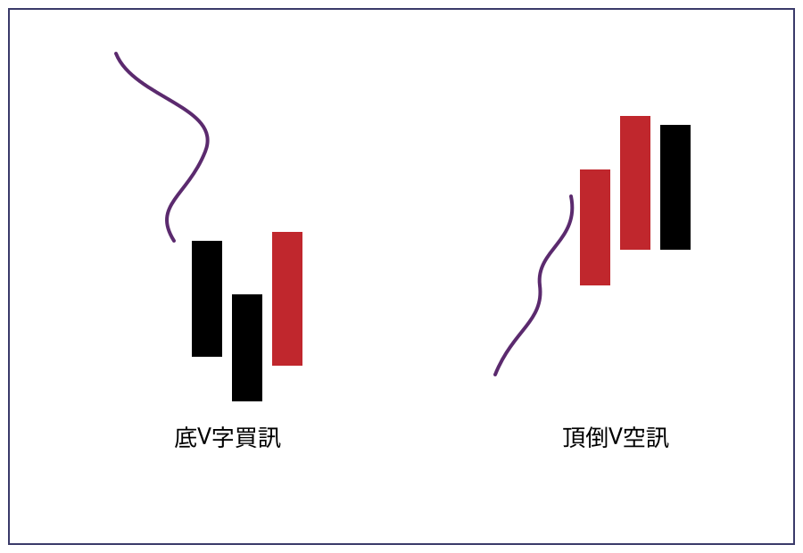
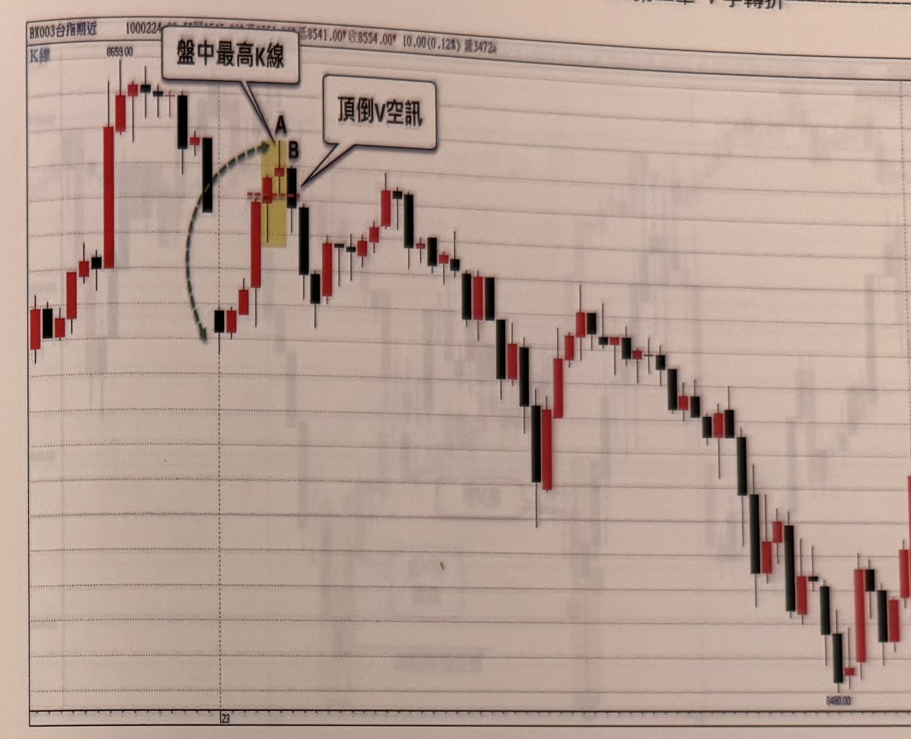
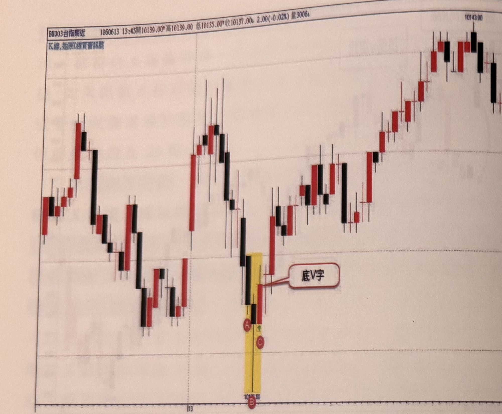
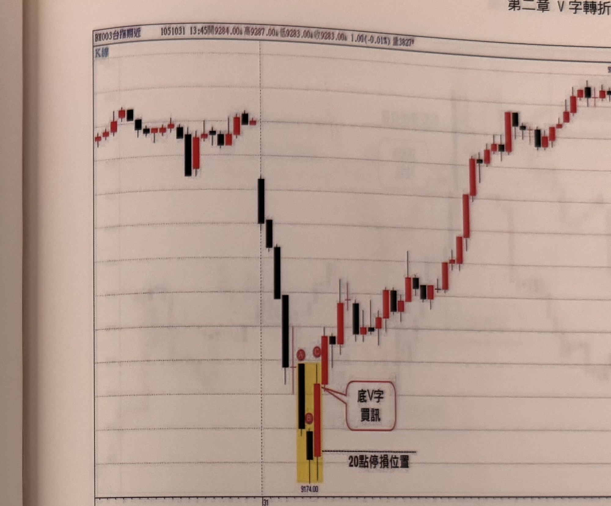
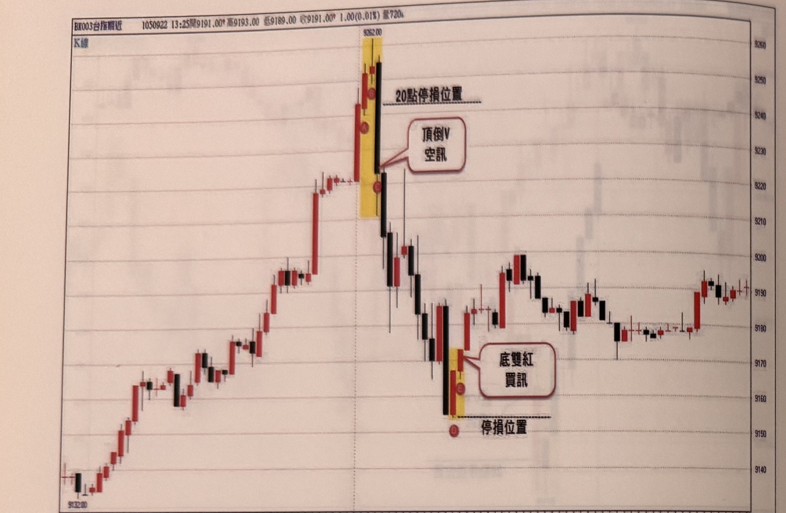
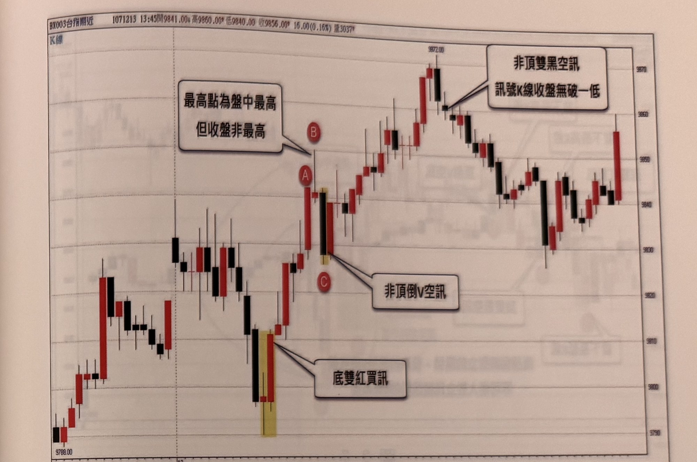
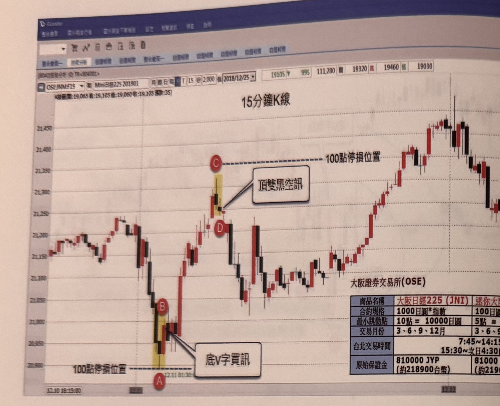
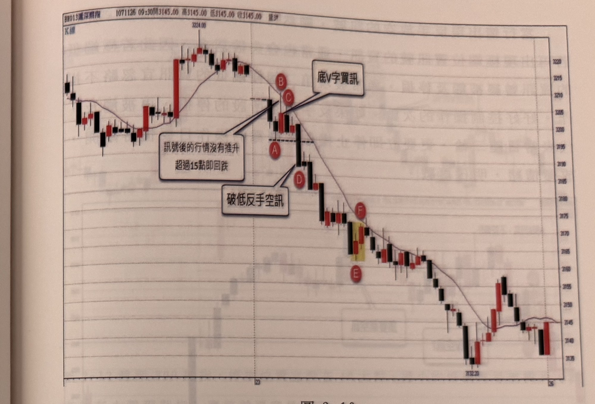

# 底V字買訊 ／ 頂倒V空訊

> 一句話摘要：在盤中極端位置，由兩根同向K線加一根反向K線構成V字（或倒V字）反轉外觀——第二根同向K線須是當下盤中唯一的最高／最低K線（價與收盤雙重極值），反向K線需分別「過一高」或「破一低」，訊號成立後以20點為原則停損，且對立訊號不可侵入彼此收盤，海期訊號失敗時可考慮反手。

## 1. 核心概念

日線結構中的V字反轉，通常出現在快速下跌末跌段，買方毫無預警地絕地大反攻，外觀如同字母V；對稱地，連續上漲行情中若買盤動能突然消失、急速下殺，則形成倒V字（例如主力股遭檢調搜查時的急墜走勢）（p.49）。

把V字概念運用在5分鐘K線圖尋找交易訊號時，定義須**非常嚴格**，因為訊號發生當下，無法預知未來會急速上拉還是持續下跌；但「**不再創新高或破新低**」是重點——只要後市不朝停損方向走，就有獲利空間（p.49）。這是本章與第一章「頂雙黑／底雙紅」同屬「極端位置反轉訊號」家族的第二種訊號。

## 2. 適用前提

- V字訊號**必然發生在盤中的極端位置**，與頂雙黑／底雙紅訊號相同（p.49）。
- 極端位置認定：**盤中高低震幅需≥30點**；若震幅不足30點，改看極端高低點距離**前一日收盤（平盤）**是否**≥40點**，兩者符合其一即可（p.49、57）。
- 早盤認定方式（p.57）：先測開盤第一根K線高（低）點與極端點的距離是否≥30點；若因跳空更低（高）而使該距離<30點，則改測**前一日收盤**與極端點的距離是否≥40點，兩者符合其一即可認定為極端位置（與第一章邏輯一致，見 q3-01）。

## 3. 訊號定義

### 3.1 底V字買訊（多方）

由**兩根下跌黑K線**＋**一根上漲紅K線**組成：

1. C1：第二根黑K線必須是**當下盤中最低K線**，且須同時滿足「最低價最低」與「收盤價最低」（雙重最低）（p.49）。
2. C2：其後的上漲紅K線，最低點須**高於**第二根黑K線的最低點（p.49–50）。
3. C3：該上漲紅K線的收盤須**高於**第二根黑K線的最高點（外觀上為「過一高」）（p.50）。
4. C4：頂／底極端點只能有**唯一一根**K線，不可有兩根K線同高或同低（見第7節F5）（p.60）。

### 3.2 頂倒V空訊（空方，鏡像規則）

由**兩根上漲紅K線**＋**一根黑K線**組成：

1. C1'：第二根紅K線必須是**當下盤中最高K線**，且須同時滿足「最高價最高」與「收盤價最高」（雙重最高）（p.50、61 圖2-13：務必記住A是代表最高點及最高收盤價「雙重最高」）。
2. C2'：其後的黑K線須為**下跌K線**（收盤低於開盤／低於前一根收盤），其最高點須**低於**第二根紅K線的最高點（p.50）。
3. C3'：該黑K線的收盤須**低於**第二根紅K線的最低點（外觀上為「破一低」）（p.50）。
4. C4'：若黑K線雖創新高但**不是真正的上漲K線**（即該根被誤判的「第二根紅K」不符合上漲K線的定義），或其收盤未高於前一根紅K收盤，則不符合C1'的雙重最高條件，**訊號不成立**（p.55，圖2-6）。
5. C5'：與底V字相同，極端頂點只能唯一一根K線，不可兩根同高（p.60，圖2-11）。

## 4. 進場

- **立刻進場**：訊號K線（第三根，即反向K線）收盤時，若進場點與極端K線（第二根同向K線的最高／最低點）的距離在**20點以內**，可立刻進場（p.50、51）。
- **補進場（拉回等待）**：若進場距離超過20點，可選擇忽略，或等待行情反彈／拉回，使進場點與極端點的距離縮小至20點以內再補進場，也可以直接進場，但停損固定20點不變（p.50、57，圖2-8：B收盤距A低點25點，可等拉回至距A低點20點以內的C位置補進場，也可直接在B進場）。
- **判斷是否符合極端位置條件**：進場前須先確認開盤後最低點到最高紅K高點（或反向）的震盪幅度是否超過30點，未達30點則不能使用極端位置的逆向訊號（p.51，圖2-2）。
- **訊號K為大K線時的分級進場**（p.53）：
  1. 訊號K線本身漲跌幅**大於20點**，使停損若設在當下極端位置將超過20點限制：此時若訊號K線**收盤離極端點在30點以內**，可直接進場，停損設20點（不設在極端點）（p.53，圖2-4：C收盤離B最低點近30點，直接進場，停損只設20點，不設在最低點）。
  2. 訊號K線本身漲跌幅**超過30點以上**（超大K線）：停損位置可改設在該K線的**中點或實體中點**；若收盤離此中點小於20點，以20點為停損；通常遇到這種超大K線，會**等拉回縮小停損至20點以內，再補進場**（p.53）。
  3. 另一種等效寫法（p.54，圖2-5）：B高點後C長黑下壓30點（B到C距離約30點，屬第1級），不設停損於B極端高點，只以**C收盤向上加20點**設停損，立即進場放空。
- **海外期貨**：訊號判斷方式相同，可用5～15分鐘K線，停損依商品跳動值調整（見第5節）（p.58）。

## 5. 停損

- **停損設在極端點，風險上限 20 點**：底V字「以最低黑K線低點為停損」、頂倒V「以最高紅K線高點為停損」（p.50）；「20 點」是進場價到極端點的最大距離，超過時可忽略、等拉回至 20 點內補進場、或直接進場但「停損點設在 20 點不變」（即進場價外 20 點）（p.50、57）。
- **大訊號K線的分級停損**：見第4節。訊號K線漲跌幅>20點、收盤離極端點在30點以內者，以收盤價為基準加減20點設定停損，不以最極端點為基準（p.53、54，圖2-5）；訊號K線漲跌幅>30點（超大K線）者，改以該K線的中點或實體中點為基準，收盤離中點<20點時以20點為停損，否則等拉回至20點以內再補進場（p.53）。
- **海外期貨停損點數換算**：
  - 日經225／大阪迷你日經225：可設約**100點**停損（換算約1萬日圓，以極端位置點數約200點判斷）（p.58，圖2-9）。
  - 滬深300期指：停損宜設在**10大點**，點數過小容易被輕易觸及（p.61，圖2-12）。
- **同向訊號被停損後的處理**：與第一章相同，若極端低（高）點的買（賣）訊已被觸及停損，之後若又出現第二個同方向的極端訊號，宜**忽略不操作**（p.60）。
- **連續停損的操作紀律**：若反手放空（或反手買進）後又再度被停損，代表當日**連兩輸**，應**立即停止操作**、離開盤面、放鬆情緒、明日再戰（p.60）。

## 6. 出場 / 停利

- **時間停滯出場（一小時無動靜平倉）**：進場後若行情雖未觸及停損，但也遲遲無法推進獲利，經過約**一小時**仍毫無進展，則在**進場價位**撤單平倉（p.62，圖2-15）。
- 除上述時間停滯規則外，書中本章**未明確說明**其他獨立的停利／移動停利規則（本章重點在訊號定義、停損與反手邏輯）。可參考第一章「頂雙黑／底雙紅」（q3-01）所述的折返點數、SAR、均線、階梯出場四種方法，惟書中未直接指出這些方法同樣適用於V字轉折訊號，此為**推論**，未經原文證實。

## 7. 過濾：不做的情況

1. **對立訊號不可侵入對方K線收盤**：若在短距離內連續出現方向相反的極端訊號（例如底雙紅之後緊接頂雙黑，或底雙紅之後緊接頂倒V），且後出現訊號的K線收盤價**侵入**先前訊號K線的收盤價——空訊收盤**低於或等於**先前買訊的收盤（買訊收盤**高於或等於**先前空訊的收盤）——則**忽略**後出現的訊號，以防止窄幅區間內反覆出現相反訊號、造成莫名停損；未侵入的對立訊號為有效訊號，持倉中應平倉反手。此規則同時適用於頂雙黑、底雙紅與底V字、頂倒V等所有極端位置訊號的組合情境（p.56，圖2-7：CD頂雙黑因**D收盤低於B收盤**（侵入）而被忽略；EF頂倒V因F收盤未與B收盤重疊、且F收盤低於E最低點1點而成立，多單平倉反手放空）。
2. **極端頂／底點須唯一**：頂點或底點只能有一根獨立K線，不能出現兩根K線同高或同低。若第二根訊號K（如頂倒V的第二根紅K）與另一根K線同高（或同低），不符合「唯一最高（最低）」的要求，訊號**不成立**（p.60，圖2-11：B與A同高，雖外觀像頂倒V空訊但因不符「唯一最高」而不成立，須等到後續CD出現正規頂雙黑空訊才可操作）。
3. **反向K線須為真正的上漲／下跌K線**：頂倒V的第二根紅K線若只是創新高但**不是上漲K線**（例如收盤未高於開盤，或收盤未高於前一根紅K收盤），則不符合「雙重最高」條件，即使後續K線破了低點，此組合仍**不符合**頂倒V空訊條件（p.55，圖2-6）。
4. **震盪幅度不足30點時不能使用極端位置逆向訊號**：進場前須確認開盤後最低點到最高（或反向）點的震盪幅度是否超過30點，未達則不可用（p.51）。
5. **訊號失敗徵兆的判斷（觸發反手考量，非單純不做）**：進場後若價格續推點數**小於2大點**，或**未曾突破**訊號K線（第二根同向K線）的高（低）點，代表反轉訊號失敗機率甚高，原先「當下極端位置」的判斷可能已被推翻（p.59，圖2-10）。
6. **同方向極端訊號已被停損過一次，之後同型態訊號忽略不操作**（p.60）。

## 8. 範例解析

- **圖2-1**（p.50，示意圖，SVG）：左半「底V字買訊」——兩根黑K線（第二根較低）加一根收盤突破前黑K最高點的紅K線；右半「頂倒V空訊」——兩根紅K線（第二根較高）加一根收盤跌破前紅K最低點的黑K線，對應本文的核心訊號定義。

  

- **圖2-2**（p.51）：跳低開盤後反彈，穿過平盤後震盪幅度超過60點；A為當下反彈最高點（亦為最高收盤紅K，前一根也是上漲紅K），隔一根B出現下跌黑K，最高點低於A、收盤低於A最低點，符合頂倒V空訊條件，且B收盤距A在20點內，故可立刻進場放空。

  

- **圖2-3**（p.52）：開小平高盤漲約18點後行情下殺，A、B皆為下跌黑K線，B為當下盤中最低K線，開盤後震盪幅度小但大於30點；隔根C最低點高於B最低點，收盤突破B最高點（過一高），符合底V字買訊，且訊號K收盤到B最低點距離小於20點，可直接進場買進；此底V字買訊同時也位於平行支撐買進訊號的位置。

  

- **圖2-4**（p.53）：開盤後快速下跌，35分鐘內下跌近百點，直到C不再創新低，K線收盤突破前一根最低K線（B）的高點，形成底V字買訊；C的收盤離B最低點近30點，可直接進場，但停損不設在最低點，只設20點。

  

- **圖2-5**（p.54）：開平盤後連拉三根紅K到B（漲約40點），隔根C以長黑下壓（跌約30點，K線本身逾40點），構成頂倒V空訊；由於C本身是超大K線，不必以B極端高點為停損基準，只需以C收盤向上加20點設停損，立刻進場放空。

  

- **圖2-6**（p.55）：開平高盤橫盤成頭後殺至盤下，於極端低點出現底雙紅買訊，行情反攻突破盤上；A突破早盤最高點，隔根B雖創新高但**不是上漲K線**，C雖跌破B最低點，此組合**不符合**頂倒V空訊條件；圖中另有一組兩紅一黑的頭部型態，因訊號K線收盤未跌破前低，**不成立**頂雙黑空訊。示範「反向K線須為真正的上漲/下跌K線」與「訊號K須收盤破一低」兩項過濾規則。

  

- **圖2-7**（p.56）：跳低開盤，AB於當下最低點形成底雙紅買訊並進場做多；緊接CD於當日極端高點出現頂雙黑空訊，但因D的收盤低於B的收盤（侵入對立訊號的收盤），依規則**忽略**D的空訊；其後EF出現頂倒V空訊，F收盤未與B收盤重疊，且F收盤低於E最低點1點，符合條件，**訊號成立**，可進場放空。示範「對立訊號不可侵入對方K線收盤」規則。

  

- **圖2-8**（p.57）：跳低開盤走低至A（盤中最低點），與開盤第一根K線高點距離31點（符合震幅≥30點條件；若不符，前一日收盤與A距離43點，亦符合≥40點條件）；B收盤突破A最高點形成底V字買訊，但B收盤距A低點達25點，20點停損不足，故可等拉回至距A低點20點以內的C位置補進場，也可直接在B進場並設20點停損。

  

- **圖2-9**（p.58，永豐期貨GLEADER，大阪迷你日經225 15分鐘K線）：開盤即從平盤殺盤直下，A為當下盤中最低，隔根B紅K收盤突破A高點，形成底V字買訊，設100點停損（極端位置點數以約200點判斷）；行情攀升穿過開盤高點後於C出現當日最高點，CD形成頂雙黑反轉空訊，於CD進場放空並設100點停損。示範V字訊號與頂雙黑訊號可在同一走勢中交替出現、且可運用於海期15分鐘K線。

  

- **圖2-10**（p.59，滬深300期指5分鐘K線）：跳低開盤，AB形成底V字買訊並進多單，但進場後未再越過B高點（訊號後行情沒有推升，超過15點即回跌），顯示訊號失敗機率大；當價格向下跌破A低點（D處）時，不僅觸發停損平倉，且K線收盤確認跌破A低點時，即為「破低反手空訊」，可反手放空。示範「訊號失敗判斷」與「反手」規則。

  

- **圖2-11**（p.60）：連續上漲紅K推升至A（當下盤中最高K線），隔根B收盤跌破A低點，外觀類似頂倒V空訊，但**B與A同高**，不符合「A是唯一最高」的要求，訊號**不成立**；之後CD才出現正規頂雙黑空訊，為正確操作訊號。示範「極端頂/底點須唯一」規則。

  

- **圖2-12**（p.61，滬深300期指5分鐘K線）：說明「滬深300期指，停損位置宜設在10大點，過小的停損更易被觸及」——股價創高至約3275.40附近構成頂倒V空訊案例。

  

- **圖2-13**（p.61，台指期5分鐘K線）：說明「台指期A為當下最高K線，千萬別忘記這個定義，它代表最高點及最高收盤價雙重最高K線」——連續紅K上攻至A（當下最高點）、B構成頂倒V空訊案例，強調「雙重最高」定義的重要性。

  

- **圖2-14**（p.62）：訊號K線離谷點（最低點）超過30點時，可等待拉回縮小停損至20點以內再補進場，或直接進場並設20點停損。

  

- **圖2-15**（p.62）：根據頂倒V空訊進場後，行情雖未觸及停損，但遲遲無法推進獲利，經過約一小時毫無動靜，依規則在進場價位撤單平倉。示範「時間停滯出場」規則。

  

- **圖2-16**（p.63）：頂倒V空訊案例展示，訊號K線組合與停損位置示意，圖上未附額外文字說明。

  

- **圖2-17**（p.63）：底V字買訊案例展示，訊號K線組合與停損位置示意，圖上未附額外文字說明。

  


## 9. 作者提醒與常見錯誤

- 實戰中常誤把「兩紅一黑」的外觀直接當成頂倒V空訊，卻忽略第二根紅K線**必須是真正的上漲K線**（不只是創新高），此為最常見的誤判來源（p.55）。
- 頂／底極端點務必確認**唯一性**（收盤與價格皆須是雙重最高/最低），若有兩根K線同高或同低，不能視為有效訊號（p.60）。
- 對立訊號（例如先做多又冒出反向空訊）不可貿然反手，須先確認後訊號的收盤是否侵入先前訊號的收盤價，避免在窄幅區間被相反訊號反覆巴掌式停損（p.56）。
- 台指期震幅相對較小，**不建議使用反手**策略；反手邏輯主要用於波動較大的海外期貨商品（p.59）。
- 若反手後又遭停損，代表當日連兩輸，應立即停止操作、離開盤面，避免情緒化交易（p.60）。

## 10. 規則速查（Checklist）

- [ ] 訊號發生在盤中極端位置（震幅≥30點，或跳空後距平盤≥40點）
- [ ] 底V字：兩黑K＋一紅K，第二根黑K為當下盤中唯一最低K線（價與收盤雙重最低），紅K最低點高於該黑K最低點且收盤突破其最高點（過一高）
- [ ] 頂倒V：兩紅K＋一黑K，第二根紅K為當下盤中唯一最高K線（價與收盤雙重最高），黑K為真正下跌K線，最高點低於該紅K最高點且收盤跌破其最低點（破一低）
- [ ] 進場距離極端點≤20點可立刻進場；否則等拉回縮小至20點以內
- [ ] 訊號K本身漲跌>20點、收盤離極端點在30點內，可直接進場，以收盤±20點設停損
- [ ] 訊號K本身漲跌>30點（超大K線），停損改以K線中點或實體中點為基準，收盤離中點<20點才可直接進場，否則等拉回
- [ ] 停損＝20點（海期依商品調整，如日經225約100點、滬深300期指10大點）
- [ ] 對立訊號不可侵入前一訊號K線收盤，否則忽略後訊號
- [ ] 極端頂/底點須唯一，不可兩根K線同高或同低
- [ ] 訊號失敗徵兆（續推<2大點或未突破訊號K極值）→ 跌破/突破訊號起點時可考慮反手（海期適用，台指不建議）
- [ ] 反手後再度停損（連二輸）→ 立即停止操作
- [ ] 同方向訊號已被停損過一次 → 之後同型態訊號忽略不操作
- [ ] 進場後約一小時未觸及停損也未推進獲利 → 在進場價平倉出場

## 11. 機器可讀規則

```yaml
signal: V字轉折
side: both
timeframe: 5m
conditions:
  - id: C1
    desc: 底V字第二根黑K為當下盤中最低K線（最低價最低且收盤價最低）；頂倒V第二根紅K為當下盤中最高K線（最高價最高且收盤價最高）
    source: p.49-50
  - id: C2
    desc: 反向K線（紅K/黑K）最低點高於（底V字）/最高點低於（頂倒V）前一根同向K線之極值
    source: p.50
  - id: C3
    desc: 反向K線收盤突破前一同向K線最高點（過一高，底V字）/ 跌破前一同向K線最低點（破一低，頂倒V）
    source: p.50
  - id: C4
    desc: 反向K線須為真正的上漲/下跌K線，不可只是創新高/新低而收盤未同向配合
    source: p.55
  - id: C5
    desc: 極端頂/底點須唯一一根K線，不可與其他K線同高或同低
    source: p.60
entry:
  trigger: 訊號第三根K線（反向K線）收盤
  immediate_if: 進場點與極端點距離 <= 20 點
  delayed_if: 距離 > 20 點，等拉回至距離 <= 20 點再補進場，或直接進場但停損仍20點
  large_signal_bar_tier1: 訊號K線漲跌幅>20點、收盤離極端點在30點以內 → 直接進場，停損＝收盤±20點
  large_signal_bar_tier2: 訊號K線漲跌幅>30點（超大K線） → 停損改以K線中點或實體中點為基準，收盤離中點<20點才直接進場（停損20點），否則等拉回至20點以內再補進場
  source: p.50, p.53, p.54, p.57
stop_loss:
  level: 極端點（底V字＝第二根黑K最低點；頂倒V＝第二根紅K最高點）
  max_points: 20（進場價到停損的最大距離；訊號K漲跌>20點時＝收盤±20點；訊號K漲跌>30點時＝K線中點/實體中點±20點）
  source: p.50, p.53, p.54
  fx_examples:
    - instrument: 日經225(大阪迷你)
      points: 100
      source: p.58
    - instrument: 滬深300期指
      points_min: 10
      source: p.61
exit:
  method_time_stall:
    desc: 進場後若未觸及停損、但也遲遲無法推進獲利，經過約一小時毫無動靜，於進場價位撤單平倉
    source: p.62
  other: 書中本章未再說明其他獨立停利規則（可能可比照第一章折返點數/SAR/均線/階梯停利，未經原文證實，屬推論）
reversal:
  desc: 訊號進場後若續推<2大點或未突破訊號K極值，代表訊號失敗機率高；價格K線收盤確認跌破/突破訊號起點時可反手，僅建議用於波動大的海外期貨
  stop_after_double_loss: 反手後再度停損（連二輸）須立即停止操作
  source: p.59-60
filters:
  - desc: 對立訊號不可侵入前一訊號K線收盤（空訊收盤 ≤ 先前買訊收盤即侵入），否則忽略後訊號；未侵入者平倉反手
    source: p.56
  - desc: 極端頂/底點須唯一，不可兩根K線同高或同低
    source: p.60
  - desc: 反向K線須為真正上漲/下跌K線，僅創新高/新低不足以成立
    source: p.55
  - desc: 開盤後最低點到極端點的震盪幅度需>=30點，否則不可用極端位置逆向訊號
    source: p.51
  - desc: 同方向訊號已被停損一次，之後同型態訊號忽略不操作
    source: p.60
```

## 12. 待確認事項

無。缺頁僅影響範例圖，見 frontmatter `missing_pages`。

## 13. 原文出處

- `extracted/pages/IMG_8352.md`（p.49，第二章開頭定義；p.48屬第一章，見 q3-01）
- `extracted/pages/IMG_8353.md`（p.50–51）
- `extracted/pages/IMG_8354.md`（p.52–53）
- `extracted/pages/IMG_8355.md`（p.54–55）
- `extracted/pages/IMG_8356.md`（p.56–57）
- `extracted/pages/IMG_8357.md`（p.58–59）
- `extracted/pages/IMG_8358.md`（p.60–61）
- `extracted/pages/IMG_8359.md`（p.62–63）
