# 頂母子空訊／底母子買訊

> 一句話摘要：盤中極端K線（母K）之後，緊接一根實體被「懷孕式」包在母K實體範圍內的子K線，第三根訊號K線再以與母K相反顏色、收盤穿越母K開盤價並跌破／突破子K的方式反轉，即構成頂母子空訊或底母子買訊。

## 1. 核心概念

在盤中極端位置，母子線是本書介紹的第三種反轉組合（前兩種見第一章「頂底雙紅黑」、第二章「V字轉折」）。母子線以**實體**（開盤—收盤範圍）來判別：子K線的實體被限制在母K線的實體範圍內，狀似懷孕（p.67）。

母子型態的外觀規定：**子K線最高點必須低於母K線最高點，且子K線最低點必須高於母K線最低點；母子K線之間的高低點絕不能有相等狀況**，這是外觀上最重要的條件。實體之間則可以等高或等低，但若母K線是無上下影線的純實體K線，子K線實體就不能與其同高或同低（p.67）。

- **頂母子空訊**：母K線是當下盤中最高、且為上漲的紅K線；隔一根子K線夾在母K實體與高低點範圍內；第三根訊號K線須為黑K線，收盤跌破子K線最低點，且收盤小於或等於母K線開盤價，即構成空訊（p.67）。
- **底母子買訊**：母K線是當下盤中最低、且為下跌的黑K線；隔一根子K線夾在母K範圍內；第三根訊號K線須為紅K線，收盤突破子K線最高點，且收盤大於或等於母K線開盤價，即構成買訊（p.68）。

## 2. 適用前提

1. 母K線須為「當下盤中最高K線」或「當下盤中最低K線」，且此一「最高/最低K線」須同時符合**最高點最高**與**收盤最高**（或最低點最低與收盤最低）兩個條件，僅符合其一不算（p.74，圖3-8）。
2. 盤中極端位置的高低震幅通常須在**30點以上**；若因跳空使震幅未達30點，可改測「極端位置到平盤的距離」是否超過**40點**，符合者仍視為滿足震幅條件（p.68–69，圖3-3、3-4）。
3. 商品以台指期為主，書中另有滬深300期指、恆生指數期貨的實例（p.78–79），顯示本訊號可跨商品套用。

## 3. 訊號定義

### 3.1 頂母子空訊（空方）

1. **C1** 母K線為當下盤中最高K線（最高點最高且收盤最高須同時成立），且為上漲之紅K線。（p.67, p.74）
2. **C2a**（實體條件）子K線之實體須落在母K線實體範圍內；實體邊界可與母K線實體邊界等高／等低，但若母K線為無上下影線之純實體K線，子K線實體不可與其同高或同低。（p.67）
3. **C2b**（高低點條件）子K線之最高點須**低於**母K線最高點，且子K線之最低點須**高於**母K線最低點；兩者絕不可相等。（p.67）
4. **C3** 訊號K線（第三根）須為黑K線。（p.67）
5. **C4** 訊號K線最高點不能高於母K線最高點。（p.67）
6. **C5** 訊號K線收盤須**小於或等於**母K線開盤價。（p.67）
7. **C6** 訊號K線收盤須**跌破**子K線最低點。（p.67）

### 3.2 底母子買訊（多方，與3.1鏡像）

1. **C1** 母K線為當下盤中最低K線（最低點最低且收盤最低須同時成立），且為下跌之黑K線。（p.68）
2. **C2a／C2b** 子K線之實體與高低點條件同3.1（懷孕式，高低點不可相等）。（p.67, p.68）
3. **C3** 訊號K線須為紅K線。（p.68）
4. **C4** 訊號K線收盤須**大於或等於**母K線開盤價。（p.68）
5. **C5** 訊號K線收盤須**突破**子K線最高點。（p.68）

## 4. 進場

- 訊號K線收盤確認後即可進場（p.70：「直接在訊號C收盤進場」）。
- 若訊號K線收盤距離母K極端點已超過20點（停損將超過書中慣用的20點上限），可選擇**等待拉回／反彈**，讓進場價與母K極端點的距離縮小至20點以內再補進場；也可以**直接在訊號K收盤進場**，但停損仍設為20點（p.70）。
- 圖3-4範例：訊號K線距離母K最低點剛好20點，屬於可以立刻進場的情況（p.70）。
- **距離分級（p.73）**：
  1. 距離 ≤20點：可立刻進場。
  2. 距離20～30點：可等待反彈／拉回，讓補空（多）位置縮小至距母K極端點20點以內；也可以直接進場，但仍設20點停損。
  3. 距離達**40點以上**：這種訊號**宜放生不操作**；若執意進場，只能等稍作反彈、將距離縮小至20點以內才進場，**不可**直接以進場價±20點的方式進場（p.73，圖3-7：訊號B收盤離母K A高點達40點，正常應放生；若執意進場，仍須等反彈縮小至20點才進場，停損點數不變）。
- **折返出場的進場延伸考量（p.77，圖3-11，跨章節示範）**：訊號距離約20～30點時，直接進場設20點停損可能被長上下影線掃到停損；等待小幅拉回（例如僅拉回幾點）再補進場可避免被掃停損，但也可能等不到理想拉回；書中將此列為操作者自行取捨的「哲學問題」，並未給出強制規則。

## 5. 停損

- 停損設在母K極端點（頂母子＝母K最高點、底母子＝母K最低點），且進場價到停損的距離以**20點**為上限：不論是等拉回補進場、或直接在訊號K收盤進場，風險都控制在20點（p.70；本書極端位置訊號一貫以極端點為停損、20點為上限，見 q3-01 §5、q3-02 §5）。
- 圖3-3的案例中，A的高點超過訊號收盤30點，書中提示「在設停損位置自然不能超過20點限制」，故直接進場時以進場價外20點為停損，而非依母K到訊號K的實際距離設定（p.70）；圖3-4 訊號K距母K低點剛好20點，停損即母K低點（p.70）。
- 訊號K線距離母K極端點達**40點以上**時，原則上放生不操作；若執意進場，須先等反彈使距離縮小至20點以內才進場，堅持停損點數不變，不可直接以進場價外20點的方式進場（p.73，圖3-7）。

## 6. 出場 / 停利

- **折返平倉（小賺小賠出場）**：進場後若行情雖朝有利方向前進，但獲利幅度不足以達到一般預期的停利目標（書中示範獲利僅16點，未達期望的20點以上），隨後行情又折返回到進場價位附近時，應在此時**撤單平倉**，寧可小賺小賠了結，也不要冒進拖到觸發停損（p.72–73，圖3-6）。
- 除上述折返平倉規則外，書中本章節未再明確訂出頂底母子訊號本身的停利／移動停損規則。範例圖說中多次出現「連五黑遇首紅平倉」「五連黑遇首紅平倉」等描述（p.68–69圖3-2、p.71圖3-5、p.78圖3-12），暗示可搭配另一套規則作為既有部位的出場依據，但該規則本身屬於其他章節內容（參見 q3-06-連五黑遇首紅與連五紅遇首黑），本章未展開細節。

## 7. 過濾：不做的情況

1. 子K線最高點等於母K線最高點、或最低點等於母K線最低點，皆不成立母子關係（不可有同高同低）。（p.67）
2. 子K線實體超出母K線實體範圍（例如子K實體高點高於母K實體），不符合「懷孕」外觀，不成立訊號。（p.74，圖3-8）
3. 母K線只符合「最高點最高」但收盤不是當下最高收盤（或反之），不能視為合法母K線。（p.74，圖3-8）
4. 訊號K線的影線雖已跌破（或突破）母K線開盤價，但**收盤**未真正小於或等於（或大於或等於）母K線開盤價，不算訊號成立——僅有影線觸及不夠。（p.71，圖3-5的B點）
5. 高低震幅未達30點、且距平盤亦未達40點時，不符合震幅條件，訊號不成立。（p.68–69）
6. 訊號K線距離母K極端點達**40點以上**時，原則上**放生不操作**（p.73，圖3-7）。

## 8. 範例解析

- **圖3-1**（p.67，示意圖）：左右對照的手繪示意圖，左半示範「底母子買訊」（母K為黑K、子K懷孕其中、訊號紅K收盤突破子K高點且高於母K開盤價），右半示範「頂母子空訊」（母K為紅K、子K懷孕其中、訊號黑K收盤跌破子K低點且低於母K開盤價）。對應3.1、3.2的基本定義。

  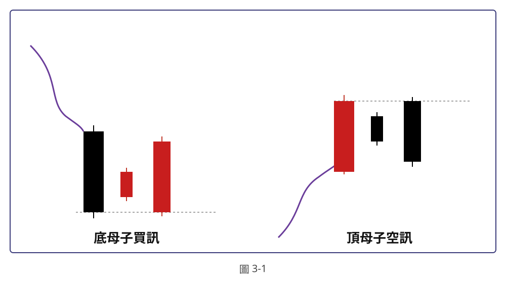

- **圖3-2**（p.68–69，台指期分時K線）：A為當下盤中最低K線（黑K），B為子線（限縮於A高低範圍內），C收盤突破A開盤價，構成底母子買訊；訊號後行情急拉至7450後，出現頂雙黑空訊反轉下殺。示範3.2的C1–C5成立。

  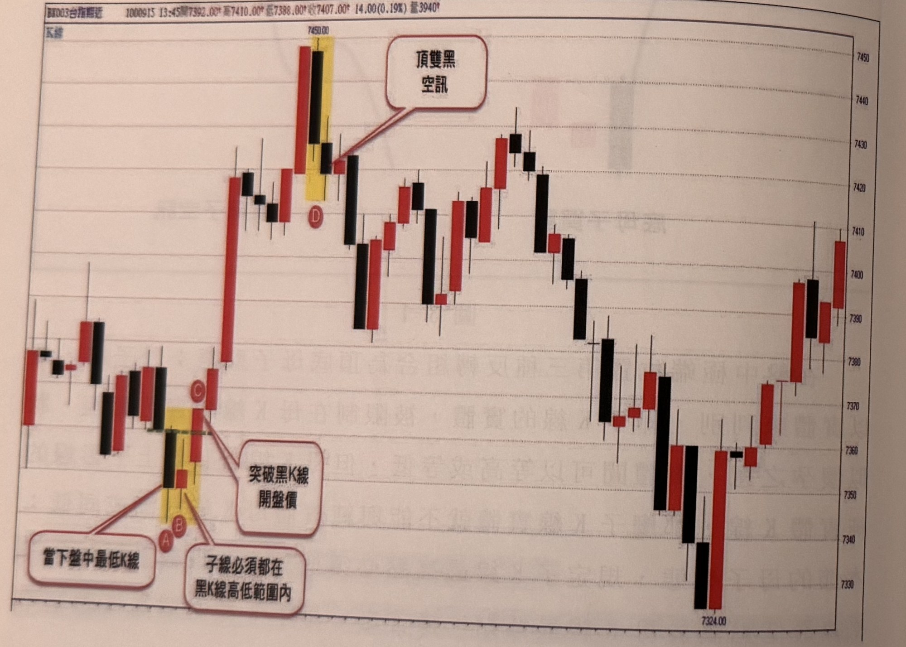

- **圖3-3**（p.69–70，台指期分時K線）：以跳空方式達到當下盤中最高點A（漲跌幅合計超過40點，滿足震幅例外條件），子線B夾在A範圍內，C收盤跌破A開盤價，構成頂母子空訊，訊號後行情反轉重挫。示範2.條震幅例外規則與3.1定義。

  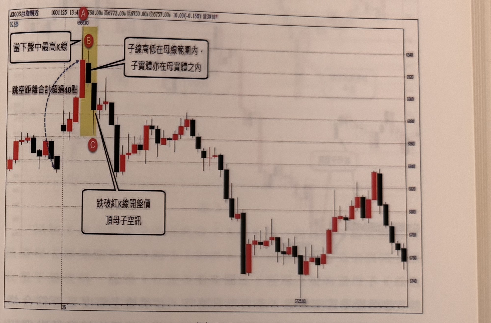

- **圖3-4**（p.70，台指期五分鐘K線）：跳低開盤，第一根黑K即為當下最低點，隔根子K夾在其中，再隔根紅K收盤突破首根黑K開盤價，構成母子組合；此時開盤僅3根K線、高低震幅僅23點（<30點），但首根黑K低點到平盤距離超過40點，符合震幅例外，且訊號K距離最低點恰20點，宜立刻進場，停損20點。示範2.條震幅例外與4./5.節之進場停損。

  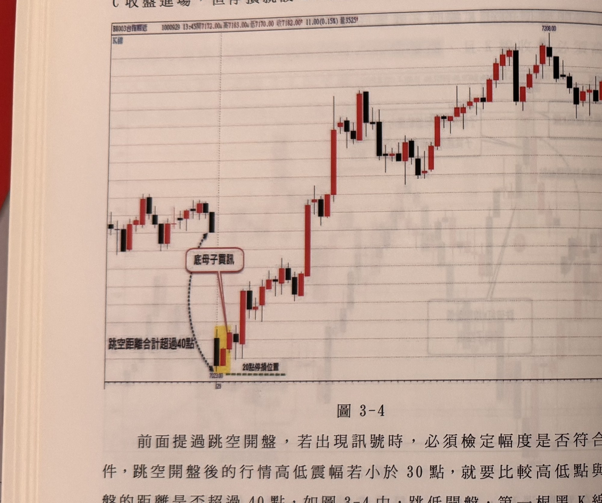

- **圖3-5**（p.71，台指期五分鐘K線）：A為當下最高位置形成頂母子組合（子K實體高點與母K實體同高，因母K非純實體K線，僅需子K最高點低於母K最高點即符合C2b）；B雖跌破子K最低點，但影線破了母K開盤價、**收盤**未真正小於或等於母K開盤價，故不成立訊號（示範7.條過濾規則4）；行情續漲至C再成為當下最高K線，隔一根十字線仍視為子K，隔根D收盤在十字線最低點下方且收在母K開盤價之下，形成真正的頂母子空訊。同圖亦標示「連五黑遇首紅平倉」。

  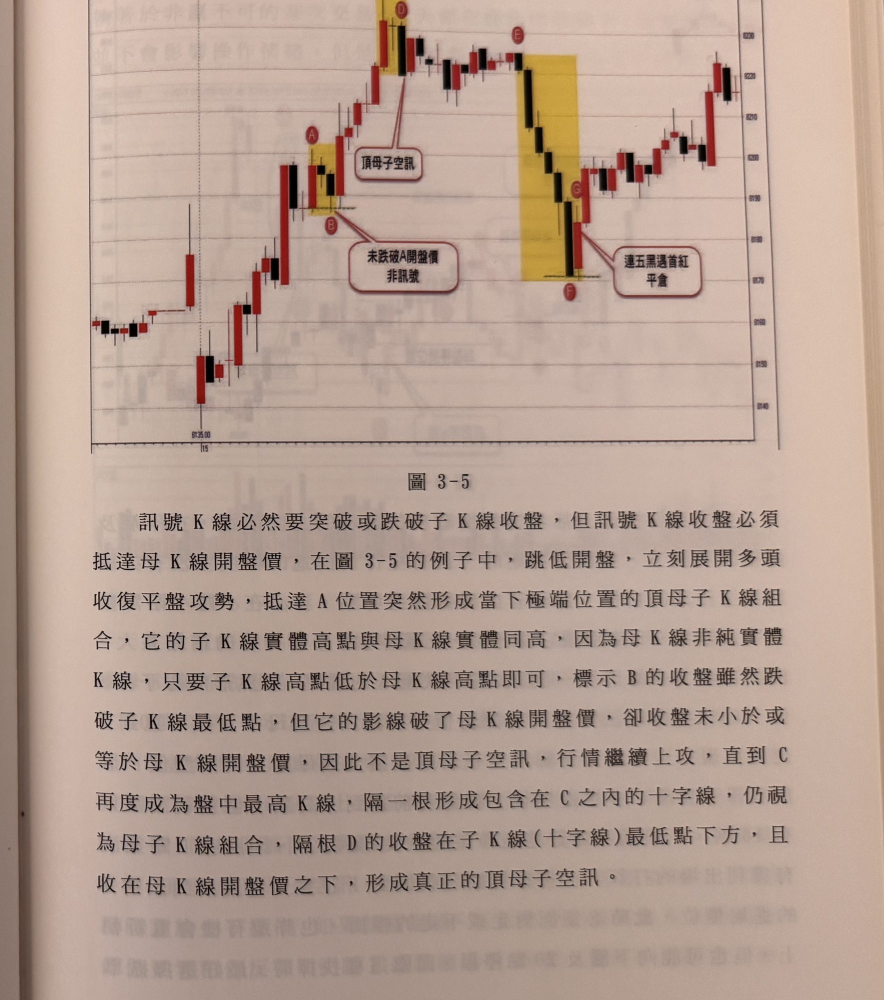

- **圖3-6**（p.72，台指期分時K線）：開盤下跌至A低點形成母子線，但B收盤無法穿越A開盤價，非底母子買訊；直到C位置再次出現母子線，D收盤突破母線C開盤價，構成底母子買訊；多單進場後行情僅前進至E（獲利16點，未達期望的20點以上），隨後折返回到D的進場價位（F），依規則應在此撤單平倉了結。示範6.節「折返平倉」規則。

  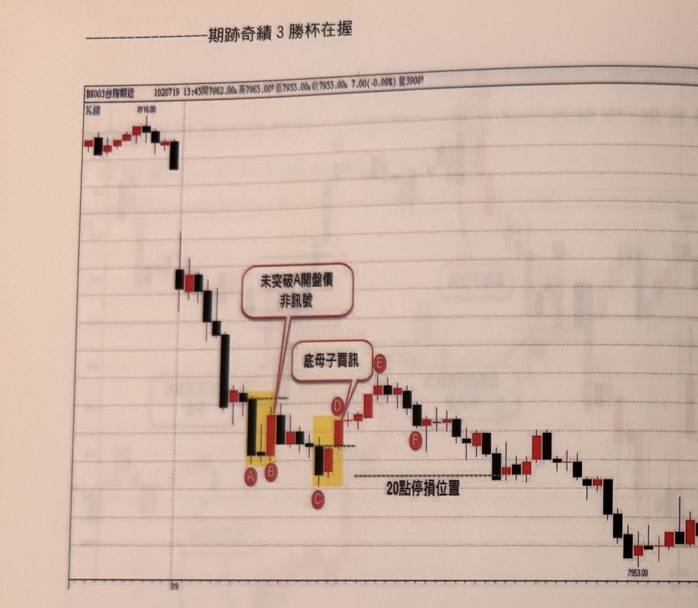

- **圖3-7**（p.73，台指期分時K線＋成交量副圖）：開低反彈連拉5根紅K到A高點，AB構成頂母子空訊，但訊號B收盤離A高點達40點，屬於應放生不操作的距離；隨後行情續跌至C，D出現底V字買訊反轉向上。示範4./5./7.節「距離達40點以上宜放生」規則。

  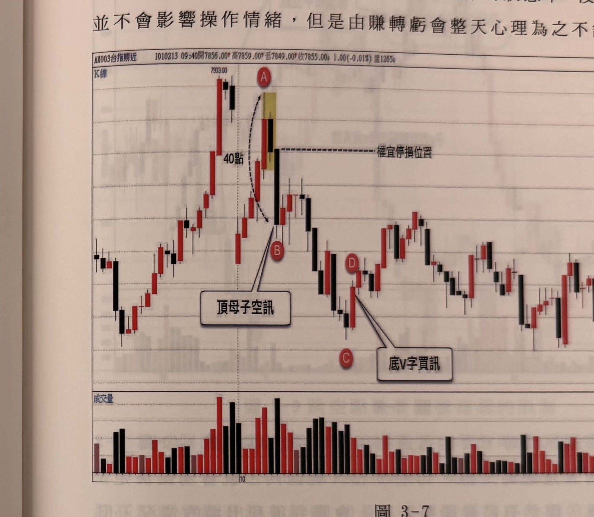

- **圖3-8**（p.74，台指期五分鐘K線）：A外觀為最高K線，但收盤非最高收盤（前一峰點收盤更高），且緊鄰的B實體高點高於A，不符合母子懷孕外觀，因此C位置**不是**頂母子空訊。示範2.、7.條的最高K線判定與實體條件過濾。

  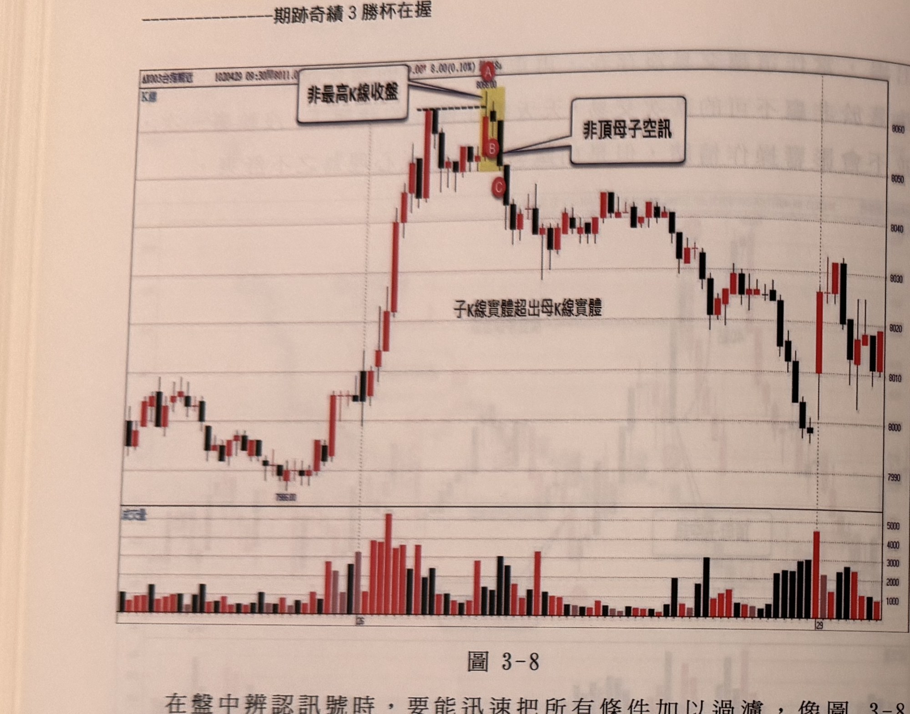

- **圖3-9**（p.75，台指期五分鐘K線）：跳高開盤，B為當日最高K線（距平盤已超過40點，滿足震幅例外），隔根黑K與B形成母子線，C位置收盤跌破子線低點且等於母K（B）開盤價，構成頂母子空訊；訊號後行情急殺約50點，並於低點出現「五黑遇首紅平倉」與「底V字買訊」。示範3.1定義與2.條震幅例外。

  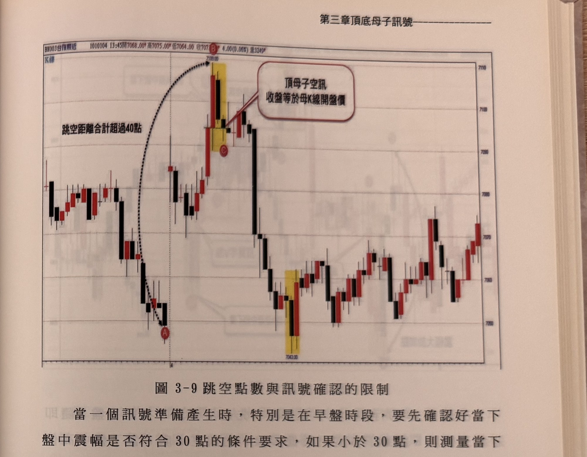

- **圖3-10**（p.76，台指期分時K線，震幅認定問題）：跳小低開盤反彈至A抵達平盤，之前震幅小於30點，A上影線未超出前一紅K最高點也不能視為頂倒V空訊；隨後連殺三根黑K到B（當下最低K線），AB之間震幅大於30點，於C出現底母子買訊；行情盤旋後於DE形成頂雙黑空訊，多單獲利17點平倉，空單獲利約35點。示範2.節震幅（30/40點）例外規則的實際判斷。

  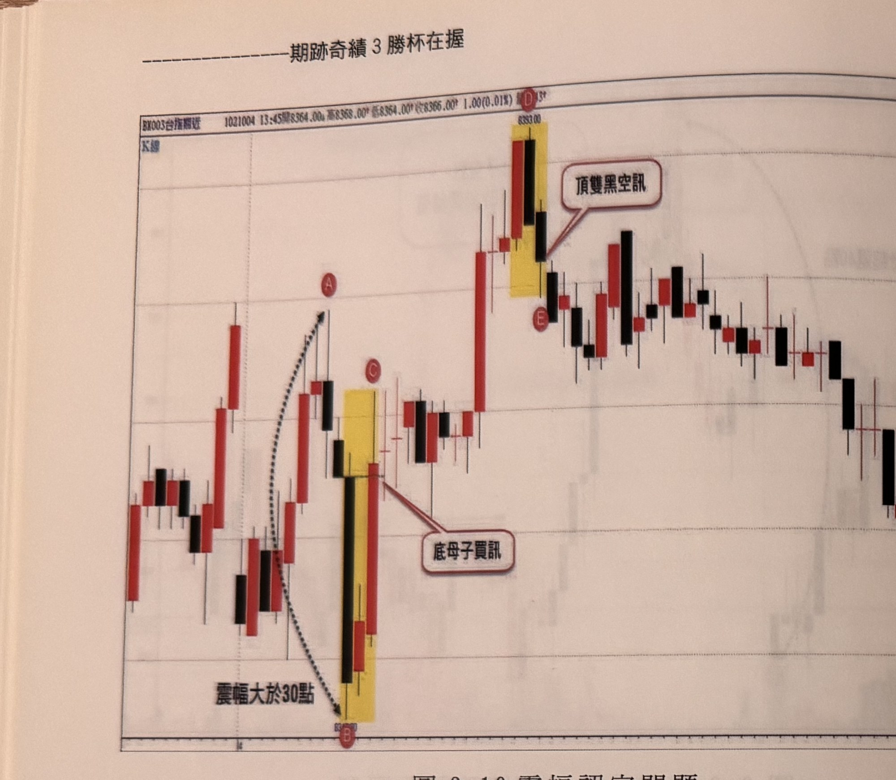

- **圖3-11**（p.77，台指期分時K線）：A為當下盤中最低K線，B構成底V字買訊（見 q3-02），行情超過初始獲利目標後採15點折返移動停利，於C高點向下15點畫停利線，D收盤觸及停利平倉；隨後E形成頂母子空訊，但E收盤距母K C頂點達27點，屬20～30點距離區間，直接進場設20點停損可能被長影線掃到，等小幅拉回再補空則可能避開，書中列為操作者自行取捨的情境。

  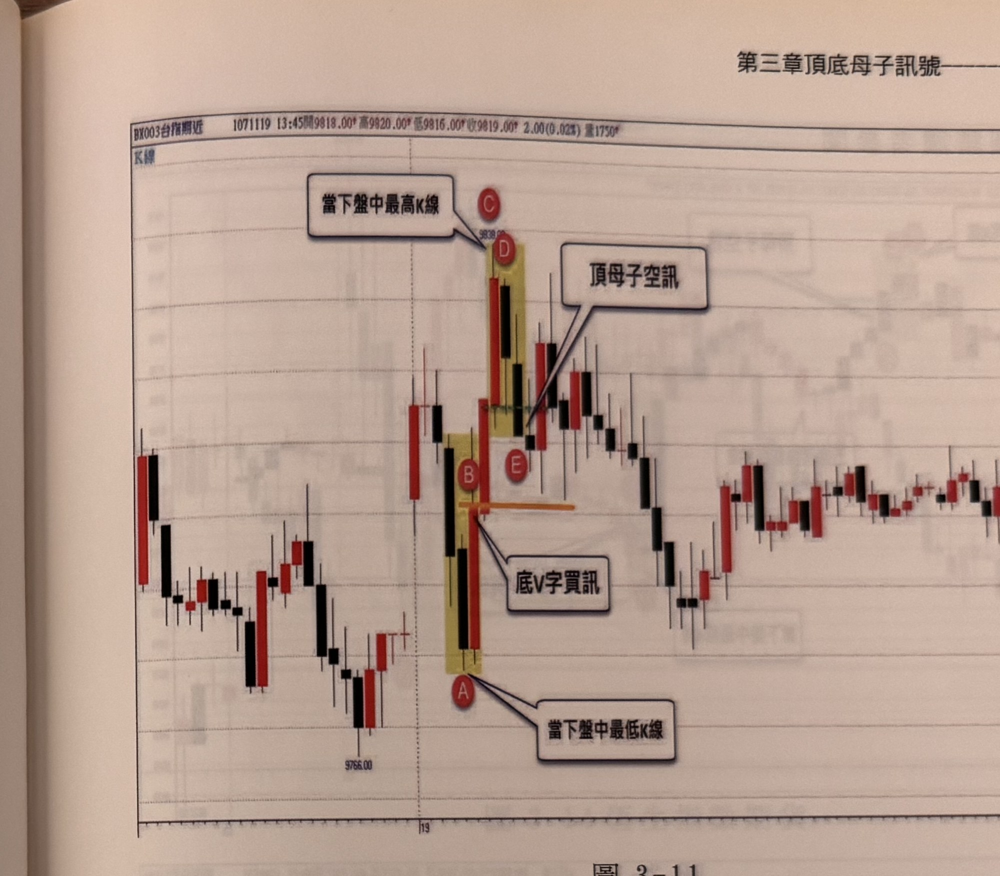

- **圖3-12**（p.78，台指期近月5分鐘K線）：A為當下盤中最高K線附近，B（黑K，實體包覆於前一紅K內）構成頂母子空訊；隨後連續五根黑K（五連黑遇首紅平倉），最終在D（當下最低K線）後以E形成底V字買訊反轉向上。示範3.1定義並與其他章節訊號（五黑遇首紅、底V字）並陳。

  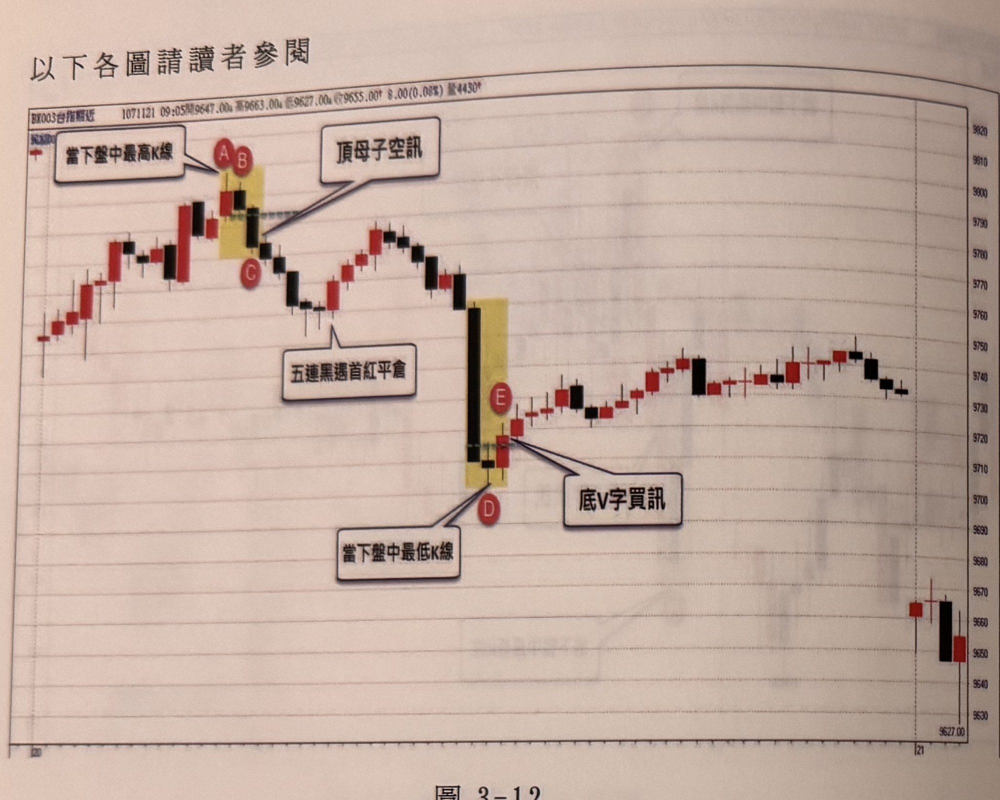

- **圖3-13**（p.78，滬深300指數）：A、B相鄰K線（B黑K實體包覆於A紅K之內）構成頂母子空訊，之後行情反轉下滑。示範本訊號可套用於滬深期指。

  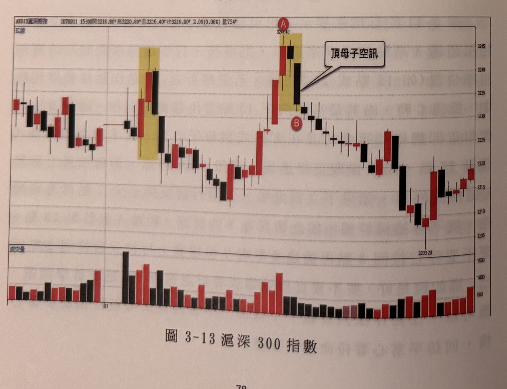

- **圖3-14**（p.79，恆生指數期貨）：A（下方黑K，盤中最低）、B（上方緊接長紅K）構成底母子買訊，訊號後行情反轉向上急拉。示範本訊號可套用於恆生期指。

  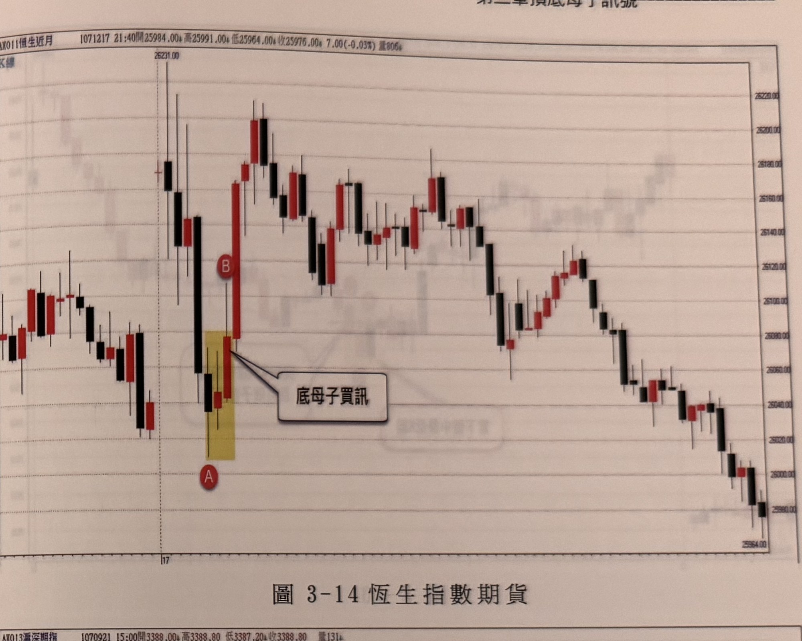

- **圖3-15**（p.79，滬深300期指）：A為帶長下影線的K線，圖說註記「極端高的訊號，不宜當根，反成為盤中最低K線」（此段原文標示語意較模糊，推測意指原本用以測試極端低點的長下影線K線，因後續未被跌破，最終自己成為當下盤中最低K線），其後C（下方黑K）、D（上方紅K／十字線）構成底母子買訊，訊號後行情強勁反轉向上。

  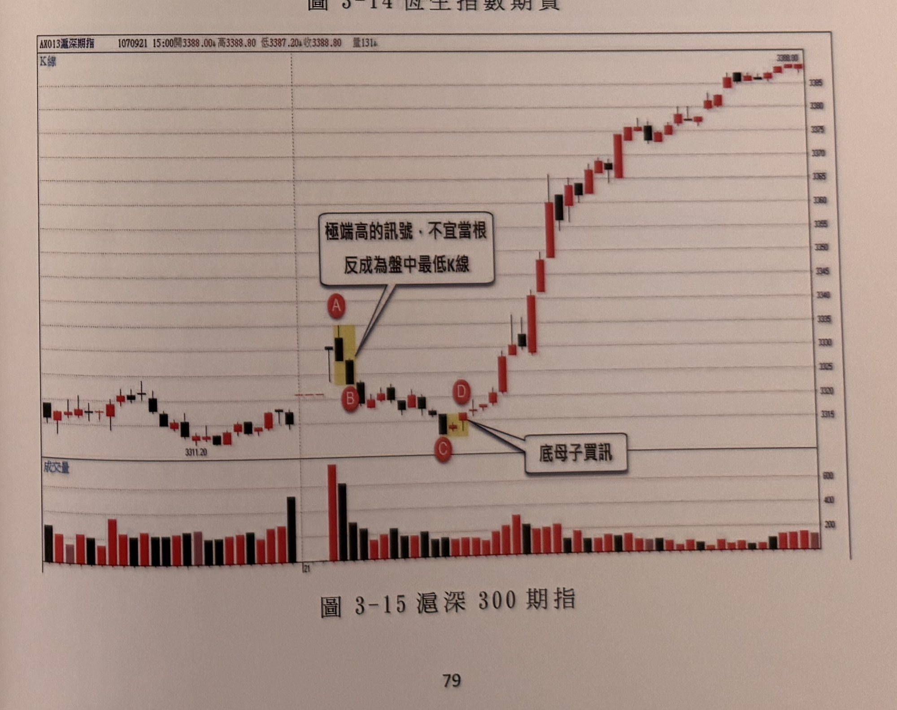

- **圖3-16**（p.80，台指期分時K線，頁首報價因翻拍角度模糊難以逐字辨識）：A為當下盤中最低K棒，兩個文字標註框分別指出「當下盤中最低K棒」與「突破黑K線開盤價且突破子線高點」，構成底母子買訊；訊號後行情反轉走高，中途小幅拉回整理後再度上攻，最終收在全圖高點附近。示範3.2定義C1（母K為當下最低）、C4（訊號K收盤突破母K開盤價）、C5（訊號K收盤突破子K高點）三項條件。

  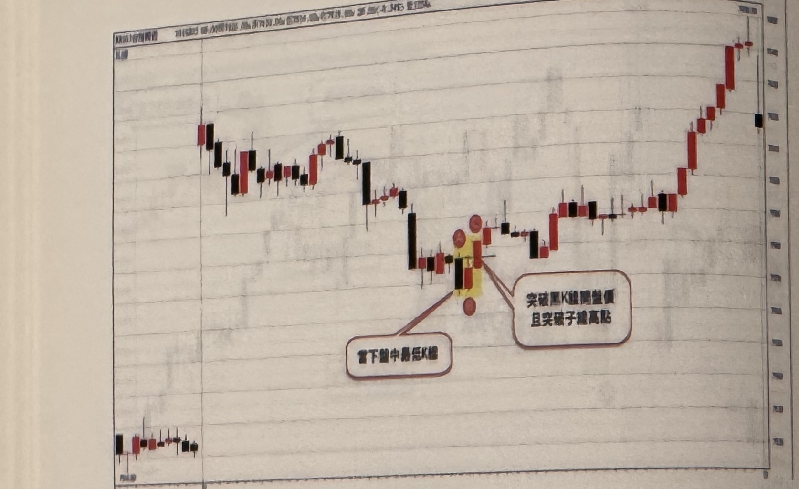


## 9. 作者提醒與常見錯誤

- 容易只看外觀「最高/最低K線」就急著判斷母子訊號成立，卻忽略「收盤也必須是當下最高/最低收盤」這項同等重要的條件（p.74）。
- 容易忽略子K線實體是否真的完全落在母K線實體之內，誤把子K實體超出母K實體的組合當作合法母子懷孕外觀（p.74）。
- 訊號K線的影線觸及母K開盤價、但收盤未真正跨越，容易被誤判為訊號成立，須以**收盤**為準（p.71）。
- 跳空開盤時容易忽略「距平盤40點」的震幅替代條件，誤以為震幅不足30點就不能操作（p.68–69）。

## 10. 規則速查（Checklist）

**頂母子空訊（空）**
- [ ] 母K為當下盤中最高K線（最高點最高＋收盤最高同時成立），且為紅K
- [ ] 子K實體落在母K實體內；子K最高點低於母K最高點、最低點高於母K最低點（不可相等）
- [ ] 訊號K為黑K，最高點不高於母K最高點
- [ ] 訊號K收盤 ≤ 母K開盤價
- [ ] 訊號K收盤跌破子K最低點
- [ ] 高低震幅 ≥30點，或極端位置距平盤 ≥40點
- [ ] 訊號K收盤確認後進場放空，停損20點（或等拉回至距極端點20點內補空；距離達40點以上宜放生不操作）
- [ ] 獲利不足且行情折返回進場價 → 撤單平倉了結

**底母子買訊（多）**
- [ ] 母K為當下盤中最低K線（最低點最低＋收盤最低同時成立），且為黑K
- [ ] 子K實體落在母K實體內；子K最高點低於母K最高點、最低點高於母K最低點（不可相等）
- [ ] 訊號K為紅K
- [ ] 訊號K收盤 ≥ 母K開盤價
- [ ] 訊號K收盤突破子K最高點
- [ ] 高低震幅 ≥30點，或極端位置距平盤 ≥40點
- [ ] 訊號K收盤確認後進場買進，停損20點（或等拉回至距極端點20點內補多；距離達40點以上宜放生不操作）
- [ ] 獲利不足且行情折返回進場價 → 撤單平倉了結

## 11. 機器可讀規則

```yaml
signal: 頂底母子
timeframe: 5m
directions:
  short:
    name: 頂母子空訊
    conditions:
      - id: C1
        desc: 母K為當下盤中最高K線（最高點最高且收盤最高同時成立），且為紅K線
        source: p.67, p.74
      - id: C2a
        desc: 子K實體落在母K實體範圍內（純實體母K時子K實體不可同高同低）
        source: p.67
      - id: C2b
        desc: 子K最高點低於母K最高點、最低點高於母K最低點，兩者不可相等
        source: p.67
      - id: C3
        desc: 訊號K為黑K線
        source: p.67
      - id: C4
        desc: 訊號K最高點不高於母K最高點
        source: p.67
      - id: C5
        desc: 訊號K收盤 ≤ 母K開盤價
        source: p.67
      - id: C6
        desc: 訊號K收盤跌破子K最低點
        source: p.67
    entry: 訊號K收盤確認後市價放空；若距母K高點已超過20點，可等拉回至20點內補空；距離達40點以上宜放生不操作，執意進場也須等拉回至20點內才進場
    stop_loss: { level: "母K最高點", max_points: 20, note: "距離20-30點直接進場時＝進場價+20；距離>=40點不建議直接進場", source: "p.70, p.73" }
    exit:
      retracement_flat:
        desc: 獲利未達預期目標且行情折返回進場價位時，撤單平倉了結（小賺小賠）
        source: p.72-73
      other: 書中未再明確說明其他停利規則（範例圖說提及「五黑遇首紅平倉」，屬另一套規則，見q3-06）
  long:
    name: 底母子買訊
    conditions:
      - id: C1
        desc: 母K為當下盤中最低K線（最低點最低且收盤最低同時成立），且為黑K線
        source: p.68
      - id: C2a
        desc: 子K實體落在母K實體範圍內（純實體母K時子K實體不可同高同低）
        source: p.67
      - id: C2b
        desc: 子K最高點低於母K最高點、最低點高於母K最低點，兩者不可相等
        source: p.67
      - id: C3
        desc: 訊號K為紅K線
        source: p.68
      - id: C4
        desc: 訊號K收盤 ≥ 母K開盤價
        source: p.68
      - id: C5
        desc: 訊號K收盤突破子K最高點
        source: p.68
    entry: 訊號K收盤確認後市價買進；若距母K低點已超過20點，可等拉回至20點內補多；距離達40點以上宜放生不操作，執意進場也須等拉回至20點內才進場
    stop_loss: { level: "母K最低點", max_points: 20, note: "距離20-30點直接進場時＝進場價-20；距離>=40點不建議直接進場", source: "p.70, p.73" }
    exit:
      retracement_flat:
        desc: 獲利未達預期目標且行情折返回進場價位時，撤單平倉了結（小賺小賠）
        source: p.72-73
      other: 書中未再明確說明其他停利規則
filters:
  - desc: 子K最高點=母K最高點、或最低點=母K最低點（同高同低）→ 不成立母子關係
    source: p.67
  - desc: 子K實體超出母K實體範圍 → 不符合懷孕外觀，不成立訊號
    source: p.74
  - desc: 母K僅符合最高點最高或收盤最高其中一項 → 不是合法母K線
    source: p.74
  - desc: 訊號K影線觸及母K開盤價但收盤未真正跨越 → 不成立訊號
    source: p.71
  - desc: 高低震幅<30點且距平盤<40點 → 不符合震幅條件
    source: p.68-69
  - desc: 訊號K距母K極端點達40點以上 → 原則上放生不操作
    source: p.73
```

## 12. 待確認事項

無。第三章 p.66–81 已全數補齊（p.81為章末空白頁，不計缺頁）。

## 13. 原文出處

- `extracted/pages/IMG_8360.md`（p.66–67，第三章開篇、圖3-1；p.66內容無法辨識）
- `extracted/pages/IMG_8361.md`（p.68–69，圖3-2、圖3-3）
- `extracted/pages/IMG_8362.md`（p.70–71，圖3-4、圖3-5）
- `extracted/pages/IMG_8363.md`（p.72–73，圖3-6、圖3-7）
- `extracted/pages/IMG_8364.md`（p.74–75，圖3-8、圖3-9）
- `extracted/pages/IMG_8365.md`（p.76–77，圖3-10、圖3-11）
- `extracted/pages/IMG_8366.md`（p.78–79，圖3-12、圖3-13、圖3-14、圖3-15）
- `extracted/pages/IMG_8945.md`（p.80–81，圖3-16；p.81為章末空白頁）
