# 以牙還牙空訊／以牙還牙買訊

> 一句話摘要：當下盤中極端K線（一根創新高或新低的K線）緊接著隔一根反方向的K線，且兩根K線各自的漲跌點數差距在1點以內，等於把前一根的力道原封不動地「以牙還牙」打回去，即構成反轉訊號；停損設在組合極端點（20點為上限），進場後獲利達15點又折返進場價須平倉了結，未達15點即折返觸停損則可反手。

## 1. 核心概念

以牙還牙訊號必然出現在當下盤中極端位置：兩根方向相反的K線相鄰出現，其中一根一定是當下盤中最高K線或最低K線，隔根K線立刻以幾乎相等的點數把前一根K線的漲跌完全抹去，教訓意味濃厚（p.84）。

若兩根K線**高點相同**，稱為「壘頂」；**低點相同**，稱為「壘底」（p.84）。但「壘頂／壘底」與「以牙還牙」並非同一件事：壘頂／壘底只描述兩根K線的高（低）點是否等高（等低），而**以牙還牙**額外要求兩根K線各自的漲跌點數（即該K線收盤與開盤的差距）差距必須在**1點以內**，超過（尤其2點以上）即不符合以牙還牙條件，即便兩者剛好壘頂或壘底，也只能算是壘頂／壘底組合，不能視為以牙還牙訊號（p.84：CD案例跌23點漲20點、差3點，雖低點相同亦不成立）。

以牙還牙訊號**不看K線影線長度**，比較的是「漲跌點」（收盤與開盤的差距），而非K線高低點的互比，因此與另一套K線戰法所稱的「**轟頂／轟底**」不完全相同：轟頂只要求兩根K線高點同高，對漲跌點差距沒有限制，且不要求第一根K線一定是紅K，僅要求第二根K線收低即可；轟底則要求兩根K線低點同低，同樣沒有漲跌點差距限制，僅要求第二根K線收高。純以轟頂／轟底找反轉訊號，條件過寬容易產生雜訊（p.83）。

## 2. 適用前提

1. 兩根對立K線中，其中一根必須是當下盤中最高K線（空訊情境）或最低K線（買訊情境），「最高／最低K線」的判定須同時符合最高點最高與收盤最高（或最低點最低與收盤最低），兩者需同時成立，僅符合其一不算（p.93，圖4-11）。
2. 漲跌點數本身沒有下限，但點數愈大（如15點以上）訊號愈可靠；點數小於10點時雖仍成立，但失敗率明顯升高（p.88，圖4-5～4-7）。
3. 極端位置的認定沿用前面各章：p.84「以牙還牙的訊號必然出現在當下盤中極端位置…而極端位置的定義也都和前面所有極端位置訊號一樣」，即盤中震幅 ≥30點，或震幅不足時極端點距平盤 ≥40點（見 q3-02 §2）。（舊版文件誤記為「本章未提及震幅前提」，已更正。）
4. 訊號K（B）不得越過A的極端點（B高點不高於A高點／B低點不低於A低點），否則A就不再是「當下最高／最低K線」（p.84「其中一根K線一定是最高K線」；壘頂／壘底＝同高／同低）。

## 3. 訊號定義

### 3.1 以牙還牙空訊（空方）

1. **C1** 前一根K線（母K/A）為當下盤中最高K線（最高點最高且收盤最高須同時成立），且為上漲之紅K線；其漲點 X＝收盤價−開盤價。（p.84, p.93）
2. **C2** 隔一根K線（訊號K/B）為下跌之黑K線；其跌點 Y＝開盤價−收盤價。（p.84）
3. **C3** |X−Y| ≤ 1點（漲跌點差距不可超過1點）。（p.84, p.96圖4-17：「漲跌點差距在1點內，絕不可在2點以上的差」）
4. **C4（常見外觀，非必要條件）** 兩根K線通常呈現「壘頂」外觀（高點相同）。（p.84）

### 3.2 以牙還牙買訊（多方，與3.1鏡像）

1. **C1** 前一根K線（母K/A）為當下盤中最低K線（最低點最低且收盤最低須同時成立），且為下跌之黑K線；其跌點 X＝開盤價−收盤價。（p.84, p.88）
2. **C2** 隔一根K線（訊號K/B）為上漲之紅K線；其漲點 Y＝收盤價−開盤價。（p.84）
3. **C3** |X−Y| ≤ 1點。（p.84）
4. **C4（常見外觀，非必要條件）** 兩根K線通常呈現「壘底」外觀（低點相同）。（p.84，圖4-2）

## 4. 進場

- 訊號K線（第二根，B）收盤確認後即可進場，方向與訊號相反於母K：以牙還牙空訊→放空；以牙還牙買訊→買進（依全書慣例及各範例圖說，如圖4-1、4-2、4-5等）。
- **進場距離規則（p.87，更正舊版「書中未提及需等拉回」的說法）**：若以牙還牙訊號的漲跌點數**高於20點**，容易先出現折返走勢，建議**等行情拉回或反彈**，使進場點與停損位置（以牙還牙組合的最高／最低點）的距離縮小至**20點以內**，再執行補進場動作（p.87，圖4-4：AB漲跌點超過20點，不立刻放空，待反彈至距組合高點20點以內的區域才補進場放空）。
- 漲跌點數 ≤20點時，可於訊號K收盤直接進場（各範例圖如圖4-1、4-2、4-5、4-16、4-17皆屬此類，漲跌點數多在20點以內，訊號K收盤即為進場點）。

## 5. 停損

- **停損設在以牙還牙組合的極端點**：空訊停損設在組合最高點（A、B兩者的較高高點，即母K高點）、買訊停損設在組合最低點；此為原文明確規則，非推論（p.87「控制好停損位置」＋p.91「停損位置通常都設在組合的最高點位置」）。
- 進場價到停損的距離以**20點為上限**：漲跌點數≤20點可直接進場、停損即組合極端點；漲跌點數>20點須等拉回至距離20點以內再補進場（見第4節），使風險同樣控制在20點（p.87）。
- 舊版文件寫「書中未明確列出停損規則、僅為推論」，經p.87、90、91補頁後確認**書中已明確規定**，已更正。

## 6. 出場 / 停利

書中對以牙還牙訊號有明確的停利與反手規則（p.90–91，更正舊版「書中未針對以牙還牙本身另訂停利／反手規則」的說法）：

1. **15點折返平倉**：進場後若價格朝訊號方向前進達**15點左右**，隨後又折返回到進場價位，須**立刻撤單平倉**，不論當下獲利或已回吐為平手，都不宜留倉等待更大獲利或冒進拖到觸及停損（p.90，圖4-8：買訊進場後上衝20點，隨即回殺達38點觸及組合低點；規則要求在價格快速折回進場點、甚至僅拉回15點時就應啟動停利或不賺保平安出場，不應該等到真正觸及停損）。
2. **條件式反手**：若進場後價格**未能**朝訊號方向前進超過15點（即從未達到15點的獲利門檻），隨後折返觸及停損位置，且**K線收盤**確認穿越停損位置，則可**反手**進場相反方向，並設20點停損（p.91，圖4-9：買訊進場後僅上行10點就拉回觸及停損、收盤確認跌破，故反手放空並設20點停損）。
3. 若價格已朝訊號方向前進超過15點（如規則1情境），依規則1應已在折返回進場價時出場了結，此時不再適用規則2的反手邏輯（p.90–91，作者以圖4-8、4-9前後對照說明兩種情境的差異）。
4. 範例中另出現的出場提示「連五紅遇首黑平倉」（多單，p.85圖4-2：「B進場後連續6根紅K線，隔根D沒有創新高收黑，此時五紅遇首黑宜快速平倉」）為另一套完整定義的訊號（見 q3-06-連五黑遇首紅與連五紅遇首黑），可作為額外的出場參考，非以牙還牙本身的必要規則。

## 7. 過濾：不做的情況

1. 兩根K線漲跌點數差距超過1點（尤其達2點以上）：即使兩者高點或低點相同（壘頂／壘底），亦不算以牙還牙訊號，只能視為壘頂／壘底組合，非本方法所定義的訊號。（p.84，AB與CD對照案例）
2. 母K線（A）須真正為當下盤中最高／最低K線，須同時符合「最高點最高」與「收盤最高」（或最低點最低與收盤最低）兩條件；僅符合其中一項不成立訊號。（p.93，圖4-11：A漲23點乍看為當下最高K線，但收盤非最高收盤，故AB不能視為以牙還牙空訊）
3. 同一天內，同一訊號類型（以牙還牙買訊或空訊）若第一次進場已失敗（觸停損），當天不可再依此訊號類型第二次進場，即使訊號再次出現，也須忽略。（p.92，圖4-10）
4. 漲跌點差距過小（如小於10點）雖仍符合C3的1點內條件，但可靠度明顯較低，容易造成雜訊與較高的停損機率，操作者須自行斟酌是否進場，並非強制排除規則，僅為提醒。（p.88，圖4-5～4-7）

## 8. 範例解析

- **圖4-1**（p.84，台指期近月5分鐘K線）：A紅K上漲15點成為當下盤中最高K線，隔根B黑K下殺16點，漲跌點差1點，符合以牙還牙條件，構成空訊；隨後行情急跌至C（當下最低K線，跌23點），隔根D紅K反攻20點，兩者低點相同（壘底），但漲跌點差3點，超過1點限制，不符合以牙還牙買訊條件（僅屬壘底組合）。示範3.1定義與7.條過濾規則1。

  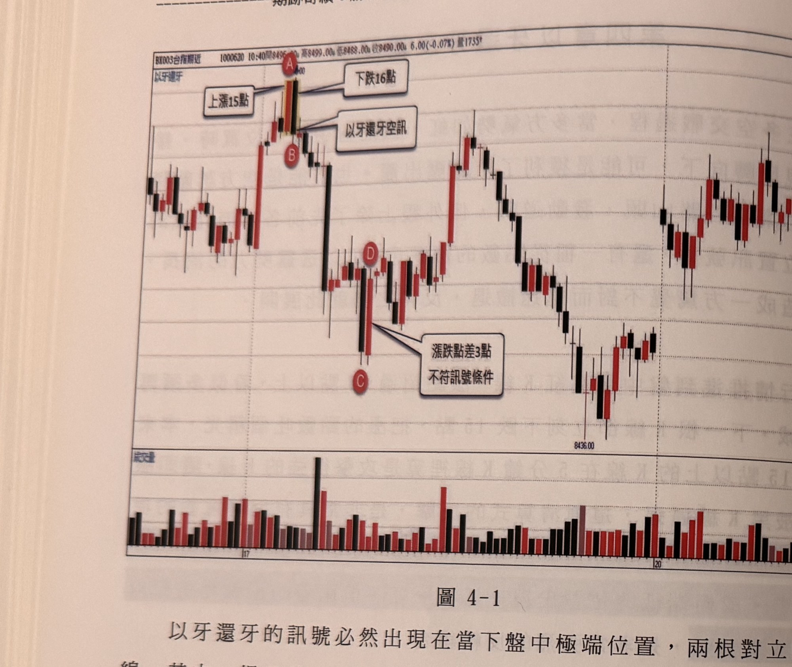

- **圖4-2**（p.85，台指期近月5分鐘K線）：A黑K下跌17點為當下盤中最低K線，隔根B紅K上漲18點，兩者低點相同（壘底），漲跌點差1點，符合以牙還牙買訊；進場後連續6根紅K線至C，隔根D未創新高收黑，五紅遇首黑宜快速平倉。示範3.2定義與6.節之出場提示。

  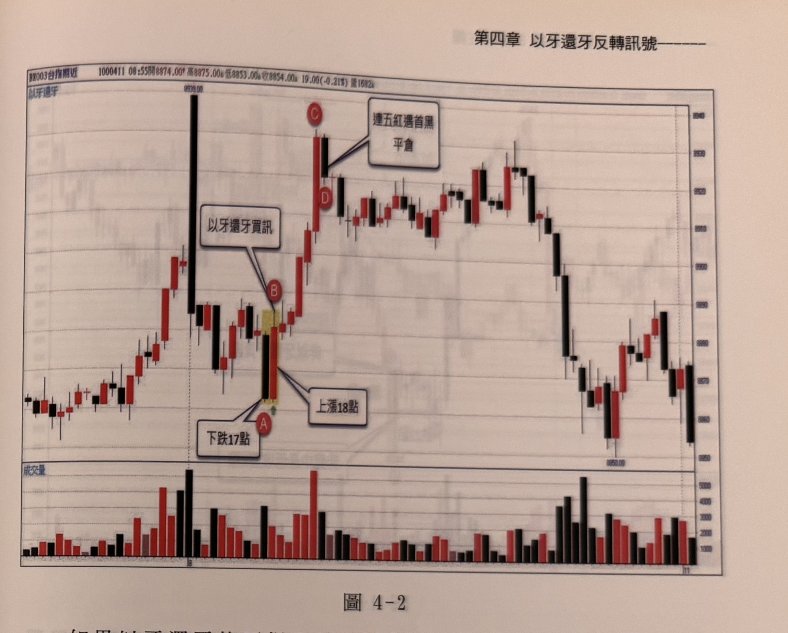

- **圖4-3**（p.86）：B看似當下盤中極端最低點並與紅K線C構成以牙還牙買訊，但B的極端最低收盤其實高於先前的最低收盤價A，故B不是真正的極端最低K線，因此**C不是以牙還牙買訊**（即使進場恰巧獲利也不可將錯就錯）。示範7.條過濾規則2（母K須同時符合最高/最低點與收盤同為極端）。

  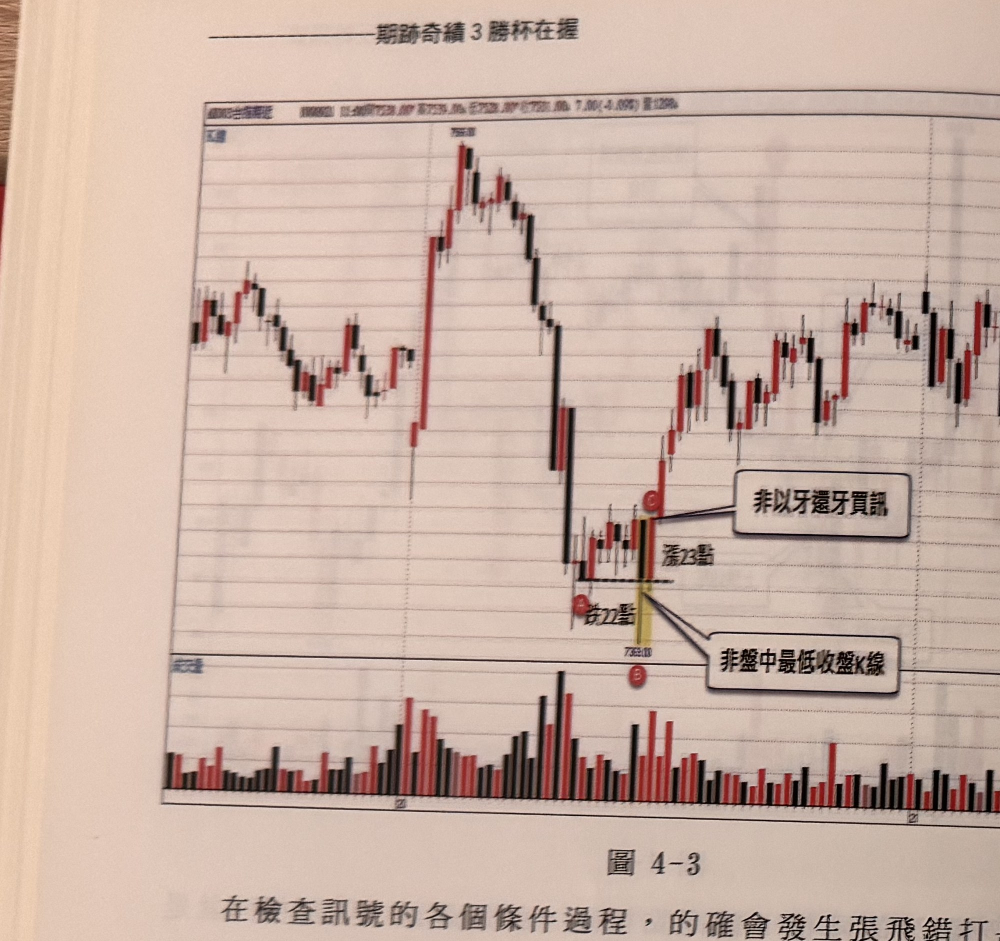

- **圖4-4**（p.87）：開低21點反彈攻過平盤，A以漲25點上攻力道強勁，隔根B黑K將漲點全部吐回（跌25點），構成以牙還牙空訊；因漲跌點超過20點，不立刻放空，待反彈至距組合高點20點以內的區域（黃色標示區）再補進場放空，行情雖一度反彈至C但未觸及停損。示範4./5.節「漲跌點>20點須等拉回至20點內補進場」規則。

  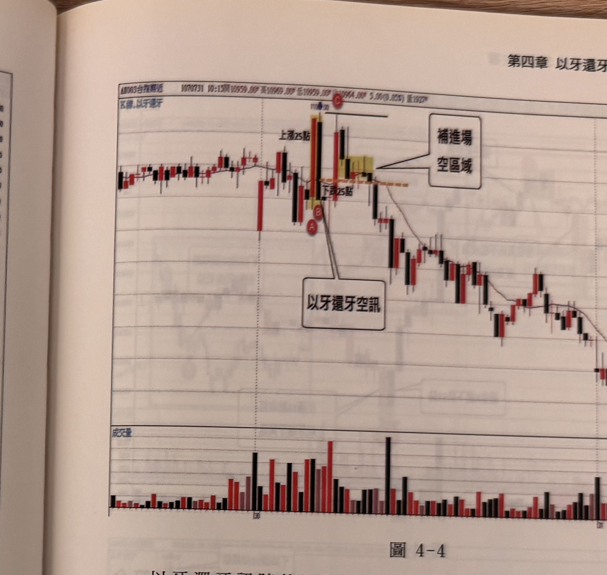

- **圖4-5**（p.88，台指期近月5分鐘K線）：A、B構成以牙還牙買訊，漲跌點僅12點（相對較小），仍展現行情反轉效果，但作者說明點數愈小、可靠度愈低。示範7.條過濾規則4的提醒。

  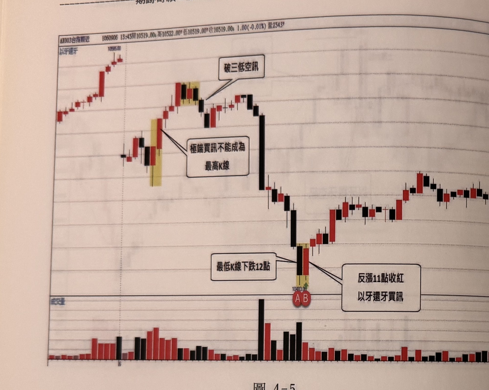

- **圖4-6**（p.89，台指期近月5分鐘K線）：連續三段（A、B、C）皆為漲跌點10點以下的以牙還牙訊號，訊號雖成立但精確度較低、易生雜訊，最終行情反覆震盪後才緩步上攻。示範漲跌點過小訊號的雜訊風險。

  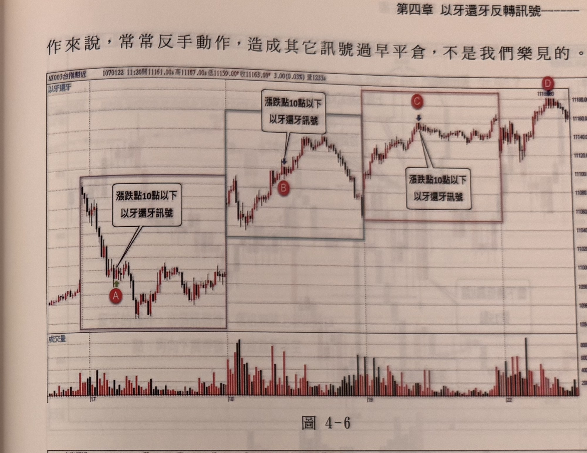

- **圖4-7**（p.89，台指期近月5分鐘K線）：A、B、C三處皆為漲跌點10點以下的以牙還牙訊號，與圖4-6同樣示範小點數訊號的雜訊特性。

  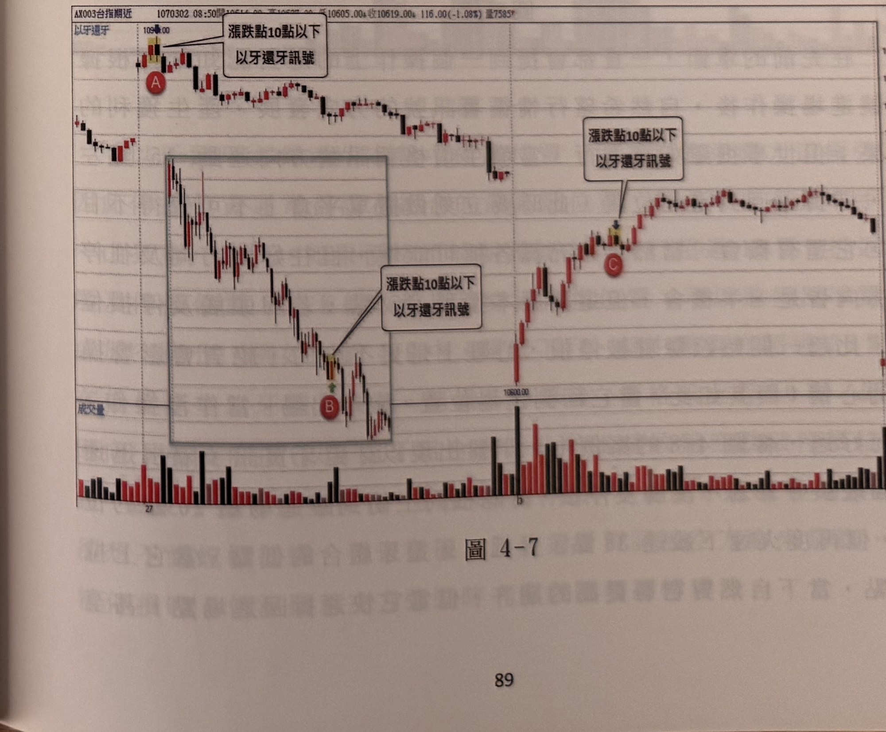

- **圖4-8**（p.90）：早盤出現以牙還牙買訊，隔根迅速拉回收長下影線但未觸停損，再隔根上衝至距進場點20點處，隨即又火速下殺達38點、直抵以牙還牙組合低點；規則要求在價格快速折回進場點、甚至僅拉回15點時就應啟動停利或不賺保平安快速撤出，不必等到真正觸及停損。示範6.節規則1（15點折返平倉）。

  

- **圖4-9**（p.91）：開低下行、盤中震幅超過30點，低檔出現以牙還牙買訊，但進場後價格只上行10點（未達15點門檻）即拉回向下觸及停損（組合低點），且K線收盤確認跌破停損位置，依規則**反手**放空並設20點停損，隨後行情持續破底下殺。示範6.節規則2（條件式反手）。

  

- **圖4-10**（p.92，台指期近月5分鐘K線）：AB形成以牙還牙買訊（漲跌點12點），隨即被行情打臉觸及停損，於C收盤反手放空；行情下跌至DE再度產生以牙還牙買訊時，因當日AB買訊已失敗，須忽略DE訊號，不可再進場。示範7.條過濾規則3與反手操作概念。

  

- **圖4-11**（p.93，台指期近月5分鐘K線）：A漲23點，外觀看似當下最高K線，但收盤不是最高收盤（開盤後第二根紅K的收盤才是最高收盤），故AB不能視為以牙還牙空訊，即使後續行情確實下跌也不宜將錯就錯；隨後盤中低點另出現有效的以牙還牙買訊。示範7.條過濾規則2（最高/最低K線需收盤同時最高/最低）。

  

- **圖4-12～4-15**（p.94–95，台指期近月5分鐘K線）：書中僅列圖無額外文字說明，供讀者自行練習辨識以牙還牙空訊／買訊，並與「頂倒V空訊」「底雙紅買訊」「區間破三低空訊」等其他訊號並陳於同一走勢圖中。

  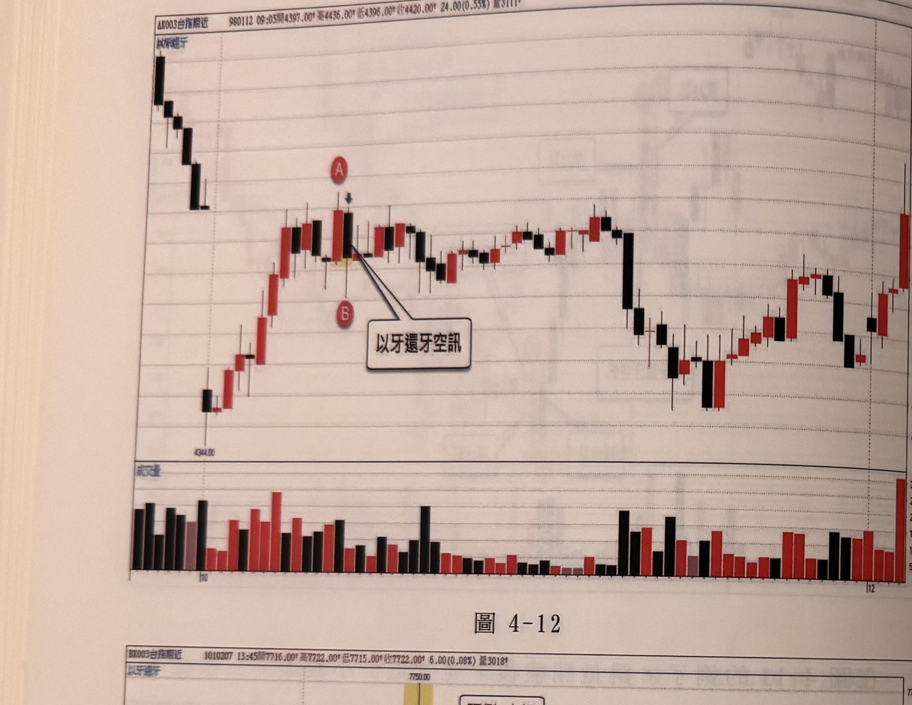
  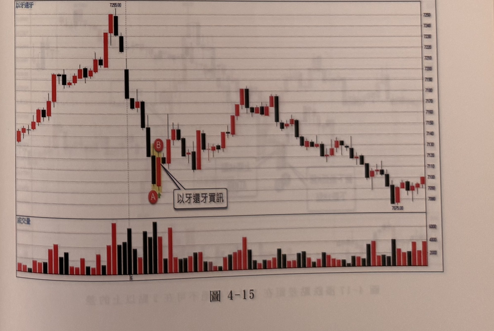

- **圖4-16**（p.96，台指期近月5分鐘K線）：A紅K上漲15點成為當下最高K線，隔根B黑K下跌15點，漲跌點前後完全等幅（差0點），示範以牙還牙漲跌點幾乎完全對稱的典型外觀。

  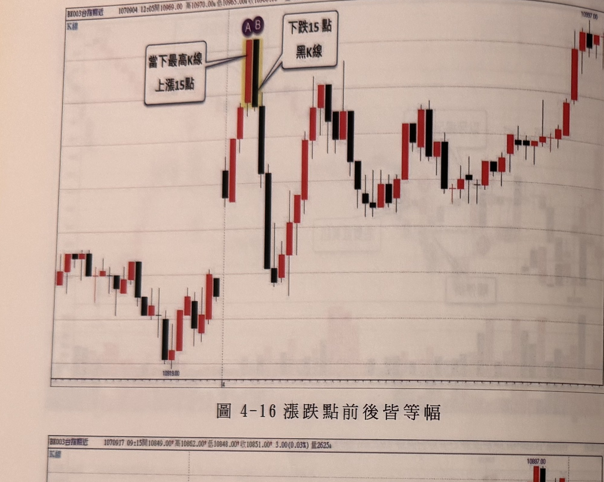

- **圖4-17**（p.96，台指期近月5分鐘K線）：A黑K下跌18點為當下最低K線，隔根B紅K上漲19點，漲跌點差距僅1點，圖說明白強調「差距在1點內，絕不可在2點以上的差」，訊號後行情強勢反轉向上。示範3.2定義C3的精確門檻。

  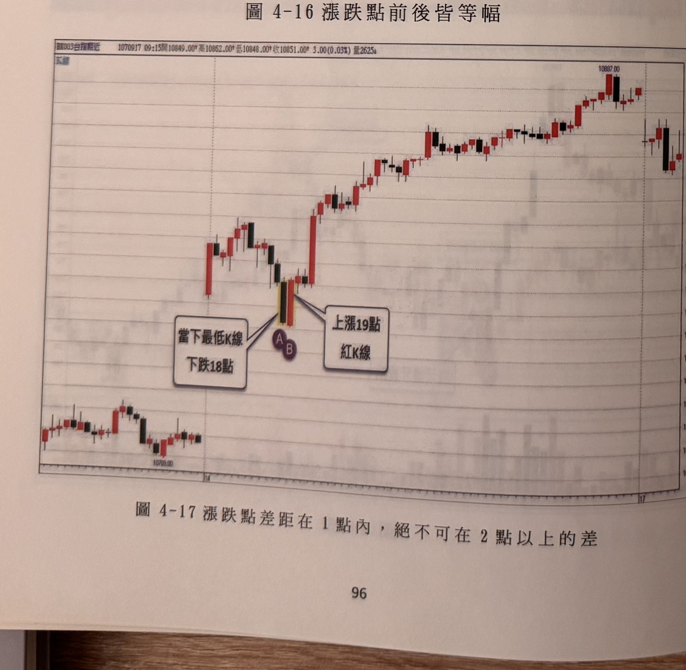

- **圖4-18**（p.97，台指期近月5分鐘K線）：A、B構成以牙還牙空訊，訊號後行情持續破底。

  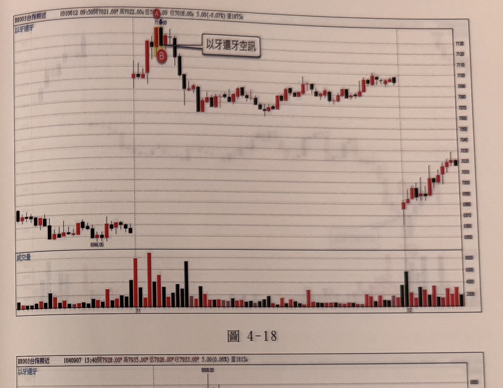

- **圖4-19**（p.97，台指期近月5分鐘K線）：A、B構成以牙還牙空訊，但隨即被行情反轉打臉，於C處觸及水平參考線轉為反手買進，之後行情強勢上攻。示範反手操作的實例（與圖4-10的失敗反手情境相呼應）。

  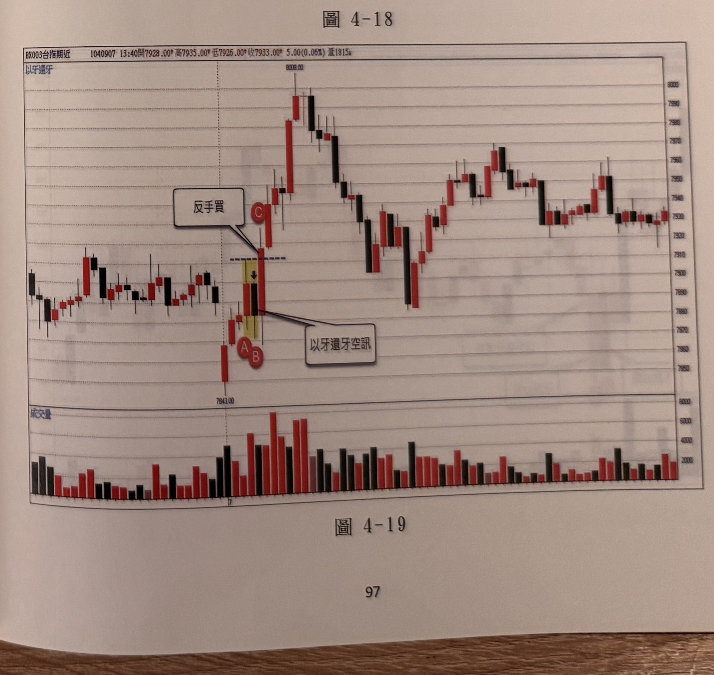


## 9. 作者提醒與常見錯誤

- 判斷最高／最低K線時，容易只看外觀最高（最低）點，忽略「收盤也必須是當下最高（最低）收盤」這項同等重要的條件，導致誤判以牙還牙訊號（p.93）。
- 漲跌點差距的1點限制是嚴格門檻，不宜任意放寬；點數雖小（10點以下）仍可能成立訊號，但可靠度會明顯下降，容易造成雜訊與停損（p.88）。
- 同一天同一類型的以牙還牙訊號，第一次失敗後就不可再依此類型二次進場，避免反覆進出、干擾其他訊號的正常操作（p.92）。
- 訊號失敗觸停損後雖可採取反手操作，但作者提醒常常反手會造成其他訊號過早平倉，並非整體操作樂見的常態（p.88–89）。

## 10. 規則速查（Checklist）

**以牙還牙空訊（空）**
- [ ] 前一根K線（A）為當下盤中最高K線（最高點最高＋收盤最高同時成立），且為紅K，漲點X
- [ ] 隔一根K線（B）為黑K，跌點Y
- [ ] |X−Y| ≤ 1點
- [ ] 漲跌點≤20點：訊號K收盤確認後直接進場放空；>20點：等拉回至距組合高點20點內再補空
- [ ] 停損＝以牙還牙組合最高點
- [ ] 進場後獲利曾達約15點又折返回進場價 → 立刻撤單平倉
- [ ] 進場後未達15點獲利即折返觸及停損（收盤確認）→ 反手買進，設20點停損
- [ ] 同一天若已有以牙還牙訊號失敗，當天不可再依此類型二次進場

**以牙還牙買訊（多）**
- [ ] 前一根K線（A）為當下盤中最低K線（最低點最低＋收盤最低同時成立），且為黑K，跌點X
- [ ] 隔一根K線（B）為紅K，漲點Y
- [ ] |X−Y| ≤ 1點
- [ ] 漲跌點≤20點：訊號K收盤確認後直接進場買進；>20點：等拉回至距組合低點20點內再補多
- [ ] 停損＝以牙還牙組合最低點
- [ ] 進場後獲利曾達約15點又折返回進場價 → 立刻撤單平倉
- [ ] 進場後未達15點獲利即折返觸及停損（收盤確認）→ 反手放空，設20點停損
- [ ] 同一天若已有以牙還牙訊號失敗，當天不可再依此類型二次進場

## 11. 機器可讀規則

```yaml
signal: 以牙還牙
timeframe: 5m
directions:
  short:
    name: 以牙還牙空訊
    conditions:
      - id: C1
        desc: 前一根K線為當下盤中最高K線（最高點最高且收盤最高同時成立），且為紅K線
        source: p.84, p.93
      - id: C2
        desc: 隔一根K線為黑K線
        source: p.84
      - id: C3
        desc: 兩根K線各自漲跌點數差距 ≤1點
        source: p.84, p.96
    entry: 漲跌點≤20點時訊號K（B）收盤確認後市價放空；>20點時等拉回至距組合高點20點內再補空
    stop_loss: { level: "以牙還牙組合最高點（A、B較高者）", max_points: 20, source: "p.87, p.91" }
    exit:
      retracement_15_flat:
        desc: 獲利曾達約15點又折返回進場價 → 立刻撤單平倉
        source: p.90
      conditional_reversal:
        desc: 未達15點獲利即折返、且K線收盤確認跌破停損位置 → 反手買進，設20點停損
        source: p.91
      other: 範例提及「連五紅遇首黑平倉」，屬另一訊號，見q3-06
  long:
    name: 以牙還牙買訊
    conditions:
      - id: C1
        desc: 前一根K線為當下盤中最低K線（最低點最低且收盤最低同時成立），且為黑K線
        source: p.84, p.88
      - id: C2
        desc: 隔一根K線為紅K線
        source: p.84
      - id: C3
        desc: 兩根K線各自漲跌點數差距 ≤1點
        source: p.84
    entry: 漲跌點≤20點時訊號K（B）收盤確認後市價買進；>20點時等拉回至距組合低點20點內再補多
    stop_loss: { level: "以牙還牙組合最低點（A、B較低者）", max_points: 20, source: "p.87, p.91" }
    exit:
      retracement_15_flat:
        desc: 獲利曾達約15點又折返回進場價 → 立刻撤單平倉
        source: p.90
      conditional_reversal:
        desc: 未達15點獲利即折返、且K線收盤確認突破停損位置 → 反手放空，設20點停損
        source: p.91
filters:
  - desc: 極端位置前提：盤中震幅 ≥30點，或極端點距平盤 ≥40點（定義同前面各章）
    source: p.84
  - desc: 漲跌點數>20點時不可直接進場，須等拉回至距組合極端點20點內
    source: p.87
  - desc: 訊號K（B）越過A的極端點 → A不再是當下最高/最低K線，不成立
    source: p.84
  - desc: 漲跌點差距超過1點（尤其2點以上）→ 即使壘頂/壘底外觀相同，仍不成立以牙還牙訊號
    source: p.84
  - desc: 母K未同時符合最高點最高與收盤最高（或最低點最低與收盤最低）→ 不是合法最高/最低K線
    source: p.93
  - desc: 同一天同一類型訊號第一次失敗後 → 第二次出現須忽略，不可再進場
    source: p.92
  - desc: 漲跌點數過小（<10點）→ 訊號可靠度較低，容易雜訊與停損（提醒，非強制排除）
    source: p.88
```

## 12. 待確認事項

無。缺頁僅影響範例圖，見 frontmatter `missing_pages`。

## 13. 原文出處

- `extracted/pages/IMG_8367.md`（p.82 空白頁；p.83 章首）
- `extracted/pages/IMG_8368.md`（p.84–85，圖4-1、圖4-2）
- `extracted/pages/IMG_8369.md`（p.86–87，圖4-3、圖4-4）
- `extracted/pages/IMG_8370.md`（p.88–89，圖4-5、圖4-6、圖4-7）
- `extracted/pages/IMG_8371.md`（p.90–91，圖4-8、圖4-9）
- `extracted/pages/IMG_8372.md`（p.92–93，圖4-10、圖4-11）
- `extracted/pages/IMG_8373.md`（p.94–95，圖4-12、圖4-13、圖4-14、圖4-15）
- `extracted/pages/IMG_8374.md`（p.96–97，圖4-16、圖4-17、圖4-18、圖4-19）
