# 過三高買訊／破三低空訊

> 一句話摘要：行情在盤中極端高（低）位置出現之後，若首次有一根K線的**收盤**同時跌破（突破）前1根與前3根K線的區間低（高）點，且該K線須在極端K線後4根K線以內、收盤未被其他K線遮蔽，代表原有慣性遭到破壞，構成反轉空訊（買訊）。

## 1. 核心概念

在5分鐘K線的價格運動中，行情遵循慣性不斷墊高或不斷創低，直到某種反轉現象中止這個慣性。從大波段的角度看，漲勢中止的訊號是跌破前一波低點，跌勢中止的訊號是突破前一波高點；中止不一定代表反轉，也可能只是讓原趨勢陷入整理（p.101）。

中止趨勢的最初徵兆，是K線**收盤**跌破前一根K線低點（漲勢末端）或收盤突破前一根K線高點（跌勢末端），此現象稱為「破一低」或「過一高」，是轉折的第一徵兆。但只破一根或兩根K線的高低點，反轉效力有限；作者發現，一次跌破（突破）**前三根**K線區間的低（高）點，其反轉效果比只破一、二根K線的高低點更可靠（p.101）。

因此，本訊號的核心是：盤中行情來到最高位置後，第一次出現K線收盤**同時**跌破前1根與前3根K線低點，才是真正的破三低空訊；反之，盤中行情來到最低位置後，第一次出現K線收盤**同時**突破前1根與前3根K線高點，才是真正的過三高買訊（p.101–102）。

## 2. 適用前提

1. 週期為5分鐘K線（p.101）；商品以台指期為主，書中另有小DAX、金融時報期指、A50、日經指數期貨的實例（p.116–117），顯示可跨商品套用，惟需留意海期商品訊號常出現大幅K線，停損點數宜自行評估（p.116）。
2. 「破三低空訊」須發生在盤中最高K線出現之後，且**自最高K線出現起算，中途沒有任何一根K線的收盤曾經跌破前1根K線最低點**，直到本次才第一次同時跌破前1根與前3根K線低點，才算數（p.101–102）。
3. 「過三高買訊」對稱要求：自盤中最低K線出現起算，中途沒有任何一根K線的收盤曾經突破前1根K線最高點，直到本次才第一次同時突破前1根與前3根K線高點（p.102）。
4. 跳空開盤時的特殊前提：
   - 跳高開盤後短暫盤整再突破，除非行情已產生「層級1谷點」（左右至少各有一根低點較高的K線），否則過三高視為無效訊號（p.103）。
   - 跳低開盤後短暫盤整再跌破，除非行情已產生「層級1峰點」（左右至少各有一根高點較低的K線），否則跌破三低並無意義（p.103）。
   - 層級1峰點／谷點的判定方式沿用《期貨奇績2》第五章介紹的轉折峰谷點概念，本文件僅轉述其判斷準則，未重新展開完整定義。
5. 優先順序：跳高開盤先找破三低空訊，若出現層級1谷點才考慮過三高買訊；跳低開盤先找過三高買訊，若出現層級1峰點才考慮破三低空訊（p.104）。
6. **訊號K線與極端K線的距離上限（p.107，圖5-6）**：訊號K線必須出現在極端K線（峰點／谷點）之後**最多4根K線以內**（即兩者間最多間隔3根K線）；超過4根K線才跌破／突破三高低點，**不視為有效訊號**（p.107：「一個突破三高的買訊，離盤中最低K線（必須是最低谷點）在四根內...頂多間隔三根K線，超過就不視為訊號」；圖5-6中F的收盤雖跌破三低，但距離峰點E已超過4根K線，不能當作放空訊號）。
7. **訊號K線須為「無遮蔽」的極值K線（p.106，圖5-5）**：破三低空訊的訊號K線，其收盤必須是自最高K線出現後**最低的、未被其他K線低點遮蔽**的收盤——若峰點與訊號K線之間，有任一根K線的**最低點低於**訊號K線的收盤，即形成「遮蔽」，訊號**不成立**（過三高買訊鏡像：訊號K線收盤須是自最低K線後最高、未被其他K線高點遮蔽的收盤）。
8. **跳空情境下的停損參考點**：跳空且已形成層級1谷點（過三高）／層級1峰點（破三低）時，停損位置宜優先設在該層級1谷點／峰點，而非單純的盤中極端K線高低點；若要以層級1谷（峰）點為停損，須等拉回使進場點與該點距離縮小至20點以內才進場（p.106，圖5-5）。
9. **極端位置的最低震幅門檻（p.118，圖5-21，新增／存疑）**：圖5-21以滬深300為例，圖說明白提醒「特別留意其界定極端位置，必須盤中高低距離在20點以上，才能使用極端訊號」，並以深藍矩形框標示「界定極端位置距離20點」；惟本章正文未再另行針對台指期或其他商品給出通用的震幅門檻數字，與第一章（q3-01）就台指期訂出的30點（或距平盤40點）規則是否相同、抑或依商品另訂，原文並未說明，**列為待確認事項**（見第12節），暫不更動程式預設行為。

## 3. 訊號定義

### 3.1 破三低空訊（空方）

1. **C1** 行情已出現「當下盤中最高K線」，且自該K線起算，尚未有任何一根K線收盤跌破前1根K線最低點。（p.101–102）
2. **C2** 訊號K之前，本交易日須有滿3根K線可供比較（p.104「破三根K線低點，絕對是前面要有三根K線，少一根就不算破三低」；圖5-3：開盤第一根即最高，第三根就跌破前兩根低點，不算）。比較區間是訊號K之前的3根K線，可包含最高K線本身與其之前的K線：最高K線當根收盤即跌破前三根區間低點亦成立（p.103，圖5-2），「一般都是最高K線出現後，三根K線內發生破三低訊號」（p.103）；圖5-4、5-8、5-11、5-12 皆為最高K線隔一根即跌破的案例。
   （舊版文件寫成「最高K線之後須累積3根以上K線」，會排除書中大多數範例，已更正。）
3. **C3** 出現一根K線，其**收盤同時**跌破「前1根K線最低點」與「前3根K線區間最低點」。（p.101–102）
4. **C4** 訊號K線須在最高K線之後**最多4根K線以內**出現（間隔最多3根K線），超過則無效。（p.107，圖5-6）
5. **C5** 訊號K線的收盤須是自最高K線出現後**最低、未被其他K線低點遮蔽**的收盤——若期間有任一根K線最低點低於訊號K線收盤，視為遮蔽，訊號不成立。（p.106，圖5-5）

### 3.2 過三高買訊（多方，與3.1鏡像）

1. **C1** 行情已出現「當下盤中最低K線」，且自該K線起算，尚未有任何一根K線收盤突破前1根K線最高點。（p.102）
2. **C2** 訊號K之前本交易日須有滿3根K線可供比較（區間可含最低K線本身與其之前的K線）。（p.103–105）
3. **C3** 出現一根K線，其**收盤同時**突破「前1根K線最高點」與「前3根K線區間最高點」。（p.102）
4. **C4** 訊號K線須在最低K線之後**最多4根K線以內**出現（間隔最多3根K線），超過則無效。（p.107，鏡像）
5. **C5** 訊號K線的收盤須是自最低K線出現後**最高、未被其他K線高點遮蔽**的收盤——若期間有任一根K線最高點高於訊號K線收盤，視為遮蔽，訊號不成立。（p.106，鏡像）

## 4. 進場

- 訊號K線收盤確認後即可進場（圖5-1範例：B收盤放空、D收盤買進，p.102）。
- 若訊號K線本身為「大K線」（跌／漲點數偏大），距離盤中極端位置（最高／最低點）**超過20點**時，書中列出三種應對方式（p.104–105，p.112–113）：
  1. **忽略不操作**。
  2. **等待拉回／反彈**，使進場價距離極端位置縮小至20點以內，再補進場。
  3. **當下直接進場**，但停損仍設20點（屬較冒險的做法）。
- 若訊號K線距離極端位置**超過40點以上**，通常採用忽略不操作（p.112–113）。
- 若距離約**30點附近**，可等待折返，讓距離縮小至20點以內再補進場（p.112–113，圖5-11）。

## 5. 停損

- 停損設在盤中極端點（p.113：等反彈縮小至20點內再進場放空，「反而上漲觸及A高點停損」），進場價到停損的距離以**20點**為上限；距離超過20點而直接進場時，停損改設在進場價外20點（p.105「當下進場，停損仍設在20點」；p.112–113）。
- **跳空情境的停損優先參考點**：若行情跳空並已形成層級1谷點（過三高）／層級1峰點（破三低），停損宜優先設在該層級1谷（峰）點，而非單純的盤中極端K線高低點；欲以此為停損時，須等拉回使進場點與該點距離縮小至20點以內才進場，否則直接進場恐提早被鄰近K線的正常波動觸及停損（p.106，圖5-5）。
- 若訊號方向出現後，行情尚未走遠（前行不到15點）即折返並觸及停損，此後若出現K線收盤創新高或破新低，可以進行**反手操作**：反手進場後，同樣依原方向的相反方向設20點停損（p.113，圖5-12：「在C的收盤創下盤中新高時，則可以反手買進操作，並向下設20點停損位置」）。

## 6. 出場 / 停利

- **15點折返平倉（p.111，圖5-10，更正舊版「書中未明確說明停利規則」的說法）**：進場後若行情朝訊號方向前進達**15點以上**，隨後又折返回到進場價位，應在此**撤單平倉**了結，不留倉等待反轉觸及停損（p.111：「買訊出現後，上漲15點以上，當行情從B走拉回時，下跌到A的進場點時，應該撤單平倉」）。此規則與 q3-04（以牙還牙）§6 的15點折返規則一致。
- 除上述折返平倉規則外，書中未明確說明過三高／破三低訊號本身其他的停利點數或移動停損機制。

與既有部位（尤其是先前已用另一次過三高／破三低訊號建立的部位）搭配時，書中提供以下處置原則（用於判斷是否須將原部位平倉反手）：

- 若已持有多單（來自過三高買訊），之後很快又出現破三低空訊，須檢視空訊K線的**實體**是否與原買訊K線的實體**重疊**：
  - 若**重疊**，空訊視為忽略，不將原多單平倉反手（p.108，圖5-7）。
  - 若**不重疊**，空訊視為有效訊號，須將原多單平倉並反手放空（p.109，圖5-8，原文為對稱案例：先有破三低空訊，後出現不重疊的過三高買訊，須平倉反手做多）。
  - **重疊規則的前提（p.111，圖5-10）**：「實體重疊須忽略」只適用於原部位**仍持有中**的情況。若原買訊（多單）已依上述15點折返規則或其他原因**先行平倉**（或原本就選擇等拉回而未進場），則後出現的空訊即使K線收盤侵入原買訊K線的收盤，也**不算訊號重疊**，應視為全新的獨立訊號正常操作。

## 7. 過濾：不做的情況

1. 訊號K之前本交易日不足3根K線可供比較（例如開盤第一根即最高、第三根就跌破前2根低點），不能視為破三低（過三高）。（p.104–105，圖5-3）
2. 跳高開盤、短暫盤整後突破，若尚未出現「層級1谷點」，過三高視為無效訊號。（p.103，圖5-2）
3. 跳低開盤、短暫盤整後跌破，若尚未出現「層級1峰點」，破三低視為無意義。（p.103）
4. 窄幅震盪格局下，後出現的訊號若與先前**仍持有部位**的訊號K線實體重疊，後出現的訊號視為忽略，不將既有部位平倉反手；但若原部位已先行平倉（如已依15點折返規則出場，或原本未進場），則不適用此忽略規則。（p.108，圖5-7；p.111，圖5-10）
5. 訊號K線距離盤中極端位置超過40點以上者，通常採忽略不操作；書中並補充：漲跌點本身超過30點以上、且訊號位置離停損位置超過40點時，宜忽略此訊號。（p.112–113，p.114圖5-14）
6. 訊號K線與極端K線（峰／谷點）間隔超過3根K線（即超過4根K線範圍）才出現的突破／跌破，不視為有效訊號。（p.107，圖5-6）
7. 訊號K線的收盤被期間內其他K線的更低（更高）低點（高點）「遮蔽」時，不成立訊號。（p.106，圖5-5）

## 8. 範例解析

- **圖5-1**（p.102，台指期五分鐘K線）：跳平低開盤，A為當下最高K線，隔根小黑K拉回，B收盤跌破前三根K線區間最低點，形成破三低空訊；行情三段式下跌至C（當下最低，帶長下影線但收盤未突破前1根K線最高點），隔根D收盤突破前三根K線區間最高點，形成過三高買訊。示範3.1、3.2的完整定義流程。

  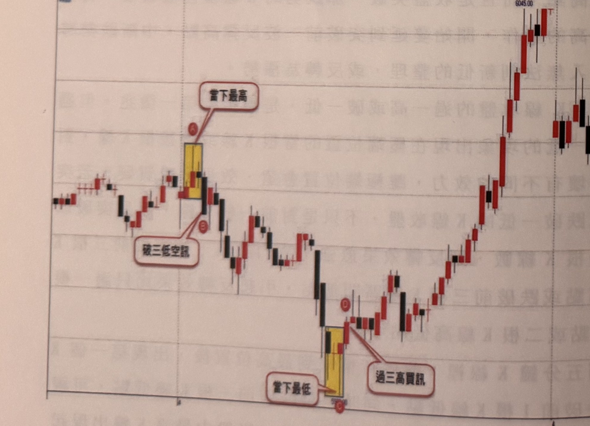

- **圖5-2**（p.103，台指期五分鐘K線）：跳高開盤，第一根K線收黑，後兩根K線內困於其高低點內，第四根大紅K突破前三根K線高點，但因未產生層級1谷點，**不能**視為過三高買訊；直到A創新高後，隔根B收盤反向跌破前三根K線低點，形成破三低空訊。示範2.條④的跳空前提與7.條過濾規則2。

  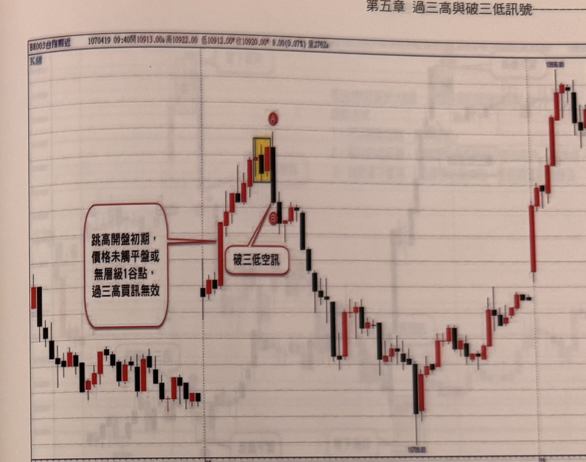

- **圖5-3**（p.104，台指期五分鐘K線）：小跳高開盤，第一根K線（A）見高後，第二、三根皆未創新高，第四根（B）收盤向下跌破前三根K線低點，形成破三低空訊；文字並強調「假設A位置最高，隔一根未創新高，而在第三根K線即出現向下跌破前二根K線低點，不能視為破三低空訊」。行情續跌至C（當下最低），隔根D形成過三高買訊。示範7.條過濾規則1的關鍵門檻（必須滿三根）。

  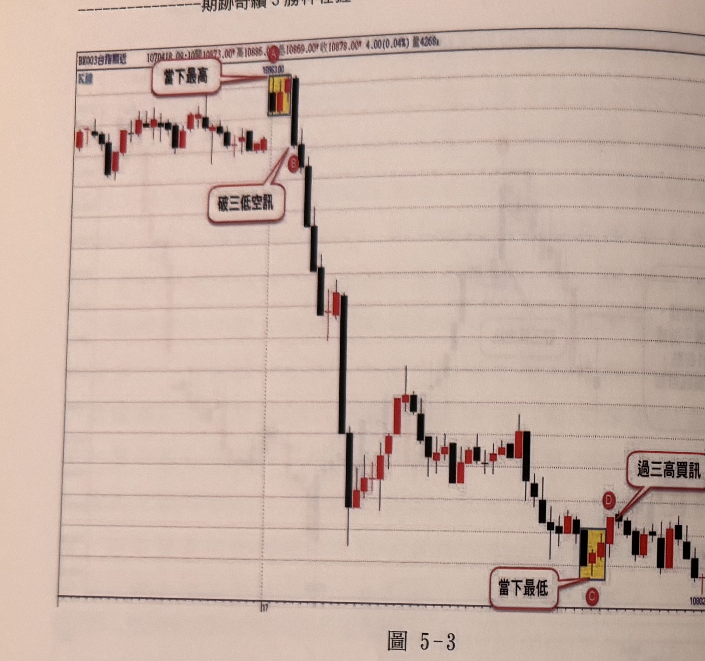

- **圖5-4**（p.105，台指期五分鐘K線）：跳高開盤後推升至B（當下最高），隔根C以大黑K線重跌超過30點形成破三低空訊，因訊號K為大K線且距極端位置逾30點，書中列出三種因應方式（忽略／等拉回補空／直接進場設20點停損）；行情續跌至D（當下最低），隔根E收盤突破三高形成買進訊號。示範4.、5.節的大K線因應原則。

  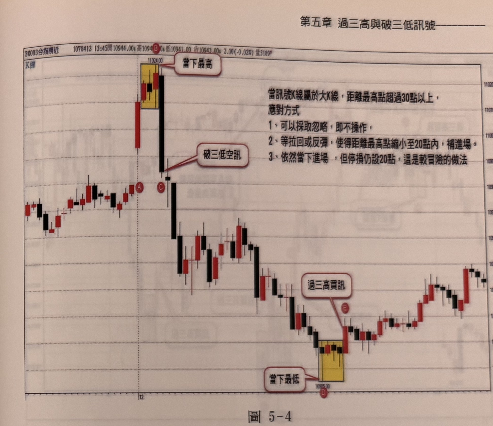

- **圖5-5**（p.106）：跳高開盤，A形成層級1谷點，B收盤突破三高構成過三高買訊，停損宜設在層級1谷點A；若要以A為停損，須等拉回至距A縮小至20點以內再進場，可避開後續兩根黑K恰觸及B低點的20點停損。行情續攻至C（盤中最高），E位置看似破三低，但C隔根D的最低點比E收盤更低，E收盤被D遮蔽，非自C出現後最低的無遮蔽K線，故**不成立**放空訊號。示範2.節⑥⑦「無遮蔽收盤」規則與跳空停損優先參考點。

  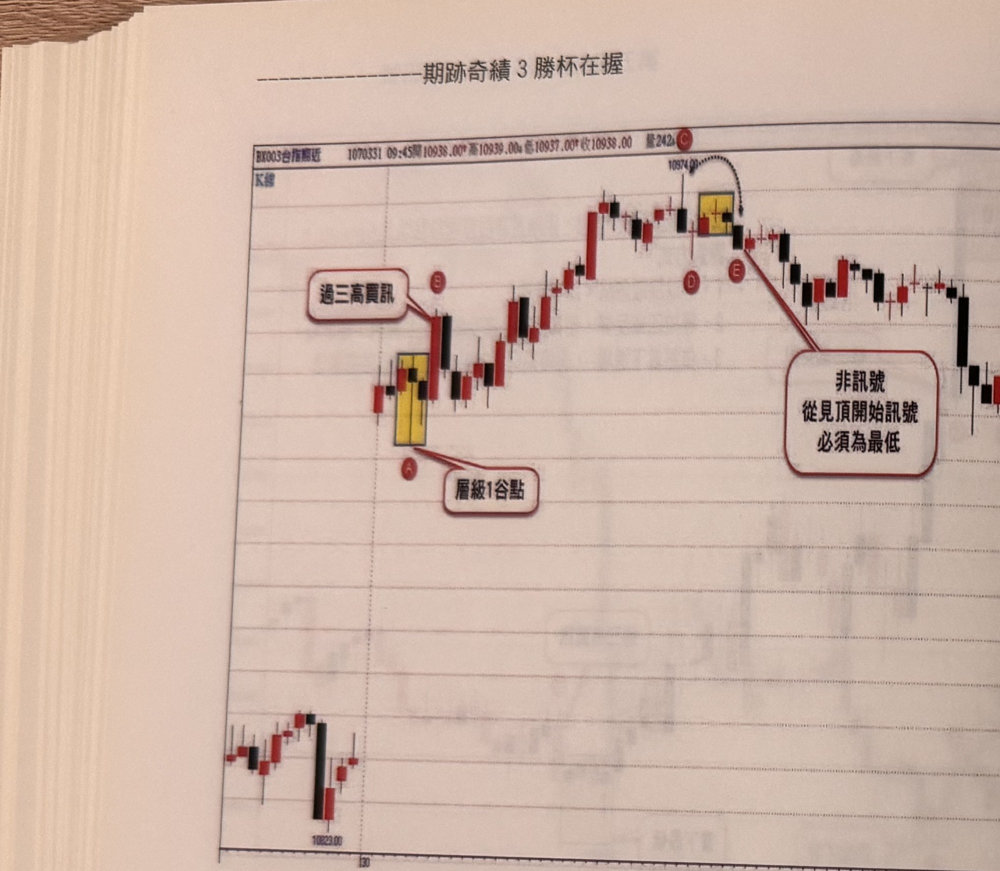

- **圖5-6**（p.107）：連續三次的過三高買訊示範訊號與盤中最低K線的距離限制；行情推升至E（盤中最高K線），隔根F收盤雖跌破三低，但F距離E峰點已超過4根K線，不能當作放空訊號。示範2.節⑥「訊號K線與極端K線間隔上限」規則。

  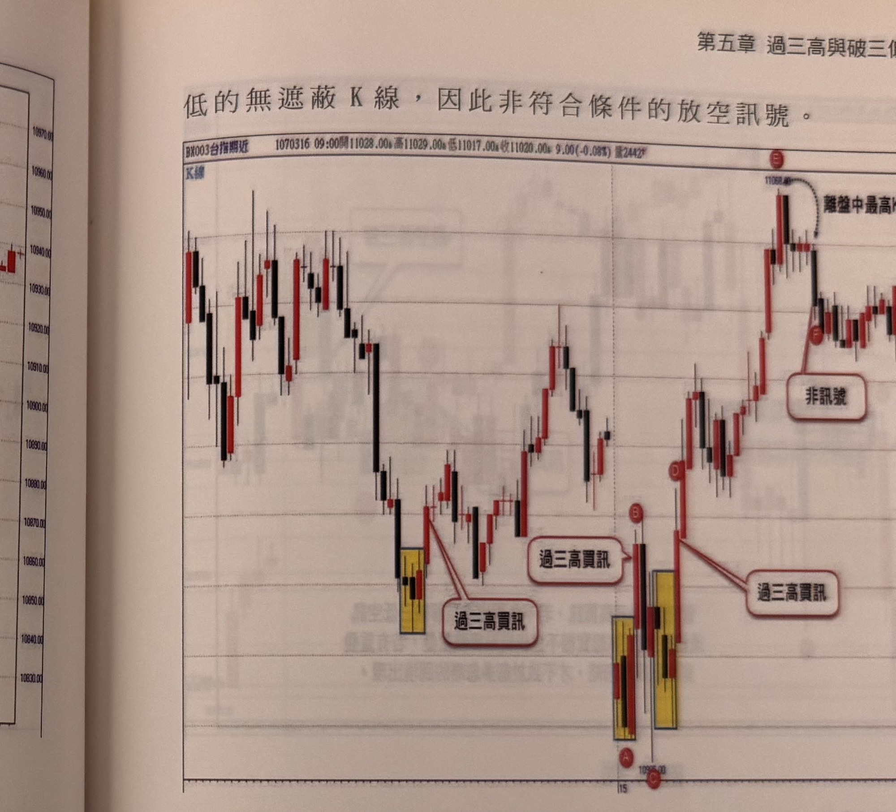

- **圖5-7**（p.108，台指期五分鐘K線）：跳低開盤後，A谷點向上於B產生過三高買訊（設20點停損），行情僅上推不到10點即於C止漲並向下於D出現破三低現象；但B買訊與D空訊的K線實體重疊，依規則D的空訊視為忽略，不必將B的多單平倉反手。示範6.節與7.條過濾規則4的實體重疊判斷。

  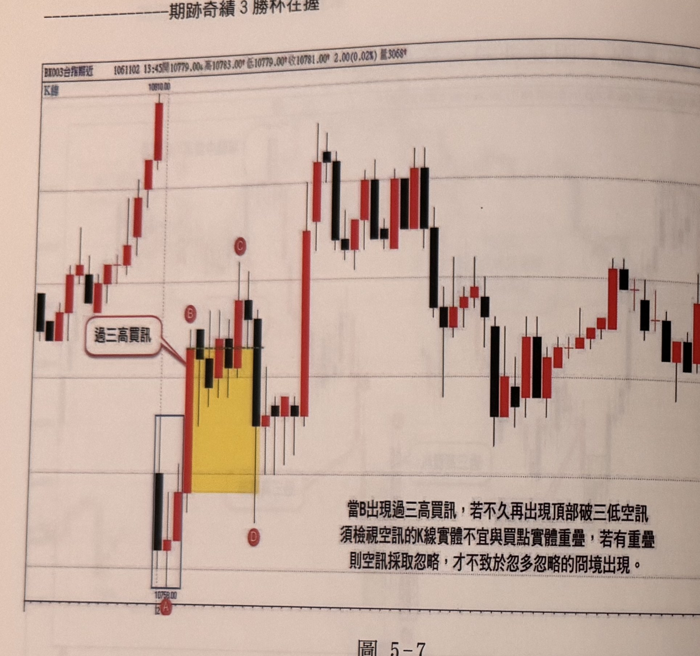

- **圖5-8**（p.109，台指期五分鐘K線）：跳高開盤推升至A，隔根B快速跌破前三根K線低點形成破三低空訊；行情下跌至C止穩、盤整後於D呈現過三高買訊，此時盤中震幅不足40點（窄幅格局），但檢視B與D的K線實體**沒有重疊**，因此D的買訊仍為有效訊號，須將B的空單平倉並反手做多。示範6.節實體不重疊時仍須依序操作。

  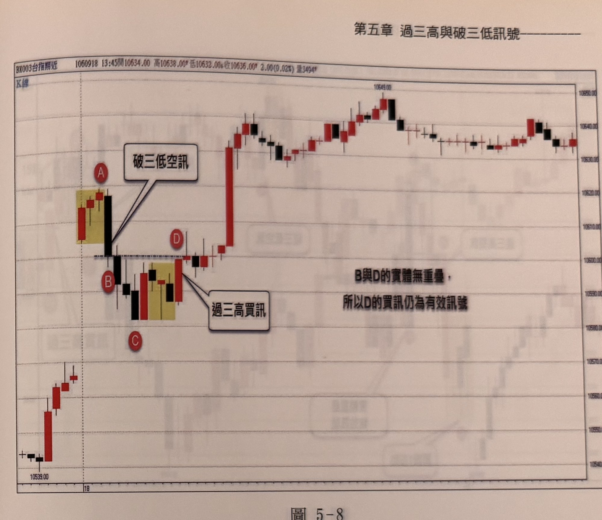

- **圖5-9**（p.110）：跳高開盤，A形成層級1谷點，B向上突破三高構成過三高買訊；行情推升不到10點後從C高點出現破三低的D空訊，但D的K線實體與B的買訊K線實體重疊，視為無效訊號，B的多單不須因D而停損反空；其後行情再攻至E見高，隔根F出現破三低，F與B實體不重疊，應將B多單平倉並反手放空。示範6.節實體重疊規則的延伸案例。

  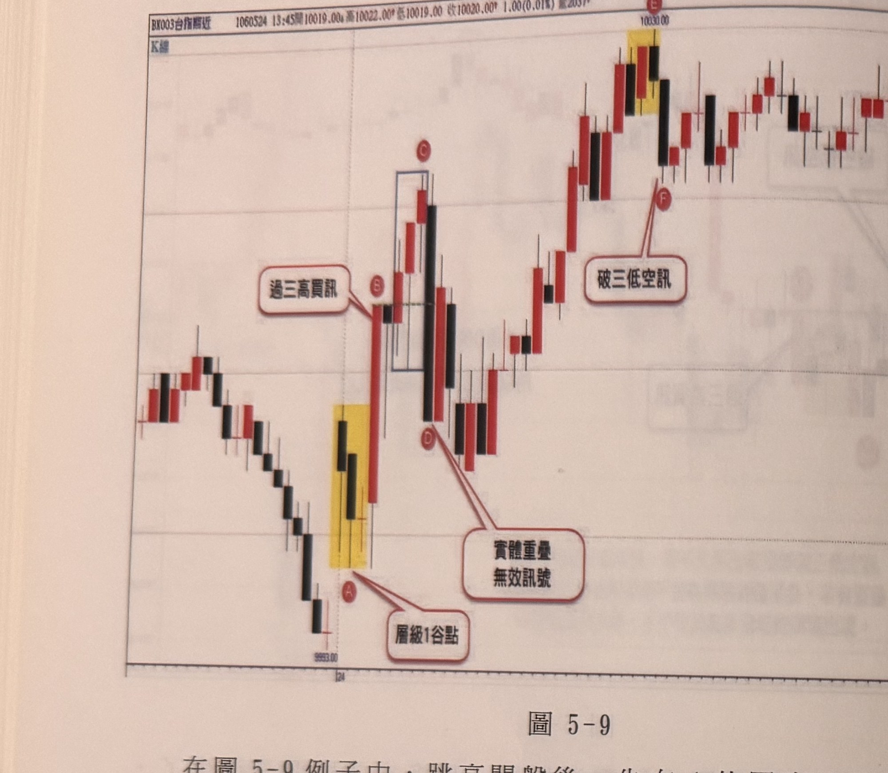

- **圖5-10**（p.111）：跳低開盤，A出現過三高買訊，訊號K線收盤與停損位置距離27點；行情走高至B已有15點獲利（此時也是盤中最高位置）卻開始拉回，依15點折返規則應在跌回A進場點時撤單平倉；隨後C出現破三低空訊，C的K線收盤雖侵入A的收盤，但因A的部位已先行平倉，不算訊號重疊，C視為新的獨立交易訊號。示範6.節「重疊規則前提」與「15點折返平倉」規則。

  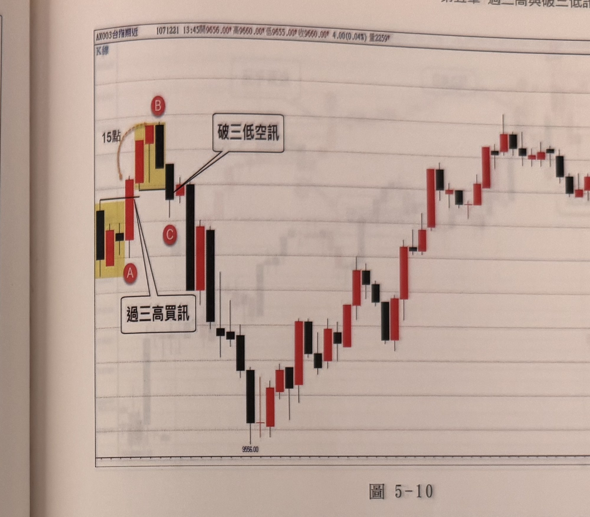

- **圖5-11**（p.112，台指期五分鐘K線）：跳高開盤推升至A（當下最高），隔根B收黑，同時形成破三低空訊與頂雙黑訊號；B收盤距A高點達32點，宜等反彈使距離縮小至20點以內於C附近補進場放空，或直接於B收盤放空並設20點停損（若直接進場，C的K線高點將觸及停損）。示範4.節大K線的三種應對方式之②③。

  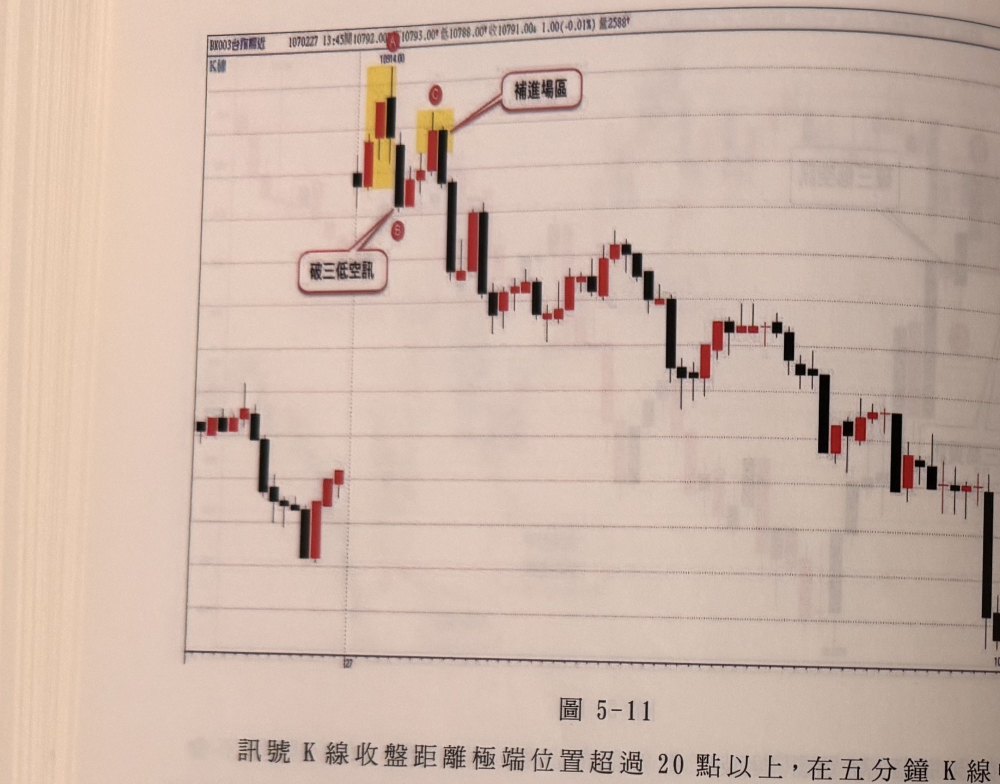

- **圖5-12**（p.113，台指期五分鐘K線）：跳高開盤連拉六根紅K至A（見高收黑），B位置形成破三低空訊，B收盤距A高點25點，若採反彈縮小至20點內再進場放空，卻反而上漲觸及A高點停損；其後C收盤創下盤中新高，可反手買進並向下設20點停損。示範5.節「前行不到15點即觸停損可反手」的具體案例。

  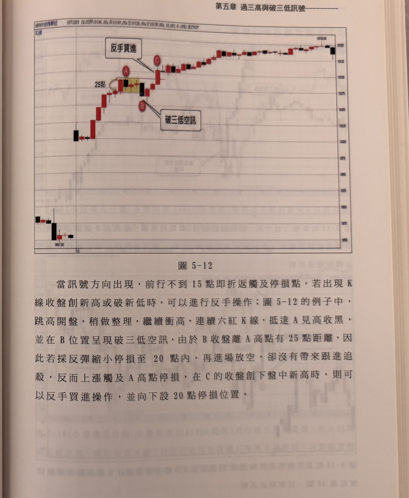

- **圖5-13**（p.114）：破三低空訊發生後行情快速下殺，累積利潤超過50點，雖D位置符合連五黑遇首紅買訊條件（可平倉），但一趟交易若已賺到50點，亦可選擇直接停止當日操作，以滿足為最高操作原則。（p.114，圖上另註記「以下各圖請讀者自行參閱」，書中無額外正文說明）

  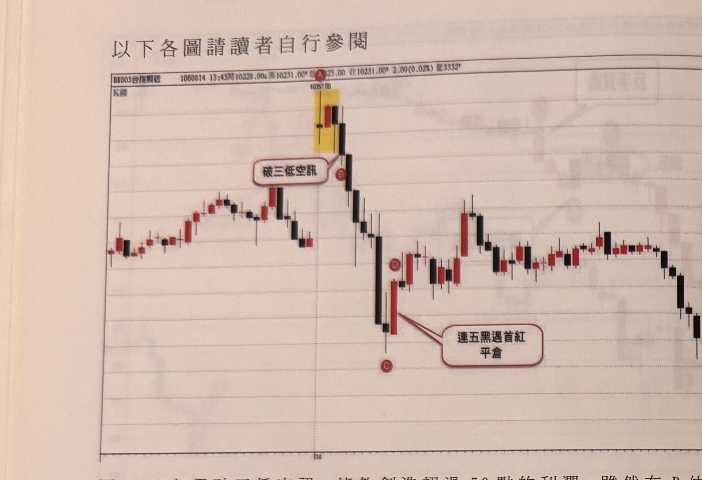

- **圖5-14**（p.114）：訊號漲跌點超過30點以上，且訊號位置離停損位置超過40點時，宜忽略此訊號；本例A處跌幅達33點，屬跌點過大的訊號。示範7.條過濾規則5。

  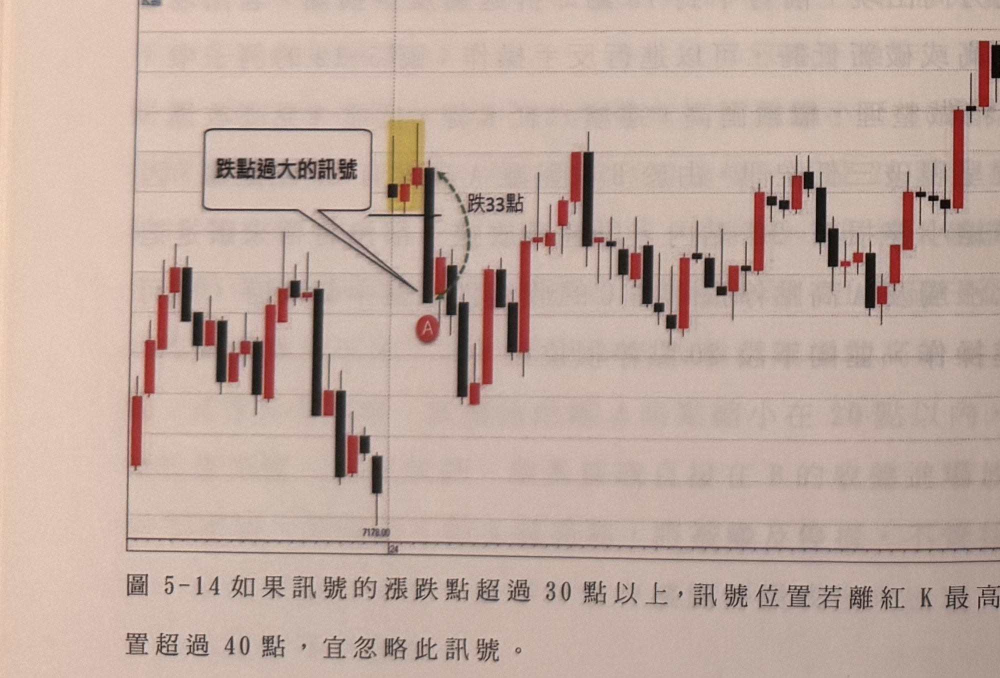

- **圖5-15**（p.115，小道瓊五分鐘，永豐期貨GLEADER）：破三低空訊案例，作者提醒海期商品震幅較大，只能控制好停損點範圍，訊號發生當下只有做與不做的選擇。

  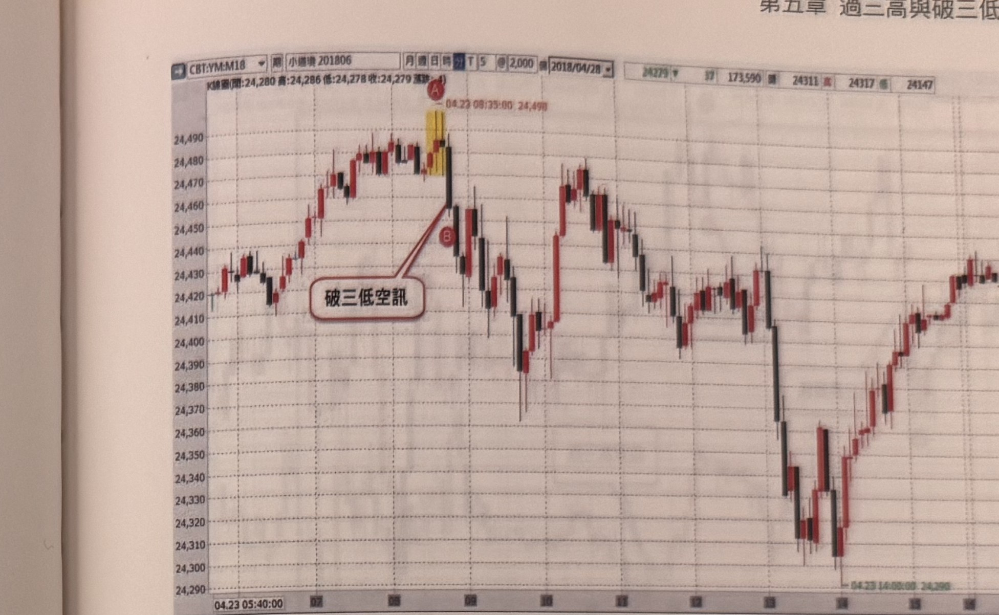

- **圖5-16**（p.115，小道瓊五分鐘，永豐期貨GLEADER）：行情出現速度盤，A出現破三低空訊後隨即快速下殺；提醒即使沒有出現連續五根黑K遇首紅的正式平倉訊號，只要獲利幅度已大、行情突然不再下跌、縮腳收紅K線時，也應警覺獲利平倉。

  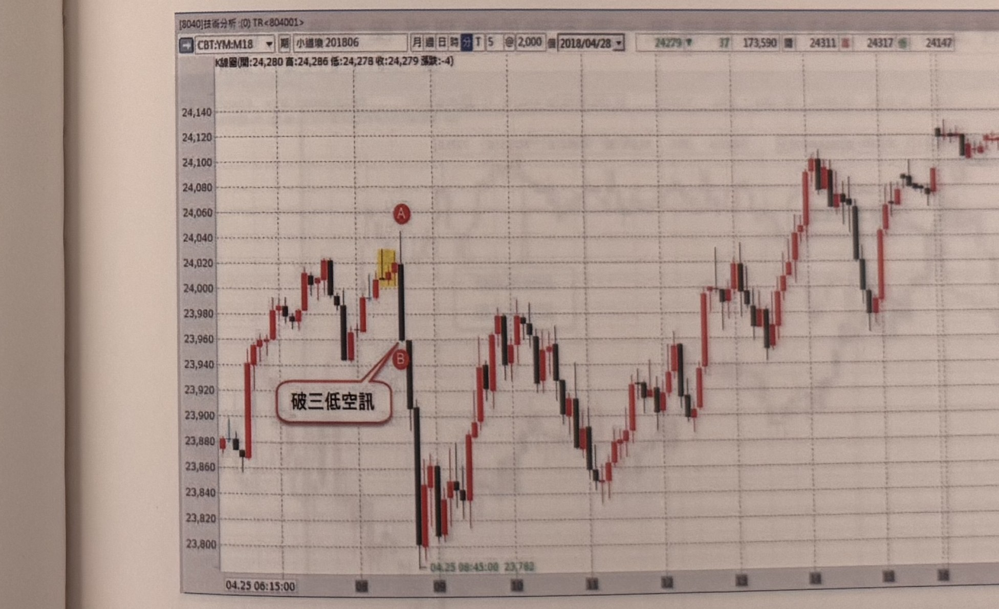

- **圖5-17**（p.116，小DAX五分鐘，永豐期貨GLEADER）：A為盤中低點，B附近出現過三高買訊，行情走高後於D附近又出現破三低空訊。作者提醒海期商品常出現大號K線，一根K線的長度大約就是停損點數，須留意此特性。

  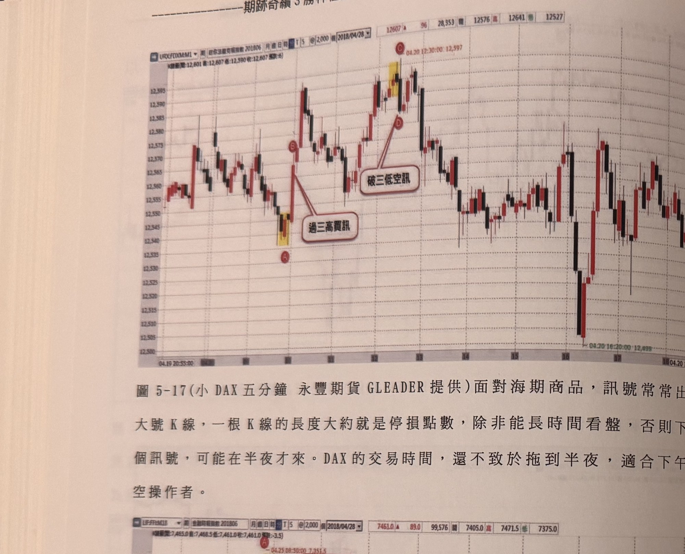

- **圖5-18**（p.116，金融時報期指五分鐘）：行情推升至A（盤中高點），B產生破三低空訊，隨即一路走低。示範訊號後行情簡潔延續的案例。

  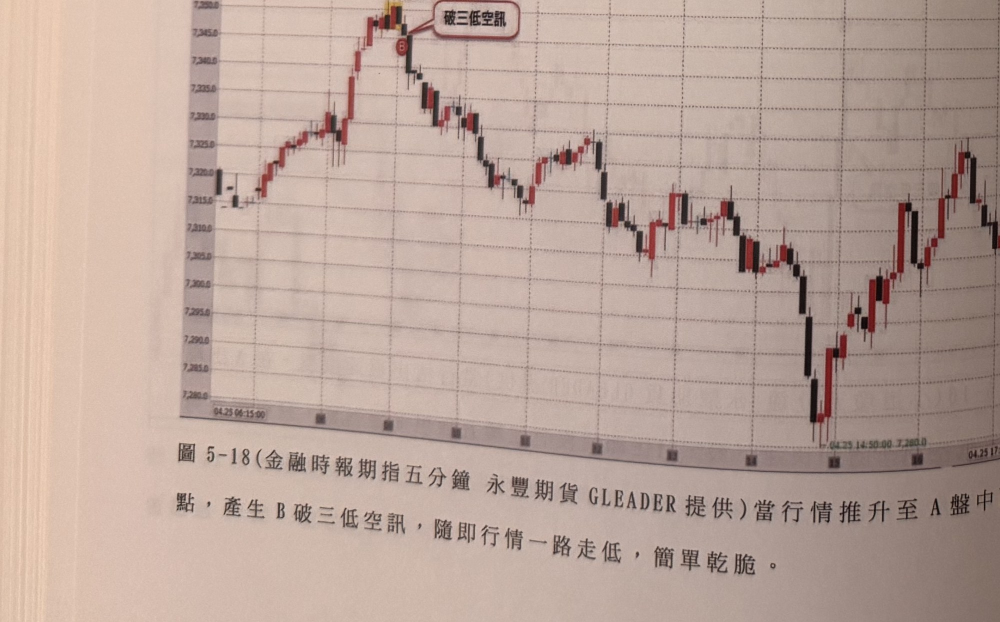

- **圖5-19**（p.117，A50五分鐘）：A為盤中最低K線，其後出現過三高買訊，訊號成立後行情持續上攻。作者提及港股小H指數與A50亦為早盤操作的另一選擇，震幅常比台股更大。

  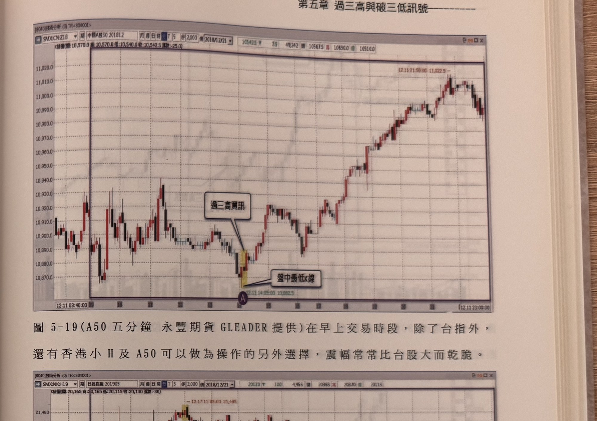

- **圖5-20**（p.117，日經指數期貨五分鐘）：同一根K線**同時**符合「頂雙黑空訊」與「破三低空訊」兩種反轉條件；文字特別提醒，先前看似也有影線甚長的頂雙黑空訊，但因它並未真正出現在盤中極端高位置（真正的先前極端位置是另一根帶長上影線的紅K），故不成立。示範訊號重疊時仍須嚴格檢視「是否位於真正的盤中極端位置」。

  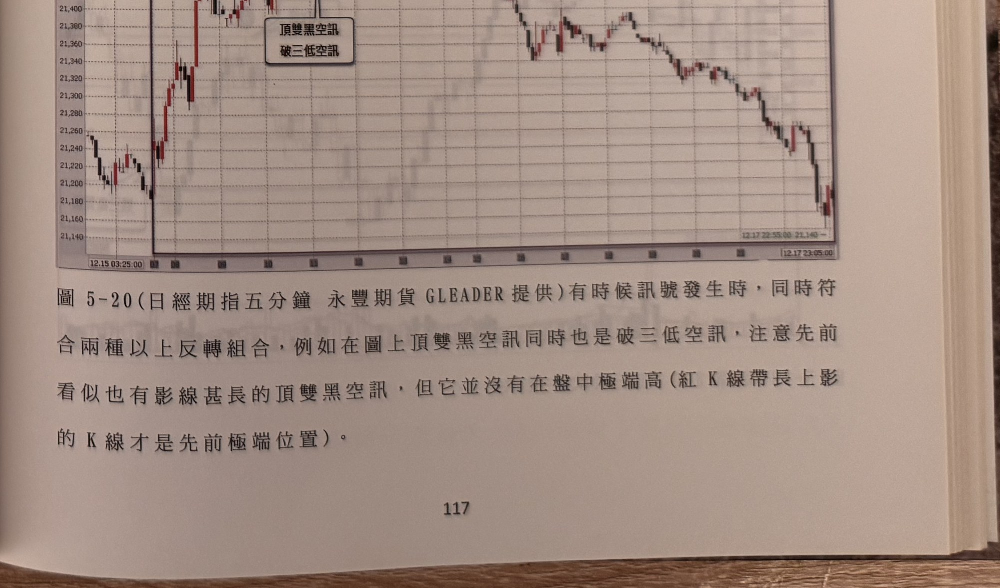

- **圖5-21**（p.118，同花順軟件提供，滬深300期貨含成交量與MAVOL副圖）：圖說明白提醒「特別留意其界定極端位置，必須盤中高低距離在20點以上，才能使用極端訊號」，圖中以深藍色矩形框標示極端位置區間並以虛線弧線標示「界定極端位置距離20點」；走勢震盪走高後攻抵破三低空訊，訊號後重挫一段，止跌小幅反彈整理，於中段出現過三高買訊，其後行情反彈走高，末段轉為下滑走勢。示範第2節新增之極端位置最低震幅門檻規則（詳見第12節待確認事項）。

  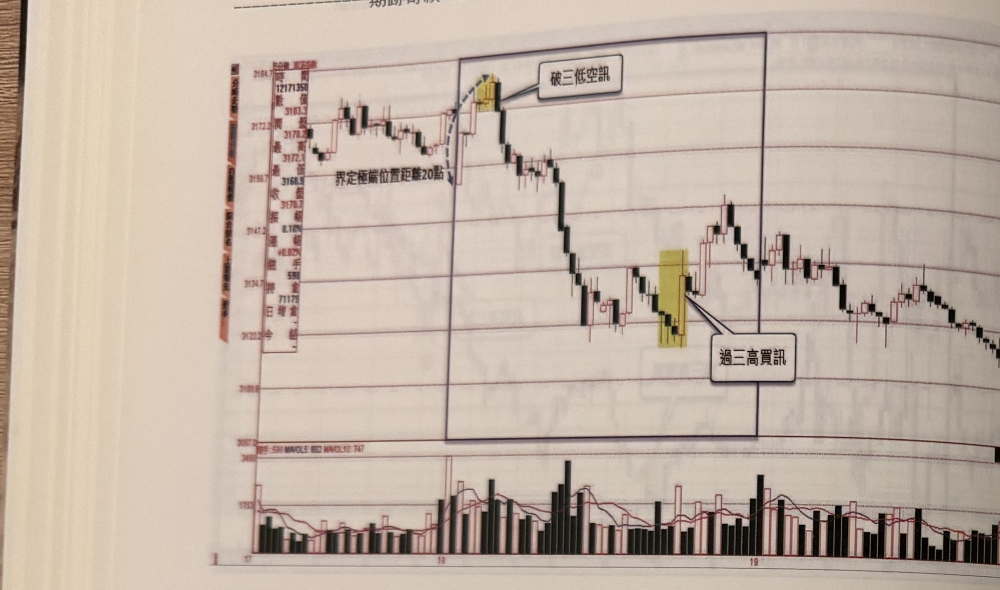

- **圖5-22**（p.118，同花順軟件提供，滬深300期貨含成交量與MAVOL副圖）：走勢震盪走高後一路重挫下殺至最低點3130.8，止跌反彈走高後攻抵一組K棒（A為上方最高K線、B為下方K棒）構成過三高買訊，訊號後行情持續反彈走高，一路盤堅上攻，收在相對高點附近。

  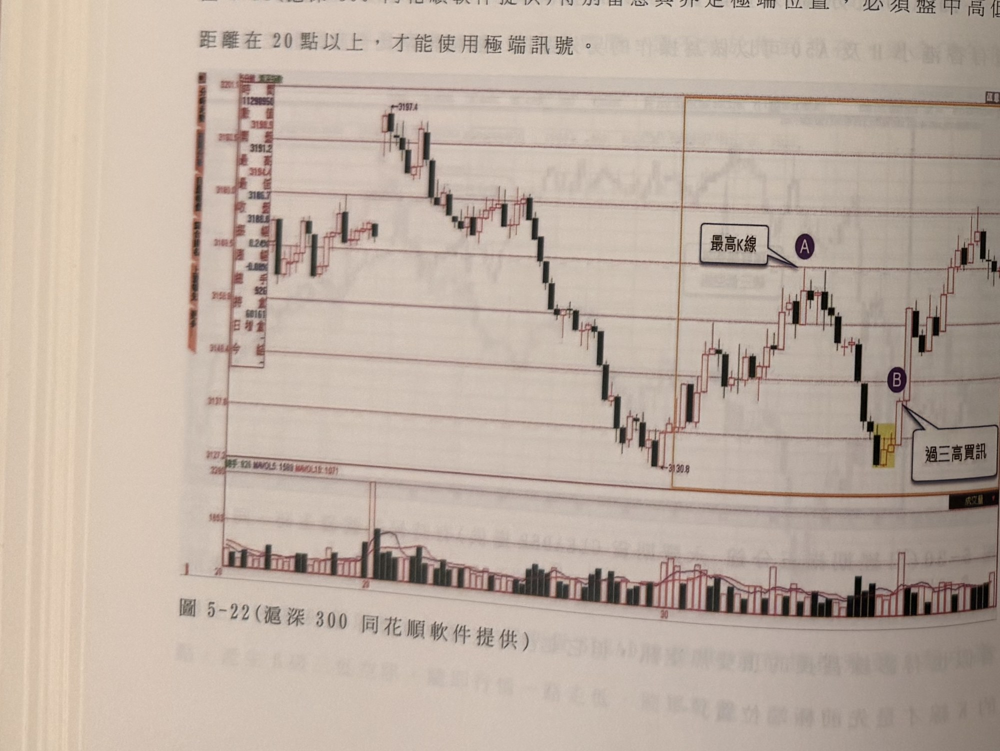


## 9. 作者提醒與常見錯誤

- 容易誤把只跌破／突破1、2根K線高低點當作訊號成立，實際上必須跌破／突破**前三根**K線區間高低點才算數，且最高（最低）K線之後必須確實累積滿3根K線（p.104–105）。
- 跳空開盤時容易忽略層級1峰／谷點的前提，誤判過三高／破三低訊號有效性（p.103）。
- 訊號K線距極端位置過遠（如超過40點）時仍勉強進場，忽略「忽略不操作」也是合理選項之一（p.112–113）。
- 容易忘記檢查先後出現的多空訊號K線實體是否重疊，導致「忽多忽空」的頻繁進出（p.108–109）。
- 同一根K線可能同時符合多種反轉條件（如頂雙黑空訊與破三低空訊重疊），此時仍應以更嚴謹的條件（例如是否真正位於盤中極端位置）判斷訊號的有效性，而非照單全收（p.117，圖5-20）。
- 若單趟交易已獲利可觀（例如超過50點），即使尚未出現正式的平倉訊號，也可選擇提前停止當日操作，滿足即為操作最高原則，不必貪求更多（p.114，圖5-13）。
- 即使沒有出現連續五根同色K線遇首根反向K線的正式出場訊號，只要獲利已大、行情突然縮腳收出反向顏色K線時，也應提高警覺、考慮獲利了結（p.115，圖5-16）。

## 10. 規則速查（Checklist）

**破三低空訊（空）**
- [ ] 已出現當下盤中最高K線，且自該K線起算尚無K線收盤跌破前1根K線低點
- [ ] 訊號K之前本交易日已有滿3根K線可比較（區間可含最高K線本身）
- [ ] 出現K線收盤同時跌破前1根與前3根K線區間低點
- [ ] 訊號K線與最高K線間隔≤3根K線（即4根K線以內）
- [ ] 訊號K線收盤未被期間內其他K線更低的低點遮蔽
- [ ] （跳空情境）已產生層級1峰點；有峰點時停損宜優先設在峰點
- [ ] 訊號K距極端高點 ≤20點：直接進場，停損20點；20–30點：可等拉回至20點內補空；≥40點：通常忽略
- [ ] 獲利曾達15點以上又折返回進場價 → 撤單平倉
- [ ] 若與先前**仍持有部位**的買訊K線實體重疊，忽略本次空訊（若原部位已平倉則不適用）

**過三高買訊（多）**
- [ ] 已出現當下盤中最低K線，且自該K線起算尚無K線收盤突破前1根K線高點
- [ ] 訊號K之前本交易日已有滿3根K線可比較（區間可含最低K線本身）
- [ ] 出現K線收盤同時突破前1根與前3根K線區間高點
- [ ] 訊號K線與最低K線間隔≤3根K線（即4根K線以內）
- [ ] 訊號K線收盤未被期間內其他K線更高的高點遮蔽
- [ ] （跳空情境）已產生層級1谷點；有谷點時停損宜優先設在谷點
- [ ] 訊號K距極端低點 ≤20點：直接進場，停損20點；20–30點：可等拉回至20點內補多；≥40點：通常忽略
- [ ] 獲利曾達15點以上又折返回進場價 → 撤單平倉
- [ ] 若與先前**仍持有部位**的空訊K線實體重疊，忽略本次買訊（若原部位已平倉則不適用）

## 11. 機器可讀規則

```yaml
signal: 過三高與破三低
timeframe: 5m
directions:
  short:
    name: 破三低空訊
    conditions:
      - id: C1
        desc: 已出現當下盤中最高K線，且自該K線起算尚無K線收盤跌破前1根K線最低點
        source: p.101-102
      - id: C2
        desc: 訊號K之前本交易日須有滿3根K線可比較（區間可含最高K線本身與其之前的K線）
        source: p.103-105
      - id: C3
        desc: 出現K線收盤同時跌破前1根與前3根K線區間最低點
        source: p.101-102
      - id: C4
        desc: 訊號K線須在最高K線之後最多4根K線以內出現（間隔最多3根K線）
        source: p.107
      - id: C5
        desc: 訊號K線收盤須是自最高K線後最低、未被其他K線低點遮蔽的收盤
        source: p.106
    entry: 訊號K收盤確認後放空；距極端高點>20點可等拉回至20點內補空，或直接進場設20點停損；跳空且有層級1峰點時，停損宜優先設在峰點
    stop_loss: { level: "盤中最高點（跳空有層級1峰點時優先以峰點為準）", max_points: 20, note: "距離>20直接進場時＝進場價+20", source: "p.104-105, p.106, p.112-113" }
    exit:
      retracement_15_flat:
        desc: 獲利曾達15點以上又折返回進場價 → 撤單平倉
        source: p.111
      other: 若後續反手依方向設20點停損
  long:
    name: 過三高買訊
    conditions:
      - id: C1
        desc: 已出現當下盤中最低K線，且自該K線起算尚無K線收盤突破前1根K線最高點
        source: p.102
      - id: C2
        desc: 訊號K之前本交易日須有滿3根K線可比較（區間可含最低K線本身與其之前的K線）
        source: p.103-105
      - id: C3
        desc: 出現K線收盤同時突破前1根與前3根K線區間最高點
        source: p.102
      - id: C4
        desc: 訊號K線須在最低K線之後最多4根K線以內出現（間隔最多3根K線）
        source: p.107
      - id: C5
        desc: 訊號K線收盤須是自最低K線後最高、未被其他K線高點遮蔽的收盤
        source: p.106
    entry: 訊號K收盤確認後買進；距極端低點>20點可等拉回至20點內補多，或直接進場設20點停損；跳空且有層級1谷點時，停損宜優先設在谷點
    stop_loss: { level: "盤中最低點（跳空有層級1谷點時優先以谷點為準）", max_points: 20, note: "距離>20直接進場時＝進場價-20", source: "p.104-105, p.106, p.112-113" }
    exit:
      retracement_15_flat:
        desc: 獲利曾達15點以上又折返回進場價 → 撤單平倉
        source: p.111
      other: 若後續反手依方向設20點停損
filters:
  - desc: 訊號K之前本交易日不足3根K線可比較 → 不算破三低/過三高
    source: p.104-105
  - desc: 跳高開盤未產生層級1谷點 → 過三高視為無效訊號
    source: p.103
  - desc: 跳低開盤未產生層級1峰點 → 破三低視為無意義
    source: p.103
  - desc: 訊號K線實體與先前「仍持有部位」的已成立訊號K線實體重疊 → 忽略本次訊號；若原部位已平倉則不適用
    source: p.108, p.111
  - desc: 訊號K線距極端位置超過40點以上 → 通常忽略不操作
    source: p.112-113
  - desc: 訊號K線與極端K線間隔超過3根K線（超過4根K線範圍）→ 不成立
    source: p.107
  - desc: 訊號K線收盤被期間內其他K線更極端的高/低點遮蔽 → 不成立
    source: p.106
```

## 12. 待確認事項

1. p.118 圖5-21 提及「過三高／破三低」訊號亦需符合「盤中高低距離在20點以上」的極端位置門檻（以滬深300為例），但本章正文未明確說明此門檻是否等同於第一章（q3-01）台指期適用的30點（或距平盤40點）規則、抑或依商品另訂；因原文僅見於單張圖說、未見於正文條列規則，且與 q3-01～q3-04 的通用極端位置定義是否完全一致無法確認，暫不修改程式預設行為（`q3_05_break_three_high_low.py` 目前未實作獨立的極端位置最低震幅濾網），待後續有更多頁面佐證後再行確認並視需要加入。
2. 第五章 p.100–119 其餘部分已全數補齊（p.100因曝光過度無法辨識、p.119為章末空白頁，均不計入本次缺頁修正）。

## 13. 原文出處

- `extracted/pages/IMG_8375.md`（p.100–101，p.100因曝光過度無法辨識；第五章開篇定義）
- `extracted/pages/IMG_8376.md`（p.102–103，圖5-1、圖5-2）
- `extracted/pages/IMG_8377.md`（p.104–105，圖5-3、圖5-4）
- `extracted/pages/IMG_8378.md`（p.106–107，圖5-5、圖5-6）
- `extracted/pages/IMG_8379.md`（p.108–109，圖5-7、圖5-8）
- `extracted/pages/IMG_8380.md`（p.110–111，圖5-9、圖5-10）
- `extracted/pages/IMG_8381.md`（p.112–113，圖5-11、圖5-12）
- `extracted/pages/IMG_8382.md`（p.114–115，圖5-13、圖5-14、圖5-15、圖5-16）
- `extracted/pages/IMG_8383.md`（p.116–117，圖5-17、圖5-18、圖5-19、圖5-20）
- `extracted/pages/IMG_8947.md`（p.118–119，圖5-21、圖5-22；p.119為章末空白頁）
