# 連五黑遇首紅（買訊）／連五紅遇首黑（空訊）

> 一句話摘要：連續五根以上同色K線、總幅度超過40點的強勢單邊走勢，隔根卻出現「不再創新極端、顏色相反」的K線時，代表原走勢慣性遭破壞，可反向進場，停損20點。

## 1. 核心概念

行情連續出現五根以上同色K線（紅K或黑K），且幅度超過40點，代表當下走勢非常強勁、慣性極大。這種慣性一旦被打斷——也就是隔一根K線「不再創新高／新低，且顏色反轉」——就代表推動行情的力量出現鬆動，是值得留意的反轉訊號（p.121）。

但作者強調，這類訊號出現的機率不高：需要連續五根以上同色K且幅度超過40點才符合門檻，若行情沒有失速狂衝狂殺，機會不常見；即使出現連續五根同色K，隔根K線「剛好剎車不再創新高/新低」的情形也不多見，因此書中也常把它當作既有部位的「特殊出場（平倉）訊號」使用，而非只當新單進場訊號（p.125）。

## 2. 適用前提

- 行情處於連續同色K線的單邊急殺/急拉走勢中（五分鐘K線）。
- 最近同色K線（或可回溯的整段同色K線，見第3條C2b）總幅度需超過40點。
- 海外期貨商品（如恆生期指）容易在極端位置出現最後一根K線影線過長的情形，須額外套用影線濾網（第3條C7）。
- 訊號若發生在**距當日收盤不到1小時**的時段，因後續能表演（發展）的時間有限，一般採取**忽略不操作**（p.123，圖6-3）。

## 3. 訊號定義

### 3.1 連五黑遇首紅買訊（多方）

1. **C1** 連續出現五根（含）以上下跌黑K線（階梯狀依序下降；「下跌K線」＝收盤低於前一根收盤，見 p.55 對「上漲K線」的定義及 p.127「每一根紅K線都是上漲」）。（p.121, 圖6-1）
2. **C2** 這五根黑K線的跌幅（由起點高點到最後一根黑K低點）超過40點。（p.121）
   - **C2b（例外／總長度規則）**：若最近五根黑K線本身幅度不足40點，但往前回溯到更早的連續黑K線（例如七、八根），整段連續黑K線的總幅度達到40點以上，仍視為符合條件。（p.127，圖6-7為紅K鏡像案例）
3. **C3** 這一段連續黑K線的最後一根，必須是當下盤中最低點。（p.121）
4. **C4** 隔一根出現的K線收紅，且**未再創新低**。（p.121）
5. **C5** 該紅K**沒有超過**最後一根黑K線的最高點（即未「過一高」）。（p.121）
6. **C6（分流條件，非本訊號）** 若該隔根紅K的最高點**超過**最後一根黑K線最高點，且最後一根黑K仍為盤中最低，則屬於「底V字買訊」，不算本訊號（另見 q3-02-V字轉折）。（p.121）
7. **C7（影線濾網，海期尤須注意）** 最後一根黑K線的下影線長度須 ≤5點，或下影線長度占K線實體 ≤1/5；若下影線過長（提前透露止跌跡象），則不宜視為有效反轉訊號。（p.128, 圖6-8；p.135, 圖6-18反例：下影線超過5點，不宜視為買訊）

### 3.2 連五紅遇首黑空訊（空方，與3.1鏡像）

1. **C1** 連續出現五根（含）以上上漲紅K線（階梯狀依序上升）。（p.121, 圖6-1）
2. **C2** 這五根紅K線的漲幅超過40點；**C2b** 總長度例外規則同3.1（例：圖6-7，A至C共8根紅K，最近5根B至C僅38點不足40點，但A至C全段共48點，仍成立）。（p.127）
3. **C3** 這一段連續紅K線的最後一根，必須是當下盤中最高點。（p.121）
4. **C4** 隔一根出現的K線收黑，其**上影線沒有創新高**。（p.121）
5. **C5** 該黑K的**收盤沒有跌破**最後一根紅K線的最低點（未「破一低」）。（p.121）
6. **C6（分流條件，非本訊號）** 若黑K未創新高但收盤跌破紅K最低點，且位在盤中極端位置，則屬於「頂倒V空訊」，不算本訊號（另見 q3-02-V字轉折）。（p.121）
7. **C7（影線濾網）** 最後一根紅K線的上影線須 ≤5點，或占實體 ≤1/5；過長則不宜視為反轉訊號。（p.129, 圖6-9反例：上影線過長，「不宜當作反轉訊號」；p.135, 圖6-17正例：上影線恰5點，符合條件）

## 4. 進場

- 訊號成立於隔根反色K線**收盤確認**時，立即以市價方向進場：連五黑遇首紅→買進（多單）；連五紅遇首黑→放空（空單）。（p.121, p.124, p.126）
- 書中未提及需等拉回或有其他補進場條件；範例皆為訊號K收盤後隨即進場（p.124：「即可進場做空單」）。

## 5. 停損

- 停損固定為 **20點**，以訊號K線（隔根反色K線）之**收盤價**為基準，反方向20點。
  - 買訊（連五黑遇首紅）：訊號紅K收盤價 **向下** 20點。（p.126：「自D收盤價向下20點設停損位置」）
  - 空訊（連五紅遇首黑）：訊號黑K收盤價 **向上** 20點。（p.124, p.133）
- 書中未提及本訊號有反手（停損後反向進場）機制（此機制在第七章開盤戰法中出現，屬不同訊號）。

## 6. 出場 / 停利

書中未明確訂出具體停利規則或移動停損機制。範例多以「獲利超過XX點」描述結果（如p.124獲利95點、p.132獲利逾100點、p.133獲利逾50點、p.135獲利近80點），屬於案例呈現，非明訂的停利門檻。

補充：p.132 提及若同一走勢中先前已有訊號（如放空單）達成大幅獲利（如逾100點）而停利出場，之後即使出現本訊號的相反方向訊號（如底雙紅買訊），亦可**選擇忽略**，以維持已實現獲利（作者建議，非嚴格規則，推論）。

## 7. 過濾：不做的情況

1. 隔根反色K線若創新低（買訊情境）或創新高（空訊情境），**不能**作為新進場訊號，只能作為既有部位的出場（平倉）訊號。（p.121；p.132圖6-12：C點影線創新低，D、E僅視為平倉訊號；p.134圖6-15：影線創新低，僅作平倉訊號）
2. 隔根反色K線若超過最後一根同色K的高/低點（過一高／破一低），則歸類為「V字轉折」訊號而非本訊號（見3.1 C6、3.2 C6）。（p.121）
3. 最後一根同色K線的（潛在反轉方向）影線超過5點，或超過實體1/5，不視為有效反轉訊號；此濾網對海外期貨（如恆生期指）尤其重要。（p.128–129）
4. 若訊號在明顯不合理的位置成立（例如非盤中極端位置），宜忽略（此原則為書中對相鄰的「頂雙黑／底雙紅」訊號之提醒，本訊號亦適用同一邏輯——需確認第3.1/3.2 C3 的「盤中最低/最高」條件成立）。（p.133，圖6-12文字）
5. 訊號成立後拖延過久仍未獲利，宜在無虧損下平倉出場，不強求（p.135，圖6-16：訊號拖超過一小時未見獲利，宜在無虧損下平倉；此為出場管理建議而非進場過濾，供對照）。
6. 訊號發生時間距當日收盤**不到1小時**，一般忽略不操作（p.123，圖6-3：五紅遇首黑空訊出現在收盤前不到1小時，能表演的時間不多，一般採取忽略）。

## 8. 範例解析


- **圖6-1**（p.121，示意圖，非實際走勢）：左半示範「連五黑遇首紅買訊」——五根階梯狀下降黑K後接一根未破新低、未過前高的小紅K；右半為鏡像的「連五紅遇首黑」。此圖對應3.1／3.2的基本定義。
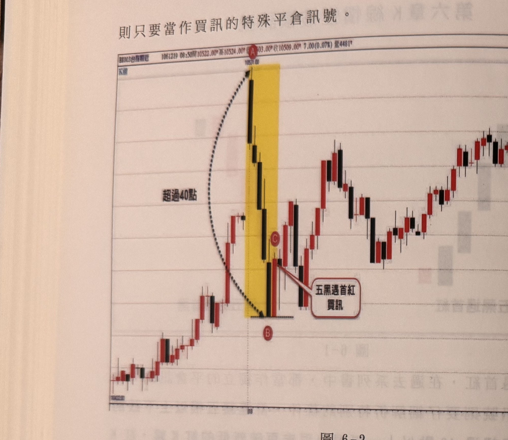

- **圖6-2**（p.122，台指期分時K線）：跳高40點以上開盤收黑（A，另構成第七章開盤戰法的空訊），隨後連續黑K下殺至B，A頂點到B低點跌幅超過40點；隔根C不再創新低、直接收紅，且未突破B高點，非底V字買訊，而是「五黑遇首紅買訊」；若原先持有A至B的空單未平倉，可在預期C將收紅時提前平倉，並於收盤確認後反手進多單。

  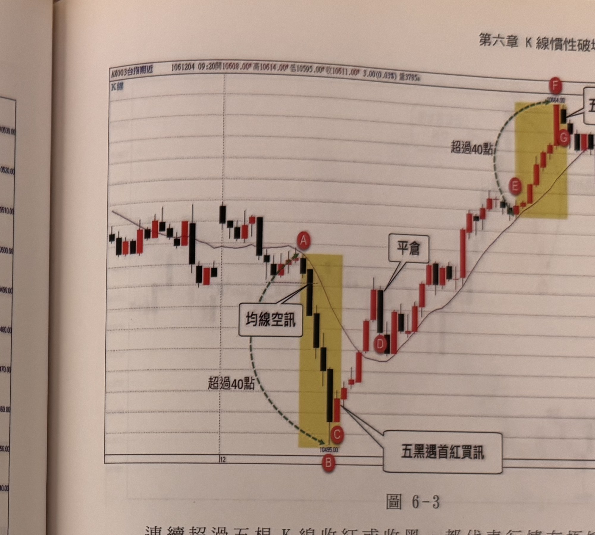

- **圖6-3**（p.123，台指期分時K線＋均線）：早盤跌破均線出現均線空訊，A到B連續五根黑K下殺約90點，C不破新低收紅，形成五黑遇首紅買訊並急拉6根紅K；D出現黑K，但因D不在盤中最高位置，僅能作為既有多單的**平倉訊號**，非新的空訊；其後EF段再度連續五紅，G位置縮頭黑K形成五紅遇首黑空訊外觀，但因距當日收盤不到1小時，一般採取忽略不操作。示範7.條過濾規則4與新增規則6（收盤前不到1小時忽略）。

  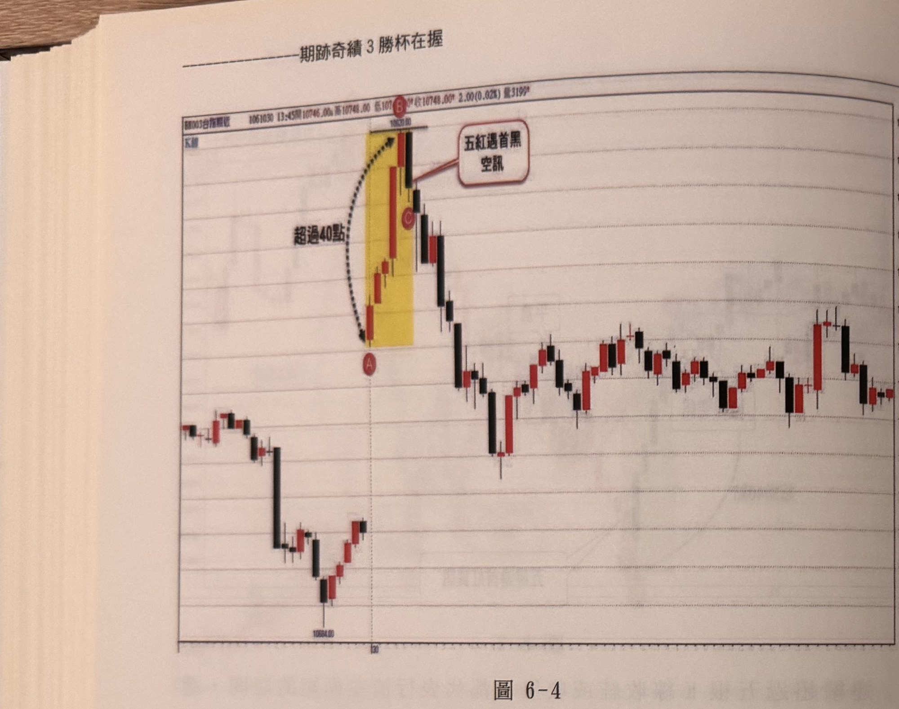

- **圖6-4**（p.124，台指期5分鐘K線）：A至B連續五根紅K急拉超過40點，隔根C不創新高收黑，形成「五紅遇首黑空訊」，停損20點，其後行情自高點反轉直落95點。示範C1–C5成立與獲利情境。
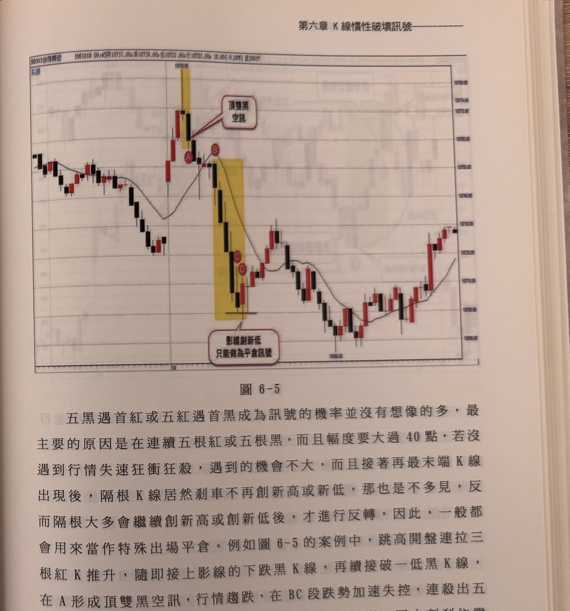

- **圖6-5**（p.125，含均線）：先於A形成頂雙黑空訊（見q3-01），BC段連殺五根以上黑K超過40點，D點先創新低再反彈收紅——因D創新低（違反C4/C6），故僅作為既有空單的**特殊出場（平倉）訊號**，非新買訊。示範第7條過濾規則1。


- **圖6-6**（p.126，台指期）：示範同圖中先出現「以牙還牙空訊」（見q3-04），行情續跌至C形成連續五根以上黑K超過40點，隔根D不創新低反漲收紅，符合「五黑遇首紅買訊」，於D收盤價下20點設停損。示範C1–C5正例與進場/停損。


- **圖6-7**（p.127，台指期）：A至C共8根紅K上攻，最近5根（B至C）僅38點不足40點，但A至C全段48點超過40點，隔根D不創新高收黑，仍成立「五紅遇首黑空訊」。示範C2b總長度例外規則。
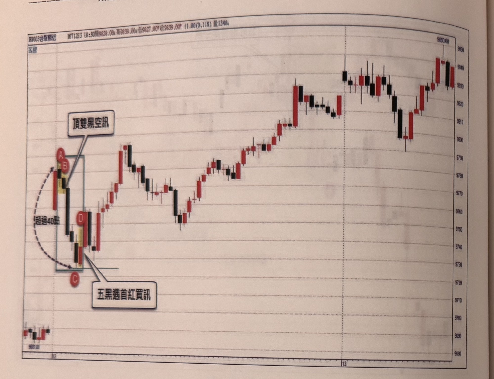

- **圖6-8**（p.128，台指期）：先於AB形成頂雙黑空訊，A至C連續五根以上黑K超過40點，C點下影線僅2點（符合C7 ≤5點），隔根D不創新低收紅，形成有效「五黑遇首紅買訊」。示範影線濾網正例。
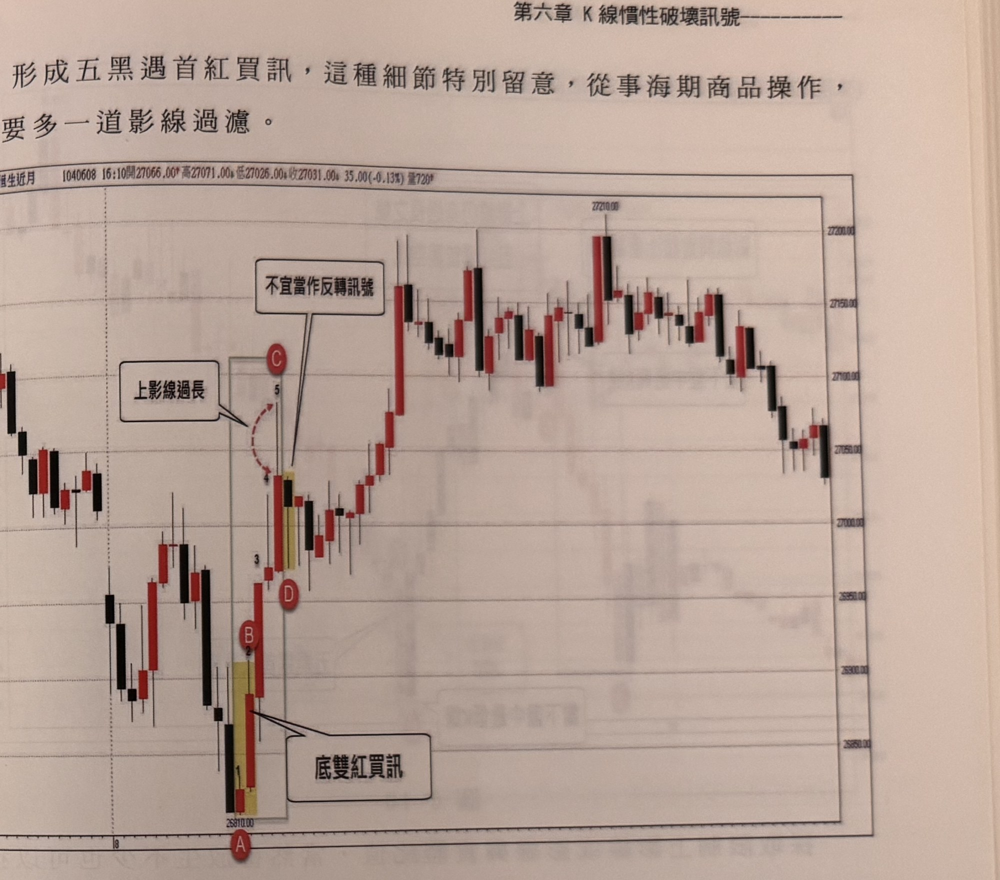

- **圖6-9**（p.129，恆生期指）：先於AB形成底雙紅買訊，隨後連續多根紅K上攻（標號1–5），第5根紅K（C）上影線過長，隔根黑K（D）雖形成「五紅遇首黑」外觀，但因C的上影線過長（違反C7），文字明白指出「不宜當作反轉訊號」。示範影線濾網反例，是本章唯一恆生期指案例，凸顯海期商品尤須注意此濾網。
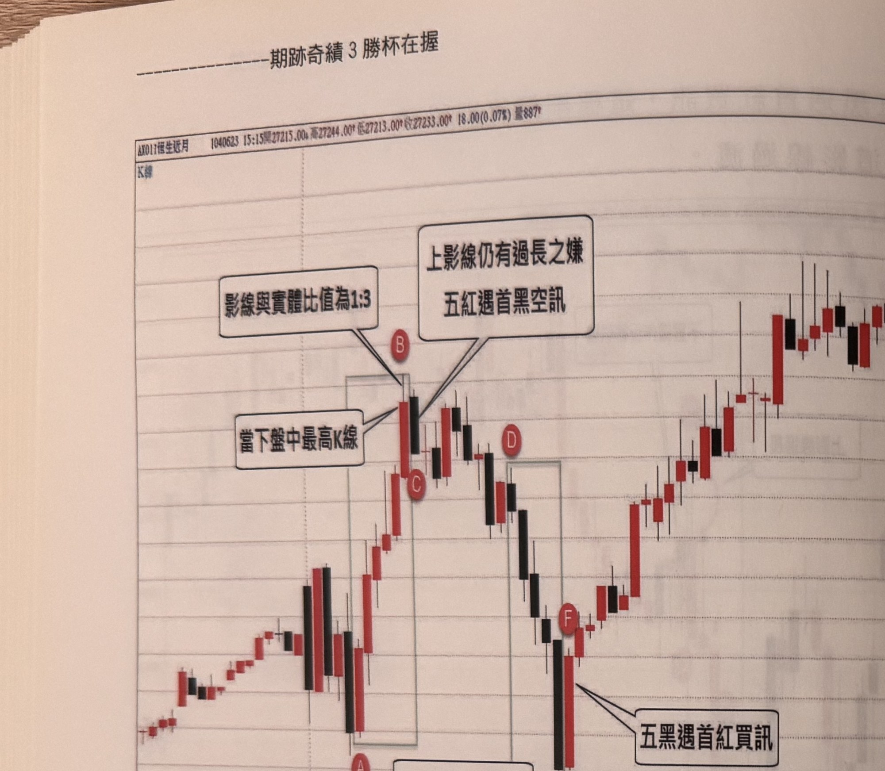

- **圖6-10**（p.130，恆生期指分時K線）：恆生期指開盤刷洗後，A開始連拉6根紅K至B（盤中最高K線），B的上影線與實體比值為1:3，未小於1:5，不符合影線濾網的嚴格條件，故隔根C即使高度低於B高點，仍**不**認定為五紅遇首黑空訊；後市持續下跌，D以下連續五根長黑K線（末根影線極短）殺出，隔根F反而大漲收紅，形成有效「五黑遇首紅買訊」。示範C7影線濾網（比值判定）的反例。

  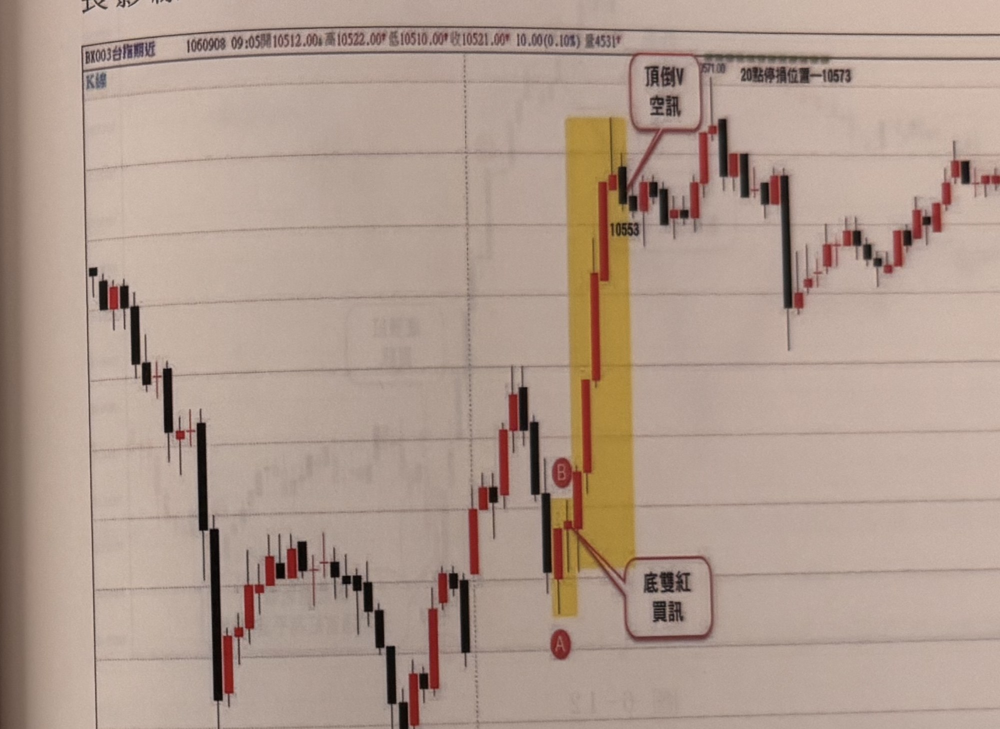

- **圖6-11**（p.131，台指期分時K線）：小跳高開盤，早盤最高點到當下最低K線震幅符合30點門檻，AB形成底雙紅買訊，隨後連續7根紅K上攻，當下最高K線上影線比實體長，不符合五紅遇首黑的影線限制，但因隔根黑K收盤跌破前紅K最低點，仍構成「頂倒V空訊」（另一訊號，見q3-02），停損設在訊號K收盤上方20點；行情雖再創高但未觸及停損；底雙紅買訊該趟獲利已近50點，若已感滿足，第二個頂倒V空訊亦可選擇不做。示範3.1 C6「分流」規則與影線濾網。

  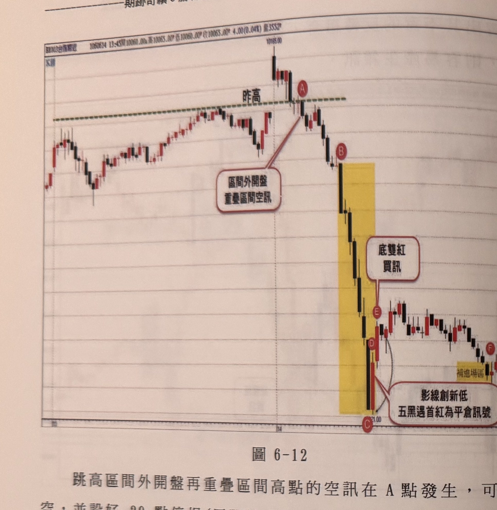

- **圖6-12**（p.132，台指期）：B至C連殺七根黑K，最後一根黑K無下影線（符合C7），但D點反漲前**曾創新低**（違反C4），因此D、E僅視為既有空單的出場（平倉）訊號，非新買訊；文字並建議若先前空單已獲利逾100點，可選擇忽略隨後出現的底雙紅買訊以鎖住獲利。
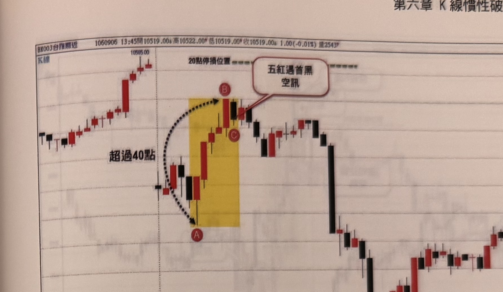

- **圖6-13**（p.133，台指期）：A至B連拉五根紅K，B無上影線（符合C7），C黑K收盤未創新高（符合C5），形成有效「五紅遇首黑空訊」，20點停損，獲利逾50點。
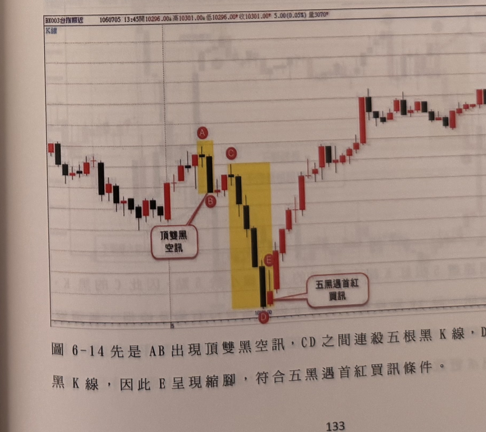

- **圖6-14**（p.133，台指期）：先於AB形成頂雙黑空訊，C至D連殺五根黑K，D帶極短下影線（縮腳，符合C7），隔根E收小紅不創新低，符合「五黑遇首紅買訊」。
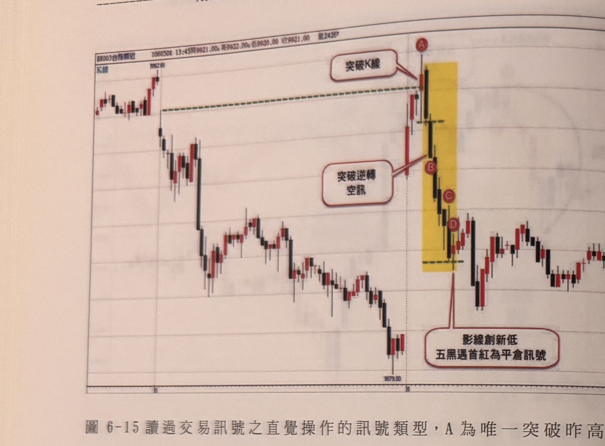

- **圖6-15**（p.134，台指期）：A為突破K線，B形成突破逆轉空訊（另一訊號，非本章），其後連續五根以上黑K下殺，隔根D**影線創新低**（違反C4），僅作為既有空單的**平倉訊號**，非新買訊。示範第7條過濾規則1的另一例。
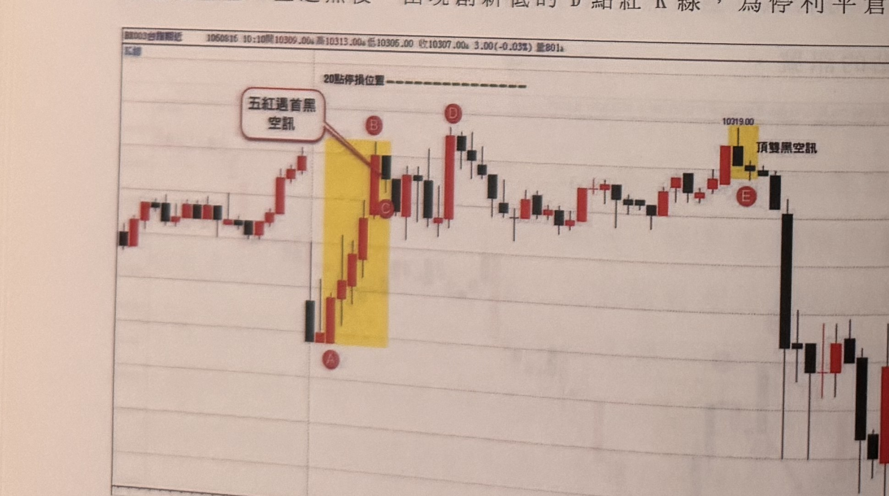

- **圖6-16**（p.134，台指期）：A至B連續5根紅K上漲，B上影線 <5點（符合C7），C黑K形成「五紅遇首黑空訊」，但文字提醒若訊號拖超過一小時未見獲利，宜在無虧損下平倉；尾盤另出現頂雙黑空訊因接近收盤而忽略（非本章訊號，供對照）。
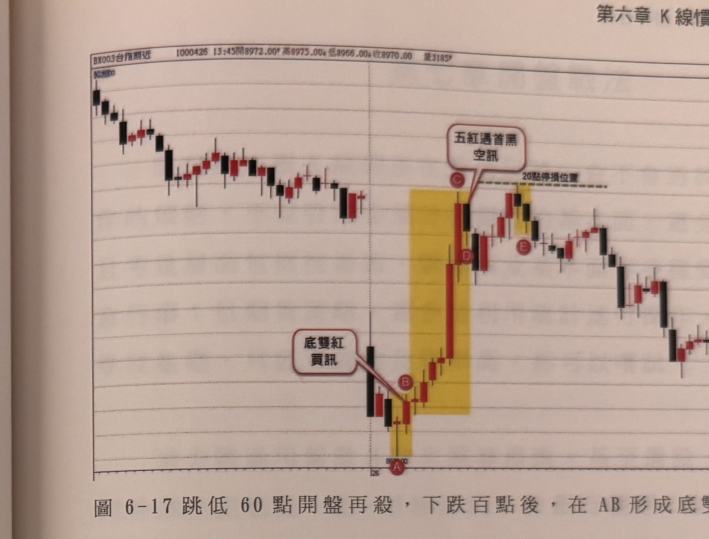

- **圖6-17**（p.135，台指期）：先於AB形成底雙紅買訊，A至C連續8根紅K上攻，C（最高點）上影線恰5點（符合C7，臨界值），隔根D收黑形成「五紅遇首黑空訊」，20點停損；文字說明此空訊「做與不做皆可」，因先前買單已獲利近80點。
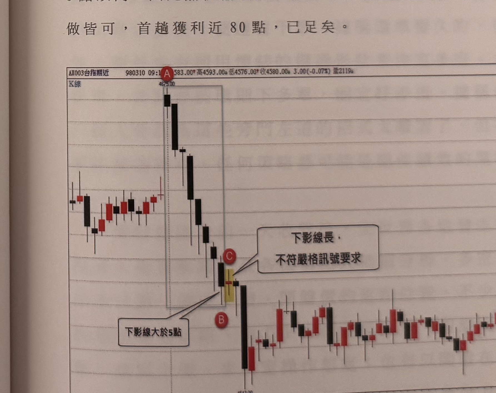

- **圖6-18**（p.135，台指期）：A起連續8根黑K下殺，最後一根黑K下影線**超過5點**（違反C7），隔根雖出現縮腳小紅K（C），文字明確指出「不宜作為五黑遇首紅買訊」。示範影線濾網反例。

## 9. 作者提醒與常見錯誤

- 本訊號出現機率不高，需同時滿足「連續五根以上同色K」＋「幅度超過40點」＋「隔根剛好剎車反色」三個條件，較常被當作既有部位的特殊出場（平倉）訊號使用，而非獨立新單訊號（p.125）。
- 影線濾網是本訊號能否成立的關鍵嚴格條件：最後一根同色K線若已帶有較長的（潛在反轉方向）影線，代表反轉已有預兆，不符合「突然剎車反轉」的訊號精神，尤其操作海外期貨商品（恆生期指等）時務必檢查（p.128）。
- 隔根反色K是否「創新高/新低」是分流關鍵：創新極端只能平倉，未過前高/前低才是新訊號本身；若反而超過前一根同色K高/低點，則屬於另一種訊號（V字轉折）（p.121）。
- 訊號拖延過久未獲利應在無虧損下出場，不宜死守（p.135）。
- 嚴格套用影線／收盤前時間等濾網，確實會放生一些原本也能獲利的單子，但作者強調「為了阻擋不必要的停損，訊號從嚴是必須的」；訊號的精神是「極端位置出其不意的反轉」，若影線已提前透露止跌／止漲跡象，容易產生雜訊，不必對單一訊號過度執著（p.130）。

## 10. 規則速查（Checklist）

**連五黑遇首紅買訊（多）**
- [ ] 連續五根（含）以上下跌黑K線
- [ ] 該段跌幅（或可回溯總跌幅）超過40點
- [ ] 最後一根黑K為當下盤中最低點
- [ ] 隔根K線收紅，未再創新低
- [ ] 該紅K未超過最後一根黑K最高點
- [ ] 最後一根黑K下影線 ≤5點（或 ≤實體1/5）
- [ ] 訊號發生時間距收盤 ≥1小時
- [ ] 訊號K收盤確認後進場買進，收盤價下20點停損

**連五紅遇首黑空訊（空）**
- [ ] 連續五根（含）以上上漲紅K線
- [ ] 該段漲幅（或可回溯總漲幅）超過40點
- [ ] 最後一根紅K為當下盤中最高點
- [ ] 隔根K線收黑，上影線未創新高
- [ ] 該黑K收盤未跌破最後一根紅K最低點
- [ ] 最後一根紅K上影線 ≤5點（或 ≤實體1/5）
- [ ] 訊號發生時間距收盤 ≥1小時
- [ ] 訊號K收盤確認後進場放空，收盤價上20點停損

## 11. 機器可讀規則

```yaml
signal: 連五黑遇首紅／連五紅遇首黑
timeframe: 5m
directions:
  long:
    name: 連五黑遇首紅買訊
    conditions:
      - id: C1
        desc: 連續五根（含）以上下跌黑K線
        source: p.121
      - id: C2
        desc: 該段（或可回溯總段）黑K跌幅超過40點
        source: p.121, p.127
      - id: C3
        desc: 最後一根黑K為當下盤中最低點
        source: p.121
      - id: C4
        desc: 隔根K線收紅，未再創新低
        source: p.121
      - id: C5
        desc: 該紅K未超過最後一根黑K最高點（未過一高）
        source: p.121
      - id: C7
        desc: 最後一根黑K下影線 ≤5點 或 ≤實體1/5
        source: p.128
    entry: 訊號紅K收盤確認後市價買進
    stop_loss: { points: 20, ref: "訊號紅K收盤價向下20點", source: "p.126" }
    exit: 書中未明確說明
  short:
    name: 連五紅遇首黑空訊
    conditions:
      - id: C1
        desc: 連續五根（含）以上上漲紅K線
        source: p.121
      - id: C2
        desc: 該段（或可回溯總段）紅K漲幅超過40點
        source: p.121, p.127
      - id: C3
        desc: 最後一根紅K為當下盤中最高點
        source: p.121
      - id: C4
        desc: 隔根K線收黑，上影線未創新高
        source: p.121
      - id: C5
        desc: 該黑K收盤未跌破最後一根紅K最低點（未破一低）
        source: p.121
      - id: C7
        desc: 最後一根紅K上影線 ≤5點 或 ≤實體1/5
        source: p.129
    entry: 訊號黑K收盤確認後市價放空
    stop_loss: { points: 20, ref: "訊號黑K收盤價向上20點", source: "p.124, p.133" }
    exit: 書中未明確說明
filters:
  - desc: 隔根反色K線創新低（多方情境）或創新高（空方情境）→ 僅作既有部位平倉訊號，不可作新進場訊號
    source: p.121, p.132, p.134
  - desc: 隔根反色K線超過前一根同色K高/低點（過一高／破一低）→ 屬V字轉折訊號，非本訊號
    source: p.121
  - desc: 最後一根同色K線的潛在反轉方向影線超過5點或超過實體1/5 → 不視為有效反轉訊號
    source: p.128-129, p.135
  - desc: 訊號成立超過一小時仍未獲利 → 宜在無虧損下平倉
    source: p.135
  - desc: 訊號發生時間距當日收盤不到1小時 → 一般忽略不操作
    source: p.123
```

## 12. 待確認事項

無。缺頁僅影響範例圖，見 frontmatter `missing_pages`。

## 13. 原文出處

- `extracted/pages/IMG_8384.md`（p.120–121，缺p.120實際內容，第六章開篇與圖6-1定義）
- `extracted/pages/IMG_8385.md`（p.122–123，圖6-2、圖6-3）
- `extracted/pages/IMG_8386.md`（p.124–125，圖6-4、圖6-5）
- `extracted/pages/IMG_8387.md`（p.126–127，圖6-6、圖6-7）
- `extracted/pages/IMG_8388.md`（p.128–129，圖6-8、圖6-9）
- `extracted/pages/IMG_8389.md`（p.130–131，圖6-10、圖6-11）
- `extracted/pages/IMG_8390.md`（p.132–133，圖6-12、圖6-13、圖6-14）
- `extracted/pages/IMG_8391.md`（p.134–135，圖6-15、圖6-16、圖6-17、圖6-18）
