# 開盤戰法（跳高收黑空訊／跳低收紅買訊）

> 一句話摘要：開盤跳空乖離平盤（昨收盤）超過40點時，若第一根5分鐘K線的方向與「跳空應有的自然反應」相反（跳高卻收黑、跳低卻收紅），且影線受限於3點以內，即為當下反常現象所觸發的反轉訊號，可立即進場，停損20點。

## 1. 核心概念

開盤價融合了前一夜全球政經消息與市場多空競價的結果。理論上跳高開盤代表利多，第一根K線應收紅（回應利多、多方看好）；跳低開盤代表利空，理論上會有人趁低承接，第一根K線也常見開低收紅。因此：

- **跳高卻收黑**：代表跳高後隨即有人不認同、迅速出脫甚至轉空，是「反常」現象，偏空表態（p.138）。
- **跳低卻收紅**：代表跳低後有人趁低承接、五分鐘內即將收盤推升過開盤價，是利空消化後的反彈跡象（p.138–139）。

作者強調，跳高收紅、跳低收黑是「常態」，訊號可靠度不足以直接進場（停損不易拿捏）；唯有「反常」的跳高收黑、跳低收紅，才具備可操作性，其邏輯類似技術指標的「背離」——反常現象才是聚焦重點（p.139）。

**與傳統「執帶」K線的關係（p.149）**：日線K線戰法中，「執帶」（黑執帶／紅執帶）代表單根K線的強烈反轉意圖：黑執帶要求開盤即為當根最高點（無上影線），隨後一路下殺至平盤上方不遠處收盤。但5分鐘K線在盤中極少出現真正無影線的執帶，因此本戰法將條件放寬為「上（下）影線在3點以內」，作為近似執帶反轉力道的簡化門檻，這也是C3「影線≤3點」規則的設計依據。

## 2. 適用前提

- 商品：台指期，5分鐘K線。
- 開盤第一根K線的開盤價，相對於**昨日收盤價（平盤）**的乖離須達到一定門檻（見第3條C1）。
- 訊號僅發生於「開盤第一根5分鐘K線」，屬於每個交易日僅一次的機會窗口。

## 3. 訊號定義

### 3.1 跳高收黑空訊（空方）

1. **C1** 開盤價跳高，乖離昨收盤（平盤）達 **40點以上**。（p.138, 圖7-1）
2. **C2** 第一根5分鐘K線收黑（開盤後行情未能守住紅盤）。（p.138）
3. **C3** 該黑K線的上影線 **≤3點**（含3點）。（p.138：「上影線必須小於（含）3點」）
4. 跳空達百點以上時，本訊號可直接於第一根K線收黑時進場，不需像另一種「跳空篇」方法那樣等待後續K線跌破第一根K線最低點濾網才確認（p.142，圖7-4；p.143，圖7-5）。

### 3.2 跳低收紅買訊（多方，與3.1鏡像）

1. **C1** 開盤價跳低，乖離昨收盤（平盤）達 **40點以上**。（p.139, 圖7-1）
2. **C2** 第一根5分鐘K線收紅（開盤後行情反彈收復失土）。（p.138–139）
3. **C3** 該紅K線的下影線 **≤3點**（含3點）。（p.139：「下影線長度必須小於（含）3點」）
4. 跳空達百點以上時，同3.1第4點，可直接於第一根K線收紅時進場（p.142，圖7-4）。

## 4. 進場

- 訊號於**開盤第一根5分鐘K線收盤確認**時，立即以市價方向進場：跳高收黑→放空；跳低收紅→買進。（p.140, 圖7-2；p.141, 圖7-3）
- **例外（超大K線）**：若訊號K線本身的波動幅度過大（收盤到最高/最低點的距離已超過20點停損可涵蓋的範圍），應**忽略本次訊號，或等待行情反彈／拉回接近訊號K位置附近再進場**，不宜直接以訊號K的極端高低點設定停損進場。（p.150, 圖7-12：「訊號K線為超大K線／忽略或反彈再空」）

## 5. 停損

- 固定 **20點**，以訊號K線（第一根5分鐘K線）的**收盤價**為基準，反方向20點。
  - 空訊（跳高收黑）：訊號K收盤價 **向上** 20點。（p.141, 圖7-3；p.144, 圖7-6）
  - 買訊（跳低收紅）：訊號K收盤價 **向下** 20點。（p.140, 圖7-2）
- 若訊號K收盤至最高/最低點的距離本身已超過20點（例如次根K線快速逼近停損），仍以收盤價20點為停損基準，不需另外調整；但若訊號K本身即為「超大K線」（見第4節例外），則不適用固定20點停損邏輯，應忽略或待反彈再進場。（p.144, 圖7-6）
- **停損後反手**：
  - 若行情**尚未**朝訊號方向產生15點以上獲利，即觸及20點停損，且**停損當根K線收盤價突破訊號K線的反方向極端點**（空單：收盤突破訊號黑K最高點；多單：收盤跌破訊號紅K最低點），則可於停損出場後**反手**進場（放空翻多／做多翻空）。（p.145, 圖7-7：反手買進；p.146, 圖7-8：反手放空；p.153, 圖7-18：反手作多）
  - 若行情**已經**朝訊號方向產生15點以上獲利（達到第6節「折返停利」門檻），之後即使觸及20點停損或K線收盤突破反方向極端點，**也不具備反手資格**，只能單純出場，不得反手操作。（p.145, p.147, 圖7-9）

## 6. 出場 / 停利

- **折返停利機制**：以獲利達 **15點** 作為「獲利起始目標」門檻。
  - 若獲利曾達到15點以上，其後行情反向折返回到訊號K收盤價附近，應撤單出場（保本／停利了結），不追求更多，也不承受虧損。（p.145：「如果空單曾經下行達15點後，再折返回進場點，原則要撤單出場」；p.147, 圖7-9：下行24點後，宜在尚未完全折返到收盤價前先停利出場）
  - 此後即使K線收盤突破反方向極端點（前高/前低），也**不可**視為反手訊號（見第5節）。（p.147）
- 若行情持續朝訊號方向單邊急奔（例如連續同色K線擴大獲利），應順勢持有、讓利潤延伸，不宜過早停利。（p.151, 圖7-15：「當好運來臨時，每一根黑K線複製著獲利的擴大，該走則走」）
- 規則是獲利曾達15點後，回到進場價（訊號K收盤價）前一定要出場；「距離訊號K收盤5點時宜停利出場」（見圖7-9案例）是提早離場、保留少許緩衝的實務建議，兩者並不矛盾（p.145、147）。
- **時間停滯出場（p.148，圖7-10）**：進場後若行情在「浮動獲利」與「接近停損」之間反覆游走（泥濘盤面），未觸及20點停損、也未達成15點折返停利，經過約**一小時**仍無明確輸贏，宜**撤單離場觀望**，不再死守（p.148：「若始終小賠小賺交互，則經過一個小時未見明朗，宜離場觀望」）。
- **獲利曾二次浮現又折返**：若行情曾兩度呈現獲利狀態、卻都未達15點門檻即折返回進場價，即使單次未達標準的15點折返規則，仍宜考慮撤單了結，不必堅持等待正式訊號（p.148，圖7-10：B、C皆未觸及15點或20點門檻但反覆拉鋸，作者建議依整體情勢及早出場）。

## 7. 過濾：不做的情況

1. 開盤乖離平盤未達40點 → 不適用本訊號，忽略。（p.138）
2. 第一根K線的影線超過3點（空訊看上影線、買訊看下影線）→ 不符合條件，不視為訊號。（p.138–139, p.141）
3. 訊號K線本身振幅過大（超大K線），以收盤價20點無法涵蓋其高/低極端點 → 忽略該訊號，或待行情反彈／拉回至訊號位置附近再進場，不可直接以其高低點設停損。（p.150, 圖7-12）
4. 訊號後行情下跌（或上漲）達停利觸發點，但隨即出現大幅震盪K線返回原放空／買進位置 → 應**絕對撤單**，即使其後行情仍延續原方向破底／過頂。（p.150, 圖7-13：「當它返回放空位置時，絕對要撤單」）
5. 已達15點以上獲利後行情折返 → 只能出場了結，不得再反手操作（見第5、6節）。（p.145, p.147）

## 8. 範例解析


- **圖7-1**（p.139，示意圖，非實際走勢）：定義圖，左半示範跳高收黑（開盤價須高於平盤40點以上）為空訊，右半鏡像示範跳低收紅（開盤價須低於平盤40點以上）為買訊。對應3.1、3.2的C1–C3基本定義。


- **圖7-2**（p.140，台指期）：跳低超過40點開盤，第一根K線開低收紅、下影線<3點，於A進場買進，收盤價下20點停損。示範3.2買訊正例與進場、停損。


- **圖7-3**（p.141，台指期）：跳高達90點開盤，向上僅3點即反轉收黑，A形成空訊，收盤價上20點停損，其後行情先拉回近45點、後多方再反攻。示範3.1空訊正例，並示範「上影線不能超過3點」的表態強度概念。
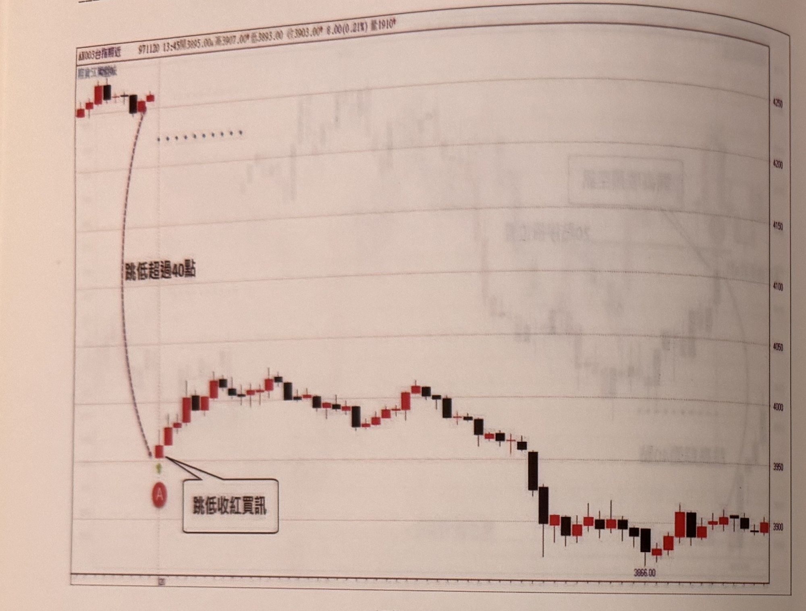

- **圖7-4**（p.142，台指期近月）：跳低超過40點（實際約百點）開盤收紅，A點即符合買進條件；文字對照另一種「跳空篇」方法（需等隔根突破首根K線最高點才進場），凸顯本戰法可在首根K線收盤時即進場，較早進場。
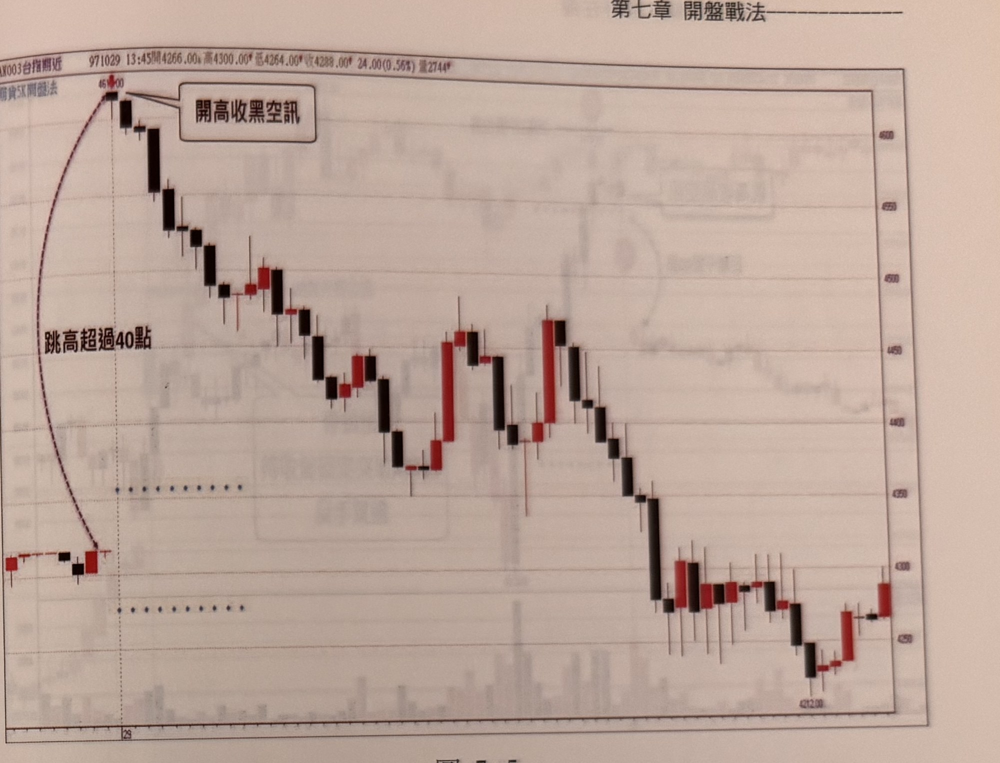

- **圖7-5**（p.143，台指期近月）：跳高超過250點開盤，第一根K線即收黑（留下影線但收黑），於曲線箭頭所指位置放空，風報比達5～10倍；文字強調影線濾網（<3點）沒有討價餘地，是維持訊號可靠度的關鍵。
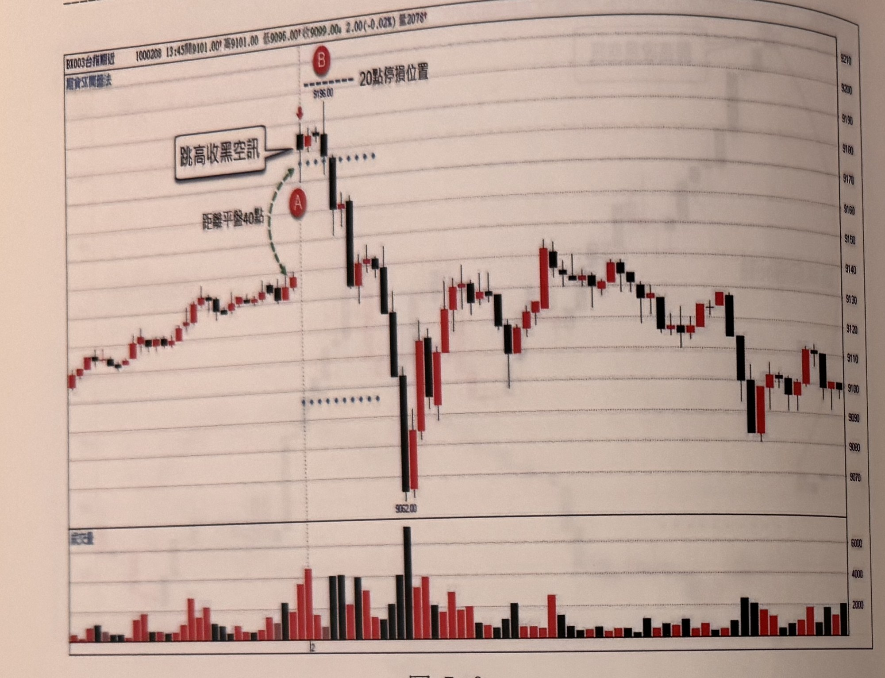

- **圖7-6**（p.144，台指期近月，含成交量子圖）：跳高約40～50點開盤，上影線恰3點（臨界值），符合空訊；次根K線（B）高點一度逼近20點停損但未觸及，隨後急跌逾30點，示範20點停損以「收盤價」而非「首根K線最高點」設定的必要性，以及15點折返停利機制的高風報比特性。
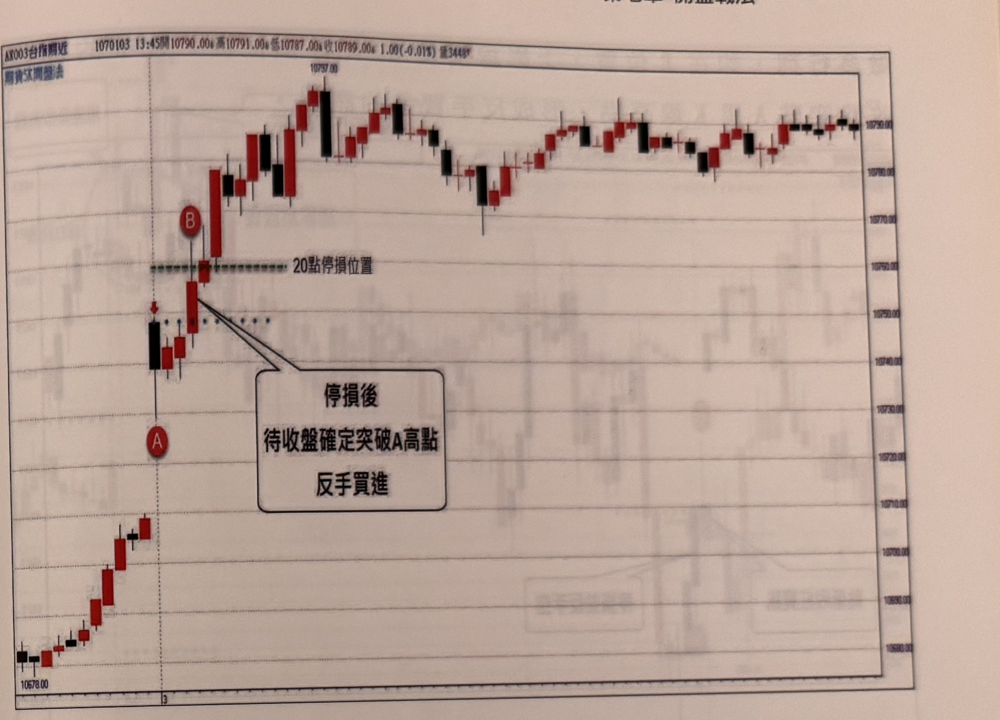

- **圖7-7**（p.145，台指期近月）：跳高約40點開盤收黑，A形成空訊，行情未能向下產生15點獲利即觸及20點停損，隨後K線收盤向上突破訊號黑K高點（B），依規則停損後反手買進，其後行情確實展開一段上漲。示範第5節反手規則的多方案例。
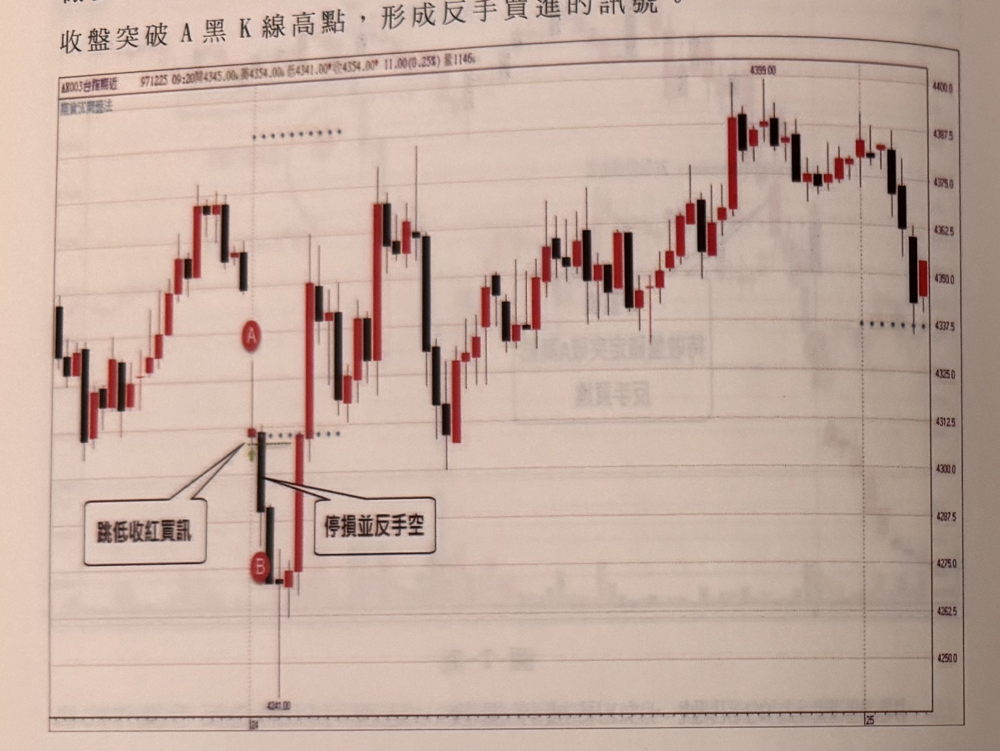

- **圖7-8**（p.146，台指期近月）：A為跳低收紅買訊，隔根出現長黑K，其下影線觸及20點停損，且收盤跌破訊號紅K最低點（B），依規則停損並反手放空。示範第5節反手規則的空方案例。
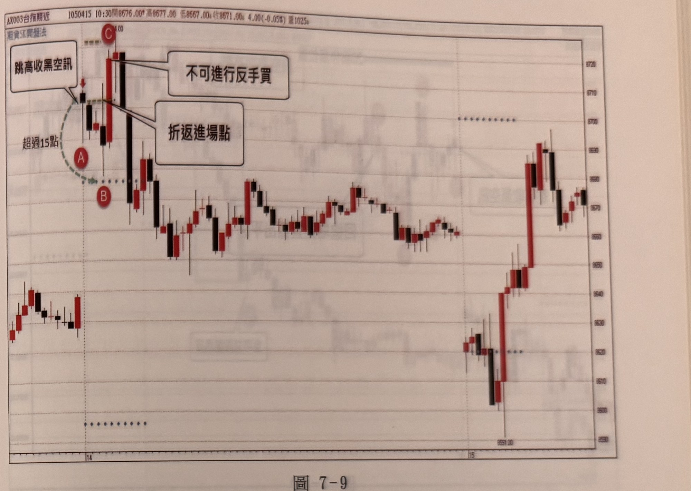

- **圖7-9**（p.147，台指期近月）：A為跳高收黑空訊（上影線<3點），行情最深下探至B（約下行24點，已超過15點停利門檻），依規則應已在折返回訊號K收盤價附近時停利出場；其後C點K線收盤雖突破A高點，但因先前已順勢超過15點，**不可**視為反手買進訊號。示範第5、6節「已達15點門檻後不得反手」的關鍵案例。
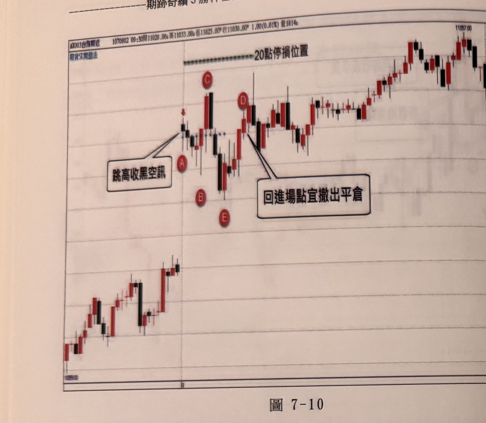

- **圖7-10**（p.148，台指期近月）：A為跳高收黑空訊；B低點獲利未達15點，收盤回進場點未撤單；行情反彈至C高點（未觸20點停損但呈浮動虧損）；隨後連續三根黑K下殺至E，浮動獲利約22點，達15點折返停利門檻，可於隔根附近停利出場；再不濟也須於D再度回到進場點時立即平倉；此時距進場已逾一小時，若仍無明確輸贏，也應撤單離場。示範6.節「時間停滯出場」與「二次獲利又折返」的具體案例。

  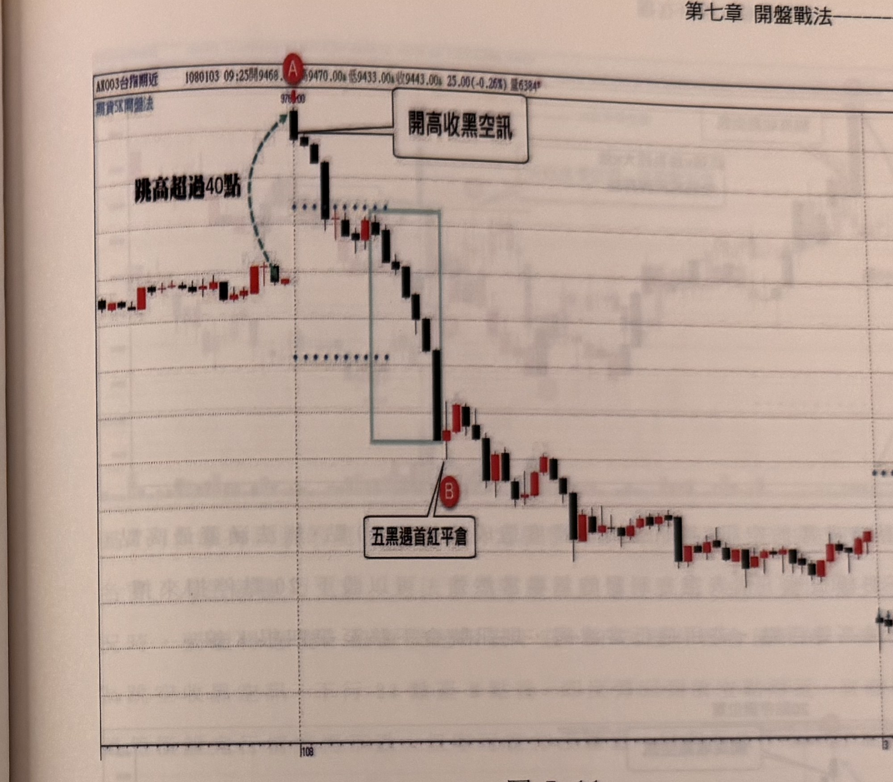

- **圖7-11**（p.149，台指期近月）：跳高開盤，上影線僅1點（遠低於3點上限），外觀非常接近傳統「黑執帶」反轉K線，具強烈反轉向下氣場；隨後出現「五黑遇首紅平倉」訊號（見q3-06）。示範1.節「執帶」概念與影線濾網的設計依據。

  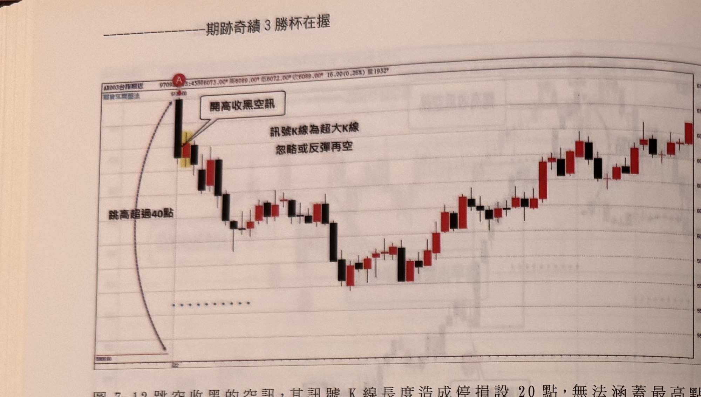

- **圖7-12**（p.150，台指期近月）：跳空跳高開盤即收出一根振幅異常巨大的黑K（超大K線），若以收盤價設20點停損將無法涵蓋其最高點，文字建議此類訊號應忽略、或待反彈後再行放空。示範第4節「超大K線」例外規則。
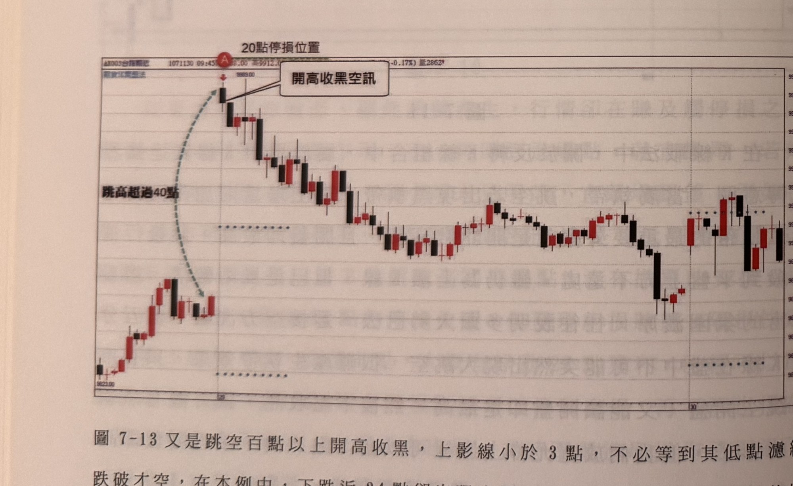

- **圖7-13**（p.150，台指期近月）：跳空跳高超過40點（實際達百點以上）開盤收黑於A，行情下跌近24點後出現大幅震盪K線，價格返回放空位置附近，依規則此時應絕對撤單，即使後續行情仍持續破底下跌。示範第7節過濾規則4。
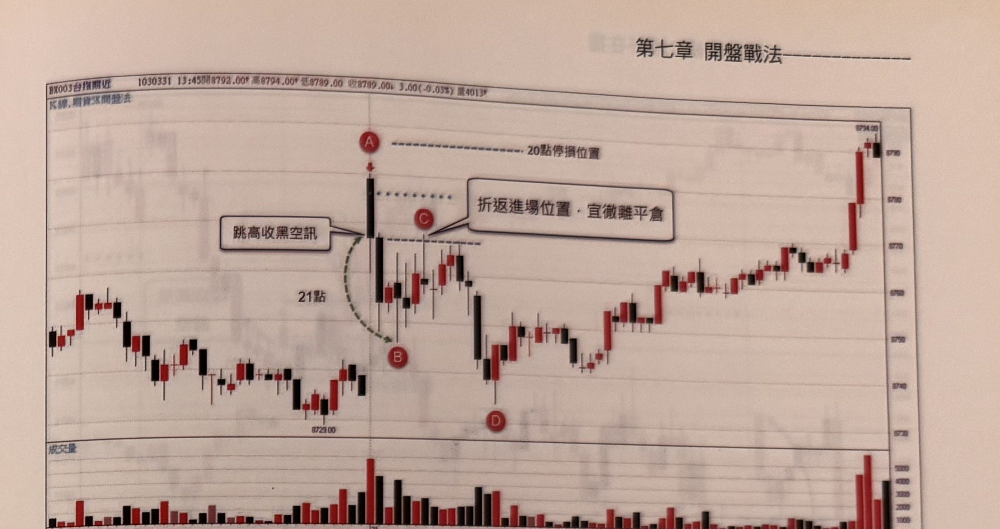

- **圖7-14**（p.151，台指期近月，含成交量子圖）：A為跳高收黑空訊，行情下行21點至B，隨後反彈折返至接近A收盤價的C點（折返進場位置），依規則宜徹單平倉；其後雖再度下跌至D，但依規則應已在C點出場。示範第6節折返停利機制的具體案例。
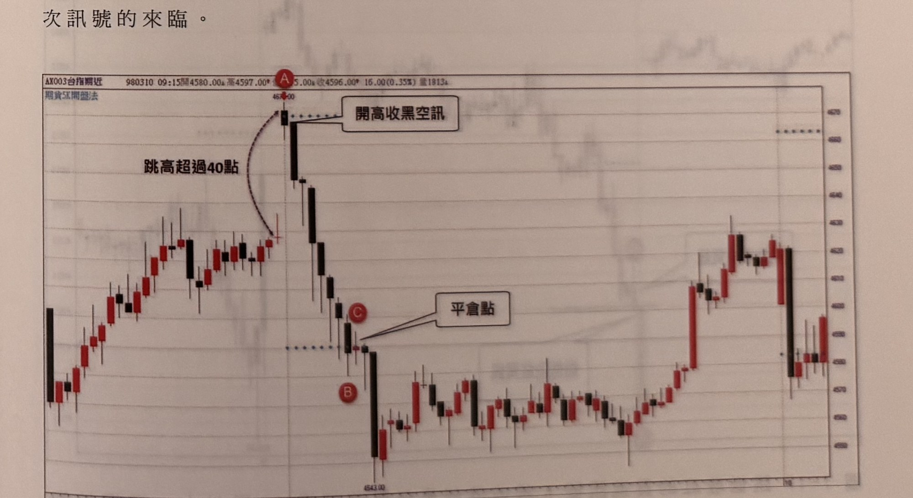

- **圖7-15**（p.151，台指期近月）：跳高收黑空訊後行情連續急跌，每根黑K複製擴大獲利，文字強調此類單邊急殺行情應順勢持有、讓利潤奔跑，不宜過早停利，「該走則走」。示範第6節「趨勢單邊時不宜過早停利」的補充原則。
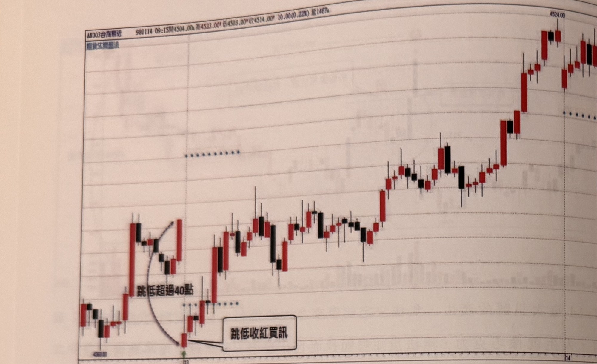

- **圖7-16**（p.152，台指期近月）：跳低超過40點開盤收紅形成買訊，其後行情持續盤堅走高，文字說明「跳低收紅買訊，常常能提供一段獲利的操作」。
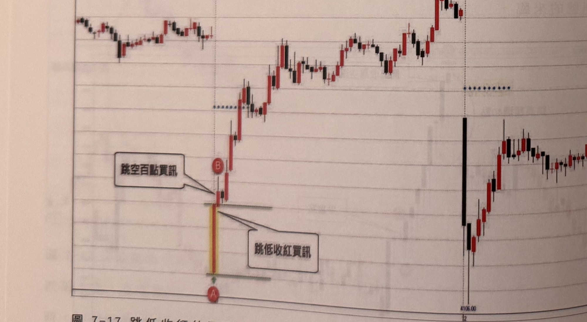

- **圖7-17**（p.152，台指期近月）：先前一根長黑K跳空下跌百點以上，隨後開低收紅形成買訊（同時符合「跳空百點買訊」的描述），其後展開一段可觀漲幅，惟後段又大幅回落；文字補充：若買訊K線收盤離最低點超過20點以上，可選擇拉回再進場或直接進場（停損20點），但屬於較積極、風險較高的操作方式。
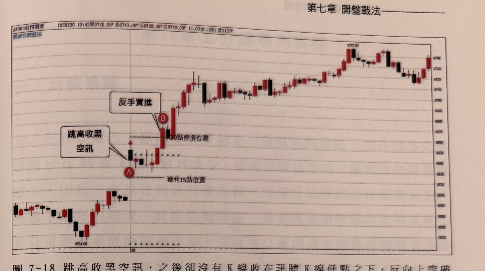

- **圖7-18**（p.153，台指期近月）：A為跳高收黑空訊，行情未能向下產生15點獲利，隨後K線收盤反向突破訊號K高點（B），依規則停損並反手作多，其後行情確實持續上漲。示範第5節反手規則的再一多方案例，文字並總結此規則：「跳高收黑空訊，之後卻沒有K線收在訊號K線低點之下，反向上突破訊號K線高點時，停損並反手作多」。

## 9. 作者提醒與常見錯誤

- 「反常」才是訊號重點：跳高收紅、跳低收黑是市場常態，不具備高可靠度可直接操作；唯有跳高收黑、跳低收紅這種與直覺相反的表現，才代表特定力量已經表態，值得作為訊號（p.138–139）。
- 影線濾網（3點）是維持訊號可靠度的核心，作者明言「務必切記影線點數必須小於3點，沒有討價餘地」，放寬會大幅降低可靠度（p.143）。
- 跳空百點以上時，本戰法比「跳空篇」的濾網突破方法更早進場（不需等後續K線突破/跌破首根K線高低點），但相對地也承擔訊號K收盤方向誤判的風險（p.142）。
- 停損固定以收盤價20點計算，不因次根K線一度逼近停損而恐慌出場，也不因訊號K本身波動大而任意調整——除非屬於「超大K線」，此時應直接忽略或待反彈再操作（p.144, p.150）。
- 15點獲利門檻是反手資格的關鍵分界：曾經獲利超過15點的部位，即使最終觸及停損或收盤反向突破，也不再具備反手條件，只能單純出場（p.145, p.147）。
- 訊號出現當下無法預知會帶來多大獲利，重點是懂得依規則應變、平安出場，才能迎接下一次訊號（p.151，「阿甘正傳」比喻）。

## 10. 規則速查（Checklist）

**跳高收黑空訊（空）**
- [ ] 開盤跳高，乖離平盤 ≥40點
- [ ] 第一根5分鐘K線收黑
- [ ] 上影線 ≤3點
- [ ] 訊號K收盤確認後市價放空
- [ ] 收盤價上20點停損（若為超大K線則忽略或待反彈再空）
- [ ] 獲利達15點後折返 → 回收盤價附近停利出場，不得再反手
- [ ] 未達15點即觸20點停損，且停損K收盤突破訊號K高點 → 可停損反手做多
- [ ] 進場約一小時仍無明確輸贏 → 撤單離場觀望

**跳低收紅買訊（多）**
- [ ] 開盤跳低，乖離平盤 ≥40點
- [ ] 第一根5分鐘K線收紅
- [ ] 下影線 ≤3點
- [ ] 訊號K收盤確認後市價買進
- [ ] 收盤價下20點停損（若為超大K線則忽略或待拉回再進場）
- [ ] 獲利達15點後折返 → 回收盤價附近停利出場，不得再反手
- [ ] 未達15點即觸20點停損，且停損K收盤跌破訊號K低點 → 可停損反手放空
- [ ] 進場約一小時仍無明確輸贏 → 撤單離場觀望

## 11. 機器可讀規則

```yaml
signal: 開盤首根K線戰法
timeframe: 5m
directions:
  short:
    name: 跳高收黑空訊
    conditions:
      - id: C1
        desc: 開盤價跳高，乖離昨收盤（平盤）達40點以上
        source: p.138
      - id: C2
        desc: 第一根5分鐘K線收黑
        source: p.138
      - id: C3
        desc: 該黑K上影線 ≤3點
        source: p.138
    entry: 訊號K線（第一根5分鐘K）收盤確認後市價放空
    stop_loss: { points: 20, ref: "訊號K收盤價向上20點", source: "p.141, p.144" }
    exit:
      profit_trigger_points: 15
      rule: 獲利達15點後若折返回訊號K收盤價附近，撤單停利出場；達此門檻後不得反手
      time_stall: 進場約一小時仍無明確輸贏，撤單離場觀望
      source: "p.145, p.147, p.148"
    reversal:
      condition: 未達15點獲利即觸20點停損，且停損K線收盤突破訊號K最高點
      action: 停損後反手做多
      source: "p.145, p.153"
  long:
    name: 跳低收紅買訊
    conditions:
      - id: C1
        desc: 開盤價跳低，乖離昨收盤（平盤）達40點以上
        source: p.139
      - id: C2
        desc: 第一根5分鐘K線收紅
        source: p.138-139
      - id: C3
        desc: 該紅K下影線 ≤3點
        source: p.139
    entry: 訊號K線（第一根5分鐘K）收盤確認後市價買進
    stop_loss: { points: 20, ref: "訊號K收盤價向下20點", source: "p.140" }
    exit:
      profit_trigger_points: 15
      rule: 獲利達15點後若折返回訊號K收盤價附近，撤單停利出場；達此門檻後不得反手
      time_stall: 進場約一小時仍無明確輸贏，撤單離場觀望
      source: "p.145, p.147, p.148"
    reversal:
      condition: 未達15點獲利即觸20點停損，且停損K線收盤跌破訊號K最低點
      action: 停損後反手放空
      source: p.146
filters:
  - desc: 開盤乖離平盤未達40點 → 忽略
    source: p.138
  - desc: 影線超過3點 → 不符合條件
    source: p.138-139, p.141
  - desc: 訊號K本身為超大K線（收盤到極端點距離超過20點）→ 忽略或待反彈/拉回再進場
    source: p.150
  - desc: 折返時出現大幅震盪K線返回訊號位置 → 絕對撤單
    source: p.150
  - desc: 已達15點以上獲利後折返 → 只能出場，不得反手
    source: "p.145, p.147"
  - desc: 進場約一小時仍無明確輸贏（未觸停損也未達15點折返）→ 撤單離場觀望
    source: p.148
```

## 12. 待確認事項

無。缺頁僅影響範例圖，見 frontmatter `missing_pages`。

## 13. 原文出處

- `extracted/pages/IMG_8392.md`（p.136–137，第七章開篇，p.136頁面內容無法辨識）
- `extracted/pages/IMG_8393.md`（p.138–139，訊號定義、圖7-1）
- `extracted/pages/IMG_8394.md`（p.140–141，圖7-2、圖7-3）
- `extracted/pages/IMG_8395.md`（p.142–143，圖7-4、圖7-5）
- `extracted/pages/IMG_8396.md`（p.144–145，圖7-6、圖7-7）
- `extracted/pages/IMG_8397.md`（p.146–147，圖7-8、圖7-9）
- `extracted/pages/IMG_8398.md`（p.148–149，圖7-10、圖7-11）
- `extracted/pages/IMG_8399.md`（p.150–151，圖7-12、圖7-13、圖7-14、圖7-15）
- `extracted/pages/IMG_8400.md`（p.152–153，圖7-16、圖7-17、圖7-18）
