# 均線順向策略（MA10 突破前高 / 跌破前低）

> 一句話摘要：以MA10均線判斷多空趨勢，趨勢確立後等待價格「休息（不創新高/新低）」，再以收盤「突破休息區高點（買）／跌破休息區低點（賣）」確認進場，並以多重距離濾網過濾太遠、太近的訊號。

## 1. 核心概念

- 5分鐘K線交易時段內K棒數量少，若單純用「收盤穿越均線」當進出場訊號，容易死在盤整格局中（p.155）。
- 均線對價格具有支撐或壓力效果：均線支撐有效時，價格盤中可能穿破均線，但收盤仍會拉回站上均線；均線具壓力時同理（p.155）。因此不能只靠「K線收盤穿越均線」判斷趨勢反轉，需要更精確的訊號定義。
- 作者採用『前進－休息－再前進』的價格運動模型：多方＝『突破（均線）－休息（不創新高）－再突破（前高）』；空方＝『跌破（均線）－休息（不創新低）－再跌破（前低）』（p.155-156）。
- 本策略同樣可用於海外期貨商品，只要規劃好風險控制即可（p.155）。

## 2. 適用前提

- 週期：5分鐘K線（海外商品／電子盤可放大到10或15分鐘K線，判斷步驟與均線參數不變，p.165）。
- 均線：以MA10作為多空趨勢判斷依據，均線之上做多，均線之下做空（p.157）。
- 須先確立均線方向（朝上／朝下），並確認出現至少一個「層級1峰點」或「層級1谷點」作為濾網基準，才開始尋找進場訊號（p.157-159）。

## 3. 訊號定義

### 多方（買進訊號）

1. 行情自均線下方向上，某根K線「收盤」站上MA10均線，標記為趨勢轉折起點（p.157，如圖8-1標示A）。
2. 站上均線後，K線持續創新高（攻擊狀態）（p.156）。
3. 出現某根K線高點未能創新高（不論紅K或黑K），視為進入「休息」狀態；休息可能只有1根，也可能連續數根K線（p.156）。
4. 休息期間，所有K線的「收盤」都不可跌破MA10（影線跌破無妨），休息期間K線紅黑不拘（p.156-157）。
5. 以休息前的最高點（層級1峰點，即攻擊階段最後一次創新高的高點）畫出水平「峰位濾網」（p.156–157：「C的隔根K線無法創新高，此時表示C的K線高點為突破後第一個峰位，並以C的高點畫水平線當作訊號的濾網」）。
6. 買進訊號成立：其後某根K線「收盤」一舉突破峰位濾網（創新高）（p.156-157）。
7. 峰位突破只有一次機會──若只有上影線突破峰位，收盤卻縮回峰位之下，訊號不成立，且不可等隔根再確認，必須重新尋找下一個峰位（p.156）。
8. 若在等待突破峰位期間，價格收盤先跌破MA10，代表尋找訊號的步驟已失效，須重新從步驟1開始（p.159，如圖8-3 F處）。

### 空方（放空訊號，與多方鏡像）

1. 行情自均線上方向下，某根K線「收盤」跌破MA10均線，標記為趨勢轉折起點（p.156）。
2. 跌破均線後，K線持續創新低（p.156）。
3. 出現某根K線低點未能創新低（不論紅K或開高收低黑K），視為進入「休息」狀態，可能1根或數根（p.156）。
4. 休息期間，所有K線「收盤」都不可突破MA10（影線突破無妨）（p.156）。
5. 以休息前的最低點（層級1谷點）畫出水平「谷位濾網」（p.156, p.158：「標示B的低點，就是跌破均線後的第一個谷點」）。
6. 放空訊號成立：其後某根K線「收盤」一舉跌破谷位濾網（創新低）（p.156）。
7. 谷位跌破只有一次機會──若只有下影線跌破谷位，收盤卻縮回谷位之上，訊號不成立，須重新尋找下一個谷位（p.156）。
8. 若等待跌破谷位期間，價格收盤先突破MA10，尋找訊號的步驟失效，須重新開始（p.159）。

## 4. 進場

- 以訊號K線「收盤」確認即進場，不需等隔根再確認（p.156-157）。
- 訊號K線收盤價距離「均線轉折點（彎曲中點）」須落在合理區間內才進場，詳見「7. 過濾」濾網1、3。
- 補進場：若訊號K線本身跌/漲點數過大（屬「大K線」，例如超過20點），可先不追價，等反彈（做空時）或拉回（做多時）使停損點縮小到20點以內，再行補進場（p.162-163；圖8-6：A訊號跌點超過20點，等反彈使停損縮小至20點內，於B、C區間補空單）。

## 5. 停損

- 常見基本單位：台指期5分鐘K線約以20點為停損參考；停損位置＝訊號K線收盤價反方向20點（圖8-9、圖8-31的「20點停損位置」虛線皆畫在訊號K收盤外20點，而非訊號K的高低點）。
- 若訊號K線本身跌/漲點數過大（高／低點距收盤超過20點），20點停損無法涵蓋訊號K的高／低點，此時建議等反彈/拉回到「高／低點20點以內」再補進場，停損設在該高／低點（p.162-163「若要設停損在K線高點，則有28點距離，因此可以等反彈離停損點縮小20點以內，再補進場放空」）；或直接進場、停損設在K線中線（p.174，圖8-20）。
- 海外期貨商品依商品跳動點值調整停損點數，做好風控即可，不必比照台指嚴格限制距離（p.164）：
  - 小型國企指數期貨（小H）：停損50點（約新台幣2000元），因一點為10港幣（p.164）。
  - 滬深300期指：停損10大點（圖8-16）。
  - 小道瓊期貨：停損20點；若訊號K線跌點近40點，可將停損設在K線中線，或選擇等反彈再進場（圖8-20）。
- 停損後是否反手：書中未直接對本方法明訂「一般停損後反手」規則；但當順向單進場後出現對立的極端位置逆向訊號（如頂雙黑/底雙紅）時，必須平倉並反手進場逆向單，見「7. 過濾」第9點。

## 6. 出場 / 停利

- 折返（移動）停利：以進場後最高獲利回吐固定點數觸價即停利，書中示範15點折返停利（p.163圖8-6之D點獲利逾30點後採15點折返停利，於9448點觸價；p.184-185圖8-31之G、H點同樣採15點折返停利）。
- 均線遵循性停利：若行情持續在均線上方（或下方）超過1小時以上完全未觸及均線，代表均線遵循性極強，此時價格「首度觸及均線」可視為停利點（p.172，圖8-19圖說）。
- 逆向訊號出場：順向單進場後，若遇到對立方向的極端位置逆向訊號（如頂雙黑、底雙紅），必須立即平倉並反手，即使只隔一根K線也一樣（p.169，圖8-13）。
- 其餘出場方式書中未明確說明。

## 7. 過濾：不做的情況

1. 訊號K線收盤離「均線轉折點」不宜超過40點；若因跳空開盤造成距離一開始就超過40點才出現訊號，則改以「開盤後行情高低震幅40點」為界限判斷是否有效（p.162）。
   - 例：圖8-6之A訊號，距轉折點超過40點，但因跳空開盤，開盤後高低震幅未超過40點，視為有效訊號。
2. 距離「波段起始峰谷點」（通常為層級5以上）超過60點，宜視為獲利回吐階段的訊號，上檔或下檔空間有限，最好忽略（p.163-164）。
   - 例：圖8-6之F買訊，距波段低點D已反轉84點，超過界限，應忽略；圖8-7之C訊號距波段低點O超過60點。
3. 訊號K線收盤離「均線轉折點（彎曲中點）」不足10點時宜忽略，因幅度過小恐陷入橫盤，難以達到15點的獲利初始目標（p.168）。
   - 例：圖8-12之E買訊、G空訊皆因距轉折點不到10點而應忽略。
4. 開盤前均線已朝某方向發展、當日跳空延續原趨勢開盤時，任何點位皆可視為突破均線後最高（或最低）K線，不必再等前波高/低點確認，但若訊號K線離「開盤後最低（或最高）點」超過60點，宜忽略（p.184，圖8-31）。
5. 台股（台指期）因近年波動縮小才需上述40點／60點／10點等嚴格限制；操作海外期貨商品（震幅普遍較大）時不必比照嚴格限制，把停損風控做好即可（p.164）。
6. 加碼限制：加碼訊號若其停損點會侵入前一筆（原）訊號的進場價，導致「原部位＋加碼部位」一起停損時結算為淨虧損，則不可加碼；唯有當加碼部位被停損觸及、結算「原部位＋加碼部位」仍為正獲利時，才適合加碼（p.167，圖8-11之F/G/H範例）。
7. 若操作海外電子盤商品，電子盤價格經常發呆不動時，最好改在當地日盤時段進場操作（p.173，圖8-18）。
8. 美股相關商品電子盤，除非有重大國際事件，建議儘量在台灣時間12點前完成交易，有訊號則做、無訊號則休息（p.174，圖8-21）。
9. 順向單進場後遇對立極端訊號，一律平倉並反手，沒有例外（p.169「必須毫無懸念地平倉並反手」）。「未達15點、侵入收盤可不反手」只適用於兩個同類型極端訊號之間，不適用於順向單。

## 8. 範例解析

- **圖8-1**（p.157）：台指期5分鐘K線，MA10。A處收盤站上均線，B、C相繼創新高，C隔根起連續2根K線未過C高點（休息），D收盤突破C高點形成買進訊號。示範多方「突破-休息-再突破」完整流程。

  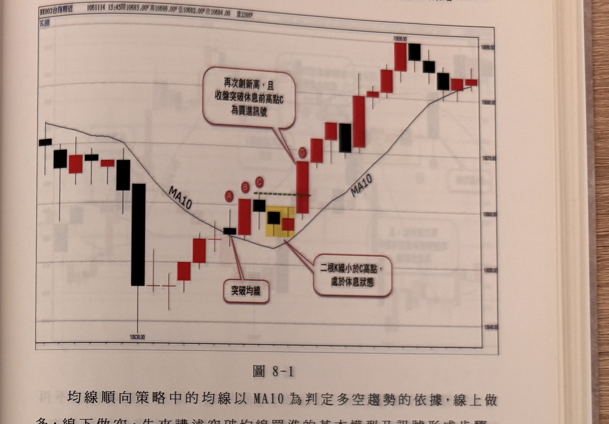

- **圖8-2**（p.158）：台指期5分鐘K線。A收盤跌破均線；B為隨後4根休息K線中的谷點；C收盤結實跌破B谷點形成放空訊號。示範空方鏡像流程。

  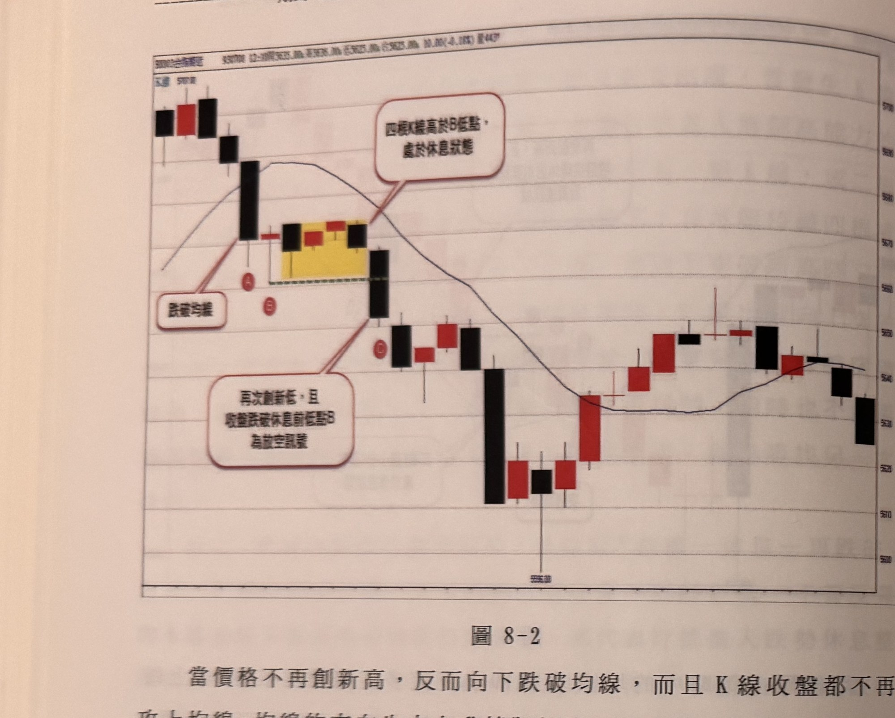

- **圖8-3**（p.159）：台指期5分鐘K線。A突破均線後形成層級1峰點B，兩根縮頭K線後C突破B高點，構成均線買訊；行情走高後D跌破均線形成層級1谷點，但F位置收盤又突破均線，尋找空訊步驟中斷；G再度跌破均線並於H形成谷點，I向下跌破H低點形成均線空訊。示範步驟因收盤反向穿越均線而必須重新起算的規則（訊號定義第8點）。

  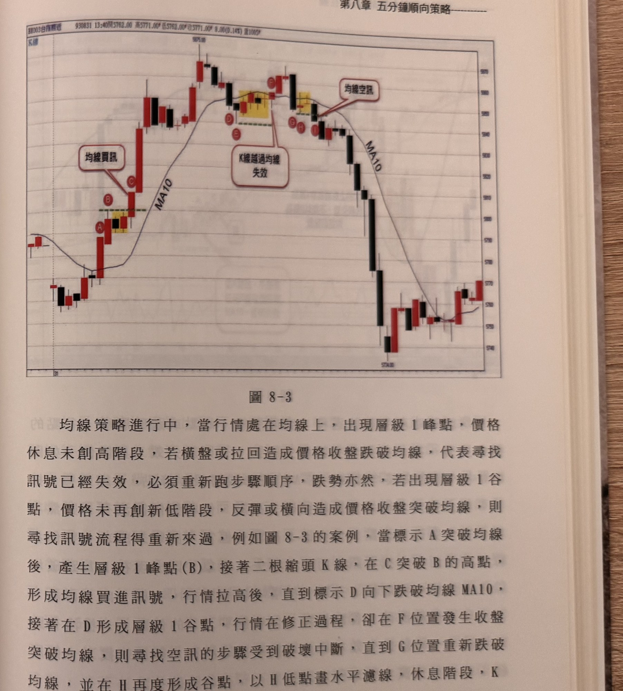

- **圖8-6**（p.162-163）：台指期5分鐘K線＋成交量。跳低開盤造成均線由上轉下，A處出現均線空訊，距轉折點雖超40點，但開盤後高低震幅未超40點，視為有效；A訊號K線跌點超20點（大K線），等反彈使停損縮至20點內，BC區間補空單；獲利逾30點後採15點折返停利（於9448點觸價停利）；F處出現均線買訊，但距轉折點達50點，且距波段低點D已反轉84點，超過界限應忽略。示範過濾規則1、2及補進場、折返停利規則。

  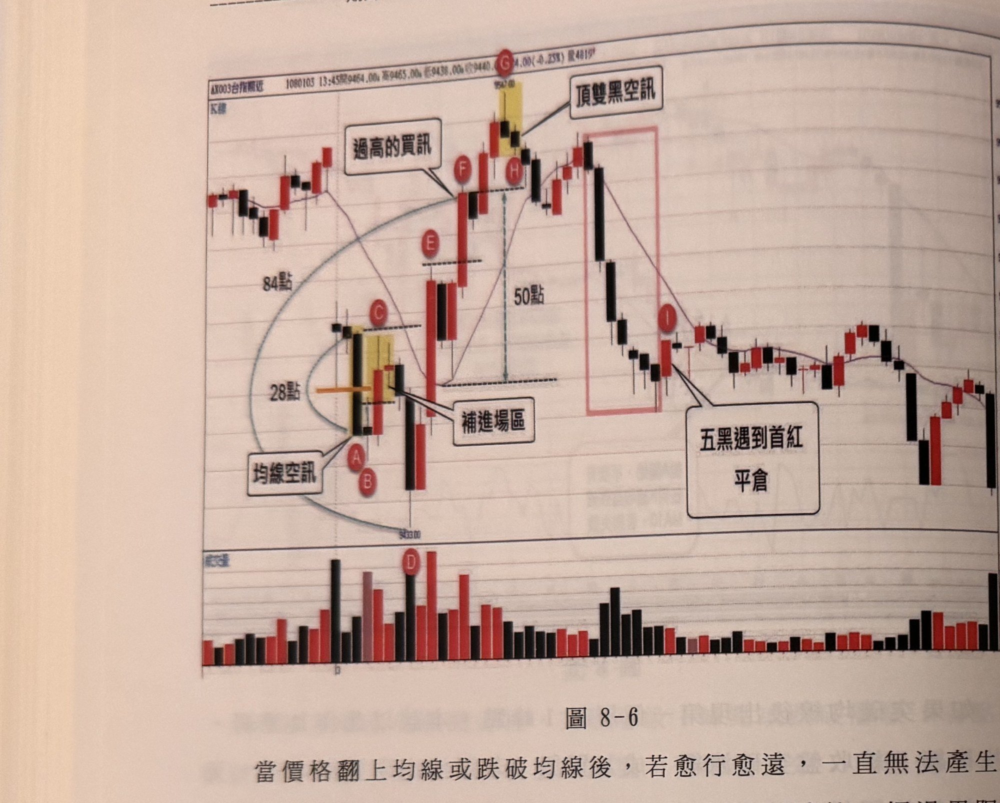

- **圖8-7**（p.163-164）：台指期5分鐘K線。波段低點O止跌反彈，A（均線轉折）在30點以內但C訊號距波段低點O已超過60點，屬「不夠誠意」的訊號，上檔空間有限，應忽略。示範過濾規則2。

  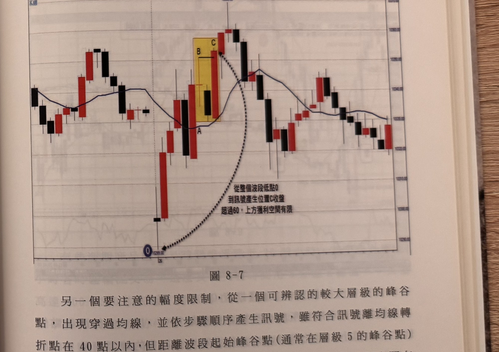

- **圖8-8**（p.164-165，永豐期貨GLEADER提供）：小型國企指數期貨5分鐘K線＋MA10＋RSI。A處縮腳下影線但隔根未跌破A低點，B處跌破A低點形成均線空訊，距轉折點雖超100點，仍可依50點固定停損進場放空；待RSI指標觸及10以下出現紅K即平倉。示範海外商品不受40點距離限制、固定點數停損與RSI輔助出場。

  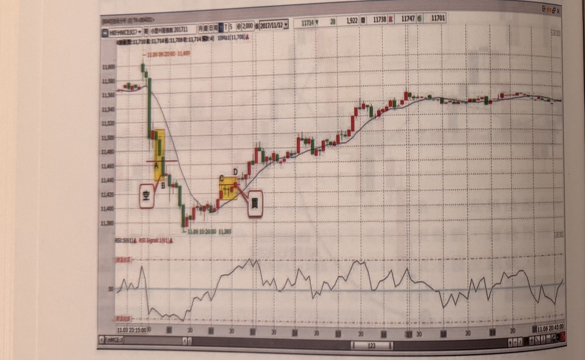

- **圖8-9**（p.165）：台指期盤後電子盤10分鐘K線。A處出現均線買訊（20點停損位置），B處出現均線空訊（20點停損位置）。示範電子盤（非連續盤）以10分鐘K線操作同一套步驟。

  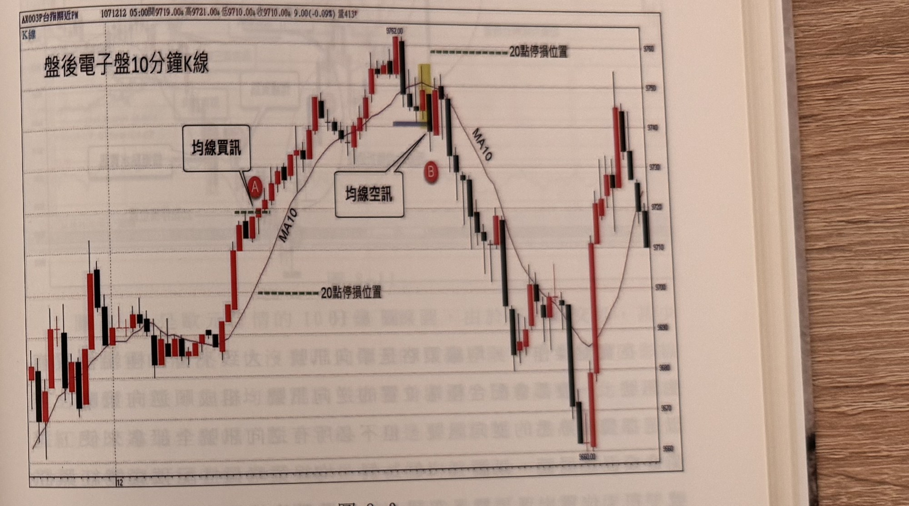

- **圖8-10**（p.166）：台指期近月5分鐘K線。A處頂雙黑空訊，行情重挫，B處雖有均線空訊但距轉折點過遠應忽略；隔日C處再現頂雙黑空訊，D處均線空訊同樣距轉折過遠應忽略；E處均線買訊距轉折點40點以內可進場；F為蜻蜓點水買訊（另章介紹）。示範順向訊號應搭配少數熟悉的逆向極端訊號（如頂底雙紅黑），且距轉折過遠的均線訊號應忽略。

  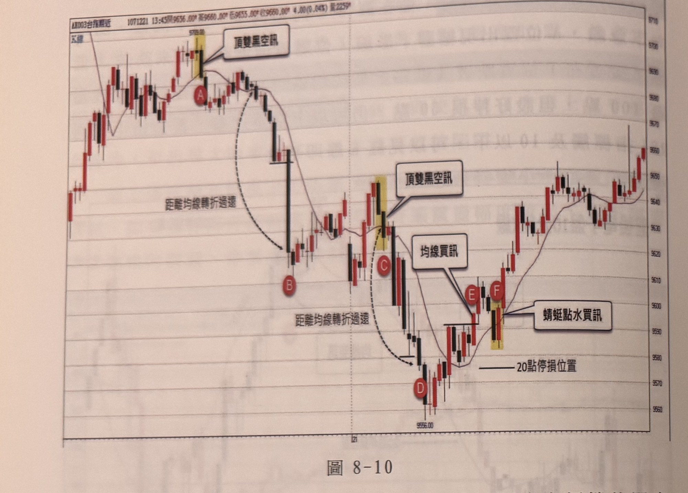

- **圖8-11**（p.167）：歐元期貨10分鐘K線＋RSI。A處影線突出但收盤未過均線，非有效買訊；B處才是真正買訊；C處破三低空訊觸停損；E為另一均線買訊；連續五根紅K後遇非紅K（十字線）即平倉；F處頂雙黑空訊後再破均線於G出現均線空訊，但因G之停損會侵入F訊號的進場價（加碼後結算恐虧損），不適合加碼；H處均線空訊可加碼，因其停損不會使F訊號無利可圖。示範加碼規則（過濾規則6）與「連五紅遇非紅平倉」的出場方式。

  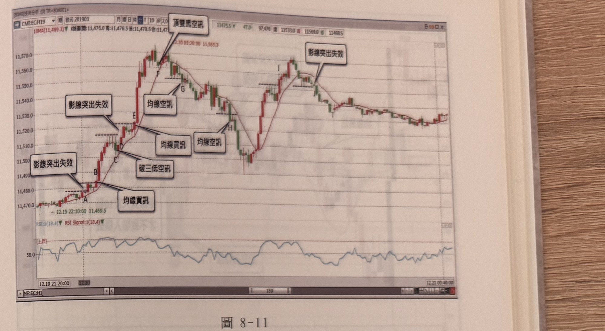

- **圖8-12**（p.168）：台指期近月5分鐘K線。行情陷入均線上下穿梭的橫盤格局，C處於均線上方形成層級1峰點，E突破C高點形成均線買訊，但距均線轉折點D不到10點，應忽略；其後G處均線空訊距轉折點F同樣不到10點，亦應忽略。示範過濾規則3（10點以內忽略）。

  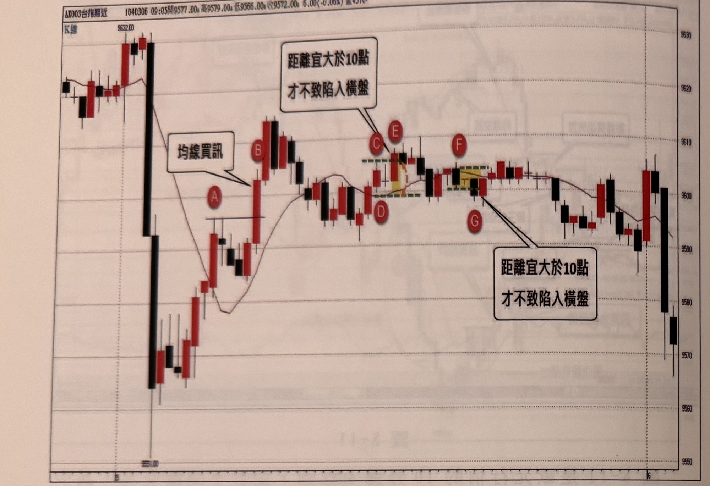

- **圖8-13**（p.169）：台指期近月5分鐘K線。AB形成底雙紅買訊，C處突破MA10形成均線買訊進場做多，10分鐘後DE形成頂雙黑空訊（極端位置逆向訊號），必須將多單平倉並反手放空。示範順向單遇逆向極端訊號須平倉反手的規則。

  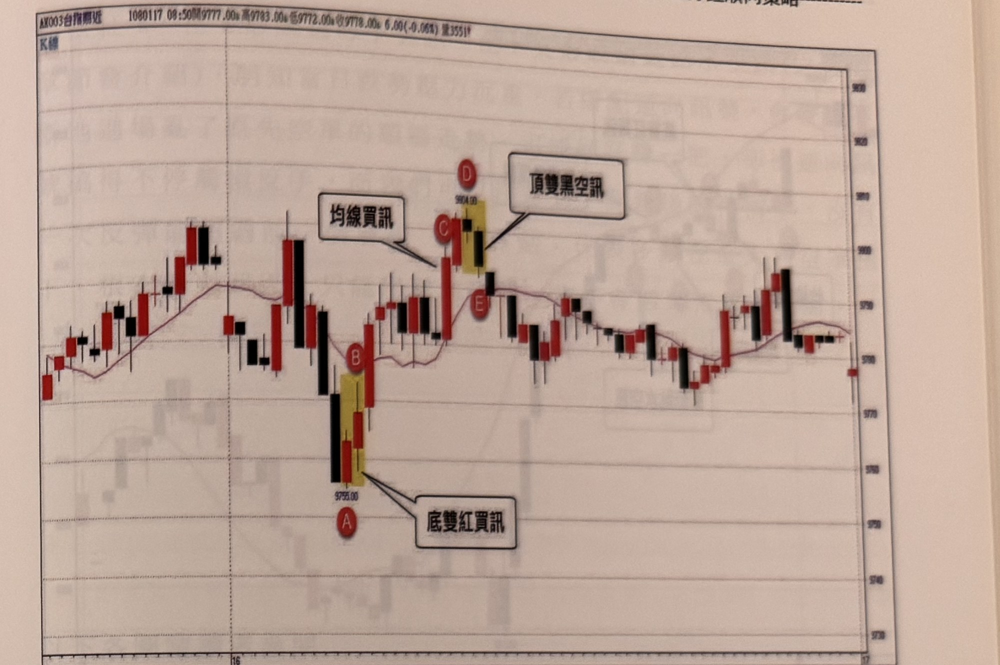

- **圖8-16**（p.172）：滬深300期指5分鐘K線。過三高買訊、底雙紅買訊組合後出現均線買訊，行情強勢上漲；圖說註明停損點設10大點。示範海外（陸股期指）商品之停損點數設定與訊號組合搭配。

  

- **圖8-17**（p.172，小H股指數期貨，永豐GLEADER提供）：A、B處出現均線空訊放空；C處開始縮腳，D再度縮腳，E的K線收盤跌破D低點即形成均線空訊（不必等F跌破C低點才進場，E位置即可進場放空）。示範縮腳情境下，只要跌破「最近一次」濾網低點即可進場，不必等跌破更早的谷位。註：此圖說與 p.156–158 的定義文字（濾網＝休息前的峰位C／谷位B）不一致，程式預設採定義文字，此圖說讀法以參數 `rest_extreme_filter` 提供，預設關閉。

  

- **圖8-18**（p.173，A50期指，永豐GLEADER提供）：A、B處出現買進訊號，C、D處出現放空訊號；圖說提醒：若電子盤價格常發呆不動，最好改在當地日盤操作。示範過濾規則7。

  

- **圖8-19**（p.172-173）：台指期近月5分鐘K線。A、B與C、D兩段買進訊號，E、F處出現空訊；圖說：行情持續在均線上方逾1小時未觸及均線，代表遵循性極強，首度觸及均線可作停利點。示範停利規則2（均線遵循性停利）。

  

- **圖8-20**（p.174，小道瓊5分鐘K線，永豐期貨GLEADER）：A、B處空訊，停損設20點；圖說：像B的空訊跌點近40點，停損可設在K線中線，或選擇反彈再空；最低點隔根出現底V字買訊。C、D處買進訊號。示範海外商品停損彈性設定。

  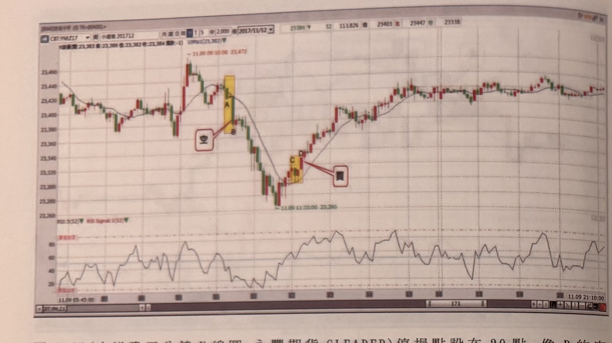

- **圖8-21**（p.174）：小道瓊期貨5分鐘K線（與圖8-20同組數據延伸視圖）。圖說提醒：除非有重大國際事件，一般電子盤行情小，最好在當地日盤上午盤交易，美股相關商品建議台灣時間12點前交易完畢，有訊號則做、無訊號則休息。示範過濾規則8。

  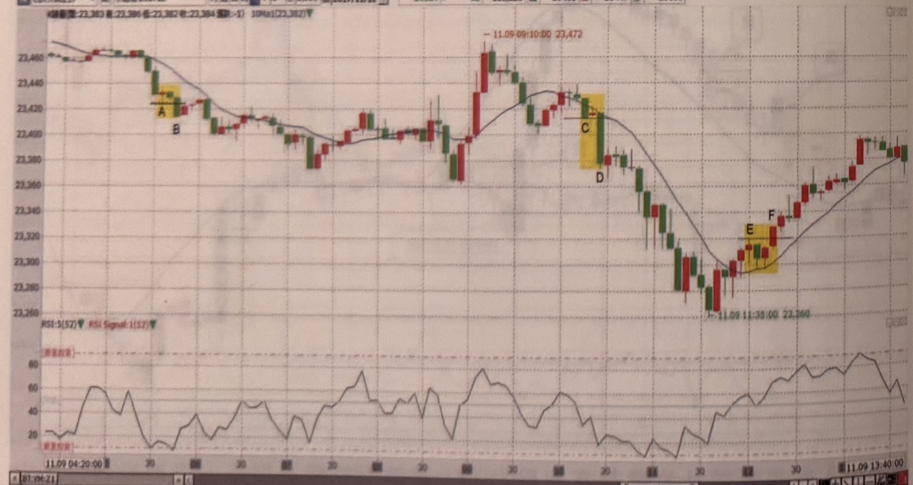

- **圖8-22**（p.175，小道瓊5分鐘K線，永豐期貨GLEADER）：A、B、C處與D、E處各出現放空訊號，F、G處出現買進訊號；圖說：E不適合作為C的加碼空點，因為E的停損20點位置若被觸及將造成淨損。示範加碼規則（過濾規則6）的另一實例。

  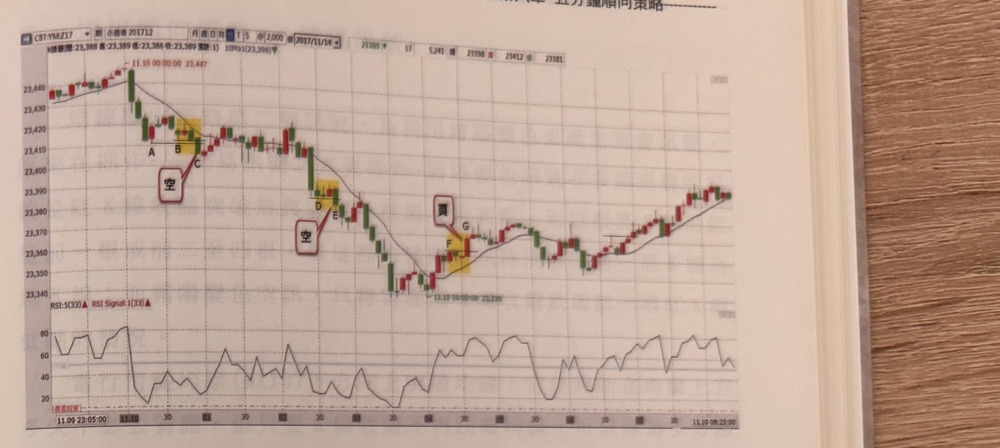

- **圖8-23**（p.175）：迷你法蘭克福指數期貨5分鐘K線＋RSI。連續多個放空訊號（含一次買進訊號穿插）後行情重挫破底；圖說：稍後價格重新下穿均線，多單被停損，繼之均線空訊登場，行情自此一路下跌200點，其間兩個空訊可視為加碼點。示範連續加碼放空的實例。

  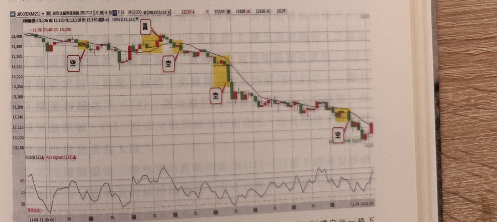


## 9. 作者提醒與常見錯誤

- 不能單純用「收盤穿越均線」判斷買賣，會葬身盤整格局，必須搭配「突破/跌破前一個休息區高低點」的完整步驟（p.155）。
- 峰位／谷位濾網只有一次收盤突破的機會，不可靠隔根再次確認，必須另尋新的峰谷位（p.156）。
- 步驟進行中若價格收盤反向穿越均線，代表尋找訊號流程已失效，必須整個重新開始，不可延續舊的峰谷濾網（p.159）。
- 訊號出現得太晚或太高（距轉折點過遠、距波段起點過遠），即使步驟上完全符合條件，也可能是「不夠誠意」的訊號，容易碰上獲利回吐，宜提高警覺甚至忽略（p.163-164）。
- 台股波動變小才需要嚴格的40點/60點/10點距離限制，操作海外期貨不必生搬硬套，做好停損風控即可（p.164）。
- 實盤操作建議只搭配少數自己熟悉的逆向極端訊號（如頂底雙紅黑）與順向策略混用，不必把所有逆向訊號都用上，以免造成混亂（p.166）。
- 加碼務必計算「原部位＋加碼部位」在加碼單被停損時是否仍為淨正獲利，否則加碼恐成為「豬隊友」（p.167）。
- 電子盤／海外盤：避免在價格發呆不動、行情清淡的電子盤時段硬做；美股相關商品建議台灣時間12點前完成交易，避免熬夜燃燒健康操作（p.173-174）。

## 10. 規則速查（Checklist）

- [ ] 已確認MA10方向（多方向上／空方向下）
- [ ] 已找到層級1峰點（多）或層級1谷點（空）作為濾網
- [ ] 休息期間K線收盤未反向穿越均線
- [ ] 訊號K線「收盤」突破峰位濾網（買）／跌破谷位濾網（賣）
- [ ] 距均線轉折點在10～40點之間（跳空狀況改用開盤後幅度40點界限）
- [ ] 距波段起始峰谷點未超過60點
- [ ] 若為大K線（跌/漲逾20點），已考慮等反彈/拉回補進場
- [ ] 加碼前已確認「原部位＋加碼部位」淨結算為正獲利
- [ ] 是否出現對立極端逆向訊號需要平倉反手

## 11. 機器可讀規則

```yaml
signal: 均線順向策略
side: both
timeframe: 5m
conditions:
  long:
    - id: L1
      desc: K線收盤站上MA10，視為趨勢轉折起點
      source: p.157
    - id: L2
      desc: 站上均線後K線持續創新高，直到某根K線高點未創新高，進入休息狀態（可1根或數根，收盤不可跌破MA10）
      source: p.156
    - id: L3
      desc: 以休息期間最高點畫出峰位濾網
      source: p.156
    - id: L4
      desc: 其後某根K線收盤突破峰位濾網（創新高）即為買進訊號；僅收盤突破有效，影線突破不算，且不可等隔根確認
      source: p.156-157
    - id: L5
      desc: 若等待期間收盤先跌破MA10，流程失效，需重新從L1開始
      source: p.159
  short:
    - id: S1
      desc: K線收盤跌破MA10，視為趨勢轉折起點
      source: p.156
    - id: S2
      desc: 跌破均線後K線持續創新低，直到某根K線低點未創新低，進入休息狀態（可1根或數根，收盤不可突破MA10）
      source: p.156
    - id: S3
      desc: 以休息期間最低點畫出谷位濾網
      source: p.156
    - id: S4
      desc: 其後某根K線收盤跌破谷位濾網（創新低）即為放空訊號；僅收盤跌破有效，影線跌破不算，且不可等隔根確認
      source: p.156
    - id: S5
      desc: 若等待期間收盤先突破MA10，流程失效，需重新從S1開始
      source: p.159
entry:
  price: 訊號K線收盤價
  timing: 訊號K線收盤當根立即進場；大K線（跌/漲逾20點）可等反彈/拉回使停損縮小至20點內再補進場
  source: p.156-157, p.162-163
stop_loss:
  points: 20（台指5分鐘常見基準；海外商品依商品調整，如小H 50點、滬深300期指 10點、小道瓊20點）
  ref: 訊號K線收盤價反方向20點；大K線時等反彈/拉回至訊號K高／低點20點以內再補進場，停損設在該高／低點（或直接進場、停損設在K線中線）
  reverse_on_stop: 書中未明確說明（一般停損情境）；若遇對立極端逆向訊號則須平倉反手
  source: p.162-165, 圖8-9/8-16/8-20/8-31
exit:
  trailing_stop: 折返15點停利（多處範例）
  ma_touch: 若行情逾1小時未觸及均線，首度觸及均線可作停利點
  opposite_extreme_signal: 出現對立極端逆向訊號（如頂雙黑/底雙紅）須立即平倉並反手
  source: p.163, p.169, p.172(圖8-19)
filters:
  - id: F1
    desc: 訊號K線收盤離均線轉折點不宜超過40點（跳空狀況改用開盤後高低震幅40點為界限）
    source: p.162
  - id: F2
    desc: 距波段起始峰谷點（層級5以上）超過60點宜忽略
    source: p.163-164
  - id: F3
    desc: 訊號K線收盤離均線轉折點不足10點宜忽略
    source: p.168
  - id: F4
    desc: 跳空延續原趨勢開盤時，訊號K線離開盤後最低/最高點超過60點宜忽略
    source: p.184
  - id: F5
    desc: 台股嚴格距離限制不適用於海外期貨商品（震幅較大者不受40/60/10點限制）
    source: p.164
  - id: F6
    desc: 加碼訊號的停損點若侵入前一筆訊號進場價，導致合計結算為虧損，不可加碼
    source: p.167
```

## 12. 待確認事項

無。缺頁僅影響範例圖，見 frontmatter `missing_pages`。

## 13. 原文出處

- `extracted/pages/IMG_8401.md`（p.154–155）
- `extracted/pages/IMG_8402.md`（p.156–157）
- `extracted/pages/IMG_8403.md`（p.158–159）
- `extracted/pages/IMG_8405.md`（p.162–163）
- `extracted/pages/IMG_8406.md`（p.164–165）
- `extracted/pages/IMG_8407.md`（p.166–167）
- `extracted/pages/IMG_8408.md`（p.168–169）
- `extracted/pages/IMG_8411.md`（p.172–173）
- `extracted/pages/IMG_8412.md`（p.174–175）
