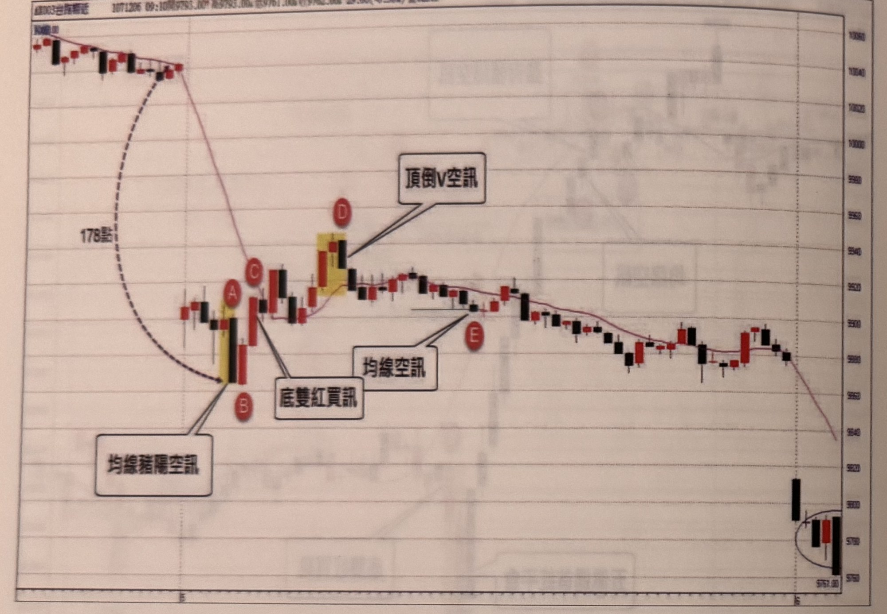
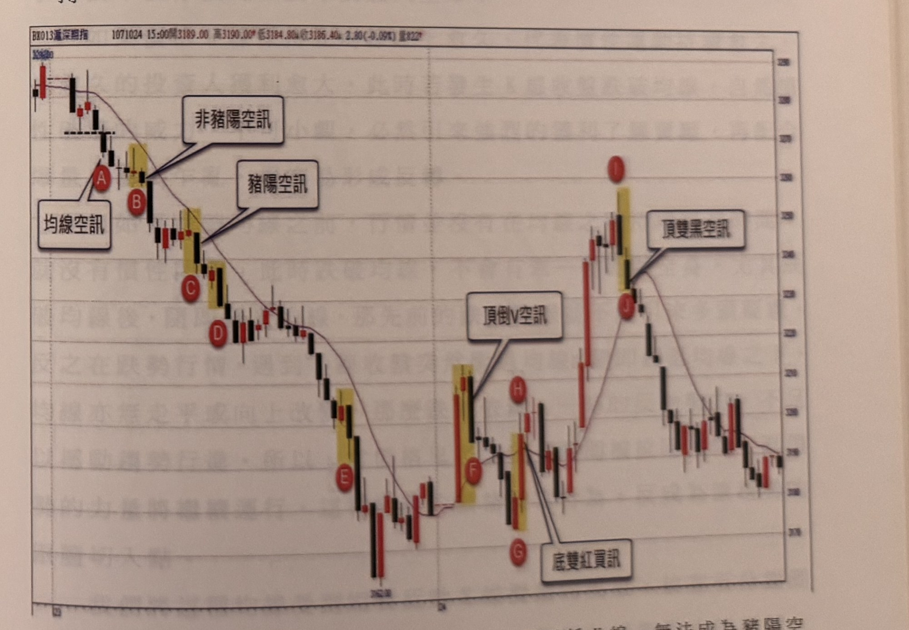

# 均線順向策略—豬陽訊號

> 一句話摘要：在MA10確立的順向趨勢中，利用「黑K接紅K」（買）或「紅K接黑K」（賣）的一組兩根反轉K棒組合作為更快速的切入訊號，取代等待突破/跌破前高前低的完整流程。

## 1. 核心概念

- 豬陽訊號源自作者另一著作《交易訊號之直覺操作》中的「豬陽變色」訊號，原始定義為紅K線收盤突破「最靠近的一根黑K線」高點（該黑K可以是前一根，也可以是前二至四根中最近的一根）（p.177）。
- 在均線順向策略中，豬陽買訊「特別限定前一根K線必須是黑K線」，即固定為「一黑接一紅」的兩根K線組合；豬陽空訊則限定「前一根K線必須是紅K線」，為「一紅接一黑」組合（p.177）。
- 概念邏輯：均線之上（多方趨勢中）出現一根黑K線，代表行情遇阻拉回修正；若多頭夠強，會在隔一根立刻以紅K線收盤攻過該黑K線最高點，形成豬陽變色買訊，是比等待前高突破更快速的切入方式（p.177）。空方鏡像：均線之下出現一根紅K線，代表多頭試圖反攻，若空方夠強，會在隔一根直接以黑K線收盤殺破該紅K線低點，形成豬陽變色空訊（p.177）。

## 2. 適用前提

- 週期：5分鐘K線；交易時間長達10小時以上的商品（如台指盤後電子盤），或本節「均線策略」通用規則所述，10分鐘、15分鐘、30分鐘K線圖均可採用，均線參數不變（p.178、182）。
- 須先由MA10確立多空趨勢方向（p.177）。
- 均線走平或緩慢移動的盤整格局中，均線失去支撐/壓力效果，此時豬陽訊號容易失敗，不建議依賴（p.183-184，詳見「7. 過濾」）。

## 3. 訊號定義

### 多方（豬陽買訊）

1. 行情已從MA10下方突破均線，且K線收盤持續未再跌破均線（多方趨勢持續中）（p.177）。
2. 均線之上出現一根黑K線（p.177）。
3. 該黑K線的下影線須完全在MA10之上，不可下探至均線之下（p.177）。
4. 緊接下一根K線以紅K線收盤，且收盤價突破前一根黑K線的最高點 → 形成豬陽變色買訊（p.177）。
5. 此時均線（MA10）方向須朝上（p.177）。
6. 訊號宜在突破均線後的初期產生，且訊號K線（紅K）必須是「突破均線後最高的一根K線」（即創新高）（p.177）。
7. 「突破均線後最高K線」的比對基準：突破均線之前，宜至少有連續3根K線收盤位於均線下方，才能以「突破均線後」作為比對起點；若均線下方的K線不足3根，則訊號K線須比對更早、具有連續3根K線在均線下方的那一波段高點，而不是只比對本次突破均線後的高點（p.179，圖8-26：AB僅有2根K線在均線下方，比對基準須往前取更早的高點，AB因此不成立；CD有連續3根K線在均線下方，比對基準才是本次突破均線後的高點，CD成立）。

### 空方（豬陽空訊，鏡像）

1. 行情已跌破MA10，且K線收盤持續在均線下方（空方趨勢持續中）（p.177）。
2. 均線之下出現一根紅K線（p.177）。
3. 該紅K線的上影線不可超過（突破）MA10（p.177）。
4. 緊接下一根K線以黑K線收盤，且收盤價跌破前一根紅K線的最低點 → 形成豬陽變色空訊（p.177）。
5. 此時均線方向須朝下（p.177–178：原文於p.177末尾「(3)當」處中斷，p.178延續「產生這種豬陽空訊時，均線必須朝下行情中，當價格處在橫向整理時，均線會逐漸走平，代表跌勢受到抵抗，此時豬陽空訊不見得代表空方的強硬表態，因此均線朝下是必要的」，確認與買訊條件5鏡像一致）。
6. 訊號宜在跌破均線後的初期產生，且訊號K線（黑K）必須是「跌破均線後最低的一根K線」（p.178：「(4)、當出現豬陽空訊時，它必須是行情跌破均線後最低K線」；並見p.182圖8-29範例）。
7. 「跌破均線後最低K線」的比對基準（鏡像自買訊條件7）：跌破均線之前，宜至少有連續3根K線收盤位於均線上方，才能以「跌破均線後」作為比對起點；若均線上方的K線不足3根，則訊號K線須比對更早、具有連續3根K線在均線上方的那一波段低點（p.180，圖8-27：C處僅有1根K線收盤站上均線，隨後D跌破前一根紅K低點，但因均線上方不足3根K線，D須比對更早的低點B才成立，若僅以C區間比對則D不算訊號；若B反彈後有3根以上K線站上均線，則後續的空訊D可直接成立，不必再往前比對）。

## 4. 進場

- 以訊號K線（第二根，紅K買／黑K賣）之「收盤」確認即進場（p.177）。
- 若行情原本已沿順向趨勢發展（例如開盤前均線已朝某方向，當日跳空延續開盤），則不必等待前波高/低點確認，任一點位都可能是「突破均線後最高K線」（多方）或「跌破均線後最低K線」（空方），只要符合豬陽K線組合條件即可進場，但仍受「距開盤後最低/最高點超過60點」的距離濾網限制（p.184-185，圖8-31）。

## 5. 停損

- 書中在本節未另訂新的停損規則，延用「均線順向策略」常見基準：台指期5分鐘K線約20點，停損位置＝訊號K線收盤價反方向20點（圖8-31的「20點停損位置」畫在訊號K收盤外20點）；訊號K本身高／低點距收盤超過20點時，比照均線順向策略等拉回/反彈到高／低點20點以內再補進場、停損設在該高／低點（p.162-163），或直接進場、停損設在K線中線（p.174）。
- 海外商品依商品特性調整，本節未提供新的海外案例點數，可參照 `q3-08-均線順向策略.md` 之停損設定。
- 停損後是否反手：書中未明確說明。

## 6. 出場 / 停利

- 折返15點停利：與均線順向策略共用同一套折返停利機制（p.184-185，圖8-31之G、H點示範15點折返停利）。
- 「五黑遇首紅」平倉：連續多根黑K下跌後，出現第一根紅K即平倉出場（p.185-186，圖8-32示範：連續黑K重挫後，隔根D收紅，即為「五黑遇首紅」平倉訊號出場）。
- 其餘出場方式書中未明確說明。

## 7. 過濾：不做的情況

1. 訊號K線必須同時是「突破均線後最高K線」（買）或「跌破均線後最低K線」（賣），否則即使外觀符合黑接紅／紅接黑組合，也不成立，須忽略（p.182，圖8-29之A點：外觀是豬陽空訊，但非跌破均線後最低位置，忽略；p.185-186，圖8-32之B點同理）。認定「最高/最低K線」時，若突破/跌破均線前，均線另一側的K線不足連續3根，須往前比對更早、具連續3根K線的那一波段高/低點，不能只用本次突破/跌破後的高低點自我比較（p.179-180，圖8-26、圖8-27）。
2. 訊號K線收盤離均線轉折點不足10點，宜忽略（與均線順向策略過濾規則相同，p.182，圖8-29之B點）。
3. 唯有同時符合「均線空訊（或買訊）」與「豬陽空訊（或買訊）」兩者的位置，才是真正有效的訊號（p.182，圖8-29之C點：均線空訊也是豬陽空訊，方為有效）。
4. 均線走平／緩慢移動的盤整格局中，K線影線經常穿梭均線兩側，此時均線不具支撐或壓力效果，豬陽訊號容易失敗，宜謹慎或忽略（p.183-184，圖8-30：C突破均線後下影線又觸及均線之下，代表支撐無效，隨後E的豬陽買訊被停損）。
   - 判斷方法：突破均線後，應觀察K線下影線是否有數根不再觸碰均線（顯示支撐生效）才可信賴其後的豬陽買訊；跌破均線後同理，上影線應有數根不觸碰均線，才具壓力效果（p.183-184）。
   - 只有當K線持續保持在均線同一側（不反覆穿梭）的前提下出現的豬陽訊號，較具可靠度（p.184）。
5. 跳空延續原趨勢開盤時，若訊號K線收盤距「開盤後最低點（多）或最高點（空）」超過60點，宜忽略（p.184-185，圖8-31：C點距開盤最低點約46點，未超過60點，仍屬有效）。
6. 跳空幅度過大時，須額外判斷訊號的合理性，避免盲從：若訊號K線距平盤過遠（如逾150點以上）、訊號K線本身跌/漲點數過大（屬大K線）、且行情尚未經過任何「折返走勢（換手）」，恐怕會追高殺低，宜考慮忽略（p.186-187，圖8-33：跳低140點開盤，A處均線豬陽空訊時距平盤已178點，訊號K線跌點達34點且無反彈換手，作者建議可忽略此訊號）。
   - 作者提出的自我檢核問題（非量化規則，屬判斷框架）：再下跌空間夠不夠？訊號K線是否為大K線、會不會立刻引來獲利回吐？停損會不會立刻被掃出場？不做會不會留下遺憾？若答案都是「不做也不會怎樣」，就忽略訊號（p.187）。
7. 隨後出現的底雙紅買訊/頂雙黑空訊等訊號，若其組合高低點差過大（例如超過45點），亦宜忽略（p.187，圖8-33之C處底雙紅買訊，組合高低點近45點以上，過大應忽略）。此為頂底雙紅黑訊號的過濾規則，此處作為與豬陽訊號互相取捨的參考例子，非豬陽訊號本身的條件。

## 8. 範例解析

- **圖8-25**（p.178，小道瓊期貨15分鐘K線）：均線策略／豬陽訊號的使用週期不限五分鐘K線，10、15、30分鐘K線圖皆可，本圖採15分鐘K線。行情先在均線下方逾3根K線，隨價格突破均線、均線走平轉朝上，A為回跌黑K線（下影線在均線之上），隔根B以紅K線收盤突破A高點，形成豬陽買訊；圖中另示範豬陽空訊定義（C、D）。示範豬陽買訊/空訊基本定義（p.177-178）與週期彈性。

  

- **圖8-26**（p.179，小道瓊期貨15分鐘K線）：AB形成豬陽買訊外觀，但均線下方僅有2根K線收盤，不足3根，比對基準須往前取更早的最高K線，AB因此不成立均線豬陽買訊；CD形成的豬陽買訊，因均線下方已有連續3根K線收盤，比對基準即為本次突破均線後的高點，CD成立為有效訊號。示範訊號定義多方條件7（3根K線比對基準規則）。

  

- **圖8-27**（p.180，台指期分時K線）：跳高開盤收紅後下殺4根黑K線至均線下方B低點，反彈至C收盤突破均線（僅1根K線站上均線），隔根隨即又壓回均線下方，D黑K線收盤跌破前一根紅K線（C）低點，形成豬陽空訊外觀；但因C僅1根K線站上均線（不足3根），D須比對更早的低點B才能算「跌破均線後最低K線」，D並未低於B，因此不成立。圖說並指出：若B反彈後有3根以上K線站上均線，則後續的豬陽空訊D可直接視為有效訊號。示範訊號定義空方條件7（鏡像）。

  

- **圖8-28**（p.181，台指期分時K線）：C處開始跌破MA10，D出現黑K線跌破前一根紅K線低點，形成均線豬陽空訊外觀，但D收盤離均線轉折點（彎曲中點）不足10點，暗示行情可能進入橫向盤整，宜忽略。示範過濾規則2（10點距離濾網）的另一實例。

  

- **圖8-29**（p.182）：台指期近月盤後電子盤10分鐘K線＋MA10。A處外觀是豬陽空訊，但非跌破均線後最低位置，忽略；B處豬陽買訊，但距均線轉折點不到10點，且非突破均線後最高K線，忽略；C處為均線空訊同時也是豬陽空訊，符合條件，為真正有效的放空訊號，隨後行情持續重挫。示範過濾規則1、2、3。

  

- **圖8-30**（p.183-184）：台指期近月5分鐘K線。跳平高盤後逐根下殺破平盤，A影線觸及均線但收盤未過，B低點再攻一次，C收盤突破均線後，D的下影線又觸碰均線之下（顯示均線支撐失效），E出現豬陽買訊時應提高警覺，最終被停損；F到J之間K線在均線上下反覆穿梭，無法判斷多空，不適合操作；只有像K區、L區有數根K線持續保持在均線一側，此前提下的豬陽訊號才較可靠。示範過濾規則4（均線支撐/壓力有效性判斷）。

  

- **圖8-31**（p.184-185）：台指期近月5分鐘K線。開盤前均線已朝上發展，本日跳高開盤延續趨勢；B處出現帶下影線黑K拉回（20點停損位置），隔根C向上攻過黑K高點，形成豬陽買訊（同時也是均線買訊）；C收盤距開盤最低點約46點，未超過60點，屬有效訊號；行情漲抵D（盤中最高點）後採15點折返停利於E平倉；F處出現另一次均線買訊，重新進場多單，抵G（盤中最高點）後同樣採15點折返停利，整段上漲行情因此被切割成兩次交易。示範進場、距離濾網5、折返停利，以及豬陽訊號與均線買訊重合的組合情境。

  

- **圖8-32**（p.185-186）：台指期近月5分鐘K線。跳高開盤即收黑（但跳幅不夠高，未達開盤戰法的跳高收黑空訊門檻）；價格跌破均線後A處兩根紅K反彈至B，隔根收黑雖外觀像豬陽空訊，但B非跌破均線後最低K線，忽略；再隔根C進一步跌破A低點，形成均線空訊，彌補帶瑕疵的豬陽空訊；隨後連續多根黑K重挫，最後一根黑K反而跌點最大，隔根D收紅，構成「五黑遇首紅」平倉訊號出場；DE另形成底雙紅買訊，可不必再操作。示範過濾規則1與出場的「五黑遇首紅」規則。

  

- **圖8-33**（p.186-187）：台指期近月5分鐘K線。當天跳低140點開盤，緩步走低至A處出現均線豬陽空訊，此時距平盤已178點，訊號K線跌點34點（大K線），因缺乏折返換手、擔心獲利回吐與停損被掃出場等理由，作者判斷可忽略此訊號；隔根B止跌，C處形成底雙紅買訊，但組合高低點近45點以上，過大宜忽略；直到D區出現頂倒V空訊（另一章節訊號），幅度較合理，才是較適合進場的位置。示範過濾規則6、7，及訊號合理性的自我檢核流程。

  

- **圖8-34**（p.187）：滬深300期指5分鐘K線。A處均線空訊起跌，B處外觀近似但非盤中當下最低K線，因此不成立為豬陽空訊；行情續跌後C處才是真正符合條件的豬陽空訊；此後陸續出現底雙紅買訊、頂倒V空訊、頂雙黑空訊等（皆為其他章節訊號，此處僅作行情脈絡參考）。示範過濾規則1（訊號K線須為當下最低/最高點）在海外商品上的應用。

  


## 9. 作者提醒與常見錯誤

- 豬陽訊號的黑接紅／紅接黑組合，必須嚴格限定「緊鄰前一根」K線，且該K線的影線不可穿越均線，否則不成立（p.177）。
- 外觀像豬陽訊號，但訊號K線並非「突破均線後最高」或「跌破均線後最低」K線時，即使兩根K線組合外觀正確，也必須忽略（p.182）。
- 均線走平、K線反覆穿梭均線兩側的盤整格局中，豬陽訊號的可靠度大幅降低，應等K線持續守在均線一側數根之後再信任訊號（p.183-184）。
- 跳空幅度大、訊號K線本身為大K線、且行情尚未經過折返換手時，不宜盲目跟進訊號，應自問「不做會不會留下遺憾」等問題來檢核訊號的合理性（p.186-187）。

## 10. 規則速查（Checklist）

- [ ] 均線（MA10）方向已確立（多方向上／空方向下）
- [ ] 均線同側出現「黑K（多方情境）」或「紅K（空方情境）」
- [ ] 該K線影線未穿越均線（下影線在均線上方／上影線在均線下方）
- [ ] 緊鄰下一根K線收盤突破（買）或跌破（賣）前一根K線的高／低點
- [ ] 訊號K線同時是「突破均線後最高K線」（買）或「跌破均線後最低K線」（賣）
- [ ] 距均線轉折點至少10點
- [ ] 若為跳空延續開盤，距開盤後最低/最高點未超過60點
- [ ] 均線近期未出現反覆穿梭（無明顯盤整訊號）
- [ ] 若跳空幅度大／訊號為大K線／無折返換手，已檢核訊號合理性

## 11. 機器可讀規則

```yaml
signal: 豬陽訊號（均線順向策略—豬陽變色）
side: both
timeframe: 5m
conditions:
  long:
    - id: L1
      desc: 行情已突破MA10，K線收盤持續未再跌破均線（多方趨勢中）
      source: p.177
    - id: L2
      desc: 均線之上出現一根黑K線，其下影線完全在MA10之上
      source: p.177
    - id: L3
      desc: 緊鄰下一根K線以紅K收盤，且收盤突破前一根黑K線最高點
      source: p.177
    - id: L4
      desc: 此時MA10方向朝上
      source: p.177
    - id: L5
      desc: 訊號K線（紅K）須為突破均線後最高的一根K線
      source: p.177
    - id: L6
      desc: "「突破均線後最高K線」比對基準：均線下方需連續3根K線才能以本次突破為比對起點；不足3根則須比對更早、具連續3根K線在均線下方的波段高點"
      source: p.179
  short:
    - id: S1
      desc: 行情已跌破MA10，K線收盤持續在均線下方（空方趨勢中）
      source: p.177
    - id: S2
      desc: 均線之下出現一根紅K線，其上影線不超過MA10
      source: p.177
    - id: S3
      desc: 緊鄰下一根K線以黑K收盤，且收盤跌破前一根紅K線最低點
      source: p.177
    - id: S4
      desc: 此時MA10方向須朝下（已依p.178原文確認，與買訊鏡像一致）
      source: p.177-178
    - id: S5
      desc: 訊號K線（黑K）須為跌破均線後最低的一根K線
      source: p.178, p.182（圖8-29）
    - id: S6
      desc: "「跌破均線後最低K線」比對基準（鏡像L6）：均線上方需連續3根K線才能以本次跌破為比對起點；不足3根則須比對更早、具連續3根K線在均線上方的波段低點"
      source: p.180（圖8-27）
entry:
  price: 訊號K線（第二根反轉K線）收盤價
  timing: 訊號K線收盤當根立即進場
  source: p.177
stop_loss:
  points: 20（台指5分鐘常見基準，延用均線順向策略設定）
  ref: 訊號K線收盤價反方向20點；大K線比照均線順向策略補進場
  reverse_on_stop: 書中未明確說明
  source: 圖8-31, p.162-163
exit:
  trailing_stop: 折返15點停利
  five_black_first_red: 連續黑K下跌後首根紅K出現即平倉（"五黑遇首紅"）
  source: p.185-186（圖8-32）
filters:
  - id: F1
    desc: 訊號K線須為突破均線後最高K線（買）或跌破均線後最低K線（賣），否則忽略
    source: p.182
  - id: F2
    desc: 訊號K線收盤離均線轉折點不足10點宜忽略
    source: p.182, p.181（圖8-28）
  - id: F6
    desc: 認定「最高/最低K線」時，若突破/跌破均線前另一側K線不足連續3根，須往前比對更早、具連續3根K線的那一波段高/低點
    source: p.179-180
  - id: F3
    desc: 均線走平、K線反覆穿梭均線兩側時，訊號可靠度低，宜謹慎或忽略
    source: p.183-184
  - id: F4
    desc: 跳空延續開盤時，訊號K線距開盤後最低/最高點超過60點宜忽略
    source: p.184-185
  - id: F5
    desc: 跳空幅度過大、訊號K線為大K線、且無折返換手時，宜自我檢核合理性後考慮忽略
    source: p.186-187
```

## 12. 待確認事項

無。p.178–181 已補拍併入：p.177末尾「(3)當」中斷處已於p.178接續確認（均線須朝下、訊號須為跌破均線後最低K線），與原先鏡像推論一致；並新增「最高/最低K線之3根K線比對基準」規則（p.179-180，圖8-26、圖8-27）。缺頁僅剩範例圖，見 frontmatter `missing_pages`（現為空）。

## 13. 原文出處

- `extracted/pages/IMG_8413.md`（p.176–177）
- `extracted/pages/IMG_8414.md`（p.178–179）
- `extracted/pages/IMG_8415.md`（p.180–181）
- `extracted/pages/IMG_8416.md`（p.182–183）
- `extracted/pages/IMG_8418.md`（p.184–185）
- `extracted/pages/IMG_8419.md`（p.186–187）
