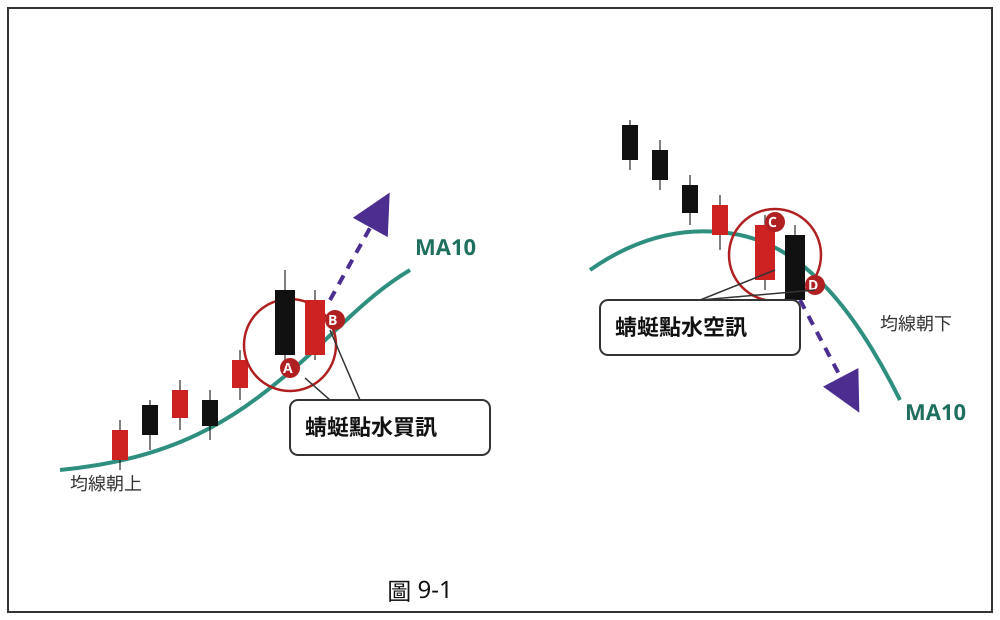
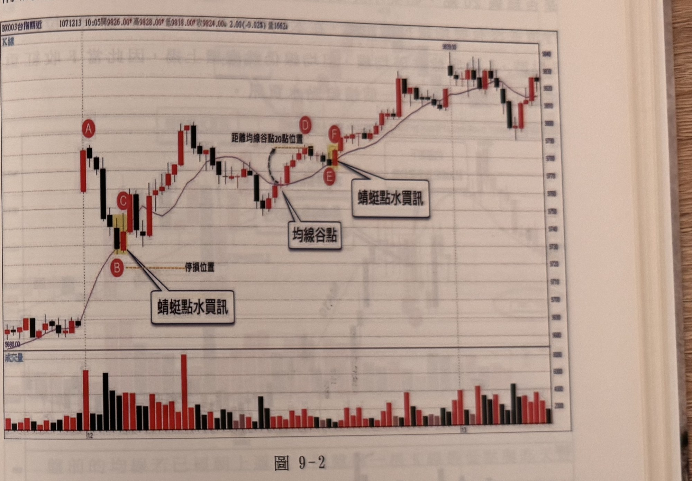
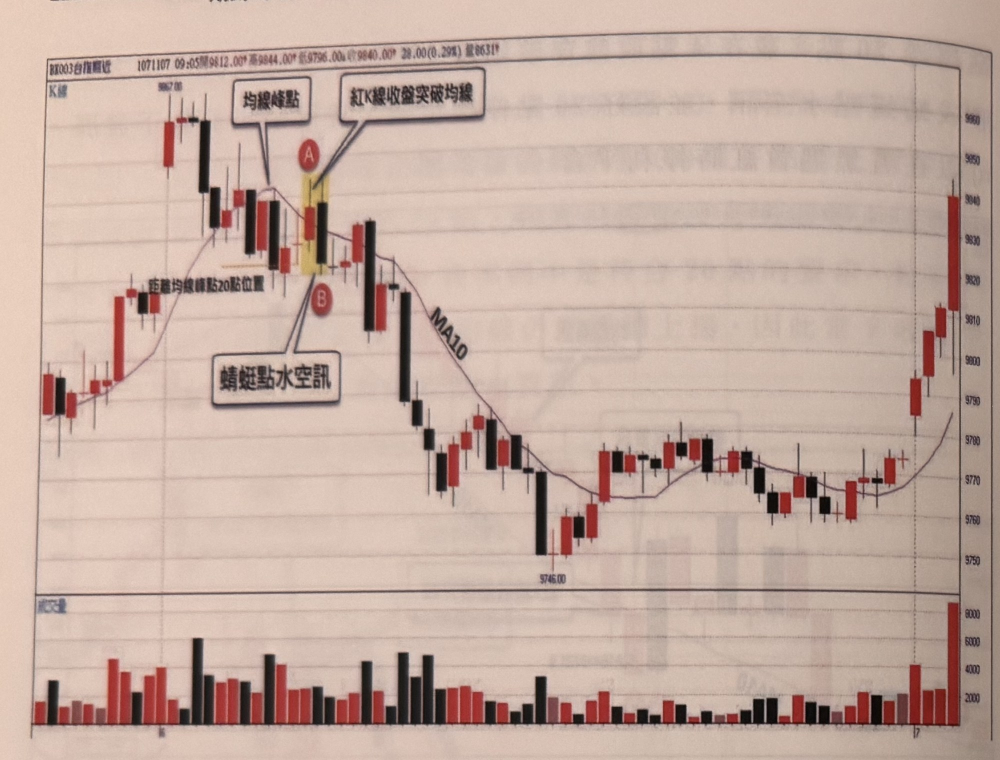
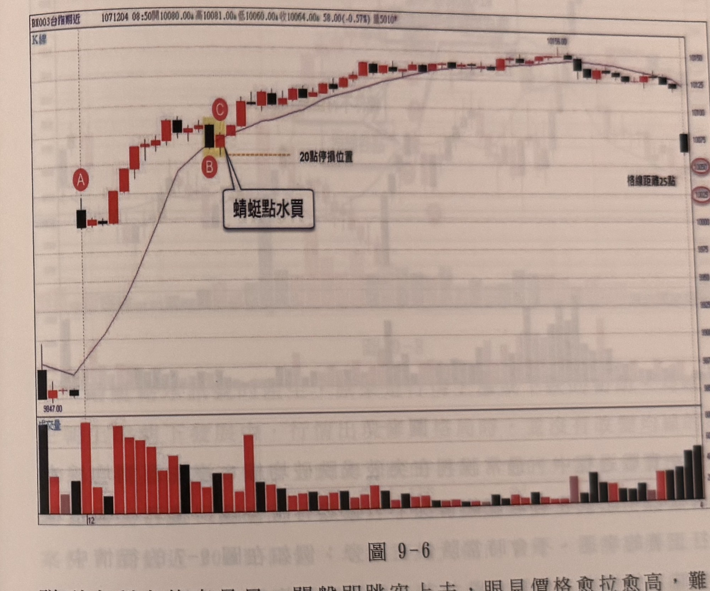
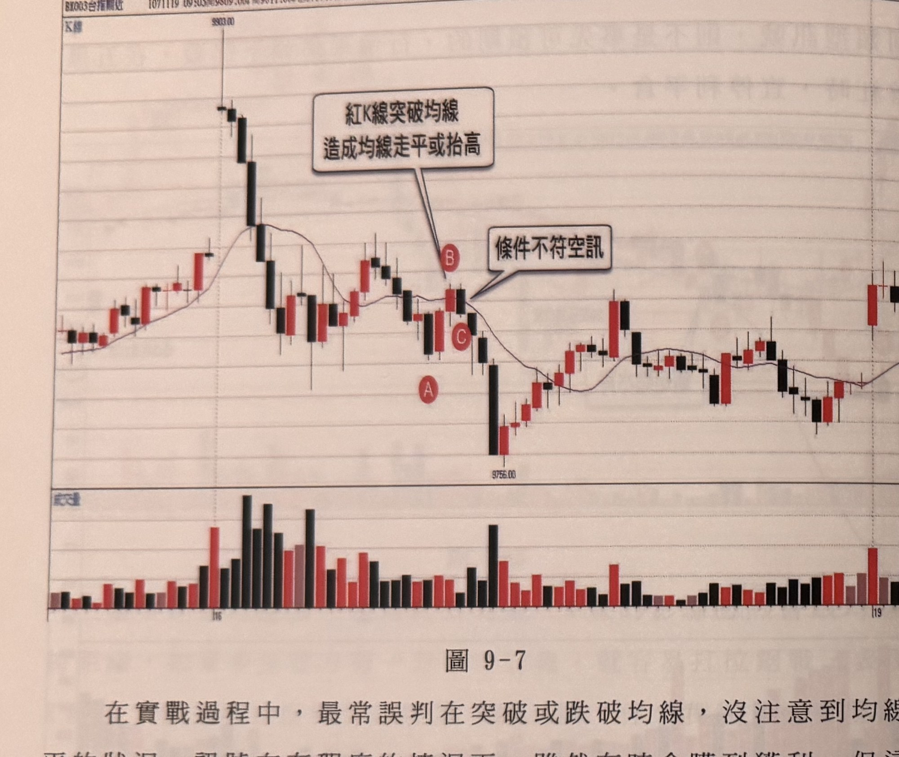
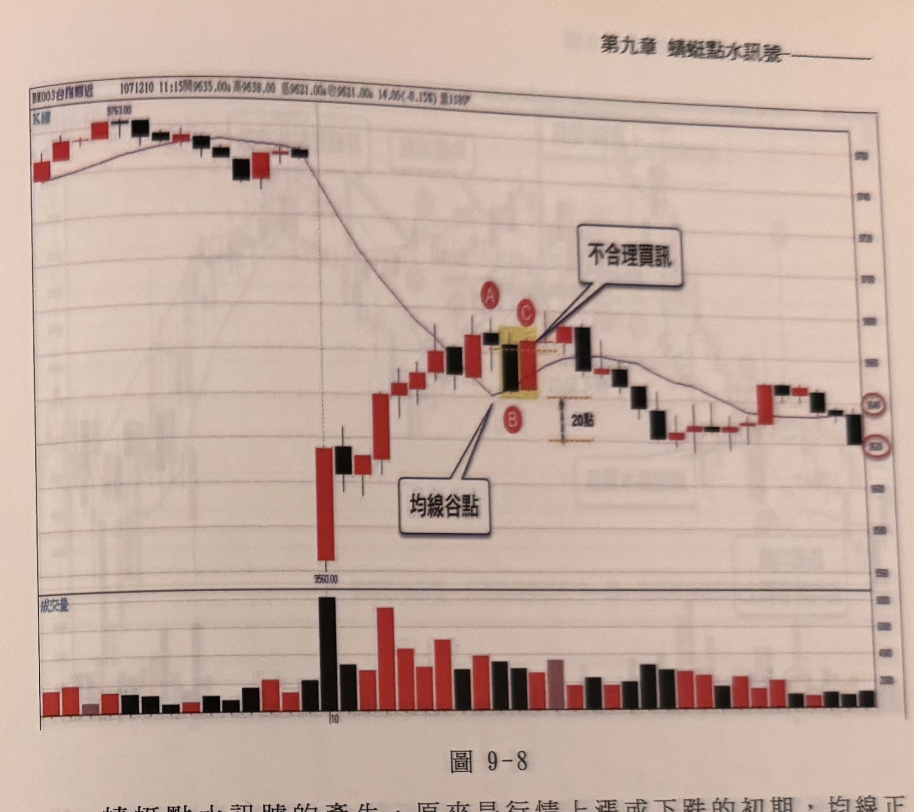

# 均線蜻蜓點水（買訊／空訊）

> 一句話摘要：均線朝上（或朝下）行進中，價格單一根 K 線收盤短暫跌破（或突破）均線，只要均線方向未因此改變，隔一根 K 線立刻收回均線的另一側，就形成跟隨原趨勢的進場訊號，如同蜻蜓點水般水面隨即恢復平靜。

## 1. 核心概念

用均線觀察趨勢比逐根 K 線判斷更不易受短暫修正或盤整干擾：N 天期均線朝上時，除非當下 K 線收盤低於前 N 天收盤，否則均線不會因此翻頭向下；反之亦然（p.189）。

行情走勢中，若價格在均線上方（或下方）維持已久，代表慣性運動持續已久，一旦真正收盤跌破（或突破）均線，慣性遭破壞的力道不可小覷，容易引發真正的反轉。但若跌破（突破）之前，行情在均線之上（下）並未持續很久，慣性尚未建立，此時的跌破（突破）不會牽一髮動全身；尤其若跌破後隨即翻回均線之上（下），而均線本身並未因此走平或反轉，代表原趨勢依舊，這種短暫的價格反常行為，反而成為原趨勢的跟隨切入點（p.189）。

書中以「蜻蜓點水」比喻：蜻蜓以尾點水產卵，水面雖有漣漪，但隨即恢復平靜；均線被單一根 K 線收盤跌破（突破）後，若均線本身沒有因此轉彎，就像水面恢復平靜一樣，此時即製造出一個跟隨原趨勢的進場切入點（p.190）。

## 2. 適用前提

1. 均線（MA10）須處於明確的上升或下降趨勢中，且已朝該方向運行超過 3 根 K 線以上（不宜僅 3 根以內）（p.199）；外觀上更須是均線已上揚或下跌一段時間，絕不能是均線才剛轉折（例如均線谷點剛形成不久，即使跌破後隔根收盤收回，根數表面符合但轉折太新，仍不能視為蜻蜓點水買訊）（p.197，圖 9-8）。
2. 均線當日須對價格具有實際的支撐／壓力效果；若價格當日任意穿梭均線、均線未被尊重，則當日以均線產生的所有訊號（含蜻蜓點水、均線訊號、均線豬陽訊號等）都不具參考價值，須整日忽略（p.201–202，圖 9-12、9-13）。
3. 訊號須是本波段第一次回測均線所產生（區間單一性），並且訊號發生前 10 根 K 線內，不應已出現另一次跌破／突破均線或不符條件的蜻蜓點水（p.199，圖 9-10）。

## 3. 訊號定義

### 多方（蜻蜓點水買訊）

1. C1：均線（MA10）方向朝上（p.191）。
2. C2：出現一根黑 K 線（A 棒），收盤價跌破均線（p.190）。
3. C3：A 棒跌破均線的當下，均線並未因此走平或反轉向下，仍維持原朝上方向（p.190）。
4. C4：緊接下一根 K 線（B 棒）收紅，且收盤價重新站上均線之上，B 棒收盤即為買進訊號成立點（p.190）。
5. C5：訊號發生前，價格波段的峰點距離均線轉折點（均線谷點／上彎中點）須 ≥ 20 點（p.192、199、203、204）。
6. C6：跌破均線後（A 棒之後、B 棒之前），K 線下影線穿越均線的根數不宜超過 1 根，愈少可靠度愈高（p.194–195）。

### 空方（蜻蜓點水空訊）

1. C1'：均線（MA10）方向朝下（p.190）。
2. C2'：出現一根紅 K 線（C 棒），收盤價突破均線（p.190）。
3. C3'：C 棒突破均線的當下，均線並未因此走平或反轉向上，仍維持原朝下方向（p.190）。
4. C4'：緊接下一根 K 線（D 棒）收黑，且收盤價重新跌回均線之下，D 棒收盤即為放空訊號成立點（p.190–191）。
5. C5'：訊號發生前，價格波段的谷點距離均線轉折點（均線峰點／下彎中點）須 ≥ 20 點（p.192–193）。
6. C6'：突破均線後（C 棒之後、D 棒之前），K 線上影線穿越均線的根數不宜超過 1 根（p.194–195，多空對稱）。

## 4. 進場

- 於訊號成立的 B 棒（買訊）或 D 棒（空訊）收盤價進場（p.190–191）。
- 若訊號 K 線（B 棒／D 棒）本身漲跌幅超過 30 點，屬於「大 K 線」：可以不必立刻進場，等待價格稍做折返動作後再補進場；若選擇直接在大 K 線收盤進場，則停損改設在該大 K 線實體中點，或直接設 20 點停損（p.198，圖 9-9）。
- 跳空、開盤延續前一日尾盤趨勢的情況：若昨日尾盤均線已朝某方向運行，且今日開盤第一根 K 線最低點與昨日最後一根 K 線重疊（視為連續盤），可比照一般規則判斷蜻蜓點水（p.193，圖 9-4）。

## 5. 停損

- 原則停損 20 點（多處範例明示：圖 9-3 p.193「設好 20 點停損位置」；圖 9-9 p.198「最大虧損仍控制在 20 點」）。
- 若採直接於大 K 線收盤進場，停損可改設於該 K 線實體中點（見第 4 節），但最大虧損仍以 20 點為上限（p.198）。
- 停損後是否反手：本節（第一節、均線篇）未明文重述反手規則；60 點反手判斷與 15 點免反手規則的完整敘述出現在第二節「平盤蜻蜓點水」中（見 q3-09-02 文件），本文件不擅自跨小節套用，列為待確認事項。

## 6. 出場 / 停利

- 書中在本節多個範例中提到，可於「五黑遇首紅」（連續黑 K 後首見紅 K，買訊情境）或對稱的「五紅遇首黑」時停利平倉（p.191「同時也是五黑遇首紅買訊」；p.193「可以在五黑遇首紅時停利平倉」；p.195「在五黑遇首紅時，宜停利平倉」）。「五黑遇首紅／五紅遇首黑」訊號的完整定義見另一份文件 `q3-06-連五黑遇首紅與連五紅遇首黑.md`（第六章），本章僅引用其作為出場時機參考，未重新定義。
- 除上述引用外，書中未明確說明其他停利或移動停損方式。

## 7. 過濾：不做的情況

1. F1：均線本波上升／下降持續根數 ≤ 3 根 → 不宜操作（p.199）；即使根數表面達標，若均線方向是剛轉折不久（如谷點/峰點剛形成），也不算「已朝方向運行一段時間」，同樣不宜操作（p.197，圖 9-8）。
2. F2：本次跌破／突破並非本波段第一次回測均線（10 根 K 線內已發生前一次跌破／突破或不符條件的蜻蜓點水）→ 屬無效訊號（p.199，圖 9-10）。
3. F3：訊號發生前，價格波段峰谷點距離均線轉折點 < 20 點 → 不符合條件，不做（p.192–193、199、203、204）。
4. F4：當日均線不具支撐／壓力效果（價格任意穿梭均線）→ 當日所有均線類訊號都忽略（p.201–202，圖 9-12、9-13）。
5. F5：與逆向訊號（如頂雙黑／底雙紅、V 字訊號等）衝突時，一律以逆向訊號優先，本順向蜻蜓點水訊號忽略（p.200–201，圖 9-11）。
6. F6：訊號發生時，距離當日收盤不足 1 小時 → 宜忽略（p.203，圖 9-15）。
7. F7：跌破／突破均線後，K 線影線穿越均線超過 1 根 → 可靠度存疑（p.194–195）。

## 8. 範例解析

- **圖 9-1**（p.190，手繪示意圖，已改繪 SVG）：左半部示範買訊：均線朝上，A 為黑 K 跌破均線但均線不改朝上，B 為隔根紅 K 收回均線之上，形成蜻蜓點水買訊（對應 C1–C4）。右半部示範空訊：均線朝下，C 為紅 K 突破均線但均線不改朝下，D 為隔根黑 K 收回均線之下，形成蜻蜓點水空訊（對應 C1'–C4'）。

  

- **圖 9-2**（p.191–192，台指期 5 分鐘圖，1071213）：跳高開盤帶動均線上揚，A 見盤中最高點並形成頂雙黑空訊後急跌，連五黑跌破 MA10（B 點），但均線上升趨勢未反轉，C 點收紅重新站上均線，形成蜻蜓點水買訊（同時也是五黑遇首紅買訊）。中盤 D 點形成峰點，測得峰點距均線谷點 ≥ 20 點（符合 C5），E 點再度跌破均線，F 點收紅站回，形成第二個蜻蜓點水買訊。

  

- **圖 9-3**（p.192–193，台指期，1071204）：跳低開盤帶動均線下彎，出現層級 1 谷點，低點距均線峰點 > 20 點（符合 C5'），A 點紅 K 突破均線，B 點黑 K 跌回均線之下，形成蜻蜓點水空訊，設 20 點停損，可於五黑遇首紅時停利。

  

- **圖 9-4**（p.193，台指期，1071208）：延續前一日尾盤趨勢的案例：昨收黑 K 跌破 MA10，今日開盤跳高收黑，開盤低點與昨收盤 K 重疊，A 點收盤跌破 MA10，隔根 B 點收盤重新站上均線（剛好貼平 MA10），視為蜻蜓點水買訊。

  

- **圖 9-5**（p.194，台指期，1071107）：說明 C6 影線濾網：跳高開盤後橫盤下跌，K 線紅黑互尬、漲跌點都大於 10 點，但均線持續下彎，A 點紅 K 收盤穿越均線，B 點黑 K 收盤重新跌破均線，形成蜻蜓點水空訊；文中特別強調此期間影線穿越均線不宜超過 1 根，且需確認低點距均線轉折點 > 20 點。

  

- **圖 9-6**（p.195，台指期，1071204）：跳空快 150 點開盤大漲行情中，出現黑 K 折返跌破均線，隔根紅 K 收盤彈回均線之上，形成蜻蜓點水買訊。

  

- **圖 9-7**（p.196，台指期，1071119）：示範均線走平誤判：行情於 A 止跌，B 收紅K線收盤突破均線，但此時均線僅明顯走平微升，並未真正確立朝下轉朝上，不符合「均線方向未因跌破/突破而改變」的前提；隔根 C 重新回落均線下方，外觀像蜻蜓點水空訊，但因 B 處均線已走平，此類訊號屬誤判，即使事後行情幸運續跌獲利，也不能常態性依此操作。示範適用前提 2（均線須具實際支撐/壓力效果）與 C3' 的實戰誤判案例。

  

- **圖 9-8**（p.197，台指期，1071210）：跳低近 200 點開盤後，均線大幅向下彎，行情隨即展開近百點大反彈並穿越均線，至 B 位置均線才剛開始由降轉平／轉上彎，但 B 為黑K線、收盤跌破均線；此時因均線谷點轉折剛發生不久（並非均線已朝上發展一段時間），即使隔根 C 收紅重新站上均線，仍不能視為蜻蜓點水買訊，屬不合理買訊。示範適用前提 1（均線須已朝方向運行一段時間，不能是均線剛轉折）。

  

- **圖 9-9**（p.198，台指期，1071218）：示範大 K 線處理（C6 之外的 30 點規則）：A 跳高開盤後急殺跌破均線至 B，均線仍朝上，C 點逆漲 30 點重新站上均線（屬大 K 線），可稍等拉回進場或直接進場、停損設於實體中點，最大虧損控制在 20 點。同圖亦標示 D、E、F：D 為「頂倒 V 空訊」（逆向訊號，非本節定義），E 因距均線頂點 < 20 點而屬「非蜻蜓點水空訊」（對照 C5' 未達標）。

  

- **圖 9-10**（p.199，恆生近月，1071213）：示範 F2 無效訊號：A 處蜻蜓點水因均線走平下移不符條件；B 處雖均線仍上行，但屬同一波段第二次點破均線（間隔僅 3 根），不符區間單一性，判定為無效訊號，不宜操作。

  

- **圖 9-11**（p.200–201，恆生近月，1071031）：示範 F5 順逆向衝突：AB 形成頂雙黑反轉空訊（逆向），B 同時跌破均線；隔根 C 收盤重新站上均線，形成蜻蜓點水買訊（順向），但因順逆衝突以逆向優先，頂雙黑空訊不必停損反多，蜻蜓點水買訊予以忽略。

  

- **圖 9-12**（p.201，台指期，1071018）：示範 F4：跳低開盤後 A 區穿越均線並停留 4 根 K 線在均線之上，均線仍朝下，顯示均線無壓力效果；B 區重新跌落均線但下影線仍在均線之下，顯示均線也無支撐效果；C 點蜻蜓點水空訊因此不具參考價值，須忽略。

  

- **圖 9-13**（p.202，台指期，1071129）：延續圖 9-12 案例，D 區同樣對均線上下穿梭，其後 E 的蜻蜓點水空訊也須忽略；圖說並提示應檢查谷點距均線轉折點是否 ≥ 20 點、均線下彎是否超過 3 根等細節條件。

  

- **圖 9-14**（p.203，台指期，991221）：說明「均線谷點＝均線轉折點＝均線彎曲中點」三詞同義；A 處因距均線谷點未達 20 點，標示為「條件不符買訊」（對應 C5 未達標）。

  

- **圖 9-15**（p.203，台指期，1071120）：示範 F6：訊號出現於盤中反彈段，但因距當日收盤僅剩 1 小時，圖說明示建議忽略。

  

- **圖 9-16**（p.204，台指期，991222）：總結圖示：均線不能因價格收盤突破／跌破而出現上勾或下彎（C3/C3'），且峰谷點距均線峰點須 > 20 點（C5/C5'），兩者皆符合時訊號才易於辨識；圖中 C、D 因不符條件標示為「條件不符買訊」。

  


## 9. 作者提醒與常見錯誤

- 均線蜻蜓點水屬「順向訊號」，只要均線持續朝某方向即可能出現，但無法確認是否處於盤中高低點，買訊可能買在盤中最高點、空訊可能空在盤中最低點；因此遇到逆向的極端訊號（頂底雙紅黑、V 字訊號等）衝突時，一律以逆向訊號優先（p.200）。
- 均線是否具有支撐壓力效果，是能否使用均線類訊號的前提；若價格當日任意穿梭均線，當天所有均線訊號都不具意義，須整日忽略，不能只忽略單一次訊號（p.201–202）。
- 判斷蜻蜓點水時，須同時檢查：均線方向是否因跌破／突破而改變、峰谷點距均線轉折點是否 ≥ 20 點、均線持續根數是否 > 3 根、是否為本波段第一次回測、影線穿越均線根數是否 ≤ 1 根——條件愈齊全，訊號愈可靠（p.199、204）。
- 訊號 K 線波動過大（如超過 30 點）不宜照單全收直接進場，需調整進場與停損方式（p.198）。

## 10. 規則速查（Checklist）

- [ ] 均線（MA10）方向明確朝上（買訊）或朝下（空訊），且已運行 > 3 根 K 線
- [ ] 出現單一根 K 線收盤跌破（買訊前置）或突破（空訊前置）均線
- [ ] 跌破／突破當下，均線方向未改變（未走平、未反轉）
- [ ] 隔一根 K 線收盤立即收回均線另一側（紅 K 買訊 / 黑 K 空訊）
- [ ] 峰谷點距均線轉折點 ≥ 20 點
- [ ] 跌破／突破後影線穿越均線 ≤ 1 根
- [ ] 為本波段第一次回測均線（10 根 K 線內無前次跌破／突破或不合格蜻蜓點水）
- [ ] 當日均線對價格具支撐／壓力效果（非任意穿梭）
- [ ] 無逆向訊號衝突（若有，讓位給逆向訊號）
- [ ] 距收盤 > 1 小時
- [ ] 訊號 K 線漲跌 ≤ 30 點，或已依大 K 線規則調整進場／停損

## 11. 機器可讀規則

```yaml
signal: 均線蜻蜓點水
side: long_and_short
timeframe: 5m
ma: MA10
conditions_long:
  - id: C1
    desc: MA10 方向朝上
    source: p.191
  - id: C2
    desc: 出現黑K（A棒），收盤跌破MA10
    source: p.190
  - id: C3
    desc: A棒跌破當下MA10未走平或反轉向下
    source: p.190
  - id: C4
    desc: 隔一根K線（B棒）收紅，收盤重新站上MA10；B棒收盤為訊號成立點
    source: p.190
  - id: C5
    desc: 峰點距均線谷點（轉折點）>= 20點
    source: p.192, p.199, p.203, p.204
  - id: C6
    desc: 跌破後K線下影線穿越MA10不超過1根
    source: p.194-195
conditions_short:
  - id: C1p
    desc: MA10 方向朝下
    source: p.190
  - id: C2p
    desc: 出現紅K（C棒），收盤突破MA10
    source: p.190
  - id: C3p
    desc: C棒突破當下MA10未走平或反轉向上
    source: p.190
  - id: C4p
    desc: 隔一根K線（D棒）收黑，收盤重新跌破MA10；D棒收盤為訊號成立點
    source: p.190-191
  - id: C5p
    desc: 谷點距均線峰點（轉折點）>= 20點
    source: p.192-193
  - id: C6p
    desc: 突破後K線上影線穿越MA10不超過1根（多空對稱）
    source: p.194-195
entry:
  price: B棒或D棒收盤價
  large_bar_rule:
    threshold_points: 30
    action: 可等拉回再補進場；或直接於大K線收盤進場並改設停損於實體中點
    source: p.198
stop_loss:
  points: 20
  alt: 大K線直接進場時可設於訊號K線實體中點，但最大虧損仍以20點為上限
  source: p.193, p.198
exit:
  desc: 可於五黑遇首紅（多）或五紅遇首黑（空）時停利平倉；完整定義見 q3-06-連五黑遇首紅與連五紅遇首黑.md
  source: p.191, p.193, p.195
filters:
  - desc: 均線本波持續根數 <= 3 根 → 不宜操作；均線方向剛轉折不久（谷點/峰點剛形成）即使根數表面達標也不宜操作
    source: p.199, p.197
  - desc: 非本波段第一次回測均線（10根K線內已有前次跌破/突破或不合格蜻蜓點水）→ 無效訊號
    source: p.199
  - desc: 峰谷點距均線轉折點 < 20點 → 不符合條件
    source: p.192-193, p.199, p.203-204
  - desc: 當日均線不具支撐/壓力效果（價格任意穿梭）→ 當日所有均線訊號忽略
    source: p.201-202
  - desc: 與逆向訊號（頂底雙紅黑、V字等）衝突 → 忽略本順向訊號，逆向優先
    source: p.200-201
  - desc: 距收盤不足1小時 → 宜忽略
    source: p.203
  - desc: 跌破/突破後影線穿越均線超過1根 → 可靠度存疑
    source: p.194-195
```

## 12. 待確認事項

無。缺頁僅影響範例圖，見 frontmatter `missing_pages`。

## 13. 原文出處

- `extracted/pages/IMG_8420.md`（p.188–189）
- `extracted/pages/IMG_8421.md`（p.190–191）
- `extracted/pages/IMG_8422.md`（p.192–193）
- `extracted/pages/IMG_8423.md`（p.194–195）
- `extracted/pages/IMG_8424.md`（p.196–197）
- `extracted/pages/IMG_8425.md`（p.198–199）
- `extracted/pages/IMG_8426.md`（p.200–201）
- `extracted/pages/IMG_8427.md`（p.202–203）
- `extracted/pages/IMG_8428.md`（p.204–205，本文件僅用 p.204）
