# 平盤蜻蜓點水（買訊／空訊）

> 一句話摘要：以昨日收盤價（平盤）取代均線作為基準，價格單一根 K 線收盤跌破（或突破）平盤後，隔一根 K 線立刻收回平盤的另一側，形成逆向（反轉型）進場訊號，須發生在當日極端高低點附近才合理。

## 1. 核心概念

前一節（均線蜻蜓點水）以均線為架構；本節將基準換成「平盤」，即昨日日線收盤的位置。昨日收盤代表昨日交易時段多空互軋的共識結果，如同一條「一日均線」，是判斷多空的重要參考：行情在平盤之上，通常有利多頭作價；行情跌落平盤之下，則空頭伺機放空（p.205）。

行情跳高或跳低開盤，都是相對於平盤位置而言。看好的狀況下，行情若被壓回平盤，甚至一根 5 分鐘黑 K 線收盤跌破平盤，容易讓空方見獵心喜大舉出手，結果卻是誤入多頭設下的誘捕陷阱——隨即以紅 K 線重新翻上平盤之上，形成買進訊號；這種情況以「K 線收盤跌破平盤，且僅限一根 K 線」為限，二根以上都不算（p.205）。對稱地，若 K 線收盤一度突破平盤，隔根立刻被黑 K 線壓回平盤之下，代表空方等多頭反彈力竭後再重磅下壓，形成放空訊號，書中指出此類空訊「勝率相當高」（p.209）。

與均線蜻蜓點水（順向訊號）不同，平盤蜻蜓點水屬於「逆向訊號」：買訊必須發生在當日極低附近，空訊必須發生在當日極高附近，訊號 K 線收盤不應出現在與訊號方向相反的極端位置，否則不合理（除了開盤發生「破三高」「破三低」的特殊情形）（p.216）。

## 2. 適用前提

1. 觸及平盤之前，行情原則上已在平盤的一側運行相當距離：書中以「第一型走勢」為例，觸及平盤前行情完全在平盤上方（買訊情境），最高點至少距離平盤 20 點以上（p.208，圖 9-18）；對稱地，空訊情境下觸及平盤前波段高點距平盤應 ≥ 20 點（p.221，圖 9-31 標示「距離平盤超過20點」，多空對稱）。
2. 訊號須發生在當日極端高低點附近（買訊近當日低點、空訊近當日高點），不合理的位置（如買訊 K 線收盤反而落在當日最高點）應忽略（p.216，圖 9-26）。
3. 訊號發生前，價格影線不宜多次觸及平盤；若之前已屢屢以影線觸碰平盤，即使後續技術上符合條件，也因缺乏獨特性而應忽略（p.219、224，圖 9-32、9-40）。

## 3. 訊號定義

### 多方（平盤蜻蜓點水買訊）

1. C1：觸及平盤前，行情原則上處於平盤上方，高點距平盤 ≥ 20 點（p.208）。
2. C2：出現「僅一根」黑 K 線，收盤價跌破平盤；若連續兩根以上 K 線收盤跌破，則不符合本訊號定義（p.205、218，圖 9-29）。
3. C3：緊接下一根 K 線收紅，且收盤價重新站上平盤之上，該紅 K 收盤即為買進訊號成立點（p.205、208）。
4. C4：訊號應發生在當日極低點附近；訊號 K 線收盤不應落在當日最高附近（p.216）。
5. C5：訊號發生前，價格影線不宜多次觸及平盤（p.219、224）。
6. C6：若同時與另一個相反方向的逆向訊號（如頂雙黑空訊）發生衝突，本買訊的收盤不可侵入該逆向空訊的收盤之上，否則本買訊無效（p.220–221，圖 9-35）。

### 空方（平盤蜻蜓點水空訊）

1. C1'：觸及平盤前，行情原則上處於平盤下方，低點距平盤 ≥ 20 點（多空對稱；圖 9-31 對高點距平盤 20 點有明確標示）。
2. C2'：出現「僅一根」紅 K 線，收盤價突破平盤；若連續兩根以上收盤突破，不符合本訊號定義（多空對稱）。
3. C3'：緊接下一根 K 線收黑，且收盤價重新跌回平盤之下，該黑 K 收盤即為放空訊號成立點（p.209）。
4. C4'：訊號應發生在當日極高點附近；訊號 K 線收盤不應落在當日最低附近（p.216，多空對稱）。
5. C5'：訊號發生前，價格影線不宜多次觸及平盤（p.219、224）。
6. C6'：若與另一個相反方向的逆向訊號衝突，本空訊的收盤不可侵入該逆向買訊的收盤之下，否則本空訊無效（多空對稱）。

## 4. 進場

- 於訊號成立的紅 K（買訊）或黑 K（空訊）收盤價進場（p.208、209）。
- 若訊號 K 線波動過大（書中舉例達 60 餘點的「超大 K 線」），應直接放棄、不予進場，即使該根 K 線技術上符合訊號條件，也不例外，不採等拉回或改設停損的折衷方式（p.216，圖 9-26）。
- 進場後的風險控管：若尚未推進 15 點以上，價格即折返跌破（買訊）或突破（空訊）「進場訊號 K 線本身」的影線，應立即出場（撤單），寧可小賠，也不要硬撐到 20 點停損才出場，以維持交易心理健康（p.217，圖 9-27）。

## 5. 停損

- 原則停損 20 點（多處明示：p.208「設好20點停損位置」；p.214「20點停損位置」；p.217、219、220、221 同）。
- 若已推進 15 點以上獲利，之後價格折返回進場點，此時不必反手，應立即在進場點附近平倉出場，安全下莊為第一要務（p.215）。

## 6. 出場 / 停利

- 書中未明確說明固定的停利目標或移動停損方法（本節未見類似均線篇「五黑遇首紅」的具體停利觸發點）。
- 唯一明確提及的是第 4、5 節所述的風險控管規則（未達 15 點即反向跌破訊號 K 影線應立即出場；已達 15 點則折返進場點即平倉）。

### 停損後反手（反手）規則

- 停損觸及後是否反手轉向：測量「盤中極端點」到停損（反手）點的距離。
  - 若距離 ≤ 60 點，反手勝率較高，可以在停損點反向進場（p.214–215，圖 9-24；p.217，圖 9-28「不到50點」示例）。
  - 若距離 > 60 點，風險過高，不建議反手，僅停損出場即可（p.215，圖 9-25「距離105點，反手空討不了便宜」；p.221，圖 9-36「距離90點，只能停損」）。
- 若進場後已推進 15 點以上，則不需要反手，只需在價格折返回進場點時立即平倉（p.215，見第 5 節）。

## 7. 過濾：不做的情況

1. F1：跌破／突破平盤非單一根 K 線（連續兩根以上收盤跌破／突破）→ 不符合訊號定義；即使事後行情證明方向正確，也不算正確的判斷依據（p.218，圖 9-29）。
2. F2：訊號 K 線波動過大（超大 K 線，例如 60 點以上）→ 一律放棄，不予進場（p.216，圖 9-26）。
3. F3：訊號發生的位置不合理（買訊收盤落在當日最高附近、空訊收盤落在當日最低附近）→ 不合理，忽略；開盤發生「破三高」「破三低」的特殊情形除外（p.216）。
4. F4：訊號發生前，價格影線已多次觸及平盤（缺乏獨特性）→ 忽略（p.219、224，圖 9-32、9-40）。
5. F5：與另一相反方向的逆向訊號衝突，且本訊號收盤侵入對方訊號收盤 → 本訊號無效（p.220–221，圖 9-35）。
6. F6：反手時，盤中極端點到停損／反手點距離 > 60 點 → 不宜反手，僅停損出場（p.215、221）。

## 8. 範例解析

- **圖 9-18**（p.208，台指期，1071128）：示範第一型買訊：行情原全在平盤上方（黃色區域），高點距平盤 ≥ 20 點（符合 C1），逼近平盤後 A 點黑 K 首度且唯一一根收盤跌破平盤（C2），隔根 B 點紅 K 立即收盤重回平盤之上（C3），形成蜻蜓點水買訊，且發生在盤中最低點附近（符合 C4），設 20 點停損。

  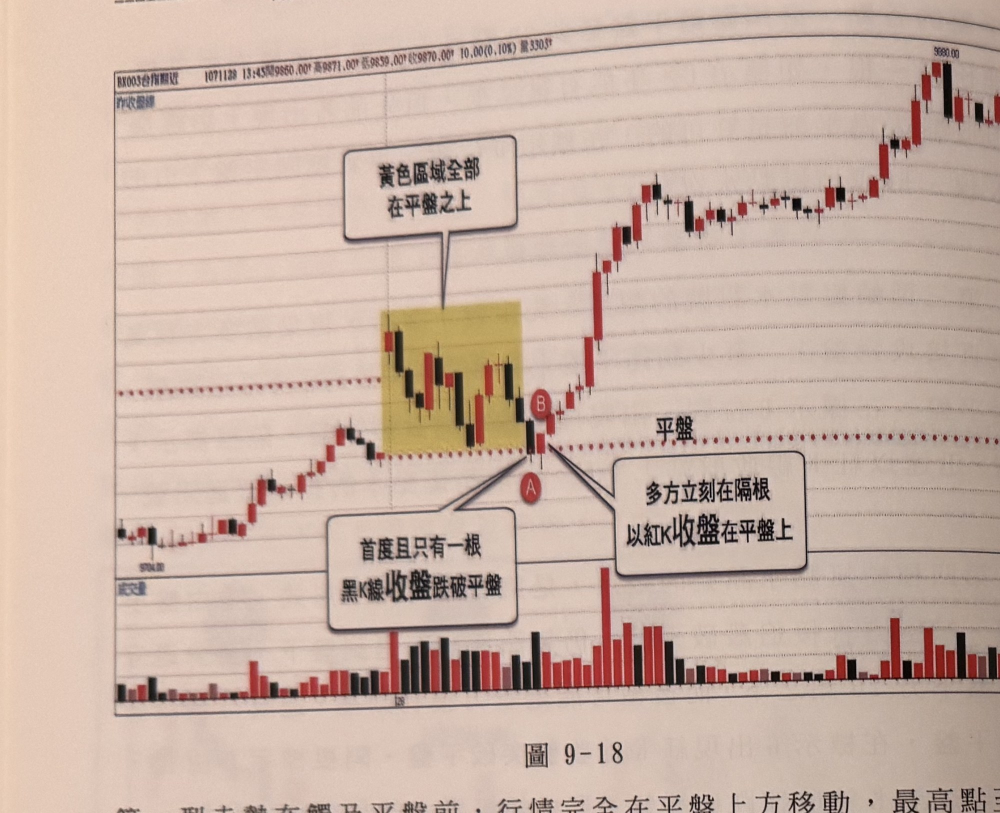

- **圖 9-19**（p.209，台指期，971022）：跳低開盤逾百點後，多頭主力連續紅 K 拉抬，A 點紅 K 收盤突破平盤，但隔根 B 點即被空方以黑 K 壓回平盤之下，形成蜻蜓點水空訊（對應 C2'/C3'），其後行情續跌約 200 點，未觸及停損。書中指出此類空訊勝率相當高。

  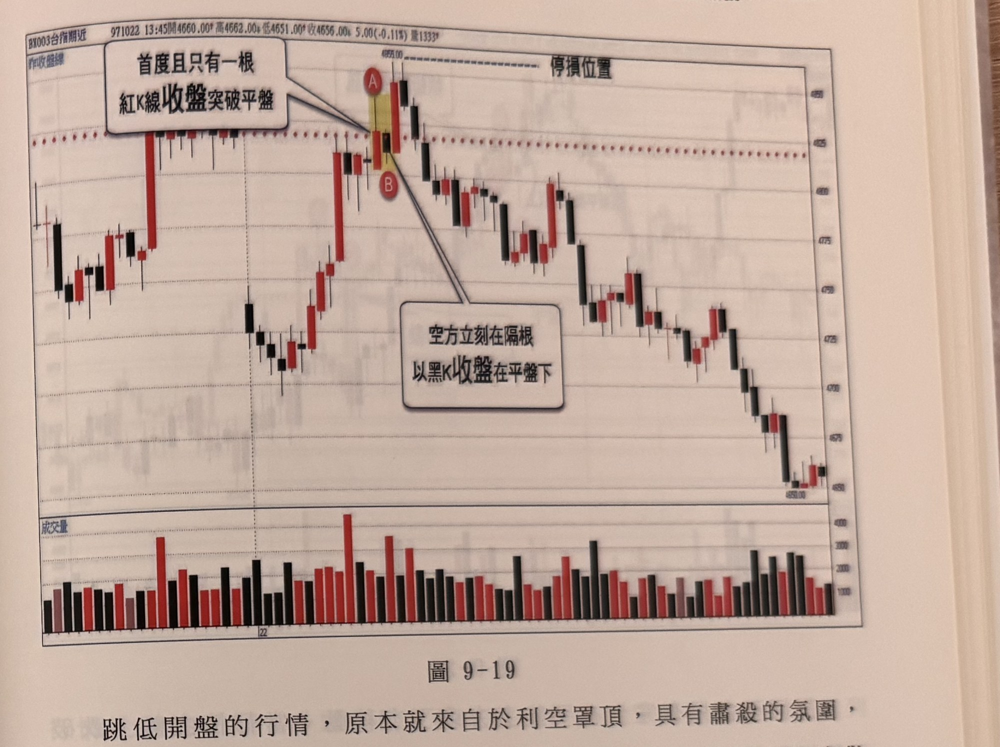

- **圖 9-24**（p.214–215，台指期，1040701）：跳低開盤 A 點收紅開始上攻，B 點收盤站上平盤，隔根 C 立刻被壓回平盤之下，形成蜻蜓點水空訊；行情續創新高觸及 20 點停損，於 D 點面臨是否停損反手：測得 D 距盤中最低點 A 在 60 點以內，符合反手條件，可於 D 點反手買進（D 同時也是均線買進訊號）。

  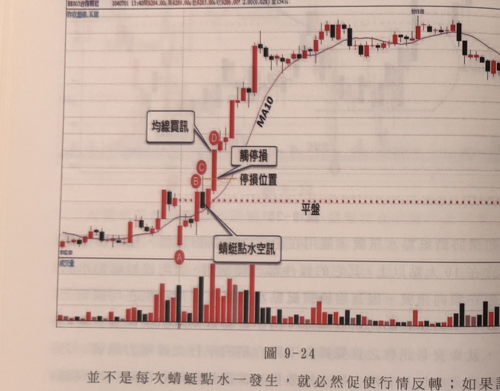

- **圖 9-25**（p.215，恆指/台指期，910627）：對照反例：A 頂雙黑空訊後續跌，BC 形成蜻蜓點水買訊，行情未如預期上漲反破平盤觸及 D 點停損；測得 A 到 D 距離達 105 點，超過 60 點，不宜反手放空，僅停損出場。

  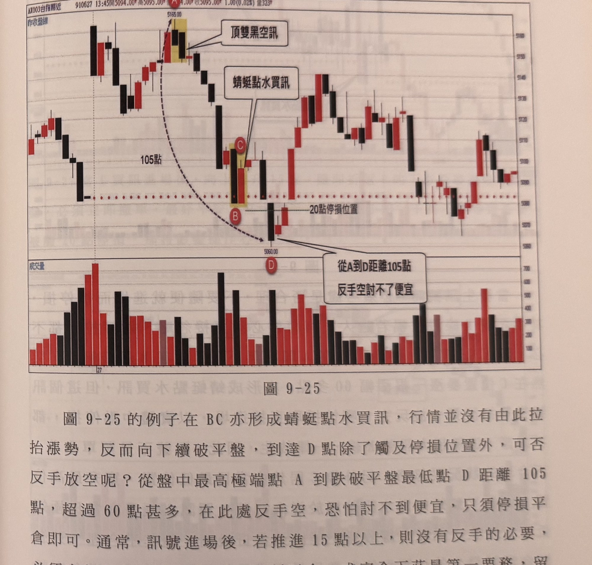

- **圖 9-26**（p.216，台指期，1040805）：示範 F2：跳高開盤 A 點黑 K 下殺並於 B 點跌破平盤，隨即 C 點暴漲逾 60 點雖技術上形成蜻蜓點水買訊，但屬超大 K 線，且由當日最低竄升至最高（不合理，違反 C4），一律放生忽略。

  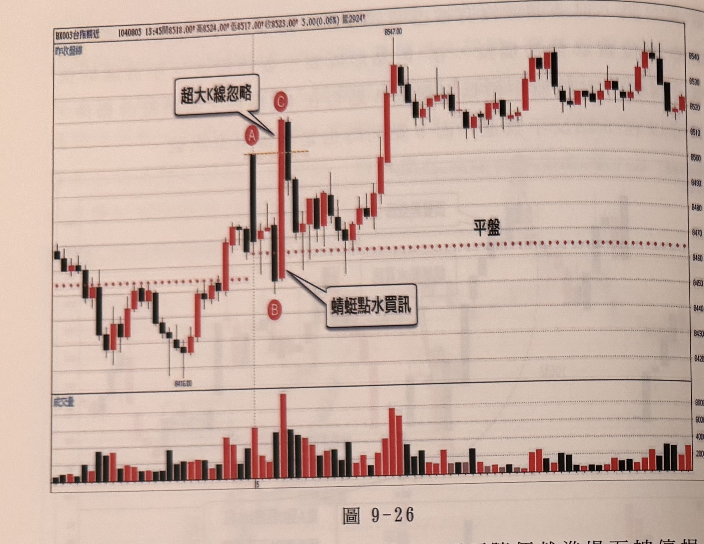

- **圖 9-27**（p.217，台指期，1040508）：示範風險控管：BC 形成蜻蜓點水買訊，進場後上推 15 點至 D，隨即在 E 折返跌破進場 K 線的下影線，須立即撤單出場，避免硬撐至 20 點停損。

  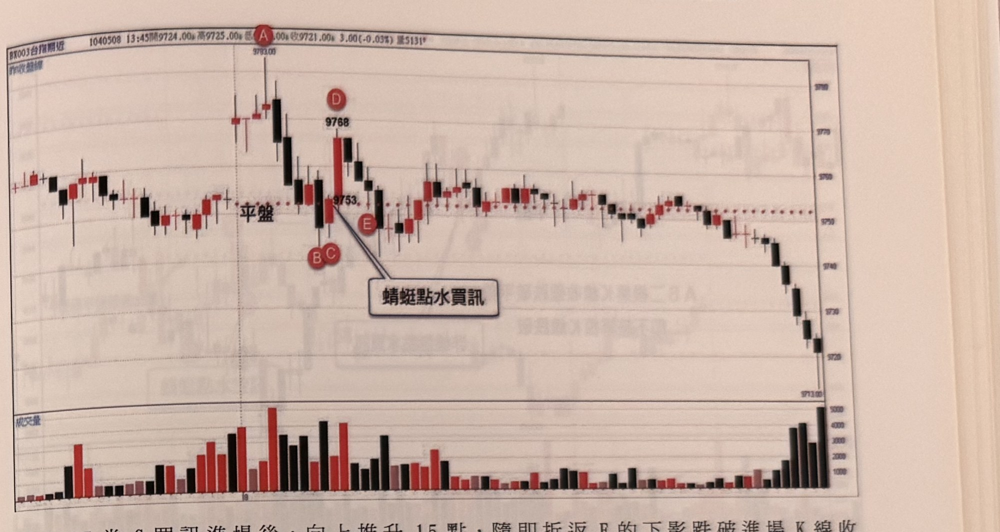

- **圖 9-28**（p.217，恆指/台指期，911009）：A 為蜻蜓點水買訊，行情不如預期反轉下跌，於 D 點反手放空，反手距離不到 50 點，符合 60 點以內可反手的條件。

  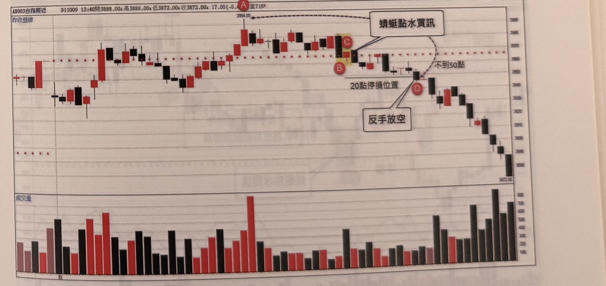

- **圖 9-29**（p.218，台指期，1071026）：示範 F1：A、B 兩根黑 K 連續收盤跌破平盤，不符合「僅限一根」的跌破條件，即使後續行情獲利，也非正確判斷依據，判定「非蜻蜓點水買訊」。

  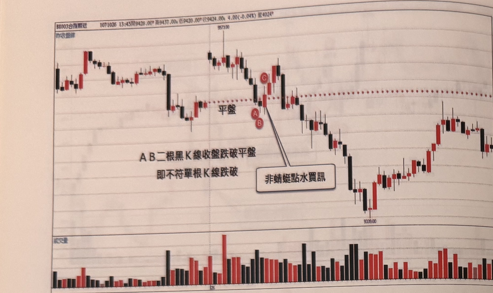

- **圖 9-30**（p.218，台指期，980717）：示範可靠度加分情境：單根跌破平盤之前，行情皆無影線觸及平盤，此類蜻蜓點水可靠度較高，A、B 形成有效買訊。

  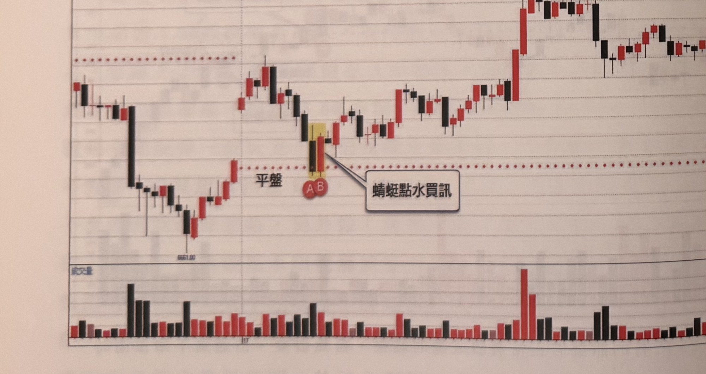

- **圖 9-31**（p.218–219，台指期，1020610）：A 點距平盤超過 20 點（符合 C1'），BC 形成蜻蜓點水空訊，設好 20 點停損可避開 D 位置的假性突破。

  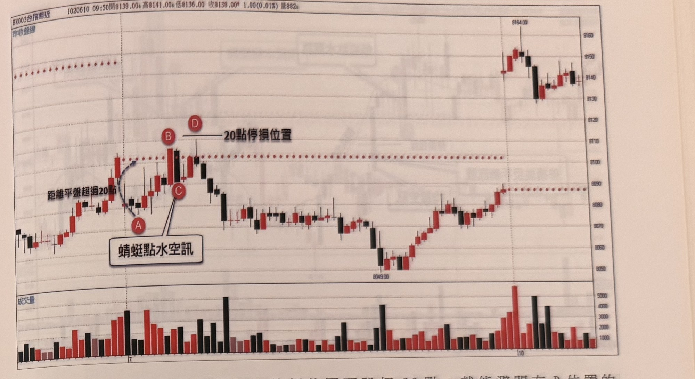

- **圖 9-32**（p.219，恆指/台指期，941209）：示範 F4：A 未跌破平盤且距離 < 20 點不符條件，B 非蜻蜓點水買訊；C、D 為下影線觸及平盤（非收盤跌破）；EF 雖技術上符合蜻蜓點水條件，但先前已多次以影線觸及平盤，缺乏獨特性，宜忽略。

  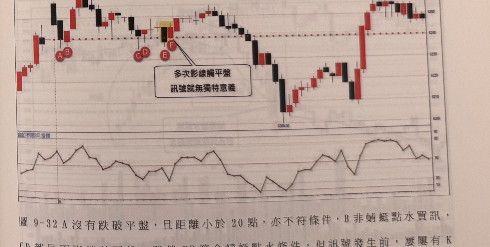

- **圖 9-33**（p.220，台指期，1040318）：BC 形成蜻蜓點水買訊，未上攻達 15 點，D 點跌破平盤觸及 20 點停損，測量 A 到 D 距離若在 60 點內，則可於 D 點反手放空（D 同時也是均線空訊）。

  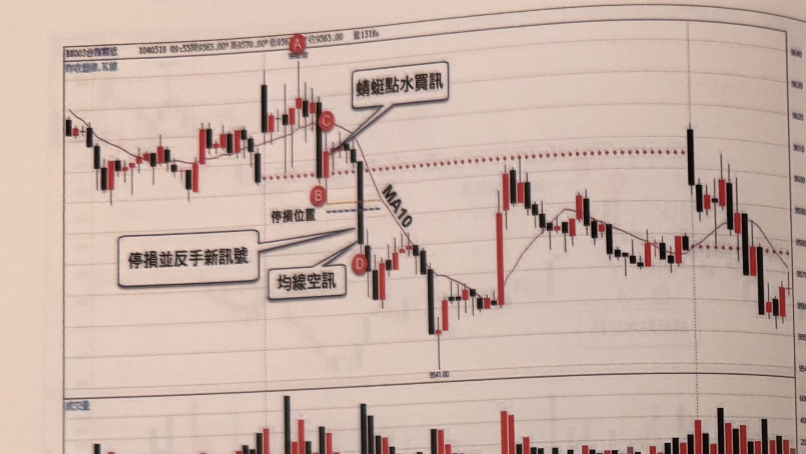

- **圖 9-34**（p.220，恆指/台指期，1071217）：AB 同時形成平盤蜻蜓點水買訊與均線蜻蜓點水買訊（兩方法訊號重合的範例），其後行情急漲至「頂倒 V 空訊」（逆向訊號）出現的高點。

  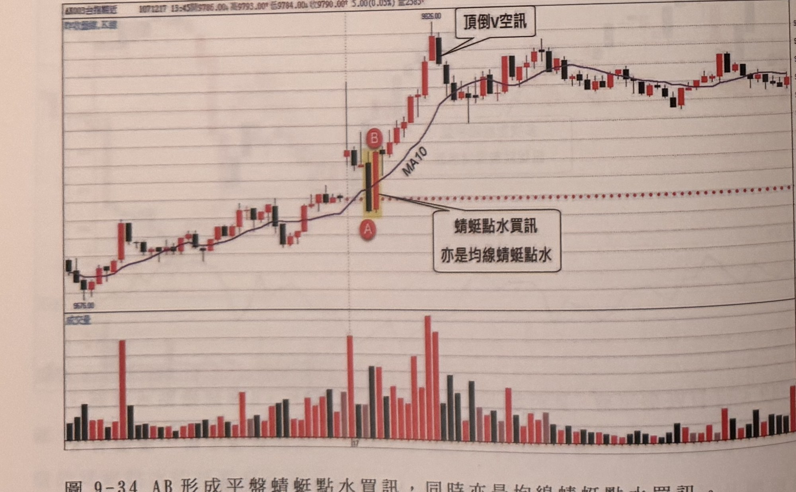

- **圖 9-35**（p.220–221，台指期，1040529）：示範 F5：AB 為頂雙黑空訊（逆向），隨後 CD 形成蜻蜓點水買訊（同為逆向訊號），但因 D 收盤侵入 B（頂雙黑空訊）的收盤之上，產生衝突，判定買訊無效。

  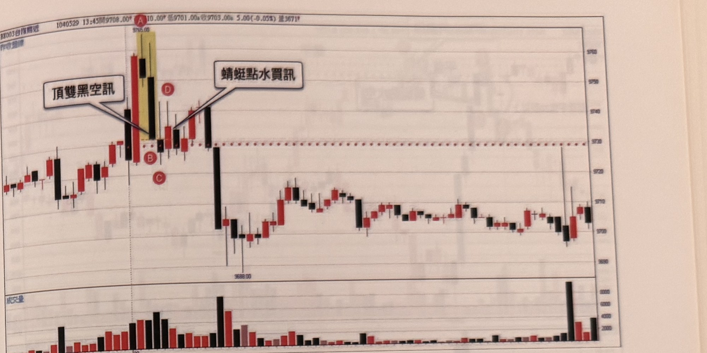

- **圖 9-36**（p.221，恆指/台指期，980522）：AB 形成蜻蜓點水空訊，稍後於 C 觸及停損；測得盤中最低點至 C 收盤距離達 90 點，超過 60 點限制，只能停損，不宜反手再買。

  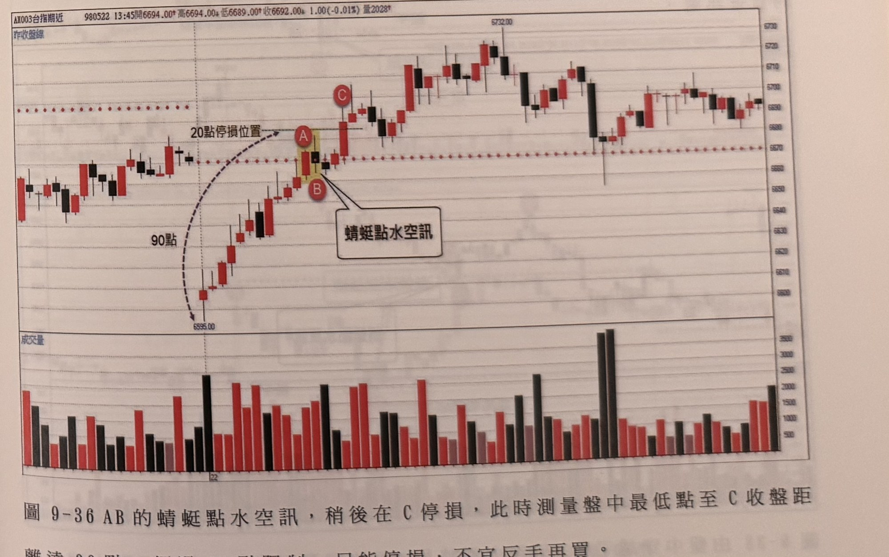

- **期貨奇績3-p224-1**（p.224，台指期，990504，原書此圖無隨附說明文字）：圖說描述價格跌破平盤止跌後（A），隨即以一根長紅 K 反彈站上平盤（B、C），標示為「蜻蜓點水空訊」；因原書無文字段落佐證，此標示與本文件對空訊定義（C2'/C3'：紅K突破、隔根黑K收回）的對應方式無法完全確認，存疑，見待確認事項。
- **期貨奇績3-p224-2**（p.224，台指期，990527，原書此圖無隨附說明文字）：A、B 於平盤附近形成蜻蜓點水買訊，其後行情走高拉回至 C，再度反彈於 D、E 附近形成蜻蜓點水空訊。
- **圖 9-40**（p.224，台指期，1020403）：示範 F4：價格不斷騷擾平盤、屢屢以影線觸及平盤，其後 CD 產生的訊號因缺乏獨特性，採取忽略。

  

- **期貨奇績3-p225-1**（p.225，台指期，990610，原書此圖無隨附說明文字）：圖說描述 A 點附近回落後反彈至 B、C，標示「蜻蜓點水空訊」。
- **期貨奇績3-p225-2**（p.225，台指期，1020125，原書此圖無隨附說明文字）：圖說描述行情突破平盤走高至 A、B，標示「蜻蜓點水空訊」。
- **圖 9-41**（p.225，台指期，1020131）：B、C 於平盤附近形成蜻蜓點水買訊；伴隨文字因照片曝光過淺、字跡極淡無法辨識，僅知大意與「訊號距離平盤的點數限制」及 RSI 參考數值有關，詳細內容缺失（見待確認事項）。

  


## 9. 作者提醒與常見錯誤

- 平盤蜻蜓點水屬「逆向訊號」，與均線蜻蜓點水（順向訊號）性質不同：買訊必須發生在當日極低附近、空訊必須發生在當日極高附近，若訊號 K 線收盤出現在相反方向的極端位置，屬不合理訊號，應忽略（開盤破三高／破三低的特殊情形除外）（p.216）。
- 跌破或突破平盤必須是「單一根」K 線的動作，二根以上收盤跌破／突破都不算數，即使事後行情證明方向正確，也不是正確的判斷方式（p.205、218）。
- 訊號發生前，若價格影線已多次觸碰平盤，代表該訊號缺乏獨特性，即使技術上符合條件也應忽略（p.219、224）。
- 遇到訊號 K 線波動過大（超大 K 線）時，不可照單全收，應直接放棄，而非嘗試以拉回或改設停損的方式勉強進場（p.216）。
- 反手是違反人性的操作（由多翻空或由空翻多），需要心理建設；書中以 60 點作為是否值得反手的判斷門檻，並強調若已獲利 15 點以上，則無須反手，安全出場優先（p.215、217）。
- 兩個逆向訊號衝突時，後發生訊號的收盤不可侵入先前相反訊號的收盤，否則判定後訊號無效（p.220–221）。

## 10. 規則速查（Checklist）

- [ ] 觸及平盤前，行情已在平盤一側運行，且距平盤 ≥ 20 點
- [ ] 僅一根 K 線收盤跌破（買訊）或突破（空訊）平盤（非連續兩根以上）
- [ ] 隔一根 K 線立即收盤收回平盤另一側（紅 K 買訊 / 黑 K 空訊）
- [ ] 訊號發生在當日極低點（買訊）或極高點（空訊）附近，非相反極端
- [ ] 訊號發生前，價格影線未多次觸及平盤
- [ ] 訊號 K 線波動未達「超大 K 線」等級（否則直接放棄）
- [ ] 若與相反方向逆向訊號衝突，本訊號收盤未侵入對方訊號收盤
- [ ] 停損 20 點；未達 15 點獲利前若反向跌破訊號 K 影線，立即出場
- [ ] 停損後是否反手：盤中極端點到反手點 ≤ 60 點才反手；已獲利 ≥ 15 點則不必反手，安全出場即可

## 11. 機器可讀規則

```yaml
signal: 平盤蜻蜓點水
side: long_and_short
timeframe: 5m
reference: 平盤（昨日收盤價）
conditions_long:
  - id: C1
    desc: 觸及平盤前行情處於平盤上方，高點距平盤 >= 20點
    source: p.208
  - id: C2
    desc: 僅一根黑K收盤跌破平盤（連續2根以上不算）
    source: p.205, p.218
  - id: C3
    desc: 隔一根K線收紅，收盤重新站上平盤；該紅K收盤為訊號成立點
    source: p.205, p.208
  - id: C4
    desc: 訊號應發生在當日極低點附近，不應落在當日最高附近
    source: p.216
  - id: C5
    desc: 訊號前價格影線不宜多次觸及平盤
    source: p.219, p.224
  - id: C6
    desc: 若與相反方向逆向訊號衝突，本買訊收盤不可侵入該逆向空訊收盤
    source: p.220-221
conditions_short:
  - id: C1p
    desc: 觸及平盤前行情處於平盤下方，低點距平盤 >= 20點（多空對稱）
    source: p.221
  - id: C2p
    desc: 僅一根紅K收盤突破平盤（連續2根以上不算，多空對稱）
    source: p.209
  - id: C3p
    desc: 隔一根K線收黑，收盤重新跌破平盤；該黑K收盤為訊號成立點
    source: p.209
  - id: C4p
    desc: 訊號應發生在當日極高點附近，不應落在當日最低附近（多空對稱）
    source: p.216
  - id: C5p
    desc: 訊號前價格影線不宜多次觸及平盤
    source: p.219, p.224
  - id: C6p
    desc: 若與相反方向逆向訊號衝突，本空訊收盤不可侵入該逆向買訊收盤（多空對稱）
    source: p.220-221
entry:
  price: 訊號成立K線（紅K買訊/黑K空訊）收盤價
  giant_bar_rule:
    threshold_points_approx: 60
    action: 直接放棄，不進場
    source: p.216
  early_exit_rule:
    desc: 若未推進15點即反向跌破/突破訊號K線影線，立即出場
    source: p.217
stop_loss:
  points: 20
  source: p.208, p.214, p.217, p.219-221
exit:
  desc: 書中未明確說明固定停利目標；已推進15點以上後折返進場點即應平倉
  source: p.215
reverse_on_stop:
  max_distance_extreme_to_stop_points: 60
  rule: 距離<=60點可反手，>60點僅停損不反手
  no_reverse_if_profit_advanced_points: 15
  source: p.214-215, p.217, p.219-221
filters:
  - desc: 跌破/突破平盤為連續2根以上K線（非單根）→ 不符合訊號定義
    source: p.218
  - desc: 訊號K線為超大K線（約60點以上）→ 一律放棄不進場
    source: p.216
  - desc: 訊號發生位置不合理（買訊在當日最高附近/空訊在當日最低附近）→ 忽略，開盤破三高/破三低除外
    source: p.216
  - desc: 訊號前價格影線多次觸及平盤 → 缺乏獨特性，忽略
    source: p.219, p.224
  - desc: 與相反方向逆向訊號衝突且本訊號收盤侵入對方收盤 → 本訊號無效
    source: p.220-221
  - desc: 反手時盤中極端點到反手點距離 > 60點 → 不宜反手，僅停損
    source: p.215, p.221
```

## 12. 待確認事項

1. p.206–207 缺頁：本節（平盤蜻蜓點水）開頭部分內容、圖 9-17 及其說明文字缺失；p.208 出現「第一型走勢」的用語，暗示原文可能還分「第一型」「第二型」等類型，完整的分型定義文字落在缺頁範圍內，待補拍確認，詳見 `../問題彙整.md` 第一節。

## 13. 原文出處

- `extracted/pages/IMG_8428.md`（p.204–205，本文件僅用 p.205）
- `extracted/pages/IMG_8430.md`（p.208–209）
- `extracted/pages/IMG_8433.md`（p.214–215）
- `extracted/pages/IMG_8434.md`（p.216–217）
- `extracted/pages/IMG_8435.md`（p.218–219）
- `extracted/pages/IMG_8436.md`（p.220–221）
- `extracted/pages/IMG_8438.md`（p.224–225）
