# RSI 差值訊號（正差買訊 / 負差空訊）

> 一句話摘要：當K線來到盤中當下最高（或最低）點，RSI也處於相對高（低）位，若下一根RSI值與前值差距達20以上，即視為反轉有力跡證，形成放空（或買進）訊號。

## 1. 核心概念

盤中行情抵達極端位置時，是否會出現反轉，可以從RSI指標下彎或上勾的幅度取得有力跡證。書中將RSI前後值的增減幅度稱為「RSI差值」（p.227）。

- **當價格K線成為盤中當下最高K線時**，對應的RSI也來到相對高點（不必是盤中RSI最高點），**若下一根RSI值小於前一值20以上**，此RSI差值具有反轉效果，通常表現為跌點較大的黑K線，形成放空訊號，稱為「RSI負差空訊」（p.227）。
- 反之，行情下跌來到**盤中當下最低K線**時，對應的RSI也來到相對低點（非盤中RSI最低點），**若下一根RSI值突然大於前一值20以上**，同樣具有反轉效果，形成買進訊號，稱為「RSI正差買訊」（p.227）。

外觀上，差值買訊的訊號K線必為盤中當下最低K線，或前一根K線為最低K線；差值空訊的訊號K線必為盤中當下最高K線，或前一根為最高K線（p.227）。

## 2. 適用前提

1. RSI差值訊號最好產生在極端位置；在過窄的震盪區間內比較差值，可靠度容易失真（p.227）。
2. 盤中當下高低震幅宜超過30點以上，甚至放大到40點更為合適（p.227）。
3. 訊號發生時間若在開盤不到30分鐘內，震幅尤需特別注意（p.227）。
4. 向上跳高開盤時，最高點距離平盤宜超過40點，此情形下適合優先尋找空訊；該階段若回檔幅度不及30點，縱有RSI正差超過20，須忽略買訊（p.227–228）。
5. 向下跳空開盤時，最低點距離平盤宜超過40點，此情形下適合優先尋找買訊；該階段若反彈不及30點，縱有RSI負差超過20，須忽略空訊（p.228）。
6. 上述兩條限制並非絕對：若跳高（或跳低）開盤距平盤不到40點卻仍產生負差空訊（或正差買訊），仍屬訊號，但「有瑕疵或不成熟」；停損控制嚴謹、敢冒險的交易者仍可一試（p.228，屬可選過濾條件而非強制禁止）。
7. 未到盤中最高或最低的極端位置時，不必時時查看RSI前後值是否超過20界限，只需在真正的極端位置出現時再檢查（p.230，圖10-3）。
8. 開盤跳空幅度在10點以內時，可視為前一日尾盤的延續，得併入前一日行情觀察極端位置，不受盤中震幅30點的極端位置規定限制；但若跳空超過10點，且當日第一根K線無法比前一日區間高（低）點更高（低），則不能套用此特例（p.237，圖10-10）。

## 3. 訊號定義

**空方（RSI負差空訊）**
1. C1：當根K線為盤中當下最高K線，或其前一根K線為盤中當下最高K線（p.227）。
2. C2：C1所指K線之RSI值，必須是本波段RSI「由升轉降」的轉折高點（即真正的相對高點），而非行情持續上漲途中臨時放大的差值；若RSI已提前開始下彎，之後才出現差值放大，不算訊號（p.231，圖10-4）。
3. C3：下一根RSI值 ≤（C2高點RSI值 − 20），亦即RSI後值比前值下彎20點以上（p.227）。
4. C4：RSI前後值若因K線收盤價與前一根相同而呈現水平移動（持平），則不得以該持平點作為C2的起算基準，須等到真正出現由升轉降的高點才成立（p.234，圖10-7）。
5. C5（RSI相對高點的認定）：C2所指的相對高點不要求是盤中RSI的最極端高值，只要是「這一小段推升過程」的相對高點即可（p.232–233，圖10-5）。

**多方（RSI正差買訊）**
1. C1：當根K線為盤中當下最低K線，或其前一根K線為盤中當下最低K線（p.227）。
2. C2：C1所指K線之RSI值，必須是本波段RSI「由降轉升」的轉折低點；若RSI已提前開始上勾，之後才出現差值放大，不算訊號（多空對稱，鏡像自p.231規則）。
3. C3：下一根RSI值 ≥（C2低點RSI值 + 20），亦即RSI後值比前值上勾20點以上（p.227）。
4. C4：RSI前後值持平（因收盤價相同）不得作為C2起算基準，須等到真正的由降轉升低點（多空對稱，鏡像自p.234規則）。
5. C5：C2所指相對低點同樣不要求是盤中RSI最極端低值，只要是這一小段下跌過程的相對低點即可（多空對稱，鏡像自p.232–233規則）。

## 4. 進場

1. 訊號確立當下即可進場：正差買訊出現即買進，負差空訊出現即放空（p.229–231，多次案例）。
2. 補進場：若第一次訊號未進場（如圖11同型態案例中提及最慢在次一個相同型態突破點補進場），可在下一個同型態且更明確的訊號點補進場（p.249，此為第十一章用語，但第十章亦有「以下附圖請讀者自己參閱比對訊號」之延伸練習，本章未另訂獨立補進場規則，書中未明確說明）。
3. 停損調整後反手：見第5節「停損」與下方「停損後反手」規則。

## 5. 停損

1. 訊號成立進場後，停損設在訊號K線極端點外20點（即訊號K的高／低點再加20點，而非以進場價為基準）（p.229「立刻設20點停損位置」；p.230、p.231同樣敘述「設下20點停損位置」；p.233明確以訊號K線極端點為基準）。
2. 過濾：若訊號K線本身漲跌點數過大，導致進場到停損之間的風險超過40點，須忽略該訊號，不進場（p.233，圖10-6，D位置案例）。
3. 停損後可反手（見下）；除反手情形外，其餘依20點停損機制執行，書中未提及反手以外的停損後加碼或其他處理。

### 停損（未確認訊號）後之反手規則

當訊號尚未得到「原方向延續確認」（即價格尚未收盤突破/跌破訊號K線本身的高/低點）時，適用以下反手規則：

1. 負差空訊反手買：放空進場後，若K線收盤**未曾**跌破訊號K線（或其定義的相對低點）之最低點，而行情反而重新收盤突破訊號發生前的相對高點（濾網水平線），則不必等觸及20點停損，即可在該收盤突破的瞬間，停損原空單並反手追買（p.235，圖10-8；p.240圖10-16；p.241圖10-17）。
2. 正差買訊反手空（鏡像）：買進進場後，若K線收盤**未曾**突破訊號K線之最高點，而行情反而收盤跌破訊號發生前的相對低點濾網水平線，則停損原多單並反手放空（p.240，圖10-15）。
3. 若已出現「K線收盤跌破空訊最低點」（或「K線收盤突破買訊最高點」），即代表訊號已按20點停損機制觸發，**不得**再做反手（p.235：「如果B出現RSI負差空訊後，後續行情，K線收盤曾經低於B的最低點，則不能做反手買動作」）。
4. 反手位置的距離濾網：若反手進場位置距平盤已經超過100點以上，通常不宜再反手，除非當日為重挫（急殺）盤（p.236，圖10-9）。

### 訊號已延續確認後之停損（不可反手）

訊號的「已確認」狀態有兩種等價的判準（p.233、p.236）：

1. K線收盤已經突破正差買訊訊號K線的最高點（或跌破負差空訊訊號K線的最低點）；或
2. 行情曾順著訊號方向走了15點以上（見第6節）。

只要滿足其中之一，即視為訊號已確認：其後若行情折返回進場價（訊號K收盤價），必須出場了結，不可反手；若行情反轉並創新低（或新高），也**只能停損**，不可再反手順著新方向操作（p.233、p.236，圖10-9）。未達15點獲利、且K線收盤也未突破/跌破訊號K極端點時，才適用上方「未確認訊號」的反手規則。

## 6. 出場 / 停利

1. 若訊號成立後，行情順著訊號方向前進未達15點又重新折返回到訊號K線收盤價位置（買訊：跌破訊號K收盤；空訊：漲破訊號K收盤），應撤單平倉離場，不留倉續抱（p.232–233，圖10-6）。
2. 若行情已順訊號方向走了15點以上，視為訊號已確認：其後若折返回到進場價（訊號K收盤價），必須出場了結，且不可反手；此時另有其他方法（如均線訊號）可判斷是否進場，本方法不再提供依據（p.233，圖10-6）。
3. 書中舉例以MA10作為停利機制之一（p.229，圖10-2：「假設採取MA10為停利機制，一直持有多單」），但未明確規定此為必用規則，僅為範例中的假設性停利方式。
4. 若同一訊號模式在當日第一趟操作未能獲利，建議同日不再使用相同訊號模式進場（p.233）。
5. 若訊號發生時間已接近收盤，僅可作為平倉出場訊號，不應視為新倉進場依據（p.230–231，圖10-3，F位置）。
6. 除上述規則外，書中未進一步明確說明其他固定停利點數或指標停利機制。

## 7. 過濾：不做的情況

1. 開盤第一根K線不得作為任何訊號判斷依據，因其無法辨認盤中最高或最低（p.228，圖10-1）。
2. 差值放大若非發生在「RSI由升轉降」或「由降轉升」的真正轉折點，而是行情持續上漲/下跌途中臨時出現的差值放大，不視為訊號（p.230–231，圖10-4）。
3. RSI前後值因收盤價相同而持平時，隔一根出現的上勾或下彎不視為差值訊號；需等到真正由高點快速下彎（或由低點快速上勾）的那一根才算數（p.234，圖10-7）。
4. 盤中高低震幅未達30點（跳空情形未達40點）的極端位置條件時，該處差值訊號可靠度低，依第2節之3-6項規則過濾（p.227–228）。
5. 訊號K線本身漲跌點數過大，導致停損可能超過40點以上時，忽略訊號（p.233，圖10-6）。
6. 訊號發生時間接近收盤時，僅作平倉訊號，不作新倉訊號（p.230–231）。
7. 已延續確認之原訊號，反轉時僅可停損，不得反手（p.236，圖10-9）。
8. 反手進場位置距平盤已超過100點，除非為重挫盤，否則不宜反手（p.236，圖10-9）。

## 8. 範例解析

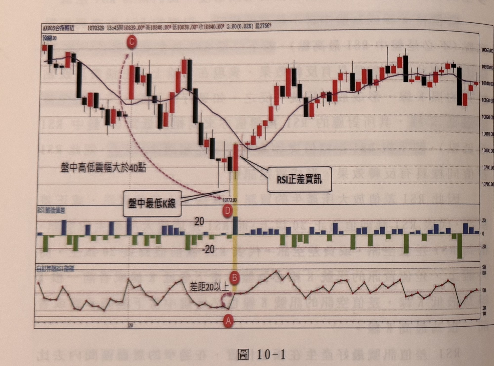

- **圖10-1**（p.228–229，台指期）：典型RSI正差買訊。開盤跳高至C點（距平盤約37點），其後緩跌約90分鐘至D點形成盤中當下最低K線，C至D震幅逾40點，符合極端位置條件；D對應RSI最低值A，隔根B與A差距逾20，形成正差買訊。示範規則C1–C3、適用前提2。

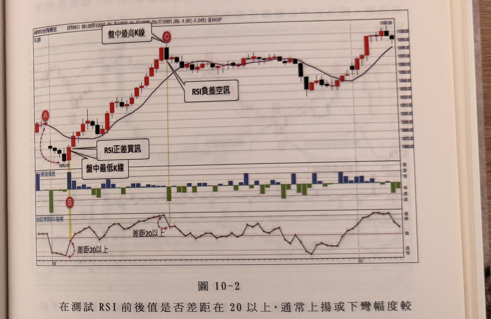

- **圖10-2**（p.229–230，台指期）：跳低開盤後連續走低，最低點距平盤逾40點，符合極端位置；B位置RSI大幅上勾且差距逾20，且B為盤中當下最低K線，形成正差買訊，進場買進並設20點停損，以MA10為停利機制持有；其後C為連五紅遇首黑，RSI自高點下彎逾20，且C為盤中當下最高K線，形成負差空訊，設20點停損放空。示範規則C1–C3、進場、停損、停利範例。

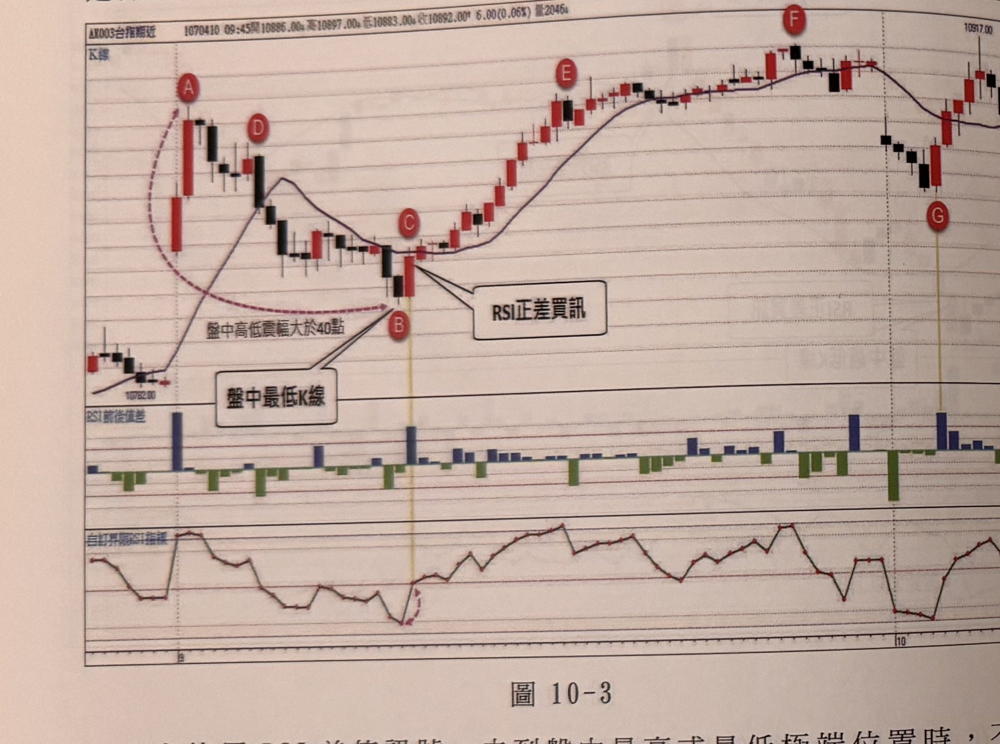

- **圖10-3**（p.230–231，台指期）：示範「未到極端位置不必時時查看RSI前後值」規則：D點RSI負差雖逾20，但D非盤中當下最高K線（前一根亦非），故不算空訊；行情續跌至B（盤中最低K線），震幅逾40點，隔根C形成正差買訊。另示範F位置訊號因接近收盤僅作平倉訊號、不作新倉。

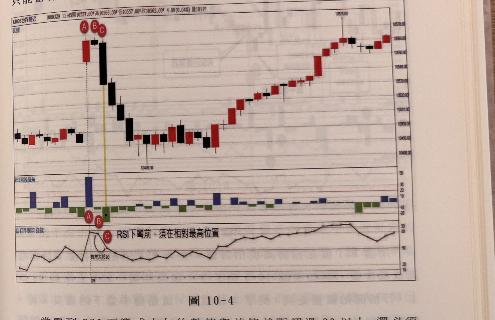

- **圖10-4**（p.231，台指期）：示範「RSI須由升轉降」規則：A為第一根高點，隔根B同高但為黑K，RSI已開始下彎；第三根C出現RSI差值擴大逾20，但因並非「由升轉降」的轉折點，不能視為空訊，即使C之後行情持續下跌。

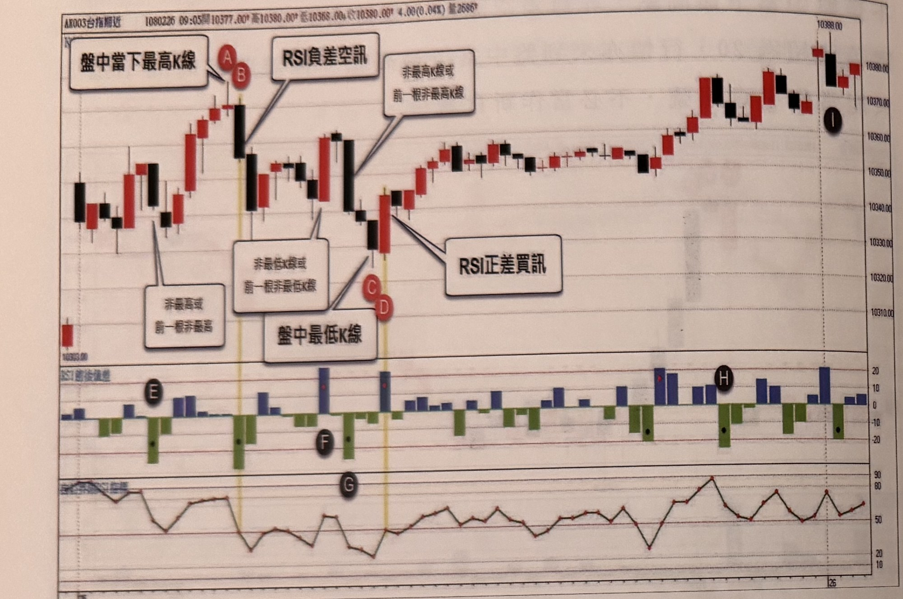

- **圖10-5**（p.232–233，台指期）：示範「RSI相對高低點不須為盤中極端值」規則：A為盤中當下最高K線，其RSI僅約80（盤中RSI極端高點其實發生在開盤時），仍屬本波段相對高點，B處RSI下彎逾20形成負差空訊；其後行情跌至C（盤中當下最低K線，RSI同步達盤中極端低值），隔根D形成正差買訊。

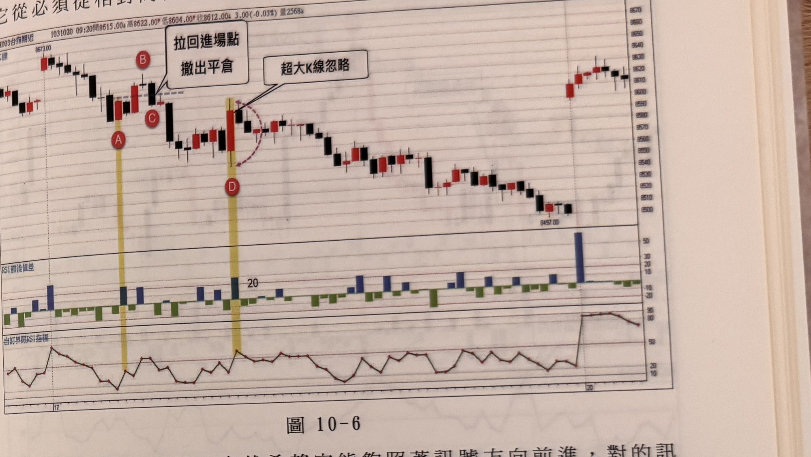

- **圖10-6**（p.233，台指期）：示範15點折返撤單規則與訊號K線漲跌過大之忽略規則：A位置正差買訊後僅推進15點即折返跌破A收盤，應撤單平倉；另D位置正差買訊因K線漲點過大、停損恐逾40點，須忽略。


- **圖10-7**（p.234，台指期）：示範RSI持平不計入差值規則：A、B收盤相同，RSI呈水平移動，其後C出現RSI快速下彎逾20但RSI並非處於上漲進行中，須剔除；直到D位置，K線收黑且RSI由最高值快速下彎，才形成負差空訊。


- **圖10-8**（p.235，台指期）：示範「未確認訊號反手買」規則：A為盤中最高點，B出現負差空訊，但其後K線收盤未曾跌破B最低點，反而重新收盤突破A高點，故不必等停損，於突破瞬間反手追買。


- **圖10-9**（p.236，台指期）：示範「已確認訊號不可反手，僅能停損」及反手距離濾網規則：A出現正差買訊，B之K線收盤已超過訊號A最高點（上影線高過A收盤20點，屬已確認延續），其後C位置跌破盤中最低谷點，僅可停損，不可反手放空；並說明反手位置若距平盤逾100點通常不宜反手。


- **圖10-10**（p.237，台指期）：示範跳空10點內可併入前日行情觀察極端位置的特例：A為昨日區間最高點，當日跳高10點內開盤，B成為昨日行情的延續高點，C出現RSI負差空訊時可免受盤中震幅30點限制。

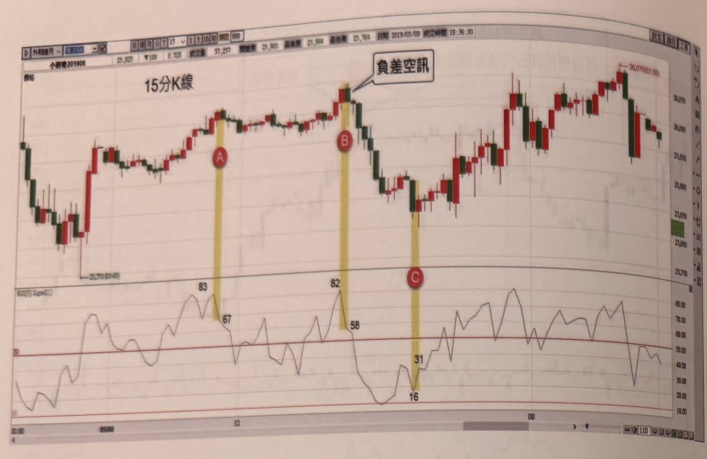

- **圖10-11**（p.238，小道瓊15分鐘K線）：ABC三點皆符合差值訊號條件，A空訊後向下逾30點應已獲利或回進場點撤單，故B空訊仍可進場操作。

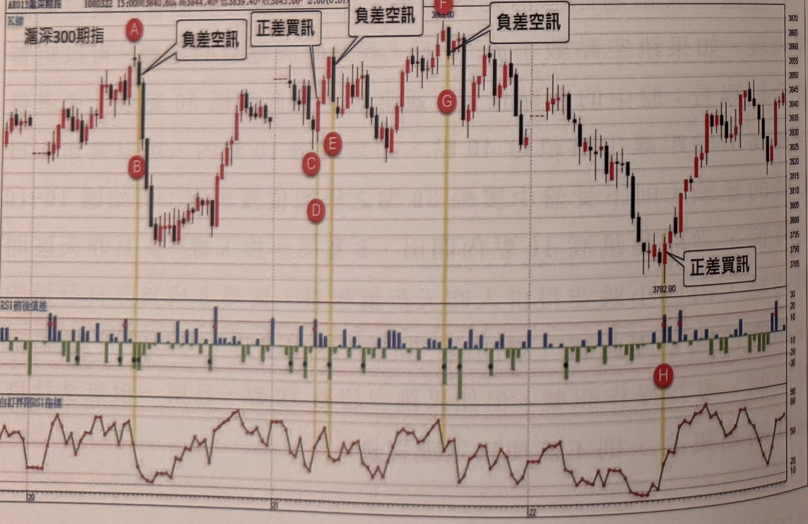

- **圖10-12**（p.238，滬深300期指15分鐘K線）：示範以20點為差值濾網的多組正差買訊／負差空訊訊號（B、C/D/E、F、H等）。

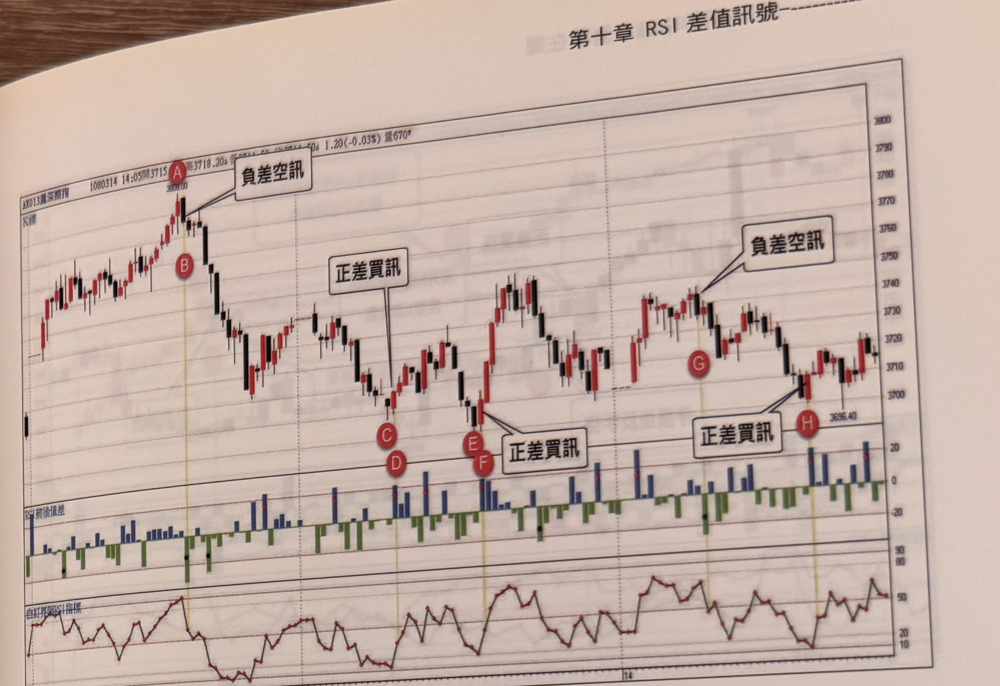

- **圖10-13**（p.239，滬深300期指15分鐘K線）：另一組以20點為濾網的差值訊號示範（A、C/D、G、H等）。

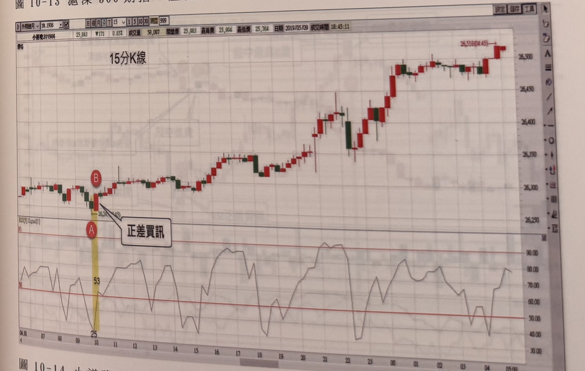

- **圖10-14**（p.239，小道瓊15分鐘K線）：以20點為訊號濾網之正差買訊示範（B、A對應RSI由低點回升）。

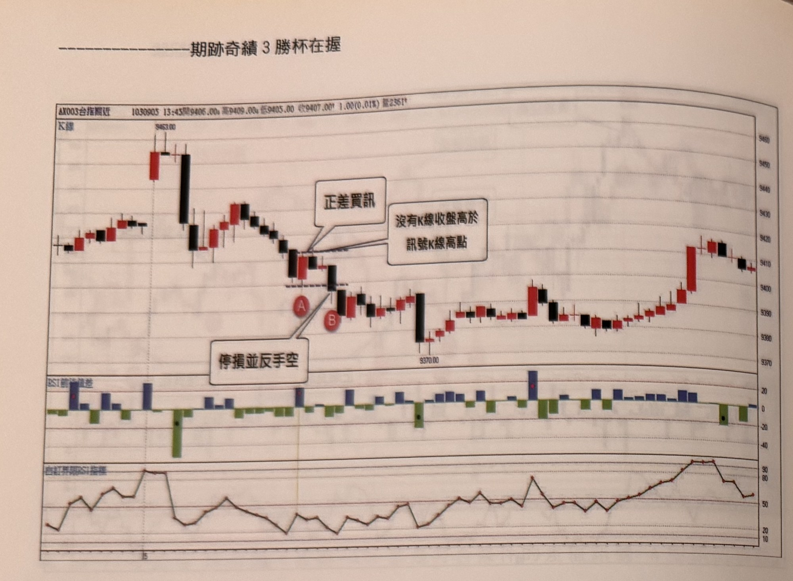

- **圖10-15**（p.240，台指期）：示範「正差買訊未確認、反手放空」規則：A為正差買訊，但K線收盤始終未高於訊號K線高點；後續K線收盤跌破B低點時，停損並反手放空。

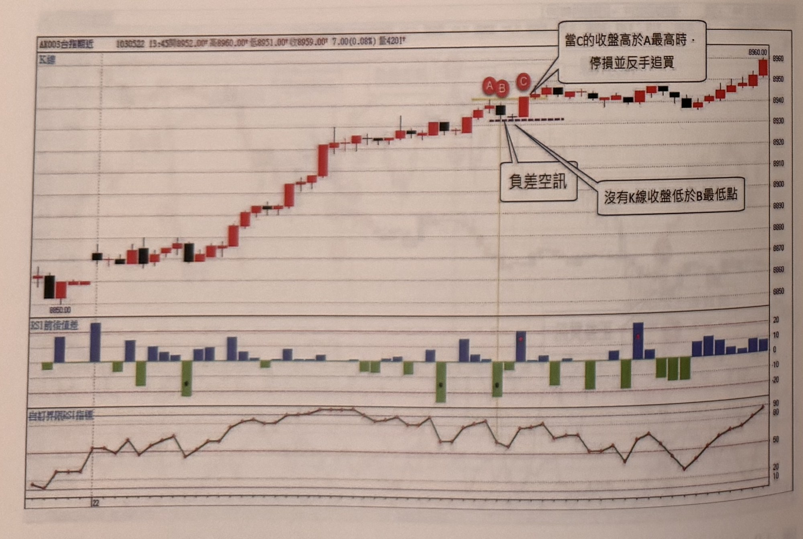

- **圖10-16**（p.240，台指期）：示範「負差空訊未確認、反手追買」規則：A、B皆為負差空訊，K線收盤未曾低於B最低點；C位置紅K收盤突破A最高點時，停損並反手追買。

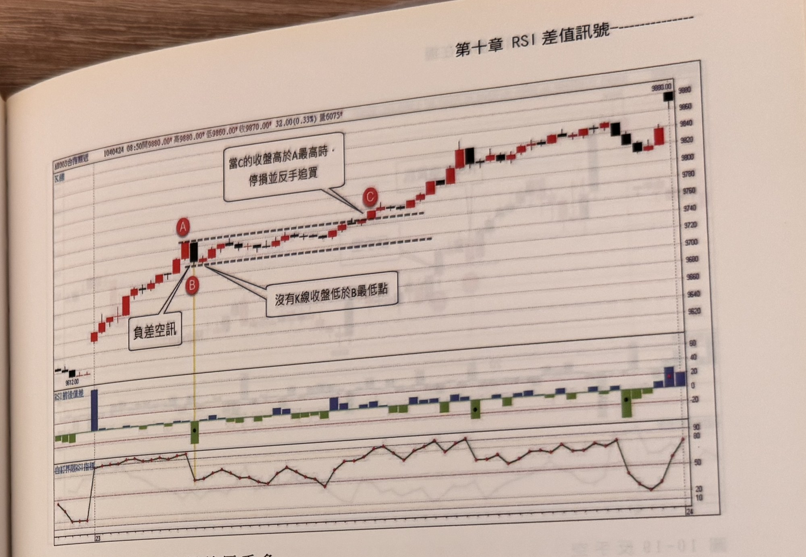

- **圖10-17**（p.241，台指期）：與圖10-16同規則的另一案例：B為負差空訊，收盤未曾跌破B最低點；C位置收盤突破A高點時，停損並反手追買，突破後續強勢上揚。

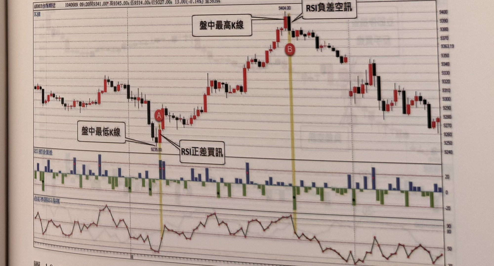

- **圖10-18**（p.241，台指期）：完整示範一組正差買訊（A，盤中最低K線）與負差空訊（B，盤中最高K線）的基本型態，B後行情反轉下跌。

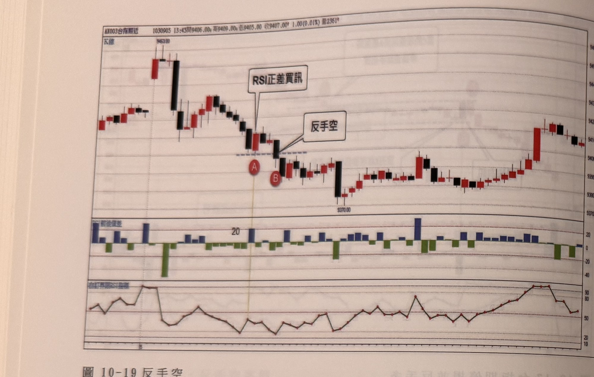

- **圖10-19**（p.242，台指期，標題「反手空」）：A位置出現RSI正差買訊，其後K線收盤未曾突破訊號K線最高點，反而收盤跌破訊號發生前的相對低點濾網水平線，於B位置停損原多單並反手放空；訊號後行情持續重挫下殺一大段，最低點9370.00，其後止跌反彈，歷經多次區間震盪整理。示範第5節「正差買訊未確認、反手放空」規則的具體圖例（對照圖10-15）。

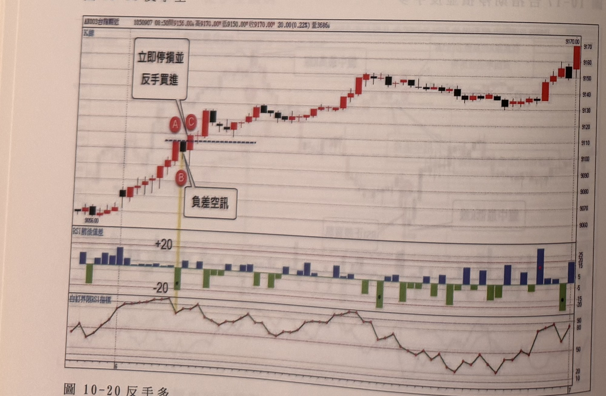

- **圖10-20**（p.242，台指期，標題「反手多」）：A、B、C三根相鄰K線標示於上漲途中：B位置構成「負差空訊」（RSI前後值差達−20負差），其後C收盤回到A附近之上，文字框標示「立即停損並反手買進」，水平虛線標示A/C價位；之後行情續漲至右側高點9170。副圖一「RSI前後值差」柱狀圖標示+20、−20參考值，B處出現−20綠色負柱；副圖二「自訂界限RSI指標」曲線。本圖示範負差空訊出現後被行情否定、立即停損並反手做多（對照圖10-19反手空），對應第5節「未確認訊號、負差空訊反手買」規則。

## 9. 作者提醒與常見錯誤

1. 訊號的條件本來就有步驟依循，錯誤認定在很多案例中不利於操作（p.232）。
2. 測試RSI前後值是否差距20以上，通常僅需在上揚或下彎幅度較大時才查核，不必特意製作指標檢測（此為講解方便才附上RSI前後值差柱狀圖）（p.229）。
3. 最要警戒行情「走不遠就折返」的狀況（p.233）。
4. 當日第一趟同型態RSI差值訊號未能獲利，同日不宜再用相同模式進場（p.233）。
5. 差值訊號雖須發生在盤中極端位置，但極端位置並非不能被攻破；此時應考慮以反手取代單純停損，讓新方向帶來獲利機會（p.235）。

## 10. 規則速查（Checklist）

- [ ] 訊號K線為盤中當下最高（空訊）或最低（買訊）K線，或其前一根為最高/最低
- [ ] RSI對應值為本波段「由升轉降」或「由降轉升」的真正相對高/低點（非途中臨時放大、非持平延伸）
- [ ] 下一根RSI值與前值差距達20以上（空訊為負20以上，買訊為正20以上）
- [ ] 盤中高低震幅逾30點（跳空情形逾40點），或屬跳空10點內可併入前日行情之特例
- [ ] 開盤第一根K線不作訊號判斷
- [ ] 訊號K線本身漲跌點數未過大（停損不致逾40點）
- [ ] 進場後設20點停損
- [ ] 訊號未確認前，未跌破空訊最低點／未突破買訊最高點，且收盤突破/跌破對側濾網線 → 停損並反手
- [ ] 訊號已確認延續後反轉 → 僅停損，不反手
- [ ] 反手位置距平盤未逾100點（非重挫盤）
- [ ] 訊號前進未達15點即折返回訊號K收盤 → 撤單平倉
- [ ] 訊號時間非接近收盤（否則僅作平倉依據）

## 11. 機器可讀規則

```yaml
signal: RSI差值訊號
side: both
timeframe: "1m（台指期，推論）/ 15m（小道瓊、滬深300期指範例）"
conditions:
  - id: C1_SHORT
    desc: 當根K線為盤中當下最高K線，或前一根為盤中當下最高K線
    source: p.227
  - id: C2_SHORT
    desc: 對應RSI為本波段由升轉降之相對高點（非持平延伸、非途中臨時放大）
    source: p.230-231, p.234
  - id: C3_SHORT
    desc: 下一根RSI值 <= 前值 - 20
    source: p.227
  - id: C1_LONG
    desc: 當根K線為盤中當下最低K線，或前一根為盤中當下最低K線
    source: p.227
  - id: C2_LONG
    desc: 對應RSI為本波段由降轉升之相對低點（非持平延伸、非途中臨時放大）
    source: p.230-231, p.234（多空對稱）
  - id: C3_LONG
    desc: 下一根RSI值 >= 前值 + 20
    source: p.227
  - id: F_EXTREME
    desc: 盤中高低震幅 > 30（跳空情形 > 40），或跳空<=10點併入前日行情特例
    source: p.227-228, p.237
entry:
  short: 負差空訊確立時進場放空
  long: 正差買訊確立時進場買進
  source: p.229-231
stop_loss:
  points: 20
  ref: "訊號K線極端點外20點（非進場價）"
  source: p.229, p.230, p.231, p.233
  filter: 若訊號K線本身漲跌點數過大，導致進場到停損風險超過40點，忽略訊號 (p.233)
exit:
  rule1: 訊號後行情未達15點即折返回訊號K收盤 -> 撤單平倉
  rule2: 訊號已順勢達15點以上後折返回進場價（訊號K收盤）-> 必須出場，不可反手（視為訊號已確認）
  rule3: 訊號時間接近收盤 -> 僅作平倉依據，不做新倉
  source: p.230-231, p.232-233
reversal:
  unconfirmed:
    desc: 訊號未確認延續（未突破/跌破訊號K極端點，且獲利未達15點）且收盤突破/跌破對側濾網線 -> 停損並反手
    distance_filter: 反手位置距平盤 > 100點且非重挫盤 -> 不宜反手
    source: p.235-236, p.240-241
  confirmed:
    desc: 訊號已確認延續（K線收盤突破/跌破訊號K極端點，或獲利曾達15點以上）後反轉創新高/新低 -> 僅停損，不可反手；曾達15點者折返回進場價即應出場，不待20點停損
    source: p.233, p.236
filters:
  - desc: 開盤第一根K線不作訊號判斷
    source: p.228
  - desc: RSI差值放大非發生於由升轉降/由降轉升之真正轉折點，不算訊號
    source: p.230-231
  - desc: RSI前後值因收盤價相同而持平，隔根出現之上勾/下彎不視為差值訊號
    source: p.234
  - desc: 當日第一趟同型態訊號未獲利，同日不宜再用相同模式進場
    source: p.233
```

## 12. 待確認事項

1. 第十章 p.226–243 已全數補齊（p.243為章末空白頁，不計缺頁）。
2. **書外補充（讀書會作者補充，已用回測判定）**：2019-08-23（post 492643204881779）貼文註記「老師補充，因盤中震盪低於40點，故需忽略此買訊」。程式以 `min_session_range`（預設 None＝關閉）實作。2026-09-28 以 `scripts/compare_params.py` 比較關閉與 40（`results/params/q3_10_rsi_diff_min_session_range.csv`）：原始／縮放 × 1/3/5 分K 共 6 組，開啟後 4 組較差、2 組相同，**沒有一組變好**（例：原始 1分K −482→−671；縮放 5分K +394→+194）。**結論：維持關閉**。

## 13. 原文出處

- `extracted/pages/IMG_8439.md`（p.226–227）
- `extracted/pages/IMG_8440.md`（p.228–229）
- `extracted/pages/IMG_8441.md`（p.230–231）
- `extracted/pages/IMG_8442.md`（p.232–233）
- `extracted/pages/IMG_8443.md`（p.234–235）
- `extracted/pages/IMG_8444.md`（p.236–237）
- `extracted/pages/IMG_8445.md`（p.238–239）
- `extracted/pages/IMG_8446.md`（p.240–241）
- `extracted/pages/IMG_8948.md`（p.242–243，圖10-19、圖10-20；p.243為章末空白頁）
