# 以選擇權進行波段操作（MA100 + RSI極端值 + 峰谷突破）

> 一句話摘要：以30分鐘K線的MA100（相當於日線10日均線）分多空趨勢，當價格突破/跌破均線並使RSI觸及90／10極端值後，等待拉回修正，再以收盤突破/跌破拉回前的峰位/谷位水平線作為進場訊號，改用選擇權買方（CALL／PUT）操作波段，以規避留倉的期貨超額損失風險。

## 1. 核心概念

波段操作必然涉及留倉，若使用期貨部位，夜間美股等消息面可能造成暴漲暴跌，帶來超出預期停損點數的超額損失；若無法接受可能高達上百點的停損，操作波段單將是一場災難（p.245）。

解決之道是以選擇權買方（買進CALL或買進PUT）取代期貨波段單：選擇權買方的最大風險即為付出的權利金，不會有超額損失的疑慮，即使方向判斷正確卻先遇到逆勢洗盤，只要不被時間價值耗盡，仍有等待行情回頭的機會（p.245）。

本章不採用過小週期（分時K線易使日線趨勢未變、卻頻繁多空反覆）或過大週期（日線訊號稀少、需長時間等待）的K線，而以**30分鐘K線**作為研判基礎（p.246）。以**MA100（相當於日線10日均線）**作為多空趨勢分界：站上MA100偏多操作，跌破MA100偏空操作。切入點選在波動即將加速的時段，以**RSI觸及90以上（超買）或10以下（超賣）**這種「嚴重超買超賣」作為市場強度極致、即將鈍化強攻的訊號依據（p.246–247）。

策略核心邏輯：當RSI觸及90以上，若後市僅發生短暫、幅度小的拉回整理，隨即重新集結力道創新高，即代表強多格局確立，應把握此「浴火鳳凰」的機會買進CALL；當RSI觸及10以下，若僅發生短暫反彈後續行情加速破底，則買進PUT把握波段行情（p.247）。

## 2. 適用前提

1. 以30分鐘K線為觀察週期，MA100（或亦可視需要調整為MA120、MA200等分多空的均線，適合操作即可）為多空分界（p.246，p.248）。
2. 前置行情須先在MA100之下（買CALL情境）或之上（買PUT情境），才符合本法「趨勢反轉」意圖的判定基礎（p.249圖11-2圖說：「前置行情 必須在均線之下」；p.253圖11-13圖說：「前置行情 必須在均線之上」，鏡像適用）。
3. 訊號成立速度須「強烈且快速」：突破/跌破均線出現峰/谷點、RSI觸及90/10後，接續的拉回/反彈幅度要小、時間要短，才符合本法追求波段快速加速的特性（p.252）。

## 3. 訊號定義

**多方（買進CALL）**
1. C1：價格由MA100下方向上突破MA100（p.247）。
2. C2：突破均線後之峰位，須符合「峰位正確」認定：連續紅K線遇黑K造成不再創新高的拉回時，且該波段最高紅K線對應的RSI值觸及90以上，峰位才正確產生；若出現拉回卻沒有黑K反轉（持續創新高），峰位需繼續向上尋找，直到出現RSI觸及90之峰點（p.253）。
3. C3：將C2峰位之最高點畫出一條水平線，作為再攻濾網（p.248）。
4. C4：拉回修正須符合下列任一條件，訊號才有效：
   - 拉回允許跌破均線，但跌破時間不宜拖太久，且不可跌破至創「突破均線前」的起始谷點以下（即不能低於MA100下方原起漲的谷位）（p.248, p.252）；或
   - 拉回剛好卡在均線（未真正跌破，收盤仍在均線之上），RSI已於該處觸及90以上（或非常接近90，如89.41以內視為達成，見第7節過濾規則），拉回幅度不大、時間約一天以內（p.254–255，圖11-7例外規則之鏡像適用；註：p.254–255原文係以PUT情境之「卡在均線」規則詳述，CALL情境為鏡像對稱，見圖11-7實際案例即為CALL方向）。
5. C5：若拉回時間過久（如逾10天）、幅度過大（如拉回低點幾乎回到突破均線前的最低谷點），則此峰位不符合快速反轉意圖，須取消觀察，等待重新突破均線後再行判斷（p.249, p.251–252，圖11-4）。
6. C6：確認訊號 — 當價格K線收盤重新向上，突破C3所畫之峰位水平線，即形成買進訊號（p.247, p.249）。訊號K線本身收盤須已站上MA100（真正完成突破均線的步驟）；若K線收盤突破峰位水平線，但當下仍位於MA100之下，不能視為步驟完成的買進訊號，須等到真正收盤站上均線的那一根才算數，即使該根同時也創了更高的峰位亦然（p.256，圖11-8：B收盤突破A峰位但仍在MA100下方，不算買訊；隨後C才收盤站上MA100，但因B、C對應之RSI皆觸及90以上，可依「卡在均線」放寬情況觀察；隔天開盤第一根D收盤突破C峰位，才形成正式買進訊號）。

**空方（買進PUT，鏡像）**
1. C1：價格由MA100上方向下跌破MA100（p.247）。
2. C2：跌破均線後之谷位，須符合「谷位正確」認定：連續黑K線遇紅K造成不再創新低的反彈時，且該波段最低黑K線對應的RSI值觸及10以下，谷位才正確產生；若第一谷點的RSI未觸及10以下，則不宜採用本法在該谷點進場操作，須待RSI確實觸及10以下之谷點才成立（p.253，圖11-5）。
3. C3：將C2谷位之最低點畫出一條水平線，作為再攻（下跌）濾網（p.250）。
4. C4：反彈修正須符合下列任一條件，訊號才有效：
   - 反彈允許站上均線，但站上時間不宜拖太久，且反彈高點不可高於「跌破均線前」的原起跌高點（多空對稱，鏡像自C4第一項）；或
   - 反彈剛好卡在均線（未真正站上，收盤仍在均線之下），RSI已於該處觸及10以下，反彈幅度不大、時間約一天以內（p.254，圖11-6）。
5. C5：若反彈時間過久、幅度過大，則此谷位不符合快速反轉意圖，須取消觀察，等待重新跌破均線後再行判斷（多空對稱，鏡像自C5）。
6. C6：確認訊號 — 當價格K線收盤重新向下，跌破C3所畫之谷位水平線，即形成放空（買PUT）訊號（p.247, p.250–251）。訊號K線本身收盤須已跌破MA100，若收盤跌破谷位水平線但仍位於MA100之上，不算完成步驟的空訊，須等到真正收盤跌破均線的那一根才算數（多空對稱，鏡像自C6，p.256）。

## 4. 進場

1. 訊號成立（C6，收盤突破峰位水平線 / 跌破谷位水平線）當下即可進場（p.247, p.249, p.250–251）。
2. 若在第一個突破點（如C點）未進場，最慢可在後續再次突破前高（或跌破前低）的補確認點（如D點）補進場（p.249，圖11-1：「圖上D點突破C高，亦是視為買進訊號，如果在C沒有進場，最慢在D補進場」）。
3. 進場工具：買進價平（ATM）的買權/賣權，或價外二檔（OTM 2檔）的買權/賣權；若想同幅期貨波動則採價平，若想縮小投入資金則採價外（p.245）。
4. 儘可能以跨月OP（次月合約）操作；若使用當月OP但剩餘時間過少，則不建議使用當月OP（p.247）。

## 5. 停損

1. 選擇權買方（本法之操作方式）的最大風險即為已付出的權利金，理論上「不做任何停損動作」——每次進場都當作是必然可能歸零的機會成本（p.260–261，圖11-12）。
2. 正因如此，短時間內若先出現一個方向訊號（如PUT）、接著又出現反向訊號（如CALL），形成「對開」局面：若是期貨部位稱為鎖單、必然造成更大虧損，但選擇權買方沒有這個問題，可同時持有兩邊部位，不須為了原部位而牽制新訊號進場，靜待任一方向正確大走即有機會獲利彌補甚至超過另一邊的權利金損失（p.260–261）。
3. 書中未提及以期貨點數換算或另訂固定停損點數作為出場依據；「停損」概念在本章實質等同於「該筆權利金支出全額作廢」，不做加碼攤平或反向操作。

## 6. 出場 / 停利

書中原文（p.257）明列四種可選停利機制（可依需求擇一或搭配使用），皆以圖11-9～11-11之實例示範：

1. **MA10移動停利**：當標的期貨價格觸及原買進選擇權的履約價，使原本的價外二檔部位轉為價平時，啟動以30分鐘K線之MA10作為移動停利依據——多單（CALL）於K線收盤跌破MA10時停利出場；空單（PUT）於K線收盤突破MA10時停利出場（p.257–259）。
2. **創新高/新低反彈折返100（或150）點停利**：以每次創新低的黑K線最低點（PUT部位）或創新高的紅K線最高點（CALL部位）為基準，當價格反彈（或回落）超過100點（原文亦提及可用150點）時停利出場（p.257–259）。
3. **突破/跌破前一天K線高低點停利**：以前一交易日K線的最高點（PUT部位出場依據）或最低點（CALL部位出場依據）為濾網，當K線收盤突破（或跌破）該濾網時停利出場（p.257–259）。
4. **固定點數平倉**：以固定獲利比例出場，書中舉例「賺50%或100%出場」，未進一步規定固定門檻的具體數值（p.257）。

**留倉至結算日平倉**（非上述四種機制之一，而是圖11-11實例中額外示範的持有方式）：持有部位至選擇權結算日才平倉出場；書中案例顯示此法在該實例中可能獲得最大獲利點數，但作者強調「不代表就是最佳停利機制，只要可以獲利，都應該接受任何操作決定的過程」（p.259–260）。

> 修正說明：本節第 4 種停利機制原文為「固定點數平倉（賺50%或100%出場）」（p.257），先前版本因p.256–257缺頁誤植為「留倉至結算日平倉」；「留倉至結算」實為圖11-11案例額外示範的持有方式，非原文四種機制之一，現已依原文更正並補列於下方獨立說明。

書中未規定四種機制（含留倉至結算的額外示範）的優先順序或何者為預設方法，僅並列示範供交易者依個人偏好選擇（p.260）。

停利機制的啟動時點：三個範例都以「標的觸及所買選擇權的履約價、價外轉為價平」作為開始執行停利的時點（p.258「抵達10600，使得原先的價外二檔賣權變成價平，此時啟動突破MA10做為移動停利」；p.259「抵達9900，使得原先價外二檔變成價平，接著若啟動跌破MA10做為停利」；p.252「當後續行情續漲，使得買權進入價內階段，則準備獲利出場，可依創新折返機制停利…」）。機制1原文明寫此條件；機制2、3依 p.252 同樣視為進入價內（觸及履約價）後才準備出場。價外二檔履約價依書中範例以100點為間距推算（9663→9900 CALL、10845→10600 PUT）。

## 7. 過濾：不做的情況

1. 突破/跌破均線後的峰谷位認定須有效：若連續創新高（或新低）而未曾出現黑K（或紅K）反轉拉回，峰谷位須持續向上（或向下）尋找，不可用未經反轉確認的中途高低點作為峰谷位（p.253）。
2. 若第一個谷點（或峰點）的RSI未觸及10以下（或90以上），不宜以該谷（峰）點做為本法操作依據，須等待真正觸及10/90之處才成立（p.253–254，圖11-5：等到觸及RSI 10以下之B點才符合，但因B已非第一谷點，最終該筆交易需承受逾100點的不利波動才轉向，「這樣亦不符合本法追求的快速波動」，故此類延遲確認的訊號應予過濾/降低優先度）。
3. 拉回（或反彈）時間過久（如逾10天）、幅度過大（拉回低點幾乎回到起漲點/起跌點），不符合「反轉意圖強烈且快速」的要求，須忽略該峰谷位，取消觀察（p.251–252，圖11-4）。
4. 拉回幅度雖可跌破均線，但不可跌破至突破均線前的原起始谷點之下（CALL情境）；鏡像地，反彈不可高於跌破均線前的原起始峰點之上（PUT情境，多空對稱）（p.252）。
5. 均線邊緣特例的例外認定門檻：RSI高點須觸及90以上，或雖未達90但盤中最高點曾使RSI觸及90以上、收盤數值距90不到1點，方可放寬認可（p.255，圖11-7：RSI高點89.41、89.59皆視為達成）；PUT情境的鏡像門檻為RSI須觸及10以下（p.254，圖11-6未特別提及放寬門檻，僅CALL方向於p.255明確提及放寬）。
6. 若「卡在均線」的谷點（或峰點）並非真正貼近均線（即收盤與均線仍有明顯差距），之後跌破（或突破）該點時K線收盤仍位於均線之上（下），則不能視為有效訊號，更遑論RSI未觸及10/90之情形（p.254）。
7. K線收盤突破峰位水平線（或跌破谷位水平線）時，若該K線本身仍位於MA100之下（CALL情境）或之上（PUT情境），不能視為步驟完成的買進/放空訊號；須等到真正收盤站上（或跌破）MA100的那一根K線才算數，即使該根同時也創了更高的峰位（或更低的谷位）亦然（p.256，圖11-8）。

## 8. 範例解析

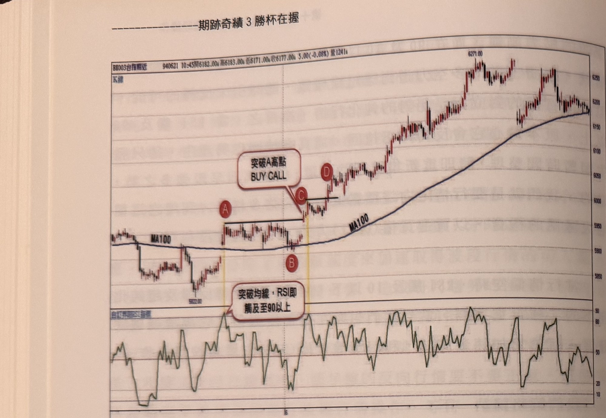

- **圖11-1**（p.248–249，台指期）：完整示範CALL訊號流程：行情由MA100下方反彈向上突破均線，於A形成峰位且RSI觸及90以上；B為拉回；C的K線收盤重新突破A高點，形成買進CALL訊號；D點再度突破C高（RSI亦觸90），為補進場點——若C未進場，最慢可在D補進場。

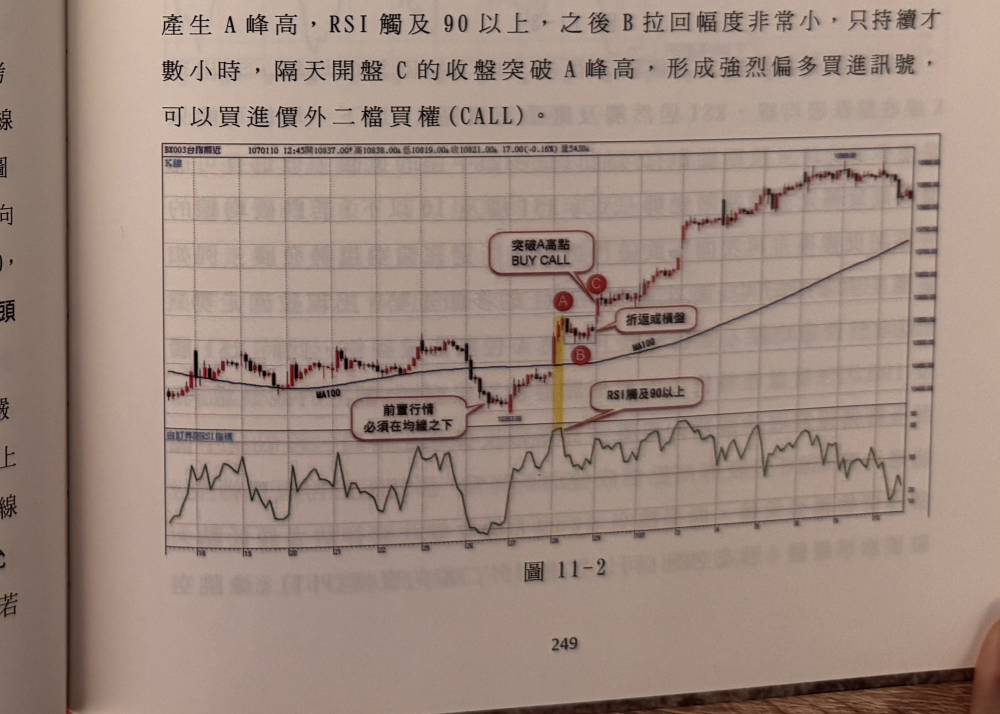

- **圖11-2**（p.249，台指期）：拉回時間短（僅數小時）的CALL案例：A為突破均線後之峰位（RSI觸90以上），B為短暫拉回，隔日C的收盤即突破A峰高，形成強烈偏多訊號，可買進價外二檔CALL。


- **圖11-3**（p.250，台指期）：PUT訊號流程示範：行情自MA100上方拉回跌破均線，於均線下方A處形成谷位，RSI觸及10以下；行情於均線橫盤整理2天後向下跳空，C的K線收盤跌破A最低點，形成放空訊號，可買進價外二檔PUT（如10400 PUT，因C收盤約在10650附近）。


- **圖11-4**（p.250–252，台指期）：示範「拉回時間過久、幅度過大應取消觀察」規則：A處突破均線且RSI觸90以上，但後續拉回逾10天且未再創高，低點B幾乎回到突破均線前最低谷點，不符合快速反轉意圖，該峰位應取消；後續C位置為谷點B突破均線之峰點（RSI亦觸90以上），因拉回不到一天、幅度約50點（相較A的150點回檔短且小），符合本法要求，在D突破C峰高點時形成有效偏多訊號，可買進價外二檔CALL。同案例亦提及B處RSI一度觸及10以下但因後續未跌破B谷低點，排除轉空疑慮。

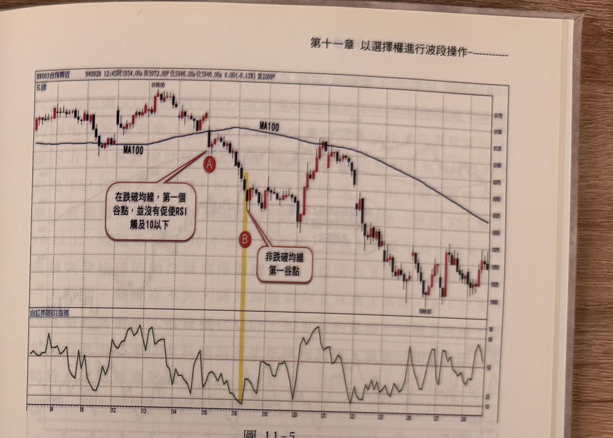

- **圖11-5**（p.253，台指期）：示範「第一谷點RSI未觸10以下不宜採用」規則：行情跌破均線後A為第一谷點，但RSI未觸及10以下，不能以A為依據操作PUT；直到B處RSI才觸及10以下，但B已非第一個谷點，若在B之後進場，後續行情需先拉升逾100點才再向下發展，不符合本法追求的快速波動特性。

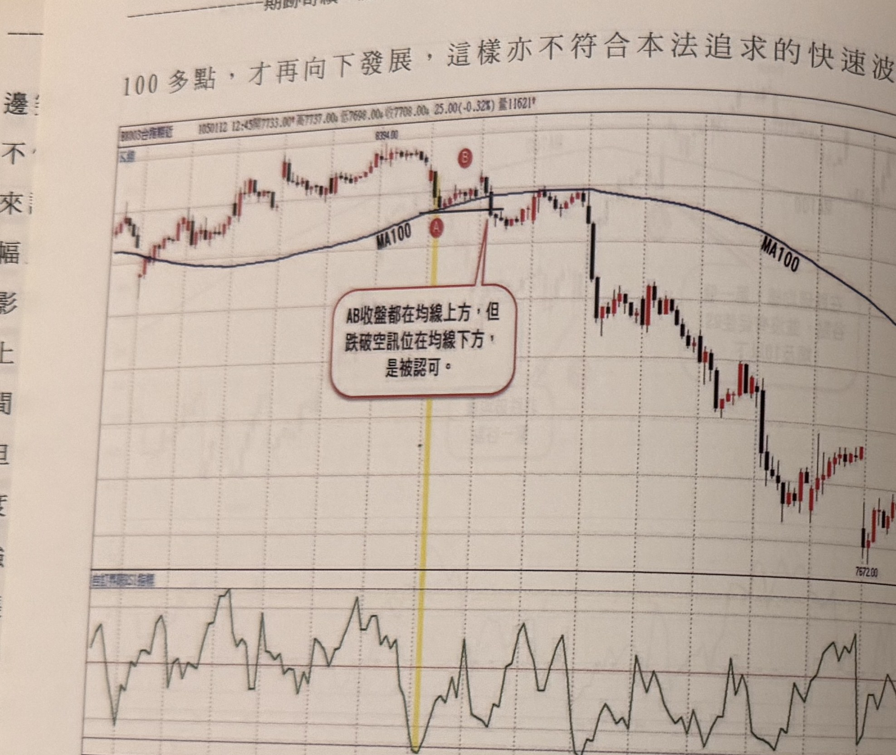

- **圖11-6**（p.254，台指期）：示範「卡在均線」PUT例外規則：行情自均線上方高點拉回，低點恰好卡在均線（收盤仍在均線上方），RSI同時觸及10以下，反彈持續不到一天即跌破A低點，此時K線收盤已位於均線下方，仍可接受為空訊，買進價外二檔PUT。

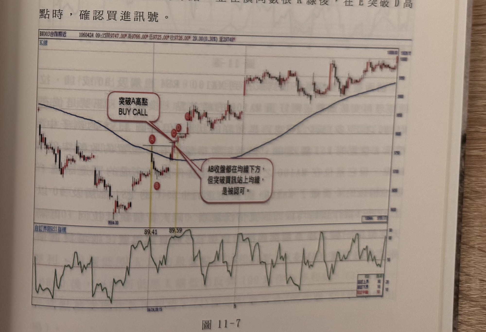

- **圖11-7**（p.254–255，台指期）：示範「卡在均線」CALL例外規則及RSI門檻放寬：行情原在均線下呈空頭，反彈時A的影線突破均線但收盤未站上（RSI高點89.41，距90不到1點，視為放寬達成），拉回B階段約1天、幅度不大，隔日C/D位置重新向上突破A高點（RSI達89.59，亦視為達成），形成買進CALL訊號。

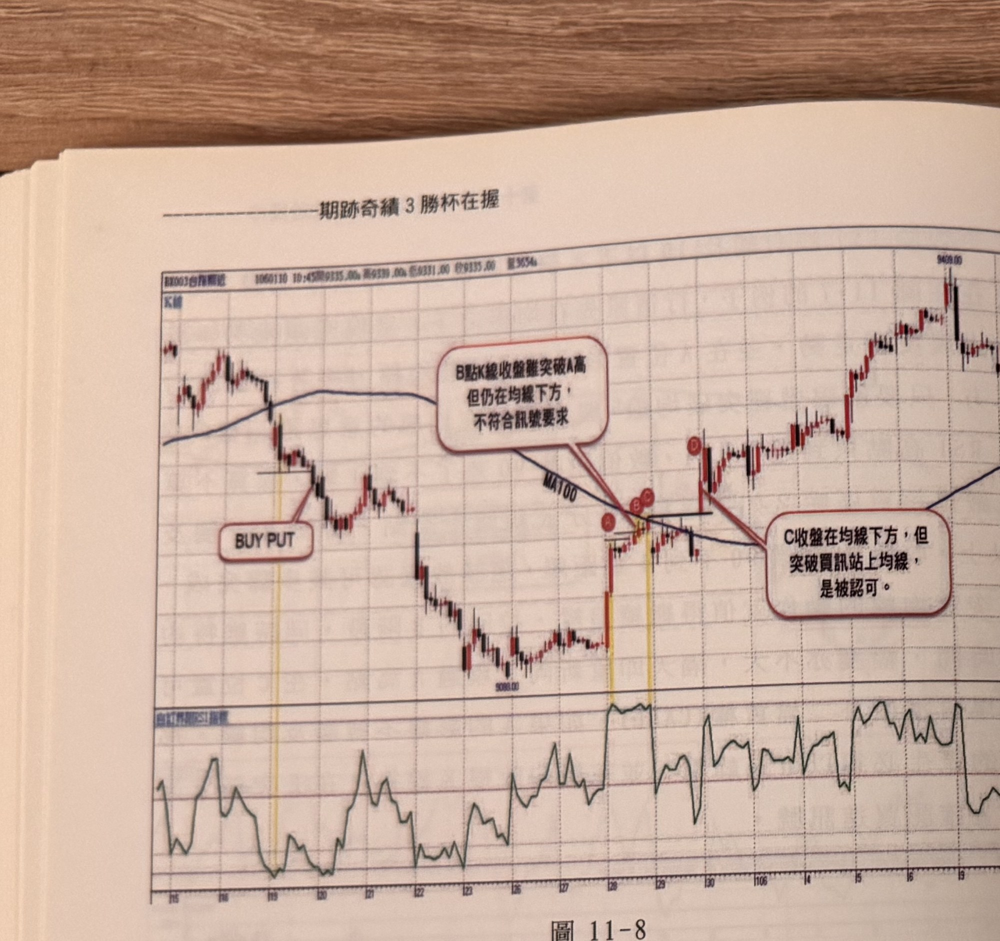

- **圖11-8**（p.256，台指期，日線）：示範「訊號K線須收盤站上/跌破均線」規則：A處RSI觸及90，短暫橫盤後B處收盤突破A峰點，但B仍位於MA100之下，不能視為完成步驟的買進訊號；C突破了MA100，且B、C的RSI皆觸及90以上，可視為「頂到均線」的放寬情況觀察；隔天行情跳低拉回，再隔天開盤第一根K線D突破前峰位C，才形成正式買進訊號，進場買進價外二檔CALL。示範訊號定義C6之新增條件（訊號K線須確實收在均線之上）。

  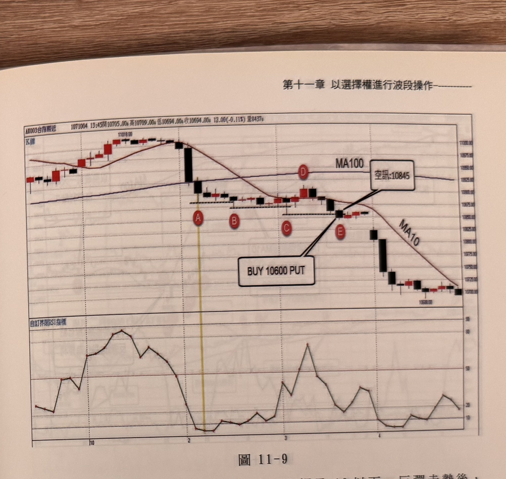

- **圖11-9**（p.257，台指期，日線）：PUT訊號流程：行情跌破MA100，RSI觸及10以下，反彈後再向下跌破創新低；為產生「無遮蔽空訊」，一直等到E位置（10845點）才符合條件形成空訊，買進價外二檔10600 PUT。此即圖11-10、圖11-11停利案例中所引用（原文「承接圖5-9的案例」）之訊號本身。示範訊號定義C1–C6（PUT情境）與「無遮蔽空訊」的等待邏輯。

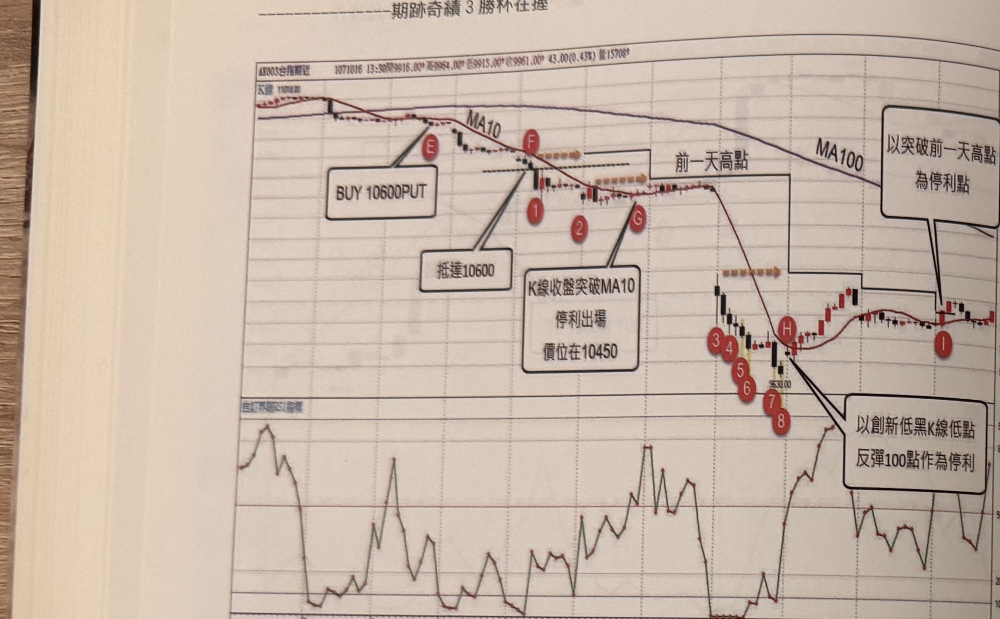

- **圖11-10**（p.258，台指期）：示範三種停利機制之比較（即圖11-9之E放空訊號案例的延伸）：E形成放空訊號（10845點）買進價外二檔10600 PUT；F位置抵達10600使部位轉為價平；若採MA10移動停利，於G位置K線收盤突破MA10停利，價位10450，獲利200點+時間價值；若採創新低黑K反彈100點停利，部位隨標示1至8逐步下移停利點，於H處（標示8低點反彈逾100點）停利，價位9730，獲利970點+剩餘時間價值；若採突破前一天高點停利，則在I位置突破前一天高點階梯線時才停利。

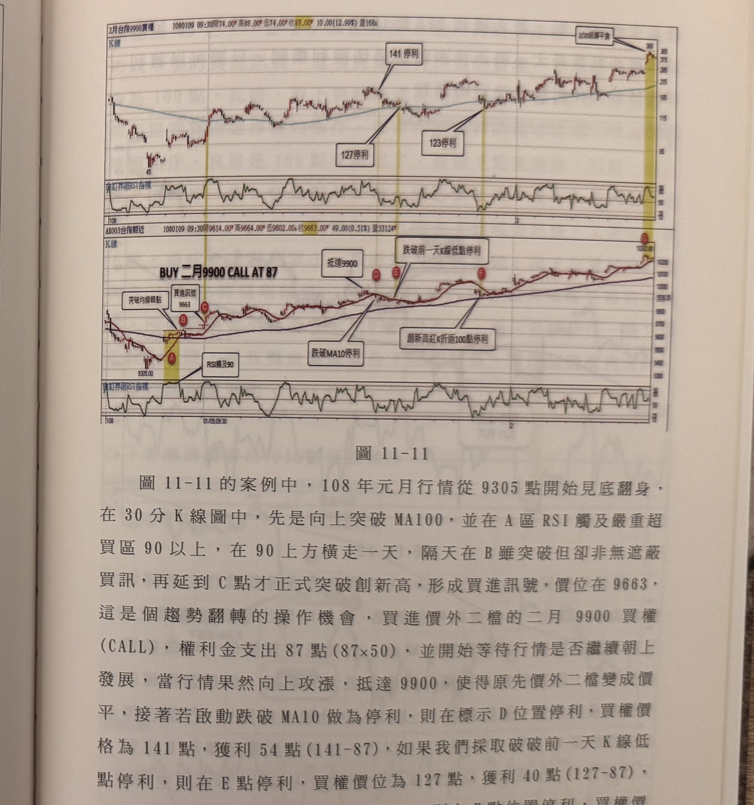

- **圖11-11**（p.258–259，台指期＋對應選擇權走勢）：完整買進CALL波段案例：行情自9305點反彈，A區RSI觸90以上並橫走一天，隔天B突破但非有效買訊，延至C點才正式突破創新高形成買進訊號（9663點），買進二月9900價外二檔CALL，權利金87點；行情上攻抵達9900使部位轉價平後，分別示範：跌破MA10於D停利（買權141點，獲利54點）；跌破前一天K線低點於E停利（買權127點，獲利40點）；創新高紅K折返100點於F停利（買權123點，獲利36點）；留倉至2/20結算平倉，最高來到360點，最大獲利273點。四種停利結果並列比較。

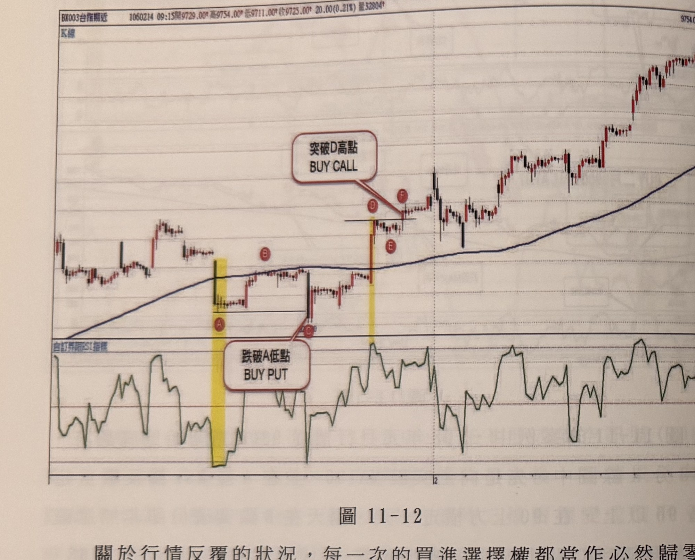

- **圖11-12**（p.260–261，台指期）：示範選擇權「對開不怕鎖單」的風險特性：A處跌破MA100且RSI觸10以下，反彈至B後再跌破，C位置K線收盤跌破A谷點形成放空訊號，買進價外二檔PUT（權利金假設100點）；隨後行情逆向反漲突破MA100，於D形成峰位且RSI觸90以上，小幅拉回至E後再突破D峰點，於F形成N型買進訊號，買進價外二檔CALL（權利金亦假設100點）；説明兩邊部位同時持有，不須為C的PUT停損，因選擇權買方最大風險僅權利金歸零，最終獲利的一邊足以彌補（甚至超過）另一邊的損失。

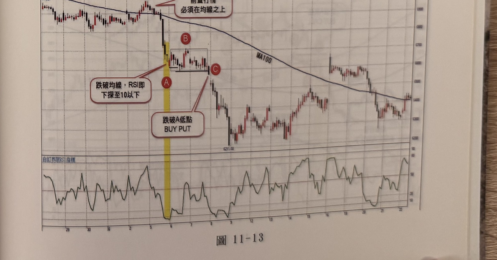

- **圖11-13**（p.261，台指期）：另一組PUT訊號示範：前置行情須在均線之上；行情急速下跌後跌破均線並於A處RSI下探至10以下，經B短暫反彈整理後於C位置的K線收盤跌破A低點，形成買進PUT訊號。

## 9. 作者提醒與常見錯誤

1. 波段操作必然留倉，過夜美股等消息面風險是期貨波段單最大的痛點；若無法接受可能高達上百點的停損，不如安於當沖角色（p.245）。
2. 選擇權買方讓交易者有更多的考慮時間，不會擴大虧損，在結算之前仍有起死回生機會，甚至承受得起市場「破底穿頭」或「穿頭破底」的驚險戲碼（p.245）。
3. 突破均線隨處可見，RSI觸及90也不罕見，突破當下無法確定真假，因此不急於立即進場，而是等待更多證據（RSI觸及90/10、拉回幅度與時間符合條件、重新突破峰谷位）支持後才進場（p.250）。
4. 為何不直接用期貨單操作同樣的邏輯？因為行情突破峰高後仍可能出現「雙折返」（來回洗盤）的狀況，用期貨單不易控制停損程度；改用選擇權則不必擔心拉回幅度，可增加持續觀察行情的勇氣（p.249）。
5. 每一次的買進選擇權都應視為「必然可能歸零」的機會成本，如同一次付清的停損點數，不宜像期貨部位一樣忌諱對開鎖單（p.260–261）。
6. 停利機制沒有絕對的最佳解，只要能夠獲利，都應該接受任何一種操作決定的過程（p.260）。
7. K線收盤突破峰位（或跌破谷位）水平線，只是完成濾網突破的步驟之一，訊號K線本身還須確實收在均線之上（CALL）或之下（PUT），否則即使技術上突破了峰谷位，也不能視為完成步驟的正式訊號，須耐心等到真正站上/跌破均線的那一根（p.256）。

## 10. 規則速查（Checklist）

- [ ] 以30分鐘K線觀察，MA100（或MA120/MA200等分多空均線）為多空分界
- [ ] 前置行情確實位於均線下方（CALL）或上方（PUT）
- [ ] 突破/跌破均線後出現有效峰位／谷位（須有黑K/紅K反轉拉回/反彈確認，且該處RSI觸及90以上／10以下）
- [ ] 拉回/反彈幅度不大、時間短（不逾約1天為佳，不可拖太久或幅度過大）
- [ ] 拉回不可跌破突破前起漲谷點（CALL）／反彈不可高於跌破前起跌峰點（PUT）
- [ ] 卡在均線的特例：收盤未過均線但RSI已觸及90/10（或極接近），拉回/反彈幅度小、時間短，之後跌破/突破時K線收盤已站上/跌破均線
- [ ] K線收盤突破峰位水平線（CALL）或跌破谷位水平線（PUT），且該K線本身已收盤站上/跌破MA100，確認進場訊號
- [ ] 買進價平或價外二檔的CALL／PUT，儘量以跨月OP操作
- [ ] 未進場於第一突破點，最慢於次一突破點補進場
- [ ] 選擇對應停利機制之一：MA10移動停利／創高低反彈折返100（或150）點停利／突破跌破前一天高低點停利／固定點數（比例）平倉；亦可選擇留倉至結算日平倉（非四機制之一，另一種持有方式）
- [ ] 不設另行停損，最大風險為已付權利金；可容許對開持倉，不須為原部位牽制新訊號

## 11. 機器可讀規則

```yaml
signal: 選擇權波段突破訊號
side: both
timeframe: 30m
ma_filter: MA100
conditions:
  - id: C1_CALL
    desc: 價格由MA100下方向上突破MA100
    source: p.247
  - id: C2_CALL
    desc: 突破後出現有效峰位（紅K遇黑K拉回不再創高，且最高紅K對應RSI>=90）
    source: p.253
  - id: C4_CALL
    desc: 拉回幅度小、時間短，且不跌破突破前起漲谷點（或卡在均線特例，RSI>=90或極接近）
    source: p.248, p.252, p.254-255
  - id: C6_CALL
    desc: K線收盤重新突破峰位水平線，且該K線本身收盤須已站上MA100（否則不算完成步驟的訊號，須等待真正站上均線的那一根）
    source: p.247, p.249, p.256
  - id: C1_PUT
    desc: 價格由MA100上方向下跌破MA100
    source: p.247
  - id: C2_PUT
    desc: 跌破後出現有效谷位（黑K遇紅K反彈不再創低，且最低黑K對應RSI<=10）
    source: p.253
  - id: C4_PUT
    desc: 反彈幅度小、時間短，且不高於跌破前起跌峰點（或卡在均線特例，RSI<=10）
    source: p.250, p.254（多空對稱）
  - id: C6_PUT
    desc: K線收盤重新跌破谷位水平線，且該K線本身收盤須已跌破MA100（多空對稱，鏡像C6_CALL）
    source: p.247, p.250-251, p.256（鏡像）
entry:
  call: 收盤突破峰位水平線時買進價平或價外二檔CALL，儘量跨月OP
  put: 收盤跌破谷位水平線時買進價平或價外二檔PUT，儘量跨月OP
  late_entry: 若首次突破/跌破未進場，最慢於次一突破/跌破點補進場
  source: p.247, p.249
stop_loss:
  desc: 選擇權買方不另設停損，最大風險為已付權利金；可容許對開持倉
  source: p.260-261
exit:
  method1: MA10移動停利（價外轉價平後，收盤跌破/突破MA10出場）
  method2: 創新低/新高K線折返100（或150）點停利
  method3: 突破/跌破前一天K線高/低點停利
  method4: 固定點數平倉（書中舉例賺50%或100%出場，未定量化固定門檻）
  extra_note: 留倉至結算日平倉非上述四機制之一，為圖11-11案例額外示範的持有方式，該例中可能獲最大利潤但非公認最佳解
  note: 書中未規定四機制之優先順序，並列供選擇
  source: p.257-260
filters:
  - desc: 第一谷點/峰點RSI未觸10/90不宜採用，須待真正觸及處，且不可延遲過久造成波動不夠快速
    source: p.253-254
  - desc: 拉回/反彈時間過久、幅度過大（如逾10天、拉回近起漲點）不符合快速反轉意圖，取消觀察
    source: p.251-252
  - desc: 拉回不可低於突破前起漲谷點/反彈不可高於跌破前起跌峰點
    source: p.252
  - desc: 卡在均線特例須RSI觸及90/10或極接近（如89.41内），否則不成立
    source: p.254-255
  - desc: K線收盤突破/跌破峰谷位水平線時若本身仍在MA100之下/之上，不算完成步驟的訊號，須待真正收盤站上/跌破均線的那一根
    source: p.256
```

## 12. 待確認事項

無。p.256–257 已補拍併入：補上圖11-8（訊號K線須確實站上/跌破均線的規則）、圖11-9（PUT訊號範例，即原「承接圖5-9」引用的圖11-10、11-11案例本身），並依原文修正出場/停利第4種機制（原誤植為「留倉至結算日平倉」，原文實為「固定點數平倉」，「留倉至結算」改列為案例額外示範的持有方式）。缺頁僅剩範例圖，見 frontmatter `missing_pages`（現為空）。

## 13. 原文出處

- `extracted/pages/IMG_8447.md`（p.244–245）
- `extracted/pages/IMG_8448.md`（p.246–247）
- `extracted/pages/IMG_8449.md`（p.248–249）
- `extracted/pages/IMG_8450.md`（p.250–251）
- `extracted/pages/IMG_8451.md`（p.252–253）
- `extracted/pages/IMG_8452.md`（p.254–255）
- `extracted/pages/IMG_8453.md`（p.256–257）
- `extracted/pages/IMG_8454.md`（p.258–259）
- `extracted/pages/IMG_8455.md`（p.260–261）
