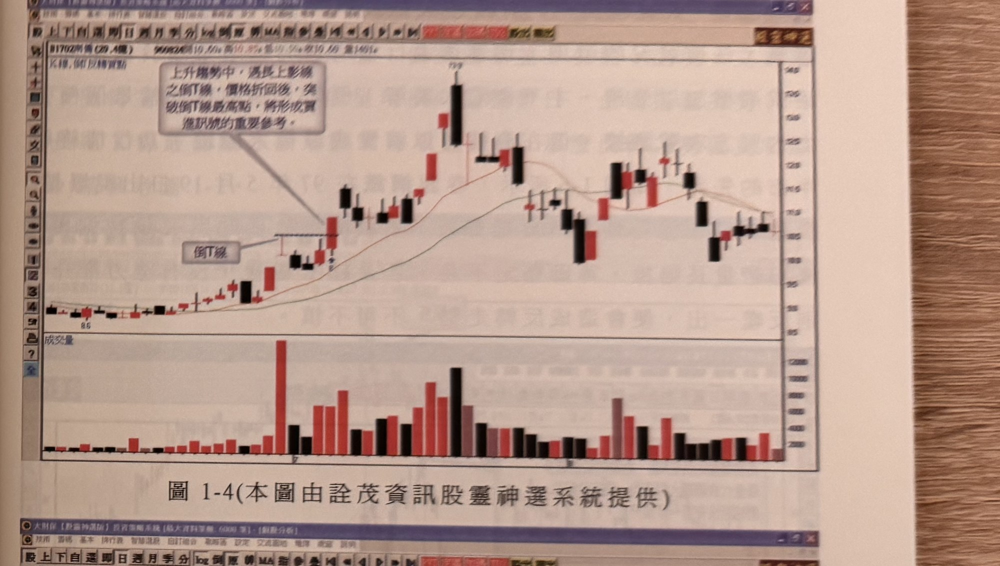
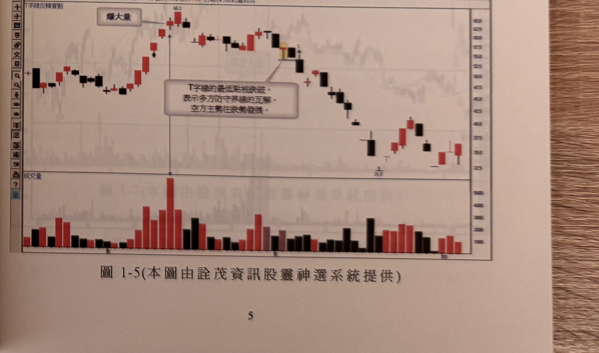

# 倒T線反轉（買進）／T字線反轉（賣出）

> 一句話摘要：上升趨勢中，倒T線（帶長上影線、無下影線）折返後被K線收盤突破其最高點，是買進訊號；上升爆量後出現T字線（帶長下影線、無上影線），其最低點被K線收盤跌破，是賣出訊號。

## 1. 核心概念

- 「轉變線」是開盤收盤同價（十字線）的延伸型態：帶長上影線、無下影線者稱「倒T線」；帶長下影線、無上影線者稱「T字線」（p.1，圖1-1，見 gq-01-01 核心概念）。
- 倒T線與T字線代表當日多空拉鋸後方向未定、留下極長的單邊影線，是行情轉折的重要觀察點。書中在本節僅各舉一例說明其反轉意義：倒T線做為上升趨勢中的加碼買進參考，T字線做為上升爆量後的賣出警訊（p.4–5）。

## 2. 適用前提

- 倒T線：須出現在**上升趨勢**過程中（p.5，圖1-4圖說）。
- T字線：須出現在**上升的漲勢爆量之後**（p.5）；圖1-5範例中 T 字線本身即為全圖最大成交量所在（p.5，圖1-5圖說）。

## 3. 訊號定義

### 3.1 倒T線（多方，買進參考）

1. C1：行情處於上升趨勢中。
2. C2：出現一根倒T線（長上影線、無下影線）。
3. C3：價格折回（拉回整理）後，後續某根 K 線**收盤突破**該倒T線的最高點（p.5，圖1-4圖說：「上升趨勢中，遇長上影線之倒T線，價格折回後，突破倒T線最高點，將形成買進訊號的重要參考。」）。

### 3.2 T字線（空方，賣出訊號）

1. C1'：行情處於上升的漲勢中，且已出現**爆量**（成交量明顯放大，書中範例為全圖最大量）（p.5）。
2. C2'：出現一根T字線（長下影線、無上影線）。
3. C3'：後續某根 K 線**收盤跌破**該T字線的最低點（p.5：「當上升的漲勢爆量後，出現轉變線的最低點被跌破將形成一個賣出訊號」；圖1-5圖說：「T字線的最低點被跌破，表示多方防守界線的瓦解，空方主勢往跌勢發展。」）。

## 4. 進場

- 倒T線（多）：C3 成立（K線收盤突破倒T線最高點）之當根 K 線收盤價進場做多（p.5，圖1-4）。
- T字線（空）：C3' 成立（K線收盤跌破T字線最低點）之當根 K 線收盤價進場做空（p.5，圖1-5）。
- 原文未提供補進場、等待拉回等細節規則。

## 5. 停損

原文未規定明確的停損點位或點數。（推論：倒T線之停損可能以倒T線最低點為參考，T字線之停損可能以T字線最高點為參考，但書中本節未明文列出，不予採用未經原文證實的數值。）

## 6. 出場 / 停利

書中未明確說明。範例圖1-4顯示倒T線買進訊號後行情持續上攻一段時間，圖1-5顯示T字線賣出訊號後行情持續破底下探，但原文未附具體停利／出場規則。

## 7. 過濾：不做的情況

1. T字線訊號須發生在「上升的漲勢**爆量**之後」，未爆量者原文未說明是否適用，不予推論擴大（p.5）。
2. 倒T線訊號須發生在**上升趨勢**中，原文未提及其他位階（如下跌趨勢或盤整區）出現倒T線的意義。

## 8. 範例解析

- **圖1-4**（p.5，明泰個股日線圖）：左下方一根帶長上影線的紅K線標示為「倒T線」，其最低點另以虛線標示；隨後行情持續上攻，中段出現長黑帶長上下影線K線（高點73.9），隨後高檔區數根紅黑夾雜K線，成交量於倒T線出現後不久爆出全圖最大量，行情其後反轉走低（反轉走低發生在圖右側更高的位置，不影響本範例所示倒T線最高點被突破形成買進訊號的定義）。

  

- **圖1-5**（p.5，達方個股日線圖）：行情自低檔上攻，中途出現帶長下影線的T字線並在此爆出全圖最大成交量，股價續攻至最高點66.2後於高檔呈現紅黑夾雜K線；圖說標示「T字線的最低點被跌破，表示多方防守界線的瓦解，空方主勢往跌勢發展」，其後行情反轉一路走跌，中途小幅反彈後再破底。

  

## 9. 作者提醒與常見錯誤

原文本節未提供額外提醒文字。

## 10. 規則速查（Checklist）

- [ ] 倒T線：上升趨勢中出現長上影線倒T線
- [ ] 倒T線：價格折回後，K線收盤突破倒T線最高點 → 買進
- [ ] T字線：上升漲勢已爆量
- [ ] T字線：出現長下影線T字線
- [ ] T字線：K線收盤跌破T字線最低點 → 賣出

## 11. 機器可讀規則

```yaml
signal: 轉變線反轉（倒T線/T字線）
side: both
timeframe: 1d
conditions:
  - id: C1_long
    desc: 上升趨勢中出現倒T線（長上影線、無下影線）
    source: p.5
  - id: C2_long
    desc: 價格折回後，K線收盤突破倒T線最高點
    source: p.5
  - id: C1_short
    desc: 上升漲勢已爆量
    source: p.5
  - id: C2_short
    desc: 出現T字線（長下影線、無上影線），其後K線收盤跌破T字線最低點
    source: p.5
entry:
  long: K線收盤突破倒T線最高點
  short: K線收盤跌破T字線最低點
  source: p.5
stop_loss: 原文未規定
exit: 書中未明確說明
filters:
  - desc: T字線訊號須發生於上升漲勢已爆量之後
    source: p.5
  - desc: 倒T線訊號須發生於上升趨勢中
    source: p.5
```

## 12. 待確認事項

1. 本節「倒T線」的買進規則，僅見於圖1-4圖面上的印刷文字框（原書圖表本身的隨圖說明），內文段落中未見對應的獨立敘述句；經比對前後文（p.4末段仍在討論前一主題「三峰」、p.5正文開頭即轉為T字線的說明），判斷此為原書排版將部分文字直接印在圖上、而非另立段落之寫法，非缺頁或轉錄遺漏，倒T線規則予以採用。
2. 停損、出場/停利原文均未提供，已依規定寫明「原文未規定／書中未明確說明」，未自行補充數值。

## 13. 原文出處

- `extracted/pages/IMG_8579.md`（p.4–5）
