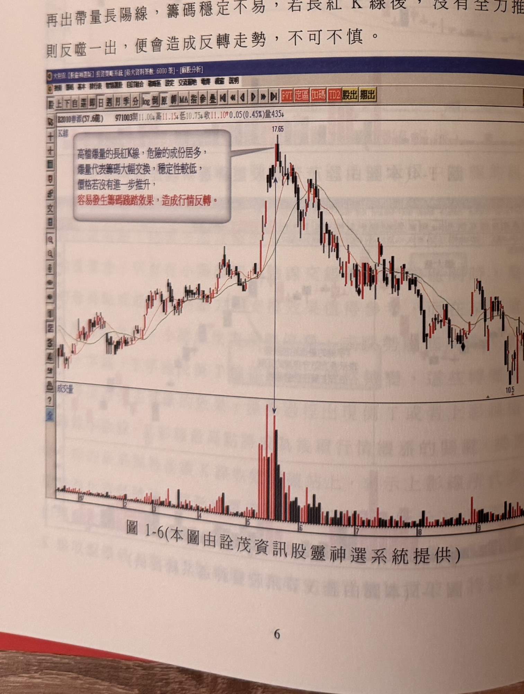
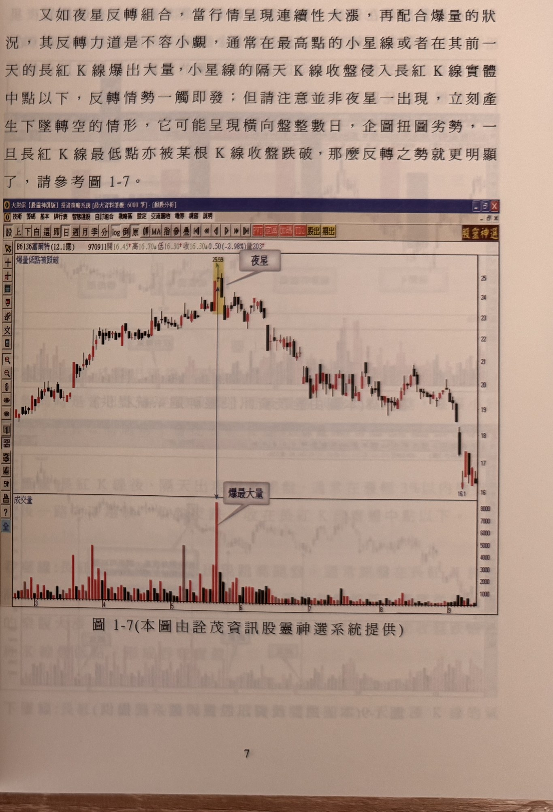
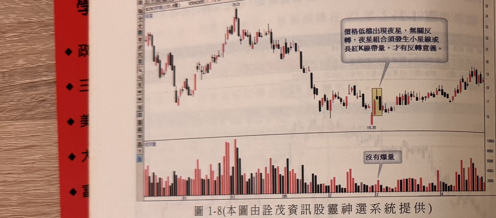
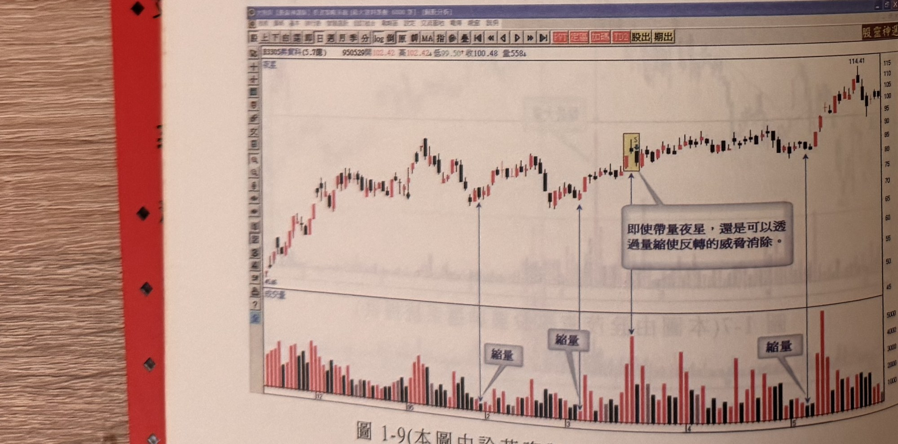

# 夜星反轉

> 一句話摘要：連續大漲後在高檔出現帶爆量的小星線（夜星），隔日K線收盤侵入前一根長紅K線實體中點以下即為反轉警訊，之後若長紅K線最低點再被收盤跌破，反轉更加確認；低檔夜星或無爆量的夜星則不具反轉意義，爆量後若成交量迅速萎縮且均線未走緩，反轉危機也可能化解。

## 1. 核心概念

- 夜星反轉組合出現在行情連續性大漲、且配合爆量的狀況下，反轉力道不容小覷（p.6）。
- 通常在波段最高點出現一根小星線，且小星線本身或其前一天的長紅K線爆出大量（p.6）。
- 夜星出現不代表立刻反轉：行情可能先橫向盤整數日、企圖扭轉劣勢，須待長紅K線最低點被收盤跌破，反轉之勢才更加明顯（p.6）。
- 高檔大陽線／爆量的普遍警訊：行情高角度推升後爆出長紅K線大量，若未能全力再推升，反噬一出便會造成反轉走勢（p.6，圖1-6，春源鋼鐵示例；此為高檔爆量長紅K線的一般性警示，與夜星組合的反轉邏輯相通）。

## 2. 適用前提

- 須發生在**連續性大漲**之後的相對高檔位置（p.6）。
- 出現在**低檔**的夜星，與反轉向下的判斷無關（p.8）。
- 須有**爆量**配合（小星線本身或其前一天的長紅K線爆出大量）；沒有爆量的夜星組合，往往不具反轉力道（p.6、p.8）。

## 3. 訊號定義（空方）

1. C1：行情處於連續性大漲之後的相對高檔位置。
2. C2：波段最高點附近出現一根小星線（夜星），且小星線本身或其前一天的長紅K線帶量（爆量）（p.6）。
3. C3：小星線隔天的 K 線**收盤**侵入前一根長紅K線實體中點以下 → 初步反轉警訊觸發（p.6：「反轉情勢一觸即發」）。
4. C4（加強確認，可能延後數日成立）：後續某根 K 線**收盤跌破**該長紅K線的最低點 → 反轉之勢更明顯（p.6）。

## 4. 進場

- 以 C3 成立之當根 K 線收盤價視為初步反轉訊號觸發點，可開始留意放空（p.6）。
- 若 C3 觸發後行情先橫向盤整數日，可待 C4（長紅K線最低點被收盤跌破）成立時再確認進場（p.6）。原文未明確區分「C3進場」與「C4進場」何者為正式進場點，兩者皆為原文列出的反轉確認層級（推論：C3為初步訊號、C4為加強確認）。

## 5. 停損

原文未規定明確停損點位或點數。

## 6. 出場 / 停利

書中未明確說明。惟原文提到：即使是爆量的夜星，只要後續成交量急速萎縮、且均線沒有走緩（未轉為下彎），仍可化解反轉的危機（p.8，圖1-9）。此屬**訊號是否成立的過濾條件**，原文並未將其明確定義為「已進場部位的出場規則」，故不列入停利/出場，僅在第9節提醒中說明。

## 7. 過濾：不做的情況

1. 夜星出現在**低檔**：與反轉向下無關，不做為賣出訊號（p.8，圖1-8）。
2. 夜星組合**沒有爆量**：往往不具反轉力道（p.6、p.8，圖1-8）。
3. 即使爆量的夜星，若後續成交量**急速萎縮**、且均線**未走緩**，反轉危機可被化解（p.8，圖1-9：乘寶科例，夜星後量縮，行情持續創高，未反轉）。

## 8. 範例解析

- **圖1-6**（p.6，春源鋼鐵個股日線圖）：97年5月19日出現爆量牛市先兆長紅K線，高角度推升後數根開高收低黑K拉鋸，再出帶量長陽線；圖說標示「高檔爆量的長紅K線，危險的成份居多」，行情自高點17.65反轉一路走跌，示範高檔爆量長紅K線未能延續推升即反噬的一般性警訊。

  

- **圖1-7**（p.7，富爾特個股日線圖）：行情上攻至最高點25.59附近出現帶爆量的小星線（夜星），其後行情先橫向震盪數日，隨後一路反轉走跌，最低跌至16.1附近，示範C3觸發後盤整、再由C4（長紅K線最低點被跌破）確認反轉之勢明顯的完整過程。

  

- **圖1-8**（p.8，好孩子個股日線圖）：行情自高點25.23逐波下跌，中段整理區出現一根小星線（夜星），但**沒有爆量**，其後行情回升至高點約19，示範「低檔（此處為中段整理）且無爆量的夜星不具反轉意義」。

  

- **圖1-9**（p.9，乘寶科個股日線圖）：行情持續上攻，中段相對高檔出現帶爆量的小星線（夜星），但其後成交量急速萎縮（圖上三處標示「縮量」），行情持續未再放大量能，最終續創高點114.41，示範「即使帶量夜星，仍可透過量縮使反轉威脅消除」。

  

## 9. 作者提醒與常見錯誤

- 大陽線在低檔是強力買方攻擊的證據，但在高檔可能演變成「最後大陽線」，代表行情終結，須視位階分辨，不可一概而論（p.6）。
- 即使夜星訊號的初步警訊（C3）已觸發，仍須觀察後續成交量是否急速萎縮、均線是否走緩，作為是否採信反轉的過濾依據，而非夜星一出現就必然反轉（p.8）。

## 10. 規則速查（Checklist）

- [ ] 行情處於連續性大漲後的相對高檔
- [ ] 波段最高點附近出現小星線，且小星線本身或前一根長紅K線帶爆量
- [ ] 隔天K線收盤侵入長紅K線實體中點以下（C3，初步訊號）
- [ ] 後續K線收盤跌破長紅K線最低點（C4，加強確認）
- [ ] 過濾：低檔夜星不做訊號
- [ ] 過濾：無爆量夜星不做訊號
- [ ] 過濾：爆量夜星後若量急縮且均線未走緩，反轉危機可能化解

## 11. 機器可讀規則

```yaml
signal: 夜星反轉
side: short
timeframe: 1d
conditions:
  - id: C1
    desc: 行情處於連續性大漲之後的相對高檔位置
    source: p.6
  - id: C2
    desc: 波段最高點附近出現小星線（夜星），且小星線本身或前一天長紅K線帶爆量
    source: p.6
  - id: C3
    desc: 小星線隔天K線收盤侵入前一根長紅K線實體中點以下
    source: p.6
  - id: C4
    desc: 後續K線收盤跌破該長紅K線最低點（加強確認，可能延後數日）
    source: p.6
entry:
  trigger: C3成立當根K線收盤（初步訊號），或待C4成立再確認（原文未明確二擇一）
  source: p.6
stop_loss: 原文未規定
exit: 書中未明確說明
filters:
  - desc: 夜星出現於低檔，不做反轉判斷
    source: p.8
  - desc: 夜星組合無爆量，不具反轉力道
    source: p.6, p.8
  - desc: 爆量夜星後若成交量急速萎縮且均線未走緩，反轉危機可被化解
    source: p.8
```

## 12. 待確認事項

1. 原文對於「進場點」究竟是 C3（初步訊號觸發）或 C4（長紅K線最低點被跌破的加強確認）沒有明確二擇一的規定，本文件將兩者皆列出並標註推論性質的排序，未自行武斷選定其一。
2. 停損、出場/停利，原文均未提供具體規則，已依規定寫明「原文未規定／書中未明確說明」。

## 13. 原文出處

- `extracted/pages/IMG_8581.md`（p.6–7）
- `extracted/pages/IMG_8582.md`（p.8–9）
