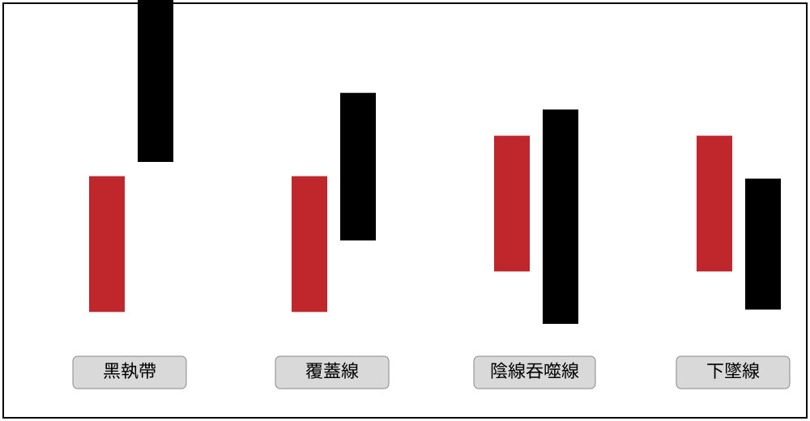

# 執帶反轉（黑執帶／會合線）與反軋買點

> 一句話摘要：高檔連續性上漲且爆大量時，出現「開盤即最高、收在最低點」的黑執帶K線，一旦其對應長紅K線的最低點被後續K線收盤跌破，多單須出場；但若黑執帶K線的最高點反而被後續K線收盤突破，則形成「反軋買點」，可用突破K線最低點做停損進場做多。

## 1. 核心概念

- 高檔反轉K線組合中較常出現的四種模式為：黑執帶、覆蓋線、陰線吞噬線、下墜線（p.9，圖1-9b示意圖），本檔說明其中的「執帶」（黑執帶／會合線）。
- **黑執帶定義**：長紅K線出現後，隔日跳空開高開盤（通常超過5%），開盤同時是當日K線的最高價，而後價格走低、以最低點收盤，漲幅（相對前一日收盤）小於1.5%，但收盤通常不會比長紅K線收盤低（p.9）。
- **會合線**：執帶K線若收盤與前一根長紅K線收盤同價，則形成「會合線」——兩根K線一紅一黑但收盤同價，是執帶的延伸型態（p.14，圖1-14）。
- 反轉K線在高檔大部份呈現爆量狀態；若長紅K線的「真實低點」（取其最低點與前一天K線收盤孰低）被跌破，是持多部位出場的訊號（p.10）。
- **反軋買點的通用邏輯**：任一反轉組合的最高點，若被後續行情以K線**收盤**突破，可化解頭部疑慮，形成一個反向的買進訊號，稱為「反軋買點」；但突破K線本身不宜再出現突破逆轉的現象（p.10–11）。
- 反轉K線組合出現時不代表必然反轉：需視位階分辨。在上漲趨勢的初期或中途出現反轉K線，若均線仍呈多頭排列、未跌破停損位置或階梯出場線，不必急於出脫（p.13–14）。

## 2. 適用前提

- 須發生在個股**高角度攻漲**、尤其是**連續性漲停**方式上漲的過程中，注意價格慣性中斷的現象（p.11）。
- 執帶須配合**爆大量**才具反轉意涵；沒有大量配合，無法篤定市場籌碼失控，不能單以K線論斷反轉（p.14）。

## 3. 訊號定義

### 3.1 黑執帶（反轉確認，多單出場／空方參考）

1. C1：前一日為長紅K線，且行情處於連續性上漲（尤其連續漲停）中。
2. C2：隔日跳空開高開盤，通常漲幅超過 **5%**，且開盤價即為當日K線的最高價。
3. C3：之後價格走低，以當日最低點收盤。
4. C4：當日收盤相對前一日收盤漲幅**小於1.5%**，但收盤通常**不低於**前一日（長紅K線）收盤（p.9）——即黑執帶K線構成。
5. C5（過濾）：須配合**爆大量**，才視為有效的反轉組合（p.14）。
6. C6（反轉確認）：後續某根K線**收盤跌破**該長紅K線的最低點（或其「真實低點」：取最低點與前一日收盤孰低）→ 反轉確認（p.10、p.12）。

### 3.2 反軋買點（多方，新倉進場）

1. Cr1：黑執帶K線已出現。
2. Cr2：後續某根K線**收盤突破**黑執帶K線的最高點（即其跳空開盤價，因開盤＝當日最高）→ 形成反軋買點（p.12）。

## 4. 進場

- **多單出場**：C6 成立（長紅K線最低點被收盤跌破）之當根K線收盤，既有多頭部位必須出場，原文明言「持多部位是必走不疑」（p.12）。
- **放空新倉**：原文未明確以「放空進場」字句指示新開空單；圖1-11、圖1-12、圖1-13等範例圖上雖以「空」字標示相關點位，但內文論述的重心在於「多單出場」與後續「反軋買點」，本節未見對「新開空單」的具體進場規則。視為**原文未規定**新倉放空的明確進場條件。
- **反軋買點（多方新倉）**：Cr2 成立之當根K線**收盤**進場做多（p.12，圖1-12：「如標示2位置K線收盤突破了標示1最高點，反而值得追進，稱為反軋買點」）。

## 5. 停損

- **反軋買點多單**：以突破訊號K線（即Cr2成立之當根K線）的**最低點**做為停損位置（p.12：「操作者可以標示2之K線最低點做為停損位置」）。
- 黑執帶反轉確認（多單出場／空方參考）本身未附獨立的停損點位或點數規則，原文未規定。

## 6. 出場 / 停利

- **反軋買點多單**：原文未給出固定停利目標或明確出場規則；範例顯示直到再度出現「開高收低且爆超大量」的另一組反轉K線時，行情才正式反轉朝跌勢發展（p.12，圖1-12標示3），可視為反軋買點多單的參考出場時機，但原文並未將其定義為量化規則。
- 黑執帶反轉確認（既有多單出場）本身即是出場動作，無另外的停利規則。

## 7. 過濾：不做的情況

1. 執帶若**沒有大量配合**，無法篤定市場籌碼失控，不能以反轉視之，不做訊號（p.14）。
2. 反轉K線組合出現在上漲趨勢的**初期或中途**，若均線仍呈多頭排列、且沒有跌破停損位置或階梯出場線，不必急於出脫持股（p.13–14）。
3. 反軋買點成立後，若突破K線本身再出現「突破逆轉」（即突破後又快速跌回），該反軋買點訊號的可靠度即打折扣（p.10–11，通用原則；本節未見執帶本身的突破逆轉案例，見 gq-01-06 吞噬線的對照說明）。

## 8. 範例解析

- **圖1-9b**（p.9，示意圖）：黑執帶／覆蓋線／陰線吞噬線／下墜線四種高檔反轉K線組合的形態示意——黑執帶為紅棒與黑棒間有小缺口幾乎不重疊；覆蓋線為黑棒覆蓋紅棒實體逾半；陰線吞噬線為黑棒完全吞噬紅棒實體；下墜線為黑棒與紅棒中段重疊但位置較低。

  

- **圖1-10**（p.10–11，新建2516日線圖）：97年3月底爆量（標示1），標示2位置出現下墜線反轉組合但未立即大幅回檔，成交量急速萎縮後，四月中旬（標示3）再現覆蓋線反轉組合，量未較標示1擴增，同樣未大幅回檔；直到標示4位置的反轉才確認回檔加深。示範高檔反轉組合不一定立刻使多頭崩解，但警訊須提高警覺。

  

- **圖1-11**（p.11，台榮日線圖）：96年4月出現爆衝走勢，標示①開超高盤但無法延續前三天鎖漲停的慣性，一旦殺破平盤並爆大量，籌碼逃竄造成反轉效應；標示②為另一次同型態的高角度仰攻後反轉。

  

- **圖1-12**（p.12，永光1711日線圖）：96年7月標示1位置出現黑執帶且爆大量；但黑執帶最高點被標示2的K線收盤突破，形成反軋買點，可以標示2之K線最低點做停損；直到標示3位置出現開高收低且爆超大量的K線，行情才正式反轉朝跌勢發展。

  

- **圖1-13**（p.13，地球1324日線圖）：黑執帶反軋買點的另一操作範例，反軋型態在同一走勢中再次發生（標示①②③④）。

  

- **圖1-14**（p.14，東貝2499日線圖）：執帶K線收盤與前一根長紅K線收盤同價，形成「會合線」，為執帶的延伸型態；圖上標示「執帶反轉」、「爆量低點被跌破」，行情其後持續下跌。

  

- **圖1-15**（p.15，希華2484日線圖）：執帶反轉配合爆量低點被跌破的另一範例，行情反轉後下跌一段，中途橫向整理反彈，其後再度走弱。

  

- **圖1-16**（p.15，揚明光3504日線圖）：執帶反轉搭配爆最大量的範例，圖說標示「爆最大量，反轉能量越大」，反轉後行情一路走跌。

  

- **圖1-17**（p.16，福壽1219日線圖）：執帶反轉搭配陡峭仰攻角度、爆大量的另一範例，行情觸頂後小幅拉回整理。

  

## 9. 作者提醒與常見錯誤

- 黑執帶最常出現在超飆個股狂飆的尾聲，做為「謝幕演出」，不可不慎；但黑執帶本身在不同位階不能完全以反轉視之，沒有大量配合就不能篤定籌碼失控（p.14）。
- 潛在的頭部徵兆，在過其高點後（反軋買點），可能又是另一段漲勢的發動起點：條件確認時應出脫／放空，若行情逆轉時也應及時反應追買，不能執著教條而不知應變（p.13）。

## 10. 規則速查（Checklist）

- [ ] 前一日長紅K線，行情處於連續性上漲（尤其連續漲停）
- [ ] 隔日跳空開高（通常>5%），開盤即當日最高價
- [ ] 之後走低，以最低點收盤，漲幅<1.5%但收盤通常不低於前一日收盤
- [ ] 須配合爆大量才視為有效訊號
- [ ] 反轉確認：後續K線收盤跌破長紅K線最低點 → 多單出場
- [ ] 反軋買點：後續K線收盤突破黑執帶最高點 → 做多，停損＝突破K線最低點

## 11. 機器可讀規則

```yaml
signal: 執帶反轉（黑執帶）
side: both
timeframe: 1d
conditions:
  - id: C1
    desc: 前一日長紅K線，行情連續性上漲/連續漲停
    source: p.9, p.11
  - id: C2
    desc: 隔日跳空開高開盤(通常>5%)，開盤即當日最高價
    source: p.9
  - id: C3
    desc: 之後走低，以最低點收盤
    source: p.9
  - id: C4
    desc: 當日收盤相對前一日漲幅<1.5%，但通常不低於前一日收盤
    source: p.9
  - id: C5_filter
    desc: 須配合爆大量
    source: p.14
  - id: C6_confirm
    desc: 後續K線收盤跌破長紅K線最低點(或真實低點：最低點與前一日收盤孰低)
    source: p.10, p.12
entry:
  exit_long: C6成立時出場既有多單
  short_new: 原文未規定明確放空進場條件
  counter_buy:
    desc: 後續K線收盤突破黑執帶最高點，形成反軋買點，進場做多
    source: p.12
stop_loss:
  counter_buy: { ref: "突破訊號K線最低點", source: "p.12" }
  short_or_exit: 原文未規定
exit:
  counter_buy: 原文未給固定停利，範例以再次出現爆超大量的反轉K線組合為後續轉空參考
  source: p.12
filters:
  - desc: 執帶未配合爆大量，不能視為反轉，不做訊號
    source: p.14
  - desc: 上漲趨勢初期或中途，若均線仍多頭排列且未跌破停損/階梯出場線，不必急於出脫
    source: p.13-14
```

## 12. 待確認事項

1. 圖1-11至圖1-17多張範例圖左上角均印有「白執帶反轉點」字樣，但內文段落與圖1-9b定義均稱此高檔反轉型態為「黑執帶」；經比對圖說內容（皆描述長紅K線後跳空高開走低反轉），判斷「白執帶反轉點」為原書軟體標籤習慣用語（可能是製圖系統的固定標籤名稱），與內文「黑執帶」實質上指涉同一型態，非另一種型態，亦非轉錄錯誤，予以並列說明但不另立規則。
2. 原文對於本組合是否可做為「新開放空部位」的明確進場訊號，未使用「放空進場」等直接字句（僅明確指示既有多單須出場），與後述吞噬線一節「宜掌握賣點，準備伺機放空」（見 gq-01-06）的明確表述不同，已在第4節註明為原文未規定。

## 13. 原文出處

- `extracted/pages/IMG_8582.md`（p.8–9）
- `extracted/pages/IMG_8583.md`（p.10–11）
- `extracted/pages/IMG_8584.md`（p.12–13）
- `extracted/pages/IMG_8585.md`（p.14–15）
- `extracted/pages/IMG_8586.md`（p.16，執帶部分：圖1-17）
