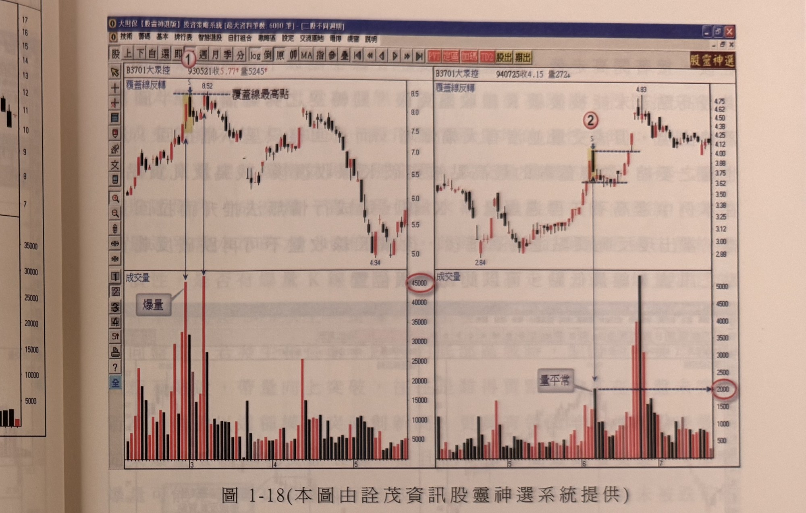

# 覆蓋線反轉與反軋買點

> 一句話摘要：長紅K線後隔日跳高開盤（通常漲幅3%以內）卻一路走低、收盤跌破長紅K線實體中點以下即構成覆蓋線，若其最高點遲遲未被K線收盤克服則轉空之勢難擋；但覆蓋線最高點一旦被後續K線收盤突破，即形成反軋買點，以突破K線最低點做停損進場做多。

## 1. 核心概念

- 高檔反轉K線組合中，覆蓋線出現的比例最高（p.16）。
- **覆蓋線定義**：長紅K線出現後，隔天跳高開盤（通常漲幅3%以內），而後一路向下趨軟，收盤反跌，收在長紅K線實體中點以下（p.9）。
- 行情漸漸抵達高檔區域，成交量不斷增溫放大，市況樂觀而交投熱絡；爆量代表籌碼面交換的快速與激烈，若籌碼落入散戶手中而非主力／大股東／法人，一旦主力無心續作，籌碼砍出效應如滾雪球，價格越殺越低，最終形成長黑收盤跌破前一天長紅K線中點以下，即是反轉警訊（p.16–18）。
- 與黑執帶不同，覆蓋線配合爆量會使反轉機率「大幅增高」，但原文並未將爆量列為覆蓋線成立的必要條件（僅為機率加強因子）；即使覆蓋線本身沒有明顯爆量、回檔僅小幅拉回，該覆蓋線仍可視為訊號，只是反轉的威脅較低（p.18–19）。
- 大量K線通常出現在型態突破或價格衝高階段，一般而言是價漲量增的良性循環；但成交量突然爆增（例如低量橫向盤整後突然放大至平常六、七倍以上）須留意是否為一日行情（隔天開高走低或當沖率偏高逾30%），或是否發生在底部區域（配合均線糾結、帶量向上突破則為難得買點）（p.19，屬一般性市場觀察，非覆蓋線專屬規則）。

## 2. 適用前提

- 覆蓋線須發生在**行情連續推升、且已抵達高檔區域**之後（p.16–18）。
- 若爆量發生在行情推升一大段之後，危險成分居多；爆量必須加上反轉K線組合（如覆蓋線）才具有警示作用（p.20）。

## 3. 訊號定義

### 3.1 覆蓋線（反轉確認，多單出場／空方參考）

1. C1：前一日為長紅K線。
2. C2：隔日跳高開盤，通常漲幅在**3%以內**。
3. C3：之後一路向下趨軟，**收盤**反跌，收在長紅K線**實體中點以下**（p.9）→ 覆蓋線構成。
4. C4（機率加強因子，非必要條件）：若配合爆量，反轉機率大幅增高（p.16–18）。
5. C5（轉空確認）：覆蓋線最高點若遲遲未被後續K線**收盤**克服（突破），則轉空之勢難擋（p.18）。

### 3.2 反軋買點（多方，新倉進場）

1. Cr1：覆蓋線已出現。
2. Cr2：覆蓋線的最高點被後續某根K線**收盤突破**、收復 → 形成反軋買點（p.18）。
3. 若覆蓋線本身未在相對區間內爆大量，長紅K線價格也未達到爆量反轉的威脅程度，此位階反而應觀察K線收盤何時突破覆蓋線最高點，產生反向買進訊號（p.18–19，圖1-19右半圖）。

## 4. 進場

- **多單出場／轉空參考**：C5 成立（覆蓋線最高點未被克服，行情持續轉弱）時，原有多頭部位應出場；原文未使用「放空進場」的明確字句指示新開空單（與 gq-01-04 執帶相同的表述模式）。
- **反軋買點（多方新倉）**：Cr2 成立之當根K線**收盤**進場買進（p.18：「當覆蓋線的最高點被突破K線收復後，成為反軋買點」）。
- **爆量反轉組合＋橫向整理後的買進時機**：若爆量反轉K線組合出現後，行情呈現橫向整理，可等待其真正突破反轉組合的最高價壓力，再行買進（p.20，圖1-20左半圖）。

## 5. 停損

- **反軋買點多單**：進場買進後，後續K線**收盤**不可再跌破反軋買點之訊號K線（即突破當根K線）的**最低點**，以此為停損位置（p.18：「當出現反軋買點進場買進後，後續K線收盤不可再跌破反軋買點之訊號K線最低點，可以此為停損位置」）。
- 覆蓋線反轉確認（多單出場／空方參考）本身未附獨立的停損點位或點數規則，原文未規定。

## 6. 出場 / 停利

- **既有多單持續持有的條件**：行情推升過程中，若出現爆量K線，只要其**最低點沒被跌破**，就可以續抱；直到某根K線收盤跌破該爆量長紅K線最低點，反轉訊號才獲得確認（此時應出場）（p.20，圖1-20右半圖，標示4）；若再進一步出現K線收盤跌破（原文段落於p.20末句處因跨頁而不完整，見待確認事項），反轉確認更明確（標示5）。
- 反軋買點多單本身未提供固定停利目標，原文未明確說明。

## 7. 過濾：不做的情況

1. 覆蓋線若沒有在相對區間內爆大量，且長紅K線價格未達到反轉的威脅程度，不宜視為強烈反轉警訊，應改為觀察其最高點是否被突破以尋找反向買點（p.18–19）。
2. 爆量若出現在行情推升一大段之後才特別危險，須加上反轉K線組合（覆蓋線）才形成警示作用；單純爆量不足以判斷反轉（p.20）。
3. 爆量反轉組合出現後若呈橫向整理，不宜貿然視為確認反轉，應等待其是否真正突破組合最高價壓力，作為買進或空頭失敗的判斷依據（p.20）。

## 8. 範例解析

- **圖1-18**（p.16–18，大聚控左右對照圖）：左圖（93年）標示①出現覆蓋線反轉且明顯爆量，觸頂後反轉走跌至4.94附近；右圖（94年）標示②同樣出現覆蓋線反轉，但成交量並不如左圖明顯爆量。示範同一檔股票不同時期覆蓋線反轉是否伴隨爆量的差異：左圖爆量後轉空之勢確立，右圖量不大則風險較低。

  

- **圖1-19**（p.18，飛捷左右對照圖）：左圖標示①覆蓋線反轉後行情反轉一路走跌（轉空之勢確立）；右圖標示②覆蓋線反轉，其最高點其後被標示③的K線收盤突破，形成反軋買點，行情持續攻高至120.75。

  

- **圖1-20**（p.20，佳格／興農左右對照圖）：左圖標示①執帶、標示②為覆蓋線反轉低點，其後行情橫向整理，突破區間高點（標示③）形成反軋買點可買進；右圖標示④為爆量反轉組合，只要爆量K線最低點未被跌破即可續抱，直到反轉訊號獲得確認（跌破該低點）。

  

## 9. 作者提醒與常見錯誤

- 成交量爆增未必代表主力或法人在買，也可能是主力藉爆量出貨，籌碼落入散戶手中反而容易造成群龍無首的下殺效應（p.16）。
- 對未來行情不可預知：眼前的爆量可能只是橫向整理，也可能後續爆出更大的量，不論結果為何，都應謹慎看待，等待訊號真正確認（突破或跌破）再行動，而非單憑爆量本身下判斷（p.20）。

## 10. 規則速查（Checklist）

- [ ] 前一日長紅K線，行情已推升至高檔區域
- [ ] 隔日跳高開盤（通常漲幅≤3%），之後走軟，收盤收在長紅K線實體中點以下
- [ ] （機率加強）配合爆量，反轉機率提高
- [ ] 覆蓋線最高點未被K線收盤突破 → 轉空確認，既有多單出場
- [ ] 覆蓋線最高點被K線收盤突破 → 反軋買點，進場做多，停損＝突破K線最低點
- [ ] 爆量反轉組合後呈橫向整理，等突破區間最高價再買進

## 11. 機器可讀規則

```yaml
signal: 覆蓋線反轉
side: both
timeframe: 1d
conditions:
  - id: C1
    desc: 前一日長紅K線，行情已推升至高檔區域
    source: p.16-18
  - id: C2
    desc: 隔日跳高開盤，漲幅通常在3%以內
    source: p.9
  - id: C3
    desc: 之後走軟，收盤跌破長紅K線實體中點以下
    source: p.9
  - id: C4_prob
    desc: 若配合爆量，反轉機率大幅增高（非必要條件）
    source: p.16-18
  - id: C5_confirm
    desc: 覆蓋線最高點未被後續K線收盤突破 → 轉空確認
    source: p.18
entry:
  exit_long: C5成立時既有多單出場
  short_new: 原文未規定明確放空進場條件
  counter_buy:
    desc: 覆蓋線最高點被後續K線收盤突破，形成反軋買點，進場做多
    source: p.18
stop_loss:
  counter_buy: { ref: "反軋買點訊號K線（突破當根K線）最低點", source: "p.18" }
  short_or_exit: 原文未規定
exit:
  hold_condition: 爆量長紅K線最低點未被跌破前可續抱多單；跌破時反轉訊號確認，應出場
  source: p.20
filters:
  - desc: 覆蓋線未爆大量、回檔僅小幅拉回，反轉威脅較低，宜觀察其最高點是否被突破尋找反向買點
    source: p.18-19
  - desc: 爆量須加上反轉K線組合才形成警示作用，單純爆量不足以判斷反轉
    source: p.20
  - desc: 爆量反轉組合後呈橫向整理，須等待真正突破組合最高價壓力才視為有效買進訊號
    source: p.20
```

## 12. 待確認事項

1. p.20末句「K線又配合覆蓋線反轉組合出現，當標示5進一步出現K線收盤跌」在頁面掃描檔中因跨頁而句子不完整（下接p.21，但p.21開頭已轉為「### 陰線吞噬」新小節，未見這句話的下文），推測應是「跌破…（某支撐/低點）」，但確切受詞原文缺漏，未予臆測補全，僅完整轉錄已有文字。
2. 覆蓋線是否構成新開放空部位的明確進場訊號，原文同樣未使用「放空進場」字句（與 gq-01-04 執帶相同情形），已在第4節註明為原文未規定。

## 13. 原文出處

- `extracted/pages/IMG_8586.md`（p.16–17，覆蓋線起始部分）
- `extracted/pages/IMG_8587.md`（p.18–19）
- `extracted/pages/IMG_8588.md`（p.20）
