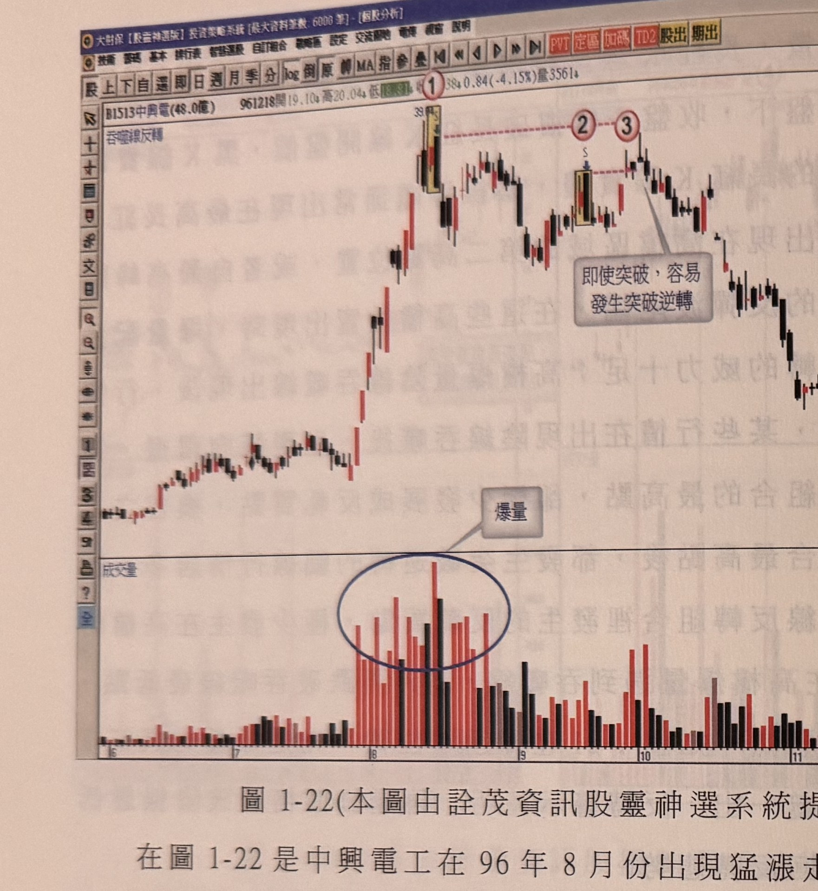
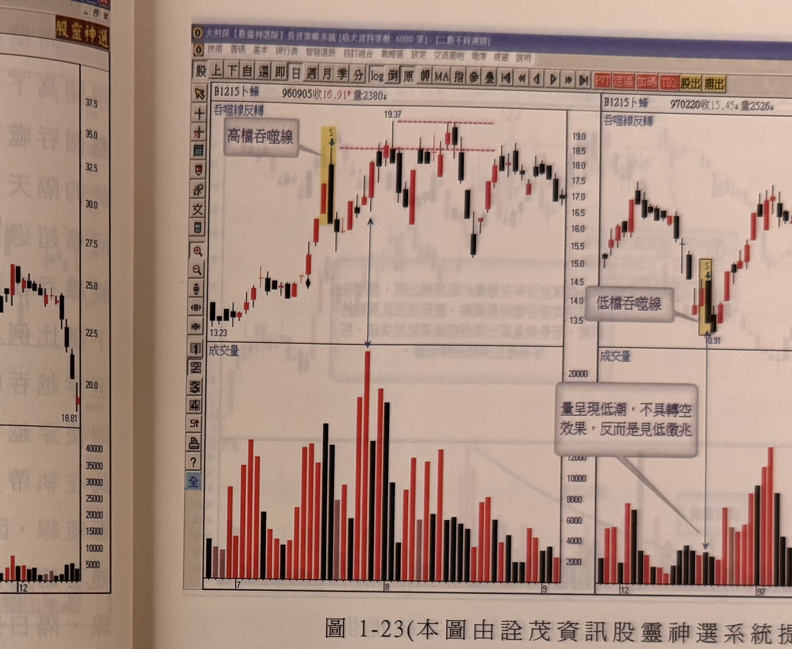

# 陰線吞噬反轉（高檔放空）與吞噬線買點（無爆量／低檔）

> 一句話摘要：高檔爆量出現陰線吞噬（黑K實體完全吞噬前一根長紅K線實體）者，隔日再跌破吞噬線最低點幾可確認反轉，宜掌握賣點放空，且此類吞噬線最高點即使被突破也極少形成有效反軋買點；但沒有爆量的吞噬線（漲勢中途或低檔），其最高點被K線收盤突破時，反而是可靠的買進訊號。

## 1. 核心概念

- **吞噬線（陰線吞噬）定義**：長紅K線後，隔天跳高開盤（通常在長紅K線最高點上方不遠，約3%以內），價格越盤越低，往往殺到跌停方休，造成收盤跌破長紅K線最低點，形成吞噬實體（p.9）。
- 陰線吞噬通常出現在最高長紅K線的隔天，也會出現在高檔區域的第二高點位置，或自最高峰點回檔超過3成後的反彈波尾端（p.21）。
- 高檔位置爆量配合陰線吞噬線，反轉威力十足；高檔爆量陰線吞噬線出現後，行情下墜比例非常高（p.21）。
- **與執帶／覆蓋線的重要差異**：某些高檔爆量吞噬線出現後行情呈橫向震盪，甚至K線收盤穿越吞噬組合最高點，卻極少發展成反軋買點——即使穿越吞噬組合最高點，多半發生「突破逆轉」的騙線行情。因此執帶、覆蓋線反轉組合中常見的反軋買點，**極少發生在高檔爆量的吞噬線**（p.21）。
- 吞噬線只有在**高檔且爆量**時才具強烈反轉意涵；若不是爆量的位階（漲勢中途或低檔），吞噬線反而可以視為一個準備觀察買點的組合（p.24）。

## 2. 適用前提

- 空方訊號（3.1）：須發生在**高檔**（最高長紅K線隔天、高檔第二高點，或回檔逾3成後的反彈波尾端），且須**爆量**配合（p.21）。
- 多方訊號（3.3）：須是**沒有爆量**的吞噬線，可發生在漲勢中途，或明確發生在**低檔**（起漲位置、探底尾端）（p.23–24）。

## 3. 訊號定義

### 3.1 高檔爆量吞噬線（空方，反轉確認）

1. C1：前一日長紅K線，且已處於高檔（最高長紅K線隔天、高檔第二高點，或回檔逾3成後反彈尾端）。
2. C2：隔日跳高開盤（約長紅K線最高點上方3%以內），價格越盤越低，收盤跌破長紅K線最低點，黑K實體完全吞噬前一根長紅K線實體（p.9、p.21）。
3. C3：須**爆量**配合（p.21）。
4. C4（反轉確認）：隔日（或後續）K線**收盤跌破**吞噬線本身的最低點 → 幾可確認反轉之必然（p.21：「在高檔爆量遇到吞噬線，隔日再跌破吞噬線最低點，幾可確認反轉之必然」）。

### 3.2 高檔爆量吞噬線最高點被突破（過濾條件，非反軋買點）

- 即使高檔爆量吞噬線最高點被後續K線**收盤**突破，也**不宜視為反軋買點**：此類突破極少發展成有效買訊，多半發生「突破逆轉」（過高後再度走跌）（p.21–22，圖1-22標示3；p.23，圖1-23左半圖；p.25，圖1-25）。

### 3.3 無爆量／低檔吞噬線最高點被突破（多方，買進訊號）

1. C1'：吞噬線出現時**沒有爆量**，且發生在漲勢中途或明確的低檔位置（起漲位置、探底尾端）（p.23–24）。
2. C2'：後續某根K線**收盤突破**該吞噬線的最高點 → 形成買進訊號（低檔可稱底部買訊，中途可稱反軋買點）（p.23：「如果吞噬線最高點是空方的防守線，那麼後續行情若突破吞噬線最高點，則是多方勝出的買進訊號」；p.24：「後市只要K線收盤突破標示1吞噬線最高點，即可認定為反軋買點訊號」）。

## 4. 進場

- **高檔爆量吞噬線（空方）**：C4 成立（隔日或後續K線收盤跌破吞噬線最低點）之當根K線收盤進場放空；原文明言「吞噬線反轉組合在高檔區出現，宜掌握賣點，準備伺機放空」（p.23）。
- **無爆量／低檔吞噬線（多方）**：C2' 成立（K線收盤突破吞噬線最高點）之當根K線收盤進場買進（p.23–24）。

## 5. 停損

原文未規定明確的停損點位或點數（不同於 gq-01-04 執帶、gq-01-05 覆蓋線的反軋買點皆有明文「以訊號K線最低點為停損」，本節的多方買進訊號與空方放空訊號均未見對應的停損規則）。

## 6. 出場 / 停利

書中未明確說明。

## 7. 過濾：不做的情況

1. 高檔爆量吞噬線的最高點即使被後續K線收盤突破，**不宜視為反軋買點進場**，因極易發生突破逆轉（過高後再度走跌）（p.21–22、p.25）。
2. 沒有爆量的吞噬線出現在**非高檔位置**（漲勢中途、低檔）時，不用過於緊張，不應視為強烈反轉警訊（p.24）。
3. 若吞噬線未達到「爆量」門檻，不應套用高檔爆量吞噬線的反轉確認邏輯（3.1），應改採無爆量吞噬線的觀察買點邏輯（3.3）（p.24）。

## 8. 範例解析

- **圖1-21**（p.21，嘉裕1417日線圖）：標示①先是爆量的長紅K線，隔日陰線吞噬一出，反轉警示明確，再隔日價格跌破陰線最低點，反轉態勢難以挽回，行情其後一路走跌。

  

- **圖1-22**（p.22，中興電1513日線圖）：96年8月猛漲走勢後，標示1位置出現帶爆量的最高長紅K線隔天陰線吞噬，反轉徵兆明顯；標示2位置的吞噬線在反彈行情尾端再度出現；標示3雖K線收盤穿越標示2陰線最高點，卻不代表多頭恢復攻擊，其後又在過高後再度走跌。

  

- **圖1-23**（p.23，卜蜂左右對照圖）：左圖（高檔）爆量吞噬線並未造成行情立刻反轉向下，多頭力圖再攻吞噬線高點卻被空頭壓頂，即使收盤突破仍難以為繼，越盤越成頭部反轉型態；右圖（低檔）吞噬線因成交量低潮（「量呈現低潮，不具轉空效果，反而是見低徵兆」），代表賣壓衰竭，其後行情自低點反轉上攻。

  

- **圖1-24**（p.24，廣豐1416日線圖）：95年12月初出現陰線吞噬但沒有爆量，應列為繼續觀察買進訊號的標的，後市K線收盤突破標示1吞噬線最高點（標示2），即認定為反軋買訊號。

  

- **圖1-25**（p.25，國喬1312日線圖）：標示①吞噬線反轉，其後標示②雖被後續價格突破，但容易發生突破逆轉，行情其後於標示②高點反轉走跌，量能自標示①附近高點逐漸萎縮（「量能退潮」）。

  

- **圖1-26**（p.25，四檔個股2×2對照圖：國場、同響、東訊、晶豪）：分別示範「沒爆量的吞噬線，突破高點為反軋買點」（國場）、爆量吞噬線後高點反轉（同響）、「爆量吞噬線破低點為反轉確認」（東訊）、及另一爆量吞噬線範例（晶豪），供讀者比較爆量與否對吞噬線後續發展的影響。

  

## 9. 作者提醒與常見錯誤

- 執帶、覆蓋線常見的反軋買點，在高檔爆量吞噬線中極少出現；操作者若沿用執帶／覆蓋線的反軋買點邏輯套用在高檔爆量吞噬線上，容易誤踩「突破逆轉」的騙線（p.21）。
- 運用K線理論判斷朝空方向的反轉組合時，若行情沒有爆量，該反轉組合反而可以轉化為確認買訊的濾網：K線收盤突破其最高點，就是多方攻克空頭所佈下的灘頭堡，可能是另一段漲勢的發動起點（p.24）。

## 10. 規則速查（Checklist）

- [ ] 高檔（最高長紅K隔天／高檔次高點／回檔逾3成反彈尾端）且爆量，隔日K線收盤跌破吞噬線最低點 → 放空
- [ ] 高檔爆量吞噬線最高點被突破 → 不視為反軋買點，忽略
- [ ] 沒有爆量的吞噬線（漲勢中途或低檔），K線收盤突破其最高點 → 買進

## 11. 機器可讀規則

```yaml
signal: 陰線吞噬反轉
side: both
timeframe: 1d
conditions:
  - id: C1_short
    desc: 高檔位置（最高長紅K隔天/高檔次高點/回檔逾3成反彈尾端）出現陰線吞噬且爆量
    source: p.21
  - id: C2_short
    desc: 隔日或後續K線收盤跌破吞噬線最低點
    source: p.21
  - id: C1_long
    desc: 吞噬線出現時沒有爆量，發生於漲勢中途或低檔
    source: p.23-24
  - id: C2_long
    desc: 後續K線收盤突破吞噬線最高點
    source: p.23-24
entry:
  short: C2_short成立時進場放空
  long: C2_long成立時進場買進
  source: p.21, p.23-24
stop_loss: 原文未規定
exit: 書中未明確說明
filters:
  - desc: 高檔爆量吞噬線最高點被突破，不視為反軋買點（極易突破逆轉）
    source: p.21-22, p.25
  - desc: 沒有爆量的吞噬線出現於非高檔位置，不應視為強烈反轉警訊
    source: p.24
```

## 12. 待確認事項

無重大疑義。原文明確區分「高檔爆量」與「無爆量／低檔」兩種情境下吞噬線的不同意涵，並明確指出反軋買點在高檔爆量吞噬線中不適用，已完整轉錄，未見矛盾或模糊之處。停損／出場未附具體規則，已依規定寫明「原文未規定」。

## 13. 原文出處

- `extracted/pages/IMG_8588.md`（p.20–21，陰線吞噬起始部分）
- `extracted/pages/IMG_8589.md`（p.22–23）
- `extracted/pages/IMG_8590.md`（p.24–25）
