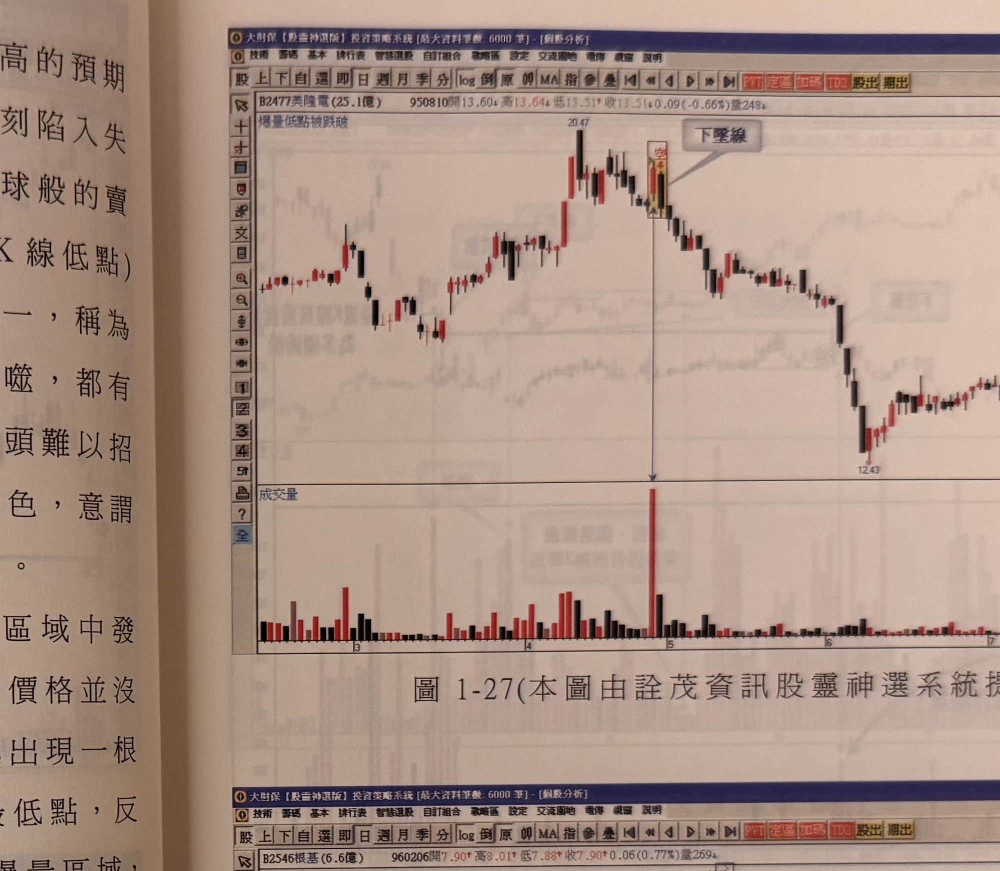
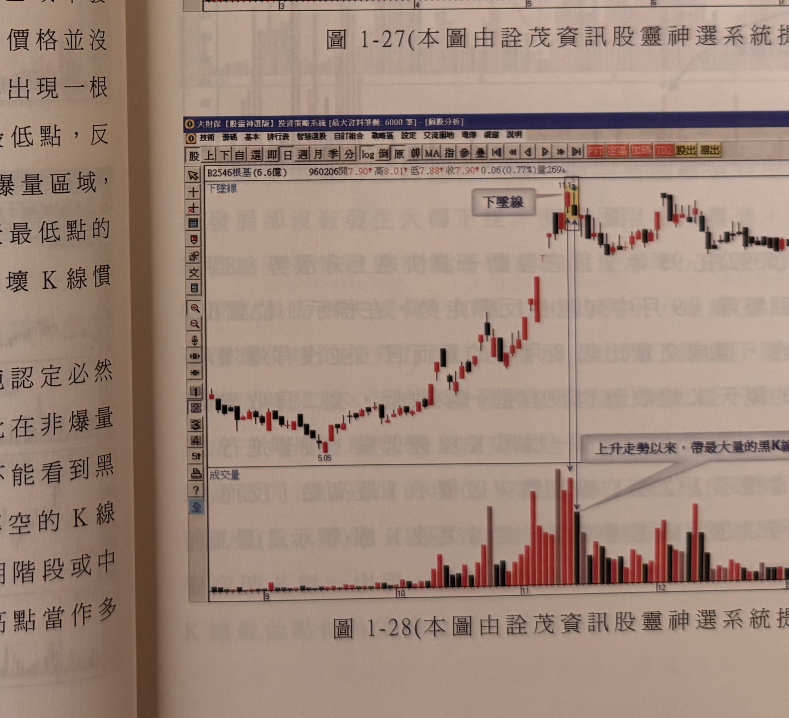
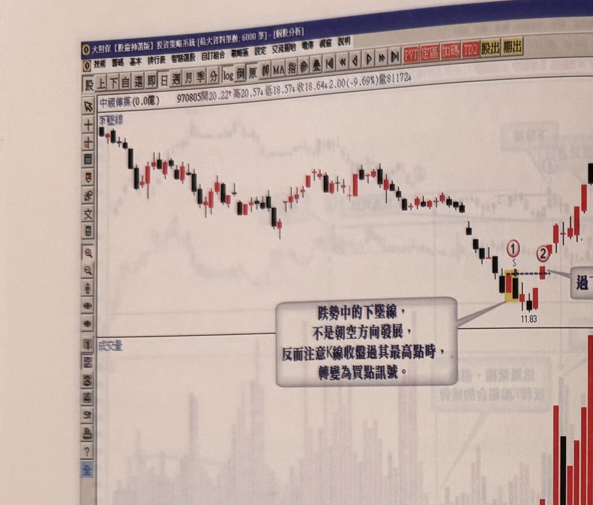

# 下墜線反轉與反軋買點

> 一句話摘要：帶量長紅K線（尤其漲停板）隔日反以跳低開盤，價格續破長紅K線實體中點乃至最低點收盤，稱為下墜線，在高檔出現是重要反轉訊號（必賣訊號）；但無論下墜線是否爆量，只要其最高點被後續K線收盤突破，即形成反軋買點，可用突破K線最低點做停損進場做多——此點與吞噬線不同，下墜線的反軋買點並不因爆量而失效。

## 1. 核心概念

- **下墜線定義**：長紅K線後，隔天以跳低開盤（前一天大漲K線的氣氛頓時消散轉為戒慎恐懼），買盤消散加上短線籌碼連開高出脫的機會都喪失，價格在跌破長紅K線實體中點後停損紛出，殺破長紅K線最低點作收（p.9、p.26）。
- 帶量長紅K線（尤其收漲停板）對隔天開高的預期心理特別強烈；若隔天卻以低盤開出，追高籌碼立刻陷入失望，動作明快者立刻停損殺出，牽引滾雪球式賣壓，價格直落長紅K線最低點（p.26）。
- 高檔爆量後接著出現黑執帶、覆蓋線或陰線吞噬，都還有「開高」的短暫榮景；但**下墜線顯示空方壓力一開盤即讓多頭難以招架**，是四種高檔反轉組合中開盤氣勢最弱的一種（p.26）。
- 下墜線收盤跌破長紅K線最低點，如同「豬羊變色」，意謂多頭再攻不易；下墜線隔日收盤續黑，則反轉事實愈加明顯（p.26）。
- 下墜線出現在最高峰不多見，通常發生在頭部橫向震盪區域中（p.26）。
- **與陰線吞噬不同的重要差異**：下墜線的反軋買點（最高點被突破）並不因爆量而失效——即使是爆量下墜線，只要後續價格未大幅下挫、呈橫向整理且成交量萎縮，突破其最高點仍可視為有效反軋買點（p.30，見3.2）。這一點與 gq-01-06 吞噬線「高檔爆量者反軋買點極少成立」的情形不同。
- 任何反轉K線若沒有配合爆量，都不能單純認定必然反轉；市場沒有規定反轉組合只能出現在高檔——轉空的K線組合在高檔是危機，在跌勢尾聲卻是轉機；漲勢初期或中途出現反轉組合卻沒有爆量時，可將其高點當作多頭發動攻勢的關鍵位置，突破視為買進訊號（p.26）。

## 2. 適用前提

- 下墜線反轉確認（3.1，賣出訊號）：須發生在**高檔位置**（p.26）。
- 反軋買點（3.2）：下墜線出現後，不論是否爆量，皆可能成立，但若原下墜線為爆量者，須待成交量萎縮至發動漲勢前的低量水準，才密切注意突破時機（p.30）。
- 跌勢中的下墜線買點（3.3）：須發生在**跌勢已發展一段時間**之處（非最高峰位置），且通常沒有爆量（p.30–31）。

## 3. 訊號定義

### 3.1 下墜線（高檔，賣出訊號／必賣訊號）

1. C1：前一日長紅K線，尤其收在漲停板位置。
2. C2：隔日跳低開盤。
3. C3：價格跌破長紅K線實體中點後持續破底，**收盤**跌破長紅K線最低點（p.9、p.26）→ 下墜線構成。
4. C4：須發生在**高檔位置**才具反轉意義（p.26）。
5. C5（加強確認）：下墜線隔日**收盤續黑**，反轉事實愈加明顯（p.26）。

### 3.2 反軋買點（多方，高檔下墜線之後的新倉進場，不論是否爆量）

1. Cr1：下墜線已出現（3.1所述型態，不論是否爆量）。
2. Cr2：後續某根K線**收盤突破**下墜線的最高點 → 形成反軋買點（p.28–30）。
3. 若原下墜線為爆量者，須待成交量從爆量逐漸萎縮至發動漲勢前的低量水準，才密切注意突破時機（p.30，圖1-30）。

### 3.3 跌勢中的下墜線（多方，底部買訊，鏡像）

1. C1''：行情處於**跌勢已發展一段時間**之處（非最高峰位置）。
2. C2''：出現下墜線，通常**沒有爆量**。
3. C3''：以下墜線最高點做為空方防守界限；後續某根K線**收盤突破**該防守線 → 視為空方勢力瓦解，成為買進訊號（p.30–31，圖1-31）。

## 4. 進場

- **賣出／出場**：C5 成立（下墜線隔日收盤續黑）時，視為反轉事實明顯，應賣出／出場多頭部位（p.26）；原文未使用「放空進場」明確字句指示新開空單。
- **反軋買點（高檔）**：Cr2 成立之當根K線收盤進場做多（p.28–29：「當標示2位置K線收盤突破標示1最高點，反而是一個買進訊號，可以在此處進場操作」；p.30：「只要突破K線一出現，便形成反軋買點，立即做買進操作」）。
- **跌勢中買點**：C3'' 成立之當根K線收盤進場做多（p.30–31）。

## 5. 停損

- **反軋買點（高檔，3.2）**：以突破訊號K線（Cr2成立之當根K線）的**最低點**為最大停損位置（p.29：「並以突破K線（標示2）最低點為最大停損位置」；p.30：「並以突破K線最低點做為停損位置，控制風險」）。
- **跌勢中買點（3.3）**：原文未明確附上停損規則，僅描述以「下墜線最高點」為空方防守線、突破即買進，未進一步說明買進後的停損位置。
- 下墜線反轉確認（3.1，賣出訊號）本身未附獨立的停損點位或點數規則，原文未規定。

## 6. 出場 / 停利

書中未明確說明反軋買點與跌勢中買點的停利／出場規則。

## 7. 過濾：不做的情況

1. 沒有爆量配合的反轉組合，不能單純認定必然反轉；漲勢初期或中途出現無爆量反轉組合（含下墜線）時，可將其高點視為多頭發動攻勢的關鍵位置，突破則視為買進訊號，而非賣出訊號（p.26）。
2. 下墜線出現在最高峰的情形不多見，通常發生在頭部橫向震盪區域，操作時須留意其發生位置（p.26）。
3. 反軋買點的爆量下墜線案例，須待成交量確實萎縮至發動漲勢前的低量水準才密切注意突破時機，尚未萎縮到位前不宜貿然視為反軋買點成立（p.30）。

## 8. 範例解析

- **圖1-27**（p.27，美隆電2477日線圖）：95年4月初出現覆蓋線後，價格並未直接殺破長紅K線最低點，形成頭部震盪；直到4月底出現爆量長紅K線，隔日再出現下墜線，殺破長紅K線最低點，反轉確認且跌速加快，行情自此一路走跌。

  

- **圖1-28**（p.27，根基2546日線圖）：K線推升過程一直保持著「收盤不破前一天最低點」的模式，於相對高檔出現下墜線（圖說：「上升走勢以來，帶最大量的黑K線」），當下墜線收盤跌破紅K線最低點，形成破壞K線慣性的必賣訊號，行情其後反轉走跌後橫向整理。

  

- **圖1-29**（p.28–29，應華5392日線圖）：95年7月底發動快速上升漲勢，8月中旬拉回整理，9月中旬反彈時標示1位置出現下墜線反轉組合，但成交量未爆增，隔天及次二日K線收盤均未跌破前一根黑K線最低點，接著進行二個多月盤整，標示2位置K線收盤突破標示1最高點，形成買進訊號，並以突破K線（標示2）最低點為最大停損位置。

  

- **圖1-30**（p.29，達威5432日線圖）：96年4月價量俱增推升行情中，標示1出現爆量下墜線，典型反轉訊號，但後續未大幅下挫，反呈橫向震盪三角形整理，成交量逐漸從爆量轉為量縮，當量縮達3月份發動漲勢前的低量水準時，標示2處K線收盤突破下墜線最高點，形成反軋買點，立即買進並以突破K線最低點為停損。

  

- **圖1-31**（p.30，中視傳媒日線圖）：行情自高點持續下跌一波段，標示1位置出現下墜線但沒有爆量，且位階是在跌勢已發展一段時間，此時的下墜線不必視為空方威脅，反而是靠近底部的可能徵兆；將下墜線最高點當作空方防守界限，標示2位置K線收盤突破後，行情反轉大幅上攻。

  

## 9. 作者提醒與常見錯誤

- 轉空的K線組合在高檔是危機，在跌勢尾聲卻是轉機；漲勢初期或中途出現反轉組合而未爆量時，應改用突破其高點視為買進訊號的思路，而非機械式地一律解讀為賣出警訊（p.26）。
- 即使是典型的爆量反轉訊號（如下墜線），若後續行情並未大幅下挫、反呈量縮橫向整理，仍應密切觀察是否出現反軋買點，而非固守初始的空方判斷（p.30）。

## 10. 規則速查（Checklist）

- [ ] 前一日長紅K線（尤其漲停），隔日跳低開盤
- [ ] 價格跌破長紅K線實體中點乃至最低點收盤 → 下墜線構成
- [ ] 須發生在高檔位置，隔日收盤續黑 → 反轉確認，賣出/出場
- [ ] 下墜線最高點被K線收盤突破（不論是否爆量，爆量者須先等量縮） → 反軋買點，做多，停損＝突破K線最低點
- [ ] 跌勢已發展一段時間、無爆量的下墜線，最高點被突破 → 買進（底部徵兆）

## 11. 機器可讀規則

```yaml
signal: 下墜線反轉
side: both
timeframe: 1d
conditions:
  - id: C1
    desc: 前一日長紅K線(尤其漲停)，隔日跳低開盤
    source: p.9, p.26
  - id: C2
    desc: 價格跌破長紅K線實體中點後續破底，收盤跌破長紅K線最低點
    source: p.9, p.26
  - id: C3
    desc: 須發生在高檔位置
    source: p.26
  - id: C4_confirm
    desc: 下墜線隔日收盤續黑，反轉事實愈加明顯
    source: p.26
entry:
  sell_exit: C4_confirm成立時賣出/出場多單
  counter_buy:
    desc: 下墜線最高點被後續K線收盤突破，形成反軋買點，進場做多（爆量下墜線須先等成交量萎縮至發動漲勢前低量水準）
    source: p.28-30
  downtrend_buy:
    desc: 跌勢已發展一段時間、無爆量的下墜線，最高點被K線收盤突破，視為買進訊號
    source: p.30-31
stop_loss:
  counter_buy: { ref: "突破訊號K線最低點", source: "p.29-30" }
  downtrend_buy: 原文未規定
  sell_exit: 原文未規定
exit: 書中未明確說明
filters:
  - desc: 未爆量的反轉組合（含下墜線）不應單純視為賣出訊號，可將其高點視為多頭發動攻勢關鍵位置
    source: p.26
  - desc: 爆量下墜線的反軋買點須等待成交量萎縮至發動漲勢前低量水準才密切注意突破時機
    source: p.30
```

## 12. 待確認事項

原文對本模式的規則描述相對完整，反軋買點與跌勢中買點的進場條件、（部分）停損皆有明文交代；跌勢中買點（3.3）的停損原文未提供，已依規定寫明「原文未規定」，未自行推論補充數值。

## 13. 原文出處

- `extracted/pages/IMG_8592.md`（p.26–27）
- `extracted/pages/IMG_8593.md`（p.28–29）
- `extracted/pages/IMG_8594.md`（p.30–31，下墜線部分：圖1-31）
