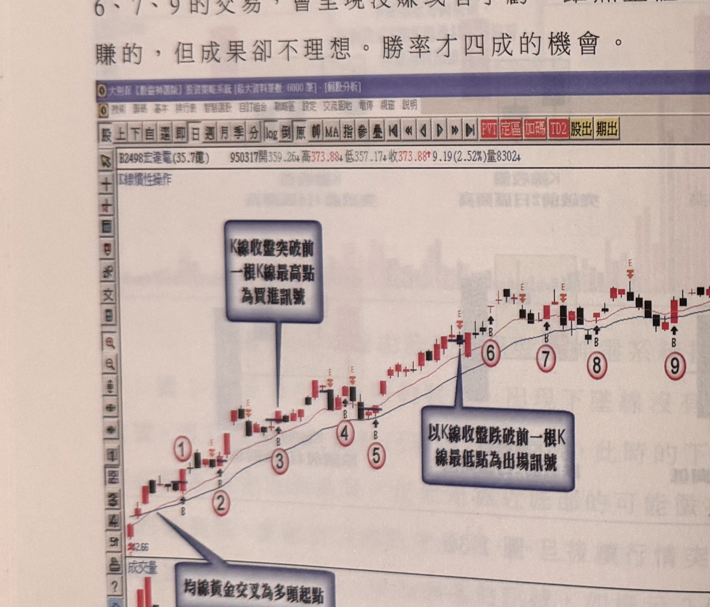
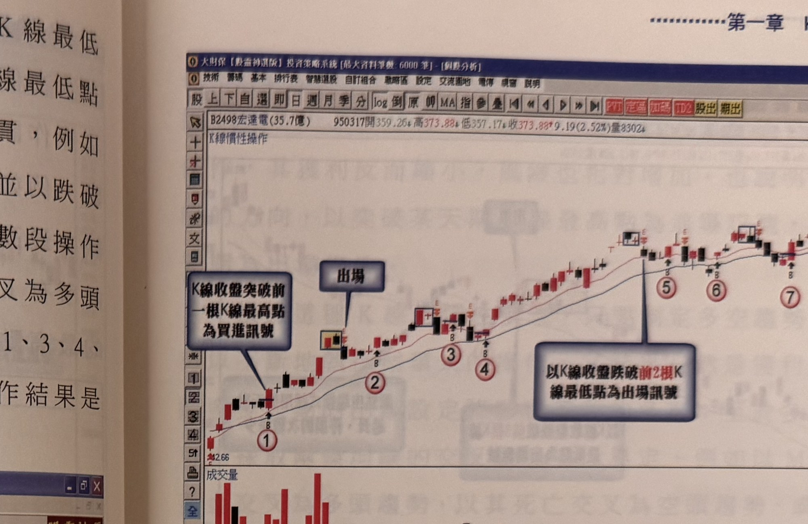
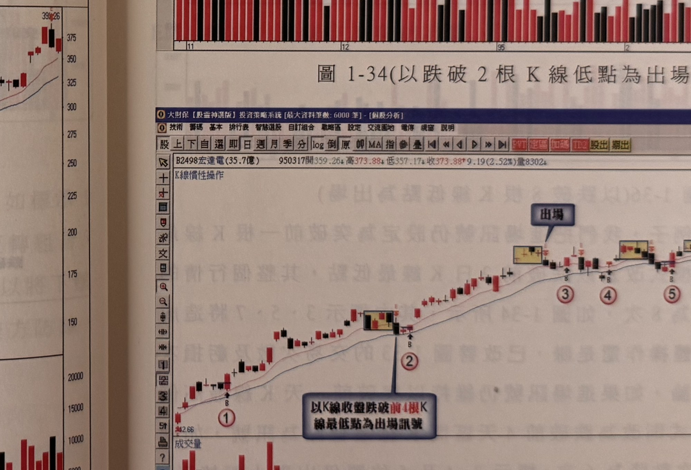
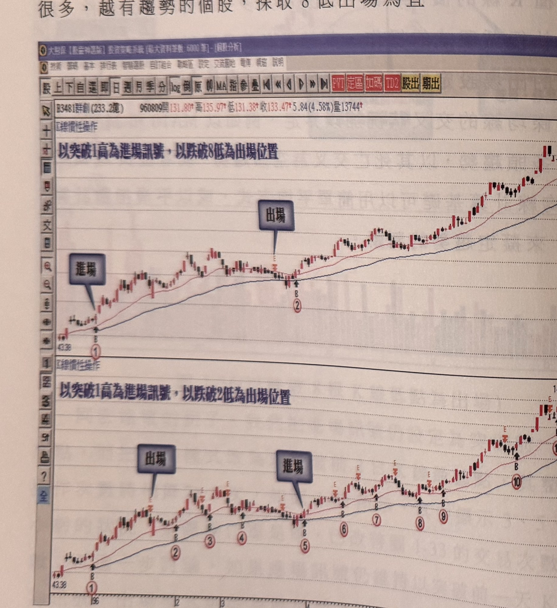
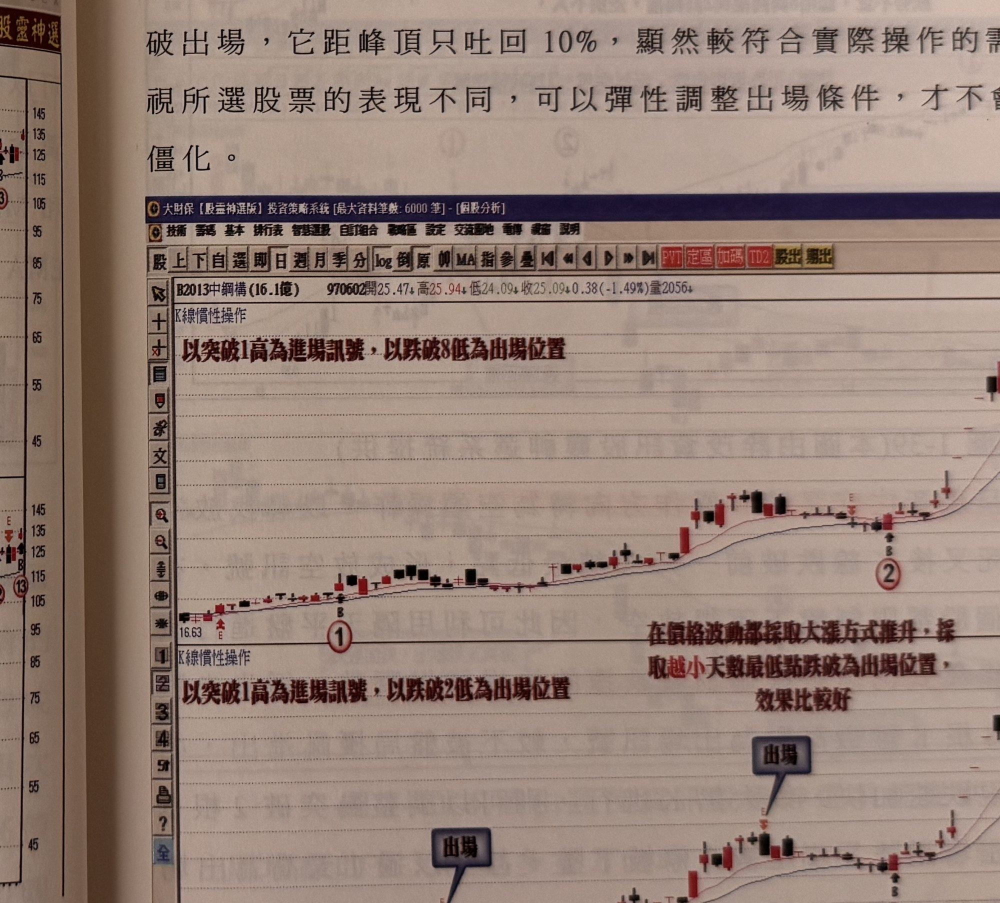

# K線慣性操作（突破N日高進場／跌破N日低出場）

> 一句話摘要：以均線交叉界定多空趨勢，多頭時以K線收盤突破前一日K線最高點進場、跌破前N日K線最低點出場；空頭時以跌破前一日K線最低點進場、突破前N日K線最高點回補；出場天期N（1、2、4、8日皆可）依個股走勢速度與個人風險承受度彈性選擇，天期越長交易次數越少但單次波動承受越大。

## 1. 核心概念

- **突破／跌破N日高低點的定義**：K線收盤突破前N天高，意謂收盤須突破「先前N天區間內所有K線中的最高價」；跌破前N天低，則指收盤跌破「先前N天區間內所有K線中的最低價」。這不是指特定某一天K線的最高／最低點，而是該期間內所有K線比對出的極值（p.31，圖1-32）。
- 行情的表現是眾多K線的結合，行情推展透過K線觀察存在某種「慣性軌跡」：可能是漲勢中每根K線都不跌破前一天（或前二天、前四天）K線的最低點，或跌勢中每根K線都無法突破前一根K線的最高點，這種現象不斷複製形成「K線的慣性」（p.31–32）。
- 不同的慣性天期，會決定整段行情被切割成多少次進出操作：天期越短（如1日），操作次數越多、越容易被盤整雜訊刷洗出場；天期越長（如8日），操作次數越少、不易受盤整格局干擾，但單次波動承受幅度較大（p.32–36）。
- 進場天期在書中示範中固定採用「突破／跌破前1日K線極值」，**變動的是出場天期**：以突破前一根K線最高點為進場訊號，不見得要以相同天期為出場條件（p.35）。
- 多空趨勢的判別可採兩條均線的交叉：例如MA10與MA20黃金交叉為多頭趨勢、死亡交叉為空頭趨勢，或拉長為MA20與MA60；均線計算基礎可用簡單平均，也可用平滑指數（EMA），天期與計算基礎皆屬個人習慣問題，沒有硬性規定（p.35、p.39–40）。
- 訊號K線本身沒有顏色限制：多頭訊號不必是紅K線、空頭訊號不必是黑K線，也不限制影線長短——操作上只看收盤是否符合突破或跌破設定天期的最高／最低點，其他限制可以忽略（p.39–40）。
- 台股大部分個股限制「盤下不得放空」（平盤以下禁空令），因此死亡交叉後出現放空訊號時，須利用隔天平盤（或以上）才能實際進行放空動作（p.38）。

## 2. 適用前提

- 須先以均線交叉界定當下的多空趨勢（黃金交叉＝多頭、死亡交叉＝空頭）（p.35、p.38）。
- 出場天期N的選擇建議依個股走勢特性調整：
  - 走勢緩步、盤整雜訊多的格局，宜採**較長天期**（如8日）出場，避免在盤整格局中被反覆刷洗進出（p.36）。
  - 個股呈現**連續大漲（含連續跳空漲停）**等快速強力趨勢時，改採**較短天期**（1或2日）出場，可避免獲利大幅回吐；若沿用長天期（如8日）出場，見頂拉回時獲利可能被吐回逾2成，改用短天期則約僅吐回1成（p.36–37，圖1-38中鋼構例）。
  - 出場天期也可依個人風險承受屬性（沉穩型／緊張型）選擇：短天期交易次數多、單次獲利較小但適合較易緊張的投資人；長天期交易次數少、單次獲利較大但須承受較大波動（p.40–41）。
  - 出場天期可隨行情走勢速度動態調整：緩步走跌可用8高回補，一旦跌速加快（連續大黑K）可調整為2高甚至1高回補，行情再度趨緩時亦可切回長天期（p.38–39，圖1-39、圖1-40）。

## 3. 訊號定義

### 3.1 多方（多頭操作）

1. C1：以均線黃金交叉界定目前為多頭趨勢（p.35）。
2. C2：某根K線**收盤突破**前一日K線的最高點 → 買進訊號（p.32）。
3. C3（出場）：某根K線**收盤跌破**前N日區間（所有K線中）的最低點 → 出場訊號，N可選1、2、4或8日，依第2節原則調整（p.32–37）。

### 3.2 空方（空頭操作，鏡像）

1. C1'：以均線死亡交叉界定目前為空頭趨勢（p.38）。
2. C2'：某根K線**收盤跌破**前一日K線的最低點 → 放空訊號；因台股平盤以下禁空，實際放空動作須待隔天平盤或以上才能執行（p.38）。
3. C3'（回補出場）：某根K線**收盤突破**前N日區間（所有K線中）的最高點 → 回補出場訊號，N可選1、2或8日，依跌速快慢調整（p.38–39）。

## 4. 進場

- **多方**：C2 成立之當根K線收盤進場做多（p.32）。
- **空方**：C2' 成立之次一交易日、在平盤（前一交易日收盤）或以上價位進場放空（因台股平盤下禁空限制）（p.38）。
- 原文未提供補進場、等待拉回等額外規則；進場天期固定為「前1日」極值突破，未見進場天期調整的示範。

## 5. 停損

原文未在本節提供獨立於「出場（跌破N日低／突破N日高）」之外的停損規則；本方法的出場條件（3.1的C3、3.2的C3'）本身兼具停損與停利雙重功能，逐次執行、循環操作（p.35：「根據這種K線的慣性模式，只要制定多空趨勢的界定條件，就可以不斷地執行循環式的操作，其結果必然是獲利的，差別在於根據多少天期的出場設定將影響獲利的多寡」）。

## 6. 出場 / 停利

1. 多方：K線**收盤**跌破前N日區間最低點時出場（N＝1、2、4或8，依個股走勢速度及個人風險承受度選定，見第2節）（p.32–37）。
2. 空方：K線**收盤**突破前N日區間最高點時回補（N＝1、2或8，依跌速快慢動態調整）（p.38–39）。
3. 出場天期可在同一波段操作中依行情速度變化而切換（例如原用8高回補，跌速轉快後改用1高回補；行情再度趨緩可考慮切回較長天期）（p.38–39，圖1-39、1-40）。

## 7. 過濾：不做的情況

1. 台股平盤以下禁止放空：死亡交叉後跌破前一日低點形成放空訊號時，須待隔天平盤或以上才能實際放空，不可在盤下直接放空（p.38）。
2. 出場天期若設定過短（4日以內）於盤整格局中，較難避免被刷洗出場，不利於獲利品質；若行情明顯呈盤整格局，不宜沿用過短的出場天期（p.36）。

## 8. 範例解析

- **圖1-32**（p.31，示意圖）：突破前1/2/4日區間高、跌破前1/2/4日區間低的定義示意——皆取該期間內所有K線比對出的最高／最低點，而非單指特定一天。

  

- **圖1-33～1-36**（p.32–34，宏達電日線圖，同一走勢分別以跌破1、2、4、8根K線低點為出場條件）：以均線黃金交叉為多頭起點、突破前一根K線最高點為進場訊號；跌破1根低點出場時被切割為10次操作、勝率僅四成（雖整體仍獲利但品質不佳）；跌破2根低點降為8次操作；跌破4根低點降為6次操作、獲利提升；跌破8根低點時整段行情僅切割為2次操作，幾乎將整段獲利入袋。

  
  
  
  

- **圖1-37**（p.36，群創3481日線圖）：以突破1高進場、比較跌破8低與跌破2低兩種出場模式；用2低出場交易次數高達13次，獲利卻遠比用8低少，顯示越有趨勢的個股，宜採8低出場。

  

- **圖1-38**（p.37，中鋼構2013日線圖）：連續跳空漲停推升的個股，見頂32.02元後，用破8低出場獲利距峰頂吐回逾2成，用破2低出場僅吐回約1成，示範連續大漲個股宜改用較短天期出場。

  

- **圖1-39**（p.38，耿鼎1524日線圖）：死亡交叉後跌破前一天低點放空，跌速不快時用突破8高回補，不會像突破2高回補模式那樣在盤整區反覆進出。

  

- **圖1-40**（p.38–39，智邦2345日線圖）：死亡交叉後跌破前一天低點放空（標示1），行情橫向震盪後跌速加快；若採突破8高回補，出場點在標示3；若依跌速調整為突破1高回補，出場點提前在標示2；單次操作以標示2出場較佳，回補後若仍欲續空，可在標示4（收盤跌破前一天低點）重新放空並改回突破8高出場（於標示3回補）。

  

- **圖1-41**（p.40，昆盈2365日線圖）：同一段跌勢分別以突破8高、突破1高為回補模式；8高出場模式僅出現3次操作訊號，1高出場模式則達7次，兩者皆可獲利，差別僅在獲利多寡，投資人可依自身沉穩或緊張的屬性選擇合適模式。

  

## 9. 作者提醒與常見錯誤

- 出場機制設定的條件對操作次數與獲利規模影響甚大：越不喜歡承受較長天數跌破條件者，其獲利反而縮小、風險也相對增加（p.35）。
- 進場天期與出場天期不必相同，以突破某天期K線最高點為進場訊號，不代表出場也要用相同天期（p.35）。
- 出場天期沒有固定最佳解，應視個股表現快慢及個人承受屬性（沉穩型或緊張型）彈性調整，而非一成不變（p.40–41）。

## 10. 規則速查（Checklist）

- [ ] 均線黃金交叉（多）／死亡交叉（空）界定趨勢方向
- [ ] 多：K線收盤突破前1日K線最高點 → 買進
- [ ] 空：K線收盤跌破前1日K線最低點 → 放空（須待隔日平盤或以上才可實際放空）
- [ ] 多：K線收盤跌破前N日（1/2/4/8）區間最低點 → 出場
- [ ] 空：K線收盤突破前N日（1/2/8）區間最高點 → 回補
- [ ] 依個股走勢速度（緩步 vs 快速大漲/大跌）及個人風險屬性選擇出場天期N

## 11. 機器可讀規則

```yaml
signal: K線慣性操作
side: both
timeframe: 1d
conditions:
  - id: C1
    desc: 均線黃金交叉（多）/死亡交叉（空）界定趨勢方向
    source: p.35, p.38
  - id: C2
    desc: K線收盤突破（多）/跌破（空）前1日K線最高/最低點
    source: p.32, p.38
entry:
  long: K線收盤突破前1日K線最高點
  short: K線收盤跌破前1日K線最低點（台股須待隔日平盤以上才可實際放空）
  source: p.32, p.38
stop_loss: 出場條件本身兼具停損功能，見exit
exit:
  long:
    desc: K線收盤跌破前N日區間最低點，N∈{1,2,4,8}依個股走勢速度與個人承受度選定
    source: p.32-37
  short:
    desc: K線收盤突破前N日區間最高點，N∈{1,2,8}依跌速快慢動態調整
    source: p.38-39
filters:
  - desc: 台股平盤以下禁止放空，放空訊號須待隔日平盤或以上才可執行
    source: p.38
  - desc: 出場天期4日以內於盤整格局中較難避免刷洗出場，不利獲利品質
    source: p.36
```

## 12. 待確認事項

無重大疑義。本節提供的規則（進場天期固定、出場天期依情境調整）在原文中反覆以宏達電、群創、中鋼構、耿鼎、智邦、昆盈等多個範例交叉驗證，敘述一致，未見矛盾。

## 13. 原文出處

- `extracted/pages/IMG_8594.md`（p.31，突破跌破的定義起始）
- `extracted/pages/IMG_8595.md`（p.32–33）
- `extracted/pages/IMG_8596.md`（p.34–35）
- `extracted/pages/IMG_8598.md`（p.36–37）
- `extracted/pages/IMG_8599.md`（p.38–39）
- `extracted/pages/IMG_8600.md`（p.40）
