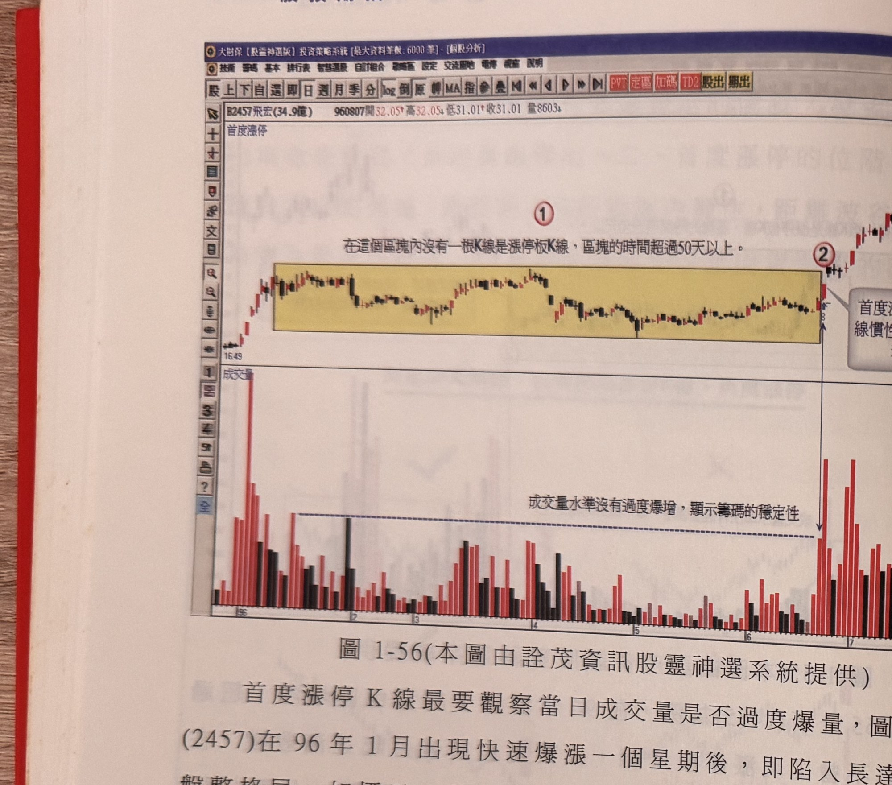
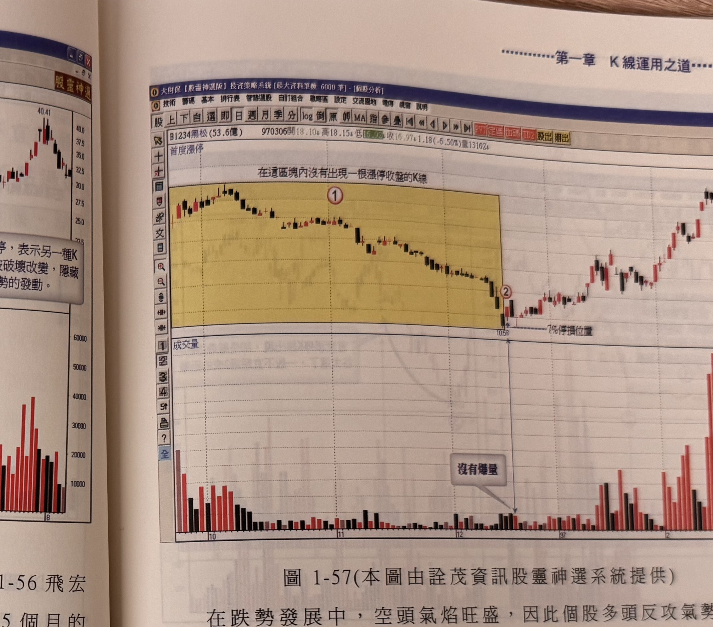
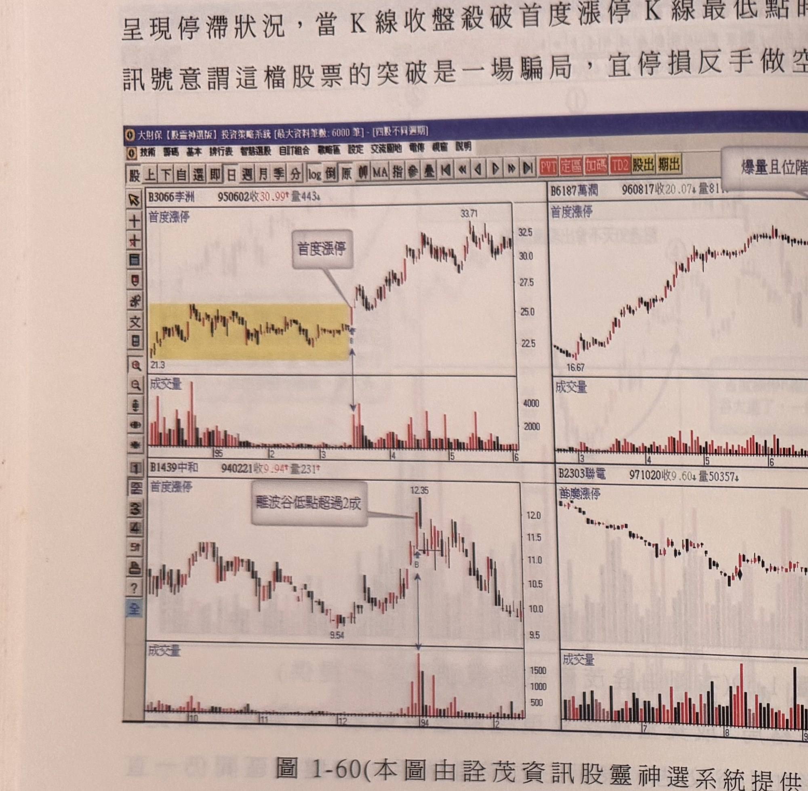
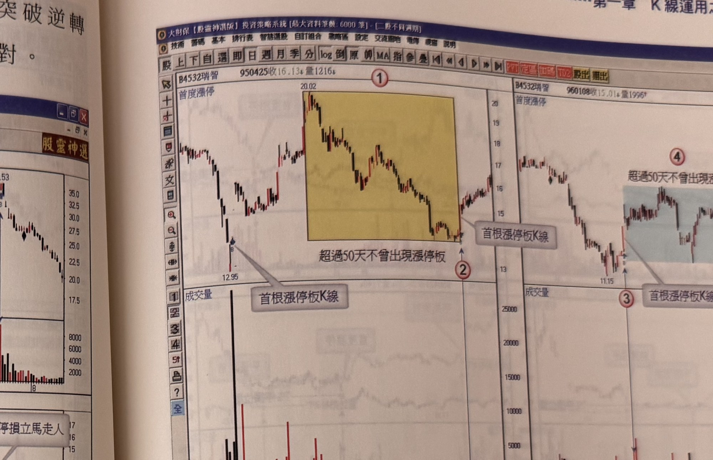
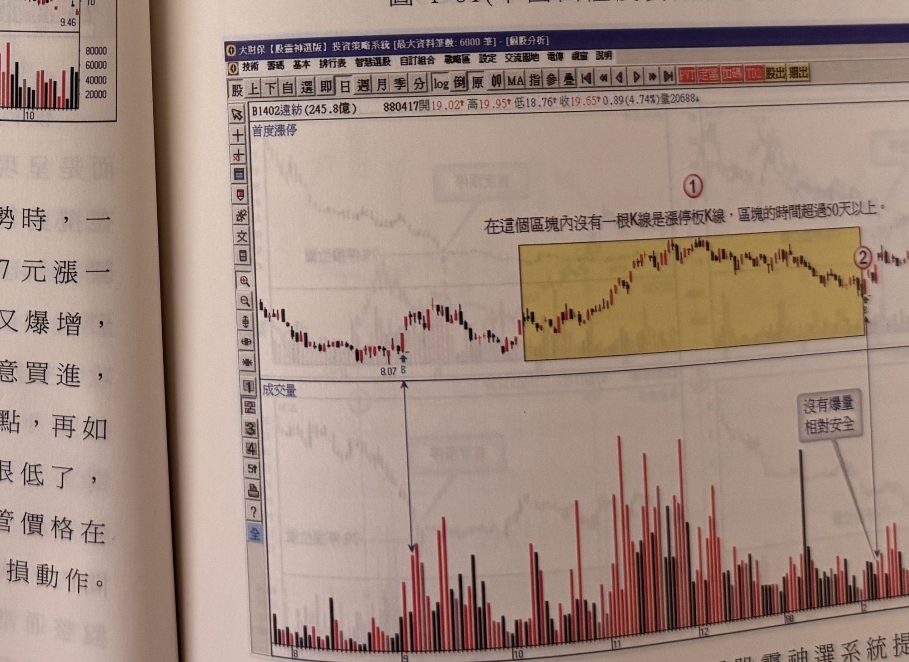

# 首度漲停買進法

> 一句話摘要：個股超過 50 個交易日未曾出現漲停收盤，一旦首度出現漲停板 K 線，往往是打破原有沉悶慣性、展開攻勢的訊號，可做為買進切入點，但須以成交量與訊號位階過濾出貨假訊號。

## 1. 核心概念

個股漲停收盤常引發投資人關注，但漲停可能是利多／主力做價的表態，也可能是主力出貨的煙幕彈（p.51）。作者主張：判斷漲停訊號的價值，關鍵不在漲停本身，而在「這檔股票平常是否習慣漲停」。若一檔股票長期（原文以 50 個交易日為界）都沒有出現過漲停收盤，代表它的價格慣性就是「不會漲停」；一旦這個慣性被打破，如同平常上課打瞌睡的學生突然精神奕奕，是值得正面看待的改變訊號（p.51）。所以，股價在 50 天以上未曾漲停，首度出現漲停即可能是快速上漲的號角（p.51）。

低檔爆不爆量的漲停，價比量重要；高檔爆量漲停，則量的失控比價格更具觀察價值（p.51）。

## 2. 適用前提

- 商品：個股（書中範例皆為股票日線）。
- 需先判斷該股票過去一段期間（見「訊號定義」C1）確實沒有出現過漲停收盤 K 線，此為訊號成立的前提條件，而非單純"今日漲停"即可視為訊號。
- 效果最好的情境（p.52，圖 1-54）：
  - 股價經過一段期間「橫向窄幅盤整」，且區間內成交量呈逐漸收斂／收斂後量縮現象；或
  - 股價「盤跌已久」，呈緩跌緩彈格局。
  這兩種情境下出現首度漲停，效果最佳。

## 3. 訊號定義

多方（原書僅列多方，未提供空方鏡像規則）：

1. C1　回溯期間內（以 50 個交易日為判斷基礎）沒有出現過漲停收盤的 K 線（p.51：「可以 50 個交易日做為慣性期間的判斷」）。
2. C2　今日（或訊號當日）出現漲停收盤 K 線，即為「首度漲停」（p.51）。

## 4. 進場

- 首度漲停在盤中若於**開盤後 2 小時內**即到達漲停板價位，值得立刻掛買進場；最慢應在**臨收盤前**做出買進決定（p.56）。
- 原文未進一步規定「等拉回進場」或「補進場」的條件；書中描述的操作方式即是訊號當日（或訊號 K 線）直接進場，未提及隔日追價或拉回再進場的補進場規則。

## 5. 停損

- 一般情況：以進場價（或首度漲停 K 線）**7% 跌破**做為最大停損位置（p.55 黑松案例；圖 1-56、1-57、1-60、1-63、1-64、1-65 均於圖上標出「7% 停損位置」）。
- 成交量／型態存疑的情況（如橫向盤整區間內量能呈「山谷交迭」而非逐漸收斂，主力疑似藉突破出貨，見「過濾」F4 及中纖案例）：若首度漲停後行情呈現停滯，且 **K 線收盤價跌破首度漲停 K 線最低點**，視為突破逆轉訊號，代表原先的突破是騙局，**宜停損並反手做空**（p.58）。
- 原文未規定固定停損與"跌破訊號K線低點"停損二者的優先順序或選用時機界線；依上下文，7% 為一般預設停損，跌破訊號K線低點反手放空則專用於「爆量／量形可疑」的個案（推論）。

## 6. 出場 / 停利

原文未明確說明固定的停利／出場規則。書中僅提及：
- 以 7% 為最大停損位置作風險控管（見上），未觸及停損前持續持有（p.55：「大難不死必為後福，其後多頭亦步亦趨地挺進」）。
- 若首度漲停後續行情停滯並跌破訊號 K 線低點，即出場並反手放空（見「停損」）。
- 若需要明確的移動停利／出場機制，可參照本書「出場/停損模式」（見 `gq-01-12-出場停損模式.md`）之四種模式，惟原文於本節未直接指定應搭配哪一種。

## 7. 過濾：不做的情況

1. F1　訊號產生當日成交量不宜爆量，**不宜超過最近一整年最大量的 1.5 倍以上**；籌碼穩定的個股發生漲停時，不應出現急著獲利了結的籌碼釋出（p.52）。
2. F2　首度漲停的位階不宜離最近一個波谷低點過遠，**應在 20% 範圍內發生**；距離波谷低點過遠，容易變成最後長紅線（出貨訊號），而非買點（p.52、圖 1-58 右半東貿國案例：距波谷超過 20% 不宜買進）。
3. F3　首度漲停出現在距波谷太遠的位階，是較具風險的切入點（圖 1-54 右上示意圖，p.52）。
4. F4　若首度漲停爆量，且盤中漲停價數度開開關關，主力出貨調節跡象愈明顯（圖 1-54 右下示意圖，p.52）。
5. F5　橫向盤整格局中，成交量本應逐漸遞減；若反而呈現「量形如山谷交迭」（區間內反覆出量），代表主力在盤整區間持續攪動籌碼，即使之後突破區間上限，通常爆量後就不再上攻，此為出貨徵兆，不宜視為正常買訊（p.57，中纖 1718 案例，圖 1-59）。

## 8. 範例解析

> 說明：圖 1-52、1-53（p.50–51）為銜接前一節「下斜式整理格局突破」之範例，非屬本節「首度漲停」方法，故不列入本文件範例。


- **圖 1-54**（p.52，示意圖）：四格對比首度漲停出現時機與量能好壞。窄幅盤整末端出現漲停（✓最佳）、盤跌已久後出現漲停（✓最佳）；距波谷太遠才出現漲停（✗，違反 F2）；訊號 K 線成交量爆增（✗，違反 F1）。


- **圖 1-55**　全新(2455)，960824：黃色區塊內超過 50 天未見漲停且量能收斂，標示②首度漲停後價格續漲並持續墊高，符合本法核心情境（p.53）。



- **圖 1-56**　飛宏(2457)，960807：快速上漲後陷入 5 個月盤整（區塊未見漲停），6 月下旬首度漲停，量未過度放大，之後續漲；圖上標示「7% 停損位置」（p.54）。



- **圖 1-57**　黑松(1234)，970306：跌勢中腰斬以上、長期無像樣反彈（僅小星線），12 月中旬首度漲停打破慣性，以 7% 跌破為最大停損，兩天內險守住停損後續強勢上攻，標示②恰為波段低點（p.54–56）。


- **圖 1-58**　東貿國(4104) 兩段走勢：左半圖窄幅盤整末端出現首度漲停（B），突破效應大、量能明顯放大後急漲，為理想案例；右半圖首度漲停（④）距波谷（③）超過 20%，屬 F2 過濾案例，不宜買進（p.56）。


- **圖 1-59**　中纖(1718)，970718：超過 50 天未漲停但區間內爆量（違反 F5），首度漲停②爆出全圖最大量，之後行情不漲反跌，為訊號失敗案例，示範 F5 與「停損」中跌破訊號K線低點反手放空的情境（p.57–58）。



- **圖 1-60**　四格對照（李洲3066／萬潤6187／中和1439／聯電2303）：李洲窄幅盤整後首度漲停急漲（佳例）；萬潤於高檔盤整後爆量漲停，屬出貨疑慮案例，觸及 7% 停損應立即出場；中和首度漲停已離波谷超過 2 成（違反 F2），漲停後拉回震盪走跌；聯電於空頭跌勢中出現首度漲停，即使價格主觀覺得便宜，觸及 7% 停損仍應停損離場（p.58）。



- **圖 1-61**　瑞智(4532) 三段走勢：分別於不同時期出現「首根漲停板K線」，示範訊號 K 線收盤宜站上最短均線之上，否則須再確認（p.59）。



- **圖 1-62**　遠紡(1402)：窄幅盤整區間內未爆量（相對安全），符合理想情境（p.59）。


- **圖 1-63、1-64、1-65**（p.60–61，各為四格範例圖，"以下各圖請讀者自行參閱"）：唐榮(2035)、萬旭(6134)、旺宏(2337)、豐興(2015)、榮剛重(5009)、茂達(6138)、旺宏(2337)（另一時段）、燁輝(2023)、信錦(1582)、合晶(6182)、鴻準(2354)、大成鋼(2027)：皆為首度漲停後續漲的正例，圖上均標示「7% 停損位置」，原文未逐一文字說明，僅列為參考範例。


- **圖 1-66**　國泰化(1713)：呈現多次波段起漲點（①②③④）搭配對應的量能放大，作為首度漲停延伸應用的參考範例（p.61）。

## 9. 作者提醒與常見錯誤

- 漲停板每天都容易看到，但要好好把握的是「累積超過 50 天來的首度漲停」（p.53）。
- 投資人常忽略首度漲停這類發動訊號，誤以為又是另一次一日行情；但當紮實的漲停出現時，務必把握，風險僅一根停板，獲利空間可期（p.53）。
- 不管價格在主觀認定上覺得已經很便宜，只要 7% 停損位置被觸及，一定要立即執行停損，不可心存僥倖（p.58，聯電案例）。
- 一般判斷買點慣以「突破區間最高點」確認，但本法主張可根據首度漲停提前確認攻勢發動，不必等區間高點被突破（p.54）。

## 10. 規則速查（Checklist）

- [ ] 回溯期間內（約 50 個交易日）未曾出現漲停收盤 K 線
- [ ] 今日出現漲停收盤（首度漲停）
- [ ] 訊號當日成交量未超過近一年最大量 1.5 倍
- [ ] 首度漲停位階距最近波谷低點在 20% 範圍內
- [ ] 盤中及早（開盤 2 小時內）鎖漲停，或臨收盤前確認買進
- [ ] 設定 7% 停損；若情境存疑（爆量／量形山谷交迭），改以跌破訊號K線最低點為停損並考慮反手放空

## 11. 機器可讀規則

```yaml
signal: 首度漲停買進
side: long
timeframe: 日線
instrument: 個股
conditions:
  - id: C1
    desc: 回溯約50個交易日內，沒有出現過漲停收盤K線
    source: p.51
  - id: C2
    desc: 訊號當日K線收盤為漲停
    source: p.51
entry:
  desc: 盤中及早鎖漲停（開盤2小時內）立刻掛買；最慢於臨收盤前決定買進
  source: p.56
stop_loss:
  primary: { pct: 7, ref: "進場價/首度漲停K線", source: "p.54-58" }
  alternate:
    desc: 若量能／型態存疑，改以跌破首度漲停K線最低點為停損，並反手放空
    source: p.58
exit: 原文未明確說明固定停利規則；可參照 gq-01-12-出場停損模式 之移動停損停利模式（未經原文指定）
filters:
  - id: F1
    desc: 訊號當日成交量不宜超過最近一年最大量1.5倍
    source: p.52
  - id: F2
    desc: 首度漲停位階距最近波谷低點不宜超過20%
    source: "p.52, p.58"
  - id: F3
    desc: 距波谷太遠者為較具風險切入點，不宜買進
    source: p.52
  - id: F4
    desc: 爆量且漲停價數度開關，主力出貨跡象明顯，不宜買進
    source: p.52
  - id: F5
    desc: 橫向盤整區間量能未逐漸收斂、反呈山谷交迭狀，突破後易停滯，不宜視為正常買訊
    source: "p.57"
```

## 12. 待確認事項

1. 「7% 停損」與「跌破訊號K線最低點停損並反手」兩種停損方式的適用切換條件，原文未明確給出判斷準則，本文件依上下文推論後者僅用於量能／型態存疑案例（p.58），標註為推論。
2. 本節未提供明確的停利／出場規則，書中僅止於停損描述；若需搭配移動停利機制，須自行參照第六節「出場/停損模式」文件，原文並未於本節指定搭配方式。
3. 圖 1-63、1-64、1-65 為「以下各圖請讀者自行參閱」的範例圖，原文未逐圖提供文字解說，本文件僅依圖說摘要列出，未做規則層級的延伸推論。

## 13. 原文出處

- `extracted/pages/IMG_8605.md`（p.50–51，僅讀取第四節標題起始段落銜接用；p.50 圖 1-52/1-53 非本節內容）
- `extracted/pages/IMG_8606.md`（p.52–53）
- `extracted/pages/IMG_8607.md`（p.54–55）
- `extracted/pages/IMG_8608.md`（p.56–57）
- `extracted/pages/IMG_8609.md`（p.58–59）
- `extracted/pages/IMG_8610.md`（p.60–61）
