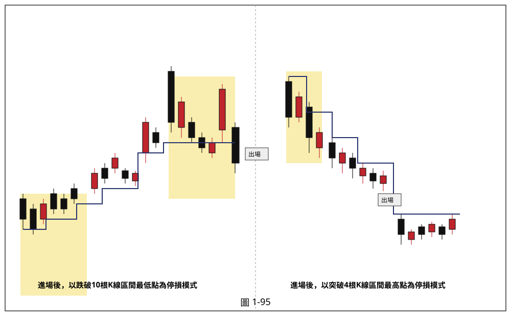

# 出場/停損模式（四種移動停損停利）

> 一句話摘要：本文件彙整書中四種可獨立於進場訊號使用的「移動停損停利」模式，供各操作方法在缺乏明確出場規則時引用；本文件本身不含進場訊號，須與具體方法的進場規則搭配使用。

## 1. 核心概念

作者強調停損是操作決斷力的展現，而非失敗的象徵：多頭趨勢的結構是「一底比一底墊高」，容易讓投資人誤以為「不用停損，撐著就會漲回來」，但當熱度到極點時人容易陷入樂觀而忽略風險，等真正意識到虧損擴大時往往已經捨不得停損（p.83）。停損執行後只有兩種結果：價格真的續跌（慶幸賣出）或價格又漲回去（覺得停損白做了），但沒有人能神準預測股價，連巴菲特也會判斷錯誤，重點在於「錯了就停損」（p.84）。

設定停損的方式可以是固定金額、固定百分比，或依切入點的狀況（訊號K線大小、幅度、與最近轉折點的距離、突破頸線的方式）制定；若停損讓人焦慮痛苦，代表操作規模過大，應縮小投入金額，讓停損損失控制在可承受範圍內（p.84）。停損的「移動」方式，書中列舉四種模式，作為移動停損停利的操作依據（p.84–85）。

## 2. 適用前提

- 本文件所述四種模式皆為「移動停損停利」機制：進場後，停損（多頭）或停利（若價格反向）位置會隨行情推進逐步調整，而非固定不動。
- 四種模式彼此獨立，各操作方法可依原文引用或未引用的方式自行選擇搭配；原文在 `gq-01-10`（首度漲停買進）與 `gq-01-11`（轉折點趨勢線突破訊號）中，多次提及「階梯出場模式」「K線慣性操作之突破幾天高」等出場方式，但未逐一指明對應本文件哪一模式，須讀者自行判斷（原文未明確對應）。
- 四種模式均分別說明多方（買進部位）與空方（放空部位）的鏡像規則。

## 3. 訊號定義（四種模式定義）

### 模式一：根據大K線之真實高低點為停損基礎（p.85–86，圖1-92）

- 多方：買進訊號出現後，以「大漲K線」（漲幅超過 **4%**）的「真實低點」（該K線最低點與前一日收盤價，兩者取其低）做為停損停利位置。行情推升過程中每出現一根新的大漲K線，即將停損位置移動到新的真實低點。持有至價格跌破移動停損線為止出場。
- 空方：以「大跌K線」（跌幅超過 **4%**）的「真實高點」（該K線最高點與前一日K線收盤價，兩者取其高）為停損位置。每出現新的大跌K線即向下移動停損。持有至K線收盤突破移動停損位置為止出場。
- 邏輯依據：大漲K線代表多方集結攻擊的成果，其最低點是多方防守底線，一旦被空方攻破，多頭氣勢受挫，可能轉入拉回整理；大跌K線代表空方氣盛壓著多方打，若多方反擊攻過大跌K線真實高點，放空應先回補（p.85–86）。

### 模式二：根據高低轉折點為移動基礎之停損停利模式（p.86–87，圖1-93）

- 採用層級 2 的高低轉折點（見 `gq-01-11` 對轉折點的定義）。
- 多方：以各個遞升的低轉折點為波谷，做為移動停損基礎；移動原則**只能調高、不能調低**——若新產生的低轉折點低於前一個低轉折點，仍沿用前一個（較高的）低轉折點為停損。持有至價格跌破該低轉折點為止出場。
- 空方：以各個遞降的高轉折點為波峰，做為移動停損基礎；移動原則**只能調低、不能調高**——若新產生的高轉折點高於前一個高轉折點，仍沿用前一個（較低的）高轉折點為停損。持有至價格突破該高轉折點為止出場。
- 邏輯依據：漲勢結構的慣性是「回檔不破前波低點」，跌勢結構的慣性是「反彈不過前波高點」（p.86）。

### 模式三：以二根K線區間之最高最低點為移動基礎之停損停利模式（p.87–88，圖1-94）

- 多方：進場時，以當根K線及其前一天K線兩者之最低價中取其低，做為初始停損點。此後每當價格出現「創新高之收盤價」且該K線「無遮蔽」（見 `gq-01-11` C5定義）時，比較該創新高K線與其前一天K線兩者的最低點，取其低者，將停損位置移動至此。持有至K線收盤價跌破移動停損點為止出場。
- 空方（鏡像）：以當根K線及其前一天K線兩者之最高價中取其高，做為初始停利點。每當價格出現創新低之收盤價（無遮蔽）時，比較該創新低K線與其前一天K線兩者的最高點，取其高者，移動停利點至此。持有至K線收盤價突破移動停利點為止出場。
- 原文提示：本法更詳細的介紹，請見作者另一著作《交易訊號之直覺操作》下冊第五章出場機制說明（p.88，本書未進一步展開）。

### 模式四：以N根K線區間之最高最低點做為移動停損停利位置之模式（p.88–89，圖1-95）

- 與模式三不同之處：**不限制**K線必須創新高或創新低才移動停損停利點；而是**每天都重新界定**「前N根K線區間」的最高點與最低點。
- 多方範例：以「前 10 根K線區間」的最低點為停損點，並在持有期間內**每日重新計算調整**前10根K線區間最低點，持有至K線收盤跌破為止出場。
- 空方範例：以「前 4 根K線區間」的最高點為停損停利基礎，逐日調整，持有至K線收盤突破為止出場。
- 特性：由於每日重新界定區間、不限定創新高低才移動，本模式的出場線**有時會出現「突升」的狀況**（區間內最低點可能因新K線加入而跳升）；四種方式中，只有本法容許此種突升現象（p.89）。
- N 值：書中範例採用 10（多方）與 4（空方），原文未說明 N 值選取的一般化準則，是否可自行調整未明確規定。

## 4. 進場

本文件不涉及進場規則。四種模式皆假設「已有一個多方或空方部位」，適用於已由其他方法（如 `gq-01-10`、`gq-01-11` 或其他訊號）產生進場訊號之後的停損／停利管理。

## 5. 停損

見「3. 訊號定義」中四種模式各自的停損位置計算方式。四種模式均為「移動停損」：
- 模式一：以最近一根大K線（漲跌幅超過4%）的真實高/低點移動。
- 模式二：以最近一個層級2轉折點移動（僅能朝有利方向調整，不利方向沿用舊值）。
- 模式三：以創新高/低且無遮蔽K線及其前一根K線的高低點孰低/孰高移動。
- 模式四：以固定N根K線區間的最高/最低點每日重新計算移動。

## 6. 出場 / 停利

四種模式本身即是停損兼停利機制：出場條件即為「價格觸及/突破/跌破移動後的停損停利線」，詳見上述各模式定義。書中未額外提供固定金額或固定點數的停利目標，出場完全依賴移動線本身。

## 7. 過濾：不做的情況

原文未針對四種模式本身列出額外的「不宜使用」情境或過濾條件；四種模式為出場管理工具，非進場濾網。使用者應自行依商品、週期特性選擇合適模式（原文未規定選用準則）。

## 8. 範例解析


- **圖 1-92**（p.85，示意圖）：左半「根據大漲K線真實低點做為移動基礎」，示範多方持倉時，隨每根大漲K線（漲幅>4%）出現，停損階梯依序上移（①至⑥）；右半「根據大跌K線真實高點做為移動基礎」，示範空方持倉時，隨每根大跌K線（跌幅>4%）出現，停損階梯依序下移（①至⑤），末端標示「出場點」。示範模式一之多空雙向規則。


- **圖 1-93**（p.86–87，示意圖）：左半「根據低轉折點移動的買進停損停利模式，移動點只准向上移」，標示①至⑨，其中④⑤兩點低轉折點相近時階梯延用不下修，示範模式二「只能調高不調低」；右半「根據高轉折點移動的放空停損停利模式，移動點只准向下移」，標示①至⑦，末端標示「出場」，示範模式二空方鏡像「只能調低不調高」（標示6高轉折點高於標示5卻沿用標示5，直到突破標示7才出場）。


- **圖 1-94**（p.87–88，示意圖）：左半「以進場後創新高無遮蔽K線及其前一根K線低點孰低為移動基礎」，標示①至⑨，末端「出場」；右半「以進場後創新低無遮蔽K線及其前一根K線高點孰高為移動基礎」，標示①至⑧，末端「出場」。示範模式三多空雙向規則。



- **圖 1-95**（p.88–89，示意圖）：左半「進場後，以跌破10根K線區間最低點為停損模式」，以黃色區塊標示「前10根K線區間」移動視窗（一在起漲段、一在高檔段），階梯隨視窗內最低點逐步上移，末端「出場」；右半「進場後，以突破4根K線區間最高點為停損模式」，以黃色區塊標示「前4根K線區間」移動視窗，階梯隨視窗內最高點逐步下移，末端「出場」。示範模式四多空雙向規則及「每日重新界定、可能突升」的特性。

## 9. 作者提醒與常見錯誤

- 若停損讓人焦慮痛苦，代表操作規模超過自己能承受的風險，應縮小投入金額而非放棄停損（p.84）。
- 停損不是為了「證明自己對錯」，而是操作長久經營的一環：「操作只在於觀察對的時候怎麼停利出場，和錯誤的時候怎麼處理，減少損失而已。」（p.84）
- 大多數投資人習慣一段一段小賺，卻因缺乏停損觀念，在一次空頭市場中把先前多次獲利全部賠回（p.83）。

## 10. 規則速查（Checklist）

- [ ] 已有明確的多方或空方部位（本文件不含進場規則）
- [ ] 選定四種模式之一作為出場管理方式
- [ ] 模式一：追蹤漲跌幅>4%的大K線真實高/低點，逐次移動停損
- [ ] 模式二：追蹤層級2轉折點，僅朝有利方向移動（多方只上移、空方只下移）
- [ ] 模式三：追蹤創新高/低且無遮蔽K線，與前一根K線比較孰低/孰高後移動
- [ ] 模式四：每日重新計算前N根K線區間最高/最低點並移動（N值依範例為10或4，可能突升）
- [ ] 持有至價格觸及/突破/跌破移動線為止出場

## 11. 機器可讀規則

```yaml
signal: 出場停損模式庫（無進場訊號，供其他方法引用）
side: both
timeframe: 不限
entry: 不適用（需搭配其他方法之進場規則）
exit_models:
  - id: model_1
    name: 大K線真實高低點移動停損
    long:
      desc: 以漲幅>4%大漲K線之真實低點（K線最低點與前一日收盤價孰低）為移動停損，逐次上移，跌破出場
      source: "p.85-86"
    short:
      desc: 以跌幅>4%大跌K線之真實高點（K線最高點與前一日收盤價孰高）為移動停損，逐次下移，突破出場
      source: "p.85-86"
  - id: model_2
    name: 高低轉折點移動停損停利
    long:
      desc: 以層級2低轉折點為移動停損，僅能調高不能調低，跌破出場
      source: "p.86-87"
    short:
      desc: 以層級2高轉折點為移動停損，僅能調低不能調高，突破出場
      source: "p.86-87"
  - id: model_3
    name: 二根K線區間高低點移動停損停利（創新高/低觸發）
    long:
      desc: 初始停損=進場K線與前一日K線最低點孰低；每次出現創新高且無遮蔽K線時，取該K線與前一日K線最低點孰低，移動停損，跌破出場
      source: "p.87-88"
    short:
      desc: 初始停利=進場K線與前一日K線最高點孰高；每次出現創新低且無遮蔽K線時，取該K線與前一日K線最高點孰高，移動停利，突破出場
      source: "p.87-88"
  - id: model_4
    name: N根K線區間高低點移動停損停利（每日重算）
    long:
      desc: 每日重新計算前N根K線區間最低點（範例N=10）為停損，跌破出場；不限創新高才移動
      source: "p.88-89"
    short:
      desc: 每日重新計算前N根K線區間最高點（範例N=4）為停損，突破出場；不限創新低才移動，允許停損線突升
      source: "p.88-89"
filters: []
```

## 12. 待確認事項

1. 模式三原文提示「更詳細介紹請見拙作《交易訊號之直覺操作》下冊第五章出場機制說明」（p.88），本書未展開細節，本文件僅依本書現有描述記錄，未跨書補充。
2. 模式四的 N 值（多方範例10、空方範例4）是否可依商品/週期調整，原文未提供一般化準則，僅以示意圖範例呈現。
3. `gq-01-10`、`gq-01-11` 兩份方法文件中提到的「階梯出場模式」「K線慣性操作之突破幾天高」等用語，與本文件四種模式的對應關係，原文未逐一明確指出，使用時需自行判斷比對（本文件不代為推論對應關係）。

## 13. 原文出處

- `extracted/pages/IMG_8621.md`（p.82–83，僅使用 p.83 第六節開頭段落；p.82 圖1-90/1-91 屬前一份文件範圍）
- `extracted/pages/IMG_8622.md`（p.84–85）
- `extracted/pages/IMG_8623.md`（p.86–87）
- `extracted/pages/IMG_8624.md`（p.88–89）
