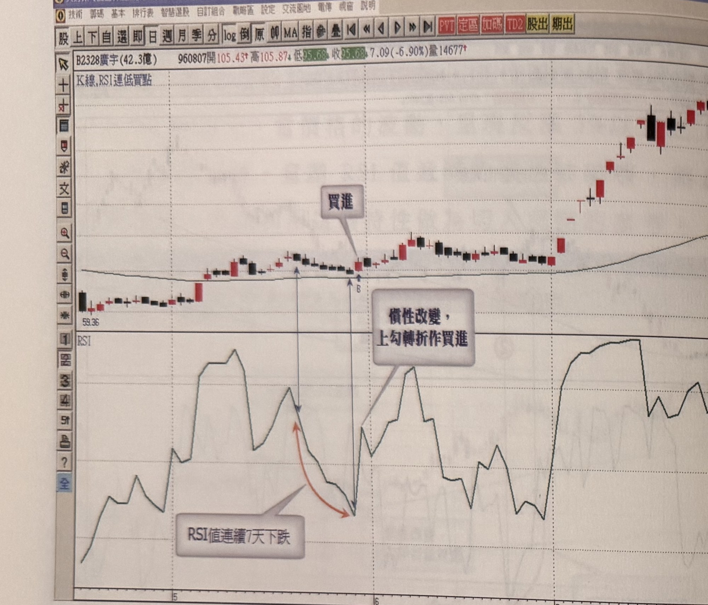
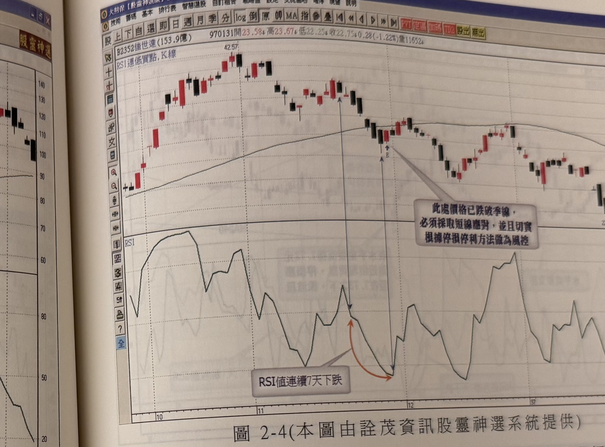

# RSI 連續下跌慣性改變買點（RSI 連低買點）

> 一句話摘要：多頭市場中，RSI 值連續遞減（含）6 天以上，隔天出現反漲 3% 以上的 K 線扭轉 RSI 向上時，代表下跌慣性被破壞，形成回檔結束、漲勢重啟的買進訊號。

## 1. 核心概念

RSI 值從某個數值上漲或下跌到目標區，過程中通常會中途折返，不會毫無停頓地直接抵達目標區（p.91）。在季線與年線皆朝上發展的多頭市場中，若某波峰開始回檔修正，RSI 數值呈現連續性下跌（低於前一日的慣性持續不斷），這種下跌慣性一旦持續達 6 天（含）以上，當價格出現反漲 3% 以上的 K 線、扭轉 RSI 值反轉向上時，意謂 RSI 遞減的慣性已被破壞，是重要的反轉訊號，可作為切入買點的參考（p.92）。

## 2. 適用前提

- 標的須處於多頭市場：季線及年線皆朝上發展（p.92）。
- 訊號出現於「波峰之後的回檔修正」階段，而非任意時點的 RSI 下跌（p.92）。
- 多頭走勢中的回檔，RSI 值不一定會跌到超賣區 20 以下；強勢股拉回低點常落在 50～30 之間，RSI 殺到 20 以下代表回檔時間及幅度較深（p.93）。

## 3. 訊號定義

1. C1：標的處於多頭市場（季線、年線皆朝上）（p.92）。
2. C2：自波峰回檔以來，RSI 數值連續遞減（每日低於前一日）達 **6 天（含）以上**（p.92）。
3. C3：出現一根漲幅 **3% 以上** 的反漲 K 線，使 RSI 由跌轉漲，扭轉原本的下跌慣性（p.92）。
4. 書中多數範例實際連續下跌天數為 7 天（圖 2-1、2-2、2-6、2-8、2-9 等），也有 8、9、10、13、18 天的案例（圖 2-7、2-8、2-9），顯示 C2 的「6 天」為最低門檻，非固定天數（p.92–98）。

## 4. 進場

書中僅描述「隔天出現反漲 K 線扭轉 RSI」即構成買進訊號（p.92），未逐字說明進場價位。依全章其餘 RSI 訊號一致的操作邏輯（如 p.99：可在當根 K 線收盤進場）推定：於扭轉 RSI 的反漲 K 線**收盤進場**（推論）。

## 5. 停損

- 圖 2-3（廣宇）範例明確提出：訊號出現後，**可以最大 7% 為初始停損**，並可「隨時行情發展採取四種移動停損停利模式加以觀察」；書中在本節僅提及「四種移動停損停利模式」之名稱，未展開說明其內容（p.94）。
- 圖 2-5（智寶）範例：若訊號出現在重要**水平支撐**位置，可以「過去水平重要支撐最低點下方」為停損進場；若 K 線下影線曾跌破水平支撐但收盤未跌破，則以其**下影線下方一檔**為停損（p.96）。
- 圖 2-4（佳世達）範例提醒：若股價已跌破季線、且自峰頂回檔超過 3 成以上，即使訊號出現，彈升空間也不宜期待過大，**停損動作務必確實執行**，以免誤判偏多而套牢（p.95）。

## 6. 出場 / 停利

原文未規定。本節僅提及可搭配「四種移動停損停利模式」（名稱見 p.94），但未在本節展開具體規則。

## 7. 過濾：不做的情況

原文未明確列出獨立的「不做」條件，僅提出以下情境須提高警覺、嚴設停損（非絕對排除）：

1. 股價已達潛在頭部區：頂峰爆量、且自峰頂回檔超過 30% 以上、並跌破季線，此時即使 RSI 連續下跌超過 6 天以上出現訊號，切入仍須特別小心，彈升幅度不宜看多（p.95）。
2. 頭部特徵之一是爆量後拉回不縮量（代表籌碼凌亂）；相對地，若爆量在先、拉回量能不斷萎縮並在前一波重要低點獲得支撐，代表籌碼安定收攏，此類情況下的訊號可信度較高（p.96）。

## 8. 範例解析


- **圖 2-1**（瑞昱 2379，p.92）：96 年 9 月底回檔，標示①至②區間 RSI 連續下跌，②處止穩並出現反漲 K 線（B 買進點），此後漲勢重新展開。


- **圖 2-2**（創見 2451，p.93）：峰頂回檔至標示 2，RSI 連續下跌 7 天，隔天出現大漲 K 線，視為波段行情買進訊號。


- **圖 2-3**（廣宇 2328，p.94）：RSI 從 78 連續下跌 7 天至 35 附近（未觸及超賣區 20），隔天出現大漲 K 線，形成買進訊號；訊號後行情先橫向盤整集結動能，7 月才發動狂飆走勢，示範 7% 初始停損搭配移動停損停利的必要性。


- **圖 2-4**（佳世達 2352，p.95）：股價跌破季線、回檔逾 3 成後才出現 RSI 連續下跌 7 天＋隔天大漲 K 線的訊號，買進後行情僅反彈至季線便重新下殺，示範停損確實執行的重要性。


- **圖 2-5**（智寶 2375，p.96）：爆量見頂後下殺至前一波低點 7.73 元之上，RSI 連續下跌 7 天後反漲，在重要水平支撐位置出現訊號，示範以水平支撐下方為停損。


- **圖 2-6**（聯強 2347，p.97）：RSI 連續下跌 7 天後於低檔轉折，隔天大漲確認買點，其後行情大幅走高。


- **圖 2-7**（四檔組合：中華化 1727／力肯 1570／吉祥全 2491／另一檔，p.97）：分別為 RSI 連續下跌 7、8、13 天等案例，皆於轉折點標示「慣性改變，上勾轉折做買進」。


- **圖 2-8**（四檔組合：東鹼 1708／艾訊 3088／佳必琪 6197／泰偉 3064，p.98）：RSI 連續下跌天數分別為 9、7、8、7 天，皆為買進訊號範例。


- **圖 2-9**（四檔組合：台肥 1722／安茂 3188／台塑化 6505／北基 8927，p.98）：RSI 連續下跌天數分別為 7、18、7、10 天，其中安茂 18 天為本節最長案例。

## 9. 作者提醒與常見錯誤

- RSI 連續下跌不一定會觸及超賣區 20，強勢股拉回低點常落於 50～30 之間，不宜堅持等 RSI 到 20 以下才承認訊號有效（p.93–94）。
- 判斷頭部風險時，應同時觀察「回檔幅度是否超過 30%」與「是否跌破季線」；即使季線仍朝上，只要價格重挫超過 3 成且季線一旦跌破，操作應轉趨保守（p.95）。
- 爆量後的量縮／量不縮，是分辨「假頭部（籌碼安定）」與「真頭部（籌碼凌亂）」的重要線索（p.96）。

## 10. 規則速查（Checklist）

- [ ] 標的處於多頭市場（季線、年線皆朝上）
- [ ] 自波峰回檔以來 RSI 連續遞減達 6 天（含）以上
- [ ] 出現反漲 3% 以上的 K 線，扭轉 RSI 下跌慣性
- [ ] （進場，推論）於扭轉 K 線收盤進場
- [ ] 停損：最大 7%，或水平支撐（下影線）下方一檔
- [ ] 留意頭部風險（爆量＋回檔逾 30%＋跌破季線）時應嚴設停損

## 11. 機器可讀規則

```yaml
signal: RSI連續下跌慣性改變買點
side: long
timeframe: daily
indicator: RSI, 季線, 年線
conditions:
  - id: C1
    desc: 標的處於多頭市場（季線、年線皆朝上）
    source: p.92
  - id: C2
    desc: 自波峰回檔以來RSI連續遞減（每日低於前一日）達6天（含）以上
    source: p.92
  - id: C3
    desc: 出現反漲3%以上之K線，使RSI由跌轉漲（慣性被打破）
    source: p.92
entry:
  trigger: C1+C2+C3成立
  price: 扭轉K線收盤進場（推論，比照本章其他RSI訊號的一致做法）
  source: p.92, p.99（推論依據）
stop_loss:
  method_1: { points: "最大7%" , source: "p.94" }
  method_2: { desc: "水平支撐最低點下方（或下影線下方一檔，若曾跌破支撐但收盤未破）", source: "p.96" }
exit: 原文未規定（僅提及「四種移動停損停利模式」之名稱，未展開說明，p.94）
filters:
  - desc: 股價已達潛在頭部區（爆量＋回檔逾30%＋跌破季線）時，彈升空間不宜看多，須嚴設停損
    source: p.95
  - desc: 爆量後拉回量不縮，代表籌碼凌亂，訊號可信度較低；拉回量縮並於前波低點獲支撐則可信度較高
    source: p.96
```

## 12. 待確認事項

無重大待確認事項；本章節範圍內頁碼皆有對應照片，規則亦皆有明確頁碼出處。

## 13. 原文出處

- `extracted/pages/IMG_8625.md`（p.91）
- `extracted/pages/IMG_8626.md`（p.92–93）
- `extracted/pages/IMG_8627.md`（p.94–95）
- `extracted/pages/IMG_8628.md`（p.96–97）
- `extracted/pages/IMG_8629.md`（p.98）
