# RSI 低值買點及背離買點

> 一句話摘要：RSI 觸及超賣區 20 以下時，若配合出現漲幅超過 5% 的大漲 K 線，可在當根 K 線收盤直接進場，不受「收盤須突破 RSI 最低值 K 線最高點」的傳統濾網限制；若第二個低點價格創新低但 RSI 未同步創新低，則構成背離，仍沿用同一套進場規則。

## 1. 核心概念

RSI 觸及超賣區 20 以下、出現漲幅超過 5% 的紅 K 線時，原本的濾網要求「收盤須突破 RSI 最低值 K 線之最高點」才能進場，但若當天（或隔天）出現大漲 K 線，可以在當根 K 線收盤直接進場，不必受先前濾網限制（p.99）。這種「超賣區見大漲 K 線」的訊號在空頭走勢中用來搶短線反彈買進，可靠度極高：空頭走勢中賣壓沉重，人氣低迷使多頭作價無法匯集買氣突圍，只有大漲 K 線才能引來空頭回補及帽客助陣，每個波段低點的宣示動作也只有靠大漲 K 線才能產生像樣的反彈行情（p.99）。

當指標出現「背離」——即價格創新低但 RSI 未同步創新低——往往被視為底部到達的徵兆，但背離本身**不保證反轉趨勢**；背離現象發生的次數也不構成任何保證。唯一可行的操作方式，仍是在每次 RSI 觸及超賣區配合大漲 K 線出現時，將其視為反彈測試進場，而非直接論定為趨勢反轉（p.103）。

## 2. 適用前提

- 不論多頭或空頭趨勢皆可適用本訊號，但在多頭走勢中，價格回檔通常不易觸及超賣區（p.104）。
- 若均線呈多頭排列，本訊號在選股上亦具重要參考價值（p.104）。
- 在空頭走勢的反彈操作中，務必了解「空頭並沒有結束」，訊號僅供搶反彈參考，非趨勢反轉的保證（p.100）。

## 3. 訊號定義

### 3.1 RSI 低值買點（主要訊號）

1. C1：RSI 指標值觸及**超賣區 20 以下**（p.99）。
2. C2：配合出現漲幅超過 **5%** 的紅 K 線（大漲 K 線）（p.99）。
3. C3：滿足 C1、C2 時，可在**當根 K 線收盤**直接進場，不受「收盤須突破 RSI 最低值 K 線最高點」的傳統濾網限制（p.99）。
4. 書中亦提及傳統濾網法（非本節重點，僅作對照）：正常情況下須等收盤價突破「RSI 最低值當根 K 線」的最高價才進場，訊號會落在 RSI 最低值出現後的第二天以後（p.102，原著《操作進行曲》提出，本書未重複展開細節）。

### 3.2 RSI 背離買點（在 3.1 前提下的延伸型態）

1. D1：背離起始點（圖左）：價格為前波谷點，且對應之 RSI 值必須在**超賣區 20 以下**（p.104）。
2. D2：背離對應點（圖右）：價格以**收盤價**跌破前波谷點收盤價（若僅下影線跌破而收盤未跌破，不適宜認定為背離，因指標多以收盤價計算），但對應之 RSI 值**未創新低**（高於起始點 RSI 值），對應點的 RSI 值本身**無須**低於 20（p.104）。
3. D3：背離對應點若同時滿足 3.1 的 C1、C2（即該點 RSI 亦觸及 20 以下並配合大漲 K 線），則以同一套進場規則（當根 K 線收盤進場）操作；背離型態本身不改變進場規則，僅是確認訊號的輔助觀察（p.101、p.104）。

## 4. 進場

- 滿足 3.1 之 C1＋C2 時，於**大漲 K 線當根收盤**進場（p.99）。
- 進場後之後續判斷：若買進後在未出現出場訊號（見第 6 節）之前，價格已突破前波反彈高點，代表該部位有可能是波段長多買點（即空頭轉多頭走勢的訊號）；反之若在突破前高之前即觸發出場訊號，僅代表反彈測試失敗，趨勢未變（p.103）。

## 5. 停損

- 以**最大 7%** 為停損幅度，或以**最近谷點位置**為停損（書中列出兩種選項，未言明優先取捨方式）（p.100）。

## 6. 出場 / 停利

- 出場規則（全節反覆重申的同一條規則）：當**後續某根 K 線收盤價跌破前一天 K 線最低點**時，應採取停利／停損出場動作，甚至可考慮反手放空；不宜戀戰（p.100、p.101、p.102）。
- 書中未進一步說明其他固定停利目標。

## 7. 過濾：不做的情況

1. RSI 觸及 20 以下，但**未配合大漲 K 線（≥5%）**，不是搶進的買點，不做（p.100，圖 2-11 標示 2、3、5）。
2. 背離的起始點若 RSI 未達超賣區 20 以下，不構成有效背離起始點（p.104）。
3. 價格新低的認定須以**收盤價**跌破前波谷點收盤價為準；若僅下影線跌破而收盤未跌破，不適宜作為背離判定的依據（p.104）。

## 8. 範例解析

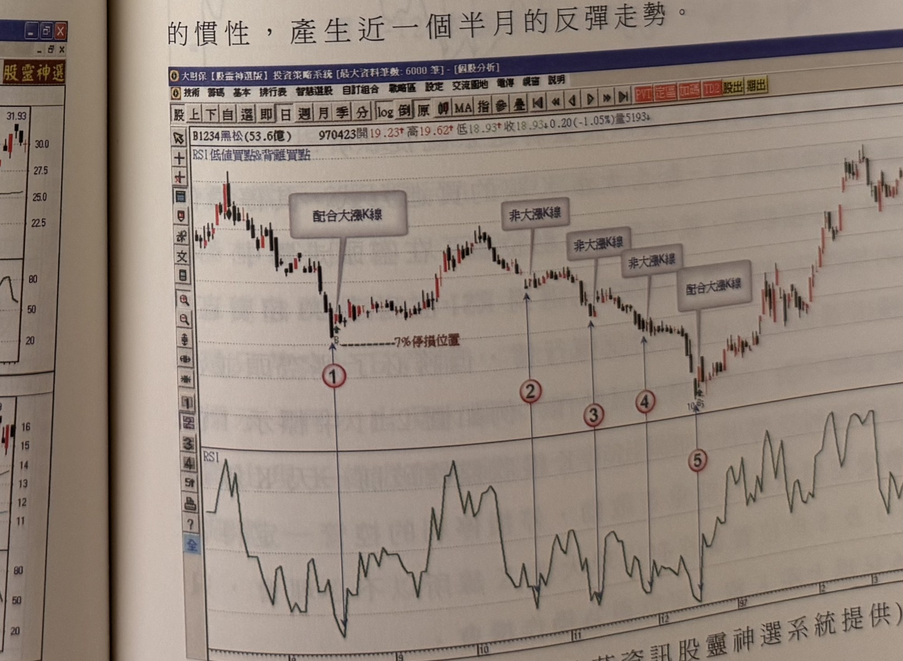
- **圖 2-10**（黑松 1234，p.99）：96 年 7 月見頂下殺，標示①（配合大漲 K 線，7% 停損位置線標示）為買進訊號，標示②③④皆非大漲 K 線不做，標示⑤配合大漲 K 線再度觸發買進，其後展開約一個半月反彈。

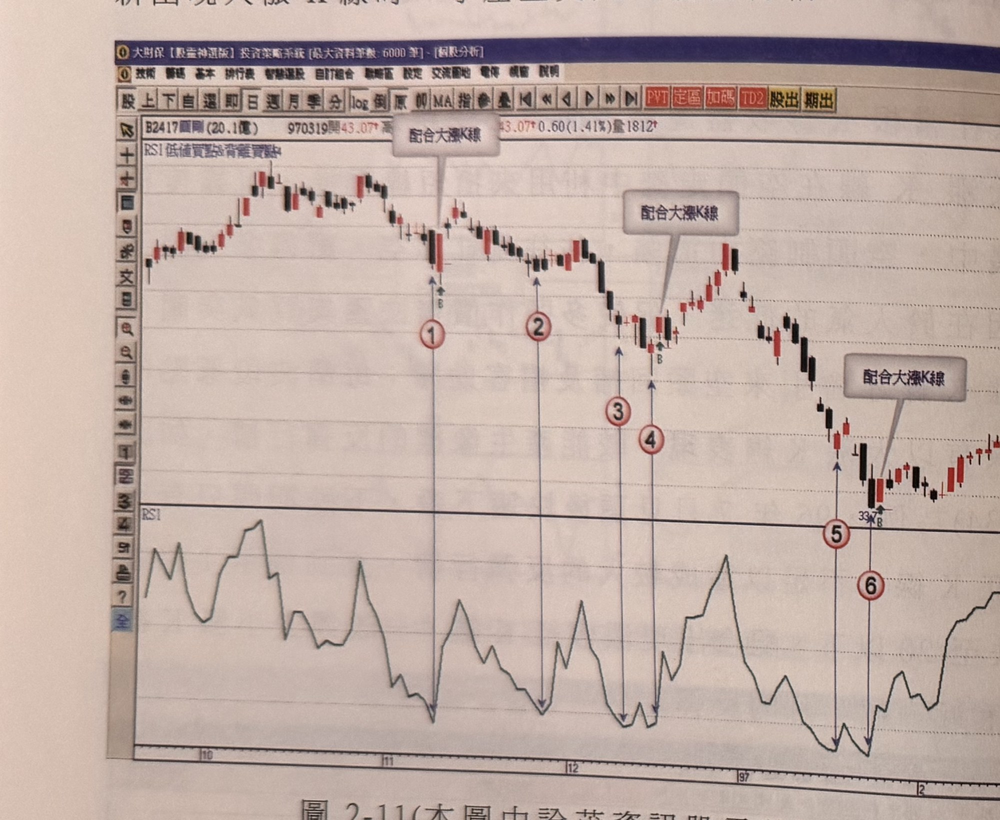
- **圖 2-11**（圓剛 2417，p.100）：標示①④⑥配合大漲 K 線為有效訊號，標示②③⑤未配合大漲 K 線忽略；示範標示 1 搶進後遇 K 線收盤跌破前一天最低點須停損的情況。

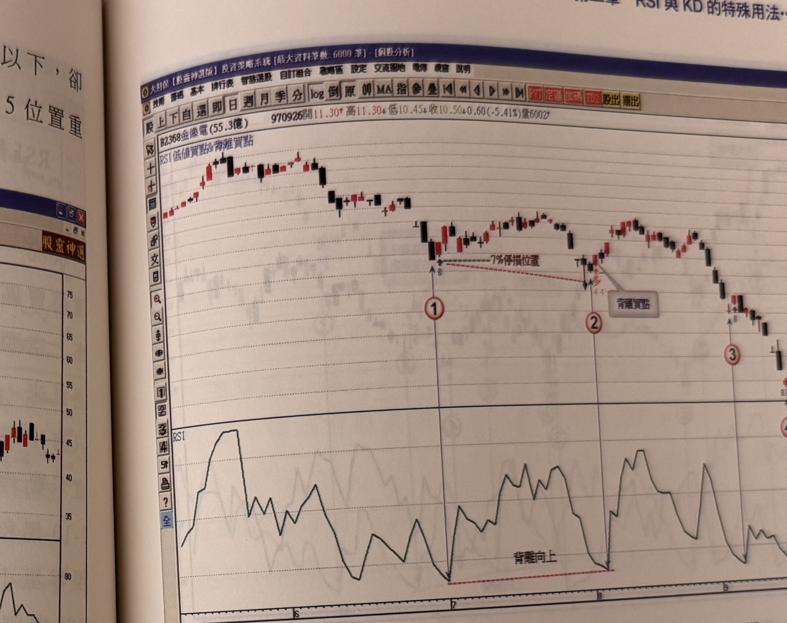
- **圖 2-12**（金像電 2368，p.101）：標示①為 RSI＜20＋大漲 K 線的買進訊號；標示②價格創新低但 RSI 未創新低，形成「背離向上」，同樣符合 RSI＜20＋大漲 K 線的買訊要求。

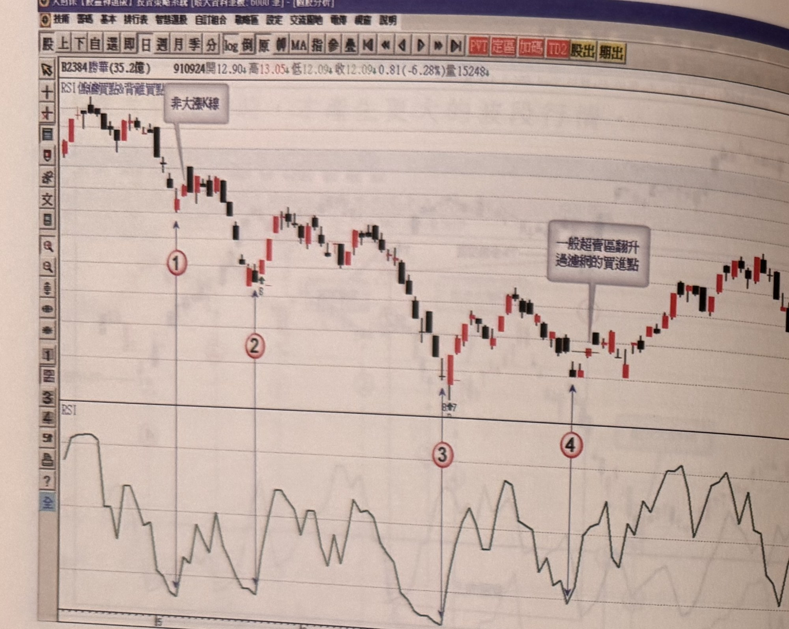
- **圖 2-13**（勝華 2384，p.102）：標示①為非大漲 K 線不構成買訊；標示②③④皆符合條件（含濾網結構對照說明），出場採 K 線收盤跌破前一天最低點的策略，甚至可反手放空。

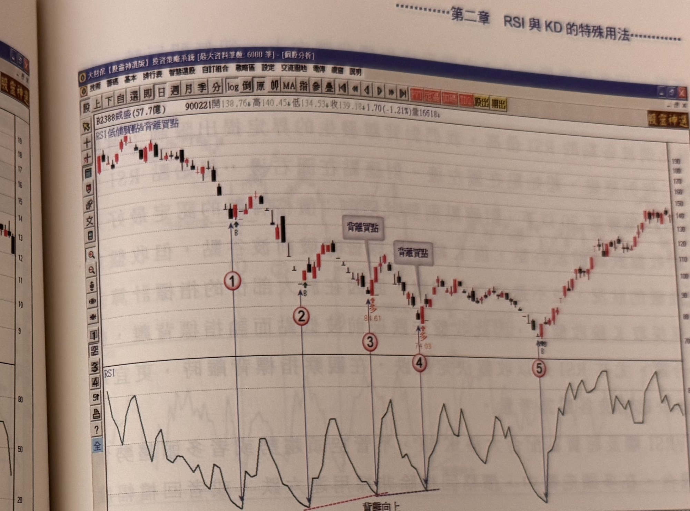
- **圖 2-14**（威盛 2388，p.103）：標示①至④買進後在未過前波反彈高點前即觸及出場訊號（跌破前一天最低點），僅為反彈測試；標示⑤（背離買點）買進後在未觸及出場訊號前已突破前波反彈高點，形成空頭轉多頭的波段行情。

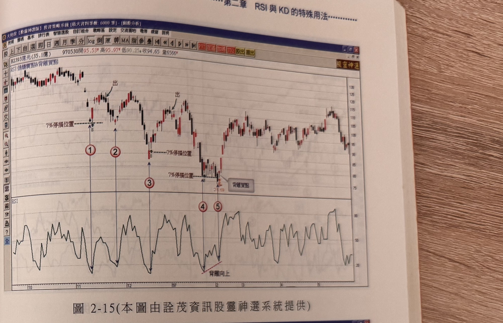
- **圖 2-15**（億光 2393，p.105）：標示 1～3 為一般 RSI＜20＋大漲 K 線訊號；標示 4、5 對應之低點與標示 3 之間形成 RSI「背離向上」，價位 78.69 附近為背離買點。

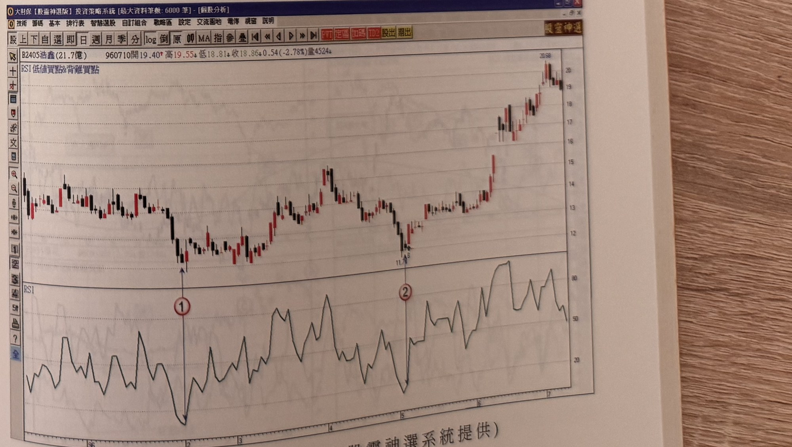
- **圖 2-16**（浩鑫 2405，p.105）：標示 1、2 為 RSI 低值買點案例，兩者皆低於超賣區 20，其後行情反彈走高。

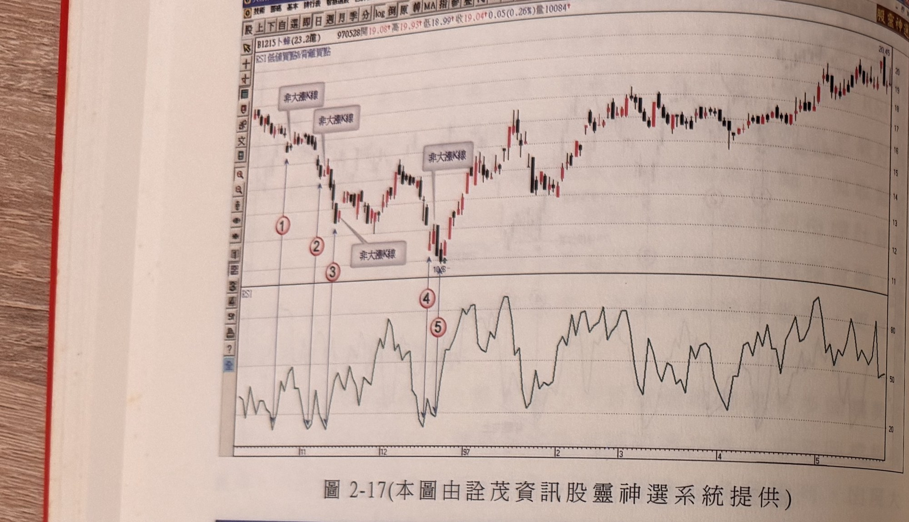
- **圖 2-17**（卜蜂 1215，p.106）：標示 1～3 為「非大漲 K 線」不構成買訊，標示 4、5（全圖最低點）亦標示「非大漲 K 線」，示範多次不符合條件、不做的情況。

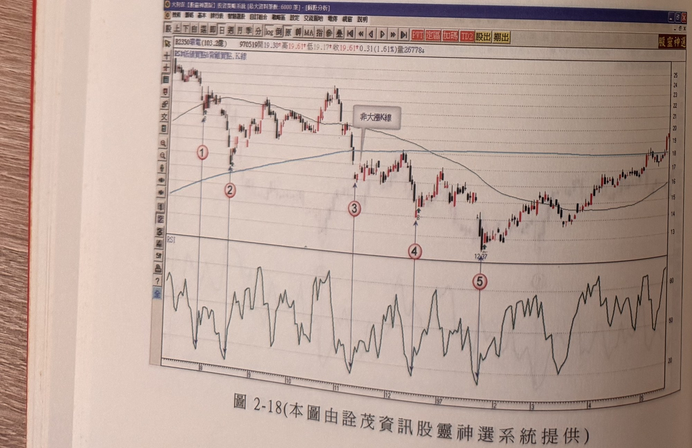
- **圖 2-18**（環電 2350，p.106）：標示 1～5 中，標示 3 為「非大漲 K 線」不構成買訊，其餘標示逐步遞減的 RSI 低點走勢，最低點對應標示 5。

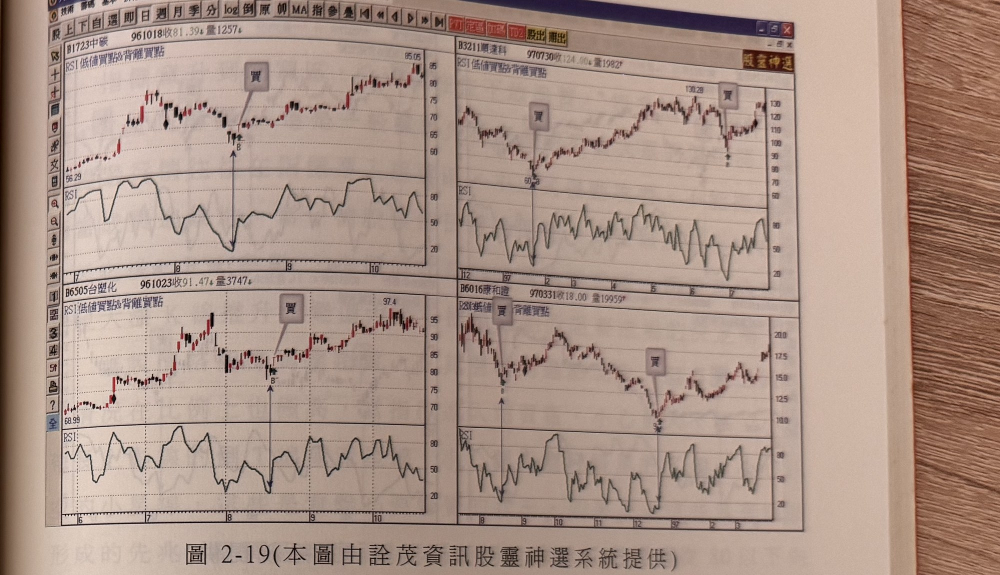
- **圖 2-19**（四檔組合：中碳 1723／順達科 3211／台塑化 6505／康和證 6016，p.107）：分別示範 RSI 低值（約 20）配合大漲 K 線標示「買」的訊號。

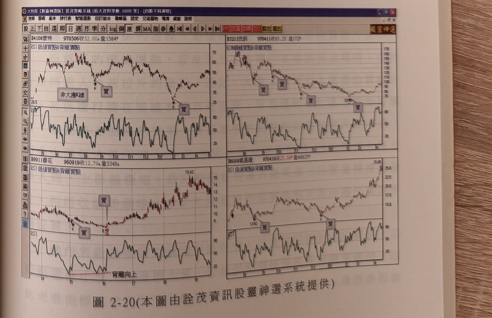
- **圖 2-20**（四檔組合：懷特 4108／茂訊 3213／櫻花 9911／凱基證 6008，p.107）：懷特案例含「非大漲 K 線」與「買」訊號對照；櫻花案例低點以紅色虛線標示「背離向上」。

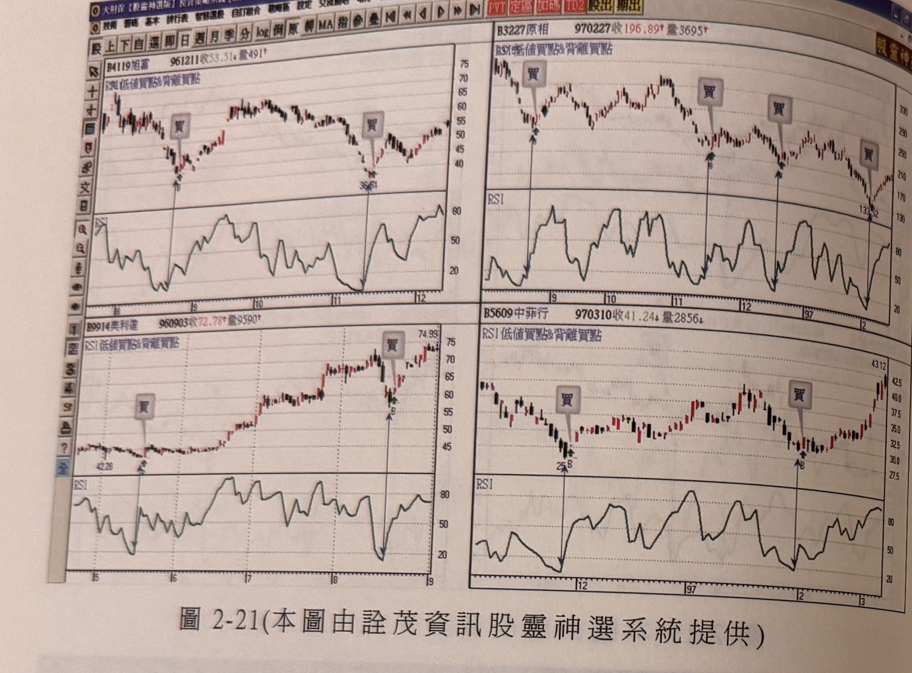
- **圖 2-21**（四檔組合：旭富 4119／原相 3227／美利達 9914／中菲行 5609，p.108）：分別示範多組「買」訊號位置，皆對應 RSI 低點約 20～50 之間。

## 9. 作者提醒與常見錯誤

- 背離不代表反轉趨勢的保證；若空頭趨勢中反彈始終過不了前波反彈高點，表示跌勢慣性沒有被破壞，不能武斷認定趨勢已經見底反轉（p.103）。
- 背離發生的次數本身也不構成任何保證，唯一可行的操作依據仍是「RSI 觸及超賣區配合大漲 K 線」的反彈測試邏輯（p.103）。
- 指標背離的判定應以收盤價為準（因 RSI 等指標多以收盤價計算），不應以下影線的瞬間穿破作為背離依據（p.104）。

## 10. 規則速查（Checklist）

- [ ] RSI 觸及超賣區 20 以下
- [ ] 配合出現漲幅 ≥5% 的紅 K 線（大漲 K 線）
- [ ] 當根 K 線收盤進場（不受傳統濾網限制）
- [ ]（背離型態，選用）起始點 RSI ≤20，對應點收盤創新低但 RSI 未創新低
- [ ] 停損：最大 7%，或最近谷點位置
- [ ] 出場：後續某日 K 線收盤跌破前一天 K 線最低點

## 11. 機器可讀規則

```yaml
signal: RSI低值買點及背離買點
side: long
timeframe: daily
indicator: RSI
conditions:
  - id: C1
    desc: RSI指標值觸及超賣區20以下
    source: p.99
  - id: C2
    desc: 配合出現漲幅超過5%的紅K線（大漲K線）
    source: p.99
  - id: D1
    desc: （背離型態）起始點須為前波谷點，對應RSI值在超賣區20以下
    source: p.104
  - id: D2
    desc: （背離型態）對應點收盤跌破前波谷點收盤價，但對應RSI值未創新低
    source: p.104
entry:
  trigger: C1+C2成立（大漲K線出現）
  price: 大漲K線當根收盤進場，不受「收盤突破RSI最低值K線最高點」之傳統濾網限制
  source: p.99
stop_loss:
  method_1: { points: "最大7%", source: "p.100" }
  method_2: { desc: "最近谷點位置", source: "p.100" }
exit:
  trigger: 後續K線收盤價跌破前一天K線最低點
  note: 出場時亦可考慮反手放空
  source: p.100, p.101, p.102
filters:
  - desc: RSI觸及20以下但未配合大漲K線（≥5%），不是買點
    source: p.100
  - desc: 背離起始點若RSI未達超賣區20以下，不構成有效背離起始點
    source: p.104
  - desc: 價格新低須以收盤價跌破前波谷點收盤價認定，下影線跌破但收盤未破不適用
    source: p.104
```

## 12. 待確認事項

無重大待確認事項；本章節範圍內頁碼皆有對應照片，規則亦皆有明確頁碼出處。

## 13. 原文出處

- `extracted/pages/IMG_8629.md`（p.99）
- `extracted/pages/IMG_8630.md`（p.100–101）
- `extracted/pages/IMG_8631.md`（p.102–103）
- `extracted/pages/IMG_8632.md`（p.104–105）
- `extracted/pages/IMG_8633.md`（p.106–107）
- `extracted/pages/IMG_8634.md`（p.108）
