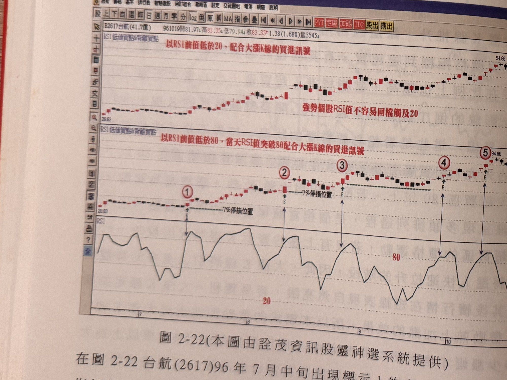
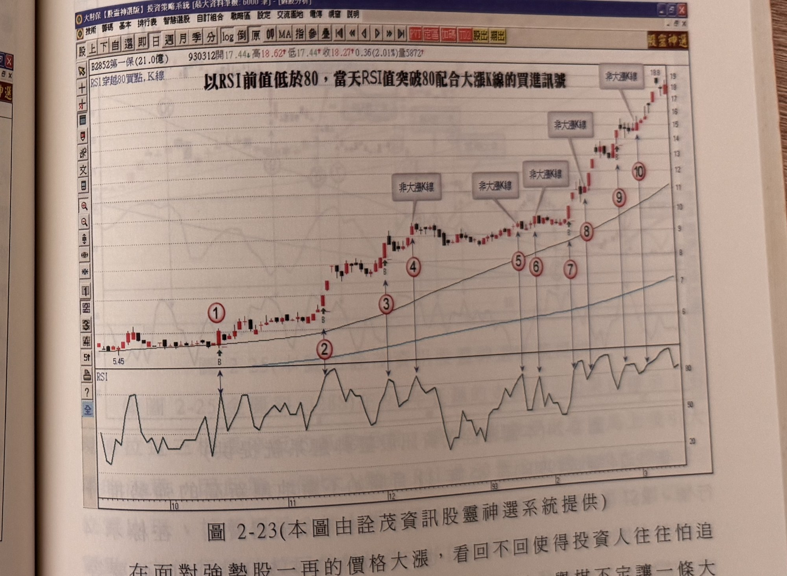
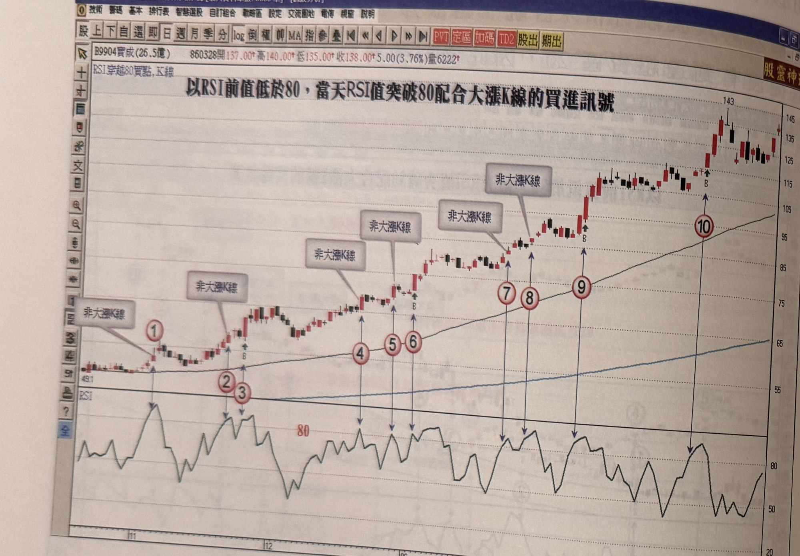
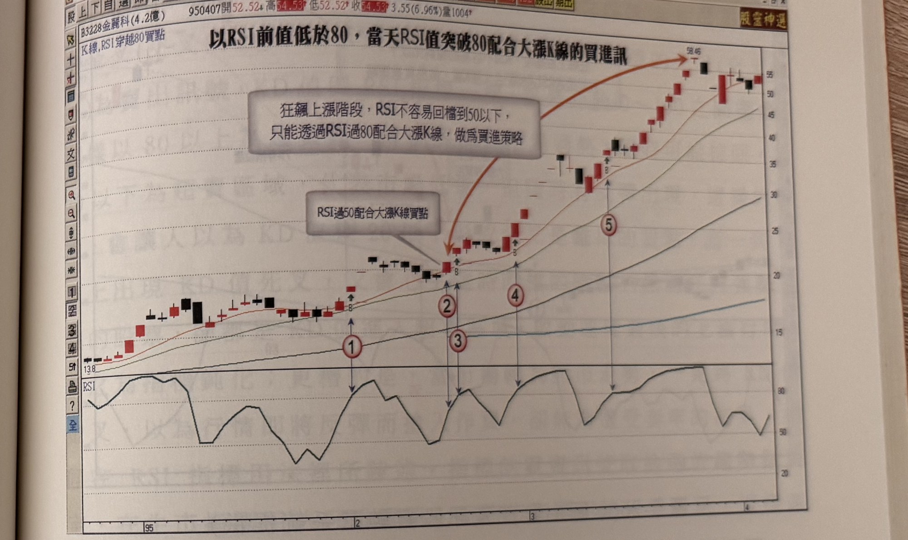

# RSI 穿越 80（及穿越 50）配合大漲 K 線買點

> 一句話摘要：強勢股走勢中 RSI 常鈍化滯留高檔、不易拉回超賣區，改以「RSI 前值低於 80、當天穿越 80」（或行情初起時「RSI 前值低於 50、當天穿越 50」）配合大漲 K 線（漲幅 ≥5%）作為切入買點，以真實低點下方一檔為停損。

## 1. 核心概念

指標進入超買區雖有潛在過熱疑慮，但事實上鈍化的比例極高：當一檔股票每日緩步推升、甚至漲幅甚小，RSI（短參數）就可能觸及超買區；若因指標過熱而不敢進場，往往錯失行情。只要沒有出現量大不漲、長上影線倒 T 線或流星線、開高收長黑 K 線、跳空小星線等短頭形成的先兆，超買區都應視為安全無虞，可將「RSI 由 80 以下向上穿越 80、配合大漲 K 線」視為買點，這在均線呈多頭排列的過程中是簡單實用的找買點方法（p.109）。

一檔強勢股在推升過程中並不容易拉回觸及 50 以下、甚至下探 20；若堅持等 RSI 回落至超賣區才進場，將可能錯失最大波段行情。因此面對強勢股，應改用「RSI 值穿越超買區 80，配合大漲 K 線」的方式切入（p.110）。

## 2. 適用前提

- 適用於均線呈多頭排列的強勢股／飆股（p.109、p.111）。
- 大漲 K 線之定義：漲幅超過 **5%** 以上，上影線極短，**最好收盤收在當日最高價**（p.109）。
- 超買區出現下列警示型態時，不應視為安全無虞：量大不漲、長上影線的倒 T 線或流星線、開高盤收長黑 K 線、跳空的小星線（p.109）。

## 3. 訊號定義

### 3.1 主要訊號：RSI 穿越 80 買點

1. C1：RSI 前一日數值 **低於 80**（尚未達超買）（p.110、p.112 圖說）。
2. C2：當日 RSI 數值向上**穿越 80**（進入超買區）（p.109–110）。
3. C3：當日 K 線為大漲 K 線：漲幅 **>5%**，上影線極短，收盤最好收在當日最高價（p.109）。
4. 三條件同時成立 → 買進訊號，可在收盤前進場（p.109）。

### 3.2 輔助（較早期）訊號：RSI 穿越 50 買點

用於強勢股飆漲初期、RSI 尚未到達 80 之前的優先切入點；書中將此列為與 3.1 同一套「強勢股切入工具」的一部分，共用大漲 K 線定義與停損邏輯（p.113–114）。

1. C1'：RSI 由低檔向上（重新）穿越 **50**（p.113 圖說：「RSI 過 50 配合大漲 K 線買點」；p.114：「利用 RSI 值下殺破 50 後，重上 50 配合大漲 K 線做切入買進」）。
2. C2'：當日 K 線為大漲 K 線（定義同 3.1 之 C3）（p.114）。
3. 若此買點錯過，才轉為利用 3.1 之「RSI 穿越 80」機會切入（p.114）。

## 4. 進場

- 大漲 K 線出現時，**收盤前進場**（p.109）。

## 5. 停損

- 以**大漲 K 線的真實低點下方一檔**位置為停損（p.109、p.111、p.113）。
- 特殊情況（如連續漲停的飆股，真實低點難以作為有效停損參考時）：可改以**一根停板**為停損（p.114，圖 2-26 海德威案例）。

## 6. 出場 / 停利

原文未規定固定停利目標。書中僅重申停損觸發即出場：「只要狀況不對，K 線收盤跌破停損位置，跳車快逃，不必多作思考」（p.113）。

## 7. 過濾：不做的情況

1. 訊號 K 線若**非大漲 K 線**（未達 5% 漲幅或不符上影線短、收最高的條件），即使 RSI 穿越 80，也不宜視為有效買點，後續容易被真實低點跌破而停損（p.111–112，圖 2-23 標示 4、5；圖 2-24 全部標示皆非大漲 K 線，故無有效買點）。
2. RSI 進入超買區時，若出現量大不漲、長上影線倒 T 線或流星線、開高收長黑 K 線、跳空小星線等短頭先兆，不應視為安全的超買買點（p.109）。

## 8. 範例解析


- **圖 2-22**（台航 2617，p.110）：標示 1～5 皆為 RSI 前值低於 80、當日突破 80 配合大漲 K 線的買進訊號，逐次墊高且未再回落至 RSI 20 以下，示範強勢股「RSI 不易回檔觸及 20」的特性。


- **圖 2-23**（第一保 2852，p.111）：標示 1、2、3、7、9 符合大漲 K 線要求、有效；標示 4、5 非大漲 K 線，後續遭真實低點跌破停損，示範過濾規則。


- **圖 2-24**（寶成 9904，p.112）：85 年 11 月起強勢推升行情，RSI 幾乎不曾下探超賣區，圖中標示 1～6 皆為「非大漲 K 線」不構成有效買點，示範「即使強勢股，仍須配合大漲 K 線」的過濾規則。


- **圖 2-25**（金麗科 3288，p.113）：標示 1 為連拉三根漲停之初期（未即時吸引大眾），標示 2 為 RSI 過 50 配合大漲 K 線的第一個切入點，標示 3 為 RSI 穿越 80 配合大漲 K 線的第二個切入點，其後行情拉回已無法使 RSI 回探 50，標示 4、5 則須以「RSI 過 80 大漲 K 線」方式切入，示範 3.1 與 3.2 兩套訊號銜接使用。


- **圖 2-26**（海德威 3268，p.114）：連續 7 根漲停後，以「RSI 破 50 後重上 50 配合大漲 K 線」（標示 2）為最佳切入點；若錯過，則以「RSI 穿越 80 大漲 K 線」（標示 3、4）切入，並以一根停板為停損。

## 9. 作者提醒與常見錯誤

- 操作者最忌預設立場判斷行情：RSI 同樣到達超買區，可能是連續小漲或連續大漲所致，僅看指標高低不足以判斷買或不買，須同時參照走勢圖形（p.109）。
- 投資人面對強勢股常「怕追高怕套牢，等拉回又認為行情已反轉」，因而錯失行情；應改以「配合大漲 K 線」的方式，而非以指標過熱與否作為進場禁令（p.111）。
- 要搭上快速上漲的個股，不須擔心指標值過熱，只要 K 線品質屬於大漲 K 線，應勇於進場操作（p.112）。

## 10. 規則速查（Checklist）

RSI 穿越 80 買點：
- [ ] RSI 前一日 <80
- [ ] 當日 RSI 穿越 80
- [ ] 當日為大漲 K 線（漲幅 >5%、上影線極短、收盤近最高價）
- [ ] 收盤前進場

RSI 穿越 50 買點（輔助）：
- [ ] RSI 由低檔重新穿越 50
- [ ] 當日為大漲 K 線

共通：
- [ ] 停損：大漲 K 線真實低點下方一檔（或連續漲停時以一根停板為停損）
- [ ] 排除：超買區出現量大不漲／倒T線／流星線／開高收長黑／跳空小星線

## 11. 機器可讀規則

```yaml
signal: RSI穿越80（或50）配合大漲K線買點
side: long
timeframe: daily
indicator: RSI
conditions:
  - id: C1
    desc: RSI前一日數值低於80
    source: p.110
  - id: C2
    desc: 當日RSI數值向上穿越80
    source: p.109-110
  - id: C3
    desc: 當日K線為大漲K線（漲幅>5%，上影線極短，收盤近當日最高價）
    source: p.109
  - id: C1_alt
    desc: （輔助訊號）RSI由低檔重新穿越50，配合大漲K線，可作為80訊號之前的優先切入點
    source: p.113-114
entry:
  trigger: C1+C2+C3成立（或C1_alt成立）
  price: 大漲K線收盤前進場
  source: p.109
stop_loss:
  method_1: { desc: "大漲K線真實低點下方一檔", source: "p.109" }
  method_2: { desc: "連續漲停等真實低點失效情境，改以一根停板為停損", source: "p.114" }
exit: 原文未規定固定停利；停損觸發即出場（p.113）
filters:
  - desc: 訊號K線非大漲K線（未達5%漲幅或不符上影線短、收最高條件），不視為有效買點
    source: p.111-112
  - desc: 超買區出現量大不漲、長上影線倒T線／流星線、開高收長黑K、跳空小星線等短頭先兆，不視為安全買點
    source: p.109
```

## 12. 待確認事項

無重大待確認事項；本章節範圍內頁碼皆有對應照片，規則亦皆有明確頁碼出處。

## 13. 原文出處

- `extracted/pages/IMG_8634.md`（p.109）
- `extracted/pages/IMG_8635.md`（p.110–111）
- `extracted/pages/IMG_8636.md`（p.112–113）
- `extracted/pages/IMG_8637.md`（p.114）
