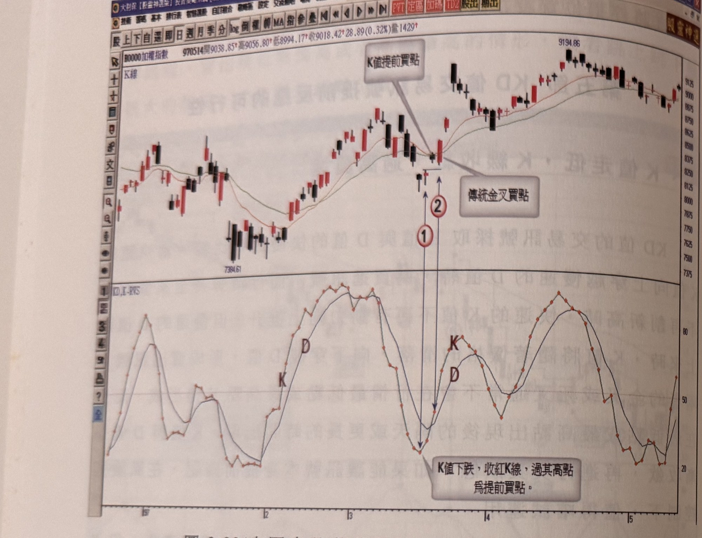
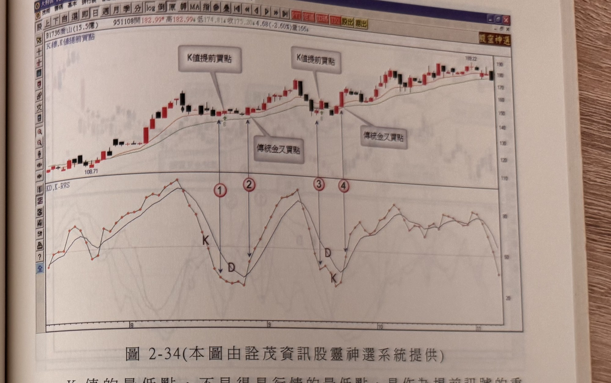
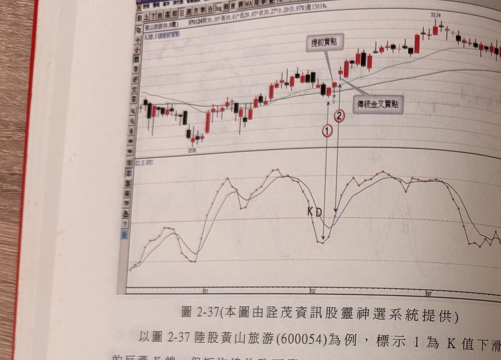
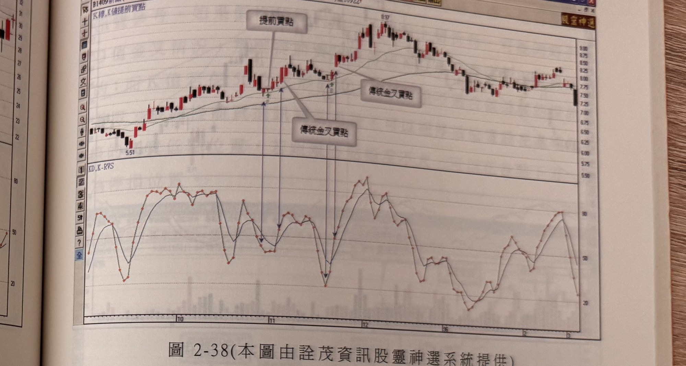
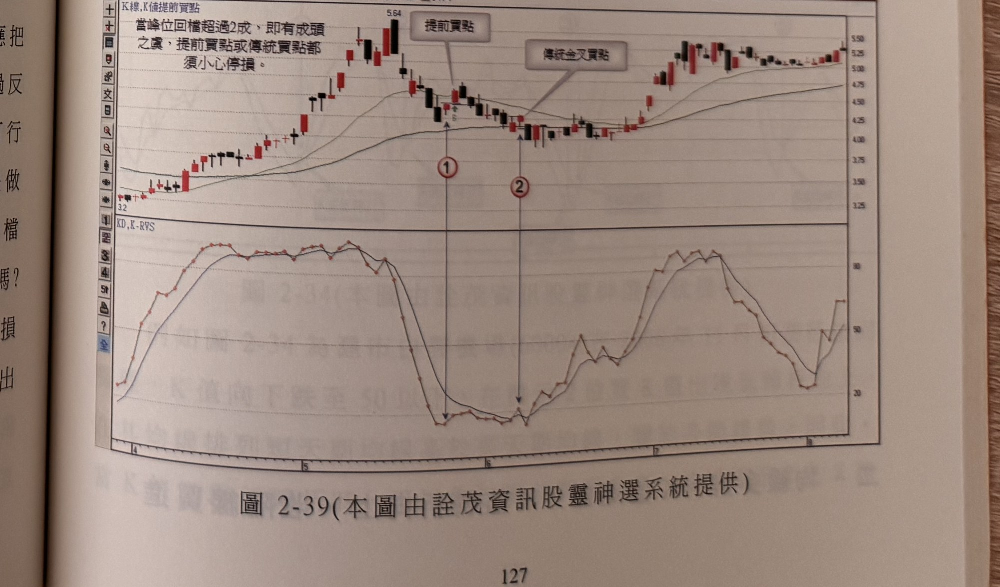

# KD 提前買點（K 值走低、K 線收紅、隔天過高買進）

> 一句話摘要：牛市排列下，K 值下探至 50 以下出現反漲陽線但 K 值仍背離向下時，若隔天 K 線收盤突破該反漲陽線最高點，即成立提前買訊，通常早於傳統 KD 金叉數天出現，可取得更低成本、避開金叉後立即拉回的停損風險。

## 1. 核心概念

KD 指標的金叉（死叉）通常不會恰好落在行情最低點（最高點）K 線當天，而是在 K 值與 D 值逐漸收斂、於最低點（最高點）出現後隔天或更久才形成交叉。若能在 K 值與 D 值收斂過程中，於特定條件下提前確認訊號，即可在風險可控的前提下提早進場、降低買進成本（p.121）。

## 2. 適用前提

- 條件一：均線呈現**牛市排列**（短天期均線在上，長天期均線在下）（p.121）。
- 適合股性活潑、均線明顯上揚（常出現 ≥5% 以上單日漲幅）的個股；均線僅緩步上揚或橫向游走的牛皮股不適合此操作（p.131，同節二之補充說明，適用邏輯一致）。
- 成交量拉回量縮（籌碼安定沈澱）的情況下，提前買進可行性較高；若拉回量未漸次萎縮至前波谷點量附近水準，須格外提防提前買訊出現後仍續破底的風險（p.125）。

## 3. 訊號定義

1. C1：均線呈牛市排列（p.121）。
2. C2：K 值下探至 **50 以下**，出現反漲的陽線，但當天 K 值仍持續向下（尚未止跌），形成「K 線與 K 值背離」的現象（p.121）。
3. C3：**隔天** K 線收盤突破該反漲陽線的**最高點** → 提前買訊觸發（p.121）。

## 4. 進場

- 於隔天 K 線**收盤價突破反漲陽線最高點**時進場（p.121）。

## 5. 停損

- 以進場 K 線的**真實低點下方一檔**位置為停損（p.121）；若情況不對應立刻出場，重新觀察下一個進場買點（p.121）。
- 另一停損選項：**最大 7%**（書中列出兩種停損選項，未言明優先取捨方式）（p.125）。

## 6. 出場 / 停利

原文未規定固定停利規則。書中僅提出風控原則：若對訊號可行性有疑慮，最佳策略是做好停損準備，行情不對就出場，不必執著於「高檔」的認定（p.126）。

## 7. 過濾：不做的情況

1. K 值若在 50 之上形成向上轉折，本訊號不成立（C2 本身即限定 K 值須先下探至 50 以下）（p.121）。
2. 若股價自峰位拉回，成交量未漸次萎縮至前波谷點量附近水準，提前買訊出現後仍有續破低的風險，應提高警覺、嚴設停損（p.125）。
3. 若股價自高點回檔超過 **2 成（20%）**，可能已形成頭部，提前買點與傳統金叉買點皆須特別小心停損（p.127，圖 2-39 圖說）。

## 8. 範例解析


- **圖 2-33**（加權指數，p.122）：標示 1 為 K 值下滑但 K 線反漲的背離現象，隔天收盤突破反漲 K 線最高點形成提前買訊；標示 2 為稍晚出現的傳統 KD 金叉買點，提前買訊較傳統金叉早一步進場獲利。


- **圖 2-34**（喬山 1736，p.123）：8 月初回檔整理中，標示 1（提前買訊）較標示 2（傳統金叉，晚 4 天）提早進場；標示 3（提前買訊）較標示 4（傳統金叉）提早進場，提前買訊在 KD 金叉出現時已產生獲利。


- **圖 2-35**（昆盈 2365，p.124）：標示 1 反漲 K 線隔天收盤突破形成提前買訊；標示 2 傳統金叉買點距谷點已達 4 天、超過 3 天濾網限制，金叉後隨即遭陰線拉回、若以買進 K 線最低點為停損會被掃到，而提前買訊未受此影響。


- **圖 2-36**（星通 3025，p.125）：三組提前買訊與傳統金叉買點對照，標示 4、6 之傳統金叉買點距谷點已超過一成距離，示範提前買進模式的成本優勢與降低被掃停損的效果。


- **圖 2-37**（黃山旅游 600054，p.126）：標示 1 為 K 值下滑過程中的反漲 K 線，同時也是均線金叉後第一個訊號位置，隔天收盤突破構成提前買訊；提醒即使高檔疑慮存在，仍應以做好停損準備因應。


- **圖 2-38**（新纖 1409，p.127）：示範一個提前買訊與兩次傳統金叉買點的位置對照。


- **圖 2-39**（利華 1423，p.127）：圖說特別提醒「當高位回檔超過 2 成，即有成頭之處，提前買點或傳統買點都須小心停損」。


- **圖 2-40**（英瑞達 3367，p.128）：提前買訊出現於中段回檔止跌處，緊接傳統金叉買點；成交量圖標示「回檔低量」與「回檔量沒有萎縮至前波低點量水準」，示範量能未縮的續破低風險提示。

## 9. 作者提醒與常見錯誤

- 提前買進必須挑選均線角度上揚的股票；均線橫向趨平或揚升角度過小者，不適合採取提前進場方式，因盤整格局下任何指標的效率都會降低（p.122）。
- K 值的最低點不見得是行情的最低點，是作為提前訊號的重要基礎，而回檔過程中若 K 線收盤持續無法突破前一天高點，一旦出現突破即代表慣性改變、回檔整理可能結束（p.123）。
- 高檔到底要高到什麼程度才算「高檔」難以客觀評估，唯一因應之道是嚴守停損紀律，即使在高檔買進，只要狀況不對就停損出場，便不會有真正的套牢情事（p.126）。

## 10. 規則速查（Checklist）

- [ ] 均線呈牛市排列
- [ ] K 值下探至 50 以下，出現反漲陽線但 K 值仍向下（背離）
- [ ] 隔天 K 線收盤突破反漲陽線最高點
- [ ] 進場：突破當根 K 線收盤
- [ ] 停損：真實低點下方一檔，或最大 7%
- [ ] 留意：股價回檔逾 2 成時提高警覺；拉回量未縮至前波低點量水準時提高警覺

## 11. 機器可讀規則

```yaml
signal: KD提前買點（K值走低K線收紅過高買進）
side: long
timeframe: daily
indicator: KD, K值, 均線
conditions:
  - id: C1
    desc: 均線呈牛市排列（短天期在上，長天期在下）
    source: p.121
  - id: C2
    desc: K值下探至50以下，出現反漲陽線，但當天K值仍向下（背離）
    source: p.121
  - id: C3
    desc: 隔天K線收盤突破該反漲陽線最高點
    source: p.121
entry:
  trigger: C1+C2+C3成立
  price: 突破當根K線收盤進場
  source: p.121
stop_loss:
  method_1: { desc: "進場K線真實低點下方一檔", source: "p.121" }
  method_2: { points: "最大7%", source: "p.125" }
exit: 原文未規定固定停利；行情不對即依停損出場
filters:
  - desc: K值若在50之上形成向上轉折，不適用本訊號
    source: p.121
  - desc: 股價自峰位拉回但成交量未漸次萎縮至前波谷點量附近水準，續破低風險較高
    source: p.125
  - desc: 股價自高點回檔超過2成，可能已形成頭部，須特別小心停損
    source: p.127
```

## 12. 待確認事項

無重大待確認事項；本方法範圍內頁碼皆有對應照片，規則亦皆有明確頁碼出處。

## 13. 原文出處

- `extracted/pages/IMG_8640.md`（p.121）
- `extracted/pages/IMG_8642.md`（p.122–123）
- `extracted/pages/IMG_8643.md`（p.124–125）
- `extracted/pages/IMG_8644.md`（p.126–127）
- `extracted/pages/IMG_8645.md`（p.128）
