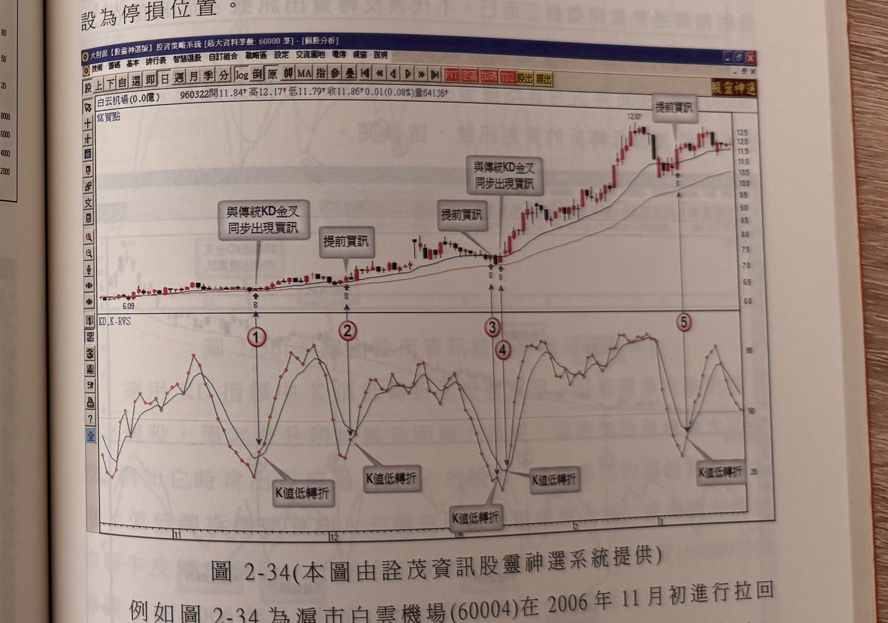
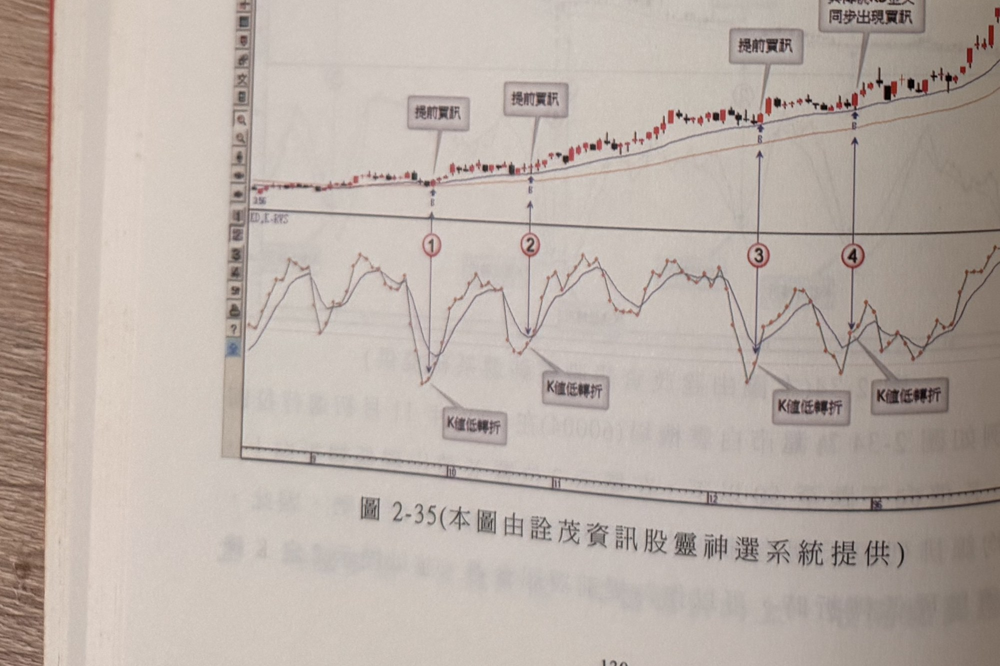
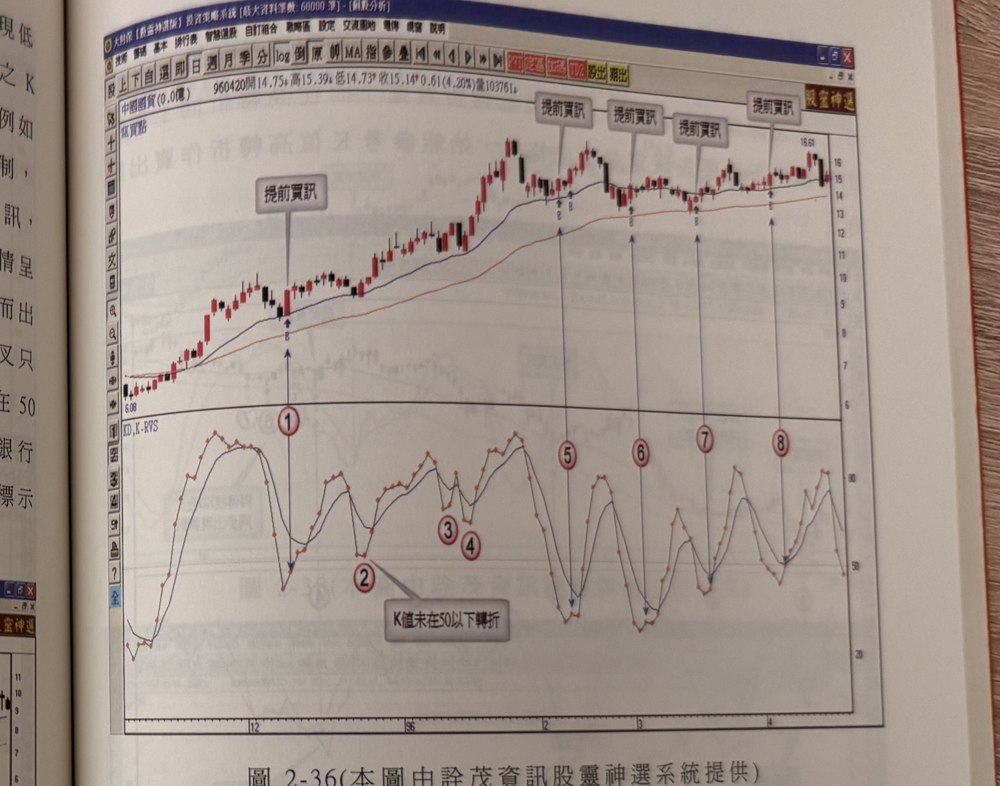
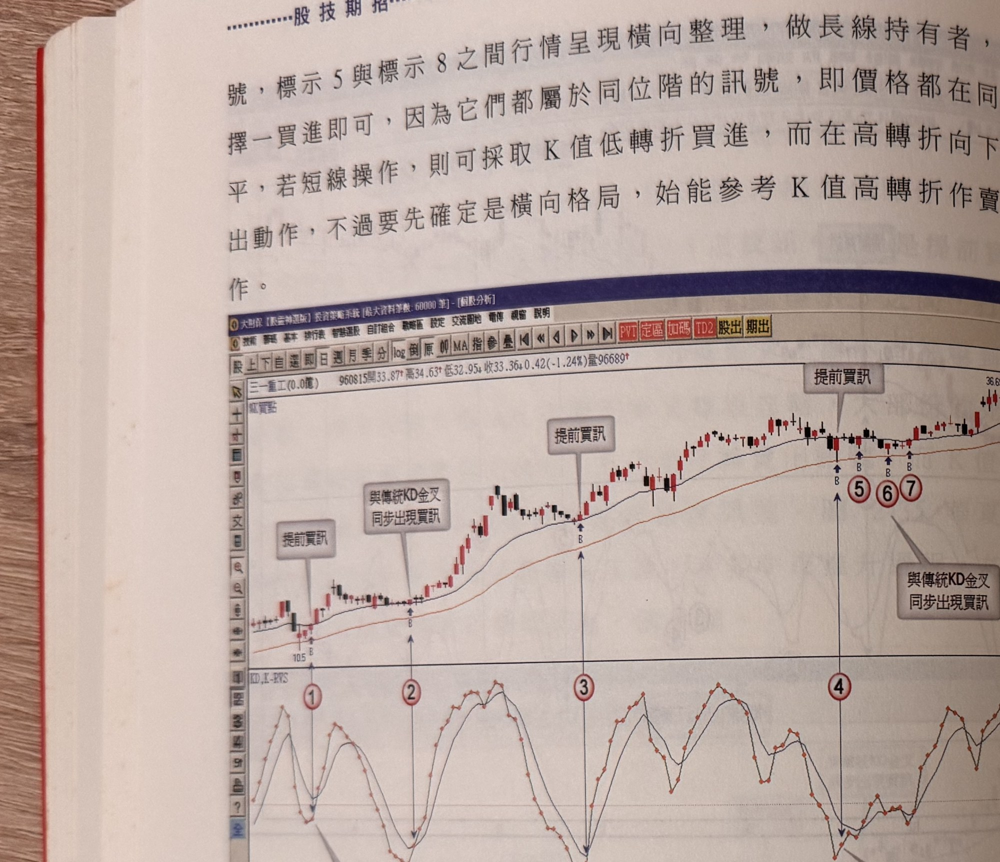
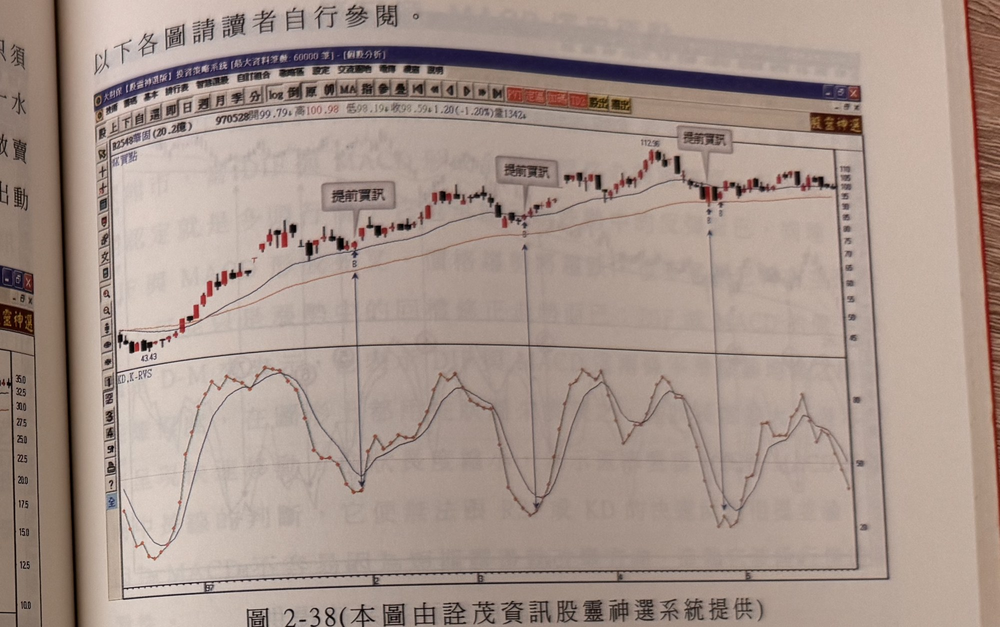
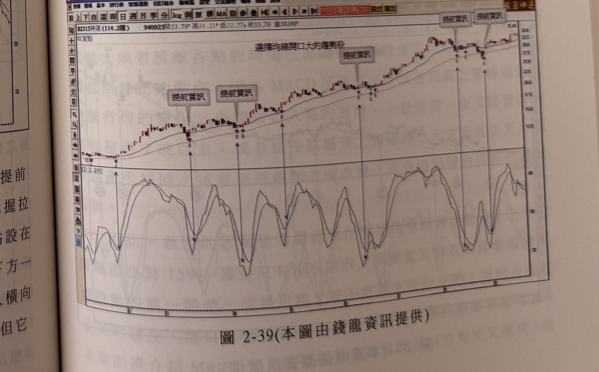
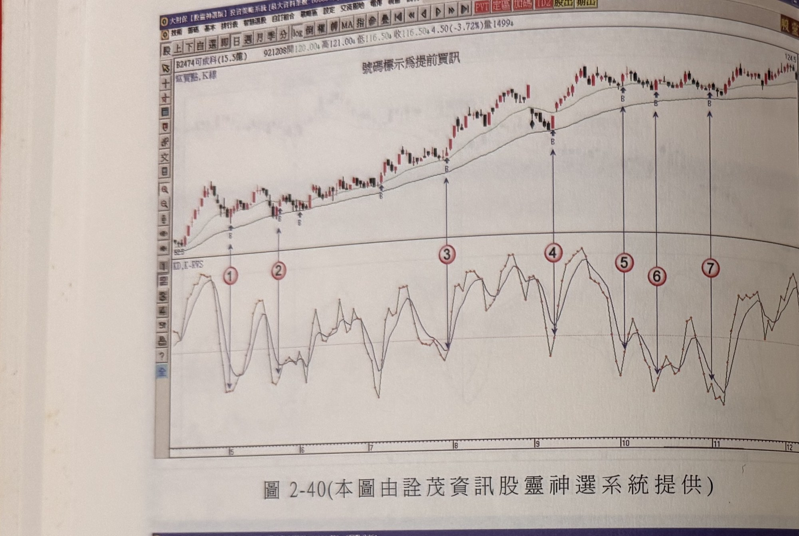
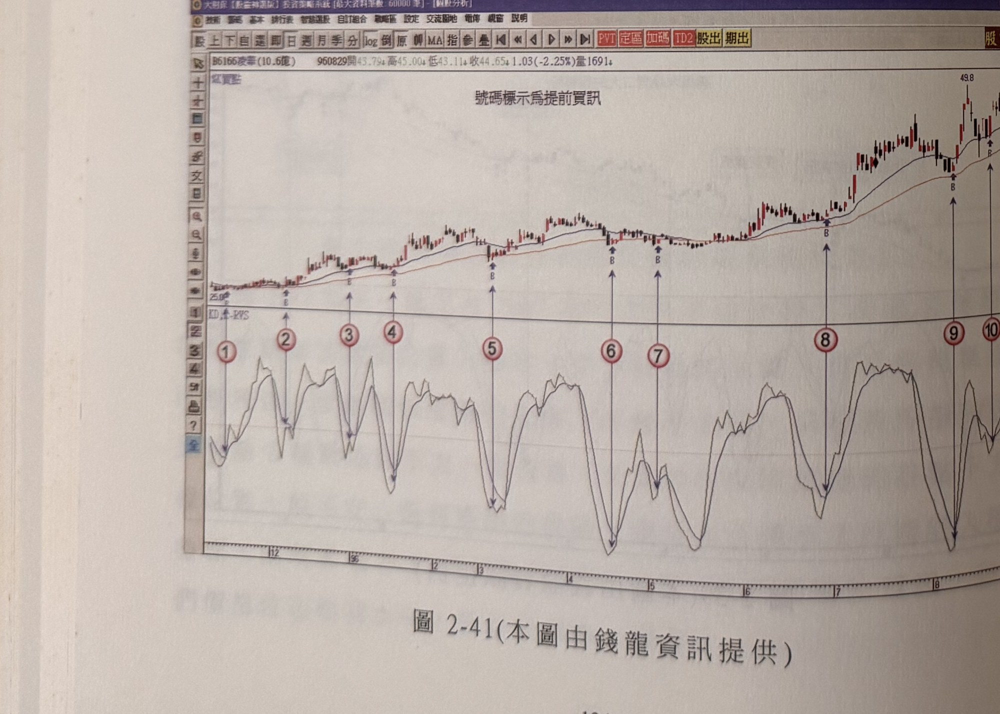

# KD 提前買點（均線多排，K 值走低轉折向上，收陽線買進）

> 一句話摘要：均線多頭排列下，K 值下滑跌破 50 後出現向上轉折、且當天 K 線收陽線上漲，即成立提前買訊，不需如另一法般等待隔天收盤突破反漲高點確認，訊號更早、更直接；K 值若在 50 之上轉折向上則不適用。

## 1. 核心概念

另一種 KD 提前買進方式，是均線呈現多排的前提下，KD 指標的 K 值下滑、跌破 **50 中值**，出現 K 值向上轉折、且 K 線收陽線上漲，即可作為提前買進訊號參考。若價格 K 線大漲、K 值向上轉折的同時恰好形成 KD 金叉，則提前買訊與傳統金叉買訊會同步出現（p.129）。

## 2. 適用前提

- 均線須呈現**多頭排列（多排）**（p.129）。
- 僅適合均線**明顯上揚**、股性活潑（常出現 ≥5% 以上單日漲幅）的熱門個股；若個股均線僅緩步上揚，或呈橫向游走的牛皮停滯股，不適合以此操作（p.131）。

## 3. 訊號定義

1. C1：均線呈多頭排列（多排）（p.129）。
2. C2：KD 的 K 值下滑，跌破 **50**（中值）（p.129）。
3. C3：K 值出現**向上轉折**（「K 值低轉折」）（p.129）。
4. C4：轉折當天 K 線**收陽線上漲**（p.129）。
5. 特例：若當天 K 線大漲、K 值向上轉折的同時也形成 KD 金叉，則提前買訊與傳統金叉買訊**同步出現**（p.129）。

## 4. 進場

依 p.129 停損敘述「進場當根 K 線的真實低點位置」反推，進場點即為 C2～C4 成立的**訊號 K 線本身**（K 值出現低轉折且當天收陽線的當天）**收盤進場**（依上下文推定；原文未逐字說明進場時點是當根收盤或隔日）。

## 5. 停損

- 以進場**當根 K 線的真實低點**位置為停損；若距離谷點幅度不大，可改以**谷點下方一檔**設為停損位置（書中列出兩種選項，未言明優先取捨方式）（p.129）。
- 另一停損選項：固定百分比，例如 **7%**（p.130，圖 2-35〔華夏銀行〕案例提及：若採 7% 固定停損則不致被掃到，而採真實低點停損則會被掃到，兩者效果不同）。

## 6. 出場 / 停利

原文未規定固定停利規則。書中特別提醒：行情快速上揚期間，KD 值在高檔擺盪出現死叉，**不宜被嚇到而出脫持股**——牛市行情宜對 KD 指標的死叉採取忽略，大部份死叉只是指標過熱的稍微修正，不代表反轉賣出訊號（p.130）。

## 7. 過濾：不做的情況

1. K 值若在 **50 之上**形成向上轉折，不適用本提前買進法（p.129、p.130、p.131 多次重申）。
2. 均線僅緩步上揚、或呈橫向游走的牛皮停滯個股，不適合使用本方法（p.131）。
3. 同一價位水平（同位階）出現多次訊號時，長線持有者只需擇一買進；短線操作者可搭配「K 值高轉折向下」作賣出訊號參考，但須先確認為橫向格局，才能以高轉折作賣出動作依據（p.131–132）。

## 8. 範例解析


- **圖 2-34**（白雲機場 600004，p.129；圖號與 p.123 圖 2-34〔喬山〕重複，原書印刷編號錯誤，依原文照錄，圖檔為 `股技期招-p129-1.jpg`）：2006 年 11 月初回檔整理，標示 2 位置 K 值出現低轉折向上，均線多頭排列，構成提前買訊，並以標示 2 之 K 線真實低點下方一檔為停損；標示 3 位置 K 值亦低轉折，但隔天行情下殺並跌破真實低點停損，若採 7% 固定停損則不致出場。


- **圖 2-35**（華夏銀行 600015，p.130；與 p.124 圖 2-35〔昆盈〕重複，圖檔為 `股技期招-p130-1.jpg`）：2006 年九月底均線金叉後的牛市推升過程中，多次出現 K 值低轉折買點；示範標示 4、5 之間行情快速上揚時 KD 高檔死叉應予忽略。


- **圖 2-36**（中國國貿 600007，p.131；與 p.125 圖 2-36〔星通〕重複，圖檔為 `股技期招-p131-1.jpg`）：2006 年 11 月底大陽線推升、均線金叉後，標示 1 為 K 值破 50 後低轉折向上的提前買訊；標示 2～4 為 K 值在 50 之上的轉折向上，依過濾規則忽略。


- **圖 2-37**（三一重工，p.132；與 p.126 圖 2-37〔黃山旅游〕重複，圖檔為 `股技期招-p132-1.jpg`）：2007 年牛市大多頭走勢中，標示 1～3 為有效提前買訊，停損設於進場 K 線最低點或拉回整理谷點下方一檔；標示 4～7 為橫向整理期間同位階的多次 K 值低轉折訊號，只需擇一操作。


- **圖 2-38**（華固 2548，p.133；與 p.127 圖 2-38〔新纖〕重複，圖檔為 `股技期招-p133-1.jpg`）：三處提前買訊位置，對應三次 K 值低轉折。


- **圖 2-39**（神達 2315，p.133；與 p.127 圖 2-39〔利華〕重複，圖檔為 `股技期招-p133-2.jpg`）：圖上方文字說明「選擇均線開口大的趨勢股」，四處提前買訊位置。


- **圖 2-40**（可成科 2474，p.134；與 p.128 圖 2-40〔英瑞達〕重複，圖檔為 `股技期招-p134-1.jpg`）：七處提前買訊位置，涵蓋低檔、中段、高檔盤整區。


- **圖 2-41**（麥寮 6166，p.134，圖檔為一般編號 `股技期招-fig-2-41.jpg`，非重複圖號）：十處提前買訊位置，示範同一操作邏輯在長波段走勢中反覆出現。

## 9. 作者提醒與常見錯誤

- K 值在 50 之上的轉折向上，不宜作為提前買進訊號使用，須嚴格限定於「破 50 後」的轉折（p.129–131 多次重申）。
- 運用本方法須選擇均線明顯上揚的個股；判斷方式為觀察個股是否時常出現 ≥5% 以上的單日漲幅，此類熱門股才適合使用 K 值低轉折提前買訊（p.131）。
- 短線操作者若欲以「K 值高轉折向下」作為賣出參考，須先確認行情屬於橫向格局，否則不宜貿然套用（p.132）。

## 10. 規則速查（Checklist）

- [ ] 均線呈多頭排列
- [ ] K 值下滑跌破 50
- [ ] K 值出現向上轉折
- [ ] 轉折當天 K 線收陽線
- [ ] （進場，推論）訊號 K 線收盤進場
- [ ] 停損：進場 K 線真實低點（或谷點）下方一檔，或固定 7%
- [ ] 排除：K 值在 50 之上的轉折向上不適用
- [ ] 排除：均線緩步上揚或橫向游走的牛皮股不適用

## 11. 機器可讀規則

```yaml
signal: KD提前買點（均線多排K值轉折向上收陽線買進）
side: long
timeframe: daily
indicator: KD, K值, 均線
conditions:
  - id: C1
    desc: 均線呈多頭排列（多排）
    source: p.129
  - id: C2
    desc: K值下滑跌破50
    source: p.129
  - id: C3
    desc: K值出現向上轉折（K值低轉折）
    source: p.129
  - id: C4
    desc: 轉折當天K線收陽線上漲
    source: p.129
entry:
  trigger: C1+C2+C3+C4成立
  price: 訊號K線（K值低轉折且收陽線之當天）收盤進場（依p.129停損敘述反推，屬推論）
  source: p.129
stop_loss:
  method_1: { desc: "進場當根K線真實低點", source: "p.129" }
  method_2: { desc: "谷點下方一檔（若距谷點幅度不大）", source: "p.129" }
  method_3: { points: "固定7%", source: "p.130" }
exit: 原文未規定固定停利；牛市中高檔KD死叉不作為出場訊號（應忽略）
filters:
  - desc: K值在50之上形成向上轉折，不適用本訊號
    source: p.129, p.130, p.131
  - desc: 均線僅緩步上揚或橫向游走的牛皮停滯股，不適合本方法
    source: p.131
  - desc: 同一位階多次訊號，長線只需擇一操作
    source: p.131-132
```

## 12. 待確認事項

- 進場時點（訊號 K 線當天收盤 vs 隔天）原文未逐字明講，本文件依第 5 節停損敘述「進場當根 K 線」反推為訊號當天收盤進場，已於第 4、11 節標註為推論。

## 13. 原文出處

- `extracted/pages/IMG_8645.md`（p.128–129）
- `extracted/pages/IMG_8646.md`（p.130–131）
- `extracted/pages/IMG_8647.md`（p.132–133）
- `extracted/pages/IMG_8648.md`（p.134）
