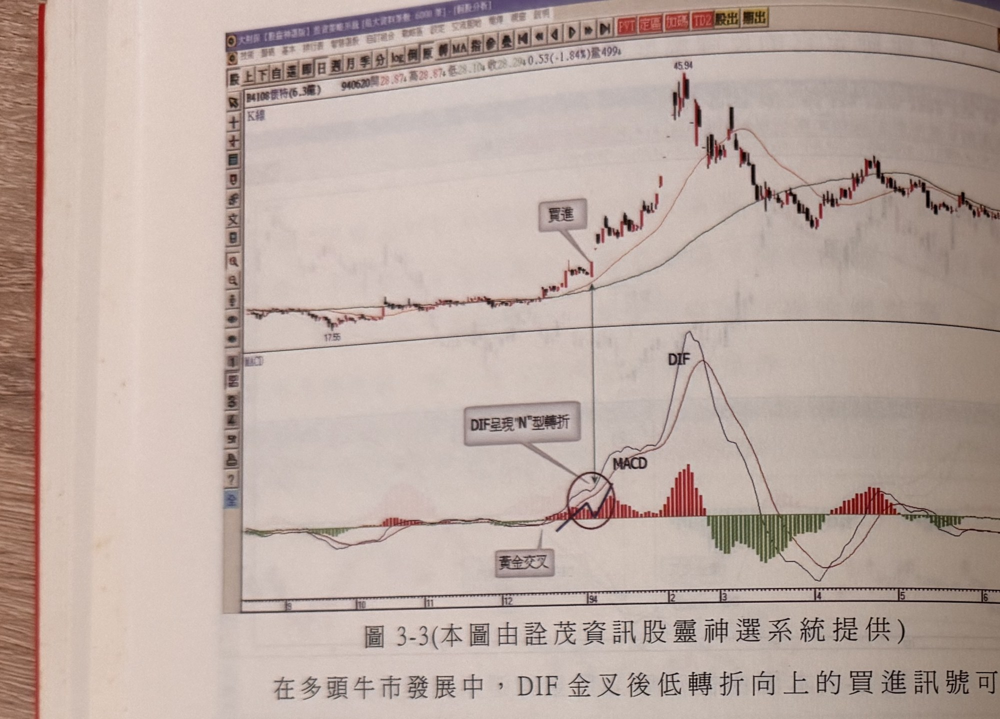
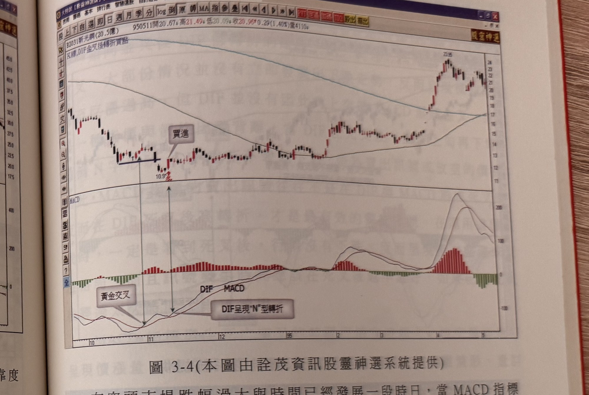
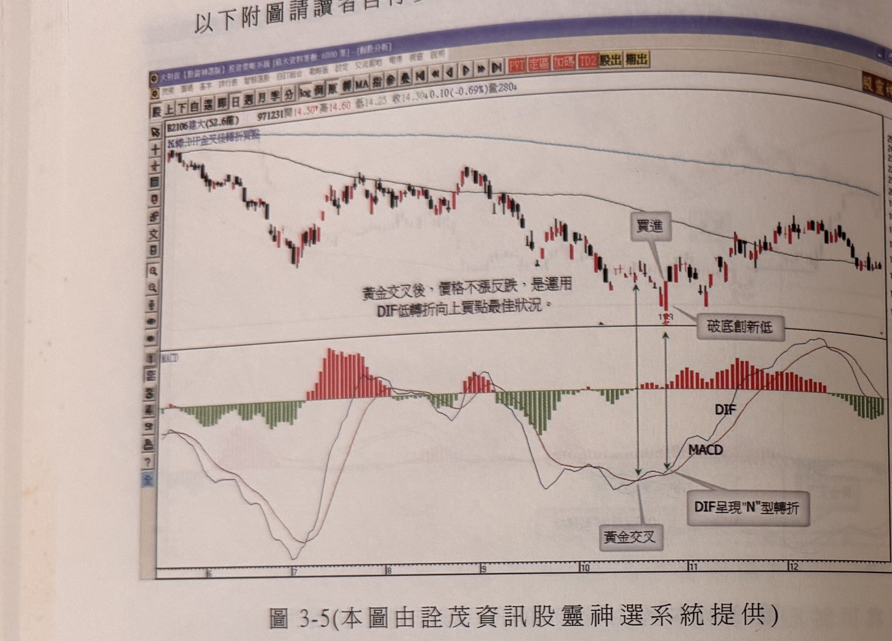
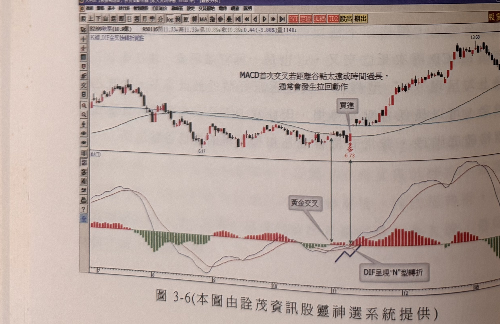

# 金叉後低轉折買點（DIF "N"形轉折）

> 一句話摘要：DIF與MACD形成黃金交叉後，DIF雖一度向下彎但未跌破MACD，隨即重新上勾形成"N"形轉折，此低轉折點即為可靠度高的買進訊號。

## 1. 核心概念
- MACD屬中長線判斷指標，0軸之上表示牛市、0軸之下表示熊市；DIF與MACD形成金叉時價格走勢多趨漲，但不能一味認定就是多頭行情，也可能只是跌勢中的反彈（p.135）。
- DIF減MACD的值習慣稱D-M值，代表DIF與MACD兩條平滑均線間的乖離程度，圖形上以柱狀圖表現：柱狀長度越大代表行情移動越快，柱狀縮小代表速率趨緩；MACD反應較RSI、KD慢，不容易因短期震盪就改變方向，因而具備波段行情的可看性（p.135）。
- 金叉前的「前置行情」會影響金叉後的可靠度：若金叉前行情自谷點上漲幅度較大，或脫離谷點時間已過久，金叉後行情容易先做拉回修正——這並非趨勢方向改變，而是短期獲利回吐所致。一般而言，金叉前置行情漲幅超過2成以上，或自谷點翻升超過10天才形成金叉，都容易產生拉回（p.135）。
- 最佳狀況是前置行情呈窄幅橫向盤整（上下震盪幅度小於15%，甚至僅10%以內），此時金叉的效果如同行情啟動的第一訊號，可靠、不易拉回；若配合金叉當日K線呈大漲K線，推升表態更為可靠（p.135）。
- 本方法即在此基礎上，尋找金叉後即使出現拉回也未改變趨勢的訊號：金叉後DIF雖向下彎，但沒有跌破MACD，不出幾天又重新向上，形成"N"形轉折，如同「先蹲後跳」，代表後市發展傾向快速推升（p.136）。

## 2. 適用前提
- 需先出現DIF與MACD黃金交叉（金叉）（p.136）。
- 可用於原跌勢中的搶反彈情境（p.136-137）、多頭牛市發展中（p.138），也可用於空頭市場跌幅過大、時間已久、價格破底階段（p.139）。

## 3. 訊號定義（多方）
1. DIF由下往上穿越MACD，形成黃金交叉（p.136）。
2. 金叉後DIF出現向下彎（p.136）。
3. DIF向下彎的過程中，並未跌破MACD（p.136）。
4. 不出幾天，DIF又重新向上勾起，形成"N"形轉折，此低轉折點即為買進訊號（p.136）。
5. （品質濾網，見第7節）訊號當根K線須為陽線，上影線不宜過長（p.137）。

本方法為單向買進訊號，原文未描述其空方鏡像用法。

## 4. 進場
- 於DIF出現低轉折向上（"N"形轉折完成）的當根K線進場（p.136-137；圖3-1、圖3-2標示「2」即為訊號位置）。
- 原文未明確規定是否須等訊號K線收盤確認才進場，僅描述「當DIF下彎後上勾呈現N型轉折」即為買點（p.139）。

## 5. 停損
- 停損位置控制在買進訊號出現的當根K線最低點下方一個跳動點（p.137）。
- 或以固定百分比停損控制（原文未指定具體百分比數值）（p.137）。
- 或以階梯出場線做為控制風險的方式（p.137）。
- 特殊情境：若DIF金叉後低轉折買點出現在價格破底階段（屬價格與指標的背離現象），可以最低谷點為停損（p.139）。
- 停損後是否反手：原文未規定。

## 6. 出場 / 停利
- 原文未明確說明本訊號的停利／出場機制，僅在停損選項中提及「階梯出場線」可作為控制風險的方式之一（p.137），未進一步說明停利觸發條件。

## 7. 過濾：不做的情況
1. 訊號當根K線必須是陽線；上影線不宜過長，如此過濾可有效提升可靠度（p.137）。
2. DIF的"N"形轉折最好發生在金叉後不久；若行情已推升一段時間才出現轉折，不建議進場（p.138）。
3. 過長時間或過大推升幅度後才出現的轉折，不視為理想買點；本訊號強調的是「低檔位置」的轉折（p.138）。
4. 訊號當根K線宜為大漲K線，最好能突破前一天最高點（p.138）。

## 8. 範例解析
- **圖3-1**（p.136，思源科2473）：89年4月跌勢中，5月中旬DIF金叉MACD（標示1），但金叉後行情拉回，DIF向下彎，四天後上勾成"N"形轉折（標示2），行情重新挺升上漲。示範跌勢中金叉低轉折買點的完整流程。

  

- **圖3-2**（p.137，大立光3008）：97年元月底DIF與MACD金叉（標示1），金叉後價格續跌破新低，DIF下彎但未跌破MACD，標示2位置出現低轉折向上買點，"N"形轉折確立後提高反彈續漲可靠度。示範停損設在訊號K最低點下方一檔、以及K線品質（陽線、上影線不宜過長）的過濾要求。

  

- **圖3-3**（p.138，懷特4108）：93年12月底DIF與MACD金叉，當根K線為大漲陽線，前置行情呈窄幅橫向盤整，符合「金叉+大漲K線+窄幅盤整前置行情」的完美模式。示範多頭牛市中金叉低轉折買點可靠度更高。

  

- **圖3-4**（p.139，新光鋼2031）：空頭市場跌幅過大、時間已久，MACD出現黃金交叉後價格卻不漲反續破底，DIF下彎但未與MACD再度死叉，此為價格與指標的背離現象；DIF低轉折位置正貼近最低谷點，可以最低谷點為停損。示範本方法用於空頭破底階段辨識最低谷反轉。

  

- **圖3-5**（p.140，建大2106）：書中僅附圖供讀者自行參閱，圖上文字說明「黃金交叉後，價格不漲反跌，是運用DIF低轉折向上買點最佳狀況」，呼應圖3-4的背離情境。

  

- **圖3-6**（p.140，映泰2399）：書中僅附圖供讀者自行參閱，圖上文字說明「MACD首次交叉若距離谷點太遠或時間過長，通常會發生拉回動作」，呼應第7節過濾規則2、3。

  

## 9. 作者提醒與常見錯誤
- 跌勢中出現金叉買進訊號常受質疑，因空頭跌勢裡理應找賣出訊號較可靠；但若指標出現本方法描述的特殊現象（"N"形轉折），仍可確認屬中級反彈而非曇花一現（p.136-137）。
- DIF金叉後低轉折買點的當根K線品質判斷很重要：必須是陽線，上影線不宜過長，過濾後可靠度能有效提升（p.137）。
- 所謂「低轉折」強調的是低檔位置：轉折若拖延過久、或行情已推升一大段才出現，就不是理想買點（p.138）。

## 10. 規則速查（Checklist）
- [ ] DIF與MACD已形成黃金交叉
- [ ] 金叉後DIF向下彎，但未跌破MACD
- [ ] DIF不久後重新上勾，形成"N"形轉折
- [ ] 轉折發生在金叉後不久（非已推升一大段後）
- [ ] 訊號當根K線為陽線，上影線不宜過長，最好為大漲K線並突破前一天最高點
- [ ] 已設定停損（訊號K最低點下方一檔／固定百分比／階梯出場線／背離情境下之最低谷點）

## 11. 機器可讀規則
```yaml
signal: 金叉後低轉折買點
side: long
timeframe: daily
conditions:
  - id: C1
    desc: DIF由下往上穿越MACD，形成黃金交叉
    source: p.136
  - id: C2
    desc: 金叉後DIF出現向下彎，但未跌破MACD
    source: p.136
  - id: C3
    desc: DIF不久後（數天內）重新上勾，形成"N"形轉折，此低轉折點即為買進訊號
    source: p.136
  - id: C4
    desc: 訊號當根K線須為陽線，上影線不宜過長，最好為大漲K線並突破前一天最高點
    source: p.137-138
entry:
  price: 訊號當根K線（DIF低轉折確認當根）
  timing: 原文未明確規定是否須等收盤確認
  source: p.136-139
stop_loss:
  options:
    - 訊號當根K線最低點下方一個跳動點
    - 固定百分比停損（數值未指定）
    - 階梯出場線
    - "背離情境（價格破底）：以最低谷點為停損"
  reverse_on_stop: 書中未規定
  source: p.137, p.139
exit: 書中未明確說明
filters:
  - id: F1
    desc: N形轉折須發生在金叉後不久，行情已推升一段時間才出現不建議進場
    source: p.138
  - id: F2
    desc: 過長時間或過大推升幅度後才轉折，不視為理想買點
    source: p.138
  - id: F3
    desc: 訊號當根K線須陽線，上影線不宜過長
    source: p.137
```

## 12. 待確認事項
- 停損選項中的「固定百分比」未指定具體數值（原文未規定，p.137）。
- 出場／停利機制原文未明確說明，僅列舉階梯出場線為風險控制選項之一，非明確停利觸發規則（p.137）。

## 13. 原文出處
- `extracted/pages/IMG_8648.md`（p.135，章節前言）
- `extracted/pages/IMG_8649.md`（p.136-137）
- `extracted/pages/IMG_8650.md`（p.138-139）
- `extracted/pages/IMG_8651.md`（p.140-141，本方法用p.140）
