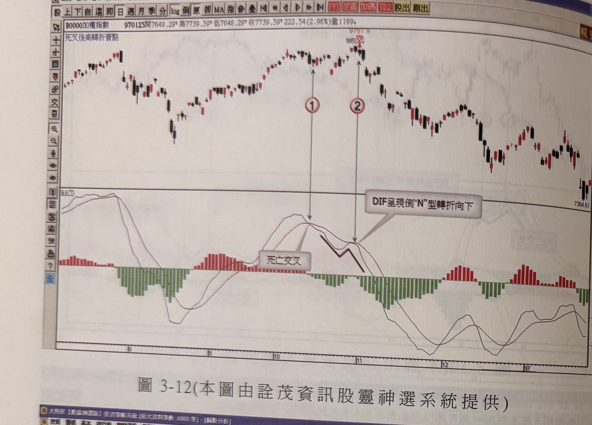
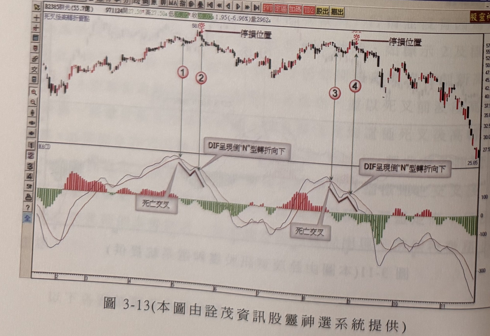

# 死叉後高轉折賣出訊號（DIF 倒"N"形轉折）

> 一句話摘要：DIF與MACD死亡交叉後，行情往往不會立即下跌，反而橫向整理甚至反漲，待DIF在未穿越MACD的情況下重新下彎形成倒"N"字形，此高轉折點才是最有效的賣出／放空訊號。

## 1. 核心概念
- 如同金叉後DIF低轉折的道理一樣，當DIF與MACD形成死亡交叉，大部份情況並沒有立即發展出下跌走勢，反而呈現橫向盤整甚至反漲過高，但DIF並沒有因此向上突破MACD形成金叉，這也是一種指標與價格出現背離的現象（p.141）。
- 當DIF在死叉後出現上勾再下彎，像倒"N"字形狀，DIF重新下彎朝下時，才是賣出訊號或放空的價格；因此MACD指標的賣出訊號往往不是在DIF與MACD形成死叉的當下，而是在DIF死叉後高轉折，才是最有效的賣出訊號（p.141）。
- 運用這種模式時，一定是看到死叉後行情沒有下跌、反而呈現橫向整理或反漲格局；而且訊號發生時間應該在死叉後越早越好，如果死叉後已經過太久時間，則不適用（p.141）。

## 2. 適用前提
- 需先出現DIF與MACD死亡交叉（死叉）（p.141）。
- MACD指標發生死亡交叉的前置行情宜波幅大，成交量群最好呈現「價漲量不增」的現象，高檔往往有價量不配合的背離情形，量群的萎縮亦是高檔重要的判斷依據（p.141）。
- 死叉出現後之行情並沒有進一步下挫，反而進入橫向震盪反漲，甚至創新高，則訊號的反轉效果愈好（p.141）。

## 3. 訊號定義（空方）
1. DIF由上往下穿越MACD，形成死亡交叉（p.141）。
2. 死叉後行情沒有立即下跌，反而呈現橫向整理甚至反漲（p.141）。
3. DIF因價格上漲而上勾，但並未穿越MACD（未形成金叉）（p.141-142）。
4. DIF其後重新下彎，形成倒"N"字形，此高轉折點即為賣出／放空訊號（p.141）。
5. （過濾，見第7節）此高轉折須發生在死叉後不久；拖延超過20天以上，都非有效訊號（p.144）。

本方法為單向放空訊號，原文未描述其多方鏡像用法。

## 4. 進場
- 於DIF倒"N"形轉折向下確認的當根K線放空進場（p.141-142；圖3-7、圖3-8標示「2」即為放空訊號位置）。
- 原文提醒：若在DIF與MACD死亡交叉當下就直接放空，之後行情不跌反漲，容易造成放空者心理焦慮，甚至可能反彈越過死叉前波段最高點而先觸及停損；因此與其在死叉當下進場，不如採取死叉後DIF高轉折時才進場放空，就時機點與效率而言較為可靠（p.143）。

## 5. 停損
- 若離最近峰頂最高點幅度不大，停損設在峰頂上方一檔位置（p.141）。
- 或採取7%最大停損模式，防止行情軋空（p.141）。
- 另一種原文提及但效率較差的做法：以死亡交叉前的波段最高點為停損。缺點是死叉後常一路反彈越過該波段高點才觸及停損，之後行情才正式下跌，因此作者建議改採「死叉後DIF高轉折」才進場放空，而非以死叉前高點作停損依據（p.143-144）。
- 停損後是否反手：原文未規定。

## 6. 出場 / 停利
- 原文未明確說明本訊號的停利／出場機制。

## 7. 過濾：不做的情況
1. 死叉後高轉折賣點必須發生在死叉後不久；若拖延超過20天以上，都非有效訊號（p.144）。
2. 若以死叉前波段最高點為停損放空，可能遭觸及停損（因反彈越過該高點）的命運，故不建議以此作為進場放空的判斷依據（p.144）。
3. 最重要的判斷重點：MACD死叉後並沒有使價格隨指標下跌，反而橫向震盪走高，甚至反漲至死叉前高峰附近或創新高，這個特徵務必注意，否則不適用本訊號（p.144）。

## 8. 範例解析
- **圖3-7**（p.142，友尚2403）：死叉位置（標示1）後，行情沒有快速走跌，反而橫向整理後再漲，DIF因價格上漲上勾但未穿越MACD；標示2位置DIF下彎成倒"N"字形，即為放空訊號，此後價格才正式展開較快速的下跌。本例峰頂距放空訊號位置很接近，故停損宜設在峰頂上方一檔。

  

- **圖3-8**（p.143，圓剛2417）：死叉位置（標示1）後行情反向上漲，DIF上勾但未穿越MACD；標示2位置DIF下彎成倒"N"字形為賣出訊號。示範若在死叉當下即放空、之後行情反漲越過波段高點觸及停損的風險，藉以說明改採死叉後DIF高轉折進場較為可靠。

  

- **圖3-9**（p.144，陸股天壇生物，2007-2008年走勢）：出現兩次死叉（標示1、3）及兩次DIF倒"N"型轉折（標示2、4）；第一次（標示2前）反漲未創新高，第二次（標示4前）反漲創新高，若以死叉前波段高點為停損將被觸及。示範死叉後高轉折須發生在死叉後不久（拖延超過20天非有效訊號）的過濾規則。

  

- **圖3-10**（p.145，陸股上海醫工）：兩次死叉（標示1、3，紅字「空」）及兩次DIF倒"N"型轉折（標示2、4），圖上說明「死亡交叉後，價格不漲反漲」，呼應核心概念中「行情沒有下跌反而橫向反漲」的定義特徵。

  

- **圖3-11**（p.145，南亞1303）：死叉（標示1）與DIF倒"N"型轉折（標示2）後，價格由高檔持續走低。圖上說明「死亡交叉後，價格不漲反漲」，示範反漲末端才是真正賣出時機的典型型態。

  

- **圖3-12**（p.146，加權指數）：死叉（標示1）後價格續漲至最高點（標示2，紅字「空」）才出現DIF倒"N"型轉折賣出訊號，其後指數持續下跌。示範大盤指數同樣適用本方法。

  

- **圖3-13**（p.146，群光2385）：出現兩次「死叉＋DIF倒N型轉折」訊號（標示1、2及標示3、4），兩次高點旁皆註記「停損位置」水平線，示範以峰頂上方一檔設停損的作法。

  

## 9. 作者提醒與常見錯誤
- MACD指標的賣出訊號往往不是在死叉當下最有效，而是在死叉後DIF高轉折時才最有效（p.141）。
- 若在死叉當下就放空，遇到行情反漲越過死叉前波段高點，會先被停損出場，之後才正式下跌，導致操作者對MACD可靠度產生懷疑；改採「死叉後DIF高轉折」進場可避免此問題（p.143）。
- 死叉後高轉折賣點必須發生在死叉後不久；拖延超過20天以上的轉折已非有效訊號（p.144）。

## 10. 規則速查（Checklist）
- [ ] DIF與MACD已形成死亡交叉
- [ ] 死叉後行情未立即下跌，反而橫向整理或反漲
- [ ] DIF因價格上漲而上勾，但未穿越MACD（未形成金叉）
- [ ] DIF其後重新下彎，形成倒"N"字形
- [ ] 此高轉折發生在死叉後不久（未拖延超過20天）
- [ ] 已設定停損（峰頂上方一檔／7%停損）

## 11. 機器可讀規則
```yaml
signal: 死叉後高轉折賣出訊號
side: short
timeframe: daily
conditions:
  - id: C1
    desc: DIF由上往下穿越MACD，形成死亡交叉
    source: p.141
  - id: C2
    desc: 死叉後行情未立即下跌，反而呈現橫向整理甚至反漲
    source: p.141
  - id: C3
    desc: DIF因價格上漲而上勾，但未穿越MACD（未形成金叉）
    source: p.141-142
  - id: C4
    desc: DIF其後重新下彎，形成倒"N"字形，此高轉折點即為賣出/放空訊號
    source: p.141
entry:
  price: 訊號當根K線（DIF倒N形高轉折確認當根）
  timing: 於死叉後DIF高轉折時進場，不建議在死叉當下直接進場
  source: p.141-143
stop_loss:
  options:
    - 峰頂上方一檔位置（離最近峰頂幅度不大時）
    - 7%最大停損模式
  not_recommended: 以死叉前波段最高點為停損（易因反彈越過該高點而提早觸及停損）
  reverse_on_stop: 書中未規定
  source: p.141, p.143-144
exit: 書中未明確說明
filters:
  - id: F1
    desc: 死叉後高轉折須發生在死叉後不久，拖延超過20天以上非有效訊號
    source: p.144
  - id: F2
    desc: 判斷重點在於死叉後價格未隨指標下跌，反而橫向震盪走高甚至創新高；不具備此特徵則不適用
    source: p.144
```

## 12. 待確認事項
- 出場／停利機制原文未明確說明。
- 停損的兩種方式（峰頂上方一檔 vs. 7%最大停損）之間，原文未說明優先順序或選用條件，僅並列提出（p.141）。

## 13. 原文出處
- `extracted/pages/IMG_8651.md`（p.140-141，本方法用p.141）
- `extracted/pages/IMG_8652.md`（p.142-143）
- `extracted/pages/IMG_8653.md`（p.144-145）
- `extracted/pages/IMG_8654.md`（p.146-147，本方法用p.146）
