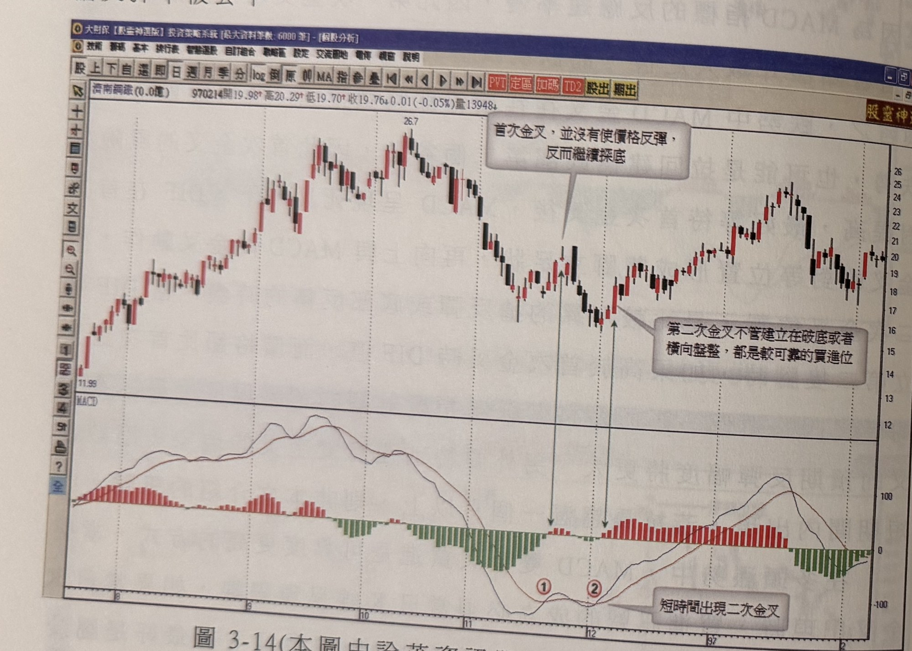
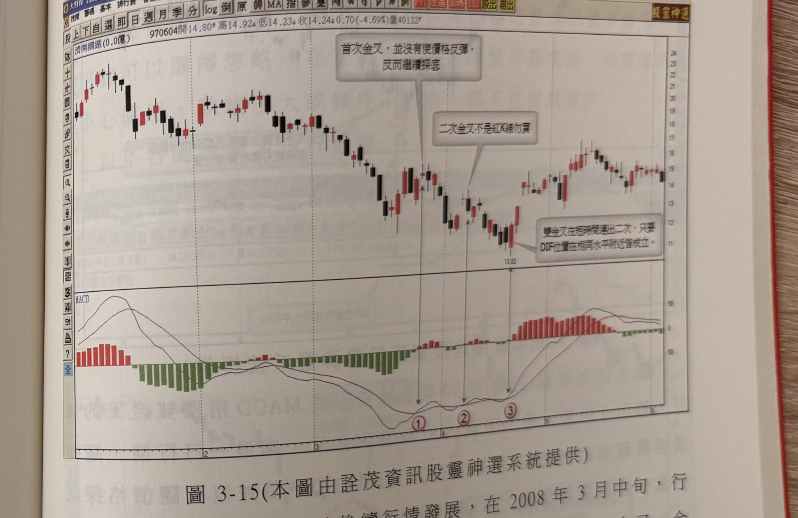
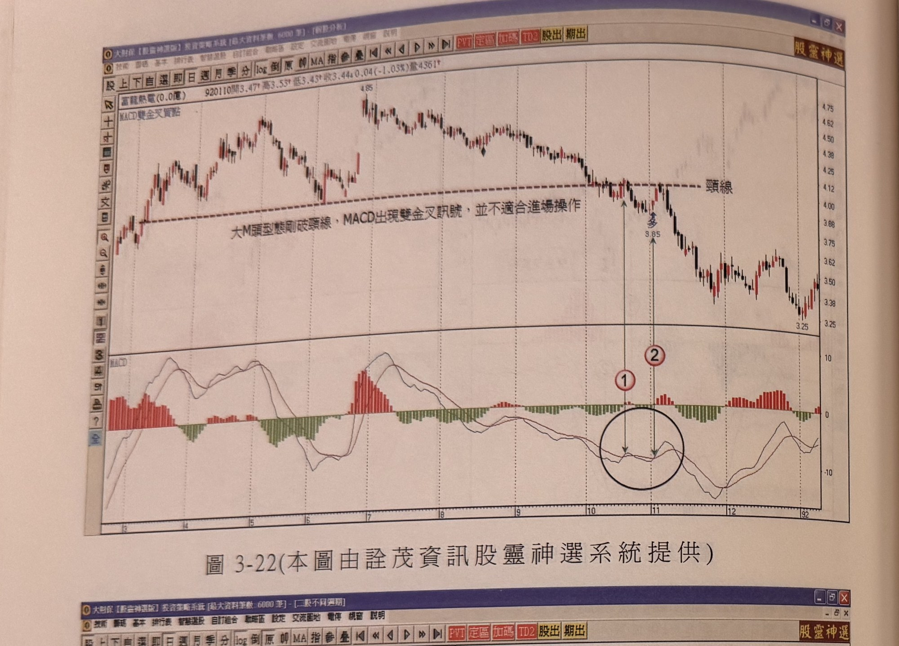
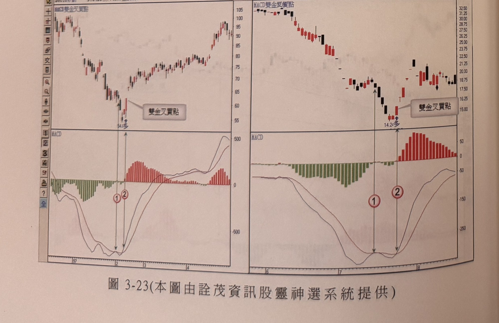

# MACD雙金叉反轉買點

> 一句話摘要：跌勢中MACD第一次金叉風險較高，最好等它死叉向下再度形成第二次金叉（雙金叉），且訊號當日K線須為陽線，才是較可靠的搶反彈或底部反轉買點。

## 1. 核心概念
- 跌勢中要根據MACD做為搶反彈訊號時，最好觀察MACD是否在短時間內形成雙金叉。換言之，跌勢中MACD指標第一次金叉時最好觀望，勿立刻進場，有可能買在反彈的高點——這是因為MACD反應速率慢，第一次金叉大部份出現在自谷點漲升數天之後，而跌勢反彈行情很容易在均線附近結束（p.147）。
- 跌勢中MACD金叉往往代表價格即將做拉回，極可能重新啟動跌勢，也可能是拉回建構底部第二個谷點，因此首次金叉的風險相對提高（p.147）。
- 最好等待首次金叉後，MACD呈現死叉向下，DIF在首次金叉的對等位置形成「雙腳立足」狀，再向上與MACD做金叉動作；第二次金叉的位置，是比較可靠的搶反彈或底部反轉時機（p.147）。
- 若DIF建立第二隻腳時高於首次金叉時的DIF值，而價格卻比首次金叉區間低點更低（價格創低、指標縮腳的背離現象），第二次金叉的預期反彈幅度將更大（p.147）。
- 在多頭漲勢中，MACD雙金叉買進是可靠度更高的方式（p.147）。

## 2. 適用前提
- 空頭跌勢中，用於搶反彈或判斷底部反轉；多頭漲勢中，用於順勢加碼買進，可靠度更高（p.147）。
- 雙金叉須在短時間內出現（見第3節第4點門檻，兩處原文門檻不一致，詳見第12節）。
- 多頭情境下，雙金叉不宜在0軸過遠位置發生（見第3節第7點）。

## 3. 訊號定義（多方）
1. 跌勢中DIF與MACD第一次金叉（首次金叉）（p.147）。
2. 首次金叉後，MACD重新死叉向下，DIF在首次金叉的相對位置形成「雙腳立足」狀的第二隻腳（p.147）。
3. DIF再度向上與MACD金叉（第二次金叉），此為進場訊號（p.147）。
4. 雙金叉須在短期間內出現：正文敘述「若拉長超過一個月以上，則非本文介紹的訊號」（p.147）；圖3-18圖說則另外指出「雙金叉的形成時間宜在15天內完成」（p.152）。兩處門檻不完全一致，詳見第12節「待確認事項」。
5. 訊號成立當日K線必須是陽線；若當日K線屬陰線，則不成立買進訊號（p.147；圖3-15範例確認：二次金叉當日為陰線時不可買進）。
6. （加分項，非必要條件）第二次金叉時，若DIF值高於首次金叉時的DIF值，但價格卻比首次金叉區間低點更低，形成「價格創低、指標縮腳」的背離現象，則第二次金叉的預期反彈幅度更大（p.147）。
7. 多頭情境下，雙金叉模式不宜在0軸過遠的位置發生；原文所給判斷標準為「通常DIF值超過K線價位的10倍以上，為偏遠的區域」（此比例定義較模糊，詳見第12節）（p.147）。
8. 例外：若均線呈多頭排列（均線多排），當日K線顏色的要求可以放寬，不強制須為陽線（p.153，圖3-21圖說：「均線多排的雙金叉買點，K線可以放寬」）。

本方法為單向買進訊號，原文未描述其空方鏡像（雙死叉）用法。

## 4. 進場
- 於第二次金叉當日進場買進，當日K線須為陽線（第3節第5點），最好是大漲陽線，更能表態觸底反彈的決心（p.147, p.150）。
- 例外：均線多排情況下，可放寬K線顏色要求（p.153）。

## 5. 停損
- 在空頭採取雙金叉買訊搶短時，買進後只要出現K線收盤跌破進場買進K線之最低點，就必須停損出場（p.148）。
- 停損後是否反手：原文未規定。

## 6. 出場 / 停利
- 若行情向上彈升後，停利動作可以採取跌破一低（跌破前一個低點）出場，或根據階梯出場線作為停利機制；作者個人建議宜採取階梯出場機制（p.148）。

## 7. 過濾：不做的情況
1. 首次金叉風險較高，最好觀望勿立刻進場，有可能買在反彈高點（p.147）。
2. 訊號成立當日K線須為陽線；當日K線為陰線則不成立買進訊號（p.147；圖3-15範例確認）。
3. 雙金叉間隔時間過長不適用：正文敘述超過一個月以上非本文訊號（p.147）；圖3-18圖說另指出宜在15天內完成（p.152）。
4. 多頭情境下，雙金叉不宜在0軸過遠位置發生（DIF值超過K線價位10倍以上為偏遠區域）（p.147）。
5. 空頭市場中，不宜在空頭反轉的初期使用，因反轉型態剛形成，較難出現較大的反彈行情（p.151）。
6. 大M頭剛跌破頸線時，即使MACD出現雙金叉訊號，也不適合進場操作（p.154，圖3-22反例）。
7. 多頭市場中技術指標的買進訊號多可參考，賣出訊號可以選擇忽略；空頭市場中賣出訊號可靠度高，但買進訊號要小心使用，跌幅不大或條件不符合，都不宜貿然操作（p.151）。

## 8. 範例解析
- **圖3-14、圖3-15**（p.148-149，陸股濟南鋼鐵，兩張走勢圖分別示範）：圖3-14示範2007年峰頂26.7元下跌，首次金叉（標示1）距最低點已7天、幅度逾二成，不宜貿然進場；12月底價格再創新低但DIF未再破前低（縮腳背離），第二次金叉（標示2）距新低點很近、時間也僅第二天，符合進場條件。圖3-15為後續行情：首次金叉（標示1）未使行情反彈反而繼續破底；二次金叉（標示2）當日K線為黑K，不符合陽線條件，不可買進；直到第三度金叉（標示3）出現於盤中創新低後收盤收高的當日，價格與指標再度背離，才符合進場條件。示範「陰線不可買」與「短時間內連續出現雙金叉皆可能成立，惟須符合陽線條件」的規則。

  
  

- **圖3-16**（p.150，光磊2340）：97年2月初首次金叉（標示1）僅一日行情，隨即價格摜破首次金叉谷點，但DIF未隨之創新低（背離）；第二次金叉（標示2）當日K線為大漲陽線，形成搶反彈買進訊號。圖說並指出第二次金叉通常距谷點五天以內，具有「買在最接近低點」的效果。

  

- **圖3-17**（p.151，中化1701）：短時間內出現二次金叉，第二次金叉（標示2）距新低點很近，符合較可靠的買進位置條件，其後價格止跌反彈走高。

  

- **圖3-18**（p.152，懷特4108 + 楠梓電2316組合圖）：兩檔個股皆於止跌處出現雙金叉買點，圖說明確標示「雙金叉的形成時間宜在15天內完成」，補充第3節第4點的時間門檻。

  

- **圖3-19**（p.152，東雲1708 + 聯發科2454組合圖）：兩檔個股皆於止跌處出現雙金叉買點，其後價格反彈上漲。

  

- **圖3-20**（p.153，高興昌2008 + 佰鴻3031組合圖）：兩檔個股皆於止跌處出現雙金叉買點，其後價格反彈走高。

  

- **圖3-21**（p.153，陸股沈陽机床）：均線呈多頭排列時出現的雙金叉買點，圖說標示「均線多排的雙金叉買點，K線可以放寬」，示範第3節第8點的例外規則。

  

- **圖3-22**（p.154，陸股富龍熱電，反例）：大M頭型態剛跌破頸線時，MACD出現雙金叉訊號（標示1、2），但圖上明確說明「並不適合進場操作」，其後價格持續破底下跌。示範第7節過濾規則6的反例。

  

- **圖3-23**（p.154，矽創8016 + 和椿6215組合圖）：兩檔個股皆於止跌處出現雙金叉買點，其後價格反轉上漲。

  

## 9. 作者提醒與常見錯誤
- 跌勢中MACD第一次金叉風險較高，不宜貿然進場搶進，容易買在反彈高點（p.147）。
- 二次金叉當日K線若為陰線，不符合買進條件，即使雙金叉的時間、位置條件都符合，也不能買進（p.153，圖3-15示例）。
- 雙金叉間隔時間過長（超過一個月，或依圖說之15天）即非本文所述的訊號（p.147, p.152）。
- 多頭市場中技術指標的買進訊號多參考，賣出訊號可忽略；空頭市場中賣出訊號可靠度高，買進訊號要小心使用（p.151）。
- 型態學上明顯轉空（如大M頭剛破頸線）時，即使MACD出現雙金叉，也不適合進場操作（p.154）。

## 10. 規則速查（Checklist）
- [ ] 跌勢中已出現MACD首次金叉（不直接進場）
- [ ] 首次金叉後MACD再度死叉向下，DIF形成雙腳立足狀
- [ ] DIF再度與MACD金叉（第二次金叉）
- [ ] 雙金叉間隔時間在短期間內（原文本文：不超過一個月；圖說：宜15天內）
- [ ] 訊號當日K線為陽線（均線多排例外可放寬）
- [ ] 未處於0軸過遠位置
- [ ] 未處於空頭反轉初期或M頭剛破頸線等明顯轉空型態
- [ ] 已設定停損（收盤跌破進場K線最低點）

## 11. 機器可讀規則
```yaml
signal: MACD雙金叉反轉買點
side: long
timeframe: daily
conditions:
  - id: C1
    desc: 跌勢中DIF與MACD第一次金叉（首次金叉），不直接進場，僅觀望
    source: p.147
  - id: C2
    desc: 首次金叉後MACD重新死叉向下，DIF在首次金叉對等位置形成雙腳立足狀
    source: p.147
  - id: C3
    desc: DIF再度向上與MACD金叉（第二次金叉），此為進場訊號
    source: p.147
  - id: C4
    desc: 雙金叉須在短期間內出現（本文：不超過一個月；圖3-18圖說：宜15天內完成，兩處門檻不一致）
    source: p.147, p.152
  - id: C5
    desc: 訊號成立當日K線須為陽線，陰線不成立（均線多排時可放寬）
    source: p.147, p.153
  - id: C6
    desc: （加分/背離）第二次金叉DIF值高於首次金叉，但價格創新低，反彈幅度預期更大
    source: p.147
  - id: C7
    desc: 多頭情境下不宜在0軸過遠位置發生（DIF值超過K線價位10倍以上為偏遠區域）
    source: p.147
entry:
  price: 第二次金叉當日
  timing: 訊號成立當日進場，須為陽線（大漲陽線尤佳）
  source: p.147, p.150
stop_loss:
  rule: 買進後K線收盤跌破進場買進K線之最低點，即停損出場
  reverse_on_stop: 書中未規定
  source: p.148
exit:
  options:
    - 跌破一低（前一個低點）出場
    - 階梯出場線（作者建議採用）
  source: p.148
filters:
  - id: F1
    desc: 首次金叉不進場，僅觀望
    source: p.147
  - id: F2
    desc: 訊號當日K線為陰線則不可買進
    source: p.147, p.153
  - id: F3
    desc: 雙金叉間隔時間過長（超過一個月，或依圖說15天）不適用
    source: p.147, p.152
  - id: F4
    desc: 多頭情境0軸過遠位置不宜
    source: p.147
  - id: F5
    desc: 空頭反轉初期型態剛形成，不宜使用
    source: p.151
  - id: F6
    desc: 大M頭剛跌破頸線時不適合進場，即使出現雙金叉
    source: p.154
```

## 12. 待確認事項
- 雙金叉時間門檻不一致：正文（p.147）敘述「拉長超過一個月以上，則非本文介紹的訊號」，但圖3-18圖說（p.152）另標示「雙金叉的形成時間宜在15天內完成」。兩者標準不同，原文未說明何者為準；本文件並列兩處原文表述，供使用者依情境自行判斷或取較嚴格者（15天）。
- 「0軸過遠」的判斷標準原文寫作「DIF值超過K線價位的10倍以上，為偏遠的區域」（p.147），此比例定義（DIF值與K線價位相除後乘以倍數）表述較模糊，未附具體計算範例，使用時需自行依個股歷史MACD指標值校準，原文亦提及「須看個股歷史MACD指標值而定」。

## 13. 原文出處
- `extracted/pages/IMG_8654.md`（p.146-147，本方法用p.147）
- `extracted/pages/IMG_8655.md`（p.148-149）
- `extracted/pages/IMG_8657.md`（p.150-151）
- `extracted/pages/IMG_8658.md`（p.152-153）
- `extracted/pages/IMG_8659.md`（p.154-155，本方法用p.154）
